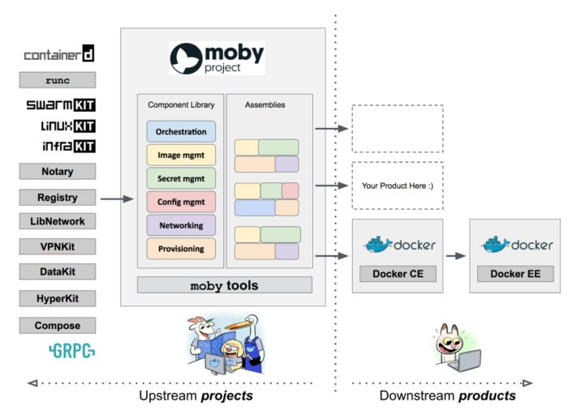

# windows 与 moby

[virtualization/windowscontainers/deploy-containers/linux-containers](https://docs.microsoft.com/en-us/virtualization/windowscontainers/deploy-containers/linux-containers) 中提到 `before Hyper-V isolation or Linux containers on Windows were available`这个之前，windows最早（2016发布）使用hyper-v上跑的基于linuxkit的虚机来运行linux容器，用的是上图这个模型（新版本 - wls2已经不是了）。

