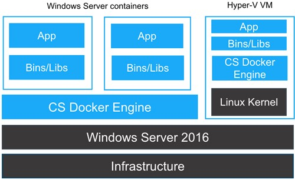

# knowledge


## isolation model

* process isolation: docker的“传统”隔离方式

  ```sh
  docker run -it --isolation=process mcr.microsoft.com/windows/servercore:ltsc2019
  ```

  

  

* hyper-v isolation（接近于vm isolation）

  ```sh
  docker run -it --isolation=hyperv mcr.microsoft.com/windows/servercore:ltsc2019 cmd
  ```

  

  


> 不过linux container只支持`default` isolation
>
> ```sh
> PS C:\windows\system32> docker run -it --isolation=process mcr.microsoft.com/windows/servercore:ltsc2019
> docker: Error response from daemon: Invalid isolation: "process" - linux only supports 'default'.
> See 'docker run --help'.
> PS C:\windows\system32> docker run -it --isolation=hyperv mcr.microsoft.com/windows/servercore:ltsc2019 cmd
> docker: Error response from daemon: Invalid isolation: "hyperv" - linux only supports 'default'.
> See 'docker run --help'.
> ```


### 版本支持

host os版本 对于 os image版本（前后都是说windows）的支持：

* hyper-v isolation： 基本上向下兼容，高版本host os对于低版本os image都支持

* process isolation： 只支持同版本（如果是win 10 host -> win server的话，win 10 2004才开始支持）

  > 好像从1903开始，win和win server版本开始对齐


## run mode

* native docker： 参考： [Dockerfile on Windows](https://docs.microsoft.com/en-us/virtualization/windowscontainers/manage-docker/manage-windows-dockerfile)中有native dockerfile的编写参考

  有相关的（windows）docker service，等等

  可以被k8s调度

  win server版本好像只支持这个。

* docker for windows

  好像是vm模式，基于底层虚拟化技术。 hyper-v vm or 只用hyper-v虚拟化


## `linux container` vs `windows container`




`docker desktop for windows`支持二者的切换，从实际效果看大约是：

* `linux container`

* `windows container` ： 切换到windows native container，变化如下

  * 此时开始使用 `C:\ProgramData\Docker`

  * 访问的应该不是同一个docker daemon了，从distro（vm）中的docker切换到docker-engine（dockerd，`C:\Program Files\Docker\Docker\resources\dockerd.exe" --run-service --service-name docker -G docker-users --config-file C:\ProgramData\DockerDesktop\tmp-d4w\daemon.json` 这个？）

  * 自然地，原先的镜像、容器数据都看不到了

  * 可以运行windows image了

    如： `docker run -it mcr.microsoft.com/windows/nanoserver:1903 cmd.exe`

```sh
# linux container
$ docker info
Client:
 Context:    default
 Debug Mode: false
 Plugins:
  app: Docker App (Docker Inc., v0.9.1-beta3)
  buildx: Build with BuildKit (Docker Inc., v0.5.1-docker)
  scan: Docker Scan (Docker Inc., v0.5.0)

Server:
 Containers: 85
  Running: 78
  Paused: 0
  Stopped: 7
 Images: 45
 Server Version: 20.10.3
 Storage Driver: overlay2
  Backing Filesystem: extfs
  Supports d_type: true
  Native Overlay Diff: true
 Logging Driver: json-file
 Cgroup Driver: cgroupfs
 Cgroup Version: 1
 Plugins:
  Volume: local
  Network: bridge host ipvlan macvlan null overlay
  Log: awslogs fluentd gcplogs gelf journald json-file local logentries splunk syslog
 Swarm: inactive
 Runtimes: io.containerd.runc.v2 io.containerd.runtime.v1.linux runc
 Default Runtime: runc
 Init Binary: docker-init
 containerd version: 269548fa27e0089a8b8278fc4fc781d7f65a939b
 runc version: ff819c7e9184c13b7c2607fe6c30ae19403a7aff
 init version: de40ad0
 Security Options:
  seccomp
   Profile: default
 Kernel Version: 4.19.128-microsoft-standard
 Operating System: Docker Desktop
 OSType: linux
 Architecture: x86_64
 CPUs: 4
 Total Memory: 4.82GiB
 Name: docker-desktop
 ID: ZIKR:SSVA:IHD5:OKO6:W6MX:IVJI:S5OT:FOR3:IVCW:LIP5:6VDC:5CS4
 Docker Root Dir: /var/lib/docker
 Debug Mode: false
 Registry: https://index.docker.io/v1/
 Labels:
 Experimental: false
 Insecure Registries:
  127.0.0.0/8
 Live Restore Enabled: false
```


```sh
# after converting to windows container
$ docker info
Client:
 Context:    default
 Debug Mode: false
 Plugins:
  app: Docker App (Docker Inc., v0.9.1-beta3)
  buildx: Build with BuildKit (Docker Inc., v0.5.1-docker)
  scan: Docker Scan (Docker Inc., v0.5.0)

Server:
 Containers: 1
  Running: 0
  Paused: 0
  Stopped: 1
 Images: 1
 Server Version: 20.10.2
 Storage Driver: windowsfilter
  Windows:
 Logging Driver: json-file
 Plugins:
  Volume: local
  Network: ics internal l2bridge l2tunnel nat null overlay private transparent
  Log: awslogs etwlogs fluentd gcplogs gelf json-file local logentries splunk syslog
 Swarm: inactive
 Default Isolation: hyperv
 Kernel Version: 10.0 19042 (19041.1.amd64fre.vb_release.191206-1406)
 Operating System: Windows 10 Pro Version 2009 (OS Build 19042.804)
 OSType: windows
 Architecture: x86_64
 CPUs: 8
 Total Memory: 31.87GiB
 Name: yonka-xxx
 ID: xxx:xxx
 Docker Root Dir: C:\ProgramData\Docker
 Debug Mode: false
 Registry: https://index.docker.io/v1/
 Labels:
 Experimental: false
 Insecure Registries:
  127.0.0.0/8
 Live Restore Enabled: false
 Product License: Community Engine
```


```sh
docker context ls
NAME                TYPE                DESCRIPTION                               DOCKER ENDPOINT                  KUBERNETES ENDPOINT   ORCHESTRATOR
default *           moby                Current DOCKER_HOST based configuration   npipe:////./pipe/docker_engine                         swarm
```

前后都是这样，所以对于docker client来说透明，也许只是这个pipe的指向发生变化了


## wsl1 vs wsl2

 In WSL 2 mode, you can configure limits on the memory, CPU, and swap size allocated to the [WSL 2 utility VM](https://docs.microsoft.com/en-us/windows/wsl/release-notes#build-18945).

wsl2下，资源管理是windows进行的，所以docker软件`resource - advanced tab`不可见。 wsl1的`windows container`模式也是


* wsl1似乎是基于moby vm做的，hyper-v - moby-vm - docker

* wsl2是`Linux containers with Hyper-V isolation run each Linux container (LCOW) in an optimized Linux VM with just enough OS to run containers`

  ref： [Demystifying Docker Containers Support on Windows 10 and Windows Server 1709](https://medium.com/@waelkdouh/demystifying-docker-containers-support-on-windows-10-and-windows-server-2016-592f1c09a5e1)

  

## impl details - wsl2


### 数据存储

以虚拟磁盘形式： `C:\Users\<username>\AppData\Local\Docker\wsl`下

* `distro` 对应 `docker-desktop` 这个wsl distro
* `data` 对应 `docker-desktop-data`这个


## docker desktop for windows


> [stackoverdlow-What's the difference between Docker for Windows and Docker on Windows?](https://stackoverflow.com/questions/38464724/whats-the-difference-between-docker-for-windows-and-docker-on-windows/40320748#:~:text=2%20Answers&text=Docker%20on%20Windows%20is%20a,so%20yes%20Windows%20containers%20only.&text=Docker%20Desktop%20for%20Windows%20is,and%20Windows%20containers%20on%20Windows.)
>
> **Docker on Windows** is a colloquial way to refer to just **the Docker Engine running on Windows**. I find it helpful to think of this as a **Windows Container Host**, so yes **Windows containers only**. This would be what you would run on a Windows Server 2016 machine. So maybe a better name is **Docker for Windows Server** which I believe people have used as well. I still prefer a Windows Container Host. Which means it only has the Docker Engine at the end of the day, doesn't even need to have any of the Docker clients (docker CLI, docker-compose, etc).
>
> **Docker Desktop for Windows** is a product meant for running **both Linux and Windows containers on Windows**. It's **not meant for a production environment**, and instead is meant for a desktop/client SKU of Windows, hence the Windows 10 requirement. So you could think of this as Docker for Windows 10. Because DfW can run both container types, there are different configurations that it sets up on your machine:
>
> - When using Linux Containers, DfW creates a MobyLinuxVM with Hyper-V inside of which it runs Linux containers, transparently, as if they were running on the Windows 10 host.
> - When using Windows Containers, DfW installs the same components as Docker on Windows so that you have a Windows Container Host. You have the Windows Docker Engine setup now. This then allows you to run windows containers on a Win 10 client SKU.
>
> Theoretically you could install DfW on Windows Server, I haven't tried so I don't know if this would fail, but why would you want to run Linux containers on a Windows Host in production? In production, you would have Linux Container Hosts that run linux containers and Windows Container Hosts that run windows containers, this would avoid overhead and simplify things.


## client-daemon交互

* 默认通过`//./pipe/docker_engine`连接


# tutorial


## config


### 软件settings

#### resource-advanced

以下两种情况不可见，因为此时资源管理由windows进行：

* wsl2 backend
* windows container（而不是linux container）


## 数据存储


### image存储位置迁移


* 不带数据
* 带数据


* linux container
* windows container


https://serverfault.com/questions/975980/how-to-move-docker-images-to-other-drive-in-windows 提到可以改`data-root`配置，类似`"data-root":"D:\\Docker\\data-root" `（新版本，老版本是`graph`）。 不过：

* 好像不会迁移已有数据

* 对于wsl2，`data-root`需要是wsl目录

  所以直接改为普通目录，会导致docker起不来，可以用以下方式来重建（而无需+不能改`data-root`了）

  ref: [github/docker/for-win Moving Docker wsl files #5829](https://github.com/docker/for-win/issues/5829)

类似如下：

```sh
# ！！！ 注意
# docker-desktop 这个好像需要在c盘下（可以其他目录），否则会挂载c盘下的一些iso失败。 我两个都搞到d盘后启动报错，后来重启wsl distros和docker desktop for windows后启动成功，但此时发现docker-desktop又被搞回（c盘下）原来位置了
# 所以这个干脆别移算了，反正也不大

cd /d/
STORE=wslStore
mkdir ${STORE}
cd ${STORE}
for name in docker-desktop docker-desktop-data; do
  wsl -t ${name}
done
for name in docker-desktop-data; do  # docker-desktop docker-desktop-data
  mkdir ${name}
  wsl --export ${name} ${name}.tar
  wsl --unregister ${name}
  wsl --import ${name} ${name} ${name}.tar
  rm ${name}.tar  # 可以运行ok后再删除
done
```


