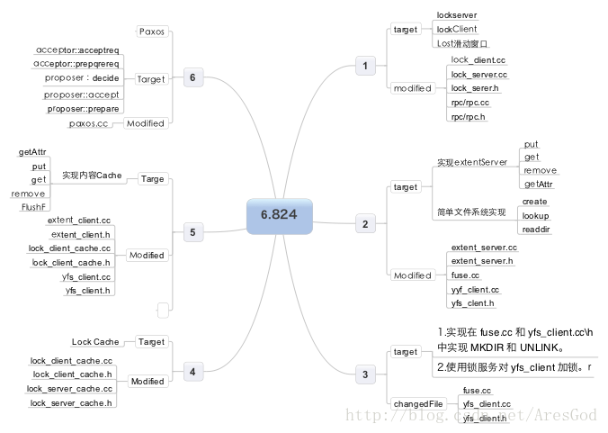

ref:

*   [有一起上cmu分布式系统的么 - 1point3acres](http://www.1point3acres.com/bbs/thread-154943-1-1.html)

    > 15-440, 有go的作业，可以练习网络编程（套接字tcp/udp, p2p等等）难度还蛮大的 
    >
    > ​
    >
    > **补充内容 (2015-12-5 23:09):**
    >
    > 刚[申请](http://www.1point3acres.com/application-guide/)了一个qq群， 明天通过了补上号码。
    >
    > ​
    >
    > **补充内容 (2015-12-7 21:49):**
    >
    > 472336742 QQ群
    >
    > 等我建个课程页面。有啥好的建议不
    >
    > ​
    >
    > **补充内容 (2015-12-13 17:19):**
    >
    > ppt/作业 [https://www.cs.cmu.edu/~dga/15-440/S14/assignments.html](https://www.cs.cmu.edu/%7Edga/15-440/S14/assignments.html)
    >
    > 视频可以看 UMass的 [http://lass.cs.umass.edu/~shenoy/courses/677/lectures.html](http://lass.cs.umass.edu/%7Eshenoy/courses/677/lectures.html)
    >
    > MIT分布式的有[https://pdos.csail.mit.edu/6.824/](https://pdos.csail.mit.edu/6.824/) 微信群在下

* [分布式系统MIT 6.824学习资源 - CSDN blog](http://blog.csdn.net/hellochenlu/article/details/52142621)

  > 分布式学习资源：
  >
  > https://github.com/ty4z2008/Qix/blob/master/ds.md
  >
  > 学习笔记：
  >
  > mit-6.824-2016: https://www.douban.com/note/546338838/
  >
  > lab1 - lab3学习笔记: http://haoxiang47.github.io/
  >
  > lab2：
  >
  > viewservice：
  >
  > https://segmentfault.com/a/1190000004846986
  >
  > http://www.klion26.com/tag/viewservice   
  >
  > http://blog.csdn[.NET](http://lib.csdn.net/base/dotnet)/yek14/article/details/43851351
  >
  > Paxos：https://segmentfault.com/a/1190000005147601
  >
  > Raft：https://segmentfault.com/a/1190000004961650
  >
  > http://www.klion26.com/tag/6-824
  >
  > 源码资源：
  >
  > https://github.com/bluesea147/6.824
  >
  > https://github.com/william-cheung/mit-6.824-2015
  >
  > 实验分析：
  >
  > http://blog.csdn[.Net](http://lib.csdn.net/base/dotnet)/sunliymonkey/article/details/46764619
  >
  > Raft优化：
  >
  > http://www.tuicool.com/articles/MV77ba
  >
  > 开源分布式[数据库](http://lib.csdn.net/base/mysql)[Go](http://lib.csdn.net/base/go)语言实现：
  >
  > Tidb:
  >
  > https://github.com/pingcap/tidb
  >
  > https://github.com/pingcap/tikv
  >
  > http://blog.csdn.net/stark_summer/article/details/48860221
  >
  > Caskdb: 
  >
  > https://github.com/JWZH/caskdb
  >
  > 参考博客
  >
  > 吴镝（阿里分布式大牛）[http://www.cnblogs.com/foxmailed/p/3418143.html](http://www.cnblogs.com/foxmailed/p/3418143.html)
  >
  > Mit 6.824 助教：https://thesquareplanet.com/blog/students-guide-to-raft/

* [Mit 分布式系统导论,Distributed Systems ,lab1 -lab6 总结，实验一到实验六总结](http://blog.csdn.net/aresgod/article/details/9285465)

  

* [如何的才能更好的学习MIT6.824分布式系统课程？](https://www.zhihu.com/question/29597104)

* 刘浩6.824笔记 （from [知乎回答](https://www.zhihu.com/question/29597104/answer/129995189)）

  > [MIT 6.824 Week 1 notes](https://link.zhihu.com/?target=https%3A//www.douban.com/note/546338838/)
  > [MIT 6.824 Week 2 notes](https://link.zhihu.com/?target=https%3A//www.douban.com/note/547699119/)
  > [MIT 6.824 Week 3 notes](https://link.zhihu.com/?target=https%3A//www.douban.com/note/549229678/)
  > [MIT 6.824 Week 4 notes](https://link.zhihu.com/?target=https%3A//www.douban.com/note/550689237/)
  > [MIT 6.824 Week 5 notes](https://link.zhihu.com/?target=https%3A//www.douban.com/note/552189736/)
  > [MIT 6.824 Week 6 notes](https://link.zhihu.com/?target=https%3A//www.douban.com/note/553592081/)
  > [MIT 6.824 Week 7 notes](https://link.zhihu.com/?target=https%3A//www.douban.com/note/556255004/)

* [MIT课程《Distributed Systems 》学习和翻译 - github](https://github.com/feixiao/Distributed-Systems)

* [awesome-distributed-systems](https://github.com/kevinxhuang/awesome-distributed-systems)

* [袖珍分布式系统](http://book.mixu.net/distsys/single-page.html) 笔记如下

  * [一](http://www.jianshu.com/p/b46728051f51)
  * [二](http://www.jianshu.com/p/f51ba6c7bd81)
  * [三](http://www.jianshu.com/p/f0993c83cdf5)
  * [四](http://www.jianshu.com/p/558974ede572)

