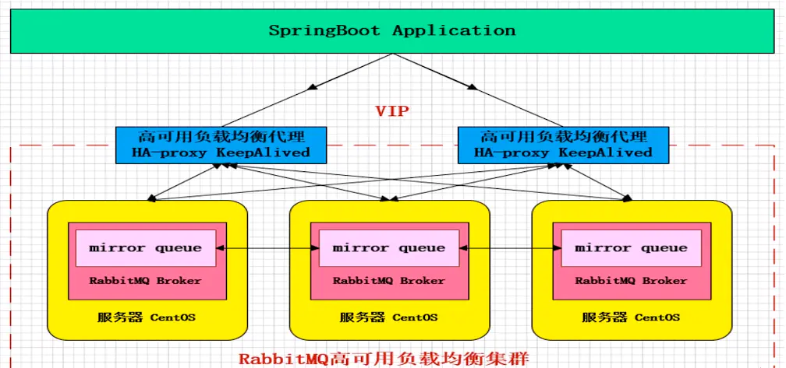

## AMQP理解

### arch

* 单机模式： 单一实例

* HA或者就cluster吧（普通集群确实算不上ha）

  * 普通集群

    * 每个queue只存在于创建它的broker
  
    * 读转发
    大量内部通讯（考虑到一般读多）
      
    > 默认模式，以两个节点（rabbit01、rabbit02）为例来进行说明。对于Queue来说，消息实体只存在于其中一个节点rabbit01（或者rabbit02），rabbit01和rabbit02两个节点仅有相同的元数据，即队列的结构。当消息进入rabbit01节点的Queue后，consumer从rabbit02节点消费时，RabbitMQ会临时在rabbit01、rabbit02间进行消息传输，把A中的消息实体取出并经过B发送给consumer。所以consumer应尽量连接每一个节点，从中取消息。即对于同一个逻辑队列，要在多个节点建立物理Queue。否则无论consumer连rabbit01或rabbit02，出口总在rabbit01，会产生瓶颈。当rabbit01节点故障后，rabbit02节点无法取到rabbit01节点中还未消费的消息实体。如果做了消息持久化，那么得等rabbit01节点恢复，然后才可被消费；如果没有持久化的话，就会产生消息丢失的现象。
      >
      > from [Rabbitmq集群高可用部署详细](https://www.cnblogs.com/knowledgesea/p/6535766.html)
  
  * 镜像集群
  
    
    
    * 每个broker都有每个queue的数据，或者说每个queue都存在于每个broker
      这点严重限制扩展性
    * 写转发 - 多写


[RabbitMQ 的4种集群架构](https://www.jianshu.com/p/b7cc32b94d2a) 提到了很多，异地多活等。


### model

* client(consumer/producer)

* server(broker)

  * virtual host

    类似namespace概念
    conn - auth - 确定vh
    conn level，也即同一conn上所有channels只能访问同一个vh

    vh的配置是在server侧，不暴露给client

    * exchange（类比main transfer agent - MTA）

      * 持久化类型
        * durable - until deleted
        * transient - until server shutdown
        * auto-deleted - until unused

      * 类型

        * `direct`: binding key `K` == routing key `R`
        * `topic`: `K`支持通配
          首先，需要是`.`分隔的多个word； 然后`*`表示通配**一个word**而`#`表示通配**0 or more words**。 也即`*.cc.#`的`K`能匹配`R`为`bb.cc`,`bb.cc.dd.ee` 但不能匹配 `cc.dd`
        * `fanout`: 简单的转发，无需匹配，1:n
        * `headers`: bind时指定一个表： 一组headers，以及可选的对应的值（也即可以没有值，只要求消息包含这些头？）
          配置方式如下：
          参数表（键值对）中的`x-match`参数，其后的**所有**键值对都视为匹配参数。 根据本参数的值来决定匹配行为：
          * `all`: 所有键值对都需要包含才视为匹配
          * `any`: 包含任一键值对即视为匹配

          同时，如前所述，对于一个键值对： 如果没有值则只需消息headers包含该键即认为匹配
        * `system`
        * 实现特定的其他类型： 需要以`x-`开头

    * queue(类比mailbox): a named buffer that holds messages on behalf of a set of consumer applications

      * 消息顺序： 有限FIFO - 来自同一个producer的消息，如果权重一样的话，会以queue里的顺序投递给consumer （是不是说也是producer发送的顺序呢？）
        考虑到有些投递不代表被消费（需要ack），所以实际消费的顺序可能会乱

      * ”操作“

        一些概念：
        * acquire
          应该与acquire-release的acq同义
        * deliver
          发送给consumer，不一定代表消息被consume
        * consume
          大约等于dequeue吧
        * dequeue
          dequeue操作需要acquire
        * 类似prefetch、non-destructive browse
          表示不导致消息出队的读取

      * 生命周期

    * binding/criteria: a relationship between a queue and an exchange(也即 queue `-routing args-` exchange)

      消息类比email
      routing-key类比email地址
      binding类比MTA的路由表条目

      > yonka: 似乎，queue、binding越多，一个消息要“经历”的路由也越多？ 跟实际路由不同的是，这里是要转给所有匹配的queue吧


### 体会

* 亮点：

  * 数据和“用途”分开： exchange、queue
  * 在“用途”侧存储： queue
  * 允许数据的重新组合： binding

### 几个配置示例（伪码）

```
# shared queue

Queue.Declare
	queue=app.svc01
	exclusive=FALSE
	
Message.Subscribe
	queue=app.svc01
	
Message.Transfer
	routing_key=app.svc01
```


```
# exclusive queue

Queue.Declare
	queue=tmp.550e8400-e29b-41d4-a716-446655440000
	exclusive=TRUE
	
Message.Transfer
	routing_key=tmp.550e8400-e29b-41d4-a716-446655440000
```


```
# pub-sub subscription queue

Queue.Declare
	queue=tmp.2
	auto_delete=TRUE
	
Exchange.Bind
	exchange=amq.topic
	TO
	queue=tmp.2
	WHERE routing_key=STOCK.USD.*

Message.Subscribe
	queue=tmp.2
```


### protocol

* transport layer

* session layer

* model layer

### msg

body + headers + routing info

* route

  * default flow

    * default exchange
    * default binding

      routing key vs queue name，也即，producer直接把消息怼进queue了

  * 不可路由时： 根据producer指示的方式处理

    * 静默丢弃
    * reject
    * 路由到alternative exchange

* 优先级

  * 高优先级的消息可能先于低优先级的消息投递
  * 如果确实需要丢弃消息时，低优先级的消息会先被丢弃

* 入queue

  * 先尝试发给consumer
  * 没法发时进行存储（易失性（内存缓存等）或持久化）

* 发送

  consumer可以： 
  * ack
  * nack（reject）
  * `release a message back onto the queue` 
    这个啥意思？ 消息再发回去？ 原来的不是还在么？

* 删除

  可以是 发送完立即删除，也可以是 等consumer ack后删除 - 由subscriber（consumer）指定


### 消息流程

（1）建立连接Connection。由producer和consumer创建连接，连接到broker的物理节点上。 

（2）建立消息Channel。Channel是建立在Connection之上的，一个Connection可以建立多个Channel。

 producer连接Virtual Host 建立Channel，Consumer连接到相应的queue上建立Channel。 

（3）发送消息。由Producer发送消息到Broker中的exchange中。 

（4）路由转发。exchange收到消息后，根据一定的路由策略，将消息转发到相应的queue中去。 

（5）消息接收。Consumer会监听相应的queue，一旦queue中有可以消费的消息，queue就将消息发送给

 Consumer端。 

（6）消息确认。当Consumer完成某一条消息的处理之后，需要发送一条ACK消息给对应的Queue。

 Queue收到ACK信息后， 才会认为消息处理成功，并将消息从Queue中移除；如果在对应的Channel断开后，

 Queue没有收到这条消息的ACK信息， 该消息将被发送给另外的Channel。 至此一个消息的发送接收流程走完

 了。消息的确认机制提高了通信的可靠性。


### queue-broker路由

网上的producer example都是：

1. create connection（factory），传入地址（ip、host）
2. declare queue（不存在会创建）
3. publish

这意味着，**事先知道queue（应该）在哪个broker上**


### transaction

似乎是说可以在一个`transaction`里send（对于producer角色） or accept（对于consumer角色）等多个操作，然后commit（实际发出cmd？）或者rollback

* rollback不影响acquire，也即transaction期间投递给该consumer的消息仍然保持acquired，而如果希望清除该状态的话，需要发release命令
* 路由到哪个queue是在publish而不是commit时确定，所以如果要reject的话，不会等到commit时。 同样的，reject也不会导致事务回滚

支持的事务：
* 一阶段提交事务模型（`tx`）
* 二阶段提交事务模型（`dtx`）

  

### view

* producer

  producer -msg-> broker(exchange)

* consumer

  这一侧比较复杂：

  * consumer -pull-> broker
  * consumer <-push- broker
  * consumer -配置操作-> broker
    如：
    * 创建、删除queue
    * 配置binding

### usage

* produce/send

  * 怎么确认消息已到达broker？

      * transaction commit - 性能较低
      * channel confirm模式

        > 一旦信道进入confirm模式，所有在该信道上面发布的消息都会被指派一个唯一的ID(从1开始)，一旦消息**被投递到所有匹配的队列**之后，broker就会发送一个确认给生产者（包含消息的唯一ID）,这就使得生产者知道消息已经正确到达目的队列了，如果消息和队列是可持久化的，那么确认消息会将消息写入磁盘之后发出，broker回传给生产者的确认消息中deliver-tag域包含了确认消息的序列号，此外broker也可以设置basic.ack的multiple域，表示到这个序列号之前的所有消息都已经得到了处理
        > 该过程是异步的，可以回调处理结果； 可能ack（confirm）也可能nack

* consume
  
  * 怎么消息已经到达消费者（并且被正确的处理掉）？

    * 消息确认机制

      消费者在声明队列时，可以指定noAck参数，当noAck=false时，RabbitMQ会等待消费者显式发回ack信号后才从内存(和磁盘，如果是持久化消息的话)中移去消息。否则，RabbitMQ会在队列中消息被消费后立即删除它。

      采用消息确认机制后，只要令noAck=false，消费者就有足够的时间处理消息(任务)，不用担心处理消息过程中消费者进程挂掉后消息丢失的问题，因为RabbitMQ会一直持有消息直到消费者显式调用basicAck为止。

      当noAck=false时，对于RabbitMQ服务器端而言，队列中的消息分成了两部分：一部分是等待投递给消费者的消息；一部分是已经投递给消费者，但是还没有收到消费者ack信号的消息。如果服务器端一直没有收到消费者的ack信号，并且消费此消息的消费者已经断开连接，则服务器端会安排该消息重新进入队列，等待投递给下一个消费者（也可能还是原来的那个消费者）。

      RabbitMQ不会为未ack的消息设置超时时间，它判断此消息是否需要重新投递给消费者的唯一依据是消费该消息的消费者连接是否已经断开。这么设计的原因是RabbitMQ允许消费者消费一条消息的时间可以很久很久。

