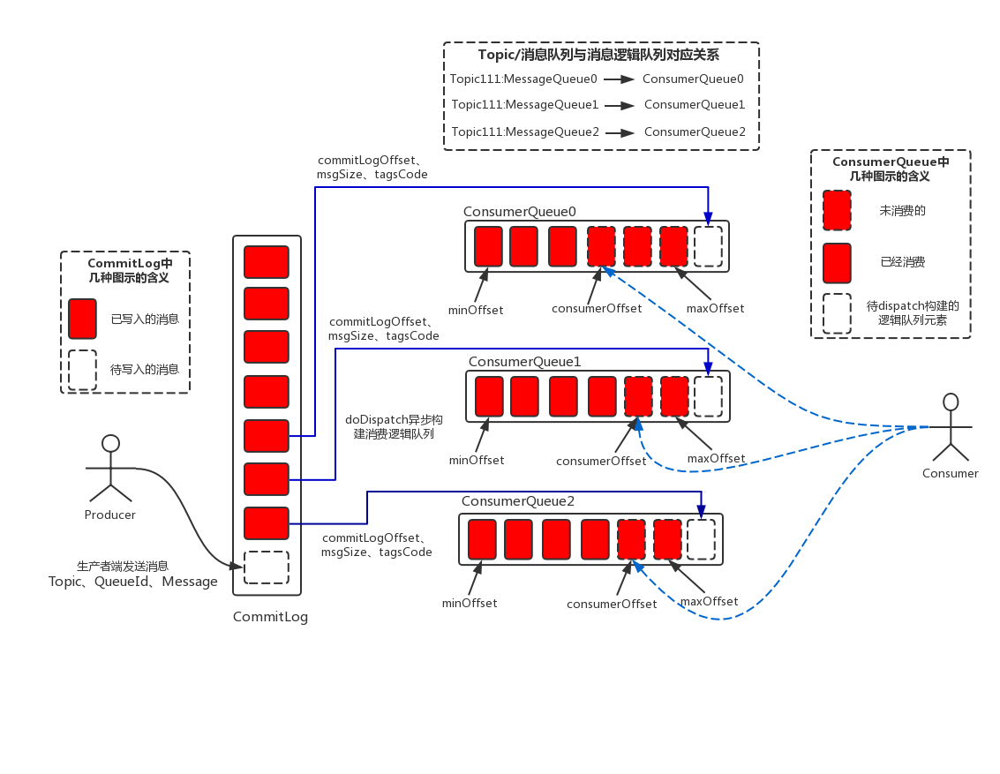

startup见 [rocketmq_startup](./rocketmq_startup_yonka.md)

参考资料： 

* 官方文档
  * [RocketMQ原理简介](RocketMQ_design.pdf)
  * [RocketMQ最佳实践](RocketMQ_experience.pdf)
  * [RocketMQ开发指南](https://pan.baidu.com/s/1CiuYIM_JQppgoaQN05VTCw)
    > 提取码 wog2 

    跟原理那个文档有部分重叠，增加了用户接入部分内容

### 消息

* producer角度

  * topic: 必须
  * body: 必须，binary
  * tags: 可选，用于过滤消息
  * keys: 可选，用于创建哈希索引
    
    > TODO 确认tags和keys的实际使用方式和场景
  * flag: 可选，int，默认0
    业务方自行定义语义，mq纯透传
  * delayTimeLevel: 可选，int，默认0
  * waitStoreMsgOK: 可选，bool，默认为true
    是否落盘后才返回应答 


### 基于topic： 队列集合

> 疑问：
> * 是否每个topic（的多个queue）只分布在一个主上？ --- *应该不是，否则没HA了。 应该是分散到多个组，每个组内master/slave镜像存在分配的queues*
>   类似的，master/slave的slave是对应master的完全镜像 还是 部分topics的slave？ --- *从下面master/slave机制来看是完全镜像*
> * commitLog是否per-topic，还是master上负责的所有topics合用？ --- *应该要合用* --- *确认是所有topics合用，以保持全局顺序写*
> * queue index file中描述的offset要有意义的话，意味着slave上的commitLog需要和master一致吧？ --- *是*

* topic怎么分配？ topic的queues怎么分配？
  > TODO 疑问


### 消费方式： pull（+ack)

* 支持at least once（不支持exact once）

* 消息LB

  * 广播消费模式： 所有队列的消息都会发给（每个）consumer
  * 集群消费模式： 会在队列级别进行LB发给某个consumer，也即 `多个Consumer实例平均消费这个topic对应的队列集合`
    
    > 一个队列只会分配给某一个consumer
    
    > 分配是如何实现的？ 见下面

* consumer group： 对应上面的集群概念
  * 也即实际的LB是会在group内进行；
  * 不过group本身也可以设置为广播模式，也即group的每个consumer会消费全量消息；
    


#### consumer分配queues


> 以下流程是per-topic的

* broadcast模式： 自然无所谓分配，all

* cluster模式： 是consumer（sdk）侧自行决定，根据 `consumerGroup`,`consumerId`,`allConsumerIds`,`allQueues`来选择 

  参见`AllocateMessageQueueStrategy.allocate`，该接口的不同实现中定义了不同的分配算法

  所以，consumer才需要感知group中consumers的变化。 而变化后会重新计算本consumer要消费的queues，同时更新pull任务（对于pullConsumer）： 删除不再消费的queue的订阅任务，新增...的...
  
  > 这个“感知”似乎是轮询，由`rocketmq.client.rebalance.waitInterval`指定的间隔(默认20s)尝试rebalance，其中会per-topic的尝试rebalance


### 生产（发布）方式

* 消息LB
  轮流发给同一个topic的不同队列
* producer group


### 消息处理

* 消息顺序性

  需要producer按序串行发送到指定queue

  * 普通顺序： failover时queue数目变化导致取模结果发生变化，从而会乱序
    
    > 没有提这种是如何实现的，怀疑不是指定queue，而是使用同一个“路由key”
  * 严格顺序： 可用性降低
  
    > 也许就是上面说的直接指定queue

* 消息过滤
  


### 消息存储（缓冲）

* 长度

  队列持久化磁盘+定期清除： 没有内存buffer概念，或者说`RocketMQ的内存Buffer抽象成一个无限长度的队列，不管有多少数据进来都能装得下，这个无限是有前提的，Broker会定期删除过期的数据，例如Broker只保存3天的消息，那么这个Buffer虽然长度无限，但是3天前的数据会被从队尾删除`

  > TODO 疑问： 
  > * 是否支持size limit
  > * 没有size limit的情况下，时间限制达到之前磁盘爆了怎么办？

* commitLog、queue index

  * commitLog: 负责的所有topics的所有queues的消息都写在同一个commitLog中（可能按时间（？）split为顺序的多个文件吧）

  * queue index
    queue差不多可以认为是queue中消息的索引信息，类似：
    ```sh
    queue = []offset
    offset = {CommitLogOffset(8 bytes), Size(4 bytes), MessageTagHashCode(8 bytes)}
    ```

  

* 消息读取

  先读取queue，拿到offset信息后再**随机**读取commitLog中的消息内容

* 消息写入

  串行写入（主要是commitLog吧，queue index呢？）

* 消息查询
  * 可以通过MsgId来查询消息
    `MsgId`: `消息所属的broker地址`（8 bytes） + `CommitLogOffset`（8 bytes）
  * 通过MsgKey来查询消息


### 角色

master/slave

* master -> slave 一对多，也即一个slave只能是从属于某一个master

* brokerName来确定关系，同样brokerName的属于同一组。 brokerId来区分角色，0为master其他为slave


### “发现”： nameserver

* consumer - nameserver

  * 每个consumer -连接-> 随机选择的一个nameserver

  * 每个consumer -连接-> 需要访问的topic的对应master/slave brokers

    发送心跳
    可以从master或者slave订阅消息，由broker配置而定

* producer - nameserver

  * 每个producer -连接-> 随机选择的一个nameserver

  * 每个producer -连接-> 需要访问的topic的对应master brokers

    发送心跳

* broker - nameserver

  * 每个broker -连接-> all nameservers
    定时注册topic（queues）信息

### 流程


#### consumer侧


0. 启动配置确定 consumerGroup，而consumerId（instanceId）是启动时build出来的

   大约是： `ip`+`instanceName`(from `rocketmq.client.name`)+`unitName` 

1. 通过nameserver拿到：
   * topic-queues信息
   * topic-brokers信息
     一个topic的brokers组织成多“组”；
     同一组broker地址会有多个(master、slaves)，brokerName相同，brokerId不同

2. 向broker获取consumer list，然后计算出自己应该被“分配”到哪些queues(per-topic)
  broker地址是从ns拿到，这里是随机选择一组broker然后选址
  
  > TODO 疑问： 这个随机会导致每次选到不同的broker(组)，那难道consumer是连接到所有brokers？然后在每个broker上进行特定topic的queues分配？ 即使这样，也不能靠随机啊

3. 向"分配的queues"发起pull，期间会进行选址
  因为一个特定的queue只会在一组broker上，所以这里其实只是同组brokers内选择


### 通信协议

见 `RocketMQ原理简介` 文档


### HA

* broker重启

  支持优雅关闭： 手动从nameserver摘除，然后再重启。

  > 不过还是会导致topic queues数量发生变化吧，然后... 普通顺序消息 受影响

* 部署

  * 单master

  * 多master

  * 多Master多Slave模式

    > 看文档里主要是指 1 master 1 slave 为一组，然后存在多组
  
    * 同步双写
    * 异步复制


## TODO

用户指南的 7.3.2 - 9 阅读
