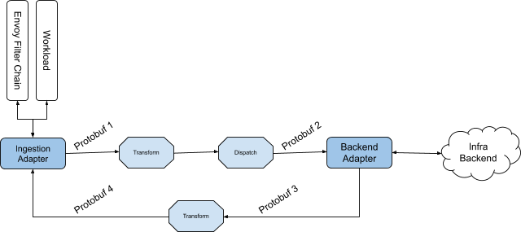
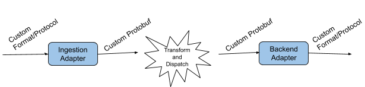
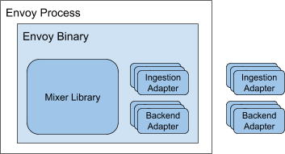
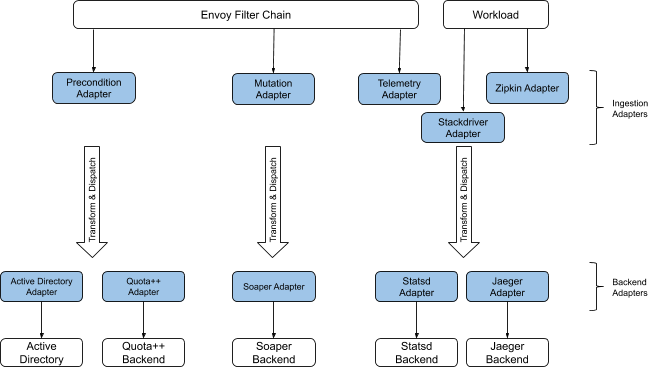
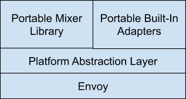

Shared with Istio Community  

| **Mixer V2 Architecture**                                    |                                                              |
| ------------------------------------------------------------ | ------------------------------------------------------------ |
| **Owner**:  mtail@google.com**Work-Group:**  Policies and Telemetry**Short self link:** **Reviewers**: xxxx[ ], xxx [] | **Status**: WIP \| **In Review** \| Approved \| Obsolete **Created**: 12/18/2018**Release Version:** N/A**Approvers**: xxx [], xxx [] |
|                                                              |                                                              |



[TL;DR](https://docs.google.com/document/d/1QKmtem5jU_2F3Lh5SqLp0IuPb80_70J7aJEYu4_gS-s/edit?pli=1#heading=h.79otdebitosi)

[Mixer V1](https://docs.google.com/document/d/1QKmtem5jU_2F3Lh5SqLp0IuPb80_70J7aJEYu4_gS-s/edit?pli=1#heading=h.6ng9b84jfs8o)

[Adapter Models](https://docs.google.com/document/d/1QKmtem5jU_2F3Lh5SqLp0IuPb80_70J7aJEYu4_gS-s/edit?pli=1#heading=h.oxs3tiufhnl5)

[Pros and Cons](https://docs.google.com/document/d/1QKmtem5jU_2F3Lh5SqLp0IuPb80_70J7aJEYu4_gS-s/edit?pli=1#heading=h.rubtixgw1mmt)

[Value Proposition](https://docs.google.com/document/d/1QKmtem5jU_2F3Lh5SqLp0IuPb80_70J7aJEYu4_gS-s/edit?pli=1#heading=h.4613vba2qg7b)

[Guiding Principles](https://docs.google.com/document/d/1QKmtem5jU_2F3Lh5SqLp0IuPb80_70J7aJEYu4_gS-s/edit?pli=1#heading=h.kbgj6l4oh52f)

[Architecture](https://docs.google.com/document/d/1QKmtem5jU_2F3Lh5SqLp0IuPb80_70J7aJEYu4_gS-s/edit?pli=1#heading=h.j9uaio7rrpkl)

[Physical Manifestation](https://docs.google.com/document/d/1QKmtem5jU_2F3Lh5SqLp0IuPb80_70J7aJEYu4_gS-s/edit?pli=1#heading=h.ti0bcu54ukrt)

[Logical Composition](https://docs.google.com/document/d/1QKmtem5jU_2F3Lh5SqLp0IuPb80_70J7aJEYu4_gS-s/edit?pli=1#heading=h.lcng1eqnnlwy)

[Controlling Backend Adapters](https://docs.google.com/document/d/1QKmtem5jU_2F3Lh5SqLp0IuPb80_70J7aJEYu4_gS-s/edit?pli=1#heading=h.cs6djjmistk6)

[Precondition Adapter](https://docs.google.com/document/d/1QKmtem5jU_2F3Lh5SqLp0IuPb80_70J7aJEYu4_gS-s/edit?pli=1#heading=h.tz9wgmyrmoi0)

[Experimental Mode](https://docs.google.com/document/d/1QKmtem5jU_2F3Lh5SqLp0IuPb80_70J7aJEYu4_gS-s/edit?pli=1#heading=h.6bbgtbi9w1va)

[Mixer Model vs. Envoy ext_authz Filter](https://docs.google.com/document/d/1QKmtem5jU_2F3Lh5SqLp0IuPb80_70J7aJEYu4_gS-s/edit?pli=1#heading=h.jivoozigmx2p)

[Integration Point](https://docs.google.com/document/d/1QKmtem5jU_2F3Lh5SqLp0IuPb80_70J7aJEYu4_gS-s/edit?pli=1#heading=h.74ixtq5v2chy)

[Mutation Adapter](https://docs.google.com/document/d/1QKmtem5jU_2F3Lh5SqLp0IuPb80_70J7aJEYu4_gS-s/edit?pli=1#heading=h.ha2lynguqp40)

[Mixer vs. Envoy’s authz_ext Fitler](https://docs.google.com/document/d/1QKmtem5jU_2F3Lh5SqLp0IuPb80_70J7aJEYu4_gS-s/edit?pli=1#heading=h.y7jsvvrznvsq)

[Integration Point](https://docs.google.com/document/d/1QKmtem5jU_2F3Lh5SqLp0IuPb80_70J7aJEYu4_gS-s/edit?pli=1#heading=h.ii0h397b5ga1)

[Telemetry Adapter](https://docs.google.com/document/d/1QKmtem5jU_2F3Lh5SqLp0IuPb80_70J7aJEYu4_gS-s/edit?pli=1#heading=h.n0vho7tu7re5)

[Transformation and Dispatching](https://docs.google.com/document/d/1QKmtem5jU_2F3Lh5SqLp0IuPb80_70J7aJEYu4_gS-s/edit?pli=1#heading=h.t3489f54jhyu)

[Execution Runtime](https://docs.google.com/document/d/1QKmtem5jU_2F3Lh5SqLp0IuPb80_70J7aJEYu4_gS-s/edit?pli=1#heading=h.g4gbuvxv6fa7)

[Attribute Producing Adapters](https://docs.google.com/document/d/1QKmtem5jU_2F3Lh5SqLp0IuPb80_70J7aJEYu4_gS-s/edit?pli=1#heading=h.9sqifms7lakz)

[Use for Ingress vs. Egress](https://docs.google.com/document/d/1QKmtem5jU_2F3Lh5SqLp0IuPb80_70J7aJEYu4_gS-s/edit?pli=1#heading=h.qea6ysofja8m)

[Implementation Strategy](https://docs.google.com/document/d/1QKmtem5jU_2F3Lh5SqLp0IuPb80_70J7aJEYu4_gS-s/edit?pli=1#heading=h.9pa0uokfzegd)

[Web Assembly](https://docs.google.com/document/d/1QKmtem5jU_2F3Lh5SqLp0IuPb80_70J7aJEYu4_gS-s/edit?pli=1#heading=h.7nwx7wis7k8h)

[Example Configuration](https://docs.google.com/document/d/1QKmtem5jU_2F3Lh5SqLp0IuPb80_70J7aJEYu4_gS-s/edit?pli=1#heading=h.bzhc5brs9ldr)

[Open Issues](https://docs.google.com/document/d/1QKmtem5jU_2F3Lh5SqLp0IuPb80_70J7aJEYu4_gS-s/edit?pli=1#heading=h.eb7ie29vwx2x)

# TL;DR

We’re introducing a revamp of Istio’s policy and telemetry pipeline. Here are the broad strokes of what’s changing:

- **Mixer-In-Proxy**. Mixer will be rewritten in C++ and directly embedded in Envoy. There will no longer be any stand-alone Mixer service. This will improve performance and reduce operational complexity.

- **Protocol Capture**. Mixer will be able to capture arbitrary protocols used by workloads running in the mesh and send the associated data through the Mixer’s transformation and output pipeline. This will provide flexibility for operators to fully control the behavior of existing workloads.

- **Payload Mutation**. Adapters will be able to inspect and mutate request payloads. This will enable many intermediation scenarios.

- **Simplified Configuration Model**. We will reduce the complexity of the configuration system by allowing operators to directly configure inputs to adapters. This approach completely eliminates a whole class of configuration necessary in Mixer V1.

# Mixer V1

We summarize here the current Mixer design for context. You can [learn more about Mixer on istio.io](https://istio.io/docs/concepts/policies-and-telemetry/).

Mixer V1 is a standalone service operating within a mesh which is designed to abstract infrastructure backends from the rest of Istio, where infrastructure backends are things like Stackdriver or New Relic. Sidecars and gateways invoke Mixer to perform precondition checks in order to determine whether a request should be allowed to proceed (Check), and to report telemetry once a request has completed (Report).

Mixer interfaces to infrastructure backends through a dynamic suite of 1st and 3rd party *adapters*. Mixer’s configuration determines exactly which data is sent to which backend at what time.

## Adapter Models

Adapters have gone through a number of transformations over the life of the Mixer design:

- **Demand-Loaded**. We initially wanted to make adapters be demand-loaded shared libraries that would run in the Mixer process. Alas, the Go environment that Mixer was created in doesn’t have adequate support for shared libraries.

- **Statically Linked**. We then fell back to in-binary adapters. Adding or removing adapters required rebuilding the Mixer binary. We initially considered that acceptable given the OSS context, but it quickly proved to be too cumbersome for customers to have to rebuild binaries, and put substantial hurdles in the path of hosting Mixer in commercial environments.

- **Independent**. This led to the introduction of out-of-process adapters in the Istio 1.1 timeframe. These adapters are completely outside of the Mixer binary. Adapters can readily be added or removed from the system dynamically. The downside to out-of-process adapters is that they require the operator to explicitly manage these adapter services in their clusters, and they introduce additional latency overhead.

## Pros and Cons

The Mixer V1 architecture has some pros and cons. On the positive side:

- Centralized service that:

- - Boosts perceived availability of infrastructure backends
  - Provides a cluster-global level 2 cache for precondition check results

- Flexible adapter model that makes it easy:

- - For operators to add, use, and remove adapters
  - For developers to create new adapters (we already have > 20 and counting)

Now on the negative side:

- Management overhead

- - Managing Mixer is a burden many customers do not want
  - Out-of-process adapters increase this burden by forcing operators to manage adapters

- Performance

- - Even with caching, calling out synchronously to Mixer in the data path increases end-to-end latency
  - Out-of-process adapters further increase latency
  - Authorization and authentication functionality which would have naturally fit into the Mixer’s pipeline have been implemented directly in Envoy due to the perceived latency and SPOF nature of Mixer’s design

- Complexity

- - Mixer leverages a core set of abstractions known as templates which describe the data delivered to adapters. These include “metric”, “logentry”, “tracespan” and more. These abstractions have an impedance mismatch with what backends want to consume, leading to a fair bit of manual configuration written by operators to map between the canonical Istio form and the backend-specific form. We originally expected this mapping could be largely automated within adapters, but alas it ends up being too complicated and needs manual configuration.

# Value Proposition

We believe the V2 architecture offers the following benefits to mesh and service operators:

- Operator Control Without Code Change

- - Rich telemetry production
  - Systematic policy enforcement
  - Flexible request inspection and rewriting
  - Generic protocol capture

- Flexible Plug-and-Play Support Ecosystem

- - Extensible suite of ingestion adapters to intercept control and telemetry protocols produced within the mesh
  - Extensible suite of backend adapters to integrate with infrastructure backends

- Efficient Interaction with Infrastructure Backend Systems

- - Automatic caching in front of authorization systems reduces average latency and improves experienced availability
  - Buffering, aggregation and sampling in front of telemetry systems minimizes egress and transit costs, and improves experienced availability

# Guiding Principles

Some general principles that help us ground the architecture:

- Operators must be able to control all data flowing in their mesh

- Operators want to write config, not code

- Infrastructure backend selection is a late-bound decision

- There is an open-ended set of protocols and backends we can interact with

- Config updates never cause Mixer downtime

- Using Mixer should be a no-brainer since it provides valuable functionality with a negligible impact on end-to-end performance

# Architecture

Mixer is responsible for providing three fundamental features to Istio:

- Precondition checking
- Request mutation
- Telemetry reporting

All three features are delivered in a flexible framework that enables Istio to ingest data in a variety of forms and output to an open-ended set of infrastructure backends. 

The core of Mixer is a protobuf transformation and dispatching pipeline which looks like this:

There is an extensible suite of adapters which allows the pipeline to be used with a wide range of protocols. Adapters are plug-ins to Mixer and come in two broad types: *ingestion adapters* and *backend adapters*.

Ingestion adapters are responsible for consuming a request in a specialized format and materializing a protobuf representing the request, while backend adapters are responsible for consuming a protobuf and interacting with a specific infrastructure backend to deliver some specific behavior:

## Physical Manifestation

In Mixer V2, adapters can be static C++ libraries linked into the Envoy process alongside the Mixer library, or external services invoked by Mixer over gRPC:

There are three special ingestion adapters worth calling out:

- Envoy Precondition Adapter
- Envoy Mutation Adapter
- Envoy Telemetry Adapter

The precondition and telemetry adapters are the logical replacements for Mixer V1’s Check and Report methods respectively. All three of these adapters are triggered directly from Envoy’s filter chain, whereas other ingestion adapters receive their input from the workload associated with the instance of Envoy.

## Logical Composition

Here’s an example composition showing hypothetical ingestion adapters, backend adapters, and backends:

The above shows that ingestion adapters take their input from the Envoy filter chain or from the workload, produce protobufs which are then transformed and dispatched to backend adapters. Backend adapters consume a protobuf as input, and interact with infrastructure backend systems.

## Controlling Backend Adapters

Mixer provides some behavior that can be individually configured by the operator for every backend adapter:

- **Sampling**. Adapters can be configured to perform data sampling, instead of processing every single request. This can be very useful to reduce processing overhead in production for telemetry reporting adapters.

- **Buffering**. Adapters can be configured for local buffering. This lets adapters operate on bigger chunks of data, enabling compression or aggregation to reduce the payload dispatched to their associated backends.

- **Failure Handling**. Adapters can be configured for fail-open or fail-close semantics. This lets an operator decide systematically which backend interactions are mandatory and which can tolerate transient failures.

In addition, for adapters used for precondition checks, Mixer also provides two types of caching:

- **Check Caching**. Mixer maintains a cache such that if a protobuf output by the transformation pipeline exactly matches a previous protobuf, then the operation is cut short and the previous result is returned, eliminating the need to call the backend adapter and its infrastructure backend.

- **Quota Token Caching**. The precondition adapter can be used to count quota. Mixer will automatically prefetch quota tokens based on load and various heuristics such that most incoming calls do not need to interact with the quota backend.

Each cached result has a TTL value assigned by the backend adapter that produced the initial result. This enables backend systems to control how long a client holds on to a cached answer before Mixer needs to check with the backend system anew.

## Precondition Adapter

The precondition adapter is an Envoy network filter, invoked whenever a request arrives at the proxy. This adapter is used to provide a few features to the operator:

- **Authorization Checking**. Enables backend systems to control whether a request is allowed or rejected.

- **Header Modification**. Enables backend systems to effect modifications to a request’s HTTP headers

- **Route Control**. Enables backend systems to influence routing of an egress request.

The precondition adapter expects a well-known protobuf as return value when it dispatches requests down the transformation pipeline. This protobuf can contain directives to control authorization, header modification, and route control.

### Experimental Mode

Individual precondition checks can be marked as being experimental. This has the effect of performing checks, producing all expected logs and other signals, but to ignore the ultimate result and always allow the operation to proceed. This is useful to enable operators to experiment with new preconditions without potentially causing traffic disruptions.

### Mixer Model vs. Envoy ext_authz Filter

Envoy supports a generic [External Authorization filter model](https://www.envoyproxy.io/docs/envoy/latest/intro/arch_overview/ext_authz_filter#arch-overview-ext-authz) which makes it possible to inject custom authorization logic within Envoy. Mixer’s precondition checking architecture addresses the same basic need, but provides additional benefits outlined below:

- **Caching**. Mixer provides a configurable precondition cache which substantially reduces average latency and load on authorization backend systems.

- **Failure Handling Semantics**. Mixer provides a flexible model to let operators have full control over the behavior of the system in the case authorization backend systems are unavailable.

- **Backend Selection**. Mixer provides a flexible routing model that enables multiple authorization systems to be used concurrently, based on the specific needs of individual requests.

- **Experimental Mode**. Mixer provides a canonical experimental model which makes it possible to deploy new precondition rules which aren’t enforced, but lead to logging. This is useful to ensure a planned change will not lead to unexpected behavior.

- **Failure Injection**. There is a generic mechanism to inject precondition failures in order to simplify testing scenarios.

- **Auditing**. Precondition check results are audited through Istio’s normal auditing mechanisms.

### Integration Point

This adapter is implemented as an Envoy decodeHeader filter.

## Mutation Adapter

The mutation adapter is an Envoy network filter, invoked whenever a request arrives at the proxy. This adapter is used to enable a chain of backend adapters to consume and mutate the payload of each request. This can be used, for example, to transform REST requests into legacy SOAP requests.

The mutation adapter expects a protobuf as return value when it dispatches requests down the transformation pipeline. This protobuf can contain directives to mutate some or all of the current request’s payload.

### Mixer vs. Envoy’s authz_ext Fitler

Envoy supports an [external authorization model](https://www.envoyproxy.io/docs/envoy/latest/intro/arch_overview/ext_authz_filter#arch-overview-ext-authz) which makes it possible to install a filter in Envoy that will perform a precondition check prior to allowing a request through. Mixer precondition solution is orthogonal to Envoy’s built-in mechanism. The choice to develop and maintain Mixer’s model is driven by the desire to provide a richer support environment.

Here are the main benefit of Mixer’s model:

- Caching. Mixer provides configurable authorization caching out of the box, eliminating the need to create dedicated caching solutions.

- Fail-open/fail-close handling. Mixer provides a flexible configurable model for how to behave when an authorization backend can’t be reached.

- Composable Multiple Authorization Backends. Mixer provides a consistent routing model that allows multiple authorization backends to be used concurrently, based on the individual requests.
- Experimental Model. Mixer provides a standard authorization experimental mode which makes it possible to enable new authorizrtion checks in a logging-only mode.
- Failure Injection. Mixer provides a standard model for injecting authorization failures at runtime, which is useful for testing.

- Experimental mode, so you can try new authz changes to observe potential impact, without affecting real traffic.
- Flexible failure injection model.

### Integration Point

This adapter is implemented as an Envoy encode and decode filters.

## Telemetry Adapter

The telemetry adapter is an Envoy network filter, invoked whenever a request completes within the proxy. This adapter is used to sample and deliver telemetry about the operation.

## Transformation and Dispatching

Operators are responsible for deciding exactly what Mixer does. Operators use Mixer’s declarative model to control:

- The set of ingestion and backend adapters and their individual configuration

- The transformations performed on input data

- The destination where to send transformed data

The user model is relatively simple and depends on three concepts:

- **Handlers**. For each adapter, the operator can define one or more *handlers*. A handler is a named configuration of an adapter.

- **Instances**. The operator describes how to create instances of protobufs intended for backend adapters.

- **Rules**. Rules are used to dispatch specific instances to specific handlers. In effect, rules are what actually causes state from the transformation pipeline to read a backend adapter.

The user mode is hence nearly identical to the [Mixer V1 design](https://istio.io/docs/concepts/policies-and-telemetry/#configuration-model). See [below](https://docs.google.com/document/d/1QKmtem5jU_2F3Lh5SqLp0IuPb80_70J7aJEYu4_gS-s/edit?pli=1#heading=h.fo83ljjcz6q7) for some examples of what the user needs to author.

### Execution Runtime

Mixer uses a declarative format to describe its transformation and dispatching behavior. This declarative form is compiled at configuration time to a custom byte-code format which is interpreted at runtime to perform the transformation.

Although the current byte-code format is proprietary, it is our intent to eventually switch to using a Web Assembly (WASM) byte-code format. Once WASM is supported, it will make it possible to write functions in any WASM-compatible language to implement the transformation and dispatching behavior, rather than strictly depending on Mixer’s declarative syntax.

WASM support in Mixer is dependent on having a WASM interpreter/jitter in Envoy. 

## Attribute Producing Adapters

In addition to ingestion and backend adapters, Mixer also supports *attribute producing adapters* (APAs). These are adapters which are invoked after the ingestion adapters have run, but before the transformation step executes. These adapters are used to augment the data available during the transformation stage. For example:

- Given a request, query Kubernetes to determine the source workload that initiated the request.

- Given a JWT, decode the token and extract its raw constituents such as the issuer and the grant.

- Given a URL, decode the API name and parameters 

Operators create a handler definition for each APA that is required, and provides a specific order in which these APAs are invoked.

The APA model in Mixer V1 required fairly complex configuration, especially to control the output. In Mixer V2, this is simplified. Each APA is assumed to output non-overlapping attributes and so can be composed automatically together without fear or complication. Additionally, Mixer V2 requires that APAs have a specific execution order, enabling effective composition of APAs.

The total set of attributes produced by the ordered chain of APAs is made available to the transformation stage of the Mixer’s pipeline and can therefore be used as input when producing any instance.

## Use for Ingress vs. Egress

[TBD]

# Implementation Strategy

Mixer V2 and its built-in adapters will be implemented in C++ and delivered as static libraries to be linked into the Envoy binary. All platform-specific behavior will be handled by a uniform platform abstraction layer (PAL) that serves two purposes:

- Enable Mixer and its built-in adapters to be hosted in different proxies or environments.

- Enable Mixer and its built-in adapters to eventually be hosted in a web assembly (WASM) runtime.

The PAL is primarily concerned with establishing network connections, scheduling async work, and scheduling timers:

## Web Assembly

Mixer V2 will be delivered as static C++ libraries that can be linked into Envoy. As Envoy gains a Web Assembly runtime, we will recompile the C++ code to target the WASM runtime instead of targeting native code. This will enable Mixer and its adapters to be loaded in a generic Envoy binary. It will also sandbox Mixer and its adapters, preventing bugs in those components from bringing down the Envoy process.

The PAL is a key enabler for using Mixer in WASM. In a WASM environment, the PAL will be replaced with an implementation that leverages the WASM runtime facilities exposed by Envoy.

# Example Configuration

[TBD]

# Open Issues

- How do we support gRPC’s proxyless feature?

