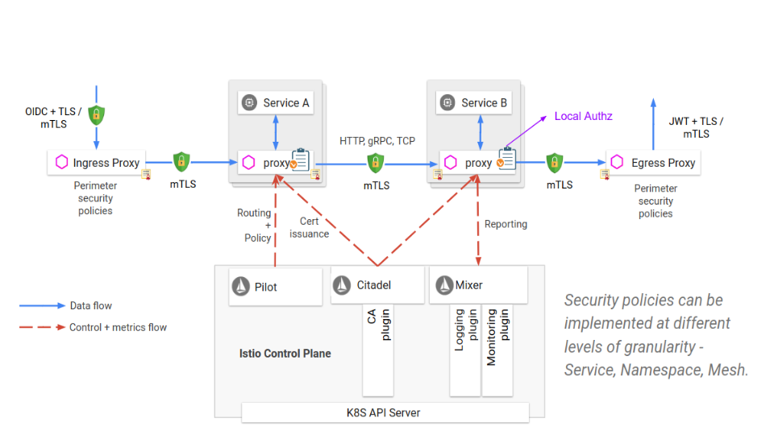

The goals of Istio security are:

- **Security by default**: no changes needed for application code and infrastructure
- **Defense in depth**: integrate with existing security systems to provide multiple layers of defense
- **Zero-trust network**: build security solutions on untrusted networks

Security in Istio involves multiple components:

- **Citadel** for key and certificate management
- **Sidecar and perimeter proxies** to implement secure communication and authorization between clients and servers
- **Pilot** to distribute [authentication policies](https://istio.io/docs/concepts/security/#authentication-policies) and [secure naming information](https://istio.io/docs/concepts/security/#secure-naming) to the proxies
- **Mixer** to manage auditing

