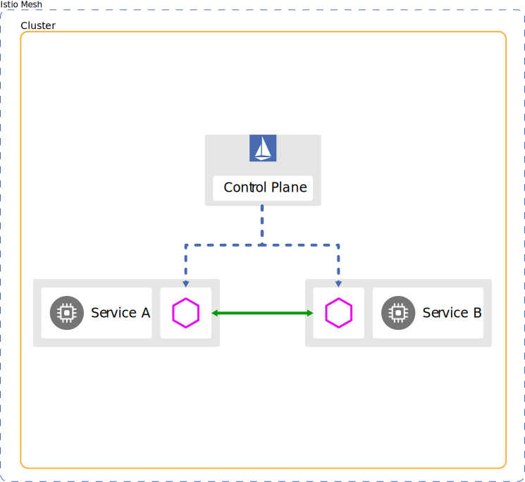
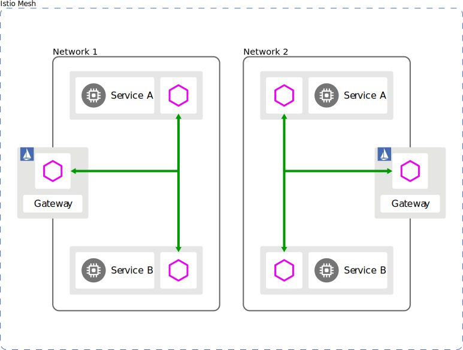
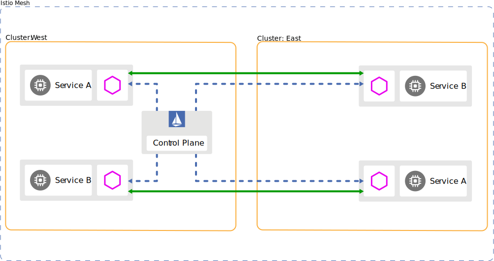
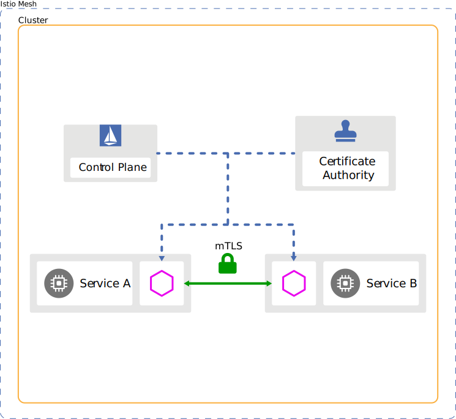
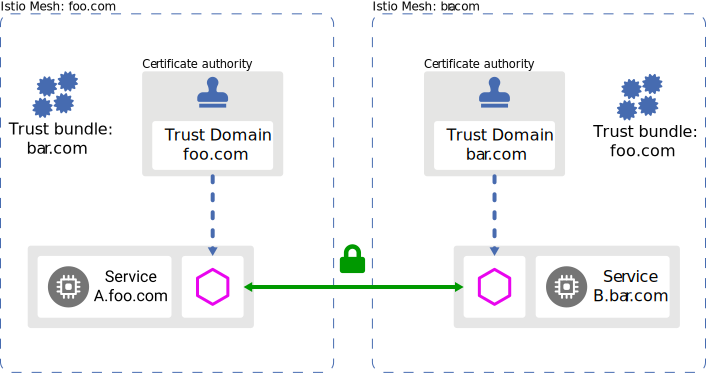
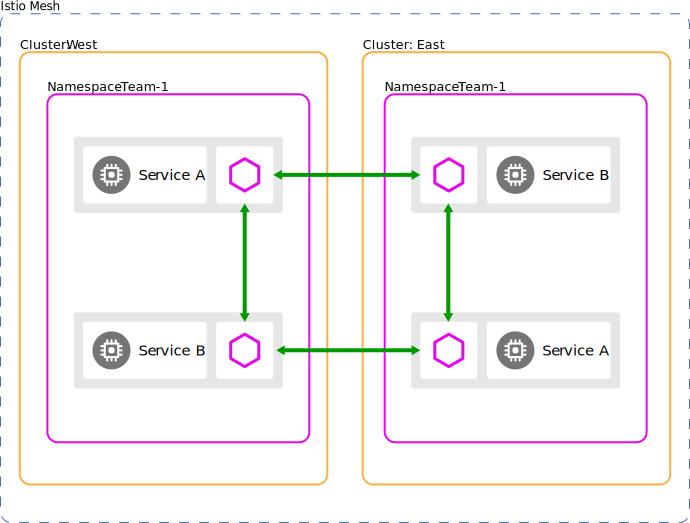

[istio docs ops deployment models](https://istio.io/docs/ops/deployment/deployment-models/)

# 集群模型

* 多数场景下，集群是 配置和端点discovery的边界

* 单cluster

  

* 多cluster

  

  

  基于多cluster可以：
  
  * fault isolation： 集群出故障时可以切到另一个集群
  
  * 基于位置的路由和fail-over

  * 可以支持多种控制面模型
  
  * 项目等隔离(在不同的集群)

# 网络模型

* 单网络

  

* 多网络

  

  

  一些特点：

  * 端点地址可以/可能重复

  * 不同网络之间只能通过istio gateway来访问

  * istio使用**partitioned service discovery**来给consumer提供不同的端点view（根据其所在的网络)

    啥意思？  这个概念没看到介绍、链接。

# 控制面模型

* 单集群、单控制面

  

* 多集群、单控制面

  

* 多集群、多控制面

  

  好处是：

  * 提高可用性

    某cluster内控制面故障，只影响该cluster。
  
    而且，可以配置一些倒回策略，允许故障时，envoy连接到其他cluster的控制面：
  
  
  
* 配置隔离
  
    针对该cluster的配置，不影响其他cluster
    

不同的控制面部署的可用性(从低到到高)：

* 每个region一个cluster

* 每个region多个cluster

* 每个zone一个cluster

* 每个zone多个cluster

* 每个cluster

> 怎么理解呢？ 意思是： (第一个为例) 每个region里只有一个cluster里部署有控制面？ 最后一个意思是每个region的每个zone的每个cluster都部署有控制面？

# 身份和信任模型

* mesh内

  

* (多个)mesh之间

  需要交互trust bundles，可以手动或自动(通过一些协议，如SPIFEE)
  
  

# mesh模型

* 单mesh

  一个mesh内，服务名（+namespace）是唯一的

* 多mesh

  * 可以按业务线来划这个边界

  * mesh之间服务名（和namespace）可以重用，也即会重复

  * 跨mesh的通信可以通过`mesh federation`： 每个mesh暴露一组服务

    
    
    
    
    此时，为避免冲突，可以给每个mesh一个唯一id： `mesh ID`，（然后组委服务名FQDN的一部分？）以使得FQDN唯一

# 租户tenancy模型

四个层面的隔离：

* 安全

* 策略

* 容量

* 成本/代价（cost）

* 性能

两种租户模型：

* namespace租户

  * 通过namespace来隔离

    

  * namespace之间的互相访问

    

  * 多cluster： 此时，同一namespace下，多cluster的同样的服务，被认为是同一个，会合并其端点

    

* cluster租户

  这里cluster是指独立（部署mesh的）集群，所以这个*多租户模型*有点牵强，其实就是**多mesh模型**
  
  

## k8s下多mesh模型 - 多租户模型

[Istio Soft Multi-Tenancy Support](https://istio.io/blog/2018/soft-multitenancy/) 这篇文里介绍了思路，大约如下：

1. 使用不同的istio namespace（如 `istio-system` -> `istio-system1`）

  > 这里ns是指k8s ns

  然后使用到该ns的地方也要做对应的替换，比如sidecar等

2. 限制tenant管理员对于控制面的访问 - 仅限当前ns控制面

3. 让sidecar的服务发现只watch对应ns（如`ns-1`）

  之所以说是软tenant，这里的watch ns还是由其自行指定

4. 将对应的服务部署在该ns（`ns-1`）

5. ...

