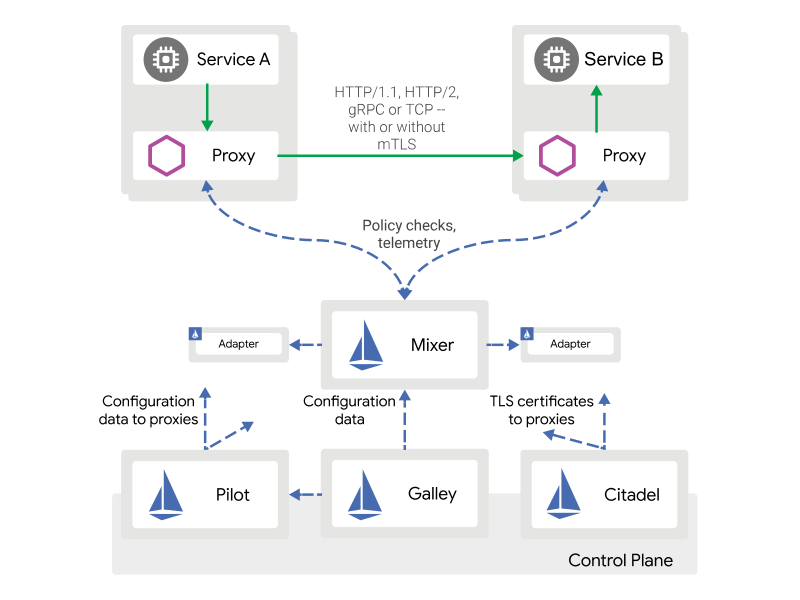

## 组件

* envoy

* mixer

* pilot

* citadel

* gally

## design goals

* maximize transparency

  * 部署上： （通过operator等）自动注入

  * 访问上： （通过iptables等）自动拦截流量

    > yonka: 但是拦截什么流量呢？ 如果是真实upstream，那workload有了服务发现再用mesh就有冗余了； 如果是显式的destination， 那还不如直接指向mesh免得踩透明拦截的可能的坑

* extensibility

* portability

* policy uniformity 

