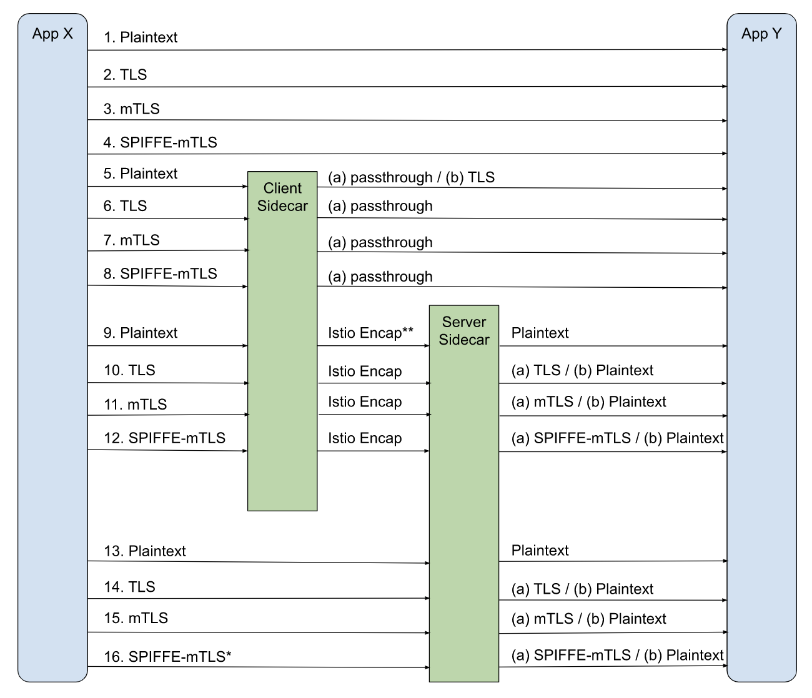

## TODO 

找个样例出来


## 两端不同流量类型的各种场景

ref: [Better Transport Security - Alternatives - google doc](https://docs.google.com/document/d/1ubUG78rNQbwwkqpvYcr7KgM14kEHwitSsuorCZjR6qY/edit#heading=h.x9snb54sjlu9)





* SPIFFE-mTLS on the wire is simply mTLS using SPIFFE certs issued by a CA trusted by all workloads. The identities in SPIFFE SVIDs are workload identities. It is distinguished from TLS/mTLS which use DNS style Common-Names. 
* In the current implementation **‘Istio Encap’ is implemented using ‘SPIFFE-mTLS’** as the secure transport.


控制上述流量类型的配置有：

* `Sidecar` 的 `egress`

* `Sidecar` 的 `ingress`

  会和其他的配置如 authpolicy、ep label 等一起作用


### 按业务场景分

#### 原来没使用tls： pt -> tls


也即业务流量是plain text，那么：

* 如果不想获得更多的（信道）安全（可能是不想承担成本等等），那就不开（authpolicy `disabled`），此时 `c.app-[pt]-c.sidecar---[pt]---p.sidecar-[pt]-p.app`（`pt == plaintext`）

* 如果想启用安全，但考虑到业务接入sidecar/mesh需要一个过程，所以可以：

  1. 开`permissive`，mesh会容许调用两端其一不支持tls而降级回pt

     实际灵活而正确的处理两种特殊情况（如何处理见下文）： 

     1. c端接入sidecar了，但发现p端（没接入sidecar等原因）不支持tls，那么发起pt类型流量
     2. p端接入sidecar了，但实际上进来了（比如由没接入sidecar的c端发出的）pt流量

  2. 业务逐步接入sidecar，直到全部完毕

  3. 可以切为`strict`，此时不再“宽容”处理，获得更高的安全性

     > 这里有个假设就是对于业务规范的强制： 接入sidecar是必须的，那么如果有pt流量，说明是非法访问

  

  事实上，如上路径比较理想，在老的业务演进过程中，这个过程可能非常漫长，甚至永远无法达到（考虑业务和技术架构多样性，以及mesh可能没有“一统天下），也即3可能一直不会发生。

  另一方面，上面只讲了**”因为没完全接入sidecar而导致没完全tls可用“**的情况，而实际上，也有一些**”主动的不希望使用tls“**的情况，比如部分业务可能出于性能、成本考虑等等


#### 原先就有某种tls

那么根据业务类型，先有两种情况：

* 纯TLS流量，这种情况下一般也不需要mesh纳管，等于”乱入“mesh的流量： `tls passthrough`即可

  这种情况下有没可能期望tls `term`然后走mesh的统一tls...？ 感觉一般不会

* 业务+tls，期望被mesh纳管并且迁移到mesh统一的tls。 这种情况下一般属于存量兼容，后续估计业务侧tls会逐渐下掉

  考虑到这个初衷，基本认为 `c.app + c.sidecar`时则发出流量为pt类型、`p.app + p.sidecar`时则接受pt类型流量，所以随着sidecar接入的进程，有如下几种流量类型场景：

  1. `c.app -[tls]- p.app`，对应上图`2`
  2. `c.app`

  > **注意** ref原文里讲的是另一个场景： 业务行为不改造的情况下，先接入sidecar，所以流量类型就不同了
  >
  > 1. 


## svc level


先得出`serviceMTLSMode`

```go
// BestEffortInferServiceMTLSMode infers the mTLS mode for the service + port from all authentication
// policies (both alpha and beta) in the system. The function always returns MTLSUnknown for external service.
// The result is a best effort. It is because the PeerAuthentication is workload-based, this function is unable
// to compute the correct service mTLS mode without knowing service to workload binding. For now, this
// function uses only mesh and namespace level PeerAuthentication and ignore workload & port level policies.
// This function is used to give a hint for auto-mTLS configuration on client side.
func (ps *PushContext) BestEffortInferServiceMTLSMode(tp *networking.TrafficPolicy, service *Service, port *Port) MutualTLSMode {
```

1. external则`MTLSUnknown`

2. `service.Resolution == Passthrough` 或者 作用的（dr的）trafficpolicy中lb方式为`LoadBalancerSettings_PASSTHROUGH` 的话： 如果无实例 或者 有一个实例为`disabled`，则为`MTLSDisable`

   > y: 奇怪，而不是per-ep自行..吗？

3. 查看ns级别auth policies是否不为`MTLSUnknown`则使用
4. 默认的`MTLSPermissive`


## ep level


### k8s svc


```go
// GetTLSModeFromEndpointLabels returns the value of the label
// security.istio.io/tlsMode if set. Do not return Enums or constants
// from this function as users could provide values other than istio/disabled
// and apply custom transport socket matchers here.
func GetTLSModeFromEndpointLabels(labels map[string]string) string {
	if labels != nil {
		if val, exists := labels[label.SecurityTlsMode.Name]; exists {
			return val
		}
	}
	return DisabledTLSModeLabel
}
```

大致就是：

* istio注入sidecar的会加上这个label，所以根据这个即可
* 没这个label就没sidecar，于是就是`disabled`


### serviceentry


`ServiceEntry_DNS`类型的为`disabled`，否则

1. 考虑`security.istio.io/tlsMode`（这点与k8s svc同）
2. `ServiceAccount != ""`则为isito mtls
3. 否则为disabled

如下

```go
func getTLSModeFromWorkloadEntry(wle *networking.WorkloadEntry) string {
	// * Use security.istio.io/tlsMode if its present
	// * If not, set TLS mode if ServiceAccount is specified
	tlsMode := model.DisabledTLSModeLabel
	if val, exists := wle.Labels[label.SecurityTlsMode.Name]; exists {
		tlsMode = val
	} else if wle.ServiceAccount != "" {
		tlsMode = model.IstioMutualTLSModeLabel
	}

	return tlsMode
}
```

