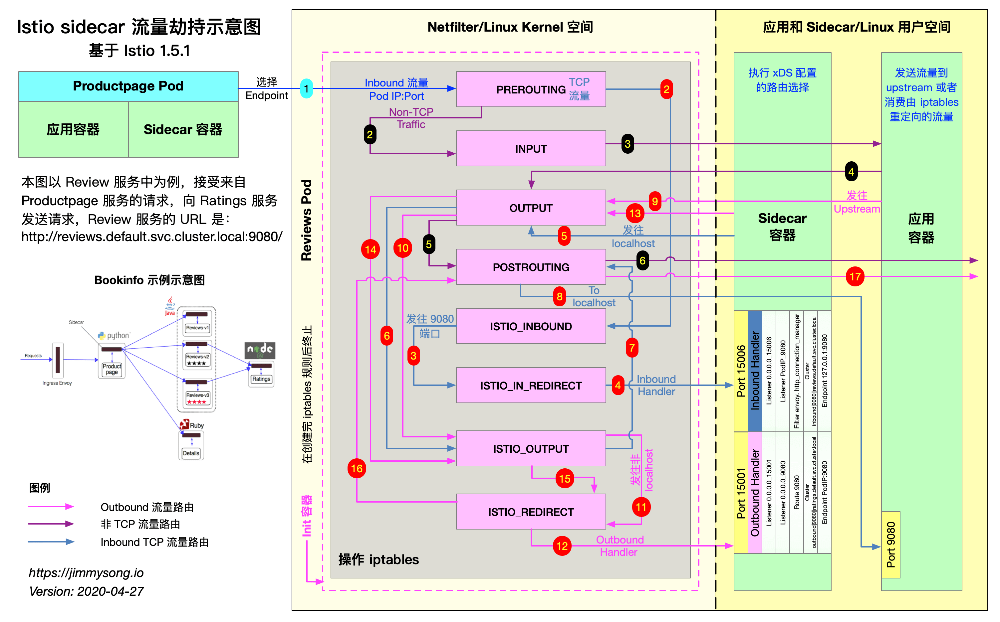

ref: [Istio 中的 Sidecar 注入及透明流量劫持过程详解](https://www.servicemesher.com/blog/sidecar-injection-iptables-and-traffic-routing/)

## istio-iptables.sh 

见： [istio-iptables_yonka.md](istio-iptables_yonka.md)

## 生成的iptables规则

见： [istio-iptables rules-规则样本.md](istio-iptables rules-规则样本.md)

## 流量方向

