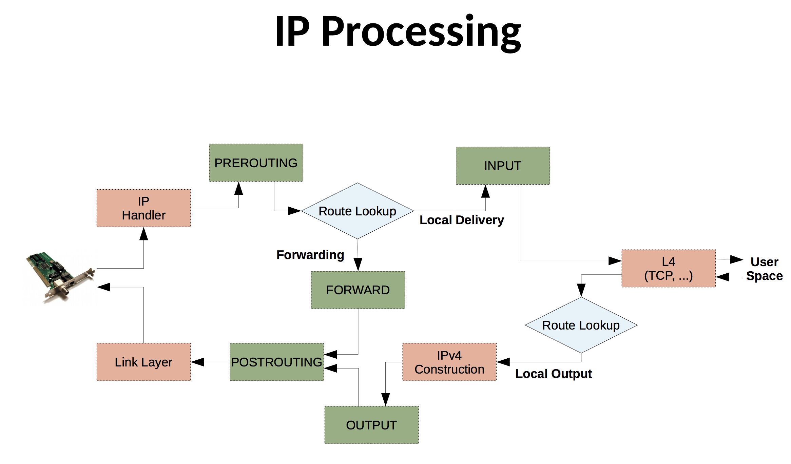

# intro


netfilter的cmd工具： iptables。

所以，iptables没有守护进程，严格的说不是个服务。即使支持 `service iptables start` 类似的操作。


## flow


**入方向**

* PREROUTING(nat)

<<<<<<< HEAD
  > 不过发往（至少非lo接口的流量是）本机IP的流量好像不走`PREROUTING`

=======
>>>>>>> 1122cdc (re-init 20240121)

* routing decision：目标是否本机
  * 是 -> INPUT(filter) -> userSpace(local process)
  * 否 -> 是否允许转发
    * 是 -> FORWARD(filter)
    * 否 -> DROP （吧？）


**出方向**

* routing decision
* OUTPUT(nat-OUTPUT, filter-OUTPUT)
* POSTROUTING(nat)


```
                               XXXXXXXXXXXXXXXXXX
                             XXX     Network    XXX
                               XXXXXXXXXXXXXXXXXX
                                       +
                                       |
                                       v
 +-------------+              +------------------+
 |table: filter| <---+        | table: nat       |
 |chain: INPUT |     |        | chain: PREROUTING|
 +-----+-------+     |        +--------+---------+
       |             |                 |
       v             |                 v
 [local process]     |           ****************          +--------------+
       |             +---------+ Routing decision +------> |table: filter |
       v                         ****************          |chain: FORWARD|
****************                                           +------+-------+
Routing decision                                                  |
****************                                                  |
       |                                                          |
       v                        ****************                  |
+-------------+       +------>  Routing decision  <---------------+
|table: nat   |       |         ****************
|chain: OUTPUT|       |               +
+-----+-------+       |               |
      |               |               v
      v               |      +-------------------+
+--------------+      |      | table: nat        |
|table: filter | +----+      | chain: POSTROUTING|
|chain: OUTPUT |             +--------+----------+
+--------------+                      |
                                      v
                               XXXXXXXXXXXXXXXXXX
                             XXX    Network     XXX
                               XXXXXXXXXXXXXXXXXX
```




> 实测，发往 127.0.0.1 的流量不受 nat表PREROUTING链 影响； 而发往 eth0上ip的流量则受。。。


## tables


* FILTER

  主要用于“过滤”（而非“修改），iptables的主要table

* NAT

  顾名思义。

* MANGLE

  可用于修改包内容（特殊字段等）

* RAW

  主要用于添加 不追踪连接 的规则

* SECURITY


## chains

* **INPUT CHAIN**: It is used for rules which are applicable to the traffic/packets coming towards the server.
* **OUTPUT CHAIN:** It is used for rules which need to be applied on outgoing traffic/packets from our server.
* **FORWARD CHAIN: **It is used for adding rules related to forwarding an IP packet.
* **PRE-ROUTING CHAIN: **It is used to add rules which define actions that need to be **taken before a routing decision is made** by the kernel.
* **POST-ROUTING CHAIN: **It is used for adding rules which will define actions that need to be taken **after a routing decision which is taken** by the kernel.


|              | PREROUTING | INPUT        | OUTPUT | FORWARD | POSTROUTING |
| ------------ | ---------- | ------------ | ------ | ------- | ----------- |
| **filter**   |            | √            | √      | √       |             |
| **nat**      | √          | √（centos7） | √      |         | √           |
| **raw**      | √          |              | √      |         |             |
| **mangle**   | √          | √            | √      | √       | √           |
| **security** |            |              |        |         |             |


## rules


## targets

*A firewall rule specifies criteria for a packet and a target. If the packet does not match, the next rule in the chain is the examined; if it does match, then the next rule is specified by the value of the target, which can be the name of a user-defined chain or one of the special values ACCEPT, DROP [, REJECT], QUEUE or RETURN.*


可以是

* 用户定义的chain（非当前rule所在的chain）

* 内建的特殊target

  * RETURN

    *means stop traversing this chain and resume at the next rule in the previous (calling) chain. If the end of a built-in chain is reached or a rule in a built-in chain with target RETURN is matched, the target specified by the chain policy determines the fate of the packet.*

    1. 从一个CHAIN里可以jump到另一个CHAIN, jump到的那个CHAIN是子CHAIN.
    2. 从子CHAIN return后，回到触发jump的那条规则，从那条规则的下一条继续匹配.
    3. 如果return不是在子CHAIN里，而是在main CHAIN，那么就以默认规则进行. 

  * `REJECT` *is used to send back an error packet in response to the matched packet: otherwise it is equivalent to DROP so it is a **terminating TARGET**, ending rule traversal.*

  * `ACCEPT` *means to let the packet through*

  * `DROP` *means to drop the packet on the floor, i.e. to discard it and not send any response*

  * `QUEUE` *means to pass the packet to userspace*

* 扩展


## extensions


### match extensions


* account
* addrtype
  * UNSPEC
  * UNICAST
  * LOCAL
  * BROADCAST
  * ANYCAST
  * MULTICAST
  * BLACKHOLE
  * UNREADHABLE
  * PROHIBIT
  * THROW
  * NAT
  * XRESOLVE
* childlevel
* comment
* connbytes
* connlimit
* connmark
* connrate
* conntrack
* dccp
* dscp
* dstlimit
* ecn
* esp
* fuzzy
* hashlimit
* helper
* icmp
* iprange
* ipv4options
* length
* limit
* mac
* mark
* mport
* multiport
* nth
* osf
* owner
* physdev
* pkttype
* policy
* psd
* quota
* random
* realm
* recent
* sctp
* set
* state
* string
* tcp
* tcpmss
* time
* tos
* ttl
* u32
* udp
* unclean


### target extensions

* BALANCE
* CLASSIFY
* CLUSTERIP
* CONNMARK
* DNAT
* DSCP
* ECN
* IPMARK
* LOG
* MARK
* MASQUERADE
* MIRROR
* NETMAP
* NFQUEUE
* NOTRACK
* REDIRECT
* REJECT
* SAME
* SET
* SNAT
* TARPIT
* TCPMSS
* TOS
* TRACE
* TTL
* ULOG
* XOR


# ref


* [zsythink-iptables详解](http://www.zsythink.net/archives/1199)


