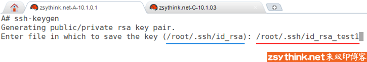
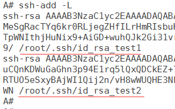

from： http://www.zsythink.net/archives/2407

# 了解ssh代理：ssh-agent

- [ 4](http://www.zsythink.net/archives/2407#comments)

- A+

所属分类：[Linux基础](http://www.zsythink.net/archives/category/linuxbase/) [基础知识](http://www.zsythink.net/archives/category/linuxbase/linux基础/) [常用命令](http://www.zsythink.net/archives/category/linuxbase/基础命令/)

ssh代理是一个程序，它可以帮助我们管理私钥，ssh-agent即为ssh代理程序。

那么什么时候需要ssh代理帮助我们管理私钥呢？当遇到如下情况时，我们会需要ssh代理。

1、使用不同的密钥连接到不同的主机时，需要手动指定对应的密钥，ssh代理可以帮助我们选择对应的密钥进行认证，不用手动指定密钥即可进行连接。

2、当私钥设置了密码，我们又需要频繁的使用私钥进行认证时，ssh代理可以帮助我们免去重复的输入密码的操作。

上述两种情况我们会一一道来，不过在描述它们之前，我们先来了解一下怎样使用ssh代理。

 

## 启动ssh代理并添加密钥

首先，如果想要使用ssh代理，我们则需要先启动ssh代理，也就是启动ssh-agent程序，如下两条命令都可以启动代理，但是略有不同。

ssh-agent $SHELL

eval `ssh-agent`

 

如果你最小化安装了centos，那么你执行上述命令时，可能会提示找不到ssh-agent命令，此时你需要安装openssh-clients，安装后即可使用上述命令。

 

当我们使用"ssh-agent $SHELL"命令时，会在当前shell中启动一个默认shell，作为当前shell的子shell，ssh-agent程序会在子shell中运行，当执行"ssh-agent $SHELL"命令后，我们也会自动进入到新创建的子shell中，centos中，默认shell通常为bash，所以，在centos中上述命令通常可以直接写为ssh-agent bash，当然，如果你的默认shell已经指定为其他shell，比如csh，那么你也可以直接使用ssh-agent csh，效果都是相同的，我们来实验一下。

当前使用的centos系统的默认shell为bash，在未启动ssh-agent程序时，我们在当前bash中执行pstree命令，查看sshd的进程树，如下

然后，执行"ssh-agent $SHELL"命令(注意:SHELL为大写)，启动ssh代理，执行此命令后，再次使用pstree命令，查看sshd的进程树

启动ssh代理后，查看sshd进程树，如下所示

在原来的bash中新生成了一个子bash，ssh-agnet运行在子bash中，我们的命令也同样在子bash中执行。

此时，在当前会话中，我们已经可以使用ssh-agent了，ssh-agent会随着当前ssh会话的消失而消失，这也是一种安全机制，比如，退出当前子shell，再次查看进程树。

找到sshd的进程树，如下，如果你操作的非常快，可能会在与sshd进程平级的区域看到一个还没有来得及关闭的ssh-agent进程，但是最终sshd的进程树如下图所示。

可以看到ssh-agent已经不再存在了，如果你的服务器中开启了图形化环境，使用"ps -ef | grep ssh-agent"命令查找ssh-agent进程，仍然能够看到一个ssh-agent进程，这个ssh-agent进程是跟随图形化界面开机启动的，但是通常，服务器中很少会开启图形化界面，所以我们不用在意它。

虽然我们已经知道了怎样启动ssh-agent，但是，如果想让ssh代理帮助我们管理密钥，还需要将密钥添加到ssh代理中，这个话题一会儿再聊。

 

刚才执行了ssh-agent $SHELL命令，现在试试 eval `ssh-agent` 命令。

eval `ssh-agent`命令并不会启动一个子shell，而是会直接启动一个ssh-agent进程，示例如下

找到进程树的如下部分

可以看到，ssh-agent进程已经启动了，此刻，如果我们推出当前bash，此ssh-agnet进程并不会自动关闭，所以，我们应该在退出当前bash之前，手动的关闭这个进程，在当前bash中，使用ssh-agent -k命令可以关闭对应的ssh-agent进程，但是，如果在退出了当前bash以后再使用'ssh-agent -k'命令，是无法关闭对应的ssh-agent进程的，除非使用kill命令，当然，其实在使用 ssh-agent $SHELL 命令时，也可以使用'ssh-agent -k'命令关闭ssh代理。

 

好了，我们已经了解了怎样启动ssh代理，以及怎样关闭ssh代理，但是，我们还没有真正的使用过代理，如果想要真正的使用ssh代理帮助我们管理密钥，还需要将密钥添加到代理中，添加密钥需要使用到ssh-add命令

ssh-add命令的使用方法非常简单，示例如下

ssh-add  ~/.ssh/id_rsa_custom

上述命令表示将私钥id_rsa_custom加入到ssh代理中，如果你没有正确的启动ssh-agent，那么你在执行ssh-add命令时，可能会出现如下错误提示。

Could not open a connection to your authentication agent.

 

完成上述步骤后，ssh代理即可帮助我们管理id_rsa_custom密钥了，那么有哪些具体的使用场景呢，我们继续聊。

  

## ssh代理帮助我们选择对应的私钥进行认证

前一篇文章中，我们总结了基于密钥进行认证的方法，比如，我们在生成密钥对时，可以手动指定密钥的名称，而不是使用默认的密钥名称，示例如下：

如上图所示，我们没有使用默认名称id_rsa作为密钥名称，而是使用id_rsa_test1作为密钥的名称，生成了对应的密钥对。

此时，我们想要使用新生成的密钥对免密码连接到10.1.0.3这台服务器，于是，我们需要完成如下操作(具体操作可参考上一篇文章):

如上图所示，我们将公钥id_rsa_test1.pub发送给了10.1.0.3的root用户，然后在A机器（10.1.0.1）上连接到C机器（10.1.0.3）时，仍然提示我们输入root@10.1.0.3的密码，这是因为ssh基于密钥进行认证时，默认会使用~/.ssh/id_rsa进行认证，当你使用非默认名称的私钥进行认证时，需要手动指明对应的私钥，如果不指明对应的私钥，ssh仍然会默认使用~/.ssh/id_rsa进行认证，上例就是这种情况，由于我们没有使用~/.ssh/id_rsa进行认证，同时没有指明对应的私钥，ssh会使用id_rsa与id_rsa_test1.pub进行匹配，它们本来就不是一对密钥，自然无法认证成功，所以ssh仍然提示我们输入密码，我们可以使用 -i 选项指定对应的私钥文件进行认证，示例如下

如上图所示，指明对应的私钥后，即可正常的使用密钥进行认证，从而免去输入用户的密码。

如果我们手中有很多密钥对，它们对应的公钥被不同的服务器所持有，那么，我们连接不同的服务器时，就需要手动指定对应的不同的私钥，而ssh代理可以帮助我们管理这些私钥，从而避免手动的指定私钥。

 

示例如下

如上图所示，我们启动了ssh-agent进程，然后将私钥id_rsa_test1加入到了ssh代理中，再次使用非默认名称的私钥进行认证时，并不用指明密钥，ssh-agent会帮助我们选择对应的私钥，进行正确的认证，当本机有多个密钥对，并且它们的公钥分布于很多不同的机器时，会非常有用。

  

## ssh代理能够免去重复输入私钥密码的操作

当我们为私钥设置了密码，ssh基于密钥进行认证时，会提示输入私钥的密码，输入正确的私钥密码，才能够使用对应私钥进行认证，示例如下

生成密钥对，同时指定私钥的密码

ssh-keygen -f ~/.ssh/id_rsa_test2 -P'123456'

 

将公钥添加到远程用户的公钥认证文件中，提示输入远程用户的密码。

ssh-copy-id -i ~/.ssh/id_rsa_test2.pub root@10.1.0.3

root@10.1.0.3's password:

 

指定对应私钥连接远程用户，提示输入对应私钥的密码，正确的输入私钥的密码，即可连接到远程用户

ssh -i ~/.ssh/id_rsa_test2 root@10.1.0.3

Enter passphrase for key '/root/.ssh/id_rsa_test2':

 

但是，如果为私钥设置了密码，每次使用私钥进行认证连接是，都会要求输入私钥密码，如果你在当前ssh会话中需要反复的连接到远程用户，那么反复的输入复杂的私钥密码，的确会比较麻烦，ssh-agent可以帮助我们，在一个ssh会话中，只要输入一次私钥密码，在同一ssh会话中之后再次使用到相同的私钥时，即可不用再次输入对应密码，示例如下。

如上图所示

第1步：启动ssh代理

第2步：将对应私钥添加到ssh代理中，在添加私钥时，会提示输入私钥的密码，此时，正确的输入私钥密码即可将私钥添加到ssh代理中。

第3步：连接到远程用户，并使用对应私钥进行认证，已经不用输入私钥密码，即可连接到远程用户，从远程用户的会话中退出，回到当前ssh会话中。

第4步：在当前会话中，再次连接到远程用户，同样没有提示输入密码。

从上述示例可以看出，在同一个ssh会话中，ssh-agent可以帮助我们免去重复输入私钥密码的操作。

  

## 管理ssh代理中的密钥

如果我们想要查看ssh代理中已经添加了哪些私钥，该怎样查看呢？使用'ssh-add -l'即可查看，示例如下

如上图所示，id_rsa_test1与id_rsa_test2这两个RSA类型的私钥已经被添加到了ssh代理中。

 

我们还可以列出代理中所有私钥对应的公钥内容，示例如下

 

如果我们想要从代理中移除某个已经添加的私钥，可以使用'ssh-add -d'命令指定要移除的私钥，示例如下

 

我们也可以一次性清空代理中的所有私钥，使用'ssh-add -D'命令即可。

 

如果我们想要临时锁定ssh代理，则可以对ssh代理添加密码，并进行锁定，锁定后的ssh代理无法继续帮助我们管理私钥，除非解锁以后，才能正常的帮助我们管理私钥，示例如下，在正常情况下，ssh代理可以帮助我们管理私钥，我们可以使用'ssh-add -x'命令对代理加锁，加锁时会提示输入密码，这个密码在解锁时需要用到，加锁后，再次连接远程用户时，ssh代理已经失效，除非我们对代理进行解锁，使用'ssh-add -X'命令(大写X)对代理解锁，解锁时需要输入加锁时设定的密码，解锁后，ssh代理恢复正常。

  

## 总结

**启动ssh-agent**

如下两种方式均可启动ssh-gent

方式一：创建子shell，在子shell中运行ssh-agent进程，退出子shell自动结束代理。

Shell

| 1    | ssh-agent $SHELL |
| ---- | ---------------- |
|      |                  |

方式二：单独启动一个代理进程，退出当前shell时最好使用ssh-agent -k关闭对应代理

Shell

| 1    | eval `ssh-agent` |
| ---- | ---------------- |
|      |                  |

 

**关闭ssh-agent**

Shell

| 1    | ssh-agent -k |
| ---- | ------------ |
|      |              |

 

**将私钥添加到ssh代理**

Shell

| 1    | ssh-add ~/.ssh/key_name |
| ---- | ----------------------- |
|      |                         |

 

**查看代理中的私钥**

Shell

| 1    | ssh-add -l |
| ---- | ---------- |
|      |            |

 

**查看代理中的私钥对应的公钥**

Shell

| 1    | ssh-add -L |
| ---- | ---------- |
|      |            |

 

**移除指定的私钥**

Shell

| 1    | ssh-add -d /path/of/key/key_name |
| ---- | -------------------------------- |
|      |                                  |

 

**移除代理中的所有私钥**

Shell

| 1    | ssh-add -D |
| ---- | ---------- |
|      |            |

 

**锁定ssh代理**

锁定时需要指定锁定密码，锁定后的ssh代理暂时不能帮助我们管理私钥

Shell

| 1    | ssh-add -x |
| ---- | ---------- |
|      |            |

 

**解锁ssh代理**

解锁时需要输入创建锁时设定的密码，解锁后ssh代理可正常工作

Shell

| 1    | ssh-add -X |
| ---- | ---------- |
|      |            |

 
 

好了，这篇文章就总结到这里，希望能够对你有所帮助。

