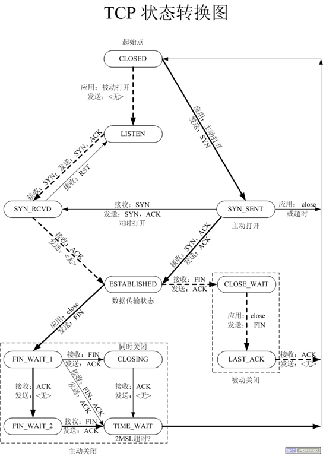

# 流程

## 正常流程

* 正常流程客户端TCP状态迁移：

  * client发起连接
  * client主动关闭连接

  `CLOSED->SYN_SENT->ESTABLISHED->FIN_WAIT_1->FIN_WAIT_2->TIME_WAIT->CLOSED`

  * CLOSED

    -SYN

    * SYNC_SENT

      +SYN-ACK -ACK

      * ESTABLISHED

        -FIN

        * FIN_WAIT_1

          +ACK

          * FIN_WAIT_2

            +FIN -ACK

            * TIME_WAIT
              * CLOSED

          +FIN -ACK

          * CLOSING

            +ACK

            * TIME_WAIT
              * CLOSED

* 正常流程服务器TCP状态迁移：

  * 服务端接受连接（被动建立）
  * 服务端被动关闭连接

  `CLOSED->LISTEN->SYN_RCVD->ESTABLISHED->CLOSE_WAIT->LAST_ACK->CLOSED`

  * CLOSED

    do listen

    * LISTEN

      +SYN -SYN-ACK

      * SYN_RCVD

        +ACK

        * ESTABLISHED

          +FIN -ACK

          * CLOSE_WAIT

            -FIN

            * LAST_ACK

              +ACK

              > 没收到ACK然后超时？ 重传FIN？

              * CLOSED

## 异常流程

# 状态

## 特殊状态

- LAST-ACK

  应该比较少见，毕竟ACK是协议栈完成

  如果多的话，client不回最后一个ACK，可能是恶意或者协议实现缺陷

- FIN-WAIT-1

  如果多的话，从client端上看，可能server hang住，因为ACK都回不了 = = （FIN会延迟ACK吗）

- FIN-WAIT-2

  如果多的话，从client端上看，可能server端应用hang住，无法close

  对应server端应有较多CLOSE-WAIT

- CLOSE-WAIT

  多的话，从server端上看，server端应用可能hang住无法close

  对应...

- TIME-WAIT

- CLOSING

  这个状态应该比较少见，server端都能回FIN说明更能回ACK

  瞬态的话可能是ACK丢包； 比较多的话可能是协议栈实现缺陷

## 状态迁移

从图里可以看到一点：

* 如果应用层一直不close的话，会产生/积累 CLOSE_WAIT 状态的连接

  框架是不是可以尝试帮忙做类似的收尾事情？

