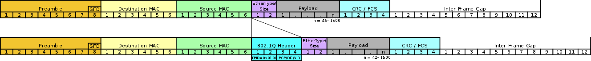
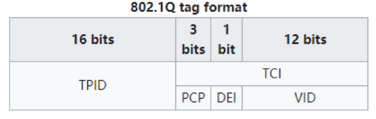

# intro

## 规范： [802.1q](https://en.wikipedia.org/wiki/IEEE_802.1Q)

* 是什么

  > IEEE 802.1Q, often referred to as Dot1q, is the networking standard that supports virtual LANs (VLANs) on an IEEE 802.3 Ethernet network.
  > **基于以太网**

* 做了什么

  * `defines a system of VLAN tagging for Ethernet frames and the accompanying procedures to be used by bridges and switches in handling such frames.`

  * `contains provisions for a quality-of-service prioritization scheme commonly known as IEEE 802.1p and defines the Generic Attribute Registration Protocol`

* 例外： 厂商可能在自己设备之间使用私有vlan实现，也即支持vlan的功能但不一定完全遵循vlan的协议规范（如cisco）

## 帧结构

Tag protocol identifier (TPID)

A 16-bit field set to a value of 0x8100 in order to identify the frame as an IEEE 802.1Q-tagged frame. This field is located at the same position as the EtherType field in untagged frames, and is thus used to distinguish the frame from untagged frames.

Tag control information (TCI)

A 16-bit field containing the following sub-fields:

- Priority code point (PCP)

  A 3-bit field which refers to the [IEEE 802.1p](https://en.wikipedia.org/wiki/IEEE_802.1p) class of service and maps to the frame priority level. Different PCP values can be used to prioritize different classes of traffic.[[5\]](https://en.wikipedia.org/wiki/IEEE_802.1Q#cite_note-6)

- Drop eligible indicator (DEI)

  A 1-bit field. (formerly CFI[[b\]](https://en.wikipedia.org/wiki/IEEE_802.1Q#cite_note-8)) May be used separately or in conjunction with PCP to indicate frames eligible to be dropped in the presence of congestion.[[7\]](https://en.wikipedia.org/wiki/IEEE_802.1Q#cite_note-9)

- VLAN identifier (VID)

  A 12-bit field specifying the VLAN to which the frame belongs. The hexadecimal values of 0x000 and 0xFFF are reserved. All other values may be used as VLAN identifiers, allowing up to 4,094 VLANs. The reserved value 0x000 indicates that the frame does not carry a VLAN ID; in this case, the 802.1Q tag specifies only a priority (in PCP and DEI fields) and is referred to as a *priority tag*. On bridges, VID 0x001 (the default VLAN ID) is often reserved for a [network management](https://en.wikipedia.org/wiki/Network_management) VLAN; this is vendor-specific. The VID value 0xFFF is reserved for implementation use; it must not be configured or transmitted. 0xFFF can be used to indicate a wildcard match in management operations or filtering database entries.[[8\]](https://en.wikipedia.org/wiki/IEEE_802.1Q#cite_note-10)

# 细节

## 兼容性：判断是否支持

通过tag的TPID来识别，802.1q中TPID固定为`0x8100`，而这两个字节正好对应传统以太网帧的ethType字段，换句话说，等于用值为`0x8100`的ethType来标识为802.1q数据帧。

* 支持的网卡能正常处理

* 不支持的网卡也可以判断出自身不支持，继而...

## vlan id

* `12` bit（`0-4095`）

* `0`和`4095`（`0xFFF`），可用范围`1-4094`

  * `0` 表示不属于任何VLAN，但携带802.1Q的优先级标签，所以一般被称为Priority-only frame， 其一般作为系统使用，用户不可使用和删除

  * `4095` 特殊含义，存在于配置中指示特定行为（通常表示通配），但不存在于数据传输中

    > The VID value 0xFFF is reserved for implementation use; it must not be configured or transmitted. 0xFFF can be used to indicate a wildcard match in management operations or filtering database entries.

  * 可用范围划分

    * 1为系统默认VLAN，即Native VLAN

      > On bridges, VID 0x001 (the default VLAN ID) is often reserved for a management VLAN; this is vendor-specific
      >
      > Cisco uses VLAN 1 as a default VLAN, and management protocols (STP, CDP, DTP, etc) are sent on VLAN 1.
      >
      > You can use VLAN 1 for simple installations where there is no VLAN trunking, but good practice is to not put user data on VLAN 1 in a multi-VLAN environment.

    * 2-1001是普通的vlan

    * 1006-1024保留仅系统使用，用户不能查看和使用

    * 1002-1005是支持fddi和令牌环的vlan

    * 1025-4094是扩展的vlan

## vlan vs vlanid vs port mode

**思科的描述**

- **General mode** allows **multiple** untagged vlans and also **multiple** tagged vlans to exist on the same switch interface.
- **Trunk mode** allows **ONE** untagged vlan **and multiple** Tagged vlans to exist on the same switch interface.
- **Access mode** allows only **one** untagged vlan to exist on a switch interface.

**dell的描述** 感觉更准确

- General - The port belongs to VLANs, and each VLAN is user-defined as tagged or untagged (full 802.1Q mode).

- Access - The port belongs to a single untagged VLAN. When a port is in Access mode, the packet types which are accepted on the port (packet type) cannot be designated. It is also not possible to enable/disable ingress filtering on an access port.

- Trunk - The port belongs to more than one VLAN, and all ports are tagged (except for an optional single native VLAN).

> Access Links connect VLAN unaware devices to the port of a VLAN-aware switch. All frames on access links are untagged. The VLAN switch adds tags to received frames, and removes tags when transmitting frames. End users and VLAN-unaware workstations commonly reside on access links.
>
> General Links consist of a combination of VLAN Trunk and Access Links. General Links can have both tagged and untagged frames, However, all frames sent to a specific VLAN must be tagged.  All untagged  frames are sent to the PVID.

> * General switchport mode consists of a combination of VLAN Trunk and Access Links.
> * General Links can have both tagged and untagged frames.
> * **All frames sent to a specific VLAN must be tagged.  All untagged frames are sent to the native VLAN**.
> * The native VLAN still applies to the General switchport mode. While it is possible to have multiple untagged VLANs on a General link, you can only have one (1) Port VLAN ID (PVID).  The PVID represents the native VLAN.
> * While untagged traffic may be sent via several untagged VLANs, returning untagged traffic will only be received by the PVID and therefore will NOT be forwarded to a specific VLAN.

* port mode - 端口视角

  * trunk

    > 

    * 处理untagged、tagged流量
    * 根据vendor实现，可以指定一些或者排除一些vlan。 默认行为应该是加入所有vlan吧
    * 进出流量的tag应该都不会修改、增删
    * 或者可以理解为可以配置vlan过滤规则（们）的透明转发端口
    * 常用于交换机之间（互联的端口）
    * 连接服务器的话，有时也用这个模式以传递多个vlan的流量

  * access

    > Access mode is for client devices, like normal desktops, printers, etc, An access mode port only sends and accepts untagged frames. The association of the traffic on this port to a VLAN happens through configuration on the switch. An access mode port in VLAN 5 belongs to VLAN 5 and no other VLAN. It will only send and receive traffic on VLAN 5.

    * 该端口只属于某一个vlan，也即配置的vlan
    * 可以配置 **一个**vlan（也可以不配置吧，等于加入untagged/default vlan）
    * 入流量（-> port）必须untagged（vlan 0），然后打上对应的vlan再转发
    * 出流量（<- port）设置为untagged
    * 总而言之只处理（收发）untagged流量

    > 一般用于client设备接入，如pc等

  * general

* vlan: scope - 交换机视角

* vlanid: 具体数据帧携带内容 - 数据视角

### untagged vlan

> 这里先要理解一下untagged vlan的概念： 属于某个vlan但不在传输的流量上体现，或者说收发的数据帧里不带vlan
>
> 显然，端口配置为 **access mode + vlan号** 的话，就是典型的untagged vlan；
>
> 而因为丢失了vlan信息，所以如果端口上支持多个untagged vlan的话，对方其实无法区分流量是哪个vlan的； 同时，端口收到来自对方的untagged流量，也不知道该转给哪个vlan（实际应该是会配置 **一个** vlan 来处理收到的untagged流量 - 见上面说的PVID）
>
> **综上，general mode的行为是比较奇怪的，搜了很久也没搜到使用场景**
>
> 脑补一下： 假设流量不是双向对称的那就ok吧，比如对端需要接收vlan 2,3,4的流量，而不需要发给这些vlan，只需要发给PVID vlan（假设是5）

### native vlan

可能是部分厂家的概念，比如 trunk mode = 多个tagged vlan + 可选的1个（untagged）native vlan

native vlan的出流量是要去掉vlan tag的，所以要知晓这一点不要勿用，否则会出现预期外行为

<<<<<<< HEAD
=======

# 实际使用

## 不同vlan模式： 端口vlan、802.1q vlan

理解： 

802.1q vlan需要双端网卡支持（802.1q协议、对应结构以太网帧），而pc网卡挺大可能不支持。  那么就不能用了吗？

> 实践中发现开了802.1q vlan，笔记本也能正常接入，不知道是网卡支持 还是 802.1q做了向下兼容

可以在交换机侧单方面支持，把某端口视为...，对收发包理解为...。 这样就可以实现交换机内部的虚拟二层网络划分。

而这种简化模式显然不支持tagged vlan，后者强依赖802.1q，于是...

水星的模式：

* 端口vlan

* 802.1q vlan

  > 水星的按如上思路配置后，还需要配置pvid，这点有些困惑。
  >
  > 如下面的case：
  >
  > 需求： 1口trunk、2口wan、3-5 lan
  >
  > 那么：
  >
  > * 1： tagged 11 12
  >
  > * 2： untagged 11
  >
  > * 3-5： untagged 12
  >
  > * 似乎还要把这些口从1（default） vlanid的untagged中去除
  >
  > * **还要为2-5配置pvid为对应的...**（tagged 1口不用）
  >
  >   > 这点就奇怪了，难道2口配置了untagged 11的话，pvid不是天然的11？
  >   >
  >   > > yonka： 大约这么理解
  >   > >
  >   > > * tagged vlanid是允许通过的”real vlan id“、untagged vlanid是允许通过的”mock vlan id“，这两个都是约束了 **哪些vlan特征的流量能通过**
  >   > > * pvid则是给未带vlanid的流量**加上vlanid**，加上后就成了”mock vlan id“，只能去match untagged vlanid规则看能否通过
  >   > >
  >   > > > 这样可以解释 **untagged vlanid 与 pvid不同的情况**： 前者可以是个list，而后者是单个...
  >   > >
  >   > > 来了请求时：
  >   > >
  >   > > * 有vlanid： 
  >   > >
  >   > >   * 在tagged vlanid列表中 - 通过
  >   > >   * 否则 - 丢弃
  >   > >
  >   > > * 没vlanid：
  >   > >
  >   > >   1. 有pvid则加上pvid
  >   > >
  >   > >   2. 在untagged vlanid列表中 - 通过；否则...
  >   > >
  >   > >      > 极端情况下，pvid可能不在untagged vlanid中
  >   > >
  >   > >   > 假设没配置pvid的端口都具有pvid 1，那么对应的，类似有条默认规则： 所有端口的untagged vlanid列表中都加了1

>>>>>>> 1122cdc (re-init 20240121)
