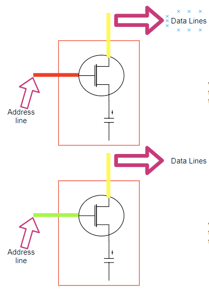
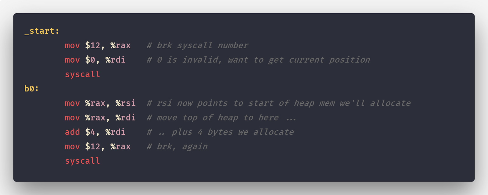
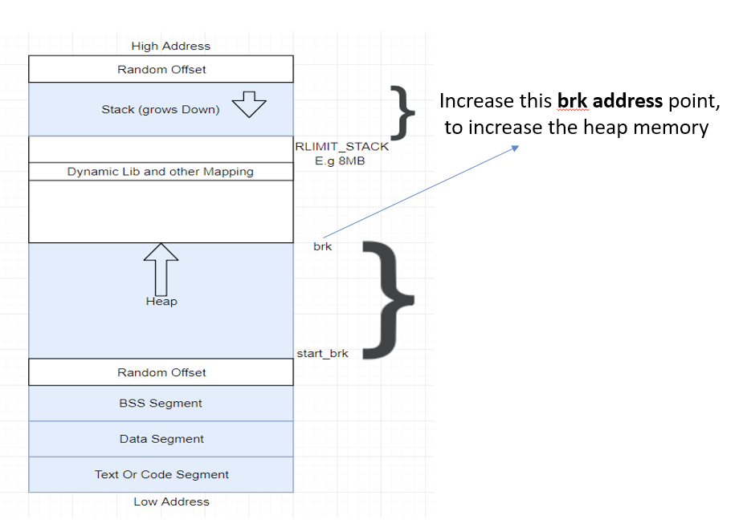
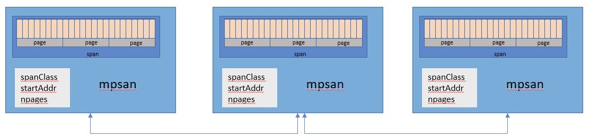
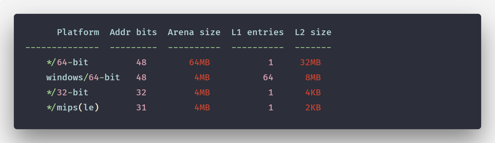

# A visual guide to Go Memory Allocator from scratch (Golang)

[](https://medium.com/@ankur_anand?source=post_page-----e132258453ed--------------------------------)

[Ankur Anand](https://medium.com/@ankur_anand?source=post_page-----e132258453ed--------------------------------)

[Feb 20, 2019·11 min read](https://medium.com/@ankur_anand/a-visual-guide-to-golang-memory-allocator-from-ground-up-e132258453ed?source=post_page-----e132258453ed--------------------------------)


When I first started trying to understand the memory allocator of Go, it was maddening. Everything seemed like a mystical black box. As almost every technical wizardry is hidden beneath abstractions, you need to peel off those layers one by one to understand it.

In this blog post, we will exactly do that. Do you want to learn everything about Go memory allocator? You’re reading the right article.

Translated by readers into: [Russian](https://habr.com/ru/company/ruvds/blog/442648/), [Chinese](https://www.linuxzen.com/go-memory-allocator-visual-guide.html).

# Physical and Virtual Memory

Every Memory Allocator needs to work with the Virtual Memory Space that is managed by the underlying Operating System. Let’s see how it works.



A simple illustration of a Physical Memory Cell (Not an exact representation)

**A greatly simplified overview of a single memory cell:**

1. Address line (transistor as a switch) is what provides access to the capacitor (Data to Data lines).
2. When the Address line has current flowing (shown as red), the data line may write to the capacitor, so the capacitor is charged, and the logical value stored is “1”.
3. When the Address line has no current flowing (shown as green), the data line may not write to the capacitor, so the capacitor is uncharged, and the logical value stored is “0”.
4. When the CPU needs to “READ” a value from RAM, an electric current is sent along the “ADDRESS LINE” (closing the switch). If the capacitor is holding a charge, the current flows down the “DATA LINE” (value of 1); otherwise no current flows down the DATA LINE, so the capacitor stays uncharged (value of 0).


Simple Illustration of how a Physical Memory Cell interacts with CPU

**Data Bus:** Transports data between CPU and Physical Memory.

Let’s also talk a little bit about **Address line** and **Addressable bytes.**


Illustrative Representation of an Address Line between CPU and Physical Memory.

\1. Each “BYTE” in DRAM is assigned a unique numeric identifier (address).
**“Physical bytes present != Number of address line”.** (*e.g. 16bit intel 8088, PAE*)

\2. Each “Address line can send 1-bit value, so it specifies a “SINGLE
BIT” in the address of a given byte.

\3. In our Diagram, we have a **32** address line. So each addressable **BYTE** gets “32 bit” as an address.
`[ 00000000000000000000000000000000 ] — low memory address.[ 11111111111111111111111111111111 ] — high memory address.`

\4. Since we have a 32-bit address for each byte, so our address space consists of ²³² addressable bytes (4 GB) (in the above Illustrative representation).

So the addressable bytes depends upon the total address line, so for 64 address line (x86–64 CPUs) ²⁶⁴ bytes of addressable bytes (16 exabytes), but most architectures that use 64-bit pointers actually use 48-bit address lines (AMD64) and 42-bit address lines (Intel) theoretically allowing 256 terabytes of physical RAM ( Linux allows 128TB of address space per process on x86–64 `with 4 level page tables`, windows 192TB)

As the size of physical RAM is limited, so Each Process runs in its own memory sandbox — “virtual address space,” known as **Virtual Memory.**

**Address of a byte in this virtual address space is no longer the same as the address that the processor places on the address bus**. So, the translation data structures and a system have to be established to map a byte in the virtual address space to a physical byte.

How does this virtual address look like?


Virtual Address Space Representation

So when the CPU executes an instruction that refers to a memory address. The first step is translating that logic address in the VMA into a **linear address.** This translation is done by **MMU**.


This is **not** a physical diagram, only a depiction. address translation process not included for simplicity

Since this logical address is too large to be practically (depends upon various factor) managed individually, these are managed in term of **pages.** When the necessary paging constructs have been activated, the **virtual memory space is divided into smaller regions called pages (**4kB on most OS can be changed**).** It is the smallest unit of data for memory management in virtual memory. Virtual memory doesn’t store anything, it simply *maps* a program’s address space onto the underlying physical memory.

Individual Process only sees this VMA as their Address. **So what happens when our program request for more “heap memory”.**




A simple assembly code asking for more heap memory.




heap memory increment

Program asks for more memory. via the `brk` ( `sbrk`/`mmap` etc) system call.
The kernel updates merely the heap VMA and calls it good.

> No page frames are actually allocated at this point and the new pages are not present in physical memory. Point of difference between VSZ vs RSS Size.

# Memory Allocator

With the basic overview of “Virtual Address Space”, and what it means to increase the heap, the memory allocator becomes easier to reason now.

> If there is enough space in the heap to satisfy a memory request from our code, Memory allocator can fulfill the request without kernel involvement, else it enlarges heap via a system (`*brk*`) call, usually requesting a large block of memory. (For malloc large mean > MMAP_THRESHOLD bytes -128 kB by default).

However, memory allocator has more responsibility than merely updating the `brk address`. One of the major being how to **reduce** both `internal`and fragmentation`external` and how **fast** it can allocate this block**.** Consider the request of a contiguous memory block from our program using a function `malloc(size)` and releasing that memory back using a function `free(pointer)` in a sequential way from p1 to p4.


An external fragmentation demonstration

At p4 step even though we have enough memory block we cannot fulfill the request for 6 contiguous blocks of memory resulting in memory fragmentation.

**So how do we reduce the memory fragment?** The answer to this question depends on the specific memory allocation algorithm, the underlying library use.

We will be looking into an overview of TCMalloc a memory allocator on which closely the Go memory allocator is modeled.

# TCMalloc

The core idea of [TCMalloc (thread cache malloc)](http://goog-perftools.sourceforge.net/doc/tcmalloc.html) is to divide the memory into multiple levels to reduce the granularity of the lock. Inside TCMalloc Memory management is divided into two parts: **thread memory** and **page heap**.

## thread memory

Each memory page divided into — Free List of multiple fixed allocatable size-classes, which helps in reducing **fragmentation**. So each thread will have a cache for small objects without locks, which makes it very efficient to allocate small objects (<=32k) under parallel programs.


Thread Cache (Each Thread gets this Thread Local Thread Cache)

## page heap

The heap managed by TCMalloc consists of a collection of pages, **where a set of consecutive pages can be represented by span**. When allocated Object is larger than 32K, Pages Heap is used for allocation.


Page Heap (for span management)

When there is not enough memory to allocate small objects, go to page heap for memory. If there is not enough, page heap will ask more memory from the Operating System.

As such an allocation model maintains a user-spaced memory pool, it greatly improves the efficiency of memory allocation and release.

> Note: Even though go memory allocator was originally based on tcmalloc, but has diverged quite a bit.

# Go Memory Allocator

We Know Go Runtime schedules **Goroutines** (**G**) onto **Logical Processors** (**P**) for execution. Likewise, TCMalloc Go also divides Memory Pages into a block of **67** different classes Size.

> If you’re not familiar with the Go scheduler you can get an overview ([Go scheduler: Ms, Ps & Gs](https://povilasv.me/go-scheduler/)), till then I will wait for you over here.


Size Classes in Go

As Go manages pages at the granularity of **8192B** if this page is divided into a block size of **1kB** we get a total of 8 such blocks within that page for example.


8 KB page divided into a size class of 1KB (In Go pages are maintained at the granularity of 8KB)

These run’s of pages in Go is also managed through a structure known as **mspan**.

*The size classes and page count(run of pages gets chopped into objects of the given size) that gets allocated to each size classes are chosen so that rounding an allocation request up to the next size class wastes at most 12.5%*

## mspan

Simply put, it ’s a double linked list object that contains the start address of the page, span class of the page that it has, and the number of pages it contains.




Illustrative Representation of a mspan in Go memory allocator

## mcache

Like TCMalloc Go provides each **Logical Processors**(**P**) a Local Thread Cache of Memory known as **mcache**, so that if Goroutine needs memory it can directly get it from the **mcache** without any **locks** being involved as at any point of time only one **Goroutine** will be running on **Logical Processors**(**P**).

**mcache** contains a **mspan** of all class size as a cache.


Illustrative Representation of a Relationship between P, mcache, and mspan in Go.

> As there is mcache Per-P, so no need to hold locks when allocating from the mcache.

For each class size, there are two types.

1. **scan** — Object that contains a pointer.
2. **noscan** — Object that doesn’t contains a pointer.

One benefits of this approach being while doing Garbage Collection, **noscan** object doesn’t need to be traversed to find any containing live object.

**What Goes to mcache ?.**

> Object size <=32K byte are allocated directly to mcache using the corresponding size class mspan.

**What happens When mcache has no free slot?**

A new mspan is obtained from the **mcentral** list of mspans of the required size class.

## mcentral

mcentral Object collects all spans of a given size class and each mcentral is two lists of mspans.

1. **empty** mspanList — List of mspans with no free objects or mspans that has is cached in an mcache.
2. **nonempty** mspanList — List of spans with a free object.

When a new Span is requested from mcentral, it’s taken (if available) from the `nonempty` list of mspanList. The relationship between these two lists is as follow When a new span is requested, the request is fulfilled from the non-empty list and that span is put into the empty list. When the span is freed then based on the number of free objects in the span it is put back to the non-empty list.


Illustrative Representation of a mcentral

Each mcentral structure is maintained inside the **mheap** structure.

## mheap

> mheap is the Object that manages the heap in Go, only one global. It own the virtual addresses space.


Illustrative Representation of a mheap.

As we can see from the above illustration **mheap has an array of mcentral**. This **array contains mcentral of each span class**.

```
central [numSpanClasses]struct {
  	mcentral mcentral
    	pad      [sys.CacheLineSize unsafe.Sizeof(mcentral{})%sys.CacheLineSize]byte
}
```

> Since We have mcentral for each span class, when a **mspan** is requested by **mcache** from mcentral, the **lock** is involved at individual **mcentral** level, so any other **mcache** requesting a **mspan** of different size at the same time can also be served.

*Padding makes sure that the MCentrals are* *spaced CacheLineSize bytes apart so that each MCentral.lock* *gets its own cache line* in order to avoid false sharing problems.

So what happens when this **mcentral** list is empty? **mcentral** obtains a run of pages from the **mheap** to use for spans of the required size class.

- **free[_MaxMHeapList]mSpanList**: This is a spanList array. The **mspan** in each spanList consists of 1 ~ 127 (_MaxMHeapList — 1) pages. For example, free[3] is a linked list of **mspans** containing 3 pages. Free means free list, which is unallocated. Corresponding to the busy list.
- **freelarge mSpanList**: A list of **mspans**. The number of pages per element (that is, mspan) is greater than 127. It’s maintained as a mtreap Data structure. Corresponding to busylarge.

> Object of Size > 32k, is a large object, allocated directly from mheap. These large request comes at an expenses of central lock, so only one P’s request can be served at any given point of time.

# Object allocation Flow

• Size > 32k is a large object, allocated directly from **mheap.**

• Size < 16B, using mcache’s tiny allocator allocation

• Size between 16B ~ 32k, calculate the sizeClass to be used and then use the block allocation of the corresponding sizeClass in mcache

• If the sizeClass corresponding to mcache has no available blocks, apply to mcentral.

• If there are no blocks available for mcentral, apply to mheap and **use BestFit to find the most suitable mspan**. If the application size is exceeded, it will be divided as needed to return the number of pages the user needs. The remaining pages constitute a new mspan, and the mheap free list is returned.

• If there is no span available for mheap, apply to the operating system for a new set of pages (at least 1MB).

> But Go allocates pages in even large size (called arena) at OS Level. Allocating a large run of pages amortizes the cost of talking to the operating system.

**All memory requested on the heap comes from the arena.** Let’s look at what this arena looks like.

# Go Virtual Memory

Lets us look into the memory of simple go program.

```
func main() {
    for {}
}
```


process stats for a program

So even for a simple go program virtual Space is around `~100 MB` while RSS is just `696kB` . Lets us try to figure out this difference first.


map and smap stats.

So there are regions of memory which are sized around ~`2MB, 64MB and 32MB`. What are these?

## Arena

It turns out the virtual memory layout in go consists of a **set** of **arenas.** The initial heap mapping is one arena i.e `64MB`(based on go 1.11.5).



current incremental arena size on a different system.

So currently memory is mapped in small increments as our program needs it, and it starts with one arena (~64MB).

*Please take these number with a grain of salt. Subject to change.* Earlier `go` used to reserve a continuous virtual address upfront, on a 64-bit system the arena size was 512 GB. (what happens if allocations are large enough and are **rejected by mmap** ?)

**This set of arenas is what we call heap.** In Go, each arena is managed at a granularity of `8192 B `of pages.


Single arena ( 64 MB ).

Go also has two more blocks which **span** and **bitmap**. **Both of them are allocated off-heap and contains metadata of each arena.** It’s mostly used during Garbage Collection (so we will leave it for now).

The classes of allocation strategy in Go we’ve just discussed, only scratch the surface in the fantastic diversity of memory allocation.

However, the general idea of the Go memory management is to allocate memory using different memory structures using different cache level memory for objects of different sizes. Splitting a single block of consecutive addresses received from the operating system, into a multi-level cache improve the efficiency of memory allocation by reducing the locks and then allocating memory allocations according to the specified size reduces memory fragmentation and facilitates faster GC after the memory is released.

I am leaving you with this Visual Overview of Go Memory Allocator for now.


Visual Overview of Runtime Memory Allocator.

