# [图解Golang的内存分配](https://www.cnblogs.com/shijingxiang/articles/12196677.html)

## 一般程序的内存分配

在讲Golang的内存分配之前，让我们先来看看一般程序的内存分布情况：

 

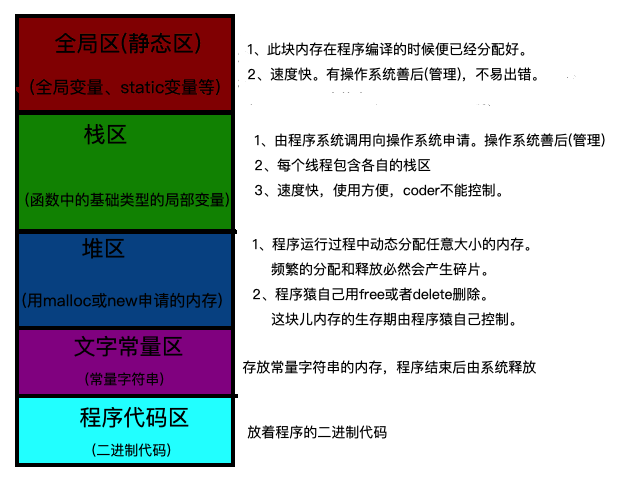

image

以上是程序内存的逻辑分类情况。

我们再来看看一般程序的内存的真实(真实逻辑)图:

 

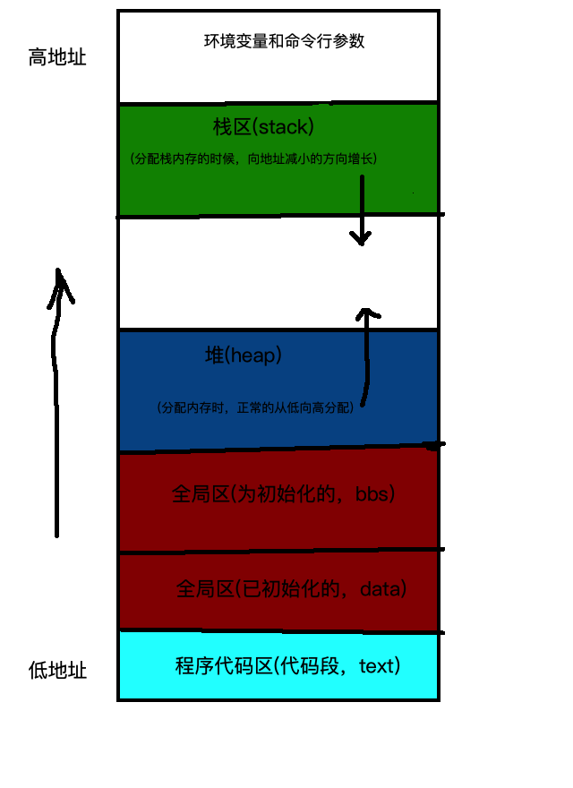

image

## Go的内存分配核心思想

Go是内置运行时的编程语言(runtime)，像这种内置运行时的编程语言通常会抛弃传统的内存分配方式，改为自己管理。这样可以完成类似预分配、内存池等操作，以避开系统调用带来的性能问题，防止每次分配内存都需要系统调用。

Go的内存分配的核心思想可以分为以下几点：

- 每次从操作系统申请一大块儿的内存，由Go来对这块儿内存做分配，减少系统调用
- 内存分配算法采用Google的`TCMalloc算法`。算法比较复杂，究其原理可自行查阅。其核心思想就是把内存切分的非常的细小，分为多级管理，以降低锁的粒度。
- 回收对象内存时，并没有将其真正释放掉，只是放回预先分配的大块内存中，以便复用。只有内存闲置过多的时候，才会尝试归还部分内存给操作系统，降低整体开销

## Go的内存结构

Go在程序启动的时候，会分配一块连续的内存(虚拟内存)。整体如下：

 

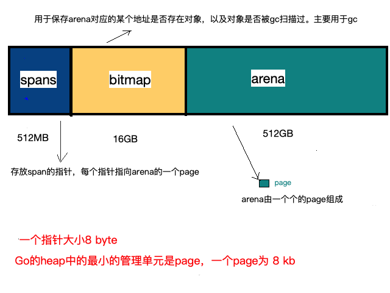

image

图中span和bitmap的大小会随着heap的改变而改变

### arena

arena区域就是我们通常所说的heap。
heap中按照管理和使用两个维度可认为存在两类“东西”：

一类是从管理分配角度，由多个连续的页(page)组成的大块内存：


 

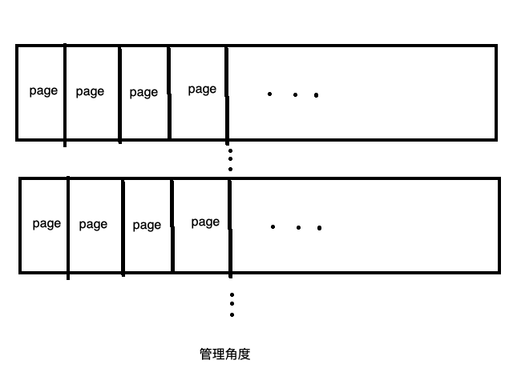

image


另一类是从使用角度出发，就是平时咱们所了解的:heap中存在很多"对象"：


 

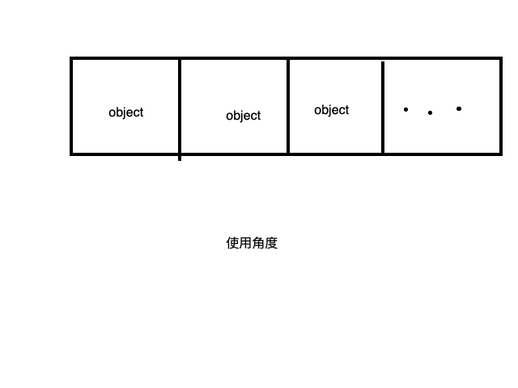

image

### spans

spans区域，可以认为是用于上面所说的管理分配arena(即heap)的区域。
此区域存放了`mspan`的指针，`mspan`是啥后面会讲。
spans区域用于表示arena区中的某一页(page)属于哪个`mspan`。

 

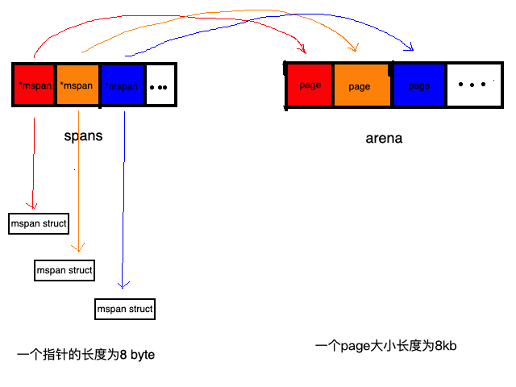

image

 

`mspan`可以说是go内存管理的最基本单元，但是内存的使用最终还是要落脚到“对象”上。`mspan`和对象是什么关系呢？
其实“对象”肯定也放到`page`中，毕竟`page`是内存存储的基本单元。

我们抛开问题不看，先看看一般情况下的对象和内存的分配是如何的：如下图


 

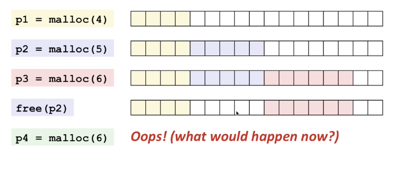

image

假如再分配“p4”的时候，是不是内存不足没法分配了？是不是有很多碎片？

这种一般的分配情况会出现内存碎片的情况，go是如何解决的呢？

可以归结为四个字：按需分配。go将内存块分为大小不同的67种，然后再把这67种大内存块，逐个分为小块(可以近似理解为大小不同的相当于`page`)称之为`span`(连续的`page`)，在go语言中就是上文提及的`mspan`。

 

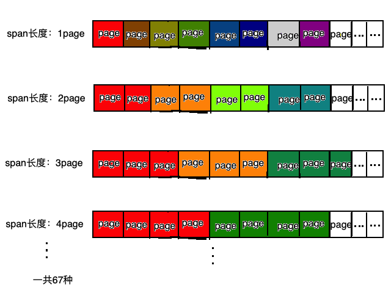

image


对象分配的时候，根据对象的大小选择大小相近的`span`，这样，碎片问题就解决了。

 

67中不同大小的span代码注释如下(目前版本1.11)：


```go
// class  bytes/obj  bytes/span  objects  tail waste  max waste
//     1          8        8192     1024           0     87.50%
//     2         16        8192      512           0     43.75%
//     3         32        8192      256           0     46.88%
//     4         48        8192      170          32     31.52%
//     5         64        8192      128           0     23.44%
//     6         80        8192      102          32     19.07%
//     7         96        8192       85          32     15.95%
//     8        112        8192       73          16     13.56%
//     9        128        8192       64           0     11.72%
//    10        144        8192       56         128     11.82%
//    11        160        8192       51          32      9.73%
//    12        176        8192       46          96      9.59%
//    13        192        8192       42         128      9.25%
//    14        208        8192       39          80      8.12%
//    15        224        8192       36         128      8.15%
//    16        240        8192       34          32      6.62%
//    17        256        8192       32           0      5.86%
//    18        288        8192       28         128     12.16%
//    19        320        8192       25         192     11.80%
//    20        352        8192       23          96      9.88%
//    21        384        8192       21         128      9.51%
//    22        416        8192       19         288     10.71%
//    23        448        8192       18         128      8.37%
//    24        480        8192       17          32      6.82%
//    25        512        8192       16           0      6.05%
//    26        576        8192       14         128     12.33%
//    27        640        8192       12         512     15.48%
//    28        704        8192       11         448     13.93%
//    29        768        8192       10         512     13.94%
//    30        896        8192        9         128     15.52%
//    31       1024        8192        8           0     12.40%
//    32       1152        8192        7         128     12.41%
//    33       1280        8192        6         512     15.55%
//    34       1408       16384       11         896     14.00%
//    35       1536        8192        5         512     14.00%
//    36       1792       16384        9         256     15.57%
//    37       2048        8192        4           0     12.45%
//    38       2304       16384        7         256     12.46%
//    39       2688        8192        3         128     15.59%
//    40       3072       24576        8           0     12.47%
//    41       3200       16384        5         384      6.22%
//    42       3456       24576        7         384      8.83%
//    43       4096        8192        2           0     15.60%
//    44       4864       24576        5         256     16.65%
//    45       5376       16384        3         256     10.92%
//    46       6144       24576        4           0     12.48%
//    47       6528       32768        5         128      6.23%
//    48       6784       40960        6         256      4.36%
//    49       6912       49152        7         768      3.37%
//    50       8192        8192        1           0     15.61%
//    51       9472       57344        6         512     14.28%
//    52       9728       49152        5         512      3.64%
//    53      10240       40960        4           0      4.99%
//    54      10880       32768        3         128      6.24%
//    55      12288       24576        2           0     11.45%
//    56      13568       40960        3         256      9.99%
//    57      14336       57344        4           0      5.35%
//    58      16384       16384        1           0     12.49%
//    59      18432       73728        4           0     11.11%
//    60      19072       57344        3         128      3.57%
//    61      20480       40960        2           0      6.87%
//    62      21760       65536        3         256      6.25%
//    63      24576       24576        1           0     11.45%
//    64      27264       81920        3         128     10.00%
//    65      28672       57344        2           0      4.91%
//    66      32768       32768        1           0     12.50%
```

说说每列代表的含义：

- class： class ID，每个span结构中都有一个class ID, 表示该span可处理的对象类型
- bytes/obj：该class代表对象的字节数
- bytes/span：每个span占用堆的字节数，也即页数*页大小
- objects: 每个span可分配的对象个数，也即（bytes/spans）/（bytes/obj）
- waste bytes: 每个span产生的内存碎片，也即（bytes/spans）%（bytes/obj）

阅读方式如下：
以类型(class)为1的span为例,span中的元素大小是8 byte, span本身占1页也就是8K, 一共可以保存1024个对象。

细心的同学可能会发现代码中一共有66种，还有一种特殊的span：
即对于大于32k的对象出现时，会直接从heap分配一个特殊的span，这个特殊的span的类型(class)是0, 只包含了一个大对象, span的大小由对象的大小决定。

### bitmap

bitmap 有好几种:Stack, data, and bss bitmaps，再就是这次要说的`heap bitmaps`。
在此bitmap的做作用是标记标记`arena`(即heap)中的对象。一是的标记对应地址中是否存在对象，另外是标记此对象是否被gc标记过。一个功能一个bit位，所以，`heap bitmaps`用两个bit位。
bitmap区域中的一个byte对应arena区域的四个指针大小的内存的结构如下：

 

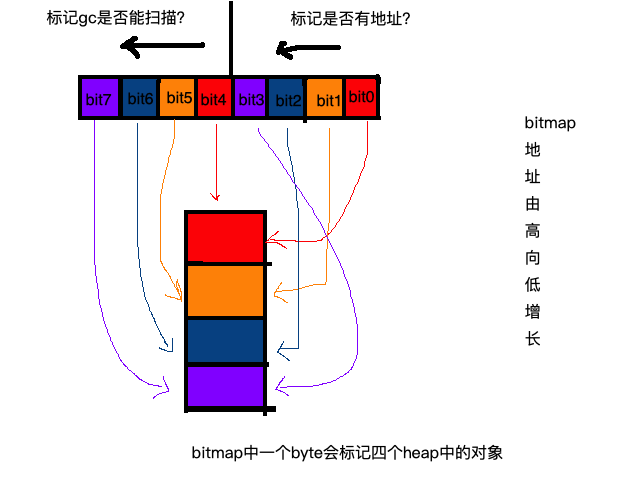

image

bitmap的地址是由高地址向低地址增长的。

宏观的图为：

 

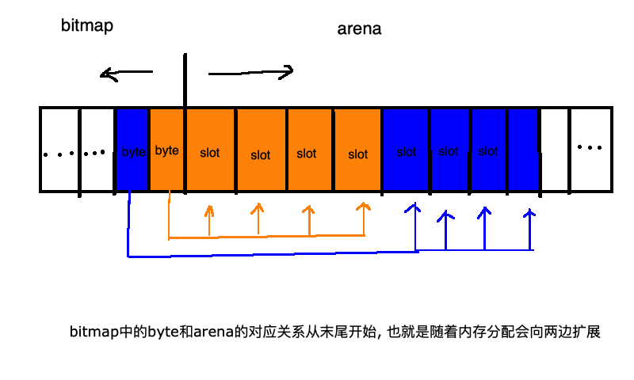

image


bitmap 主要的作用还是服务于GC。

`arena`中包含基本的管理单元和程序运行时候生成的对象或实体，这两部分分别被`spans`和`bitmap`这两块非heap区域的内存所对应着。
逻辑图如下：

 

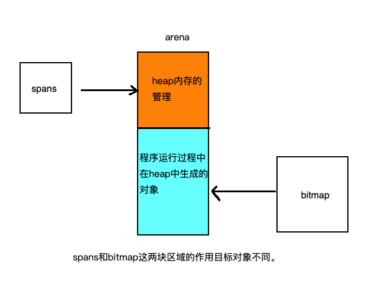

image


spans和bitmap都会根据arena的动态变化而动态调整大小。

 

## 内存管理组件

go的内存管理组件主要有：`mspan`、`mcache`、`mcentral`和`mheap`

- `mspan`为内存管理的基础单元，直接存储数据的地方。
- `mcache`：每个运行期的goroutine都会绑定的一个`mcache`(具体来讲是绑定的GMP并发模型中的P，所以可以无锁分配`mspan`，后续还会说到)，`mcache`会分配goroutine运行中所需要的内存空间(即`mspan`)。
- `mcentral`为所有`mcache`切分好后备的`mspan`
- `mheap`代表Go程序持有的所有堆空间。还会管理闲置的span，需要时向操作系统申请新内存。

### mspan

 

 

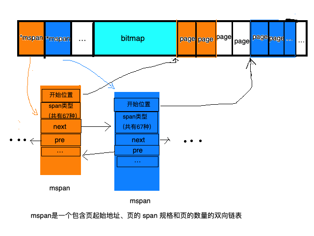

image


有人会问：mspan结构体存放在哪儿？其实，mspan结构本身的内存是从系统分配的，在此不做过多讨论。
`mspan`在上文讲`spans`的时候具体讲过，就是方便根据对象大小来分配使用的内存块，一共有67种类型；最主要解决的是内存碎片问题，减少了内存碎片，提高了内存使用率。
`mspan`是双向链表，其中主要的属性如下图所示：

 

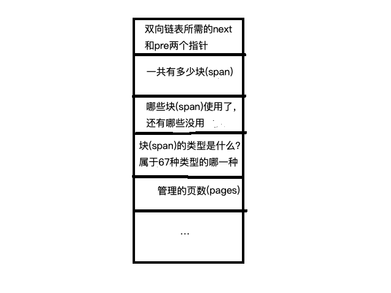

image

 

`mspan`是go中内存管理的基本单元，在上文`spans`中其实已经做了详细的解说，在此就不在赘述了。

### mcache

为了避免多线程申请内存时不断的加锁，goroutine为每个线程分配了`span`内存块的缓存，这个缓存即是`mcache`，每个goroutine都会绑定的一个`mcache`，各个goroutine申请内存时不存在锁竞争的情况。

如何做到的？

在讲之前，请先回顾一下Go的并发调度模型，如果你还不了解，请看我这篇文章 [https://mp.weixin.qq.com/s/74hbRTQ2TjdH5G9F2of4_g](https://links.jianshu.com/go?to=https%3A%2F%2Fmp.weixin.qq.com%2Fs%2F74hbRTQ2TjdH5G9F2of4_g)

然后请看下图：

 

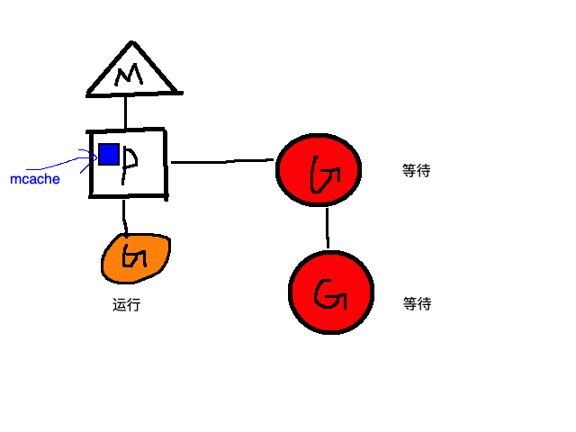

image

大体上就是上图这个样子了。注意看我们的`mcache`在哪儿呢？就在P上！
知道为什么没有锁竞争了吧，因为运行期间一个goroutine只能和一个P关联，而`mcache`就在P上，所以，不可能有锁的竞争。

我们再来看看`mcache`具体的结构：

 

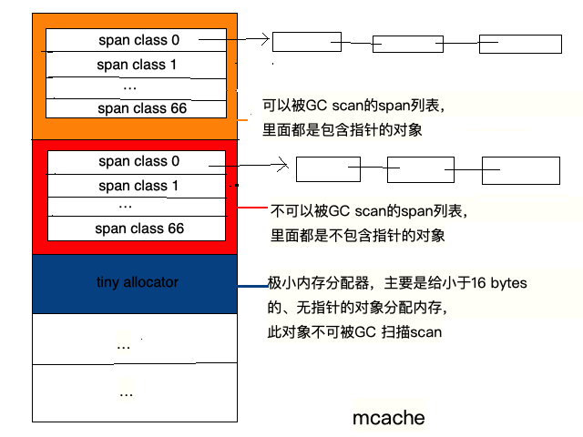

image

mcache中的span链表分为两组，一组是包含指针类型的对象，另一组是不包含指针类型的对象。为什么分开呢？

主要是方便GC，在进行垃圾回收的时候，对于不包含指针的对象列表无需进一步扫描是否引用其他活跃的对象(如果对go的gc不是很了解，请看我这篇文章 [https://mp.weixin.qq.com/s/_h0-8hma5y_FHKBeFuOOyw](https://links.jianshu.com/go?to=https%3A%2F%2Fmp.weixin.qq.com%2Fs%2F_h0-8hma5y_FHKBeFuOOyw))。

对于 `<=32k`的对象，将直接通过`mcache`分配。

在此，我觉的有必要说一下go中对象按照的大小维度的分类。
分为三类：

- tinny allocations (size < 16 bytes，no pointers)
- small allocations (16 bytes < size <= 32k)
- large allocations (size > 32k)

前两类：`tiny allocations`和`small allocations`是直接通过`mcache`来分配的。

对于`tiny allocations`的分配，有一个微型分配器`tiny allocator`来分配，分配的对象都是不包含指针的，例如一些小的字符串和不包含指针的独立的逃逸变量等。

`small allocations`的分配，就是`mcache`根据对象的大小来找自身存在的大小相匹配`mspan`来分配。
当`mcach`没有可用空间时，会从`mcentral`的 `mspans` 列表获取一个新的所需大小规格的`mspan`。

### mcentral

为所有`mcache`提供切分好的`mspan`。
每个`mcentral`保存一种特定类型的全局`mspan`列表，包括已分配出去的和未分配出去的。

 

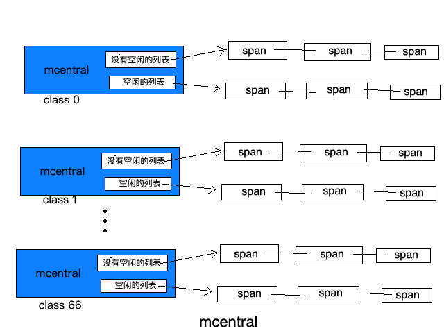

image

还记得`mspan`的67种类型吗？有多少种类型的`mspan`就有多少个`mcentral`。

每个`mcentral`都会包含两个`mspan`的列表：

- 没有空闲对象或`mspan`已经被`mcache`缓存的`mspan`列表(empty mspanList)
- 有空闲对象的`mspan`列表(empty mspanList)

由于`mspan`是全局的，会被所有的`mcache`访问，所以会出现并发性问题，因而`mcentral`会存在一个锁。

单个的`mcentral`结构如下：

 

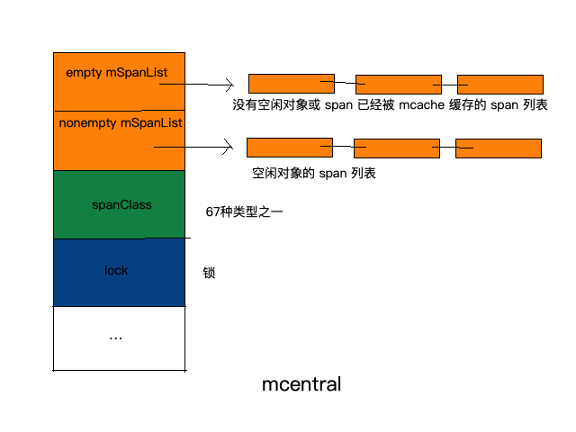

image

 

假如需要分配内存时，`mcentral`没有空闲的`mspan`列表了，此时需要向`mheap`去获取。

### mheap

`mheap`可以认为是Go程序持有的整个堆空间，`mheap`全局唯一，可以认为是个全局变量。
其结构如下：

 

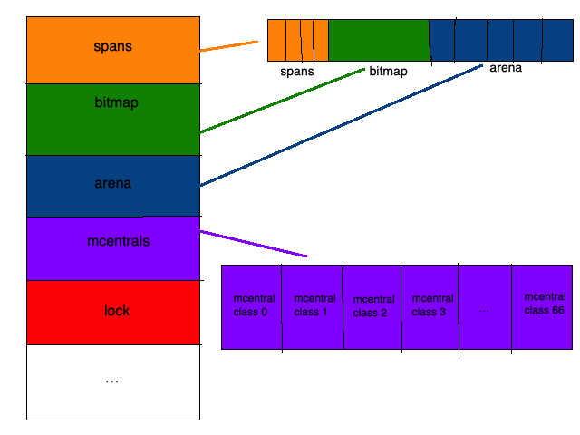

image

`mheap`包含了除了上文中讲的`mcache`之外的一切，`mcache`是存在于Go的GMP调度模型的P中的，上文中已经讲过了，关于GMP并发模型，可以参考我的文章 [https://mp.weixin.qq.com/s/74hbRTQ2TjdH5G9F2of4_g](https://links.jianshu.com/go?to=https%3A%2F%2Fmp.weixin.qq.com%2Fs%2F74hbRTQ2TjdH5G9F2of4_g)。
仔细观察，可以发现`mheap`中也存在一个锁lock。这个lock是作用是什么呢？

我们知道，大于32K的对象被定义为大对象，直接通过`mheap` 分配。这些大对象的申请是由`mcache`发出的，而`mcache`在P上，程序运行的时候往往会存在多个P，因此，这个内存申请是并发的；所以为了保证线程安全，必须有一个全局锁。

假如需要分配的内存时，`mheap`中也没有了，则向操作系统申请一系列新的页（最小 1MB）。

## Go内存分配流程总结

对象分三种：

- 微小对象，size < 16B
- 一般小对象， 16 bytes < size <= 32k
- 大对象 size > 32k

分配方式分三种：

- tinny allocations (size < 16 bytes，no pointers) 微型分配器分配。
- small allocations ( size <= 32k) 正常分配；首先通过计算使用的大小规格，然后使用 mcache 中对应大小规格的块分配
- large allocations (size > 32k) 大对象分配；直接通过`mheap`分配。这些大对象的申请是以一个全局锁为代价的，因此任何给定的时间点只能同时供一个 P 申请。

对象分配：

- size范围在在( size < 16B)，不包含指针的对象。 `mcache`上的微型分配器分配
- size范围在(0 < size < 16B)， 包含指针的对象：正常分配
- size范围在(16B < size <= 32KB)， : 正常分配
- size范围在( size > 32KB) : 大对象分配

分配顺序：

- 首先通过计算使用的大小规格。
- 然后使用`mcache`中对应大小规格的块分配。
- 如果`mcentral`中没有可用的块，则向`mheap`申请，并根据算法找到最合适的`mspan`。
- 如果申请到的`mspan` 超出申请大小，将会根据需求进行切分，以返回用户所需的页数。剩余的页构成一个新的 mspan 放回 mheap 的空闲列表。
- 如果 mheap 中没有可用 span，则向操作系统申请一系列新的页（最小 1MB）。

Go的内存管理是非常复杂的，且每个版本都有细微的变化，在此，只讲了些最容易宏观掌握的东西，希望大家多多提意见，如有什么问题，请及时与我沟通，以下是联系方式：

参考文献:

- 程序在内存中的分布 [https://www.cnblogs.com/Lynn-Zhang/p/5449199.html](https://links.jianshu.com/go?to=https%3A%2F%2Fwww.cnblogs.com%2FLynn-Zhang%2Fp%2F5449199.html)
- 从内存分配开始 [https://mp.weixin.qq.com/s/EyWKFRu1xryoHY386QUcuA](https://links.jianshu.com/go?to=https%3A%2F%2Fmp.weixin.qq.com%2Fs%2FEyWKFRu1xryoHY386QUcuA)
- 译文：Go 内存分配器可视化指南 [https://www.linuxzen.com/go-memory-allocator-visual-guide.html](https://links.jianshu.com/go?to=https%3A%2F%2Fwww.linuxzen.com%2Fgo-memory-allocator-visual-guide.html)
- 图解Go语言内存分配 [https://juejin.im/post/5c888a79e51d456ed11955a8](https://links.jianshu.com/go?to=https%3A%2F%2Fjuejin.im%2Fpost%2F5c888a79e51d456ed11955a8)
- Golang源码探索(三) GC的实现原理 [https://www.cnblogs.com/zkweb/p/7880099.html](https://links.jianshu.com/go?to=https%3A%2F%2Fwww.cnblogs.com%2Fzkweb%2Fp%2F7880099.html)
- 简单易懂的 Go 内存分配原理解读 [https://yq.aliyun.com/articles/652551](https://links.jianshu.com/go?to=https%3A%2F%2Fyq.aliyun.com%2Farticles%2F652551)
- 雨痕<<Go源码解析>>
- go内存分配(英文) [https://andrestc.com/post/go-memory-allocation-pt1/](https://links.jianshu.com/go?to=https%3A%2F%2Fandrestc.com%2Fpost%2Fgo-memory-allocation-pt1%2F)

作者：RyuGou
链接：https://www.jianshu.com/p/2904efc7f1a8
来源：简书
著作权归作者所有。商业转载请联系作者获得授权，非商业转载请注明出处


