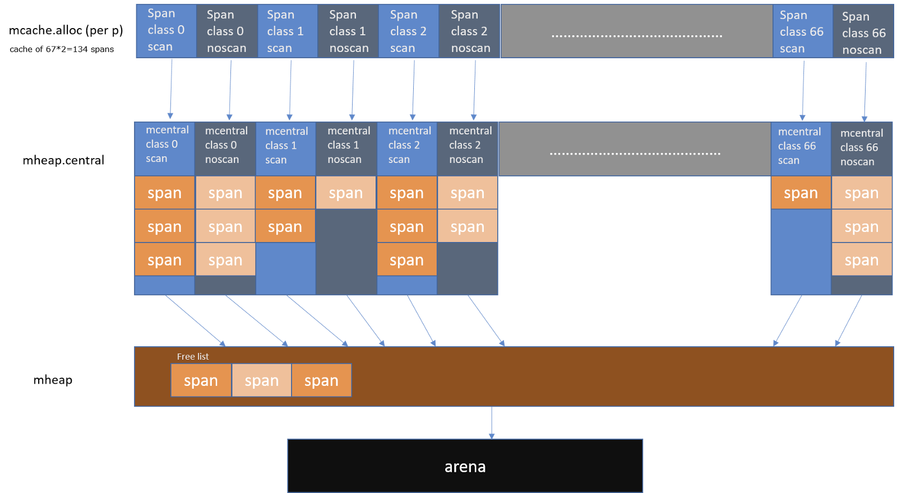

详见： [Source file src/runtime/mstats.go](_resource/src_runtime_mstats.go - The Go Programming Language.html)


```go
type mstats struct {
        alloc       uint64 // bytes allocated and not yet freed
        total_alloc uint64 // bytes allocated (even if freed)
        sys         uint64 // bytes obtained from system (should be sum of xxx_sys below, no locking, approximate)
        nlookup     uint64 // number of pointer lookups (unused)
        nmalloc     uint64 // number of mallocs
        nfree       uint64 // number of frees
        heap_alloc    uint64 // bytes allocated and not yet freed (same as alloc above)
        heap_sys      uint64 // virtual address space obtained from system for GC'd heap
        heap_idle     uint64 // bytes in idle spans
        heap_inuse    uint64 // bytes in mSpanInUse spans
        heap_released uint64 // bytes released to the os
        heap_objects uint64 // total number of allocated objects
        stacks_inuse uint64 // bytes in manually-managed stack spans; updated atomically or during STW
        stacks_sys   uint64 // only counts newosproc0 stack in mstats; differs from MemStats.StackSys
        mspan_inuse  uint64 // mspan structures
        mspan_sys    uint64
        mcache_inuse uint64 // mcache structures
        mcache_sys   uint64
        buckhash_sys uint64 // profiling bucket hash table
        gc_sys       uint64 // updated atomically or during STW
        other_sys    uint64 // updated atomically or during STW
        next_gc         uint64 // goal heap_live for when next GC ends; ^0 if disabled
        last_gc_unix    uint64 // last gc (in unix time)
        pause_total_ns  uint64
        pause_ns        [256]uint64 // circular buffer of recent gc pause lengths
        pause_end       [256]uint64 // circular buffer of recent gc end times (nanoseconds since 1970)
        numgc           uint32
        numforcedgc     uint32  // number of user-forced GCs
        gc_cpu_fraction float64 // fraction of CPU time used by GC
        enablegc        bool
        debuggc         bool
        by_size [_NumSizeClasses]struct {  // 这个side class的统计，目前好像是分为61个class
                size    uint32
                nmalloc uint64
                nfree   uint64
        }
        last_gc_nanotime uint64 // last gc (monotonic time)
        tinyallocs       uint64 // number of tiny allocations that didn't cause actual allocation; not exported to go directly
        last_next_gc     uint64 // next_gc for the previous GC
        last_heap_inuse  uint64 // heap_inuse at mark termination of the previous GC
        triggerRatio float64
        gc_trigger uint64
        heap_live uint64
        heap_scan uint64
        heap_marked uint64
}    
```


```go
type MemStats struct {
        Alloc uint64
        TotalAlloc uint64
        Sys uint64
        Lookups uint64
        Mallocs uint64
        Frees uint64
        HeapAlloc uint64
        HeapSys uint64
        HeapIdle uint64
        HeapInuse uint64
        HeapReleased uint64
        HeapObjects uint64
        StackInuse uint64
        StackSys uint64
        MSpanInuse uint64
        MSpanSys uint64
        MCacheInuse uint64
        MCacheSys uint64
        BuckHashSys uint64
        GCSys uint64
        OtherSys uint64
        NextGC uint64
        LastGC uint64
        PauseTotalNs uint64
        PauseNs [256]uint64
        PauseEnd [256]uint64
        NumGC uint32
        NumForcedGC uint32
        GCCPUFraction float64
        EnableGC bool
        DebugGC bool
        BySize [61]struct {
                Size uint32
                Mallocs uint64
                Frees uint64
        }
}
```


## 分类介绍

关于mspan、mcache、mheap，详见go内存管理。

* 源码
* 文章
  * [图解go内存分配器](https://tonybai.com/2020/02/20/a-visual-guide-to-golang-memory-allocator-from-ground-up/) 翻译自 [A visual guide to Go Memory Allocator from scratch (Golang)](https://blog.learngoprogramming.com/a-visual-guide-to-golang-memory-allocator-from-ground-up-e132258453ed)





* mspan

  * `mspan_inuse` = `uint64(mheap_.spanalloc.inuse)` 
  * `mspan_sys`

* mcache

  听起来是mcache数据结构自身的内存，而不是其中持有的mspan。 但这个sys不太理解，从os获得的用于构建mcache数据结构的内存（还会有没分配也即non-inuse的部分吗）

  * `mcache_inuse` = `uint64(mheap_.cachealloc.inuse)`
  * `mcache_sys`

* heap

  * `heap_alloc` = `alloc`
  * `heap_idle`
  * `heap_inuse`
  * `heap_released`
  * `heap_objects` = `nmalloc` - `nfree`

* stack

  * `stacks_inuse`
  * `stacks_sys`

* 对象分配相关

  * `alloc` = `total_alloc` - `total_free`

  * `total_alloc`

    计算方式，由下面几部分组成（求和）

    * 对于每个central的： `c.nmalloc * uint64(class_to_size[i])`

      nmalloc乘以class对应的size

    * `mheap_.largealloc`

  * <u>total_free</u> 这个没有作为指标导出，而是计算中间结果

    由下面几部分组成（求和）

    * <u>small_free</u>
    * `mheap_.largefree`

  * <u>small_free</u> 这个没有作为指标导出，而是计算中间结果

    * 每个class（i）的： `mheap_.nsmallfree[i] * uint64(class_to_size[i])`

      数量乘以大小

  * <u>class（`i`）的nsmallfree</u>

    * 每个processor的mcache： `local_nsmallfree[i]` 

    类似的： `tinyallocs`, `largefree`, `nlargefree` 也会聚合各processor的mcache的

  * `nmalloc`

    会由下面几部分值组成（求和）

    * `mheap_.central`的各个mcentral的`nmalloc`

      这个也会加给这个central对应的class的 by_size item

    * `mheap_.nlargealloc`

    * `mstats.tinyallocs`

  * `nfree`

    会由下面几部分值组成（求和）

    * 每个class的： `mheap_.nsmallfree[i]`

      这个也会赋给 by_size 的nfree

    * `mstats.tinyallocs` 这个不做实际分配 = =

  * `by_size [_NumSizeClasses]struct { size; nmalloc; nfree; }` small alloc的统计（不同class）

* gc相关

  * `gc_sy` bytes，gc metadata内存
  * `next_gc` heap size
  * `last_gc_unix`
  * `pause_total_ns` 累计值。 记录gc stw的总时间
  * `pause_ns` 环形队列（256），记录每次`(NumGC+255)%256` gc的stw（多次停顿求和）时间 
  * `pause_end` 同样环形队列，记录每次gc的stw结束时间。 由于一次gc周期可能多次停顿，这里记录的是最后一次的
  * `numgc` 已完成的gc次数
  * `numforcedgc` forcedGC的次数，指的是程序显式调用触发的gc
  * `gc_cpu_fraction` 程序启动以来gc花费的cpu占总cpu时间的比例
  * `enablegc` 永远true，即使`GOGC=off` - 晕死
  * `debuggc` 暂时没使用

* 全局

  * `sys`

    由以下组成（求和）

    * `heap_sys`
    * `stacks_sys`
    * `mspan_sys`
    * `mcache_sys`
    * `buckhash_sys`
    * `gc_sys`
    * `other_sys`
    * `stacks_inuse` 这个也视为sys

* 杂
  * `nlookup`
  * `buckhash_sys`
  * `other_sys`

