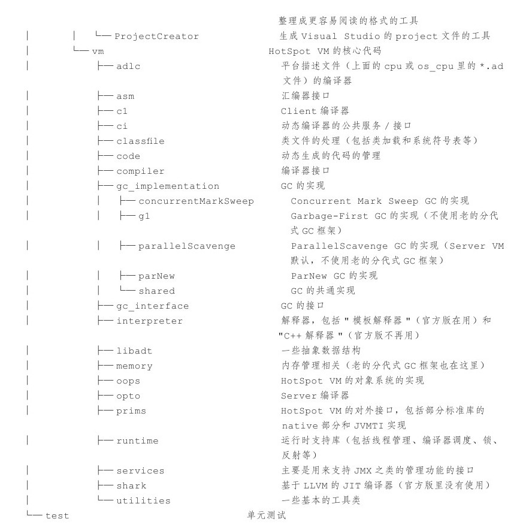

# 代码

## 代码结构

* jdk
  * mostly jre classes (bootstrap, system, libraries)
  * a few sdk class (jvmti support ...)
  * os-specific subclasses
* langtools
  * only sdk classes
* corba, jaxp, jaxws
  * EE rather than SE

## 代码分类

# 环境、工具

[【hello,world 也打脸】记storm-starter在某知名IDE下的悲催调试经历](http://www.cnblogs.com/foreach-break/p/dig_NoClassDefFound_Exception_inside_JVM.html) 中<del>应该</del>是用netBeans调试jvm，看起来效果不错。

