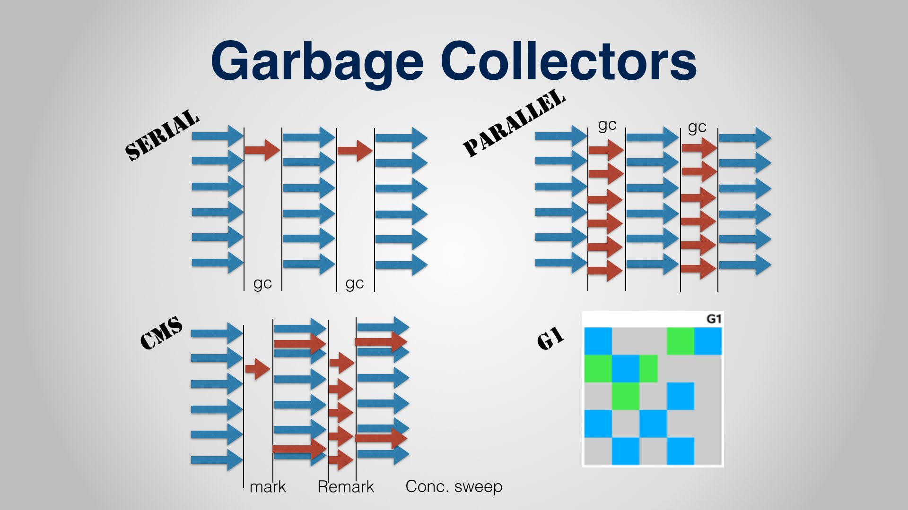
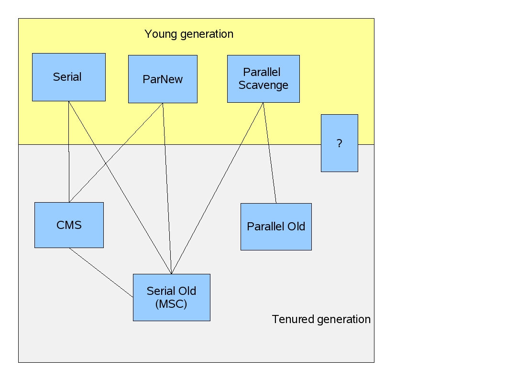
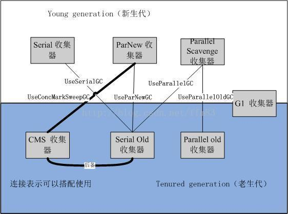

ref：

* [Java GC工作原理以及Minor GC、Major GC、Full GC简单总结](http://blog.csdn.net/u012500848/article/details/51355404)
* [知乎问题【Major GC和Full GC的区别是什么？触发条件呢？】 - R大回复](https://www.zhihu.com/question/41922036/answer/93079526)
* [知乎问题【Major GC和Full GC的区别是什么？触发条件呢？】 - ted-mosby-4-95回复](https://www.zhihu.com/question/41922036/)


# 概念

## 概念：minor GC、major GC、full GC VS CMS and etc...


ref：

- [Java Major and Minor Garbage Collections](https://stackoverflow.com/questions/16549066/java-major-and-minor-garbage-collections)

- [Minor GC、Major GC和Full GC之间的区别](http://www.importnew.com/15820.html)

  吐槽一下，翻译的不好。


> by ted-mosby-4-95

- fullGC

  定义是相对明确的，就是针对整个新生代、老生代、元空间（metaspace，java8以上版本取代perm gen）的全局范围的GC

- Minor GC和Major GC

  是俗称，在Hotspot JVM实现的Serial GC, Parallel GC, CMS, G1 GC中大致可以对应到某个Young GC和Old GC算法组合


> 这些术语无论是在 JVM 规范还是在垃圾收集研究论文中都没有正式的定义

确实，JLS、JVMS、Hotspot MM文档里都没有对这些词的明确定义，只有提及。


字面意思：

- minor

  清理年轻代内存

- major

  清理老年代内存（？）

  > 按照major == full的说法，old gen GC没有专门的称呼？

- full

  清理整个堆空间—包括年轻代和老年代

实际：

- 很多major GC是由minor触发

- major == full

  > {yonka} 概念混乱，按照前面来自R大的说法，major 主要 == full，偶尔 == old GC

- major是否先minor根据配置而定

- old代的GC动作不都属于fullGC，只有STW阶段才算（对于CMS来说为mark和remark，所以一次会fullGC计数+2）

  > {yonka} 但这么理解的话fullGC的定义就成了： GC的STW部分。 跟前端fullGC的定义就冲突了


- **Minor Collection** is triggered when then JVM is unable to allocate space for a new Object (Remember: new objects are always allocated in Young Generation's Eden Area).
- JVM considers **Major Collection** [in the Older (or Perm) Generation] as **Full GC**. 


# 分代内存管理


## 不同代支持的GC方式


For Young Generation, you can use any one of the following:

- `-XX:+UseSerialGC`
- `-XX:+UseParallelGC`
- `-XX:+UseParNewGC`

For Old Generation, the available choices are:

- `-XX:+UseParallelOldGC`
- `-XX:+UseConcMarkSweepGC`


# GC思路


* 引用计数

  循环引用问题

* 可达性

  * GC roots

    * 全局性
      * 常量
      * 类静态属性
    * 执行上下文
      * 线程栈帧-本地变量表

  * 需要在一致性“快照”条件 - 一般是安全点/安全区域

    * 影响： STW

      枚举根节点是STW的

    * 选取

      不可能每条指令都做安全点检查 - 开销太大。

      选择原则：*是否具有让程序长时间执行的特征* - 明显特征就是**指令复用**，如

      * 方法调用
      * 循环跳转
      * 异常跳转
      * ...

      > 详见安全点相关文

  * 准确式GC

    线程“配合”在关键点（进入安全点、安全区域等）时记录好对象引用信息（OopMap），减少遍历开销，快速准确的完成GC roots的枚举


# GC方式

* `copy`

  * 优点

    * 实现简单
    * 运行高效（主要是在回收比高时）

  * 缺点

    * 可用内存减少一半

      `eden + 2 * survivor`的改进模型强点

  * 主要用于young gen GC（“朝生夕死”，回收率高 - 非绝对）

* `mark-sweep`

  * 变体： `mark-compact`


# GC分类


> by R大

针对HotSpot VM的实现，它里面的GC其实准确分类只有两大种：

* Partial GC：并不收集整个GC堆的模式
  * Young GC：只收集young gen的GC
  * Old GC：只收集old gen的GC。只有CMS的concurrent collection是这个模式
  * Mixed GC：收集整个young gen以及部分old gen的GC。只有G1有这个模式
* Full GC：收集整个堆，包括young gen、old gen、perm gen（如果存在的话）等所有部分的模式。

> Major GC通常是跟full GC是等价的，收集整个GC堆。但因为HotSpot VM发展了这么多年，外界对各种名词的解读已经完全混乱了，当有人说“major GC”的时候一定要问清楚他想要指的是上面的full GC还是old GC。


# GC算法组合


* serial/serial young

  在young区用serial算法。

  serial就是最简单的思路： STW后，一个线程吭哧吭哧的GC完再恢复

  The *(original) copying collector* (Enabled by default). When this collector kicks in, all application threads are stopped, and the copying collection proceeds using one thread (which means only one CPU even if on a multi-CPU machine). This is known as a stop-the-world collection, because basically the JVM pauses everything else until the collection is completed.

* serial old

  在old去用serial算法

* parNew

  serial的多线程版本

  > par应该也是parallel吧

  思路： STW后，多个线程一起GC完后再恢复

  > 单core的话多线程明显增加了并发访问的开销而没有带来好处 - 也即只适合多核。
  >
  > 默认线程数为核数，可以通过 `-XX:ParallelGCThreads`来指定（尤其核数很多时）

  The *parallel copying collector* (Enabled using -XX:+UseParNewGC). Like the original copying collector, this is a stop-the-world collector. However this collector parallelizes the copying collection over multiple threads, which is more efficient than the original single-thread copying collector for multi-CPU machines (though not for single-CPU machines). This algorithm potentially speeds up young generation collection by a factor equal to the number of CPUs available, when compared to the original singly-threaded copying collector.

* PS/parallel scavenge

  * 1.4引入
  * young gen
  * 从parallel可以知道是多线程并行收集
  * 重点在**吞吐量**
  * 可以通过 `-XX:MaxGCPauseMillis`、`-XX:GCTimeRatio` 来控制行为
    * 前者调小，虽然每次pause减小，但每次收集效率降低，频次增加，整体吞吐量下降
    * 后者就是GC time占总时间的比例

  The *parallel scavenge collector* (Enabled using -XX:UseParallelGC). This is like the previous parallel copying collector, but the algorithm is tuned for gigabyte heaps (over 10GB) on multi-CPU machines. This collection algorithm is designed to maximize throughput while minimizing pauses. It has an optional adaptive tuning policy which will automatically resize heap spaces. If you use this collector, you can only use the the original mark-sweep collector in the old generation (i.e. the newer old generation concurrent collector cannot work with this young generation collector).

* parallel old

  > 是不是也可以叫 PS old？

  * 1.6引入
  * 显然，old gen

* CMS/CMS old

  * 1.5引入
  * 主要目标： 低延迟
  * CPU敏感，一部分阶段和用户线程并发，虽然不pause，但吃CPU影响部分性能
  * 分为四个阶段
    * 初始标记 - STW，单线程
    * 并发标记 - 单线程，不STW，和用户线程一起
    * 重新标记 - STW，多线程
    * 并发清除 - 单线程，不STW，和用户线程一起


> PS和G1都是独立实现，没有使用传统的GC收集器代码框架，所以





> by ted-mosby-4-95

* serial GC算法

  全局范围的GC算法

  serial young GC（或者直接叫serial GC） + serial old GC

* Parallel GC算法

  全局范围的GC算法

  parallel young GC + PS marksweep GC（非并行）/parallel old GC（并行）

  > 官方给的图里PS young只能组合 seria old 或者 parallel old，而这个 PS marksweep是什么鬼？

  old区算法选择由`UseParallelOldGC`控制

* CMS算法

  （old区算法？）

  parNew GC（young） + CMS GC（old） + fullGC for CMS

* G1 GC

  young GC + mixed GC + fullGC for G1





## GC算法选择/组合相关选项

ref： [JAVA学习笔记--垃圾收集器](http://www.jianshu.com/p/8cc2d150af1f)





| 参数                      | 描述                                       | 新生代GC方式                   | 老年代和持久代GC方式                              |
| ----------------------- | ---------------------------------------- | ------------------------- | ---------------------------------------- |
| -XX:+UseSerialGC        | Jvm运行在Client模式下的默认值，打开此开关后，使用Serial + Serial Old的收集器组合进行内存回收 | Serial 串行GC               | Serial Old 串行GC                          |
| -XX:+UseParNewGC        | 打开此开关后，使用ParNew + Serial Old的收集器进行垃圾回收   | ParNew 并行GC               | Serial Old 串行GC                          |
| -XX:+UseConcMarkSweepGC | 使用ParNew + CMS +  Serial Old的收集器组合进行内存回收，Serial Old作为CMS出现“Concurrent Mode Failure”失败后的后备收集器使用。 | ParNew 并行GC               | CMS 并发GC 当出现“Concurrent Mode Failure”时采用Serial Old 串行GC |
| -XX:+UseParallelGC      | Jvm运行在Server模式下的默认值，打开此开关后，使用Parallel Scavenge +  Serial Old的收集器组合进行回收 | Parallel Scavenge  并行回收GC | Serial Old 串行GC                          |
| -XX:+UseParallelOldGC   | 使用Parallel Scavenge +  Parallel Old的收集器组合进行回收 | Parallel Scavenge  并行回收GC | Parallel Old 并行GC                        |


TODO 疑问：

* 如何选择使用一些允许其他组合，比如：
  * serial + CMS


# GC的相关JVM选项

* misc

  * `DisableExplicitGC` 禁止`System.gc()`

  * `-client`|`-server` 

    影响默认GC算法，`serial`(serial + serial)还是`parallel`(PS + serial)

  * `UseGCOverheadLimit`

  * `UseTLAB`

* 堆大小相关

  * `-Xmn`|`-Xms`|`-Xmx`

    young区初始+最大、堆初始、堆最大（GC算法无关吧）

  * `InitialHeapSize` - `-Xms`

  * PS - `InitialSurvivorRatio`

  * `UseAdaptiveSizePolicy`

  * G1 - `G1HeapRegionSize`

  * G1 - `G1ReservePercent`

* 特定GC算法相关

  * serial
    * `UseSerialGC`
  * CMS
    * `UseConcMarkSweepGC`
    * `CMSClassUnloadingEnabled` 顾名思义，默认开启
    * `CMSExpAvgFactor`
    * `CMSInitiatingOccupancyFraction`
    * `CMSScavengeBeforeRemark`
    * `CMSTriggerRatio`
    * `ExplicitGCInvokesConcurrent`
    * `ExplicitGCInvokesConcurrentAndUnloadsClasses`
    * `UseCMSInitiatingOccupancyOnly`
  * G1
    * `UseG1GC`
    * `G1PrintHeapRegions`
  * ParNew
    * `UseParNewGC`
  * PS
    * `UseParallelGC`
    * `UseParallelOldGC`

* 特定类别GC算法相关

  * 并发GC

    CMS, G1

    * `ConcGCThreads`

      ```cpp
        product(uintx, ConcGCThreads, 0,                                          \
                "Number of threads concurrent gc will use")  
      ```

    * `InitiatingHeapOccupancyPercent`

      只看到G1使用了

# GC（触发）时机

“简单说，触发条件就是某GC算法对应区域满了，或是预测快满了”


## minor GC/young gen GC时机

“各种Young GC的触发原因都是eden区满了”


* non-concurrent GC
  * Hotspot VM serialGC

    当young gen中的**eden区分配满**的时候触发。注意young GC中有部分存活对象会晋升到old gen，所以young GC后old gen的占用量通常会有所升高。

    **其他差不多**


  * Parallel Scavenge

    fullGC前默认会先做young GC（由默认启用的`-XX:+ScavengeBeforeFullGC`选项控制）

* 并发GC

  ​


## full GC时机


## 显式GC： System.gc


* 默认行为为fullGC
* 在不同的collector中可以通过JVM选项来替换为其他行为，比如CMS中可以替换为`VM_GenCollectFullConcurrent`


# full GC 深入源码


```cpp
JVM_ENTRY_NO_ENV(void, JVM_GC(void))
  JVMWrapper("JVM_GC");
  if (!DisableExplicitGC) {
    Universe::heap()->collect(GCCause::_java_lang_system_gc);
  }
JVM_END
  
  // Perform a collection of the heap; intended for use in implementing
  // "System.gc".  This probably implies as full a collection as the
  // "CollectedHeap" supports.
  virtual void collect(GCCause::Cause cause) = 0;


  // Perform a full collection of the heap; intended for use in implementing
  // "System.gc". This implies as full a collection as the CollectedHeap
  // supports. Caller does not hold the Heap_lock on entry.
  void collect(GCCause::Cause cause);


// public collection interfaces

void GenCollectedHeap::collect(GCCause::Cause cause) {
  if (should_do_concurrent_full_gc(cause)) { // CMS + System.gc + ExplicitGCInvokesConcurrent 的话这里会为true
#if INCLUDE_ALL_GCS
    // mostly concurrent full collection
    collect_mostly_concurrent(cause);
#else  // INCLUDE_ALL_GCS
    ShouldNotReachHere();
#endif // INCLUDE_ALL_GCS
  } else if (cause == GCCause::_wb_young_gc) {
    // minor collection for WhiteBox API
    collect(cause, 0);
  } else {
#ifdef ASSERT
  if (cause == GCCause::_scavenge_alot) {
    // minor collection only
    collect(cause, 0);
  } else {
    // Stop-the-world full collection
    collect(cause, n_gens() - 1);
  }
#else
    // Stop-the-world full collection
    collect(cause, n_gens() - 1);
#endif
  }
}

bool GenCollectedHeap::should_do_concurrent_full_gc(GCCause::Cause cause) {
  return UseConcMarkSweepGC &&
         ((cause == GCCause::_gc_locker && GCLockerInvokesConcurrent) ||
          (cause == GCCause::_java_lang_system_gc && ExplicitGCInvokesConcurrent));
}

void GenCollectedHeap::collect_mostly_concurrent(GCCause::Cause cause) {
  assert(!Heap_lock->owned_by_self(), "Should not own Heap_lock");

  MutexLocker ml(Heap_lock);
  // Read the GC counts while holding the Heap_lock
  unsigned int full_gc_count_before = total_full_collections();
  unsigned int gc_count_before      = total_collections();
  {
    MutexUnlocker mu(Heap_lock);
    VM_GenCollectFullConcurrent op(gc_count_before, full_gc_count_before, cause);
    VMThread::execute(&op);
  }
}

void GenCollectedHeap::collect(GCCause::Cause cause, int max_level) {
  // The caller doesn't have the Heap_lock
  assert(!Heap_lock->owned_by_self(), "this thread should not own the Heap_lock");
  MutexLocker ml(Heap_lock);
  collect_locked(cause, max_level);
}

void GenCollectedHeap::collect_locked(GCCause::Cause cause) {
  // The caller has the Heap_lock
  assert(Heap_lock->owned_by_self(), "this thread should own the Heap_lock");
  collect_locked(cause, n_gens() - 1);
}

// this is the private collection interface
// The Heap_lock is expected to be held on entry.

void GenCollectedHeap::collect_locked(GCCause::Cause cause, int max_level) {
  // Read the GC count while holding the Heap_lock
  unsigned int gc_count_before      = total_collections();
  unsigned int full_gc_count_before = total_full_collections();
  {
    MutexUnlocker mu(Heap_lock);  // give up heap lock, execute gets it back
    VM_GenCollectFull op(gc_count_before, full_gc_count_before,
                         cause, max_level);
    VMThread::execute(&op);
  }
}

// vmGCOperations里
void VM_GenCollectFull::doit() {
  SvcGCMarker sgcm(SvcGCMarker::FULL);

  GenCollectedHeap* gch = GenCollectedHeap::heap();
  GCCauseSetter gccs(gch, _gc_cause);
  gch->do_full_collection(gch->must_clear_all_soft_refs(), _max_level);
}

// vmCMSOperations.hpp/cpp 里
// VM operation to invoke a concurrent collection of a
// GenCollectedHeap heap.
void VM_GenCollectFullConcurrent::doit() {
  assert(Thread::current()->is_VM_thread(), "Should be VM thread");
  assert(GCLockerInvokesConcurrent || ExplicitGCInvokesConcurrent, "Unexpected");

  GenCollectedHeap* gch = GenCollectedHeap::heap();
  if (_gc_count_before == gch->total_collections()) {
    // The "full" of do_full_collection call below "forces"
    // a collection; the second arg, 0, below ensures that
    // only the young gen is collected. XXX In the future,
    // we'll probably need to have something in this interface
    // to say do this only if we are sure we will not bail
    // out to a full collection in this attempt, but that's
    // for the future.
    assert(SafepointSynchronize::is_at_safepoint(),
      "We can only be executing this arm of if at a safepoint");
    GCCauseSetter gccs(gch, _gc_cause);
    gch->do_full_collection(gch->must_clear_all_soft_refs(),
                            0 /* collect only youngest gen */);
  } // Else no need for a foreground young gc
  assert((_gc_count_before < gch->total_collections()) ||
         (GC_locker::is_active() /* gc may have been skipped */
          && (_gc_count_before == gch->total_collections())),
         "total_collections() should be monotonically increasing");

  MutexLockerEx x(FullGCCount_lock, Mutex::_no_safepoint_check_flag);
  assert(_full_gc_count_before <= gch->total_full_collections(), "Error");
  if (gch->total_full_collections() == _full_gc_count_before) {
    // Disable iCMS until the full collection is done, and
    // remember that we did so.
    CMSCollector::disable_icms();
    _disabled_icms = true;
    // In case CMS thread was in icms_wait(), wake it up.
    CMSCollector::start_icms();
    // Nudge the CMS thread to start a concurrent collection.
    CMSCollector::request_full_gc(_full_gc_count_before, _gc_cause);
  } else {
    assert(_full_gc_count_before < gch->total_full_collections(), "Error");
    FullGCCount_lock->notify_all();  // Inform the Java thread its work is done
  }
}
```


* non-concurrent GC
  * Hotspot VM serialGC

    * 当准备要触发一次young GC时，如果发现**统计数据说之前young GC的平均晋升大小比目前old gen剩余的空间大**，则不会触发young GC而是转为触发full GC；

      > 因为**HotSpot VM的GC里，除了CMS的concurrent collection之外，其它能收集old gen的GC都会同时收集整个GC堆，包括young gen**，所以不需要事先触发一次单独的young GC

    * 如果有perm gen的话，要在perm gen分配空间但已经没有足够空间时，也要触发一次full GC；

    * 或者System.gc()、heap dump带GC，默认也是触发full GC。

    **其他 差不多**

* 并发GC

  - CMS GC

    主要是定时去检查old gen的使用量，当使用量超过了触发比例就会启动一次CMS GC，对old gen做并发收集

    * CMS GC的initial marking的触发条件是老生代使用比率超过某值；
    * Full GC for CMS算法和Full GC for G1 GC算法的触发原因很明显，就是CMS GC 和 G1 GC 的fancy算法不赶趟了，只能全局范围大搞一次GC了

  - G1 GC

    - G1 GC的initial marking的触发条件是Heap使用比率超过某值，跟CMS heuristics 类似；


# misc


## GC时间


### full GC time

[聊聊JVM（四）深入理解Major GC, Full GC, CMS](http://blog.csdn.net/iter_zc/article/details/41825395)的结论：

1. Full GC == Major GC指的是对老年代/永久代的stop the world的GC
2. Full GC的次数 = 老年代GC时 stop the world的次数
3. Full GC的时间 = 老年代GC时 stop the world的总时间
4. CMS 不等于Full GC，我们可以看到**CMS分为多个阶段，只有stop the world的阶段被计算到了Full GC的次数和时间**，而和业务线程并发的GC的次数和时间则不被认为是Full GC
5. Full GC本身不会先进行Minor GC，我们可以配置，让Full GC之前先进行一次Minor GC，因为老年代很多对象都会引用到新生代的对象，先进行一次Minor GC可以提高老年代GC的速度。比如老年代使用CMS时，设置CMSScavengeBeforeRemark优化，让CMS remark之前先进行一次Minor GC。


