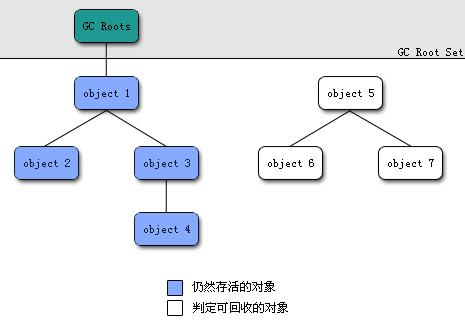

ref：

* [聊聊JVM（八）说说GC标记阶段的一些事](http://blog.csdn.net/iter_zc/article/details/41868999)
* [找出栈上的指针/引用 - R大](http://rednaxelafx.iteye.com/blog/1044951)


# root tracing


* Hotspot（等其他）JVM GC实现里使用的tracing方式。

* 根据从`GC roots`的可达性（reachability）来判断对象是否应该被GC

  所以获得GC roots是第一步





## GC roots


GC roots是下面这些数据的集合：

- JVM栈的栈帧中的局部变量表里的有效的局部变量（局部变量有作用域）所引用的对象
- 方法区里面的类元素对象的static引用所引用的对象
- 方法区里面的类元素对象的常量引用所引用的对象
- 本地方法栈里的引用所引用的对象


**GC roots必须可以方便获取**，**最主要的部分在解决如何快速找到JVM栈的栈帧的局部变量表中的局部变量所引用的对象**


### 栈上GC roots获取（枚举根节点）

大致的思路：

* 采用了OopMap这个数据结构记录了GC roots
* OopMap记录了特定时刻栈上(内存)和寄存器(CPU)的哪些位置是引用。而不需要一个一个的去判断某个内存位置的值是不是引用
* GC的标记开始的时候，直接从OopMap就可以获得GC roots


from [内存篇：JVM内存回收理论与实现](http://icyfenix.iteye.com/blog/1166660)

```
如果要使用可达性分析来判断内存是否可回收的，那分析工作必须在一个能保障一致性的快照中进行——这里“一致性”的意思是整个分析期间整个执行系统看起来就像被冻结在某个时间点上，不可以出现分析过程中，对象引用关系还在不断变化的情况，这点不满足的话分析结果准确性就无法保证。这点也是导致GC进行时必须“Stop The World”的其中一个重要原因，即使是号称（几乎）不会发生停顿的CMS收集器中，枚举根节点时也是必须要停顿的。 
```

```
由于目前的主流JVM使用的都是准确式GC（这个概念在第一篇中介绍过），所以当执行系统停顿下来之后，并不需要一个不漏地检查完所有执行上下文和全局的引用位置，虚拟机应当是有办法直接得到哪些地方存放着对象引用。在HotSpot的实现中，是使用一组称为OopMap的数据结构来达到这个目的，在类加载完成的时候，HotSpot就把对象内什么偏移量上是什么类型的数据计算出来，在JIT编译过程中，也会在特定的位置记录下栈里和寄存器里哪些位置是引用。这样GC在扫描时就就可以直接得知这些信息了。
```


### OopMap


**OopMap **- An OOP map is a list of machine registers 
holding OOPs at a particular point in the code.  If a GC cycle needs to 
happen while the program is stopped at a Safepoint, GC will consult the 
OopMap to find all the pointers needing updating.


#### OopMap数据收集


##### when

在**safepoint**处，因为safepoint是协作式的，所以OopMap数据也是协作式（由各线程自发…）。

插入safepoint/检查或进入safepoint的时机见safepoint文档。

> 如果对每条指令（的位置）都记录OopMap的话，这些记录就会比较大，那么空间开销会显得不值得。选用一些比较关键的点来记录就能有效的缩小需要记录的数据量，但仍然能达到区分引用的目的


##### where

存储在哪里呢？

至于前面定义里说的`a list of machine registers`，JVM基于栈的，难道在操作数栈里？


##### how


```assembly
 [Verified Entry Point]    
    0x026eb730: mov    %eax,-0x8000(%esp)    
    …………    
    ;; ImplicitNullCheckStub slow case    
    0x026eb7a9: call   0x026e83e0         ; OopMap{ebx=Oop [16]=Oop off=142}    
                                            ;*caload    
                                            ; - java.lang.String::hashCode@48 (line 1489)    
                                            ;   {runtime_call}    
      0x026eb7ae: push   $0x83c5c18         ;   {external_word}    
      0x026eb7b3: call   0x026eb7b8    
      0x026eb7b8: pusha      
      0x026eb7b9: call   0x0822bec0         ;   {runtime_call}    
      0x026eb7be: hlt      
```

From [聊聊JVM（八）说说GC标记阶段的一些事](http://blog.csdn.net/iter_zc/article/details/41868999)                     

```
可以看到在0x026eb7a9处的call指令有OopMap记录，它指明了EBX寄存器和栈中偏移量为16的内存区域中各有一个oop的引用，这个OopMap和offset  142处的指令关联，从call指令开始直到0x026eb730（指令流的起始位置）+142（OopMap记录的偏移量）=0x026eb7be，即hlt指令。换句话说执行到hlt指令时的OopMap状态是ebx和[rsp+16]的内存位置上有oop。

call 0x026e83e0这个指令就是调用一个方法，OopMap出现在这个位置，也就是call之后，我们说了方法的call之后是一个safepoint，用OopMap记录一下寄存器和JVM栈内存的哪些位置是引用。
```

${yonka} 没看明白，理解如下：

1. call一个记录OopMap的函数
2. 传入参数用于记录
3. 然后不懂了，到底记录了什么？ 在哪里？ 如果有很多对象引用怎么办？ 操作数栈和局部变量表里都有怎么办？


from [[讨论\]](http://hllvm.group.iteye.com/group/forum?tag_id=690) [请教一下一个关于OopMap的问题](http://hllvm.group.iteye.com/group/topic/39132) R大的回复

```
off=88 里88是十进制的没错，所以就是就是0x58。
这个foo方法的起始位置从

[Entry Point]
0x01b4b710: nop


开始

OopMap是跟它所在的注释之后的那条指令关联的，这里是跟call后的

0x01b4b768: mov 0x10(%esp), %edx


这跟起始位置就差了0x58了，对吧？

为啥会跟call之后的指令关联，而不是跟call指令关联呢？
这是因为如果需要用到这个OopMap，必然不是这个方法自身在栈顶，而是它还调用了别的函数的情况。此时那条call指令已经执行过了，控制流回来的时候是回到call之后的那条指令。所以只要记录后面的指令所需的状态是正确的就好了。 
```

```assembly
# [sp+0x30] (sp of caller)
;; block B4 [0, 0]

0x01b4b710: nop 
...
0x01b4b71a: jne 0x01b0ad90 ; {runtime_call}
[Verified Entry Point]
0x01b4b720: mov %eax,-0x8000(%esp)
...
0x01b4b75d: mov %eax,0x14(%esp)
0x01b4b761: nop
0x01b4b762: nop
0x01b4b763: call 0x01b0afd0 ; OopMap{[20]=Oop off=88}
;*invokespecial <init>
; - Test::foo@4 (line 7)
; {optimized virtual_call}
0x01b4b768: mov 0x10(%esp),%edx
;; 24 branch [AL] [B1]
0x01b4b76c: jmp 0x01b4b77b ;*iload_1
; - Test::foo@8 (line 8)
...
0x01b4b774: dec %edx ; OopMap{off=101}
;*goto
; - Test::foo@15 (line 9)
0x01b4b775: test %eax,0x180100 ;*goto
; - Test::foo@15 (line 9)
; {poll}
;; block B1 [8, 9]
```

对应java代码：

```java
    class Test {  
        public int foo(int a) {  
            Object obj = new Object();  
            while(a > 0){  
                a --;  
            }  
            return a;  
        }  
      
        public static void main(String[] args) {  
            new Test().foo(10);  
        }  
    }  
```


从R大的回复，理解出：

> call oop方法会传入call指令后面这条指令的地址
>
> 但是： **怎么标识哪里有对象引用？** 难道是这个 `[20]=Oop` 吗


