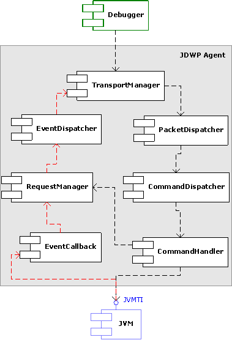
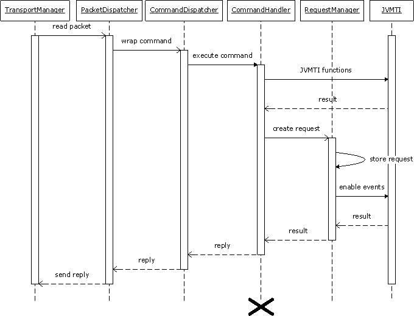
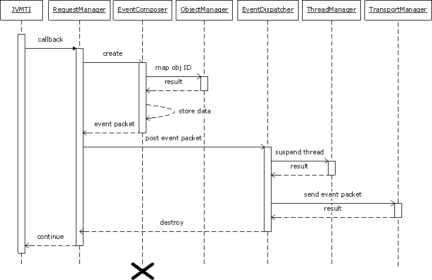

# 概念

如 JDPA文档中提到的JDWP本身指协议，但JDPA中debugee角色实现是 jdwp agent，所以也包含在本文中。


# JDWP 协议

Ref: 

* [深入 Java 调试体系，第 3 部分 JDWP 协议及实现](https://www.ibm.com/developerworks/cn/java/j-lo-jpda3/index.html) or [local](../../resource/深入 Java 调试体系_dw/深入 Java 调试体系，第 3 部分_ JDWP 协议及实现.html)


# JDWP agent

Ref:

* [深入 Java 调试体系，第 2 部分 JVMTI 和 Agent 实现](https://www.ibm.com/developerworks/cn/java/j-lo-jpda2/index.html?ca=drs-) or [local](../..//resource/深入 Java 调试体系_dw/深入 Java 调试体系，第 2 部分_ JVMTI 和 Agent 实现.html)


## 使用

Ref:

* [深入 Java 调试体系，第 4 部分 Java 调试接口（JDI）](https://www.ibm.com/developerworks/cn/java/j-lo-jpda4/index.html) or [local](../../resource/深入 Java 调试体系_dw/深入 Java 调试体系，第 4 部分_ Java 调试接口（JDI）.html)
* [oracle - JPDA - Connection and Invocation Details](https://docs.oracle.com/javase/8/docs/technotes/guides/jpda/conninv.html)


```shell
-agentlib:jdwp=transport=dt_socket,address=127.0.0.1:50831,suspend=y,server=n
```


| **name**     | **required?**                   | **default value** | **description**                          |
| ------------ | ------------------------------- | ----------------- | ---------------------------------------- |
| `help`       | no                              | N/A               | Prints a brief help message and exits the VM. |
| `transport`  | yes                             | none              | Name of the transport to use in connecting to debugger application. |
| `server`     | no                              | "n"               | If "y", listen for a debugger application to attach; otherwise, attach to the debugger application at the specified `address. `If "y" and no address is specified, choose a [transport address](https://docs.oracle.com/javase/8/docs/technotes/guides/jpda/conninv.html#Transports) at which to listen for a debugger application, and print the address to the standard output stream. |
| `address`    | yes, if `server=n`no, otherwise | ""                | [Transport address](https://docs.oracle.com/javase/8/docs/technotes/guides/jpda/conninv.html#Transports) for the connection. If server=n, attempt to attach to debugger application at this address. If server=y, listen for a connection at this address. |
| `timeout`    | no                              | ""                | If server=y specifies the timeout, in milliseconds, to wait for the debugger to attach. If server=n specifies the timeout, in milliseconds, to use when attaching to the debugger. Note that the timeout option may be ignored by some transport implementations. |
| `launch`     | no                              | none              | At completion of JDWP initialization, launch the process given in this string. This option is used in combination with `onthrow` and/or `onuncaught` to provide "Just-In-Time debugging" in which a debugger process is launched when a particular event occurs in this VM.Note that the launched process is not started in its own window. In most cases the launched process should be a small application which in turns launches the debugger application in its own window.The following strings are appended to the string given in this argument (space-delimited). They can aid the launched debugger in establishing a connection with this VM. The resulting string is executed.The value of the `transport` sub-option.The value of the `address` sub-option (or the generated address if one is not given) |
| `onthrow`    | no                              | none              | Delay initialization of the JDWP library until an exception of the given class is thrown in this VM. The exception class name must be package-qualified.Connection establishment is included in JDWP initialization, so it will not begin until the exception is thrown. |
| `onuncaught` | no                              | "n"               | If "y", delay initialization of the JDWP library until an uncaught exception is thrown in this VM. Connection establishment is included in JDWP initialization, so it will not begin until the exception is thrown. See the JDI specification for com.sun.jdi.ExceptionEvent for a definition of uncaught exceptions. |
| `suspend`    | no                              | "y"               | If "y", VMStartEvent has a suspendPolicy of SUSPEND_ALL. If "n", VMStartEvent has a suspendPolicy of SUSPEND_NONE. |


Examples

- `-agentlib:jdwp=transport=dt_socket,server=y,address=8000`

  Listen for a socket connection on port 8000. Suspend this VM before main class loads (suspend=y by default). Once the debugger application connects, it can send a JDWP command to resume the VM.

- `-agentlib:jdwp=transport=dt_socket,server=y,address=localhost:8000,timeout=5000`

  Listen for a socket connection on port 8000 on the loopback address only. Terminate if the debugger does not attach within 5 seconds. Suspend this VM before main class loads (suspend=y by default). Once the debugger application connects, it can send a JDWP command to resume the VM.

- `-agentlib:jdwp=transport=dt_shmem,server=y,suspend=n`

  Choose an available shared memory transport address and print it to stdout. Listen for a shared memory connection at that address. Allow the VM to begin executing before the debugger application attaches.

- `-agentlib:jdwp=transport=dt_socket,address=myhost:8000`

  Attach to a running debugger application via socket on host myhost at port 8000. Suspend this VM before the main class loads.

- `-agentlib:jdwp=transport=dt_shmem,address=mysharedmemory`

  Attach to a running debugger application via shared memory at transport address "`mysharedmemory`". Suspend this VM before the main class loads.

- `-agentlib:jdwp=transport=dt_socket,server=y,address=8000,onthrow=java.io.IOException,launch=/usr/local/bin/debugstub`

  Wait for an instance of java.io.IOException to be thrown in this VM. Suspend the VM (suspend=y by default). Listen for a socket connection on port 8000. Execute the following: "`/usr/local/bin/debugstub dt_socket myhost:8000".`This program can launch a debugger process in a separate window which will attach to this VM and begin debugging it.

- `-agentlib:jdwp=transport=dt_shmem,server=y,onuncaught=y,launch=d:\bin\debugstub.exe`

  Wait for an uncaught exception to be thrown in this VM. Suspend the VM. Select a shared memory transport address and listen for a connection at that address. Execute the following: "`d:\bin\debugstub.exe dt_shmem <address>"`, where `<address>` is the selected shared memory address. This program can launch a debugger process in a separate window which will attach to this VM and begin debugging it.


```
java -agentlib:jdwp=help
               Java Debugger JDWP Agent Library
               --------------------------------

  (see http://java.sun.com/products/jpda for more information)

jdwp usage: java -agentlib:jdwp=[help]|[<option>=<value>, ...]

Option Name and Value            Description                       Default
---------------------            -----------                       -------
suspend=y|n                      wait on startup?                  y
transport=<name>                 transport spec                    none
address=<listen/attach address>  transport spec                    ""
server=y|n                       listen for debugger?              n
launch=<command line>            run debugger on event             none
onthrow=<exception name>         debug on throw                    none
onuncaught=y|n                   debug on any uncaught?            n
timeout=<timeout value>          for listen/attach in milliseconds n
mutf8=y|n                        output modified utf-8             n
quiet=y|n                        control over terminal messages    n

Obsolete Options
----------------
strict=y|n
stdalloc=y|n

Examples
--------
  - Using sockets connect to a debugger at a specific address:
    java -agentlib:jdwp=transport=dt_socket,address=localhost:8000 ...
  - Using sockets listen for a debugger to attach:
    java -agentlib:jdwp=transport=dt_socket,server=y,suspend=y ...

Notes
-----
  - A timeout value of 0 (the default) is no timeout.

Warnings
--------
  - The older -Xrunjdwp interface can still be used, but will be removed in
    a future release, for example:
        java -Xdebug -Xrunjdwp:[help]|[<option>=<value>, ...]
```


## 实现

Ref:

* [JDWP_agent](https://svn.apache.org/repos/asf/harmony/enhanced/java/trunk/jdktools/modules/jpda/doc/JDWP_agent.htm#US_EVT)





命令执行的流程




事件流程（从JVMTI -> JDWP agent）




