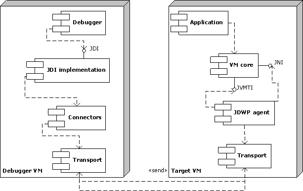
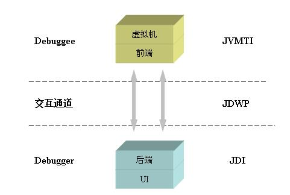
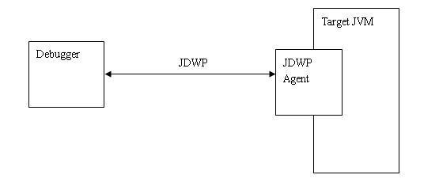
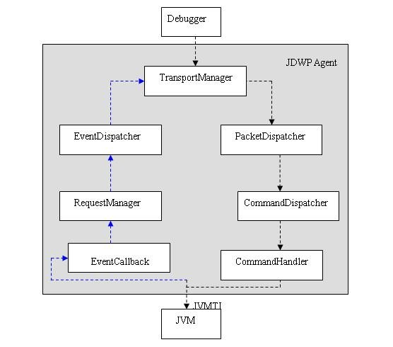

ref：

* [深入 Java 调试体系 第 1 部分，JPDA 体系概览](https://www.ibm.com/developerworks/cn/java/j-lo-jpda1/index.html)


# 概念

JPDA 定义了一个完整独立的体系，它由三个相对独立的层次共同组成，而且规定了它们三者之间的交互方式，或者说定义了它们通信的接口。


## 架构


```
           Components                          Debugger Interfaces

                /    |--------------|
               /     |     VM       |
 debuggee ----(      |--------------|  <------- JVM TI - Java VM Tool Interface
               \     |   back-end   |
                \    |--------------|
                /           |
 comm channel -(            |  <--------------- JDWP - Java Debug Wire Protocol
                \           |
                     |--------------|
                     | front-end    |
                     |--------------|  <------- JDI - Java Debug Interface
                     |      UI      |
                     |--------------|
```





## 三层次

这三个层次由低到高分别是:

* Java 虚拟机工具接口（JVMTI）

  debugee通过JVMTI实现具体功能

* Java 调试线协议（JDWP）

  debugger和debugee交互的协议

* Java 调试接口（JDI）

  debuger通过JDI来交互debug

  JDI应该wrap了JDWP client实现


## debugger and debugee

这三个模块把调试过程分解成几个很自然的概念：调试者（debugger）和被调试者（debuggee），以及他们中间的通信器。

* debuger
  * 通过JDI wrap的JDWP client来与debugee通信
  * 使用JDI接口来调用常见debug功能
  * 自行实现debug交互UI部分
  * 对应的实体是： IDE debug实现
* debugee
  * 通过JDWP agent来反馈/通知给debuger
  * 通过JVMTI来实际执行各种debug操作、获取结果
  * 对应的实体是： JDWP agent（agentlib、JVMTI agent）











## front end and back end


- A [back-end](https://docs.oracle.com/javase/8/docs/technotes/guides/jpda/architecture.html#back-end) which uses JVM TI to implement the debuggee side of JDWP.
- A [front-end](https://docs.oracle.com/javase/8/docs/technotes/guides/jpda/architecture.html#front-end) which uses the debugger side of JDWP to implement JDI.


> yonka
>
> 应该是把agent认为是debugger的一部分。
>
> debugger front-end实现对用户的接口（JDI）然后将接口提供的debug操作翻译为JDWP指令发送给debuger back-end；
>
> debuger back-end则负责收JDWP指令然后将其实现： 通过调用JVMTI接口来访问target VM来实现...


### front-end

The debugger front-end implements the high-level Java Debug Interface ([JDI](https://docs.oracle.com/javase/8/docs/technotes/guides/jpda/architecture.html#jdi)).  The front-end uses the information from the low-level Java Debug Wire Protocol ([JDWP](https://docs.oracle.com/javase/8/docs/technotes/guides/jpda/architecture.html#jdwp)).


### back-end

The back-end of the debugger is responsible for communicating requests from the debugger [front-end](https://docs.oracle.com/javase/8/docs/technotes/guides/jpda/architecture.html#front-end) to the debuggee [VM](https://docs.oracle.com/javase/8/docs/technotes/guides/jpda/architecture.html#vm) and for communicating the response to these requests (including desired events) to the front-end.  The back-end communicates with the front-end over a [communications channel](https://docs.oracle.com/javase/8/docs/technotes/guides/jpda/architecture.html#channel) using the Java Debug Wire Protocol ([JDWP](https://docs.oracle.com/javase/8/docs/technotes/guides/jpda/architecture.html#jdwp)).  The back-end communicates with the debuggee VM using the Java Virtual Machine Debug Interface ([JVM TI](https://docs.oracle.com/javase/8/docs/technotes/guides/jpda/architecture.html#jvmti)).It is clear from experience that debugger support code, running on the debuggee and written in Java, contends with the debuggee in ways that cause hangs and other undesired behavior. Thus, the back-end is native code. This, in turn, implies that the [JVM TI](https://docs.oracle.com/javase/8/docs/technotes/guides/jpda/architecture.html#jvmti) be a pure native interface.


## 通信

从上面可见，通信是在debugger的front-end和back-end之间。


### connector

主要是通讯模式，有三种：

1. listening connector

   FE listen，而BE（和target VM一起）启动后连向FE

   需要给BE指定FE的监听地址信息

2. attaching connector

   BE（和target VM一起）启动后listen，FE启动debug时连向BE（主流方式）

   需要给FE指定BE的监听地址信息

3. launching connector

   由FE负责启动targetVM（和BE）


### transport

实际的通讯方式的实现。

* sockets - linux、win
* serial line - ？
* share mem - win


JDWP协议实现也在这一层面。


# FAQ

* 平台支持
* ​


