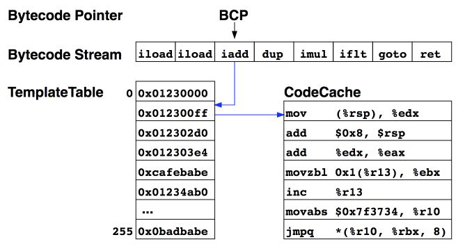
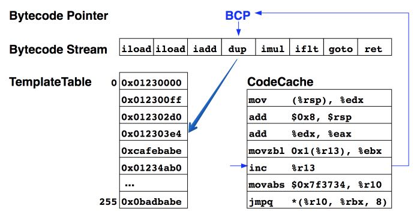

* CPP interpreter

* Template interpreter

  > The VM creates an assembler "template" for each bytecode

  * the default and the only officially supported interpreter
  * much faster than the CPP interpreter
  * generated at VM startup

Template interpreter

0. BCP -> iadd -> 0x0123000

1. `iadd`
   1. 0x0123000 -> `mov ...`
   2. ...
2. `inc %r13` : BCP -> dup -> `0x012303e4`
3. `dup`
   1. `movabs …`
   2. ...

