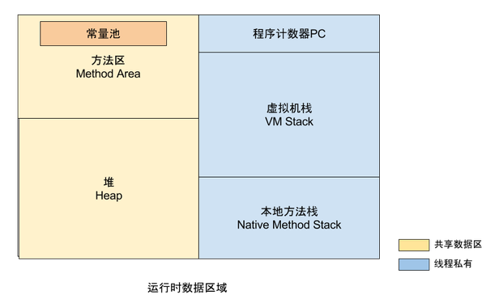
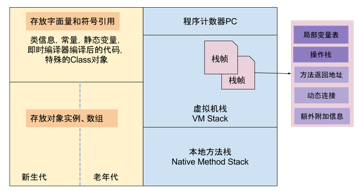
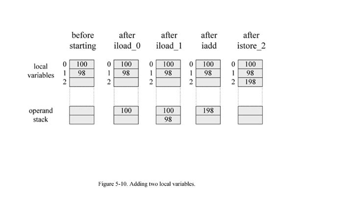

# 背景


## 可见性 & 原子性 & 重排序


这三个都是比较常见的概念，也容易弄混。


* 可见性

  * 重点在： **共享资源**

  * 为什么不可见？

    * CPU cache 和 内存（地址）的一致性 - common case

      > 如：
      >
      > ```c
      > a += 1
      > ```
      >
      > 类似：
      >
      > ```assembly
      > add xx 1
      > ```
      >
      > 这里看似是“可见”的，但由于CPU cacheline的存在，在 cache invalidate 之前可能是没实际写入内存（xx地址）的（参见 [cs_system_cpu_digest](../../../../system/cpu/cs_system_cpu_digest.md)）。

    * 线程工作内存-堆内存一致性 - JMM

      > C（等）之所以没这个问题是因为C里写栈和写堆是明确的，编译器（一般）不会在这方面做优化（trick）
      >

      ​

      > 而java：
      >
      > 1. java栈
      >
      >    - 1 - 2
      >    - 1 - 3
      >
      > 2. 局部变量表
      >
      >    thread local，没有可见性和原子性等问题
      >
      > 3. 堆
      >
      >    non thread local，有可见性和原子性等问题
      >
      > 对堆内存数据（要么是全局如 Integer.class 要是 类属性如 ClassA.sf1 要么是 实例属性 objOfClassA.a），类似： 
      >
      > ```java
      > instance.a++;
      > ```
      >
      > ​
      >
      > 这样的操作，实际上类似：
      >
      > ```assembly
      > 1
      > ```
      >
      > ​
      >
      > 如：
      >
      > ```java
      > int b = a;
      > T1 t = new T1();
      > t.a++;
      > b++;
      > a = b;
      > a++;
      > sa = b;
      > sa = a;
      > ```
      >
      > ```assembly
      >   L0
      >     LINENUMBER 15 L0
      >     ALOAD 0
      >     GETFIELD T.a : I
      >     ISTORE 1
      >    L1
      >     LINENUMBER 16 L1
      >     NEW T$T1
      >     DUP
      >     INVOKESPECIAL T$T1.<init> ()V
      >     ASTORE 2
      >    L2
      >     LINENUMBER 17 L2
      >     ALOAD 2
      >     DUP
      >     GETFIELD T$T1.a : I
      >     ICONST_1
      >     IADD
      >     PUTFIELD T$T1.a : I
      >    L3
      >     LINENUMBER 18 L3
      >     IINC 1 1
      >    L4
      >     LINENUMBER 19 L4
      >     ALOAD 0
      >     ILOAD 1
      >     PUTFIELD T.a : I
      >    L5
      >     LINENUMBER 20 L5
      >     ALOAD 0
      >     DUP
      >     GETFIELD T.a : I
      >     ICONST_1
      >     IADD
      >     PUTFIELD T.a : I
      >    L6
      >     LINENUMBER 21 L6
      >     ILOAD 1
      >     PUTSTATIC T.sa : I
      >    L7
      >     LINENUMBER 22 L7
      >     ALOAD 0
      >     GETFIELD T.a : I
      >     PUTSTATIC T.sa : I
      >    L8
      >     LINENUMBER 23 L8
      >     RETURN
      >    L9
      >     LOCALVARIABLE this LT; L0 L9 0
      >     LOCALVARIABLE b I L1 L9 1
      >     LOCALVARIABLE t LT$T1; L2 L9 2
      >     MAXSTACK = 3
      >     MAXLOCALS = 3
      > ```
      >
      > <del>所以影响到可见性</del>
      >
      > 这里影响到可见性的实际是读操作，如：
      >
      > ```assembly
      > // 伪码
      > load xx
      > ```
      >
      > ​

* 原子性

  * 重点在： **操作**

    > 还是以上面的add操作为例。
    >
    > CPU无法直接对内存地址做add操作，实际上类似：
    >
    > ```assembly
    > # 伪码
    > mov xx,eax
    > add 1,eax
    > mov eax,xx
    > ```
    >
    > 非单步操作，(在没有其他措施的情况下)原子性肯定无法保证

* 重排序

  * 重点在： **原理** 和 **影响**


已有特性和这几点的关系：

* volatile
* synchronize
* lock


# volatile

[What does volatile do?]()

Volatile fields are special fields which are **used for communicating state between threads**. **Each read of a volatile will see the last write to that volatile by any thread; in effect**, they are designated by the programmer **as fields for which it is never acceptable to see a "stale" value as a result of caching or reordering**. The **compiler and runtime are prohibited from allocating them in registers**. They must also **ensure that after they are written, they are flushed out of the cache to main memory**, so they can immediately become visible to other threads. Similarly, **before a volatile field is read, the cache must be invalidated so that the value in main memory**, not the local processor cache, is the one seen. There are also **additional restrictions on reordering accesses to volatile variables**.

Under the old memory model, accesses to volatile variables could not be reordered with each other, but they could be reordered with nonvolatile variable accesses. This undermined the usefulness of volatile fields as a means of signaling conditions from one thread to another.

Under the new memory model, it is still true that volatile variables cannot be reordered with each other. The difference is that it is now no longer so easy to reorder normal field accesses around them. **Writing to a volatile field has the same memory effect as a monitor release, and reading from a volatile field has the same memory effect as a monitor acquire**. In effect, because the new memory model places stricter constraints on reordering of volatile field accesses with other field accesses, volatile or not, anything that was visible to thread A when it writes to volatile field `f` becomes visible to thread B when it reads `f`.

Here is a simple example of how volatile fields can be used:

```java
class VolatileExample {
  int x = 0;
  volatile boolean v = false;
  
  public void writer() {
    x = 42;
    v = true;
  }
  
  public void reader() {
    if (v == true) {
      //uses x - guaranteed to see 42.
    }
  }
}
```


Assume that one thread is calling `writer`, and another is calling `reader`. The write to `v` in `writer` releases the write to `x` to memory, and the read of `v` acquires that value from memory. Thus, if the reader sees the value `true` for v, it is also guaranteed to see the write to 42 that happened before it. This would not have been true under the old memory model.  If `v` were not volatile, then the compiler could reorder the writes in `writer`, and `reader`'s read of `x` might see 0.

**Effectively, the semantics of volatile have been strengthened substantially, almost to the level of synchronization. Each read or write of a volatile field acts like "half" a synchronization, for purposes of visibility**.

**Important Note:** Note that it is important for both threads to access the same volatile variable in order to properly set up the happens-before relationship. It is not the case that everything visible to thread A when it writes volatile field `f` becomes visible to thread B after it reads volatile field `g`. The release and acquire have to "match" (i.e., be performed on the same volatile field) to have the right semantics.


## 定位/目的

> 在线程间通信/传递状态


## 效果

线程需要“立即看见”其他线程对volatile field的写操作。

这里的**立即看见**有**可见性**和**禁止重排**的双重效果。

语义很强，几乎是**half-synchronize**


## 细节

可见性

* 写后： flush
* 读前： invalidate


禁止重排

* 老MM： volatile fields之间禁止重排

  示例：

  ```java
  class Test {
    volatile int a;
    volatile int b;
    int c;
    
    public void test() {
      c = 1;  // 1
      a = 2;  // 2
      b = 3;  // 3

      // old MM下只保证 2和3的相对顺序，也即最后可能是： 1,2,3; 2,1,3; 2,3,1
    }
    
    public void test1() {
      if(b > 0) {
        assert(a > 0);  // ok
        assert(c > 0);  // nok
      }
    }
  }
  ```

  ​

* 新MM： volatile field和其他field之间都禁止重排

  示例：

  ```java
  class Test {
    volatile int a;
    volatile int b;
    int c;
    int d;
    
    public void test() {
      c = 1;  // 1
      d = 2;  // 2    
      a = 3;  // 3
      b = 4;  // 4

      // new MM下保证a,b 与其他field(c)的顺序，所以不考虑d时只能是 2,3,4 ； 考虑d时只能是 1,2,3,4 或 2,1,3,4
    }
    
    public void test1() {
      if(b > 0) {
        assert(a > 0);  // ok
        assert(c > 0);  // ok
      }
    }
  }

  ```

  ​


# memory barrier


Java中的内存中的内存屏障:

|            | LoadLoad 屏障                              | StoreStore屏障                             | LoadStore 屏障                             | StoreLoad屏障                              |
| ---------- | ---------------------------------------- | ---------------------------------------- | ---------------------------------------- | ---------------------------------------- |
| 序列         | Load1,Loadload,Load2                     | Store1，StoreStore，Store2                 | Load1,LoadStore,Store                    | Store1,StoreLoad,Load                    |
| 作用         | 保证Load1所要读入的数据能够在被Load2和后续的load指令访问前读入。  | 保证Store1的数据在Store2以及后续Store指令操作相关数据之前对其它处理器可见 | 确保Load1的数据在Store2和后续Store指令被刷新之前读取。      | 确保Store1的数据在被Load2和后续的Load指令读取之前对其他处理器可见。 |
| 对buffer的影响 | 在Load buffer插入屏障,清空屏障之前的Load操作,然后才能执行屏障之后的Load操作. | 在Store buffer插入屏障,清空屏障之前的Store操作,然后才能执行屏障之后的store操作. | 在Load buffer插入屏障,清空屏障之前的Load操作,然后才能执行屏障之后的Store操作. | 在Load buffer, Store buffer中都插入屏障,必须清空屏障之前的Load操作并且清空屏障之前的store操作,然后才能执行屏障之后的Load操作,或store操作. |


> StoreLoad屏障有可以同时获得其它三种屏障(loadload,loadstore,storestore)的的效果,但是StoreLoad是一个比较耗性能的屏障.因为StoreLoad屏障在Loadbuffer, Store buffer中都插入屏障,必须清空屏障之前的Load操作并且清空屏障之前的store操作,然后才能执行屏障之后的Load操作,或store操作.这使得之后的读指令不能从store buffer中直接获取,只能从缓存中获取,综合起来说，storeload屏障最耗性能。


# memory model








```
-- Program Counter

-- JVM栈

   -- Frame

       -- Local Variables table

       -- Operation Stack

       -- Return value

       -- Current Class Constant Pool Reference

-- Heap

   -- Young Generation

       -- Eden

       -- S0

       -- S1

   -- Old Generation

-- Non Heap

   -- 永久代

        -- 方法区

            -- Class元数据

                -- 运行时常量池

        -- String Table

   -- Code Cache
```


## heap


### java heap

From [JVM内存管理：深入Java内存区域与OOM](http://icyfenix.iteye.com/blog/802573)

```
对于绝大多数应用来说，Java堆是虚拟机管理最大的一块内存。Java堆是被所有线程共享的，在虚拟机启动时创建。Java堆的唯一目的就是存放对象实例，绝大部分的对象实例都在这里分配。这一点在VM Spec中的描述是：所有的实例以及数组都在堆上分配（原文：The heap is the runtime data area from which memory for all class instances and arrays is allocated），但是在逃逸分析和标量替换优化技术出现后，VM Spec的描述就显得并不那么准确了。

Java堆内还有更细致的划分：新生代、老年代，再细致一点的：eden、from survivor、to survivor，甚至更细粒度的本地线程分配缓冲（TLAB）等，无论对Java堆如何划分，目的都是为了更好的回收内存，或者更快的分配内存，在本章中我们仅仅针对内存区域的作用进行讨论，Java堆中的上述各个区域的细节，可参见本文第二章《JVM内存管理：深入垃圾收集器与内存分配策略》。

根据VM Spec的要求，Java堆可以处于物理上不连续的内存空间，它逻辑上是连续的即可，就像我们的磁盘空间一样。实现时可以选择实现成固定大小的，也可以是可扩展的，不过当前所有商业的虚拟机都是按照可扩展来实现的（通过-Xmx和-Xms控制）。如果在堆中无法分配内存，并且堆也无法再扩展时，将会抛出OutOfMemoryError异常。
```


### method area

From [JVM内存管理：深入Java内存区域与OOM](http://icyfenix.iteye.com/blog/802573)

```
叫“方法区”可能认识它的人还不太多，如果叫永久代（Permanent Generation）它的粉丝也许就多了。它还有个别名叫做Non-Heap（非堆），但是VM Spec上则描述方法区为堆的一个逻辑部分（原文：the method area is logically part of the heap），这个名字的问题还真容易令人产生误解，我们在这里就不纠结了。

方法区中存放了每个Class的结构信息，包括常量池、字段描述、方法描述等等。VM Space描述中对这个区域的限制非常宽松，除了和Java堆一样不需要连续的内存，也可以选择固定大小或者可扩展外，甚至可以选择不实现垃圾收集。相对来说，垃圾收集行为在这个区域是相对比较少发生的，但并不是某些描述那样永久代不会发生GC（至少对当前主流的商业JVM实现来说是如此），这里的GC主要是对常量池的回收和对类的卸载，虽然回收的“成绩”一般也比较差强人意，尤其是类卸载，条件相当苛刻。
```

命名有点问题，其实java8里的实现**metaspace**倒是挺符合逻辑功能名的。


### runtime constant pool

From [JVM内存管理：深入Java内存区域与OOM](http://icyfenix.iteye.com/blog/802573)

```
Class文件中除了有类的版本、字段、方法、接口等描述等信息外，还有一项信息是常量表(constant_pool table)，用于存放编译期已可知的常量，这部分内容将在类加载后进入方法区（永久代）存放。但是Java语言并不要求常量一定只有编译期预置入Class的常量表的内容才能进入方法区常量池，运行期间也可将新内容放入常量池（最典型的String.intern()方法）。

运行时常量池是方法区的一部分，自然受到方法区内存的限制，当常量池无法在申请到内存时会抛出OutOfMemoryError异常。
```


### direct memory

From [JVM内存管理：深入Java内存区域与OOM](http://icyfenix.iteye.com/blog/802573)

```
直接内存并不是虚拟机运行时数据区的一部分，它根本就是本机内存而不是VM直接管理的区域。但是这部分内存也会导致OutOfMemoryError异常出现，因此我们放到这里一起描述。

在JDK1.4中新加入了NIO类，引入一种基于渠道与缓冲区的I/O方式，它可以通过本机Native函数库直接分配本机内存，然后通过一个存储在Java堆里面的DirectByteBuffer对象作为这块内存的引用进行操作。这样能在一些场景中显著提高性能，因为避免了在Java对和本机堆中来回复制数据。

显然本机直接内存的分配不会受到Java堆大小的限制，但是即然是内存那肯定还是要受到本机物理内存（包括SWAP区或者Windows虚拟内存）的限制的，一般服务器管理员配置JVM参数时，会根据实际内存设置-Xmx等参数信息，但经常忽略掉直接内存，使得各个内存区域总和大于物理内存限制（包括物理的和操作系统级的限制），而导致动态扩展时出现OutOfMemoryError异常。
```


## stack


### native stack


From [JVM内存管理：深入Java内存区域与OOM](http://icyfenix.iteye.com/blog/802573)

```
本地方法栈与VM栈所发挥作用是类似的，只不过VM栈为虚拟机运行VM原语服务，而本地方法栈是为虚拟机使用到的Native方法服务。它的实现的语言、方式与结构并没有强制规定，甚至有的虚拟机（譬如Sun Hotspot虚拟机）直接就把本地方法栈和VM栈合二为一。和VM栈一样，这个区域也会抛出StackOverflowError和OutOfMemoryError异常。
```


#### native栈和java栈的关系


from [RE：关于JMM模型中工作内存、主内存和几个操作的理解](http://icyfenix.iteye.com/blog/1070804)

```
HotSpot里面的“本地方法栈”（Native Method Stacks）和“Java虚拟机栈”（Java Virtual Machine Stacks）合二为一了。这意味着Java方法调用和本地方法（譬如JNI方法调用）使用的是同一个栈，从使用上理解，就是-Xoss参数和-Xss参数变成了同一个，因此在HotSpot里面-Xoss无效。而“操作数栈”（Operand Stack）是栈帧（Stack Frame）的一部分，栈帧说白了就是Java虚拟机栈的栈元素。它是客观存在的，不会消失。由于JVM规范的指引或者说是限制，各种Java虚拟机都是基于栈结构的，这里的栈就是操作数栈，它是指令执行的基本前提。所以在各种虚拟机中，甚至在一个虚拟机的解析和编译执行引擎中它可以有不同的存在形式，但是总谈不上“消失”的（这里有陷阱，请看撒迦的回帖）。当然，不基于栈的虚拟机，譬如Google Android的Dalvik虚拟机（基于寄存器架构）就可以没有操作数栈，当然，那也已经不是严格意义上的“JVM”了。 
```

```

7 楼 RednaxelaFX 2011-06-06  
IcyFenix 写道
好的，你的回复我在正文中用红色字体标识出来了。

anyway，我还是认为，如果我们的计算机本身就是栈架构的，那就没有哪款编译器会做削除操作栈这种事情。当然，这个“如果”是个海市蜃楼、空中楼阁。

呵呵，“如果”。

这事情很简单。一个基于寄存器的虚拟架构在一个基于寄存器的实际硬件上仍然很可能会把那些虚拟寄存器分配到硬件的内存里而不是硬件的寄存器里。例子多的是。

如果有人非要在基于栈的硬件上把削除了操作数栈的方式实现出来（把原本的操作数栈转换为虚拟寄存器然后分配到内存里），那完全可行。虽然很难想像为什么要这样做。
但在基于寄存器的机器上，这操作数栈的语义想怎么实现就有许多很现实的可能性。完全按照原样实现也行，部分削除也行，完全削除也行。

其实很多东西只要自己写过就很容易理解…
6 楼 IcyFenix 2011-06-06  
好的，你的回复我在正文中用红色字体标识出来了。

anyway，我还是认为，如果我们的计算机本身就是栈架构的，那就没有哪款编译器会做削除操作栈这种事情。当然，这个“如果”是个海市蜃楼、空中楼阁。
5 楼 RednaxelaFX 2011-06-06  
IcyFenix 写道
RednaxelaFX 写道
IcyFenix 写道
所以在各种虚拟机中，甚至在一个虚拟机的解析和编译执行引擎中它可以有不同的存在形式，但是总谈不上“消失”的。

就是消失了。需要解释不？


，字节码JIT后就是机器码了，而现在物理机的指令集基本上都是寄存器架构，所以JIT编译过程中总要进行转换：把抽象模型中通过Operand Stack进行的数据交换行为使用各种寄存器分配算法转化成直接使用寄存器来完成，这点算是Operand Stack“消失了”还是“不同的存在形式”呢？撒迦说的是这点么？

“操作数栈”的存在与否跟机器的体系结构是register-based还是stack-based没关系。

操作数栈仍然存在的例子：
·HotSpot VM的解释器（操作数栈顶一个值在寄存器里，其余在Java栈中）
·IBM J9的解释器（整个操作数栈都真实存在于Java栈中）
·Apache Harmony的DRLVM的Jitrino.JET编译器生成的代码（只对操作数栈顶少量值分配寄存器，其余在Java栈中）

操作数栈已经不存在的例子：
·HotSpot VM的C1与C2编译器生成的代码（在编译的最初阶段就模拟并削除了操作数栈）
·Apache Harmony的DRLVM的Jitrino.OPT编译器生成的代码（同上）
```


### java stack（jvm stack）


#### local variable table局部变量表


```
      局部变量表是一组变量值存储空间，用于存放方法参数和方法内部定义的局部变量。在Java程序被编译成Class文件时，就在方法的Code属性的max_locals数据项中确定了该方法所需要分配的
      最大局部变量表的容量。
      局部变量表的容量以变量槽（Slot）为最小单位，32位虚拟机中一个Slot可以存放一个32位以内的数据类型（boolean、byte、char、short、int、float、reference和returnAddress八种）。
      reference类型虚拟机规范没有明确说明它的长度，但一般来说，虚拟机实现至少都应当能从此引用中直接或者间接地查找到对象在Java堆中的起始地址索引和方法区中的对象类型数据。
      returnAddress类型是为字节码指令jsr、jsr_w和ret服务的，它指向了一条字节码指令的地址。
      虚拟机是使用局部变量表完成参数值到参数变量列表的传递过程的，如果是实例方法（非static），那么局部变量表的第0位索引的Slot默认是用于传递方法所属对象实例的引用，在方法中通过this访问。
      Slot是可以重用的，当Slot中的变量超出了作用域，那么下一次分配Slot的时候，将会覆盖原来的数据。Slot对对象的引用会影响GC（要是被引用，将不会被回收）。
  系统不会为局部变量赋予初始值（实例变量和类变量都会被赋予初始值）。也就是说不存在类变量那样的准备阶段。
```


* max_locals
* slot
  * 32
    * boolean
    * byte
    * char
    * short
    * int
    * float
    * reference
    * returnAddress


#### operand stack操作数栈

jvm stack里真正作为`栈`使用的内存 - 参照c stack。

也即是 **jvm指令执行对应的栈**。

因为java stack frame整体存在于栈中，所以应该operand stack位于外侧（对于典型栈向下生长来说，在下方）。


from  [RE：关于JMM模型中工作内存、主内存和几个操作的理解](http://icyfenix.iteye.com/blog/1070804)

```
　“操作数栈的操作码”这个提法不妥当的。字节码指令，或者说操作码（Opcodes）不放在操作数栈上，操作数栈既然都命名为“操作数（Operand）”，那肯定是只放运算参数、中间过程结果和运算结果的啊，放个Opcodes上去有什么意思呢？ 
```


from [栈帧、局部变量表、操作数栈](http://wangwengcn.iteye.com/blog/1622195)

```
和局部变量区一样，操作数栈也是被组织成一个以字长为单位的数组。但是和前者不同的是，它不是通过索引来访问，而是通过标准的栈操作—压栈和出栈—来访问的。比如，如果某个指令把一个值压入到操作数栈中，稍后另一个指令就可以弹出这个值来使用。
      虚拟机在操作数栈中存储数据的方式和在局部变量区中是一样的：如int、long、float、double、reference和returnType的存储。对于byte、short以及char类型的值在压入到操作数栈之前，也会被转换为int。
      虚拟机把操作数栈作为它的工作区——大多数指令都要从这里弹出数据，执行运算，然后把结果压回操作数栈。
```


下面类似java代码： `int c = a + b;`




# 其他


## Double-Checked Locking 

ref： [The "Double-Checked Locking is Broken" Declaration](http://www.cs.umd.edu/~pugh/java/memoryModel/DoubleCheckedLocking.html)


### Case1: 无任何同步使用单例 - nok

```java
// Single threaded version
class Foo { 
  private Helper helper = null;
  public Helper getHelper() {
    if (helper == null) 
        helper = new Helper();
    return helper;
    }
  // other functions and members...
  }
```

显然... 会多创建一些...


### Case2: 单例获取方法级别同步 - ok but low-performance

```java
// Correct multithreaded version
class Foo { 
  private Helper helper = null;
  public synchronized Helper getHelper() {
    if (helper == null) 
        helper = new Helper();
    return helper;
    }
  // other functions and members...
  }
```

显然...


### Case3: double-check + synchronized 下的单例 - nok

```java
// Broken multithreaded version
// "Double-Checked Locking" idiom
class Foo { 
  private Helper helper = null;
  public Helper getHelper() {
    if (helper == null) 
      synchronized(this) {
        if (helper == null) 
          helper = new Helper();
      }    
    return helper;
    }
  // other functions and members...
  }
```


nok原因：

1. （其他线程）可能拿到未初始化完成的helper

   1. 编译器内联构造器，这时初始化helper对象和将对象引用赋值给helper遍历可能是乱序的

   2. SMP下可能被CPU或内存系统乱序

      ？？ = =

2. ​


### Case4: double-check + synchronized + 局部变量完成初始化后赋值 - nok

```java
// (Still) Broken multithreaded version
// "Double-Checked Locking" idiom
class Foo { 
  private Helper helper = null;
  public Helper getHelper() {
    if (helper == null) {
      Helper h;
      synchronized(this) {
        h = helper;
        if (h == null) 
            synchronized (this) {
              h = new Helper();
            } // release inner synchronization lock
        helper = h;
        } 
      }    
    return helper;
    }
  // other functions and members...
  }
```

这是3的升级版本，但还是有问题。

原因是**对monitorexit语义的误解**：

> monitorexit只保证之前的语句在exit之前完成
>
> **而不保证之后的语句在exit之后执行**
>
> 所以这里是**单向内存屏障**。 而如果是双向/全内存屏障的话，会有性能损失
>
> > 文里还提到，即使是双向内存屏障也不一定能保证…，因为有些CPU，即使某核使用内存屏障还强制写回后，其他核也需要执行缓存一致指令才能… （也即内存屏障不是全局的 = =）

所以`helper = h;` 可能被重排到inner synchronized block里，然后问题又回到了…（还可以继续重排吗？）


推断（不一定对）：

> monitorenter只保证之后的代码在enter之后执行，**而不保证之前的代码在enter之前执行**

继续推断：

> exit应该有flush cache语义； 
>
> enter应该有invalidate cache语义


### Case5: 静态field赋值方式实现单例 - ok

```java
class HelperSingleton {
  static Helper singleton = new Helper();
  }
```


### Case6: double-check + synchronized + 单例为32-bit基本类型 - ok

```java
// Correct Double-Checked Locking for 32-bit primitives
class Foo { 
  private int cachedHashCode = 0;
  public int hashCode() {
    int h = cachedHashCode;
    if (h == 0) 
    synchronized(this) {
      if (cachedHashCode != 0) return cachedHashCode;
      h = computeHashCode();
      cachedHashCode = h;
      }
    return h;
    }
  // other functions and members...
  }
```


基本类型不需要初始化...

但64bit不行，因为64bit（普通）操作不保证原子性，所以可能读到**半内容**


### Case7: ThreadLocal + double-check + synchronized - ok （？）

```java
  class Foo {
	 /** If perThreadInstance.get() returns a non-null value, this thread
		has done synchronization needed to see initialization
		of helper */
         private final ThreadLocal perThreadInstance = new ThreadLocal();
         private Helper helper = null;
         public Helper getHelper() {
             if (perThreadInstance.get() == null) createHelper();
             return helper;
         }
         private final void createHelper() {
             synchronized(this) {
                 if (helper == null)
                     helper = new Helper();
             }
	     // Any non-null value would do as the argument here
             perThreadInstance.set(perThreadInstance);
         }
	}
```

这里为什么没有`拿到一个没初始化完毕的对象`的风险？


### Case8: 新MM下volatile+doube-check+synchronized

```java
// Works with acquire/release semantics for volatile
// Broken under current semantics for volatile
  class Foo {
        private volatile Helper helper = null;
        public Helper getHelper() {
            if (helper == null) {
                synchronized(this) {
                    if (helper == null)
                        helper = new Helper();
                }
            }
            return helper;
        }
    }
```

volatile新语义： 禁止重排，保证volatile field访问语句和其他field访问语句的顺序

这里为什么没有`拿到一个没初始化完毕的对象`的风险？


