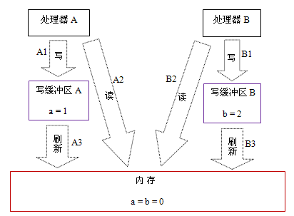

### （一）——基础

## JMM

## 重排序

关于重排序有个有意思的说法

> 编译器优化不应当影响程序本身的行为

这个想法是很好地，编译器也确实做到了*重排不影响单线程执行时的程序行为*，但多线程/并发的结果太难预料了，除非彻底放弃优化否则无法做到，so... 结果是**有违预期**的，**确实影响到了程序行为**。

类似的，还有gcc的o3优化，可能曲解一些case下的代码行为。

### 处理器重排序

| Processor A                          | Processor B                  |
| ------------------------------------ | ---------------------------- |
| a = 1; //A1 x = b; //A2         | b = 2; //B1 y = a; //B2 |
| 初始状态：a = b = 0处理器允许执行后得到结果：x = y = 0 | 【和左边合并成一格】                   |

#### 常见处理器允许的重排序类型的列表

|           | Load-Load | Load-Store | Store-Store | Store-Load | 数据依赖 |
| --------- | --------- | ---------- | ----------- | ---------- | ---- |
| sparc-TSO | N         | N          | N           | Y          | N    |
| x86       | N         | N          | N           | Y          | N    |
| ia64      | Y         | Y          | Y           | Y          | N    |
| PowerPC   | Y         | Y          | Y           | Y          | N    |

上表单元格中的“N”表示处理器不允许两个操作重排序，“Y”表示允许重排序。
从上表我们可以看出：常见的处理器都允许Store-Load重排序；常见的处理器都不允许对存在数据依赖的操作做重排序。sparc-TSO和x86拥有相对较强的处理器内存模型，它们仅允许对写-读操作做重排序（因为它们都使用了写缓冲区）。
※注1：sparc-TSO是指以TSO(Total Store Order)内存模型运行时，sparc处理器的特性。
※注2：上表中的x86包括x64及AMD64。
※注3：由于ARM处理器的内存模型与PowerPC处理器的内存模型非常类似，本文将忽略它。
※注4：数据依赖性后文会专门说明。

### 内存屏障

为了保证内存可见性，java编译器在生成指令序列的适当位置会插入内存屏障指令来禁止特定类型的处理器重排序。JMM把内存屏障指令分为下列四类：

| 屏障类型                | 指令示例                       | 说明                                       |
| ------------------- | -------------------------- | ---------------------------------------- |
| LoadLoad Barriers   | Load1; LoadLoad; Load2     | 确保Load1数据的装载，之前于Load2及所有后续装载指令的装载。       |
| StoreStore Barriers | Store1; StoreStore; Store2 | 确保Store1数据对其他处理器可见（刷新到内存），之前于Store2及所有后续存储指令的存储。 |
| LoadStore Barriers  | Load1; LoadStore; Store2   | 确保Load1数据装载，之前于Store2及所有后续的存储指令刷新到内存。    |
| StoreLoad Barriers  | Store1; StoreLoad; Load2   | 确保Store1数据对其他处理器变得可见（指刷新到内存），之前于Load2及所有后续装载指令的装载。StoreLoad Barriers会使该屏障之前的所有内存访问指令（存储和装载指令）完成之后，才执行该屏障之后的内存访问指令。 |

StoreLoad 
Barriers是一个“全能型”的屏障，它同时具有其他三个屏障的效果。现代的多处理器大都支持该屏障（其他类型的屏障不一定被所有处理器支持）。执行该屏障开销会很昂贵，因为当前处理器通常要把写缓冲区中的数据全部刷新到内存中（buffer
 fully flush）。

