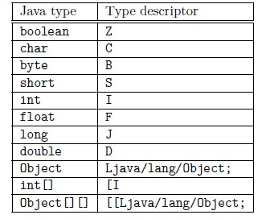
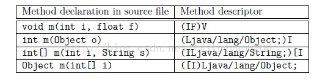

# tools


## 查看class结构的工具


### JavaClassViewer

解析出class文件中内容，并且提供到hex的映射，基本满足使用需求。


下了两个版本，在mac上，其中一个[oschina的版本](http://www.oschina.net/code/snippet_12_2154)对hex的定位不准，[sourceforge的版本](https://sourceforge.net/projects/javaclassviewer/)ok（ExecuableApp目录下这个）。


#### 使用

```shell
java -jar JavaClassViewer.jar
```


```shell
#!/bin/sh

BASEDIR=$(dirname "$0")
java -jar $BASEDIR/JavaClassViewer.jar

# 然后 ln -s run.sh JavaClassViewer
```


这个jar的main不支持命令行参数里传入文件路径，有时间改一下加上该功能。

> swing的“打开文件”功能做的比较差，不能传入路径，比较蛋疼


# overview


参见： [jvms-se7-ch4](https://docs.oracle.com/javase/specs/jvms/se7/html/jvms-4.html)


# 一些预定义


## java中的type descriptor


type descriptor




method descriptor




## access_flags/Class access and property modifiers


access_flags

The value of the `access_flags` item is a mask of flags used to denote access permissions to and properties of this class or interface. The interpretation of each flag, when set, is as shown in [Table 4.1](https://docs.oracle.com/javase/specs/jvms/se7/html/jvms-4.html#jvms-4.1-200-E.1).

**Table 4.1. Class access and property modifiers**

| Flag Name        | Value  | Interpretation                           |
| ---------------- | ------ | ---------------------------------------- |
| `ACC_PUBLIC`     | 0x0001 | Declared `public`; may be accessed from outside its package. |
| `ACC_FINAL`      | 0x0010 | Declared `final`; no subclasses allowed. |
| `ACC_SUPER`      | 0x0020 | Treat superclass methods specially when invoked by the *invokespecial* instruction. |
| `ACC_INTERFACE`  | 0x0200 | Is an interface, not a class.            |
| `ACC_ABSTRACT`   | 0x0400 | Declared `abstract`; must not be instantiated. |
| `ACC_SYNTHETIC`  | 0x1000 | Declared synthetic; not present in the source code. |
| `ACC_ANNOTATION` | 0x2000 | Declared as an annotation type.          |
| `ACC_ENUM`       | 0x4000 | Declared as an `enum` type.              |


## attribute相关


根据功用分：

* to correct interpretation of the `class` file by the Java Virtual Machine
  * `ConstantValue`
  * `Code`
  * `StackMapTable`
  * `Exceptions`
  * `BootstrapMethods`
* to correct interpretation of the `class` file by the class libraries of the Java SE platform
  * `InnerClasses`
  * `EnclosingMethod`
  * `Synthetic`
  * `Signature`
  * `RuntimeVisibleAnnotations`
  * `RuntimeInvisibleAnnotations`
  * `RuntimeVisibleParameterAnnotations`
  * `RuntimeInvisibleParameterAnnotations`
  * `RuntimeVisibleTypeAnnotations`
  * `RuntimeInvisibleTypeAnnotations`
  * `AnnotationDefault`
  * `MethodParameters`
* useful for tools
  * `SourceFile`
  * `SourceDebugExtension`
  * `LineNumberTable`
  * `LocalVariableTable`
  * `LocalVariableTypeTable`
  * `Deprecated`


**Table 4.7-A. Predefined class file attributes (by section)**

| Attribute                              | Section                                  | `class` file | Java SE |
| -------------------------------------- | ---------------------------------------- | ------------ | ------- |
| `ConstantValue`                        | [§4.7.2](https://docs.oracle.com/javase/specs/jvms/se8/html/jvms-4.html#jvms-4.7.2) | 45.3         | 1.0.2   |
| `Code`                                 | [§4.7.3](https://docs.oracle.com/javase/specs/jvms/se8/html/jvms-4.html#jvms-4.7.3) | 45.3         | 1.0.2   |
| `StackMapTable`                        | [§4.7.4](https://docs.oracle.com/javase/specs/jvms/se8/html/jvms-4.html#jvms-4.7.4) | 50.0         | 6       |
| `Exceptions`                           | [§4.7.5](https://docs.oracle.com/javase/specs/jvms/se8/html/jvms-4.html#jvms-4.7.5) | 45.3         | 1.0.2   |
| `InnerClasses`                         | [§4.7.6](https://docs.oracle.com/javase/specs/jvms/se8/html/jvms-4.html#jvms-4.7.6) | 45.3         | 1.1     |
| `EnclosingMethod`                      | [§4.7.7](https://docs.oracle.com/javase/specs/jvms/se8/html/jvms-4.html#jvms-4.7.7) | 49.0         | 5.0     |
| `Synthetic`                            | [§4.7.8](https://docs.oracle.com/javase/specs/jvms/se8/html/jvms-4.html#jvms-4.7.8) | 45.3         | 1.1     |
| `Signature`                            | [§4.7.9](https://docs.oracle.com/javase/specs/jvms/se8/html/jvms-4.html#jvms-4.7.9) | 49.0         | 5.0     |
| `SourceFile`                           | [§4.7.10](https://docs.oracle.com/javase/specs/jvms/se8/html/jvms-4.html#jvms-4.7.10) | 45.3         | 1.0.2   |
| `SourceDebugExtension`                 | [§4.7.11](https://docs.oracle.com/javase/specs/jvms/se8/html/jvms-4.html#jvms-4.7.11) | 49.0         | 5.0     |
| `LineNumberTable`                      | [§4.7.12](https://docs.oracle.com/javase/specs/jvms/se8/html/jvms-4.html#jvms-4.7.12) | 45.3         | 1.0.2   |
| `LocalVariableTable`                   | [§4.7.13](https://docs.oracle.com/javase/specs/jvms/se8/html/jvms-4.html#jvms-4.7.13) | 45.3         | 1.0.2   |
| `LocalVariableTypeTable`               | [§4.7.14](https://docs.oracle.com/javase/specs/jvms/se8/html/jvms-4.html#jvms-4.7.14) | 49.0         | 5.0     |
| `Deprecated`                           | [§4.7.15](https://docs.oracle.com/javase/specs/jvms/se8/html/jvms-4.html#jvms-4.7.15) | 45.3         | 1.1     |
| `RuntimeVisibleAnnotations`            | [§4.7.16](https://docs.oracle.com/javase/specs/jvms/se8/html/jvms-4.html#jvms-4.7.16) | 49.0         | 5.0     |
| `RuntimeInvisibleAnnotations`          | [§4.7.17](https://docs.oracle.com/javase/specs/jvms/se8/html/jvms-4.html#jvms-4.7.17) | 49.0         | 5.0     |
| `RuntimeVisibleParameterAnnotations`   | [§4.7.18](https://docs.oracle.com/javase/specs/jvms/se8/html/jvms-4.html#jvms-4.7.18) | 49.0         | 5.0     |
| `RuntimeInvisibleParameterAnnotations` | [§4.7.19](https://docs.oracle.com/javase/specs/jvms/se8/html/jvms-4.html#jvms-4.7.19) | 49.0         | 5.0     |
| `RuntimeVisibleTypeAnnotations`        | [§4.7.20](https://docs.oracle.com/javase/specs/jvms/se8/html/jvms-4.html#jvms-4.7.20) | 52.0         | 8       |
| `RuntimeInvisibleTypeAnnotations`      | [§4.7.21](https://docs.oracle.com/javase/specs/jvms/se8/html/jvms-4.html#jvms-4.7.21) | 52.0         | 8       |
| `AnnotationDefault`                    | [§4.7.22](https://docs.oracle.com/javase/specs/jvms/se8/html/jvms-4.html#jvms-4.7.22) | 49.0         | 5.0     |
| `BootstrapMethods`                     | [§4.7.23](https://docs.oracle.com/javase/specs/jvms/se8/html/jvms-4.html#jvms-4.7.23) | 51.0         | 7       |
| `MethodParameters`                     | [§4.7.24](https://docs.oracle.com/javase/specs/jvms/se8/html/jvms-4.html#jvms-4.7.24) | 52.0         | 8       |


**Table 4.7-B. Predefined class file attributes (by class file version)**

| Attribute                              | `class` file | Java SE | Section                                  |
| -------------------------------------- | ------------ | ------- | ---------------------------------------- |
| `ConstantValue`                        | 45.3         | 1.0.2   | [§4.7.2](https://docs.oracle.com/javase/specs/jvms/se8/html/jvms-4.html#jvms-4.7.2) |
| `Code`                                 | 45.3         | 1.0.2   | [§4.7.3](https://docs.oracle.com/javase/specs/jvms/se8/html/jvms-4.html#jvms-4.7.3) |
| `Exceptions`                           | 45.3         | 1.0.2   | [§4.7.5](https://docs.oracle.com/javase/specs/jvms/se8/html/jvms-4.html#jvms-4.7.5) |
| `SourceFile`                           | 45.3         | 1.0.2   | [§4.7.10](https://docs.oracle.com/javase/specs/jvms/se8/html/jvms-4.html#jvms-4.7.10) |
| `LineNumberTable`                      | 45.3         | 1.0.2   | [§4.7.12](https://docs.oracle.com/javase/specs/jvms/se8/html/jvms-4.html#jvms-4.7.12) |
| `LocalVariableTable`                   | 45.3         | 1.0.2   | [§4.7.13](https://docs.oracle.com/javase/specs/jvms/se8/html/jvms-4.html#jvms-4.7.13) |
| `InnerClasses`                         | 45.3         | 1.1     | [§4.7.6](https://docs.oracle.com/javase/specs/jvms/se8/html/jvms-4.html#jvms-4.7.6) |
| `Synthetic`                            | 45.3         | 1.1     | [§4.7.8](https://docs.oracle.com/javase/specs/jvms/se8/html/jvms-4.html#jvms-4.7.8) |
| `Deprecated`                           | 45.3         | 1.1     | [§4.7.15](https://docs.oracle.com/javase/specs/jvms/se8/html/jvms-4.html#jvms-4.7.15) |
| `EnclosingMethod`                      | 49.0         | 5.0     | [§4.7.7](https://docs.oracle.com/javase/specs/jvms/se8/html/jvms-4.html#jvms-4.7.7) |
| `Signature`                            | 49.0         | 5.0     | [§4.7.9](https://docs.oracle.com/javase/specs/jvms/se8/html/jvms-4.html#jvms-4.7.9) |
| `SourceDebugExtension`                 | 49.0         | 5.0     | [§4.7.11](https://docs.oracle.com/javase/specs/jvms/se8/html/jvms-4.html#jvms-4.7.11) |
| `LocalVariableTypeTable`               | 49.0         | 5.0     | [§4.7.14](https://docs.oracle.com/javase/specs/jvms/se8/html/jvms-4.html#jvms-4.7.14) |
| `RuntimeVisibleAnnotations`            | 49.0         | 5.0     | [§4.7.16](https://docs.oracle.com/javase/specs/jvms/se8/html/jvms-4.html#jvms-4.7.16) |
| `RuntimeInvisibleAnnotations`          | 49.0         | 5.0     | [§4.7.17](https://docs.oracle.com/javase/specs/jvms/se8/html/jvms-4.html#jvms-4.7.17) |
| `RuntimeVisibleParameterAnnotations`   | 49.0         | 5.0     | [§4.7.18](https://docs.oracle.com/javase/specs/jvms/se8/html/jvms-4.html#jvms-4.7.18) |
| `RuntimeInvisibleParameterAnnotations` | 49.0         | 5.0     | [§4.7.19](https://docs.oracle.com/javase/specs/jvms/se8/html/jvms-4.html#jvms-4.7.19) |
| `AnnotationDefault`                    | 49.0         | 5.0     | [§4.7.22](https://docs.oracle.com/javase/specs/jvms/se8/html/jvms-4.html#jvms-4.7.22) |
| `StackMapTable`                        | 50.0         | 6       | [§4.7.4](https://docs.oracle.com/javase/specs/jvms/se8/html/jvms-4.html#jvms-4.7.4) |
| `BootstrapMethods`                     | 51.0         | 7       | [§4.7.23](https://docs.oracle.com/javase/specs/jvms/se8/html/jvms-4.html#jvms-4.7.23) |
| `RuntimeVisibleTypeAnnotations`        | 52.0         | 8       | [§4.7.20](https://docs.oracle.com/javase/specs/jvms/se8/html/jvms-4.html#jvms-4.7.20) |
| `RuntimeInvisibleTypeAnnotations`      | 52.0         | 8       | [§4.7.21](https://docs.oracle.com/javase/specs/jvms/se8/html/jvms-4.html#jvms-4.7.21) |
| `MethodParameters`                     | 52.0         | 8       | [§4.7.24](https://docs.oracle.com/javase/specs/jvms/se8/html/jvms-4.html#jvms-4.7.24) |


**Table 4.7-C. Predefined class file attributes (by location)**

| Attribute                                | Location                                 | `class`file |
| ---------------------------------------- | ---------------------------------------- | ----------- |
| `SourceFile`                             | `ClassFile`                              | 45.3        |
| `InnerClasses`                           | `ClassFile`                              | 45.3        |
| `EnclosingMethod`                        | `ClassFile`                              | 49.0        |
| `SourceDebugExtension`                   | `ClassFile`                              | 49.0        |
| `BootstrapMethods`                       | `ClassFile`                              | 51.0        |
| `ConstantValue`                          | `field_info`                             | 45.3        |
| `Code`                                   | `method_info`                            | 45.3        |
| `Exceptions`                             | `method_info`                            | 45.3        |
| `RuntimeVisibleParameterAnnotations`, `RuntimeInvisibleParameterAnnotations` | `method_info`                            | 49.0        |
| `AnnotationDefault`                      | `method_info`                            | 49.0        |
| `MethodParameters`                       | `method_info`                            | 52.0        |
| `Synthetic`                              | `ClassFile`, `field_info`, `method_info` | 45.3        |
| `Deprecated`                             | `ClassFile`, `field_info`, `method_info` | 45.3        |
| `Signature`                              | `ClassFile`, `field_info`, `method_info` | 49.0        |
| `RuntimeVisibleAnnotations`, `RuntimeInvisibleAnnotations` | `ClassFile`, `field_info`, `method_info` | 49.0        |
| `LineNumberTable`                        | `Code`                                   | 45.3        |
| `LocalVariableTable`                     | `Code`                                   | 45.3        |
| `LocalVariableTypeTable`                 | `Code`                                   | 49.0        |
| `StackMapTable`                          | `Code`                                   | 50.0        |
| `RuntimeVisibleTypeAnnotations`, `RuntimeInvisibleTypeAnnotations` | `ClassFile`, `field_info`, `method_info`, `Code` | 52.0        |


# 结构


## 例子


### 例子1： 简单一个main


以以下java代码为例：

```java
public class TestPrintClassLoading {
	public static void main(String[] args) {
		Object o = args[0];
		if (o instanceof String) {
            // do nothing
		}
	}
}
```

会得到一个默认构造器和main这两个方法。

byte code如下：

```java
// class version 49.0 (49)
// access flags 0x21
public class TestPrintClassLoading {

  // compiled from: TestPrintClassLoading.java

  // access flags 0x1
  public <init>()V
   L0
    LINENUMBER 6 L0
    ALOAD 0
    INVOKESPECIAL java/lang/Object.<init> ()V
    RETURN
   L1
    LOCALVARIABLE this LTestPrintClassLoading; L0 L1 0
    MAXSTACK = 1
    MAXLOCALS = 1

  // access flags 0x9
  public static main([Ljava/lang/String;)V
   L0
    LINENUMBER 8 L0
    ALOAD 0
    ICONST_0
    AALOAD
    ASTORE 1
   L1
    LINENUMBER 9 L1
    ALOAD 1
    INSTANCEOF java/lang/String
    IFEQ L2
   L2
    LINENUMBER 12 L2
    RETURN
   L3
    LOCALVARIABLE args [Ljava/lang/String; L0 L3 0
    LOCALVARIABLE o Ljava/lang/Object; L1 L3 1
    MAXSTACK = 2
    MAXLOCALS = 2
}
```


### 例子2： 在1的基础上加上 Comparable接口实现、几个字段

int/String/Long/List/Map


```java
public class TestPrintClassLoading implements Comparable<TestPrintClassLoading> {
	private int i;
	private String s;
	private Long l;
	private List list;
	private Map<String, Integer> map;
  
	public static void main(String[] args) {
		Object o = args[0];
		if (o instanceof String) {
			// do nothing
		}
	}

	public int compareTo(TestPrintClassLoading o) {
		int res;

		res = Integer.compare(i, o.i);
		if (res != 0) {
			return res;
		}

		if (s == null) {
			res = o.s == null ? 0 : 1;
		} else {
			res = o.s == null ? 1 : s.compareTo(o.s);
		}

		if (res != 0) {
			return res;
		}

		if (l == null) {
			res = o.l == null ? 0 : 1;
		} else {
			res = o.l == null ? 1 : Long.compare(l, o.l);
		}

		return res;
	}
}
```


byte code（省去了和1中重复的部分）

```java
  // access flags 0x2
  private I i

  // access flags 0x2
  private Ljava/lang/String; s

  // access flags 0x2
  private Ljava/lang/Long; l
  
 // access flags 0x2
  private Ljava/lang/Long; l

  // access flags 0x2
  private Ljava/util/List; list
  
 // access flags 0x1
  public compareTo(LTestPrintClassLoading;)I
   L0
    LINENUMBER 26 L0
    ALOAD 0
    GETFIELD TestPrintClassLoading.i : I
    ALOAD 1
    GETFIELD TestPrintClassLoading.i : I
    INVOKESTATIC java/lang/Integer.compare (II)I
    ISTORE 2
   L1
    LINENUMBER 27 L1
    ILOAD 2
    IFEQ L2
   L3
    LINENUMBER 28 L3
    ILOAD 2
    IRETURN
   L2
    LINENUMBER 31 L2
   FRAME APPEND [I]
    ALOAD 0
    GETFIELD TestPrintClassLoading.s : Ljava/lang/String;
    IFNONNULL L4
   L5
    LINENUMBER 32 L5
    ALOAD 1
    GETFIELD TestPrintClassLoading.s : Ljava/lang/String;
    IFNONNULL L6
    ICONST_0
    GOTO L7
   L6
   FRAME SAME
    ICONST_1
   L7
   FRAME SAME1 I
    ISTORE 2
    GOTO L8
   L4
    LINENUMBER 34 L4
   FRAME SAME
    ALOAD 1
    GETFIELD TestPrintClassLoading.s : Ljava/lang/String;
    IFNONNULL L9
    ICONST_1
    GOTO L10
   L9
   FRAME SAME
    ALOAD 0
    GETFIELD TestPrintClassLoading.s : Ljava/lang/String;
    ALOAD 1
    GETFIELD TestPrintClassLoading.s : Ljava/lang/String;
    INVOKEVIRTUAL java/lang/String.compareTo (Ljava/lang/String;)I
   L10
   FRAME SAME1 I
    ISTORE 2
   L8
    LINENUMBER 37 L8
   FRAME SAME
    ILOAD 2
    IFEQ L11
   L12
    LINENUMBER 38 L12
    ILOAD 2
    IRETURN
   L11
    LINENUMBER 41 L11
   FRAME SAME
    ALOAD 0
    GETFIELD TestPrintClassLoading.l : Ljava/lang/Long;
    IFNONNULL L13
   L14
    LINENUMBER 42 L14
    ALOAD 1
    GETFIELD TestPrintClassLoading.l : Ljava/lang/Long;
    IFNONNULL L15
    ICONST_0
    GOTO L16
   L15
   FRAME SAME
    ICONST_1
   L16
   FRAME SAME1 I
    ISTORE 2
    GOTO L17
   L13
    LINENUMBER 44 L13
   FRAME SAME
    ALOAD 1
    GETFIELD TestPrintClassLoading.l : Ljava/lang/Long;
    IFNONNULL L18
    ICONST_1
    GOTO L19
   L18
   FRAME SAME
    ALOAD 0
    GETFIELD TestPrintClassLoading.l : Ljava/lang/Long;
    INVOKEVIRTUAL java/lang/Long.longValue ()J
    ALOAD 1
    GETFIELD TestPrintClassLoading.l : Ljava/lang/Long;
    INVOKEVIRTUAL java/lang/Long.longValue ()J
    INVOKESTATIC java/lang/Long.compare (JJ)I
   L19
   FRAME SAME1 I
    ISTORE 2
   L17
    LINENUMBER 47 L17
   FRAME SAME
    ILOAD 2
    IRETURN
   L20
    LOCALVARIABLE this LTestPrintClassLoading; L0 L20 0
    LOCALVARIABLE o LTestPrintClassLoading; L0 L20 1
    LOCALVARIABLE res I L1 L20 2
    MAXSTACK = 4
    MAXLOCALS = 3

  // access flags 0x1041
  public synthetic bridge compareTo(Ljava/lang/Object;)I
   L0
    LINENUMBER 9 L0
    ALOAD 0
    ALOAD 1
    CHECKCAST TestPrintClassLoading
    INVOKEVIRTUAL TestPrintClassLoading.compareTo (LTestPrintClassLoading;)I
    IRETURN
   L1
    LOCALVARIABLE this LTestPrintClassLoading; L0 L1 0
    MAXSTACK = 2
    MAXLOCALS = 2  
```


### 例子3： 在1的基础上给main里加上try-catch块

省略和1中重复的部分。


```java
	public static void main(String[] args) {  // line 18
		Object i = args[0];
		if (o instanceof String) {
			// do nothing
		}

		TestPrintClassLoading3 t = new TestPrintClassLoading3();
		try {
			try {
				t.i++;
			} catch (IllegalStateException | IllegalArgumentException e) {
			}
		} catch (Exception e) {
		}
	}
```


IDEA `show bytecode`的输出

```java
 // access flags 0x9
  public static main([Ljava/lang/String;)V
    TRYCATCHBLOCK L0 L1 L2 java/lang/IllegalStateException
    TRYCATCHBLOCK L0 L1 L2 java/lang/IllegalArgumentException
    TRYCATCHBLOCK L0 L3 L4 java/lang/Exception
   L5
    LINENUMBER 18 L5
    ALOAD 0
    ICONST_0
    AALOAD
    ASTORE 1
   L6
    LINENUMBER 19 L6
    GETSTATIC TestPrintClassLoading3.o : Ljava/lang/Object;
    INSTANCEOF java/lang/String
    IFEQ L7
   L7
    LINENUMBER 23 L7
   FRAME APPEND [java/lang/Object]
    NEW TestPrintClassLoading3
    DUP
    INVOKESPECIAL TestPrintClassLoading3.<init> ()V
    ASTORE 2
   L0
    LINENUMBER 26 L0
    ALOAD 2
    DUP
    GETFIELD TestPrintClassLoading3.i : I
    ICONST_1
    IADD
    PUTFIELD TestPrintClassLoading3.i : I
   L1
    LINENUMBER 28 L1
    GOTO L3
   L2
    LINENUMBER 27 L2
   FRAME FULL [[Ljava/lang/String; java/lang/Object TestPrintClassLoading3] [java/lang/RuntimeException]
    ASTORE 3
   L3
    LINENUMBER 30 L3
   FRAME SAME
    GOTO L8
   L4
    LINENUMBER 29 L4
   FRAME SAME1 java/lang/Exception
    ASTORE 3
   L8
    LINENUMBER 31 L8
   FRAME SAME
    RETURN
   L9
    LOCALVARIABLE args [Ljava/lang/String; L5 L9 0
    LOCALVARIABLE i Ljava/lang/Object; L6 L9 1
    LOCALVARIABLE t LTestPrintClassLoading3; L0 L9 2
    MAXSTACK = 3
    MAXLOCALS = 4
```


`javap -v`的输出

```java
javap -v TestPrintClassLoading3                                                                    master
Classfile /Users/zhihengfang/git_root/mine/java/test/src/main/java/TestPrintClassLoading3.class
  Last modified 2017-11-9; size 910 bytes
  MD5 checksum 91cb3edbad676b3b1f0b3098f791fbb7
  Compiled from "TestPrintClassLoading3.java"
public class TestPrintClassLoading3
  minor version: 0
  major version: 52
  flags: ACC_PUBLIC, ACC_SUPER
Constant pool:
   #1 = Methodref          #10.#39        // java/lang/Object."<init>":()V
   #2 = Fieldref           #4.#40         // TestPrintClassLoading3.o:Ljava/lang/Object;
   #3 = Class              #41            // java/lang/String
   #4 = Class              #42            // TestPrintClassLoading3
   #5 = Methodref          #4.#39         // TestPrintClassLoading3."<init>":()V
   #6 = Fieldref           #4.#43         // TestPrintClassLoading3.i:I
   #7 = Class              #44            // java/lang/IllegalStateException
   #8 = Class              #45            // java/lang/IllegalArgumentException
   #9 = Class              #46            // java/lang/Exception
  #10 = Class              #47            // java/lang/Object
  #11 = Utf8               i
  #12 = Utf8               I
  #13 = Utf8               s
  #14 = Utf8               Ljava/lang/String;
  #15 = Utf8               l
  #16 = Utf8               Ljava/lang/Long;
  #17 = Utf8               list
  #18 = Utf8               Ljava/util/List;
  #19 = Utf8               map
  #20 = Utf8               Ljava/util/Map;
  #21 = Utf8               Signature
  #22 = Utf8               Ljava/util/Map<Ljava/lang/String;Ljava/lang/Integer;>;
  #23 = Utf8               o
  #24 = Utf8               Ljava/lang/Object;
  #25 = Utf8               <init>
  #26 = Utf8               ()V
  #27 = Utf8               Code
  #28 = Utf8               LineNumberTable
  #29 = Utf8               main
  #30 = Utf8               ([Ljava/lang/String;)V
  #31 = Utf8               StackMapTable
  #32 = Class              #47            // java/lang/Object
  #33 = Class              #48            // "[Ljava/lang/String;"
  #34 = Class              #42            // TestPrintClassLoading3
  #35 = Class              #49            // java/lang/RuntimeException
  #36 = Class              #46            // java/lang/Exception
  #37 = Utf8               SourceFile
  #38 = Utf8               TestPrintClassLoading3.java
  #39 = NameAndType        #25:#26        // "<init>":()V
  #40 = NameAndType        #23:#24        // o:Ljava/lang/Object;
  #41 = Utf8               java/lang/String
  #42 = Utf8               TestPrintClassLoading3
  #43 = NameAndType        #11:#12        // i:I
  #44 = Utf8               java/lang/IllegalStateException
  #45 = Utf8               java/lang/IllegalArgumentException
  #46 = Utf8               java/lang/Exception
  #47 = Utf8               java/lang/Object
  #48 = Utf8               [Ljava/lang/String;
  #49 = Utf8               java/lang/RuntimeException
{
  public TestPrintClassLoading3();
    descriptor: ()V
    flags: ACC_PUBLIC
    Code:
      stack=1, locals=1, args_size=1
         0: aload_0
         1: invokespecial #1                  // Method java/lang/Object."<init>":()V
         4: return
      LineNumberTable:
        line 9: 0

  public static void main(java.lang.String[]);
    descriptor: ([Ljava/lang/String;)V
    flags: ACC_PUBLIC, ACC_STATIC
    Code:
      stack=3, locals=4, args_size=1
         0: aload_0
         1: iconst_0
         2: aaload
         3: astore_1
         4: getstatic     #2                  // Field o:Ljava/lang/Object;
         7: instanceof    #3                  // class java/lang/String
        10: ifeq          13
        13: new           #4                  // class TestPrintClassLoading3
        16: dup
        17: invokespecial #5                  // Method "<init>":()V
        20: astore_2
        21: aload_2
        22: dup
        23: getfield      #6                  // Field i:I
        26: iconst_1
        27: iadd
        28: putfield      #6                  // Field i:I
        31: goto          35
        34: astore_3
        35: goto          39
        38: astore_3
        39: return
      Exception table:
         from    to  target type
            21    31    34   Class java/lang/IllegalStateException
            21    31    34   Class java/lang/IllegalArgumentException
            21    35    38   Class java/lang/Exception
      LineNumberTable:
        line 18: 0
        line 19: 4
        line 23: 13
        line 26: 21
        line 28: 31
        line 27: 34
        line 30: 35
        line 29: 38
        line 31: 39
      StackMapTable: number_of_entries = 5
        frame_type = 252 /* append */
          offset_delta = 13
          locals = [ class java/lang/Object ]
        frame_type = 255 /* full_frame */
          offset_delta = 20
          locals = [ class "[Ljava/lang/String;", class java/lang/Object, class TestPrintClassLoading3 ]
          stack = [ class java/lang/RuntimeException ]
        frame_type = 0 /* same */
        frame_type = 66 /* same_locals_1_stack_item */
          stack = [ class java/lang/Exception ]
        frame_type = 0 /* same */
}
SourceFile: "TestPrintClassLoading3.java"
```


## 整体


```cpp
ClassFile {
    u4             magic;
    u2             minor_version;
    u2             major_version;
    u2             constant_pool_count;
    cp_info        constant_pool[constant_pool_count-1];
    u2             access_flags;
    u2             this_class;
    u2             super_class;
    u2             interfaces_count;
    u2             interfaces[interfaces_count];
    u2             fields_count;
    field_info     fields[fields_count];
    u2             methods_count;
    method_info    methods[methods_count];
    u2             attributes_count;
    attribute_info attributes[attributes_count];
}
```


* magic `CA FE BA BE`

* minor_version `00 00`

  0

* major_version `00 31`

  49

* constant_pool_count `00 18`

  24，后面常量池长度（个数）

* **constant pool**

  24个，挑几个罗列一下

  第一个

  * tag `0A`

    10，表示 Methodref

  * class_index `00 04`

    4，常量池索引（tag为7 - Class），这里为 `java/lang/Object`

  * name_and_type_index `00 14`

    20，常量池索引（tag为12 - NameAndType），这里为 `main`/`()V`

  第二个

  * tag `07`

    7，表示 Class

  * name_index `00 15`

    21，常量池索引（tag为1 - utf8），这里为 `java/lang/String`

  3,4都是Class，分别指向22、23的utf8常量  `TestPrintClassLoading`、`java/lang/Object`

  第五个

  * tag `01`

    1，表示 utf8

  * length `00 06`

    字符串长度，in byts（？）

    6

  * bytes `3C 69 6E 69 74 3E`

    字符串内容

    这里为： `<init>`，生成的构造器方法名

  6-19都是utf8，内容如下：

  * `()V`
  * `Code`
  * `LineNumberTable`
  * `LocalVariableTable`
  * `this`
  * `LTestPrintClassLoading;`
  * `main`
  * `([Ljava/lang/String;)V`
  * `args`
  * `[Ljava/lang/String;`
  * `o`
  * `Ljava/lang/Object;`
  * `SourceFile`
  * `TestPrintClassLoading.java`

  第二十个

  * tag `0C`

    21，对应 NameAndType

  * name_index `00 05`

    常量池常量索引

    utf8 ，这里为 `<init>`

  * descriptor_index `00 06`

    常量池常量索引

    utf8 ，这里为 `()V`

  21-23也是utf8，内容如下：

  * `java/lang/String`
  * `TestPrintClassLoading`
  * `java/lang/Object`

* access_flags `00 21`

  对应 public super

* this_class `00 03`

  当前类类名（非完全限定名）

  常量池索引

  3，Class 类型，这里为：`TestPrintCLassLoading`

* super_class `00 04`

  父类类名（完全限定名）

  常量池索引

  4，Class 类型，这里为：`java.lang.Object`

* interfaces_count `00 00`

  接口数量，见下面的 `interface`

* fields_count `00 00`

  属性字段数量

* **fields**

  字段部分，见下面的 *field*

* methods_count `00 02`

  方法数量

* **methods**

  方法部分，见下面的 *method* 

* attributes_count

  属性数量

  额外的属性，比如： 源文件信息等

* **attributes**

  属性部分，见下面的 *L1 - attribute*


## interface


结构：

1. class index

   常量池index，Class类型


以例子2为例：

bytes为： `00 0D`

> 就是一个interface，一个字段：常量池 index


0. index `00 0D`

   这里最后对应 utf8 `java/lang/Comparable`


## field


格式：

1. access_flags

   2 bytes

   访问标识

2. name_index

   2 bytes

   字段名（常量池索引），utf8

3. descriptor_index

   2 bytes

   字段名（常量池索引），utf8

4. attribute_count

   2 bytes

   int

5. … attributes，根据实际attribute来决定长度


以例子2为例：

bytes为：

```
                                            00  02  00  0E  00   
0F  00  00  00  02  00  10  00  11  00  00  00  02  00  12  00   
13  00  00  00  02  00  14  00  15  00  00  00  02  00  16  00   
17  00  01  00  18  00  00  00  02  00  19
```


1. `private int i;`

   * access_flags `00 02`

     private

   * name_index `00 0E`

     14，对应 `i`

   * descriptor_index `00 0F`

     15，对应 `I`

   * attributes_count `00 00`

     0

2. `private String s;`

   descriptor_index对应`Ljava/lang/String;`

   此外没什么区别，略过

3. `private Long l;`

   descriptor_index对应`Ljava/lang/Long;`

   此外没什么区别，略过

4. `private List list;`

   descriptor_index对应`Ljava/util/List;`

   此外没什么区别，略过

5. `private Map<String, Integer> map;`

   这个attributes_count字段为1，然后多出了attributes部分

   **attributes**

   第一个

   * attribute_name_index `00 18`

     24，常量池索引，对应 utf8 `Signature`

     工具里识别为扩展属性。

   * attribute_length `00 02`

     2，长度

   * raw data `00 19`

     签名内容

> 从这里来看，跟代码里定义的顺序是一致的


## method


以例子1为例。

main方法的bytes如下：

```shell
         00  09  00  0C  00  0D  00  01  00  07  00  00  00  48   
 00  02  00  02  00  00  00  0C  2A  03  32  4C  2B  C1  00  02   
 99  00  03  B1  00  00  00  02  00  08  00  00  00  0E  00  03   
 00  00  00  08  00  04  00  09  00  0B  00  0C  00  09  00  00   
 00  16  00  02  00  00  00  0C  00  0E  00  0F  00  00  00  04   
 00  08  00  10  00  11  00  01
```


结构如下：

* access_flags `00 09`

  9 对应 public static

* name_index `00 0C`

  12，常量表里第12个为 utf8 `main`

  方法名

* descriptor_index `00 0D`

  13，常量表里第13个为 utf8 `({Ljava/lang/String;})V`

  方法签名

* attributes_count `00 01`

  1，紧跟其后的属性数量（1个）

* attributes

  **attribute 第一个**

  * attribute_name_index `00 07`

    属性名

    7，常量表第7个为 utf8 `Code` 

    > 囧，竟然是用这个来标识类型的

  * attribute_length `00 00 00 48`

    48，该属性内容后面的长度

  * max_stack `00 02`

    最大栈深度，给vm优化用的吧，分配栈大小。

    2...

  * max_locals `00 02`

    最大局部变量数，给vm用，分配局部变量表大小

    2...

  * code_length `00 00 00 0C`

    紧跟其后的代码的长度

    12

  * code `2A  03  32  4C  2B  C1  00  02  99  00  03  B1`

    代码字节，需要根据jvm字节码结构去解析。 

    这里对应如下（行号需要其他信息）：

    ```java
       L0
        LINENUMBER 8 L0
        ALOAD 0
        ICONST_0
        AALOAD
        ASTORE 1
       L1
        LINENUMBER 9 L1
        ALOAD 1
        INSTANCEOF java/lang/String
        IFEQ L2
       L2
        LINENUMBER 12 L2
        RETURN
    ```

  * exception_table_length `00 00`

    0

    而在例3中有try-catch块，那么此时为 `00 03`，3个异常表

  * **exception_table**  （例子3）

    第一个

    * start_pc `00 15`

      21，index

      起始pc

    * end_pc ` 00 1F`

      31，index

      结束pc，也即这里该handler作用范围为 21-31 (开闭还不确定)

    * handler_pc `00 22`

      34，index

      handler所处的位置

    * catch_type `00 07`

      7，常量池索引，class类型，对应到 utf8 `java/lang/IllegalStateException`

    第二个

    - start_pc `00 15`

      21，index

      起始pc

    - end_pc ` 00 1F`

      31，index

      结束pc，也即这里该handler作用范围为 21-31 (开闭还不确定)

    - handler_pc `00 22`

      34，index

      handler所处的位置

    - catch_type `00 08`

      8，常量池索引，class类型，对应到 utf8 `java/lang/IllegalArgumentException`

    第三个

    - start_pc `00 15`

      21，index

      起始pc

    - end_pc ` 00 23`

      35，index

      结束pc，也即这里该handler作用范围为 21-35 (开闭还不确定)

    - handler_pc `00 26`

      38，index

      handler所处的位置

    - catch_type `00 09`

      9，常量池索引，class类型，对应到 utf8 `java/lang/Exception`

  * attributes_count `00 02`

    2

    该attribute的attributes数量  = =

    **attribute 第一个**

    * attribute_name_index `00 08`

      8，对应的是 utf8 `LineNumberTable`

    * attribute_length `00 00 00 0E`

      14，后面的长度

    * line_number_table_length `00 03`

      3

      line_number_table中有几条记录

    * **line_number_table**

      > 对于默认添加的构造器，line number会是类定义所在的line，如 `line 9: public class A`

      **第一个 line number 记录**

      * start_pc `00 00`

        0

        This represents the index into the code array from which the local variable is effective.

        对应到字节码的位置，end由下一行的start确定

      * line_number `00 08`

        8，此case中的行号（disassemble工具会转为相对于方法体的行号（第x行，0开始））

      **第二个 line number 记录**

      - start_pc `00 04`

        4，可以知道第一行代码共生成了4 byte（？要看是byte还是instrument的index？）

      - line_number `00 09`

        8，此case中的行号（disassemble工具会转为相对于方法体的行号（第x行，0开始））

      **第三个 line number 记录**

      - start_pc `00 0B `

        11，最后一行的指令为 `03 B1`。 从上面可以看到，对应的是 `RETURN` 指令。

        也可以看出，pc似乎是byte（除非instrument都是单byte的，这时byte还是index就没区别了）

      - line_number `00 0C`

        12，因为

    **attribute 第二个**

    * attribute_name_index `00 09`

      9，对应的是 utf8 `LocalVariableTable`

    * attribute_length `00 00 00 0C`

      12，后面的长度

    * local_variable_table_length `00 01`

      1，1个变量 = =

      local_variable_table中有几条记录

    * **line_number_table**

      **第一个line number记录**

      * start_pc `00 00`

        含义同上。

        可以给vm做优化使用参考。

      * length `00 05`

        This represents the length of the code region in which the local variable is effective.

        变量有效的代码长度，也即生存期为 [start_pc, start_pc + length]

        5（看到工具上显示为10，不清楚为什么乘以2）

      * name_index `00 0A`

        变量名的常量池索引。

        10，这里为 utf8 `this`  （囧）

      * descriptor_index `00 0B`

        变量类型的签名（常量池索引）。

        11，这里为 utf8 `LTestPrintClassLoading;`

      * index `00 00`

        变量在变量表中的索引。

    **attribute 第三个** （例子3）

    * attribute_name_index `00 25`

      37，对应的是 utf8 `StackMapTable`

    * attribute_length `00 00 00 21`

      33，后面的长度

    * raw data

      ```
                                                          00  05  FC   
      00  0D  07  00  26  FF  00  14  00  03  07  00  27  07  00  26  
      07  00  28  00  01  07  00  29  00  42  07  00  2A  00
      ```

      ​


## L1 - attribute


通用字段不多重复。

格式是：

1. attribute_name_index

   2 byte，常量池索引（utf8）

   用于标识类型

2. attribute_length

   4 byte，后面属性内容长度

3. … 属性内容，根据不同的类型而定


* SourceFile
* [Extended Attr.] Signature


### SourceFile attribute

* attribute_name_index `00 12`

  18，常量池索引，对应： utf8 `SourceFile`

* attribute_length `00 00 00 02`

  2，后面的长度

* sourcefile_index `00 13`

  19，常量池索引，对应： utf8 `TestPrintClassLoading.java`

  可见只是文件名，不包含路径信息。


### [Extended Attr.] Signature


* attribute_name_index

  常量池utf8 `Signature`

  > 工具里显示为 `[Extended Attr.] Signature`，估计是识别为扩展属性

* attribute_length

  2

* raw data `00 28`


### [Extended Attr.] StackMapTable


The `StackMapTable` attribute is a variable-length attribute in the `attributes` table of a `Code` attribute ([§4.7.3](https://docs.oracle.com/javase/specs/jvms/se8/html/jvms-4.html#jvms-4.7.3)). A `StackMapTable` attribute is used during the process of verification by type checking ([§4.10.1](https://docs.oracle.com/javase/specs/jvms/se8/html/jvms-4.html#jvms-4.10.1)).

There may be at most one `StackMapTable` attribute in the `attributes` table of a `Code` attribute.

In a `class` file whose version number is 50.0 or above, if a method's `Code` attribute does not have a `StackMapTable` attribute, it has an *implicit stack map attribute* ([§4.10.1](https://docs.oracle.com/javase/specs/jvms/se8/html/jvms-4.html#jvms-4.10.1)). This implicit stack map attribute is equivalent to a `StackMapTable` attribute with`number_of_entries` equal to zero.

The `StackMapTable` attribute has the following format:

```cpp
StackMapTable_attribute {
    u2              attribute_name_index;
    u4              attribute_length;
    u2              number_of_entries;
    stack_map_frame entries[number_of_entries];
}
```


```java
      StackMapTable: number_of_entries = 5
        frame_type = 252 /* append */
          offset_delta = 13
          locals = [ class java/lang/Object ]
        frame_type = 255 /* full_frame */
          offset_delta = 20
          locals = [ class "[Ljava/lang/String;", class java/lang/Object, class TestPrintClassLoading3 ]
          stack = [ class java/lang/RuntimeException ]
        frame_type = 0 /* same */
        frame_type = 66 /* same_locals_1_stack_item */
          stack = [ class java/lang/Exception ]
        frame_type = 0 /* same */
```

