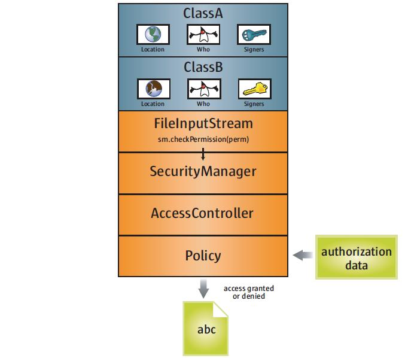
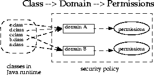
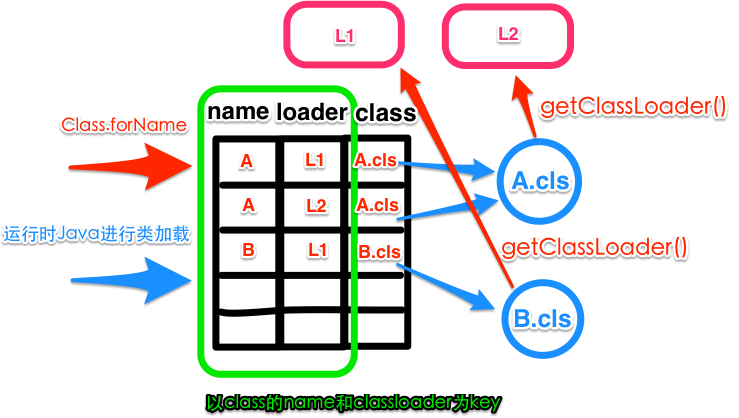

#  OpenJDK类加载实现浅析

* [OpenJDK类加载实现浅析#1：整体流程](http://blog.csdn.net/kisimple/article/details/44727147) or [local](resource/OpenJDK类加载实现浅析#1：整体流程 - KISimple的专栏 - 博客频道 - CSDN.NET.html)
* [OpenJDK类加载实现浅析#2：安全检查](http://blog.csdn.net/kisimple/article/details/44859187) or [local](resource/OpenJDK类加载实现浅析#2：安全检查 - KISimple的专栏 - 博客频道 - CSDN.NET.html)
* [OpenJDK类加载实现浅析#3：并行加载](http://blog.csdn.net/kisimple/article/details/44890463) or [local](resource/OpenJDK类加载实现浅析#3：并行加载 - KISimple的专栏 - 博客频道 - CSDN.NET.html)

## 点 - 对ref内容的部分摘录

### 几个`xxxClass`方法

* `loadClass`用于实现类加载的代理机制；
* `findClass`用于找到类的二进制表示；
* `defineClass`用于将类的二进制表示转化成Class对象，这一步由虚拟机来完成；

### jar包的处理

* jar包的处理有一个特别的地方，就是jar包Manifest的Class-Path属性如果指定了其它jar包，需要将它们也加载 - 采用Stack实现深度优先遍历

### classpath

* 按classpath字符串的字面顺序来构建数组的，所以结论就是findClass也是按照classpath字符串的字面顺序来进行搜索的

* 通配符的展开是由虚拟机的launcher来完成的，这样在虚拟机运行时才能看到展开后的classpath

  > 通配符的展开并不是确定的，在不同平台可能会不同，即使在同一机器，不同时刻可能也不同，我们不应该依赖通配符展开后的顺序，如果需要依赖顺序就应该直接写明而不要使用通配符
  > 在Linux平台上将会使用readdir这个系统调用（参考man）来读取目录下的文件，那么通配符的展开就要取决于这个系统调用读取文件的顺序了
### 安全检查



SecurityManager -> AccessController -> Policy


总结一下就是：

1. 通过`System.getSecurityManager()`拿到`SecurityManager`；
2. `SecurityManager`直接交给`AccessController`处理；
3. `AccessController`通过调用`getStackAccessControlContext`取得`AccessControlContext`，并交给`AccessControlContext`处理；
4. `AccessControlContext`交给它所持有的一个`ProtectionDomain`数组处理；
5. `ProtectionDomain`交给`PermissionCollection`处理，有两种方式拿到`PermissionCollection`，一种是使用自身持有的`PermissionCollection`（构造函数传入），另一种是使用`Policy`来获得。使用哪种方式由`staticPermissions`决定。

####  SecurityManager

`System.getSecurityManager()`返回的...是在虚拟机启动的时候，由launcher来设置的，而launcher会根据`"java.security.manager"`（System.getProperty）来…。

#### Policy

* 读取{java.home}/lib/security/java.security配置文件policy.provider=sun.security.provider.PolicyFile

* "sun.security.provider.PolicyFile"

#### Protecion Domain

> A domain conceptually encloses a set of classes whose instances are granted the same set of permissions. Protection domains are determined by the policy currently in effect.

 有点像权限组的概念，多对多：

* domain可以有多个class
* domain可以有多个权限



示例：

```
ProtectionDomain  null
 null
 <no principals>
 java.security.Permissions@73c94b51 (
 ("java.security.AllPermission" "<all permissions>" "<all actions>")
)


ProtectionDomain  (file:/C:/Java/jdk1.7.0_51/jre/lib/ext/groovy-2.4.0.jar <no signer certificates>)
 sun.misc.Launcher$ExtClassLoader@d325aef
 <no principals>
 java.security.Permissions@3aeb3f66 (
 ("java.io.FilePermission" "\C:\Java\jdk1.7.0_51\jre\lib\ext\groovy-2.4.0.jar" "read")
)


ProtectionDomain  (file:/E:/Projects/just4fun/target/classes/ <no signer certificates>)
 sun.misc.Launcher$AppClassLoader@35f784d7
 <no principals>
 java.security.Permissions@2a8f5fc2 (
 ("java.lang.RuntimePermission" "exitVM")
 ("java.io.FilePermission" "\E:\Projects\just4fun\target\classes\-" "read")
)
```

#### 安全检查的意义

##### default访问权限被绕过的问题

**同包**这个是非强制的，也即其他代码也可以“强行”和特定代码“同包”。

应对方式：

可以使用`Manifest`的`Sealed`属性了，在打jar包的时候，我们可以指定`Manifest`并添加`Sealed`属性，就像下面这样，

```
Name: me/kisimple/just4fun/
Sealed: true12
```

这样会在`getAndVerifyPackage`时对URL进行检查，以确保“确实同包”。

### 并发加载

最后总结一下：

类加载库层面，

- 不支持并发：同步classloader，`synchronized`方法；
- 支持并发：同步classname对象，`synchronized`代码块；

虚拟机层面，

- 不支持并发：对classloader加锁，`ObjectLocker ol(lockObject, THREAD, DoObjectLock);`
- 支持并发：对systemdictionary加锁，`MutexLocker mu(SystemDictionary_lock, THREAD);`


# 小结

## ref

- [Pandora classloader system current contextloader](http://gitlab.alibaba-inc.com/middleware-container/pandora/wikis/pandora-classloader-system-current-contextloader)

带来了新的概念/视角，但确实没看太懂。

其他ref：

- [深入浅出ClassLoader](http://ifeve.com/classloader/)
- [一看你就懂，超详细java中的ClassLoader详解](http://blog.csdn.net/briblue/article/details/54973413)    
- [深入探讨 Java 类加载器](https://www.ibm.com/developerworks/cn/java/j-lo-classloader/)
- [Class forname classloader loadclass](http://gitlab.alibaba-inc.com/middleware-container/pandora/wikis/class-forname-classloader-loadClass)

## java/jvm中的类型信息

> 在JVM中，如何确定一个类型实例？答：全类名吗？不是，是类加载器加上全类名。在JVM中，类型被定义在一个叫**SystemDictionary** 的数据结构中，该数据结构接受类加载器和全类名作为参数，返回类型实例。




**注意这里的classloader是defining loader，也即触发执行defineClass的那个**，也即在 Java 虚拟机判断两个类是否相同的时候，使用的是类的定义加载器。也就是说，哪个类加载器启动类的加载过程并不重要，重要的是最终定义这个类的加载器

### 类型检测type checking

ref：

* [pandora - wiki - type checking](http://gitlab.alibaba-inc.com/middleware-container/pandora/wikis/type-checking)


* 编译器检测（原来理解为编译期了，但看作者的解释，还是在load的时候，也还是运行时）

  > 部分的检测还是在编译器的协助下完成的，而这一步要早于真正执行它。Java编译器会开启这种静态检测机制，会使用一组类型检测规则来检测Java字节码，检测这些字节码是否符合规则，如果不符合那么将会被拒绝

  下面示例代码通用部分：

  ```java
  public class A {
  }

  public class B extends A {
  }

  public class Test {
      A a = null;
      void m(A a) {
      }
  }
  ```

  ​

  * 方法参数 

    * **如果调用方法时传入的实参类型和形参不完全一致（比如为子类实例）的话，会触发java的编译器检查：在执行前提前加载参数类型（形参 and 实参 类型）**

      ```java
      public class Main {
          public static void main(String[] args) {
              Test test = new Test();
              test.m(new B());  // vs test.m(new A());
          }
      }
      ```

      ​

  * 成员变量赋值

    * **当一个类的成员变量被赋值一个子类型时，该成员变量的类型和子类型将会优先于成员变量所在类进行加载**

      ```java
      public class Main {
          public static void main(String[] args) {
              Test test = new Test();
              test.a = new B();
          }
      }
      ```

      ​

  * 方法体返回值的类型为签名的子类型

    * 当一个类中包括的方法（只要存在，即使没使用），返回的类型是形参的子类时，形参和返回参数的子类型将会提前加载

      ```java
      public class Main {

          public static void main(String[] args) {
              Test test = new Test();
              test.m(new A());
          }

          A check(A a) {
              return new B();
          }
      }
      ```

      ​

* 动态检测


## class load

> ​    Java由于其晚绑定和“解释型”的特性，类型的加载是到最晚才进行，一个类型直到被调用构造函数、静态方法或者在字段上使用时才会被加载。

### 程序启动时的类加载顺序

1. main所在类
2. main返回值（一般void）类型Void
3. main中代码用到的类型
4. ...

[pandora - wiki - type checking](http://gitlab.alibaba-inc.com/middleware-container/pandora/wikis/type-checking)里提到**如果调用方法时传入的实参类型和形参不完全一致（比如为子类实例）的话，会触发java的编译器检查：在执行前提前加载类型**，实际会插入到上面的1之后2之前

### jvm加载类的过程

1. load
   1. find（这里先不考虑双亲委派）
   2. define
2. link
   1. verify
   2. prepare
   3. resolve
3. initialize


一个类加载的过程，在运行时Java（JVM）和java代码之间来回切换，有点复杂，我们画一个简单的图来描述主要过程，由于原有的类加载过程中还要处理并发问题，我们将这些内容都去掉，只观察类型加载的主要流程，如图所示。


上图是一个经过简化后的**Class.forName**加载过程，这里不再贴代码了，红色的框代表是Java代码，或者说能够在rt.jar中找到的内容，绿色的框代表是JVM的实现代码，是由C和C++实现的，当由Java调用C的代码时，使用绿色的箭头，反之使用红色箭头。以上的方法名和参数都做过简化，并不是真实代码的完全体现，下面说明一下以上需要关注的步骤。

| 步骤   | 说明                                       |
| ---- | ---------------------------------------- |
| 1    | 调用Class.forName(className)方法，该方法会调用native的JVM实现，调用前该方法会确定准备好需要加载的类名以及ClassLoader，将其传递给native方法 |
| 2    | 进入到JVM实现后，首先会在SystemDictionary中根据类名和ClassLoader组成hash，进行查询，如果能够命中，则返回 |
| 3    | 如果加载到则返回                                 |
| 4    | 如果在SystemDictionary中无法命中，将会调用Java代码：ClassLoader.loadClass(类名)，这一步将委派给Java代码，让传递的ClassLoader进行类型加载 |
| 5    | 以URLClassLoader为例，ClassLoader确定了类文件的字节流，但是该字节流如何按照规范生成Class对象，这个过程在Java代码中是没有体现的，其实也就是要求调用ClassLoader.defineClass(byte[])进行解析类型，该方法将会再次调用native方法，因为字节流对应Class对象的规范是定义在JVM实现中的 |
| 6    | 进入JVM实现，调用SystemDictionary的resolve_stream方法，接受byte[]，使用ClassFileParser进行解析 |
| 7    | SystemDictionary::define_instance_class  |
| 8    | 如果类型被加载了，将类名、ClassLoader和类型的实例引用添加到SystemDictionary中 |
| 9    | 返回                                       |
| 10   | 返回                                       |
| 11   | 从Java实现返回到Java代码的defineClass，返回Class对象   |
| 12   | 返回给loadClass(Classname)方法                |
| 13   | 返回给Java实现的SystemDictionary，因为在resolve_class中调用的ClassLoader.loadClass。这里会做出一个判断，如果加载Class的ClassLoader并非传递给resolve_class的ClassLoader，那么会将类名、传递给resolve_class的ClassLoader以及类型的实例引用添加到SystemDictionary中 |
| 14   | 返回给Class.forName类型实例                     |

### 几种类加载的方式

* `Class.forName` == `Class.forName(className, true, ClassLoader.getClassLoader(caller), caller)`

  > `Class<?> caller = Reflection.getCallerClass()`;  这个方法是native的，虚拟机层面支持
  >
  > 可见默认使用currentCL（见下文）
  >
  > > **注意**
  > >
  > > ```java
  > >         SecurityManager sm = System.getSecurityManager();
  > >         if (sm != null) {
  > > ```
  > >
  > > 带loader参数版本的forName，在有securityManager时才会尝试用caller的CL来替换null CL，而多数情况是没有的，所以就是null CL（= =）； 不带loader参数的则是直接使用caller的CL
  >
  > Class.getResource同此
  >
  > 注意这个参数true： boolean initialize，做类初始化


* `cl.loadClass(className)`

  > 指定cl

> 以上2个都是显式加载

* `new B()`  == `Class.forName("B", false, A.class.getClassloader()).newInstance()`

  > 可以看到，使用的是“当前类”的CL
  >
  > initialize为false，不做类初始化

* `B b = (B) klass.newInstance()`

  > 同上，也是用currentCL

> 以上2个都是隐式加载

### 类加载中常见问题和解决思路

* NoClassDefFoundError

  * 原因： 由于JVM或者类加载器实例尝试加载类型的定义，但是该定义却没有找到，影响了执行路径。换句话说，在编译时这个类是能够被找到的，但是在执行时却没有找到。

    这一刻IDE是没有出错提醒的，但是在运行时却出现了错误。

  * 解决思路： 查一下为什么运行时没加载到，一般是classpath里没有，常见原因是depend scope为provided

* NoSuchMethodError

  * NoSuchMethodError代表这个类型确实存在，但是一个不正确的版本被加载了
  * 常见于 **Maven坐标** 的变动，使得应用依赖了多个 **相同内容，不同版本** 的jar包，以致在运行时选择了非期望的版本
  * 为了解决这个问题我们可以使用 ‘-verbose:class’ 来判断该JVM加载的到底是哪个版本。

* ClassCastException

  * 在一个类加载器的情况下，一般出现这种错误都会是在转型操作时，比如：A a = (A) method();，很容易判断出来method()方法返回的类型不是类型A
  * 但是在 **JavaEE** 多个类加载器的环境下就会出现一些难以定位的情况。

* LinkageError

  * 和 **ClassCastException** 本质一样

  * 加载自不同位置的*相同类*在同一段逻辑（比如：方法）中交互时，会出现 **LinkageError** 

  * **LinkageError** 需要观察哪个类被不同的类加载器加载了，在哪个方法或者调用处发生（交汇）的，然后才能想解决方法，解决方法无外乎两种。第一，还是不同的类加载器加载，但是相互不再交汇影响，这里需要针对发生问题的地方做一些改动，比如更换实现方式，避免出现上述问题；第二，冲突的类需要由一个Parent类加载器进行加载。**LinkageError**
     和**ClassCastException** 
     本质是一样的，加载自不同类加载器的类型，在同一个类的方法或者调用中出现，如果有转型操作那么就会抛 **ClassCastException** ，如果是直接的方法调用处的参数或者返回值解析，那么就会产生 **LinkageError** 。

  * 示例：

    ```java

    package com.murdock.classloader.linkageerror;
     
    /**
     * @author weipeng2k 2015年4月28日 上午10:04:26
     */
    public class HandleUtils {
        public void m(Param param) {
            param.generate();
        }
    }
     
    package com.murdock.classloader.linkageerror;
     
    public class Param {
        public Param2 generate() {
            return new Param2();
        }
    }
     
    package com.murdock.classloader.linkageerror;
     
    public class Param2 extends Param {
        public Param2 generate() {
            return new Param2();
        }
    }
    ```


    @Test
    public void test() throws Exception {
        // cl1在加载HandleUtils和Param时将会使用AppClassLoader
        URLClassLoader cl1 = new URLClassLoader(new URL[] {new File("target/test-classes").toURI().toURL()}, null) {
            @Override
            public Class<?> loadClass(String name) throws ClassNotFoundException {
                if ("com.murdock.classloader.linkageerror.HandleUtils".equals(name)) {
                    return ClassLoader.getSystemClassLoader().loadClass(name);
                }
                if ("com.murdock.classloader.linkageerror.Param".equals(name)) {
                    return ClassLoader.getSystemClassLoader().loadClass(name);
                }
                return super.loadClass(name);
            }
        };
        ClassLoader.getSystemClassLoader().loadClass("com.murdock.classloader.linkageerror.Param2");  // appCL.Param2 注意不做resolve
        HandleUtils hu = (HandleUtils) cl1.loadClass("com.murdock.classloader.linkageerror.HandleUtils").newInstance();  // appCL.HandleUtils -> ...
        hu.m((Param) cl1.loadClass("com.murdock.classloader.linkageerror.Param2").newInstance());  // cl1.Param2 -> cl1.Param 转为 appCL.Param
    }
    ​```
    
    ​

* ## 

## classloader

### 概念

#### 双亲委派

类似原型模式，只是在约定上要求**优先委派给双亲（原型）**，但并非强制，所以也可能违反，称为**打破双亲委派**。

通用流程（loadClass）：

1. 查看缓存，如果有则返回（findLoadedClass）
2. 委托给parent（super.loadClass）
   * 注意，标准双亲委派模型里只委托parent对此类做load，而不做resolve，甚至默认行为就是不做resolve
3. （如果还没找到的话）执行自己的加载逻辑（findClass）

对应代码：

```java
protected Class<?> loadClass(String name, boolean resolve)
        throws ClassNotFoundException
    {
        synchronized (getClassLoadingLock(name)) {
            // 首先，检测是否已经加载
            Class<?> c = findLoadedClass(name);
            if (c == null) {
                long t0 = System.nanoTime();
                try {
                    if (parent != null) {
                        //父加载器不为空则调用父加载器的loadClass
                        c = parent.loadClass(name, false);
                    } else {
                        //父加载器为空则调用Bootstrap Classloader
                        c = findBootstrapClassOrNull(name);
                    }
                } catch (ClassNotFoundException e) {
                    // ClassNotFoundException thrown if class not found
                    // from the non-null parent class loader
                }

                if (c == null) {
                    // If still not found, then invoke findClass in order
                    // to find the class.
                    long t1 = System.nanoTime();
                    //父加载器没有找到，则调用findclass
                    c = findClass(name);

                    // this is the defining class loader; record the stats
                    sun.misc.PerfCounter.getParentDelegationTime().addTime(t1 - t0);
                    sun.misc.PerfCounter.getFindClassTime().addElapsedTimeFrom(t1);
                    sun.misc.PerfCounter.getFindClasses().increment();
                }
            }
            if (resolve) {
                //调用resolveClass()
                resolveClass(c);
            }
            return c;
        }
    }
```


如：


or


##### 双亲委派（代理）的意义

* 保证所有类都继承自Object（加载其的CL需要一样）
* class的命名空间

##### J2EE的委派模型


##### tomcat的类加载顺序（开启delegate模式）


#### 父CL跟父类没关系

并非使用类继承的方式来表示双亲委派，毕竟CL的父子关系只有逻辑关系而无实现上的关联。

#### ClassLoader类一览

* getResource
  * 从给定的repository中查找URLs
  * 也具备类似`loadClass`一样的代理机制，我们可以将`loadClass`视为：`defineClass(getResource(name).getBytes())`
* getResources

##### 几个`xxClass`方法

* loadClass
  * main logic，“加载类的入口方法，调用该方法完成类的显式加载。通过对该方法的重新实现，我们可以完全控制和管理类的加载过程。”
  * 如果不override的话就是**双亲委派**的逻辑所在
  * 一般（如果不想打破双亲委派逻辑的话）不override这个
* parent.loadClass
  * …，双亲委派逻辑的一部分（调parent.loadClass）
* findClass
  * CL的差异所在： 不同的find方式/逻辑
  * 一般是override这个
* resolveClass
  * <del>生成最后的Class对象</del>
  * 链接一个指定的类。这是一个在某些情况下确保类可用的必要方法，详见 Java 语言规范中“执行”一章对该方法的描述。
* defineClass
  * 该方法是 ClassLoader 中非常重要的一个方法，它接收以字节数组表示的类字节码，并把它转换成 Class 实例，该方法转换一个类的同时，会先要求装载该类的父类以及实现的接口类。
  * 跟resolveClass的关系？ = =

##### 几个特殊方法

* findBootstrapClassOrNull
  * 从名字可以知道是使用bootstrap loader来…
  * 当parent为null时调用（双亲委派逻辑里）
  * 显然应该是native的

#### defining classloader 和 initiating classload

* `defining classloader` load class时触发执行defineClass方法所属的CL
* `initiating classloader` 发起load class的classloader（loadClass方法，而且应该是第一个吧，不然要是一路delegate下去就有多个…了）

两种类加载器的关联之处在于：一个类的定义加载器是它引用的其它类的初始加载器。如类 `com.example.Outer`引用了类 `com.example.Inner`，则由类 `com.example.Outer`的定义加载器负责启动类 `com.example.Inner`的加载过程。

也即：**defineClass会触发对其引用类的loadClass**

> 额，那跟resolveClass的关系是？

### classloader cache loaded classes

在ClassLoader的代码里没找到cache的逻辑，而findLoadedClass0又是native的，所以应该是vm层面的，没有暴露在java代码里。

##### ClassLoader.findLoadedClass(String className)

Ref: [Classloader findloadedclass systemdictionary](http://gitlab.alibaba-inc.com/middleware-container/pandora/wikis/classloader-findloadedclass-systemdictionary)

> ClassLoader.findLoadedClass(String className)
>
> ​    该方法是protected final修饰的方法，也就是ClassLoader的子类可以内部使用，但是无法通过ClassLoader.findLoadedClass直接调用。
>
> ​    这个方法一直感觉很奇怪，从名称上看就是查询这个ClassLoader加载过的Class，如果加载过了，那么就返回类型实例。但是只看到获取，没有看到添加，又或者说它到底是从哪里获取的。
>
> ​    答案是从SystemDictionary中获取的，当调用ClassLoader.findLoadedClass(className)时，会到SystemDictionary中以className和ClassLoader为key，进行查询，如果命中，则返回类型实例。

> 在ClassLoader的实现中，我们没有看到如何将对应关系添加到SystemDictionary中，原因在于添加到SystemDictionary的逻辑在JVM的实现中，并且在某些情况下才会触发，而findLoadedClass方法仅仅简单的去SystemDictionary中查询一下而已。
>
> ​    因此从findLoadedClass中查询出什么已经变得不在重要，而在哪些情况下被添加到SystemDictionary才是关键。在SystemDictionary中生成ClassLoader和全类名的记录有如下情况：
>
> 1. 确由该ClassLoader加载了类，记入SystemDictionary；
> 2. 通过Class.forName(String name)或者Class.forName(String name, boolean initialize, ClassLoader loader)来加载全类名为name的类，如果传递的ClassLoader与真实加载类的ClassLoader不同，则记入SystemDictionary；
> 3. 代码中出现类型，结果同2。


### classloader继承关系（这里说的是类继承了）

* ClassLoader

  > * public final ClassLoader getParent()

  * SecureClassLoader
    * URLClassLoader
      * ExtClassLoader
      * AppClassLoader
      * ...

如：


### parent classloader的确定

```java
private ClassLoader(Void unused, ClassLoader parent) {
    this.parent = parent;
    ...
}
protected ClassLoader(ClassLoader parent) {
    this(checkCreateClassLoader(), parent);
}
protected ClassLoader() {
    this(checkCreateClassLoader(), getSystemClassLoader());
}
```

从ClassLoader的代码可以看到：

* 构造ClassLoader时可以指定parent
* 不指定则为systemCL（appCL）

### classloader分类

#### 从“类型”角度，“出厂自带”的有

* bootstrap classloader（bsCL）

  * ```java
    System.getProperty("sun.boot.class.path")
    ```

  * native实现（cpp），JVM的一部分，并不是java类，所以无法在java代码中获取它的引用

    * 所以以此为parent CL的CL，parent显示为null，所以往上回溯时注意判空

  * 基本类型由此CL加载，所以`int.class.getClassLoader()`为null

* extention CL（extCL）

  * ```java
    System.getProperty("java.ext.dirs")
    ```

  * 继承`URLClassLoader`

  * parent为bootstrap（但get出为null）

* application CL（system CL、appCL/sysCL）

  * ```java
    System.getProperty("java.class.path")
    ```

  * 继承`URLClassLoader`

  * parent为extCL（实例）

  * 行为

    * ​

#### 从“使用”角度有

* system CL

  > 一般的类都是有system CL加载，所以...
  >
  > 可以通过`ClassLoader.getSystemClassLoader`来获取
  >
  > 还有一些

* current CL（加载了当前类的CL）

  * 由main函数入口类扩散...
  * 一般是appCL，除非显式改变（比如web容器一般会改为WebappClassLoader）
    * 改变方式： 比如在main里完成...的事情后，显式用WebappClassLoader去加载类，然后触发后面的链式加载
  * ​

* context CL（线程上下文CL）

  * 存在： Thread.contextClassLoader

  * 确定： 默认使用父线程的，除非特别设置；默认是appCL

  * 使用：看场景，一般为显式使用，比如java SPI、JAXP（sine 1.4）、JNDI（since …）

  * 作用：

    * **不是打破双亲委派的…**，前面说过了，一个自定义CL都可以不遵守，不需要这么迂回

    * 是为了解决**依赖反转**的问题，比如 ClassA（CL1） -> ClassB（CL2） -> ClassC（CL2无法加载，需要CL1/CL3）

      * 典型的情况比如SPI：SPI 的接口是 Java 核心库的一部分，是由引导类加载器来加载的；SPI 实现的 Java 
        类一般是由系统类加载器来加载的。引导类加载器是无法找到 SPI 的实现类的，因为它只加载 Java 
        的核心库。它也不能代理给系统类加载器，因为它是系统类加载器的祖先类加载器

      这时候就***需要以一种（约定的）方式传递CL信息，在委托的”单行线“上还有办法”回头“***：线程上下文CL就属于一种方式，可以认为threadlocal的CL，虽然实现上直接放到了Thread的属性上。

* specific CL（SCL，就是显示指定CL）

  * 其实这几个概念部分重叠，比如ctxCL也是SCL的一种形式吧

> 这三个里边，第一个是实有的CL类，后面几个都是概念

#### 从“获取”方式上有

#### 从“行为”上（是否遵守双亲委派）

* 遵守
  * 前面提到的“出厂三件套“：bootstrap（其实无所谓了，都没有parent了）、extCL、appCL
  * CachedClassLoader（当localFirst为false时）
* 不遵守
  * CachedClassLoader（当localFirst为true时）


# tutorial


## 判断类是否加载


来自： [stackoverflow.com-In Java, is it possible to know whether a class has already been loaded?](https://stackoverflow.com/questions/482633/in-java-is-it-possible-to-know-whether-a-class-has-already-been-loaded)

```java
public class TestLoaded {
     public static void main(String[] args) throws Exception {
          java.lang.reflect.Method m = ClassLoader.class.getDeclaredMethod("findLoadedClass", new Class[] { String.class });
          m.setAccessible(true);
          ClassLoader cl = ClassLoader.getSystemClassLoader();
          Object test1 = m.invoke(cl, "TestLoaded$ClassToTest");
          System.out.println(test1 != null);
          ClassToTest.reportLoaded();
          Object test2 = m.invoke(cl, "TestLoaded$ClassToTest");
          System.out.println(test2 != null);
     }
     static class ClassToTest {
          static {
               System.out.println("Loading " + ClassToTest.class.getName());
          }
          static void reportLoaded() {
               System.out.println("Loaded");
          }
     }
}
```


Produces:

> ```
> false
> Loading TestLoaded$ClassToTest
> Loaded
> true
> ```

Note that the example classes are not in a package. The full [binary name](http://java.sun.com/javase/6/docs/api/java/lang/ClassLoader.html#name) is required.

An example of a binary name is `"java.security.KeyStore$Builder$FileBuilder$1"`


