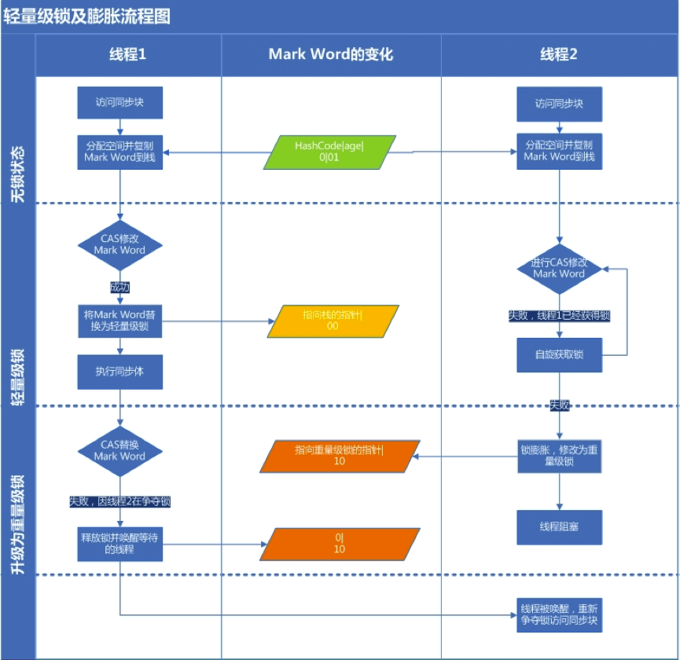
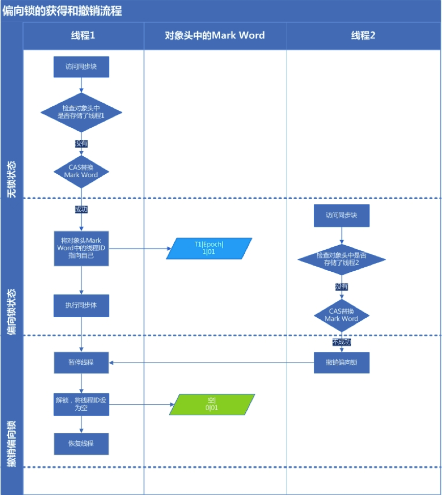

## ［聊聊并发］深入分析Synchronized的实现原理 - ref ATA

- 锁的对象

  - 同步方法：当前实例对象
  - 静态同步方法： 当前实例对象的class对象
  - 同步代码块： synchronized括号里的对象

- JVM指令

  - 方法同步： JVM规范里没有详细说明，可以用monitorenter/monitorexit（实际好像不是）

  - 代码块同步：monitorenter/monitorexit

    > jvm会保证该指令成对出现（class校验时吧？）

- 锁的”位置“

  - java对象头

  - 长度： 普通对象为2字宽、数组对象为3字宽，额外一个字宽存放了数组长度

  - 结构

    - 1字宽 - mark word

      > 存储对象的hashCode或锁信息等

    - 1字宽 - class metadata address

      > 存储到对象类型数据的指针

    - 1字段（仅数组） - 数组长度

  - mark word结构

    - hash code
    - 年龄代
    - 锁标记

  - 32bit JVM中mark word结构

    - 25bit - hashcode
    - 4bit - 对象分代年龄
    - 1bit - 是否偏向锁
    - 2bit - 锁标志位

  - 64bit JVM中mark word结构

    - 无锁
      - 25bit - unused
      - 32bit - hashcode
      - 1bit - cms_free
      - 4bit - 分代年龄
      - 1bit - 偏向锁 - 0
      - 2bit - 锁标志位 - 01
    - 偏向锁
      - 25bit + 31bit - ThreadID(54bit) Epoch(2bit)
      - 1bit - cms_free
      - 4bit - 分代年龄
      - 1bit - 偏向锁 - 1
      - 2bit - 锁标志位 - 01

  - mark word（32bit）锁标志变化

    - 轻量级
      - 30bit - 指向栈中锁记录的指针
      - 2bit - 锁标志位 - 00
    - 重量级
      - 30bit - 指向互斥量（重量级锁）的指针
      - 2bit - 锁标志位 - 10
    - GC标志
      - 30bit - 空 
      - 2bit - 锁标志位 - 11
    - 偏向锁
      - 23bit - 线程ID
      - 2bit - epoch
      - 4bit - 对象分代年龄
      - 1bit - 是否是偏向锁 - 1
      - 2bit - 锁标志位 - 01

- 锁类型（只从”量级“维度）

  - 重量锁
  - 轻量锁
  - 偏向锁

  > 后面两个1.6引入

- 锁的状态（1.6）

  - 无锁状态
  - 偏向锁状态
  - 轻量级锁状态
  - 重量级锁状态

- 锁升级

  > 锁可以升级但不能降级，意味着偏向锁升级成轻量级锁后不能降级成偏向锁。这种锁升级却不能降级的策略，目的是为了提高获得锁和释放锁的效率

  

- 轻量锁

  

- 偏向锁

  

| 长度       | 内容                     | 说明                  |
| -------- | ---------------------- | ------------------- |
| 32/64bit | Mark Word              | 存储对象的hashCode或锁信息等。 |
| 32/64bit | Class Metadata Address | 存储到对象类型数据的指针        |
| 32/64bit | Array length           | 数组的长度（如果当前对象是数组）    |


| 25 bit | 4bit        | 1bit是否是偏向锁 | 2bit锁标志位 |      |
| ------ | ----------- | ---------- | -------- | ---- |
| 无锁状态   | 对象的hashCode | 对象分代年龄     | 0        | 01   |


文中一个表讲**在运行期间Mark Word里存储的数据会随着锁标志位的变化而变化。Mark Word可能变化为存储以下4种数据**不过markdown不支持这个结构。参见原文。


| 锁    | 出发点                       | 原理                                       | 优点                                | 缺点                       | 适用场景               |
| ---- | ------------------------- | ---------------------------------------- | --------------------------------- | ------------------------ | ------------------ |
| 偏向锁  | 低竞争（无竞争）场景下，减少加解锁的CAS操作开销 | 首先会有”检查“偏向的过程，而CAS成功后会设置偏向以便于后面重入/释放，失败则撤销偏向.. | 加锁和解锁不需要额外的消耗，和执行非同步方法比仅存在纳秒级的差距。 | 如果线程间存在锁竞争，会带来额外的锁撤销的消耗。 | 适用于只有一个线程访问同步块场景。  |
| 轻量级锁 | CAS方式减少wait-notify开销      | 栈帧里放锁记录，copy（锁）对象头；锁对象头里放指针指向栈帧锁记录。 CAS方式完成，失败则膨胀为（wait for）重量锁，而成功者释放时会遇到CAS失败从而要唤醒... | 竞争的线程不会阻塞，提高了程序的响应速度。             | 如果始终得不到锁竞争的线程使用自旋会消耗CPU。 | 追求响应时间。同步块执行速度非常快。 |
| 重量级锁 | ...                       | 锁对象头里放指向互斥量的指针...                        | 线程竞争不使用自旋，不会消耗CPU。                | 线程阻塞，响应时间缓慢。             | 追求吞吐量。同步块执行速度较长。   |


TODO 还有一些细节从文中没过清楚，有时间再翻翻周的书...


## 浅析“锁” - ref ATA

```
谢谢分享。 全面、表述到位。 赞。
```

- 序言

- 定义

- 类型

- 线程同步锁

  - 常见分类
    - 对象锁和类锁
    - 公平锁和非公平锁
    - 自旋锁和互斥锁
    - 偏向锁、轻量级锁和对象监视器锁
  - 常用实践
    - synchronized
    - volatile
    - atomic, JUC

- 数据库锁

  - 常见分类
    - 类型
      - 共享锁
      - 排它锁
      - 更新锁
      - 意向锁
    - 功能
      - 行级锁 - 一种排它锁
      - 页级锁
      - 表级锁
    - 悲观锁/乐观锁
  - 数据库隔离机制
    - 事务
      - A - 原子性
      - C - 一致性
      - I - 隔离性
      - D - 持久性

- 分布式锁

  - CAP - 最多2
  - 常牺牲强一致性来换取高可用，保证“最终一致性”
  - 常用实践
    - 基于DB
    - 基于缓存
    - 基于zk

- 加密功能“锁”

  > - 双向加密
  >   - 对称加密
  >   - 非对称加密
  > - 单向加密 - 不可逆加密，一般用于验证（完整性等）

  - 常用实践
    - http接口对称加密内容
    - http接口单向加密保证完整性

- 密码认证“锁”

  - 常用实践
    - 数字字符密码
    - 九宫格密码
    - 指纹识别
    - 语音识别
    - 人脸识别

- 二级保护“锁”

  > 为提高账户安全性，除密码外又加了一把“锁”

  - 常用实践
    - 开锁密码（失败多次锁定）
    - 安全邮箱
    - 密保卡
    - U盾

- 浏览器“锁”

  > 指浏览器的同源保护策略，是为了保证用户信息的安全，防止恶意的网站窃取数据，也是一种安全领域的“锁”。
  >
  > 所谓"同源"指的是"三个相同"，协议相同，域名相同，端口相同。