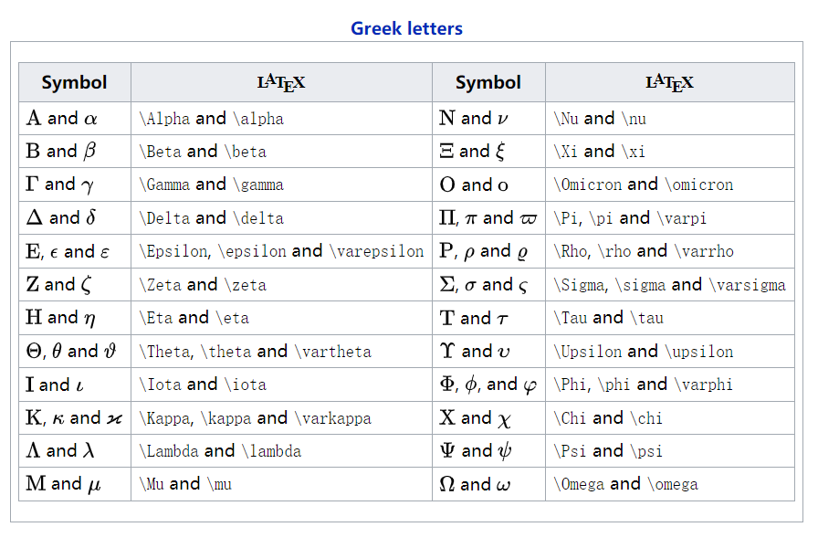
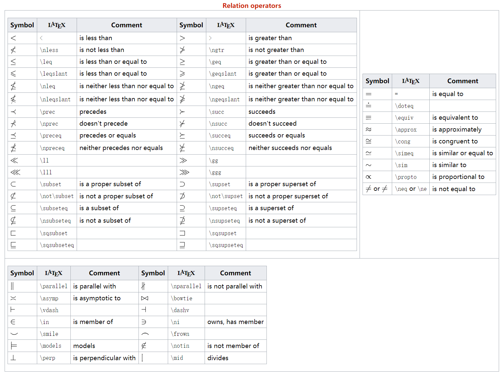
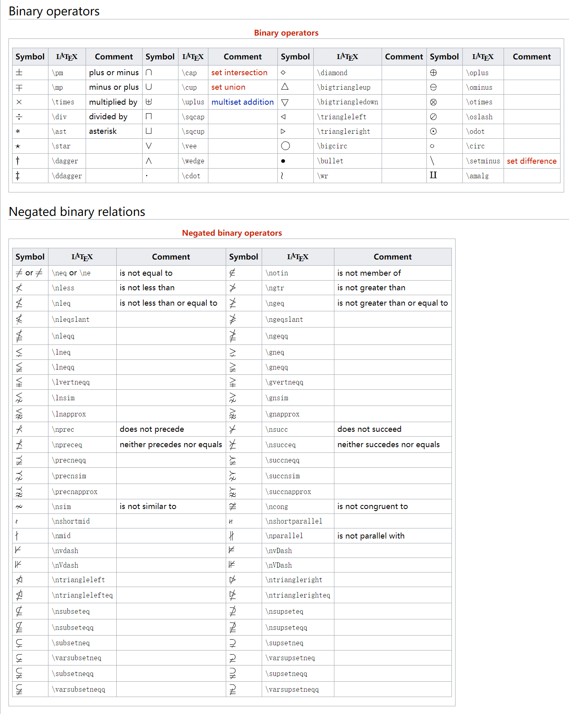
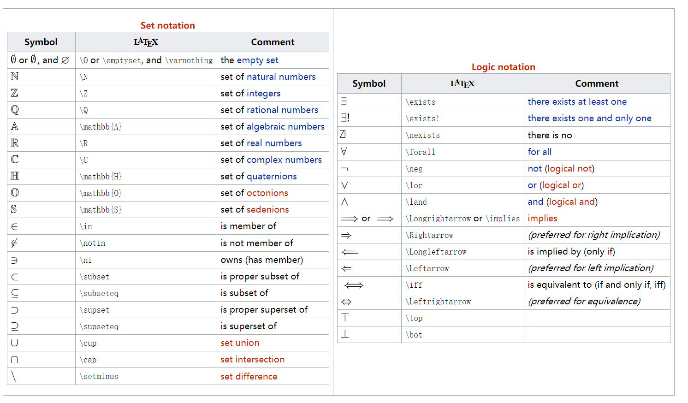
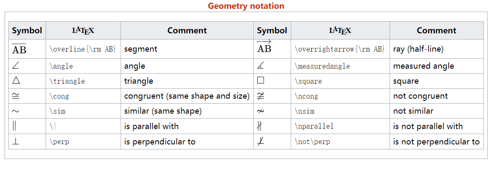
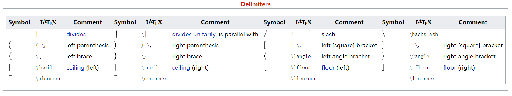
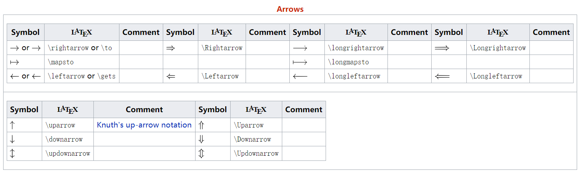
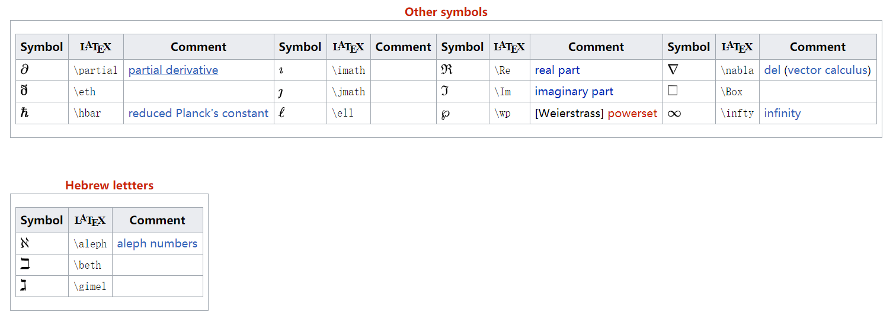
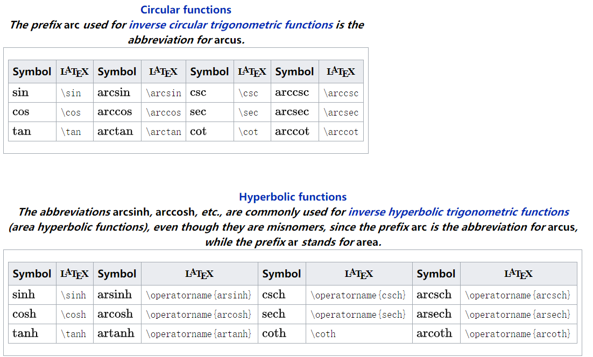

http://latex.codecogs.com/eqneditor/editor.php

在线的。。。


### Math Blocks

https://docs.mathjax.org/en/v2.7-latest/start.html


You can render *LaTeX* mathematical expressions using **MathJax**.

To add a mathematical expression, input `$$` and press the 'Return' key. This will trigger an input field which accepts *Tex/LaTex* source. For example:


$$
\mathbf{V}_1 \times \mathbf{V}_2 =  \begin{vmatrix}\mathbf{i} & \mathbf{j} & \mathbf{k} \\\frac{\partial X}{\partial u} &  \frac{\partial Y}{\partial u} & 0 \\\frac{\partial X}{\partial v} &  \frac{\partial Y}{\partial v} & 0 \\\end{vmatrix}
$$


In the markdown source file, the math block is a *LaTeX* expression wrapped by a pair of ‘$$’ marks:

``` markdown
$$
\mathbf{V}_1 \times \mathbf{V}_2 =  \begin{vmatrix}
\mathbf{i} & \mathbf{j} & \mathbf{k} \\
\frac{\partial X}{\partial u} &  \frac{\partial Y}{\partial u} & 0 \\
\frac{\partial X}{\partial v} &  \frac{\partial Y}{\partial v} & 0 \\
\end{vmatrix}
$$
```

You can find more details [here](http://support.typora.io/Math/).


#### [mathjax symbols](https://docs.mathjax.org/en/v2.7-latest/tex.html#symbols)

```
#
%
&
^
_
{
}
~
'

\   (backslash-space)
\!
\#
\$
\%
\&
\,
\:
\;
\>
\\
\_
\{
\|
\}
```


##### A

```
\AA                     mediawiki-texvc
\above
\abovewithdelims
\acute
\alef                   mediawiki-texvc
\aleph
\alpha
\Alpha                  mediawiki-texvc
\amalg
\And
\and                    mediawiki-texvc
\ang                    mediawiki-texvc
\angle
\approx
\approxeq               AMSsymbols
\arccos
\arcsin
\arctan
\arg
\array
\Arrowvert
\arrowvert
\ast
\asymp
\atop
\atopwithdelims
```

##### B

```
\backepsilon            AMSsymbols
\backprime              AMSsymbols
\backsim                AMSsymbols
\backsimeq              AMSsymbols
\backslash
\bar
\barwedge               AMSsymbols
\Bbb
\Bbb                    mediawiki-texvc
\Bbbk                   AMSsymbols
\bbox                  [bbox]
\bcancel                cancel
\because                AMSsymbols
\begin
\begingroup             begingroup      non-standard
\beta
\Beta                   mediawiki-texvc
\beth                   AMSsymbols
\between                AMSsymbols
\bf
\Big
\big
\bigcap
\bigcirc
\bigcup
\Bigg
\bigg
\Biggl
\biggl
\Biggm
\biggm
\Biggr
\biggr
\Bigl
\bigl
\Bigm
\bigm
\bigodot
\bigoplus
\bigotimes
\Bigr
\bigr
\bigsqcup
\bigstar                AMSsymbols
\bigtriangledown
\bigtriangleup
\biguplus
\bigvee
\bigwedge
\binom                  AMSmath
\blacklozenge           AMSsymbols
\blacksquare            AMSsymbols
\blacktriangle          AMSsymbols
\blacktriangledown      AMSsymbols
\blacktriangleleft      AMSsymbols
\blacktriangleright     AMSsymbols
\bmod
\bold                   mediawiki-texvc
\boldsymbol            [boldsymbol]
\bot
\bowtie
\Box                    AMSsymbols
\boxdot                 AMSsymbols
\boxed                  AMSmath
\boxminus               AMSsymbols
\boxplus                AMSsymbols
\boxtimes               AMSsymbols
\brace
\bracevert
\brack
\breve
\buildrel
\bull                   mediawiki-texvc
\bullet
\Bumpeq                 AMSsymbols
\bumpeq                 AMSsymbols
```

##### C

```
\C                      mediawiki-texvc
\cal
\cancel                 cancel
\cancelto               cancel
\cap
\Cap                    AMSsymbols
\cases
\cdot
\cdotp
\cdots
\ce                     mhchem
\cee                    mhchem
\centerdot              AMSsymbols
\cf                     mhchem
\cfrac                  AMSmath
\check
\checkmark              AMSsymbols
\chi
\Chi                    mediawiki-texvc
\choose
\circ
\circeq                 AMSsymbols
\circlearrowleft        AMSsymbols
\circlearrowright       AMSsymbols
\circledast             AMSsymbols
\circledcirc            AMSsymbols
\circleddash            AMSsymbols
\circledR               AMSsymbols
\circledS               AMSsymbols
\class                 [HTML]           non-standard
\clubs                  mediawiki-texvc
\clubsuit
\cnums                  mediawiki-texvc
\colon
\color                  color
\colorbox               color
\complement             AMSsymbols
\Complex                mediawiki-texvc
\cong
\coppa                  mediawiki-texvc
\Coppa                  mediawiki-texvc
\coprod
\cos
\cosh
\cot
\coth
\cr
\csc
\cssId                 [HTML]           non-standard
\cup
\Cup                    AMSsymbols
\curlyeqprec            AMSsymbols
\curlyeqsucc            AMSsymbols
\curlyvee               AMSsymbols
\curlywedge             AMSsymbols
\curvearrowleft         AMSsymbols
\curvearrowright        AMSsymbols
```

##### D

```
\dagger
\Dagger                 mediawiki-texvc
\daleth                 AMSsymbols
\Darr                   mediawiki-texvc
\dashleftarrow          AMSsymbols
\dashrightarrow         AMSsymbols
\dashv
\dbinom                 AMSmath
\ddagger
\ddddot                 AMSmath
\dddot                  AMSmath
\ddot
\ddots
\DeclareMathOperator    AMSmath
\definecolor            color
\def                   [newcommand]
\deg
\Delta
\delta
\det
\dfrac                  AMSmath
\diagdown               AMSsymbols
\diagup                 AMSsymbols
\diamond
\Diamond                AMSsymbols
\diamonds               mediawiki-texvc
\diamondsuit
\digamma                AMSsymbols
\Digamma                mediawiki-texvc
\dim
\displaylines
\displaystyle
\div
\divideontimes          AMSsymbols
\dot
\doteq
\Doteq                  AMSsymbols
\doteqdot               AMSsymbols
\dotplus                AMSsymbols
\dots
\dotsb
\dotsc
\dotsi
\dotsm
\dotso
\doublebarwedge         AMSsymbols
\doublecap              AMSsymbols
\doublecup              AMSsymbols
\Downarrow
\downarrow
\downdownarrows         AMSsymbols
\downharpoonleft        AMSsymbols
\downharpoonright       AMSsymbols
```

##### E

```
\ell
\empty                  mediawiki-texvc
\emptyset
\enclose                enclose         non-standard
\end
\endgroup               begingroup      non-standard
\enspace
\epsilon
\Epsilon                mediawiki-texvc
\eqalign
\eqalignno
\eqcirc                 AMSsymbols
\eqref                 [AMSmath]
\eqsim                  AMSsymbols
\eqslantgtr             AMSsymbols
\eqslantless            AMSsymbols
\equiv
\eta
\Eta                    mediawiki-texvc
\eth                    AMSsymbols
\euro                   mediawiki-texvc
\exist                  mediawiki-texvc
\exists
\exp
```

##### F

```
\fallingdotseq          AMSsymbols
\fbox
\fcolorbox              color
\Finv                   AMSsymbols
\flat
\forall
\frac                   AMSmath
\frak
\frown
```

##### G

```
\Game                   AMSsymbols
\Gamma
\gamma
\gcd
\gdef                   begingroup
\ge
\geneuro                mediawiki-texvc
\geneuronarrow          mediawiki-texvc
\geneurowide            mediawiki-texvc
\genfrac                AMSmath
\geq
\geqq                   AMSsymbols
\geqslant               AMSsymbols
\gets
\gg
\ggg                    AMSsymbols
\gggtr                  AMSsymbols
\gimel                  AMSsymbols
\global                 begingroup
\gnapprox               AMSsymbols
\gneq                   AMSsymbols
\gneqq                  AMSsymbols
\gnsim                  AMSsymbols
\grave
\gt
\gtrapprox              AMSsymbols
\gtrdot                 AMSsymbols
\gtreqless              AMSsymbols
\gtreqqless             AMSsymbols
\gtrless                AMSsymbols
\gtrsim                 AMSsymbols
\gvertneqq              AMSsymbols
```

##### H

```
\H                      mediawiki-texvc
\hAar                   mediawiki-texvc
\harr                   mediawiki-texvc
\Harr                   mediawiki-texvc
\hat
\hbar
\hbox
\hdashline
\hearts                 mediawiki-texvc
\heartsuit
\hline
\hom
\hookleftarrow
\hookrightarrow
\hphantom
\href                  [HTML]
\hskip
\hslash                 AMSsymbols
\hspace
\Huge
\huge
```

##### I

```
\idotsint               AMSmath
\iff
\iiiint                 AMSmath
\iiint
\iint
\Im
\image                  mediawiki-texvc
\imath
\impliedby              AMSsymbols
\implies                AMSsymbols
\in
\inf
\infin                  mediawiki-texvc
\infty
\injlim                 AMSmath
\int
\intercal               AMSsymbols
\intop
\iota
\Iota                   mediawiki-texvc
\isin                   mediawiki-texvc
\it
```

##### J

```
\jmath
\Join                   AMSsymbols
```

##### K

```
\kappa
\Kappa                  mediawiki-texvc
\ker
\kern
\koppa                  mediawiki-texvc
\Koppa                  mediawiki-texvc
```

##### L

```
\label                 [AMSmath]
\Lambda
\lambda
\land
\lang                   mediawiki-texvc
\langle
\LARGE
\Large
\large
\larr                   mediawiki-texvc
\Larr                   mediawiki-texvc
\lArr                   mediawiki-texvc
\LaTeX
\lbrace
\lbrack
\lceil
\ldotp
\ldots
\le
\leadsto                AMSsymbols
\left
\Leftarrow
\leftarrow
\leftarrowtail          AMSsymbols
\leftharpoondown
\leftharpoonup
\leftleftarrows         AMSsymbols
\Leftrightarrow
\leftrightarrow
\leftrightarrows        AMSsymbols
\leftrightharpoons      AMSsymbols
\leftrightsquigarrow    AMSsymbols
\leftroot
\leftthreetimes         AMSsymbols
\leq
\leqalignno
\leqq                   AMSsymbols
\leqslant               AMSsymbols
\lessapprox             AMSsymbols
\lessdot                AMSsymbols
\lesseqgtr              AMSsymbols
\lesseqqgtr             AMSsymbols
\lessgtr                AMSsymbols
\lesssim                AMSsymbols
\let                   [newcommand]
\lfloor
\lg
\lgroup
\lhd                    AMSsymbols
\lim
\liminf
\limits
\limsup
\ll
\llap
\llcorner               AMSsymbols
\Lleftarrow             AMSsymbols
\lll                    AMSsymbols
\llless                 AMSsymbols
\lmoustache
\ln
\lnapprox               AMSsymbols
\lneq                   AMSsymbols
\lneqq                  AMSsymbols
\lnot
\lnsim                  AMSsymbols
\log
\Longleftarrow
\longleftarrow
\Longleftrightarrow
\longleftrightarrow
\longmapsto
\Longrightarrow
\longrightarrow
\looparrowleft          AMSsymbols
\looparrowright         AMSsymbols
\lor
\lower
\lozenge                AMSsymbols
\lrarr                  mediawiki-texvc
\Lrarr                  mediawiki-texvc
\lrArr                  mediawiki-texvc
\lrcorner               AMSsymbols
\Lsh                    AMSsymbols
\lt
\ltimes                 AMSsymbols
\lVert                  AMSmath
\lvert                  AMSmath
\lvertneqq              AMSsymbols
```

##### M

```
\maltese                AMSsymbols
\mapsto
\mathbb
\mathbf
\mathbin
\mathcal
\mathchoice            [mathchoice]
\mathclose
\mathfrak
\mathinner
\mathit
\mathop
\mathopen
\mathord
\mathpunct
\mathrel
\mathring               AMSmath
\mathrm
\mathscr
\mathsf
\mathstrut
\mathtip                action          non-standard
\mathtt
\matrix
\max
\mbox
\measuredangle          AMSsymbols
\mho                    AMSsymbols
\mid
\middle
\min
\mit
\mkern
\mmlToken                               non-standard
\mod
\models
\moveleft
\moveright
\mp
\mskip
\mspace
\mu
\Mu                     mediawiki-texvc
\multimap               AMSsymbols
```

##### N

```
\N                      mediawiki-texvc
\nabla
\natural
\natnums                mediawiki-texvc
\ncong                  AMSsymbols
\ne
\nearrow
\neg
\negmedspace            AMSmath
\negthickspace          AMSmath
\negthinspace
\neq
\newcommand            [newcommand]
\newenvironment        [newcommand]
\Newextarrow            extpfeil
\newline
\nexists                AMSsymbols
\ngeq                   AMSsymbols
\ngeqq                  AMSsymbols
\ngeqslant              AMSsymbols
\ngtr                   AMSsymbols
\ni
\nLeftarrow             AMSsymbols
\nleftarrow             AMSsymbols
\nLeftrightarrow        AMSsymbols
\nleftrightarrow        AMSsymbols
\nleq                   AMSsymbols
\nleqq                  AMSsymbols
\nleqslant              AMSsymbols
\nless                  AMSsymbols
\nmid                   AMSsymbols
\nobreakspace           AMSmath
\nolimits
\normalsize
\not
\notag                 [AMSmath]
\notin
\nparallel              AMSsymbols
\nprec                  AMSsymbols
\npreceq                AMSsymbols
\nRightarrow            AMSsymbols
\nrightarrow            AMSsymbols
\nshortmid              AMSsymbols
\nshortparallel         AMSsymbols
\nsim                   AMSsymbols
\nsubseteq              AMSsymbols
\nsubseteqq             AMSsymbols
\nsucc                  AMSsymbols
\nsucceq                AMSsymbols
\nsupseteq              AMSsymbols
\nsupseteqq             AMSsymbols
\ntriangleleft          AMSsymbols
\ntrianglelefteq        AMSsymbols
\ntriangleright         AMSsymbols
\ntrianglerighteq       AMSsymbols
\nu
\Nu                     mediawiki-texvc
\nVDash                 AMSsymbols
\nVdash                 AMSsymbols
\nvDash                 AMSsymbols
\nvdash                 AMSsymbols
\nwarrow
```

##### O

```
\O                      mediawiki-texvc
\odot
\officialeuro           mediawiki-texvc
\oint
\oldstyle
\Omega
\omega
\omicron
\Omicron                mediawiki-texvc
\ominus
\operatorname           AMSmath
\oplus
\or                     mediawiki-texvc
\oslash
\otimes
\over
\overbrace
\overleftarrow
\overleftrightarrow
\overline
\overrightarrow
\overset
\overwithdelims
\owns
```

##### P

```
\P                      mediawiki-texvc
\pagecolor              mediawiki-texvc
\parallel
\part                   mediawiki-texvc
\partial
\perp
\phantom
\Phi
\phi
\Pi
\pi
\pitchfork              AMSsymbols
\plusmn                 mediawiki-texvc
\pm
\pmatrix
\pmb
\pmod
\pod
\Pr
\prec
\precapprox             AMSsymbols
\preccurlyeq            AMSsymbols
\preceq
\precnapprox            AMSsymbols
\precneqq               AMSsymbols
\precnsim               AMSsymbols
\precsim                AMSsymbols
\prime
\prod
\projlim                AMSmath
\propto
\Psi
\psi
```

##### Q

```
\Q                      mediawiki-texvc
\qquad
\quad
```

##### R

```
\R                      mediawiki-texvc
\raise
\rang                   mediawiki-texvc
\rangle
\rarr                   mediawiki-texvc
\Rarr                   mediawiki-texvc
\rArr                   mediawiki-texvc
\rbrace
\rbrack
\rceil
\Re
\real                   mediawiki-texvc
\reals                  mediawiki-texvc
\Reals                  mediawiki-texvc
\ref                   [AMSmath]
\renewcommand          [newcommand]
\renewenvironment      [newcommand]
\require                               non-standard
\restriction            AMSsymbols
\rfloor
\rgroup
\rhd                    AMSsymbols
\rho
\Rho                    mediawiki-texvc
\right
\Rightarrow
\rightarrow
\rightarrowtail         AMSsymbols
\rightharpoondown
\rightharpoonup
\rightleftarrows        AMSsymbols
\rightleftharpoons
\rightleftharpoons      AMSsymbols
\rightrightarrows       AMSsymbols
\rightsquigarrow        AMSsymbols
\rightthreetimes        AMSsymbols
\risingdotseq           AMSsymbols
\rlap
\rm
\rmoustache
\root
\Rrightarrow            AMSsymbols
\Rsh                    AMSsymbols
\rtimes                 AMSsymbols
\Rule                                  non-standard
\rVert                  AMSmath
\rvert                  AMSmath
```

##### S

```
\S
\sampi                  mediawiki-texvc
\Sampi                  mediawiki-texvc
\scr
\scriptscriptstyle
\scriptsize
\scriptstyle
\sdot                   mediawiki-texvc
\searrow
\sect                   mediawiki-texvc
\sec
\setminus
\sf
\sharp
\shortmid               AMSsymbols
\shortparallel          AMSsymbols
\shoveleft              AMSmath
\shoveright             AMSmath
\sideset                AMSmath
\Sigma
\sigma
\sim
\simeq
\sin
\sinh
\skew
\small
\smallfrown             AMSsymbols
\smallint
\smallsetminus          AMSsymbols
\smallsmile             AMSsymbols
\smash
\smile
\spades                 mediawiki-texvc
\Space                                 non-standard
\space
\spadesuit
\sphericalangle         AMSsymbols
\sqcap
\sqcup
\sqrt
\sqsubset               AMSsymbols
\sqsubseteq
\sqsupset               AMSsymbols
\sqsupseteq
\square                 AMSsymbols
\stackrel
\star
\stigma                 mediawiki-texvc
\Stigma                 mediawiki-texvc
\strut
\style                 [HTML]          non-stanard
\sub                    mediawiki-texvc
\sube                   mediawiki-texvc
\subset
\Subset                 AMSsymbols
\subseteq
\subseteqq              AMSsymbols
\subsetneq              AMSsymbols
\subsetneqq             AMSsymbols
\substack               AMSmath
\succ
\succapprox             AMSsymbols
\succcurlyeq            AMSsymbols
\succeq
\succnapprox            AMSsymbols
\succneqq               AMSsymbols
\succnsim               AMSsymbols
\succsim                AMSsymbols
\sum
\sup
\supe                   mediawiki-texvc
\supset
\Supset                 AMSsymbols
\supseteq
\supseteqq              AMSsymbols
\supsetneq              AMSsymbols
\supsetneqq             AMSsymbols
\surd
\swarrow
```

##### T

```
\tag                   [AMSmath]
\tan
\tanh
\tau
\Tau                    mediawiki-texvc
\tbinom                 AMSmath
\TeX
\text
\textbf
\textit
\textrm
\textsf
\textstyle
\texttt
\texttip                action         non-standard
\textvisiblespace       mediawiki-texvc
\tfrac                  AMSmath
\therefore              AMSsymbols
\Theta
\theta
\thetasym               mediawiki-texvc
\thickapprox            AMSsymbols
\thicksim               AMSsymbols
\thinspace
\tilde
\times
\tiny
\Tiny                                  non-standard
\to
\toggle                 action         non-standard
\top
\triangle
\triangledown           AMSsymbols
\triangleleft
\trianglelefteq         AMSsymbols
\triangleq              AMSsymbols
\triangleright
\trianglerighteq        AMSsymbols
\tt
\twoheadleftarrow       AMSsymbols
\twoheadrightarrow      AMSsymbols
```

##### U

```
\uarr                   mediawiki-texvc
\uArr                   mediawiki-texvc
\Uarr                   mediawiki-texvc
\ulcorner               AMSsymbols
\underbrace
\underleftarrow
\underleftrightarrow
\underline
\underrightarrow
\underset
\unicode               [unicode]       non-standard
\unlhd                  AMSsymbols
\unrhd                  AMSsymbols
\Uparrow
\uparrow
\Updownarrow
\updownarrow
\upharpoonleft          AMSsymbols
\upharpoonright         AMSsymbols
\uplus
\uproot
\Upsilon
\upsilon
\upuparrows             AMSsymbols
\urcorner               AMSsymbols
```

##### V

```
\varcoppa               mediawiki-texvc
\varDelta               AMSsymbols
\varepsilon
\varGamma               AMSsymbols
\varinjlim              AMSmath
\varkappa               AMSsymbols
\varLambda              AMSsymbols
\varliminf              AMSmath
\varlimsup              AMSmath
\varnothing             AMSsymbols
\varOmega               AMSsymbols
\varphi
\varPhi                 AMSsymbols
\varpi
\varPi                  AMSsymbols
\varprojlim             AMSmath
\varpropto              AMSsymbols
\varPsi                 AMSsymbols
\varrho
\varsigma
\varSigma               AMSsymbols
\varstigma              mediawiki-texvc
\varsubsetneq           AMSsymbols
\varsubsetneqq          AMSsymbols
\varsupsetneq           AMSsymbols
\varsupsetneqq          AMSsymbols
\vartheta
\varTheta               AMSsymbols
\vartriangle            AMSsymbols
\vartriangleleft        AMSsymbols
\vartriangleright       AMSsymbols
\varUpsilon             AMSsymbols
\varXi                  AMSsymbols
\vcenter
\vdash
\Vdash                  AMSsymbols
\vDash                  AMSsymbols
\vdots
\vec
\vee
\veebar                 AMSsymbols
\verb                  [verb]
\Vert
\vert
\vline                  mediawiki-texvc
\vphantom
\Vvdash                 AMSsymbols
```

##### W

```
\wedge
\weierp                 mediawiki-texvc
\widehat
\widetilde
\wp
\wr
```

##### X

```
\Xi
\xi
\xcancel                cancel
\xleftarrow             AMSmath
\xlongequal             extpfeil
\xmapsto                extpfeil
\xrightarrow            AMSmath
\xtofrom                extpfeil
\xtwoheadleftarrow      extpfeil
\xtwoheadrightarrow     extpfeil
```

##### Y

```
\yen                    AMSsymbols
```

##### Z

```
\Z                      mediawiki-texvc
\zeta
\Zeta                   mediawiki-texvc
```


#### 特殊数学符号


https://oeis.org/wiki/List_of_LaTeX_mathematical_symbols


* 求和： $\sum$
  $$
  \sum_{i=1}^n
  $$

* 求积： $\prod$
  $$
  \prod_{i=1}^n
  $$

* 阶乘： `n!` 呃太丑了 

  markdown或者说typora支持的这个math，似乎没有阶乘

  latex中表达如下
  $$
  \documentclass[12pt]{article}
  \usepackage{cool}
  \begin{document}
  $\Factorial{n}$
  \end{document}
  $$
  
* 希腊符号

  

* 关系操作符

  

  

* 二元操作符

  

* 集合、逻辑符号

  

* 几何符号

  

* 分隔符号

  

* 箭头符号

  

* 其他符号

  

* 三角函数

  


#### examples


* $$
<<<<<<< HEAD
  Z_{ij}=\sum_{k=1}^{10} X_{ik} * Y_{kj}
=======
  Z_{ij}=\sum_{k=1}^{10} X_{ik} * Y_{kj} * 2^{n+1}
>>>>>>> 1122cdc (re-init 20240121)
  $$

* $$
  c[i]=\underset{j=1}{\overset{n}{arg}}
  $$

* 


# 设置


## inline match 同行公式


需要单独开启，因为可能干扰正常的非数学公式内容的显示