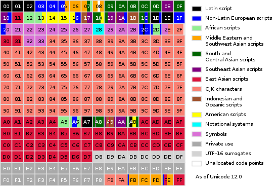

## Unicode字符平面映射


当前的[Unicode](https://zh.wikipedia.org/wiki/Unicode)字符分为17组编排，每组称为**平面**（Plane），而每平面拥有65536（即216）个代码点。然而当前只用了少数平面。

字母和数字符号

|        平面         |     始末字符值      |                           中文名称                           |                     英文名称                     |
| :-----------------: | :-----------------: | :----------------------------------------------------------: | :----------------------------------------------: |
|       0号平面       |   U+0000 - U+FFFF   |                      **基本多文种平面**                      |      Basic Multilingual Plane，简称**BMP**       |
|       1号平面       |  U+10000 - U+1FFFF  |                      **多文种补充平面**                      |  Supplementary Multilingual Plane，简称**SMP**   |
|       2号平面       |  U+20000 - U+2FFFF  |                     **表意文字补充平面**                     |   Supplementary Ideographic Plane，简称**SIP**   |
|       3号平面       |  U+30000 - U+3FFFF  | **表意文字第三平面**（未正式使用[[1\]](https://zh.wikipedia.org/wiki/Unicode字符平面映射#cite_note-1)） |     Tertiary Ideographic Plane，简称**TIP**      |
| 4号平面 至 13号平面 |  U+40000 - U+DFFFF  |                         （尚未使用）                         |                                                  |
|      14号平面       |  U+E0000 - U+EFFFF  |                     **特别用途补充平面**                     | Supplementary Special-purpose Plane，简称**SSP** |
|      15号平面       |  U+F0000 - U+FFFFF  | 保留作为**私人使用区（A区）**[[2\]](https://zh.wikipedia.org/wiki/Unicode字符平面映射#cite_note-PUA-2) |        Private Use Area-A，简称**PUA-A**         |
|      16号平面       | U+100000 - U+10FFFF | 保留作为**私人使用区（B区）**[[2\]](https://zh.wikipedia.org/wiki/Unicode字符平面映射#cite_note-PUA-2) |        Private Use Area-B，简称**PUA-B**         |


### BMP





**基本多文种平面**（Basic Multilingual Plane, BMP），或称**第0平面**或**0号平面**（Plane 0），是[Unicode](https://zh.wikipedia.org/wiki/Unicode)中的一个编码区块。编码从U+0000至U+FFFF。

现版本为修订12.1.0版，2019年5月7日出版。已分配编码区块为：

|                           编码范围                           |                           中文名称                           |                    英语名称                    |
| :----------------------------------------------------------: | :----------------------------------------------------------: | :--------------------------------------------: |
|                          0000-007F                           |     基本[拉丁文](https://zh.wikipedia.org/wiki/拉丁字母)     |                  Basic Latin                   |
|                          0080-00FF                           | [拉丁文-1补充](https://zh.wikipedia.org/w/index.php?title=拉丁文-1补充&action=edit&redlink=1) |               Latin-1 Supplement               |
|                          0100-017F                           | [拉丁文扩展-A](https://zh.wikipedia.org/w/index.php?title=拉丁文扩展-A&action=edit&redlink=1) |                Latin Extended-A                |
|                          0180-024F                           | [拉丁文扩展-B](https://zh.wikipedia.org/w/index.php?title=拉丁文扩展-B&action=edit&redlink=1) |                Latin Extended-B                |
|                          0250-02AF                           |    [国际音标](https://zh.wikipedia.org/wiki/国际音标)扩展    |                 IPA Extensions                 |
|                          02B0-02FF                           | [占位修饰符号](https://zh.wikipedia.org/w/index.php?title=占位修饰符号&action=edit&redlink=1) |            Spacing Modifier Letters            |
|                          0300-036F                           |  [结合附加符号](https://zh.wikipedia.org/wiki/結合附加符號)  |           Combining Diacritics Marks           |
|                          0370-03FF                           | [希腊字母](https://zh.wikipedia.org/wiki/希腊字母)及[科普特字母](https://zh.wikipedia.org/wiki/科普特字母) |                Greek and Coptic                |
|                          0400-04FF                           |    [西里尔字母](https://zh.wikipedia.org/wiki/西里尔字母)    |                    Cyrillic                    |
|                          0500-052F                           |                        西里尔字母补充                        |              Cyrillic Supplement               |
|                          0530-058F                           |  [亚美尼亚字母](https://zh.wikipedia.org/wiki/亚美尼亚字母)  |                    Armenian                    |
|                          0590-05FF                           |      [希伯来文](https://zh.wikipedia.org/wiki/希伯来文)      |                     Hebrew                     |
|                          0600-06FF                           |      [阿拉伯文](https://zh.wikipedia.org/wiki/阿拉伯文)      |                     Arabic                     |
|                          0700-074F                           |      [叙利亚文](https://zh.wikipedia.org/wiki/叙利亚文)      |                     Syriac                     |
|                          0750-077F                           | [阿拉伯文补充](https://zh.wikipedia.org/w/index.php?title=阿拉伯文补充&action=edit&redlink=1) |               Arabic Supplement                |
|                          0780-07BF                           |      [它拿字母](https://zh.wikipedia.org/wiki/它拿字母)      |                     Thaana                     |
|                          07C0-07FF                           |  [西非书面文字](https://zh.wikipedia.org/wiki/西非書面文字)  |                      N'Ko                      |
|                          0800-083F                           | [撒玛利亚字母](https://zh.wikipedia.org/w/index.php?title=撒玛利亚字母&action=edit&redlink=1) |                   Samaritan                    |
|                          0840-085F                           | [曼达文字](https://zh.wikipedia.org/w/index.php?title=曼达文字&action=edit&redlink=1) |                    Mandaic                     |
|                          0860-086F                           |                         叙利亚文补充                         |               Syriac Supplement                |
|                          08A0-08FF                           |                        阿拉伯文扩展-A                        |               Arabic Extended-A                |
|                          0900-097F                           |        [天城文](https://zh.wikipedia.org/wiki/天城文)        |                   Devanagari                   |
|                          0980-09FF                           |      [孟加拉文](https://zh.wikipedia.org/wiki/孟加拉文)      |                    Bengali                     |
|                          0A00-0A7F                           |      [古木基文](https://zh.wikipedia.org/wiki/古木基文)      |                    Gurmukhi                    |
|                          0A80-0AFF                           |    [古吉拉特文](https://zh.wikipedia.org/wiki/古吉拉特文)    |                    Gujarati                    |
|                          0B00-0B7F                           |      [奥里亚文](https://zh.wikipedia.org/wiki/奧里亞文)      |                     Oriya                      |
|                          0B80-0BFF                           |      [泰米尔文](https://zh.wikipedia.org/wiki/泰米爾文)      |                     Tamil                      |
|                          0C00-0C7F                           |      [泰卢固文](https://zh.wikipedia.org/wiki/泰卢固文)      |                     Telugu                     |
|                          0C80-0CFF                           |      [卡纳达文](https://zh.wikipedia.org/wiki/卡納達文)      |                    Kannada                     |
|                          0D00-0D7F                           |  [马拉雅拉姆文](https://zh.wikipedia.org/wiki/馬拉雅拉姆文)  |                   Malayalam                    |
|                          0D80-0DFF                           |      [僧伽罗文](https://zh.wikipedia.org/wiki/僧伽罗文)      |                    Sinhala                     |
|                          0E00-0E7F                           |          [泰文](https://zh.wikipedia.org/wiki/泰文)          |                      Thai                      |
|                          0E80-0EFF                           |        [老挝文](https://zh.wikipedia.org/wiki/老挝文)        |                      Lao                       |
|                          0F00-0FFF                           |          [藏文](https://zh.wikipedia.org/wiki/藏文)          |                    Tibetan                     |
|                          1000-109F                           |        [缅甸文](https://zh.wikipedia.org/wiki/缅甸文)        |                    Myanmar                     |
|                          10A0-10FF                           |  [格鲁吉亚字母](https://zh.wikipedia.org/wiki/格鲁吉亚字母)  |                    Georgian                    |
|                          1100-11FF                           |        [谚文](https://zh.wikipedia.org/wiki/諺文)字母        |                  Hangul Jamo                   |
|                          1200-137F                           |      [吉兹字母](https://zh.wikipedia.org/wiki/吉茲字母)      |                    Ethiopic                    |
|                          1380-139F                           |                         吉兹字母补充                         |              Ethiopic Supplement               |
|                          13A0-13FF                           |     [切罗基字母](https://zh.wikipedia.org/wiki/切罗基语)     |                    Cherokee                    |
|                          1400-167F                           | 统一[加拿大原住民音节文字](https://zh.wikipedia.org/wiki/加拿大原住民音節文字) |     Unified Canadian Aboriginal Syllabics      |
|                          1680-169F                           |      [欧甘字母](https://zh.wikipedia.org/wiki/歐甘字母)      |                     Ogham                      |
|                          16A0-16FF                           |      [卢恩字母](https://zh.wikipedia.org/wiki/卢恩字母)      |                     Runic                      |
|                          1700-171F                           | [他加禄字母](https://zh.wikipedia.org/w/index.php?title=他加禄字母&action=edit&redlink=1) |                    Tagalog                     |
|                          1720-173F                           | [哈努诺文](https://zh.wikipedia.org/w/index.php?title=哈努诺文&action=edit&redlink=1) |                    Hanunóo                     |
|                          1740-175F                           |      [布希德文](https://zh.wikipedia.org/wiki/布希德文)      |                     Buhid                      |
|                          1760-177F                           | [塔格班瓦文](https://zh.wikipedia.org/w/index.php?title=塔格班瓦文&action=edit&redlink=1) |                    Tagbanwa                    |
|                          1780-17FF                           |        [高棉文](https://zh.wikipedia.org/wiki/高棉文)        |                     Khmer                      |
|                          1800-18AF                           |       [蒙古文](https://zh.wikipedia.org/wiki/蒙古字母)       |                   Mongolian                    |
|                          18B0-18FF                           | [加拿大原住民音节文字](https://zh.wikipedia.org/wiki/加拿大原住民音節文字)扩展 | Unified Canadian Aboriginal Syllabics Extended |
|                          1900-194F                           | [林布文](https://zh.wikipedia.org/w/index.php?title=林布文&action=edit&redlink=1) |                     Limbu                      |
|                          1950-197F                           |      [德宏傣文](https://zh.wikipedia.org/wiki/德宏傣文)      |                     Tai Le                     |
|                          1980-19DF                           |      [新傣仂文](https://zh.wikipedia.org/wiki/新傣仂文)      |                  New Tai Lue                   |
|                          19E0-19FF                           |                          高棉文符号                          |                 Khmer Symbols                  |
|                          1A00-1A1F                           | [布吉文](https://zh.wikipedia.org/w/index.php?title=布吉文&action=edit&redlink=1) |                    Buginese                    |
|                          1A20-1AAF                           |        [老傣文](https://zh.wikipedia.org/wiki/老傣文)        |                    Tai Tham                    |
|                          1AB0-1AFF                           | 组合[变音标记](https://zh.wikipedia.org/w/index.php?title=变音标记&action=edit&redlink=1)扩展 |      Combining Diacritical Marks Extended      |
|                          1B00-1B7F                           |      [巴厘字母](https://zh.wikipedia.org/wiki/巴厘字母)      |                    Balinese                    |
|                          1B80-1BBF                           | [巽他字母](https://zh.wikipedia.org/w/index.php?title=巽他字母&action=edit&redlink=1) |                   Sundanese                    |
|                          1BC0-1BFF                           | [巴塔克文](https://zh.wikipedia.org/w/index.php?title=巴塔克文&action=edit&redlink=1) |                     Batak                      |
|                          1C00-1C4F                           | [雷布查字母](https://zh.wikipedia.org/w/index.php?title=雷布查字母&action=edit&redlink=1) |                     Lepcha                     |
|                          1C50-1C7F                           | [桑塔利文](https://zh.wikipedia.org/w/index.php?title=桑塔利文&action=edit&redlink=1) |                    Ol Chiki                    |
|                          1C80-1C8F                           |                       西里尔字母扩充-C                       |              Cyrillic Extended-C               |
|                          1C90-1CBF                           |                       格鲁吉亚字母扩展                       |               Georgian Extended                |
|                          1CC0-1CCF                           |                         巽他字母补充                         |              Sudanese Supplement               |
|                          1CD0-1CFF                           | [梵文](https://zh.wikipedia.org/wiki/梵文)[吠陀](https://zh.wikipedia.org/wiki/吠陀)扩展 |                Vedic Extensions                |
|                          1D00-1D7F                           |                           音标扩展                           |              Phonetic Extensions               |
|                          1D80-1DBF                           |                         音标扩展补充                         |         Phonetic Extensions Supplement         |
|                          1DC0-1DFF                           |                       结合附加符号补充                       |     Combining Diacritics Marks Supplement      |
|                          1E00-1EFF                           |                        拉丁文扩展附加                        |           Latin Extended Additional            |
|                          1F00-1FFF                           |                          希腊文扩展                          |                 Greek Extended                 |
|                          2000-206F                           |                           常用标点                           |              General Punctuation               |
|                          2070-209F                           | [上标](https://zh.wikipedia.org/wiki/上标)及[下标](https://zh.wikipedia.org/wiki/下标) |          Superscripts and Subscripts           |
|                          20A0-20CF                           |      [货币符号](https://zh.wikipedia.org/wiki/货币符号)      |                Currency Symbols                |
|                          20D0-20FF                           |                          组合用记号                          |     Combining Diacritics Marks for Symbols     |
|                          2100-214F                           |                          字母式符号                          |               Letterlike Symbols               |
|                          2150-218F                           |                           数字形式                           |                  Number Forms                  |
|                          2190-21FF                           |          [箭头](https://zh.wikipedia.org/wiki/箭头)          |                     Arrows                     |
|                          2200-22FF                           | [数学运算符](https://zh.wikipedia.org/w/index.php?title=数学运算符&action=edit&redlink=1) |             Mathematical Operators             |
|                          2300-23FF                           |  [杂项工业符号](https://zh.wikipedia.org/wiki/雜項工業符號)  |            Miscellaneous Technical             |
|                          2400-243F                           | [控制图片](https://zh.wikipedia.org/w/index.php?title=控制图片&action=edit&redlink=1) |                Control Pictures                |
|                          2440-245F                           | [光学识别符](https://zh.wikipedia.org/w/index.php?title=光学识别符&action=edit&redlink=1) |         Optical Character Recognition          |
|                          2460-24FF                           | [带圈字母和数字](https://zh.wikipedia.org/w/index.php?title=带圈字母和数字&action=edit&redlink=1) |             Enclosed Alphanumerics             |
|                          2500-257F                           |        [制表符](https://zh.wikipedia.org/wiki/制表符)        |                  Box Drawing                   |
|                          2580-259F                           |      [方块元素](https://zh.wikipedia.org/wiki/方塊元素)      |                 Block Elements                 |
|                          25A0-25FF                           |      [几何图形](https://zh.wikipedia.org/wiki/几何图形)      |                Geometric Shapes                |
|                          2600-26FF                           |                           杂项符号                           |             Miscellaneous Symbols              |
|                          2700-27BF                           |      [装饰符号](https://zh.wikipedia.org/wiki/Dingbat)       |                    Dingbats                    |
|                          27C0-27EF                           |                        杂项数学符号-A                        |      Miscellaneous Mathematical Symbols-A      |
|                          27F0-27FF                           |                          追加箭头-A                          |             Supplemental Arrows-A              |
|                          2800-28FF                           |      [盲文点字模型](https://zh.wikipedia.org/wiki/盲文)      |                Braille Patterns                |
|                          2900-297F                           |                          追加箭头-B                          |             Supplemental Arrows-B              |
|                          2980-29FF                           |   杂项[数学符号](https://zh.wikipedia.org/wiki/數學符號)-B   |      Miscellaneous Mathematical Symbols-B      |
|                          2A00-2AFF                           |                        追加数学运算符                        |       Supplemental Mathematical Operator       |
|                          2B00-2BFF                           |                        杂项符号和箭头                        |        Miscellaneous Symbols and Arrows        |
|                          2C00-2C5F                           |  [格拉哥里字母](https://zh.wikipedia.org/wiki/格拉哥里字母)  |                   Glagolitic                   |
|                          2C60-2C7F                           |                         拉丁文扩展-C                         |                Latin Extended-C                |
|                          2C80-2CFF                           |    [科普特字母](https://zh.wikipedia.org/wiki/科普特字母)    |                     Coptic                     |
|                          2D00-2D2F                           | [格鲁吉亚字母](https://zh.wikipedia.org/wiki/格鲁吉亚字母)补充 |              Georgian Supplement               |
|                          2D30-2D7F                           |      [提非纳文](https://zh.wikipedia.org/wiki/提非納文)      |                    Tifinagh                    |
|                          2D80-2DDF                           |    [吉兹字母](https://zh.wikipedia.org/wiki/吉茲字母)扩展    |               Ethiopic Extended                |
|                          2DE0-2DFF                           |                       西里尔字母扩展-A                       |              Cyrillic Extended-A               |
|                          2E00-2E7F                           |                           追加标点                           |            Supplemental Punctuation            |
|                          2E80-2EFF                           |   中日韩汉字[部首](https://zh.wikipedia.org/wiki/部首)补充   |            CJK Radicals Supplement             |
|                          2F00-2FDF                           |      [康熙部首](https://zh.wikipedia.org/wiki/康熙部首)      |                Kangxi Radicals                 |
|                          2FF0-2FFF                           |  [表意文字序列](https://zh.wikipedia.org/wiki/表意文字序列)  |       Ideographic Description Characters       |
|                          3000-303F                           |                       中日韩符号和标点                       |          CJK Symbols and Punctuation           |
|                          3040-309F                           |      日文[平假名](https://zh.wikipedia.org/wiki/平假名)      |                    Hiragana                    |
|                          30A0-30FF                           |      日文[片假名](https://zh.wikipedia.org/wiki/片假名)      |                    Katakana                    |
|                          3100-312F                           |      [注音符号](https://zh.wikipedia.org/wiki/注音符号)      |                    Bopomofo                    |
|                          3130-318F                           |      [谚文](https://zh.wikipedia.org/wiki/谚文)兼容字母      |           Hangul Compatibility Jamo            |
|                          3190-319F                           |    [汉文](https://zh.wikipedia.org/wiki/漢文訓讀)注释标志    |                     Kanbun                     |
|                          31A0-31BF                           |                         注音字母扩展                         |               Bopomofo Extended                |
|                          31C0-31EF                           |       中日韩[笔画](https://zh.wikipedia.org/wiki/笔画)       |                  CJK Strokes                   |
|                          31F0-31FF                           |                      日文片假名拼音扩展                      |          Katakana Phonetic Extensions          |
|                          3200-32FF                           | [带圈的CJK字符及月份](https://zh.wikipedia.org/wiki/带圈的CJK字符及月份) |        Enclosed CJK Letters and Months         |
|                          3300-33FF                           | [中日韩兼容字符](https://zh.wikipedia.org/wiki/中日韓相容字元) |               CJK Compatibility                |
|                          3400-4DBF                           | [中日韩统一表意文字扩展区A](https://zh.wikipedia.org/wiki/中日韓統一表意文字擴展區A) |       CJK Unified Ideographs Extension A       |
|                          4DC0-4DFF                           |  易经[六十四卦](https://zh.wikipedia.org/wiki/六十四卦)符号  |            Yijing Hexagrams Symbols            |
|                          4E00-9FFF                           | [中日韩统一表意文字](https://zh.wikipedia.org/wiki/中日韩统一表意文字) |             CJK Unified Ideographs             |
|                          A000-A48F                           |        [彝文](https://zh.wikipedia.org/wiki/彝文)音节        |                  Yi Syllables                  |
|                          A490-A4CF                           |        [彝文](https://zh.wikipedia.org/wiki/彝文)字根        |                  Yi Radicals                   |
|                          A4D0-A4FF                           |      [老傈僳文](https://zh.wikipedia.org/wiki/老傈僳文)      |                      Lisu                      |
|                          A500-A63F                           |        [瓦伊语](https://zh.wikipedia.org/wiki/瓦伊語)        |                      Vai                       |
|                          A640-A69F                           | [西里尔字母](https://zh.wikipedia.org/wiki/西里尔字母)扩展-B |              Cyrillic Extended-B               |
|                          A6A0-A6FF                           |    [巴姆穆文字](https://zh.wikipedia.org/wiki/巴姆穆文字)    |                     Bamum                      |
|                          A700-A71F                           | [修饰用声调符号](https://zh.wikipedia.org/w/index.php?title=修饰用声调符号&action=edit&redlink=1) |             Modifier Tone Letters              |
|                          A720-A7FF                           |     [拉丁文](https://zh.wikipedia.org/wiki/拉丁文)扩展-D     |                Latin Extended-D                |
|                          A800-A82F                           | [锡尔赫特文](https://zh.wikipedia.org/w/index.php?title=锡尔赫特文&action=edit&redlink=1) |                  Syloti Nagri                  |
|                          A830-A83F                           |  通用[印度数字](https://zh.wikipedia.org/wiki/印度數字)格式  |           Common Indic Number Forms            |
|                          A840-A87F                           |      [八思巴字](https://zh.wikipedia.org/wiki/八思巴字)      |                    Phags-pa                    |
|                          A880-A8DF                           | [索拉什特拉文](https://zh.wikipedia.org/w/index.php?title=索拉什特拉文&action=edit&redlink=1) |                   Saurashtra                   |
|                          A8E0-A8FF                           |                          天城文扩展                          |              Devanagari Extended               |
|                          A900-A92F                           | [克耶里字母](https://zh.wikipedia.org/w/index.php?title=克耶里字母&action=edit&redlink=1) |                    Kayah Li                    |
|                          A930-A95F                           | [勒姜字母](https://zh.wikipedia.org/w/index.php?title=勒姜字母&action=edit&redlink=1) |                     Rejang                     |
|                          A960-A97F                           |       [谚文](https://zh.wikipedia.org/wiki/谚文)扩展-A       |             Hangul Jamo Extended-A             |
|                          A980-A9DF                           |      [爪哇字母](https://zh.wikipedia.org/wiki/爪哇字母)      |                    Javanese                    |
|                          A9E0-A9FF                           |                         缅甸文扩展-B                         |               Myanmar Extended-B               |
|                          AA00-AA5F                           |      [占语字母](https://zh.wikipedia.org/wiki/占語字母)      |                      Cham                      |
|                          AA60-AA7F                           |     [缅甸文](https://zh.wikipedia.org/wiki/缅甸文)扩展-A     |               Myanmar Extended-A               |
|                          AA80-AADF                           |       [越南傣文](https://zh.wikipedia.org/wiki/傣擔語)       |                    Tai Viet                    |
|                          AAE0-AAFF                           | [曼尼普尔文](https://zh.wikipedia.org/w/index.php?title=曼尼普尔文&action=edit&redlink=1)扩展 |            Meetei Mayek Extensions             |
|                          AB00-AB2F                           |   [吉兹字母](https://zh.wikipedia.org/wiki/吉茲字母)扩展-A   |              Ethiopic Extended-A               |
|                          AB30-AB6F                           |                         拉丁文扩展-E                         |                Latin Extended-E                |
|                          AB70-ABBF                           |    [切罗基语](https://zh.wikipedia.org/wiki/切罗基语)补充    |              Cherokee Supplement               |
|                          ABC0-ABFF                           | [曼尼普尔文](https://zh.wikipedia.org/w/index.php?title=曼尼普尔文&action=edit&redlink=1) |                  Meetei Mayek                  |
|                          AC00-D7AF                           |        [谚文](https://zh.wikipedia.org/wiki/谚文)音节        |                Hangul Syllables                |
|                          D7B0-D7FF                           |     [谚文](https://zh.wikipedia.org/wiki/谚文)字母扩展-B     |             Hangul Jamo Extended-B             |
|                          D800-DBFF                           |    [UTF-16](https://zh.wikipedia.org/wiki/UTF-16)的高半区    |            High-half zone of UTF-16            |
|                          DC00-DFFF                           |                        UTF-16的低半区                        |            Low-half zone of UTF-16             |
|                          E000-F8FF                           |        [私用区](https://zh.wikipedia.org/wiki/私用區)        |                Private Use Area                |
|                          F900-FAFF                           | [中日韩兼容表意文字](https://zh.wikipedia.org/wiki/中日韩兼容表意文字) |          CJK Compatibility Ideographs          |
|                          FB00-FB4F                           | 字母表达形式（[拉丁字母](https://zh.wikipedia.org/wiki/拉丁字母)[连字](https://zh.wikipedia.org/wiki/連字)、[亚美尼亚字母](https://zh.wikipedia.org/wiki/亚美尼亚字母)连字、[希伯来文](https://zh.wikipedia.org/wiki/希伯来文)表现形式） |         Alphabetic Presentation Forms          |
| FB50-FDFF[[3\]](https://zh.wikipedia.org/wiki/Unicode字符平面映射#cite_note-3) | [阿拉伯字母](https://zh.wikipedia.org/wiki/阿拉伯字母)表达形式-A |          Arabic Presentation Forms A           |
|                          FE00-FE0F                           |  [异体字选择器](https://zh.wikipedia.org/wiki/异体字选择器)  |               Variation Selector               |
|                          FE10-FE1F                           |        [竖排](https://zh.wikipedia.org/wiki/豎排)形式        |                 Vertical Forms                 |
|                          FE20-FE2F                           |                         组合用半符号                         |              Combining Half Marks              |
|                          FE30-FE4F                           | [中日韩兼容形式](https://zh.wikipedia.org/wiki/中日韩兼容形式) |            CJK Compatibility Forms             |
|                          FE50-FE6F                           |                         小写变体形式                         |              Small Form Variants               |
|                          FE70-FEFF                           |                      阿拉伯文表达形式-B                      |          Arabic Presentation Forms B           |
|                          FF00-FFEF                           | [半角](https://zh.wikipedia.org/wiki/半形)及[全角](https://zh.wikipedia.org/wiki/全形)字符 |         Halfwidth and Fullwidth Forms          |
|                          FFF0-FFFF                           |                             特殊                             |                    Specials                    |

以下为第0平面的编码表：

**Unicode第0平面**

[0000-0FFF](https://zh.wikipedia.org/wiki/Unicode一覽表_0000-0FFF) · [1000-1FFF](https://zh.wikipedia.org/wiki/Unicode一覽表_1000-1FFF) · [2000-2FFF](https://zh.wikipedia.org/wiki/Unicode一覽表_2000-2FFF) · [3000-3FFF](https://zh.wikipedia.org/wiki/Unicode一覽表_3000-3FFF)
[4000-4FFF](https://zh.wikipedia.org/wiki/Unicode一覽表_4000-4FFF) · [5000-5FFF](https://zh.wikipedia.org/wiki/Unicode一覽表_5000-5FFF) · [6000-6FFF](https://zh.wikipedia.org/wiki/Unicode一覽表_6000-6FFF) · [7000-7FFF](https://zh.wikipedia.org/wiki/Unicode一覽表_7000-7FFF)
[8000-8FFF](https://zh.wikipedia.org/wiki/Unicode一覽表_8000-8FFF) · [9000-9FFF](https://zh.wikipedia.org/wiki/Unicode一覽表_9000-9FFF) · [A000-AFFF](https://zh.wikipedia.org/wiki/Unicode一覽表_A000-AFFF) · [B000-BFFF](https://zh.wikipedia.org/wiki/Unicode一覽表_B000-BFFF)
[C000-CFFF](https://zh.wikipedia.org/wiki/Unicode一覽表_C000-CFFF) · [D000-DFFF](https://zh.wikipedia.org/wiki/Unicode一覽表_D000-DFFF) · [E000-EFFF](https://zh.wikipedia.org/wiki/Unicode一覽表_E000-EFFF) · [F000-FFFF](https://zh.wikipedia.org/wiki/Unicode一覽表_F000-FFFF)


## 比较


### vs UCS

```
The difference between them is that Unicode adds rules and specifications that are outside the scope of ISO 10646. ISO 10646 is a simple character map, an extension of previous standards like ISO 8859. In contrast, Unicode adds rules for collation, normalization of forms, and the bidirectional algorithm for scripts like Hebrew and Arabic
```

* codepoint一致
* ISO 10646只定义了字符集； 而unicode还定义了其他的东西
