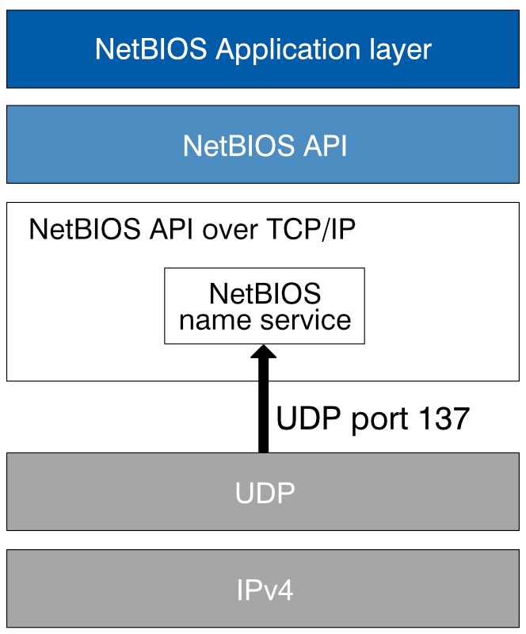

* NetBIOS
  
  

  实现： nmb

  使用： SMBv1； 新版本windows不再默认启用（之后甚至可能不再支持）

* mDNS

  实现： 

  使用： 

* Bonjour

  基于mDNS和DNS-SD，参考 [局域网设备发现之Bonjour协议](https://blog.csdn.net/yueqian_scut/article/details/52694411)。 苹果。。。

* WS-Discovery

  win10 支持。
  linux上实现为wsdd。
  
  

