[Edit this Page](https://github.com/mermaid-js/mermaid/blob/develop/docs/classDiagram.md)


# [Class diagrams](https://mermaid-js.github.io/mermaid/#/classDiagram?id=class-diagrams)

> "In software engineering, a class diagram in the Unified Modeling Language (UML) is a type of static structure diagram that describes the structure of a system by showing the system's classes, their attributes, operations (or methods), and the relationships among objects." Wikipedia

The class diagram is the main building block of object-oriented modeling. It is used for general conceptual modeling of the structure of the application, and for detailed modeling translating the models into programming code. Class diagrams can also be used for data modeling. The classes in a class diagram represent both the main elements, interactions in the application, and the classes to be programmed.

Mermaid can render class diagrams.

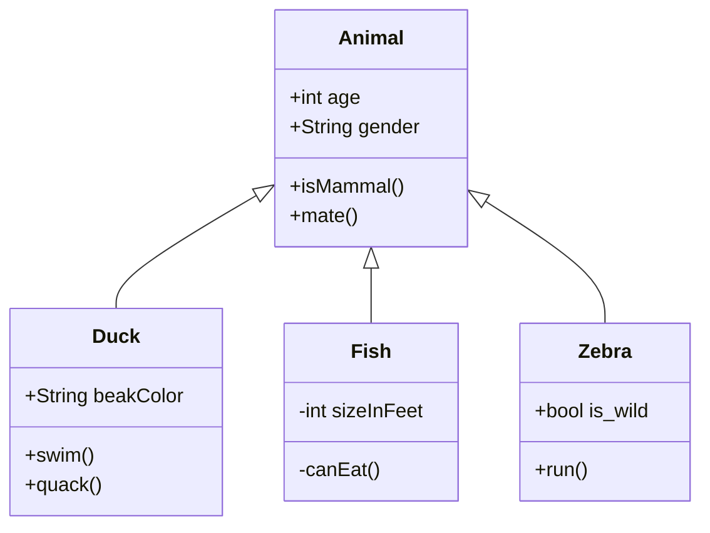

Animal+int age+String gender+isMammal()+mate()Duck+String beakColor+swim()+quack()Fish-int sizeInFeet-canEat()Zebra+bool is_wild+run()

## [Syntax](https://mermaid-js.github.io/mermaid/#/classDiagram?id=syntax)

### [Class](https://mermaid-js.github.io/mermaid/#/classDiagram?id=class)

UML provides mechanisms to represent class members, such as attributes and methods, and additional information about them. A single instance of a class in the diagram contains three compartments:

- The top compartment contains the name of the class. It is printed in bold and centered, and the first letter is capitalized. It may also contain optional annotation text describing the nature of the class.
- The middle compartment contains the attributes of the class. They are left-aligned and the first letter is lowercase. The bottom compartment contains the operations the class can execute. They are also left-aligned and the first letter is lowercase.

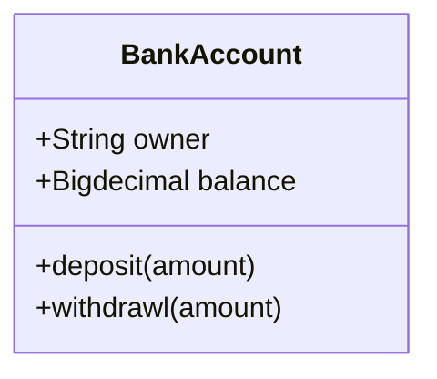

BankAccount+String owner+BigDecimal balance+deposit(amount)+withdrawl(amount)

## [Define a class](https://mermaid-js.github.io/mermaid/#/classDiagram?id=define-a-class)

There are two ways to define a class:

- Explicitly defining a class using keyword **class** like `class Animal`. This defines the Animal class
- Define two classes via a **relationship** between them `Vehicle <|-- Car`. This defines two classes Vehicle and Car along with their relationship.

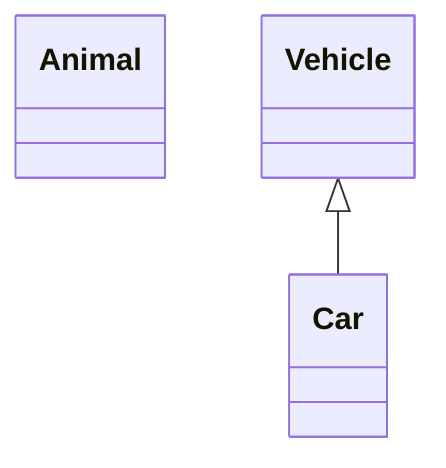

AnimalVehicleCar

Naming convention: a class name should be composed of alphanumeric (unicode allowed) and underscore characters.

## [Defining Members of a class](https://mermaid-js.github.io/mermaid/#/classDiagram?id=defining-members-of-a-class)

UML provides mechanisms to represent class members, such as attributes and methods, and additional information about them.

Mermaid distinguishes between attributes and functions/methods based on if the **parenthesis** `()` are present or not. The ones with `()` are treated as functions/methods, and others as attributes.

There are two ways to define the members of a class, and regardless of whichever syntax is used to define the members, the output will still be same. The two different ways are :

- Associate a member of a class using **:** (colon) followed by member name, useful to define one member at a time. For example:

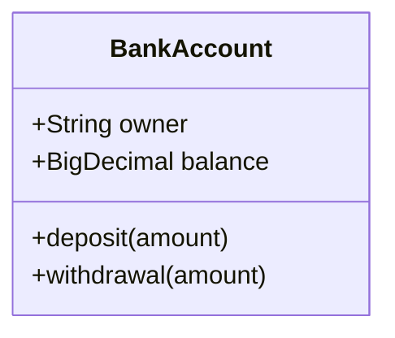

BankAccount+String owner+BigDecimal balance+deposit(amount)+withdrawl(amount)

- Associate members of a class using **{}** brackets, where members are grouped within curly brackets. Suitable for defining multiple members at once. For example:

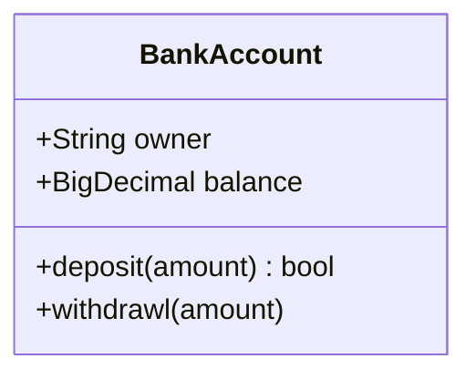

BankAccount+String owner+BigDecimal balance+deposit(amount) : bool+withdrawl(amount) : int

#### [Return Type](https://mermaid-js.github.io/mermaid/#/classDiagram?id=return-type)

Optionally you can end the method/function definition with the data type that will be returned (note: there must be a space between the final `)` of the method definition and return type example:

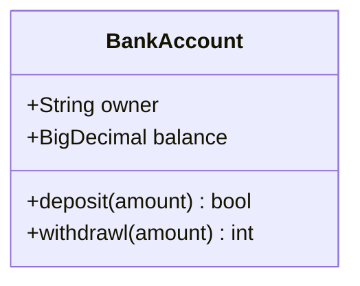

BankAccount+String owner+BigDecimal balance+deposit(amount) : bool+withdrawl(amount) : int

#### [Generic Types](https://mermaid-js.github.io/mermaid/#/classDiagram?id=generic-types)

Members can be defined using generic types, such as `List<int>`, for fields, parameters and return types by enclosing the type within `~` (**tilde**). Note: **nested** type declarations (such as `List<List<int>>`) are not currently supported

This can be done as part of either class definition method:

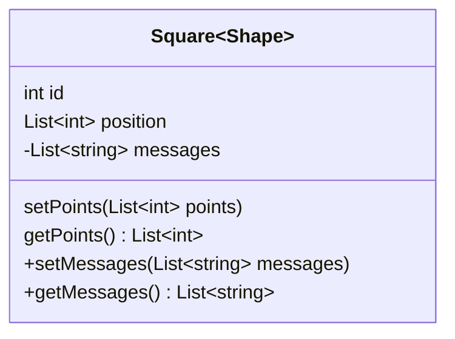

Square<Shape>int idList<int> position-List<string> messagessetPoints(List<int> points)getPoints() : List<int>+setMessages(List<string> messages)+getMessages() : List<string>

#### [Return Type](https://mermaid-js.github.io/mermaid/#/classDiagram?id=return-type-1)

Optionally you can end the method/function definition with the data type that will be returned

#### [Visibility](https://mermaid-js.github.io/mermaid/#/classDiagram?id=visibility)

To specify the visibility of a class member (i.e. any attribute or method), these notations may be placed before the member's name, but it is optional:

- `+` Public
- `-` Private
- `#` Protected
- `~` Package/Internal

> *note* you can also include additional *classifiers* to a method definition by adding the following notations to the end of the method, i.e.: after the `()`:

> - `*` Abstract e.g.: `someAbstractMethod()*`
> - `$` Static e.g.: `someStaticMethod()$`

## [Defining Relationship](https://mermaid-js.github.io/mermaid/#/classDiagram?id=defining-relationship)

A relationship is a general term covering the specific types of logical connections found on class and object diagrams.

```
[classA][Arrow][ClassB]:LabelText
```

There are different types of relations defined for classes under UML which are currently supported:

| Type  | Description   |
| ----- | ------------- |
| <\|-- | Inheritance   |
| *--   | Composition   |
| o--   | Aggregation   |
| -->   | Association   |
| --    | Link (Solid)  |
| ..>   | Dependency    |
| ..\|> | Realization   |
| ..    | Link (Dashed) |

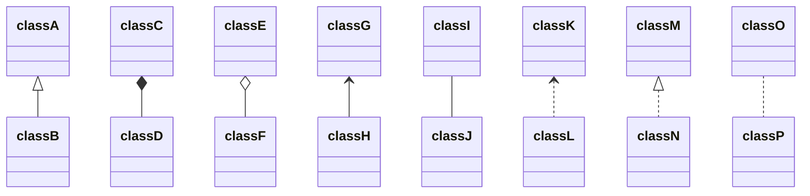

classAclassBclassCclassDclassEclassFclassGclassHclassIclassJclassKclassLclassMclassNclassOclassP

We can use the labels to describe nature of relation between two classes. Also, arrowheads can be used in opposite directions as well :

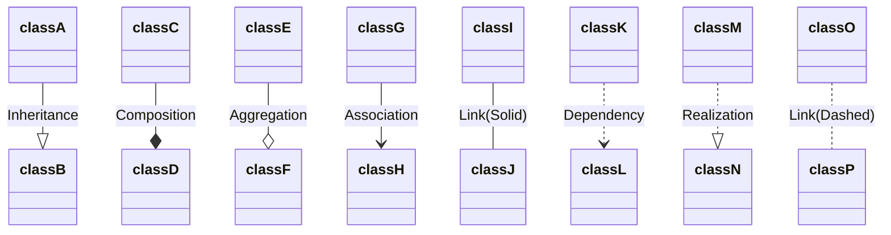

classAclassBclassCclassDclassEclassFclassGclassHclassIclassJclassKclassLclassMclassNclassOclassPInheritanceCompositionAggregationAssociationLink(Solid)DependencyRealizationLink(Dashed)

## [Labels on Relations](https://mermaid-js.github.io/mermaid/#/classDiagram?id=labels-on-relations)

It is possible to add a label text to a relation:

```
[classA][Arrow][ClassB]:LabelText
```


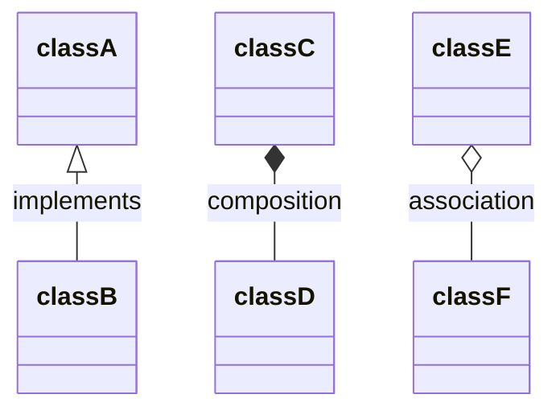

classAclassBclassEclassFimplementsassociation

## [Cardinality / Multiplicity on relations](https://mermaid-js.github.io/mermaid/#/classDiagram?id=cardinality-multiplicity-on-relations)

Multiplicity or cardinality in class diagrams indicates the number of instances of one class linked to one instance of the other class. For example, one company will have one or more employees, but each employee works for just one company.

Multiplicity notations are placed near the ends of an association.

The different cardinality options are :

- `1` Only 1
- `0..1` Zero or One
- `1..*` One or more
- `*` Many
- `n` n {where n>1}
- `0..n` zero to n {where n>1}
- `1..n` one to n {where n>1}

Cardinality can be easily defined by placing cardinality text within quotes `"` before(optional) and after(optional) a given arrow.

```
[classA] "cardinality1" [Arrow] "cardinality2" [ClassB]:LabelText
```


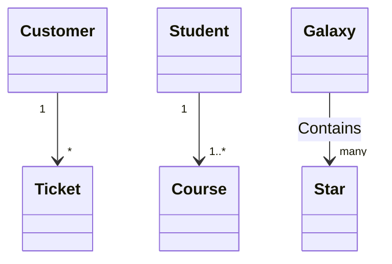

CustomerTicketStudentCourseGalaxyStar1*11..*Containsmany

## [Annotations on classes](https://mermaid-js.github.io/mermaid/#/classDiagram?id=annotations-on-classes)

It is possible to annotate classes with a specific marker text which is like meta-data for the class, giving a clear indication about its nature. Some common annotations examples could be:

- `<<Interface>>` To represent an Interface class
- `<<abstract>>` To represent an abstract class
- `<<Service>>` To represent a service class
- `<<enumeration>>` To represent an enum

Annotations are defined within the opening `<<` and closing `>>`. There are two ways to add an annotation to a class and regardless of the syntax used output will be same. The two ways are :

- In a ***separate line\*** after a class is defined. For example:

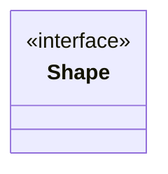

«interface»ShapenoOfVerticesdraw()

- In a ***nested structure\*** along with class definition. For example:

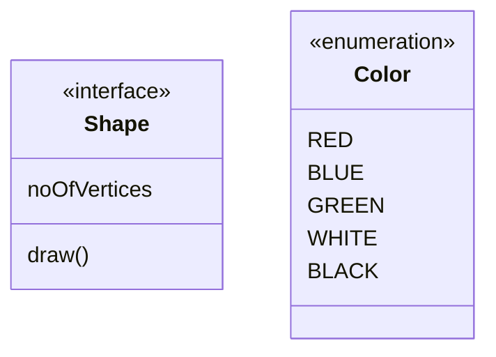

«interface»ShapenoOfVerticesdraw()«enumeration»ColorREDBLUEGREENWHITEBLACK

## [Comments](https://mermaid-js.github.io/mermaid/#/classDiagram?id=comments)

Comments can be entered within a class diagram, which will be ignored by the parser. Comments need to be on their own line, and must be prefaced with `%%` (double percent signs). Any text after the start of the comment to the next newline will be treated as a comment, including any class diagram syntax

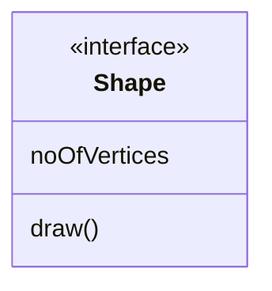

## [Interaction](https://mermaid-js.github.io/mermaid/#/classDiagram?id=interaction)

It is possible to bind a click event to a node, the click can lead to either a javascript callback or to a link which will be opened in a new browser tab. **Note**: This functionality is disabled when using `securityLevel='strict'` and enabled when using `securityLevel='loose'`.

You would define these actions on a separate line after all classes have been declared.

```
action className "reference" "tooltip"
click className call callback() "tooltip"
click className href "url" "tooltip"
```

- *action* is either `link` or `callback`, depending on which type of interaction you want to have called
- *className* is the id of the node that the action will be associated with
- *reference* is either the url link, or the function name for callback.
- (*optional*) tooltip is a string to be displayed when hovering over element (note: The styles of the tooltip are set by the class .mermaidTooltip.)
- note: callback function will be called with the nodeId as parameter.

### [Examples](https://mermaid-js.github.io/mermaid/#/classDiagram?id=examples)

*URL Link:*

```
classDiagram
class Shape
link Shape "http://www.github.com" "This is a tooltip for a link"
class Shape2
click Shape2 href "http://www.github.com" "This is a tooltip for a link"
```

*Callback:*

```
classDiagram
class Shape
callback Shape "callbackFunction" "This is a tooltip for a callback"
class Shape2
click Shape2 call callbackFunction() "This is a tooltip for a callback"
```

```
<script>
    var callbackFunction = function(){
        alert('A callback was triggered');
    }
<script>
```


Class01Class02Class03Class04

> **Success** The tooltip functionality and the ability to link to urls are available from version 0.5.2.

Beginners tip, a full example using interactive links in an html context:

```html
<body>
  <div class="mermaid">
    classDiagram
    Animal <|-- Duck
    Animal <|-- Fish
    Animal <|-- Zebra
    Animal : +int age
    Animal : +String gender
    Animal: +isMammal()
    Animal: +mate()
    class Duck{
      +String beakColor
      +swim()
      +quack()
      }
    class Fish{
      -int sizeInFeet
      -canEat()
      }
    class Zebra{
      +bool is_wild
      +run()
      }

      callback Duck callback "Tooltip"
      link Zebra "http://www.github.com" "This is a link"
  </div>

  <script>
    var callback = function(){
        alert('A callback was triggered');
    }
    var config = {
      startOnLoad:true,
      securityLevel:'loose',
    };

    mermaid.initialize(config);
  </script>
</body>
```

## [Styling](https://mermaid-js.github.io/mermaid/#/classDiagram?id=styling)

### [Styling a node](https://mermaid-js.github.io/mermaid/#/classDiagram?id=styling-a-node)

It is possible to apply specific styles such as a thicker border or a different background color to individual nodes. This is done by predefining classes in css styles that can be applied from the graph definition as in the example below:

```html
<style>
    .cssClass > rect{
        fill:#FF0000;
        stroke:#FFFF00;
        stroke-width:4px;
    }
</style>
```

Then attaching that class to a specific node as per below:

```
    cssClass "nodeId1" cssClass;
```

It is also possible to attach a class to a list of nodes in one statement:

```
    cssClass "nodeId1,nodeId2" cssClass;
```

A shorter form of adding a class is to attach the classname to the node using the `:::` operator as per below:

```mermaid
classDiagram
    class Animal:::cssClass
```

Or:

```mermaid
classDiagram
    class Animal:::cssClass {
        -int sizeInFeet
        -canEat()
    }
```

cssClasses cannot be added using this shorthand method at the same time as a relation statement.

Due to limitations with existing markup for class diagrams, it is not currently possible to define css classes within the diagram itself. ***Coming soon!\***

### [Default Styles](https://mermaid-js.github.io/mermaid/#/classDiagram?id=default-styles)

The main styling of the class diagram is done with a preset number of css classes. During rendering these classes are extracted from the file located at src/themes/class.scss. The classes used here are described below:

| Class              | Description                                                  |
| ------------------ | ------------------------------------------------------------ |
| g.classGroup text  | Styles for general class text                                |
| classGroup .title  | Styles for general class title                               |
| g.classGroup rect  | Styles for class diagram rectangle                           |
| g.classGroup line  | Styles for class diagram line                                |
| .classLabel .box   | Styles for class label box                                   |
| .classLabel .label | Styles for class label text                                  |
| composition        | Styles for composition arrow head and arrow line             |
| aggregation        | Styles for aggregation arrow head and arrow line(dashed or solid) |
| dependency         | Styles for dependency arrow head and arrow line              |

#### [Sample stylesheet](https://mermaid-js.github.io/mermaid/#/classDiagram?id=sample-stylesheet)

```scss
body {
    background: white;
}

g.classGroup text {
    fill: $nodeBorder;
    stroke: none;
    font-family: 'trebuchet ms', verdana, arial;
    font-family: var(--mermaid-font-family);
    font-size: 10px;

    .title {
        font-weight: bolder;
    }
}

g.classGroup rect {
    fill: $nodeBkg;
    stroke: $nodeBorder;
}

g.classGroup line {
    stroke: $nodeBorder;
    stroke-width: 1;
}

.classLabel .box {
    stroke: none;
    stroke-width: 0;
    fill: $nodeBkg;
    opacity: 0.5;
}

.classLabel .label {
    fill: $nodeBorder;
    font-size: 10px;
}

.relation {
    stroke: $nodeBorder;
    stroke-width: 1;
    fill: none;
}

@mixin composition {
    fill: $nodeBorder;
    stroke: $nodeBorder;
    stroke-width: 1;
}

#compositionStart {
    @include composition;
}

#compositionEnd {
    @include composition;
}

@mixin aggregation {
    fill: $nodeBkg;
    stroke: $nodeBorder;
    stroke-width: 1;
}

#aggregationStart {
    @include aggregation;
}

#aggregationEnd {
    @include aggregation;
}

#dependencyStart {
    @include composition;
}

#dependencyEnd {
    @include composition;
}

#extensionStart {
    @include composition;
}

#extensionEnd {
    @include composition;
}
```

## [Configuration](https://mermaid-js.github.io/mermaid/#/classDiagram?id=configuration)

```
Coming soon
```

