# 使用 Typora 画图（类图、流程图、时序图）

[](https://www.zhihu.com/people/zoumingyuan)

[阿远](https://www.zhihu.com/people/zoumingyuan)[](https://www.zhihu.com/question/48510028)


华中科技大学 软件工程硕士在读

今天继续分享一下使用 Typora 在画图方面的小技巧。是的，你没看错，Typora 也能”画“图。

说是画图，但并不像其他专业的绘图软件那样，通过拖拖拽拽一些元素，画出流程图、时序图等。Typora 的制图功能是由 Mermaid 强力驱动，如果你使用过 PlantUML，那么 Mermaid 也非常容易上手。

# **Mermaid**

**Mermaid[1]** 是一种简单的类似 Markdown  的脚本语言，通过 JavaScript 编程语言，将文本转换为图片。因此，真正实现画图功能的并不是 Typora 本身，它只是内置了对 Mermaid 的支持。


Mermaid 支持绘制非常多种类的图，常见的有时序图、流程图、类图、甘特图等等。下面分享一下如何绘制这些图，语法非常容易掌握。

先在 Typora 中，输入 **```mermaid** 然后敲击回车，即可初始化一张空白图。

## **流程图**

语法解释：`graph` 关键字就是声明一张流程图，`TD` 表示的是方向，这里的含义是 Top-Down 由上至下。

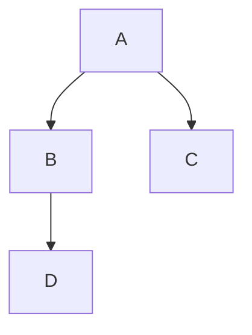


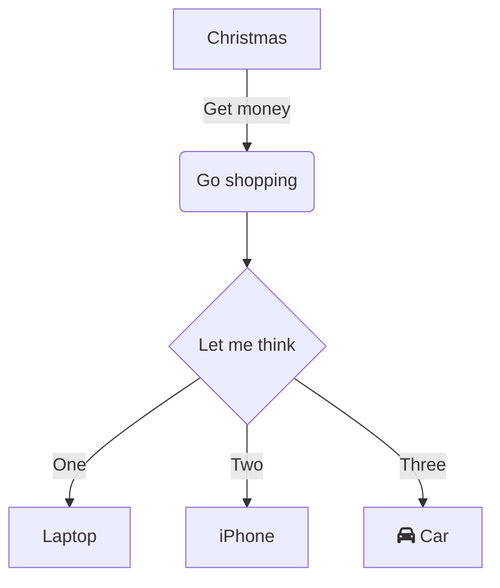


### style


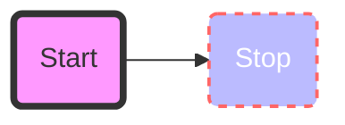

可以使用`class`来对style进行分类以重复使用，如下：

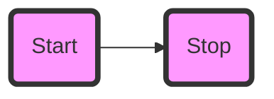


也可以在节点处直接引用class来描述（就不用单独行描写了）

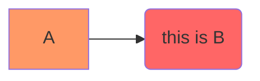


## 脑图（基于流程图，by yonka）

> 目前阶段mermaid还不支持脑图，用流程图来画画。
>
> 但没法同时LR，RL，TD，DT几个方向生长了


ref：

* 

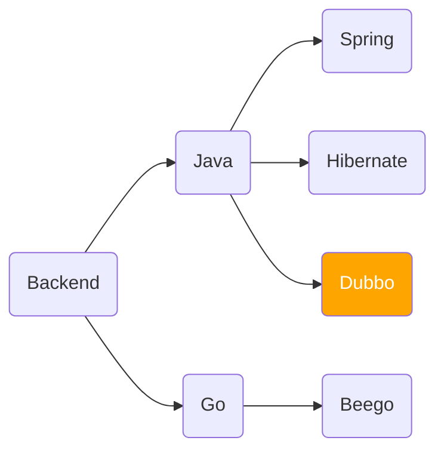


## **时序图**

语法解释：`->>` 代表实线箭头，`-->>` 则代表虚线。

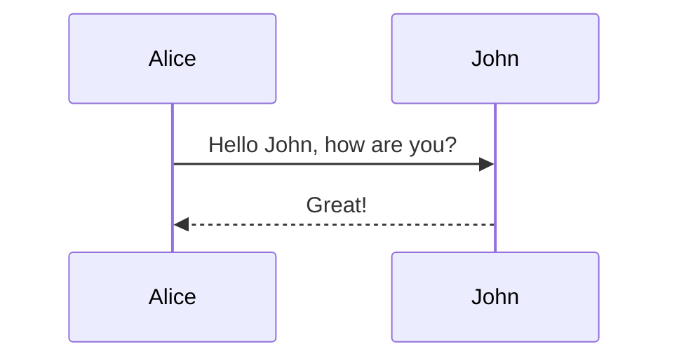

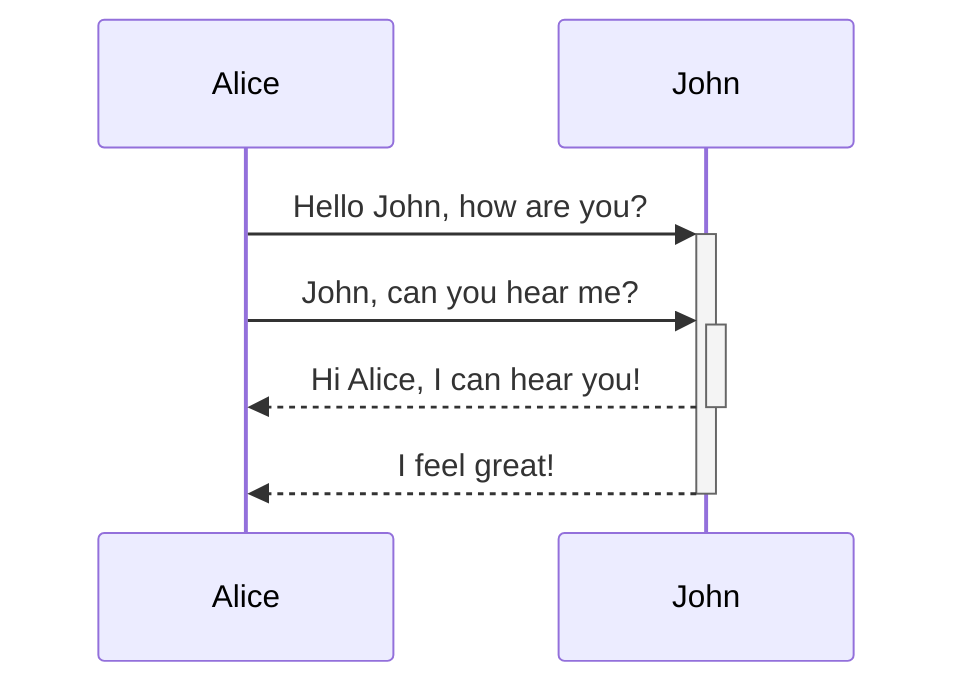


## **状态图**

语法解释：`[*]` 表示开始或者结束，如果在箭头右边则表示结束。


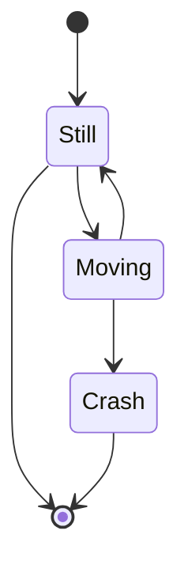


## **类图**

语法解释：`<|--` 表示继承，`+` 表示 `public`，`-` 表示 `private`，学过 Java 的应该都知道。

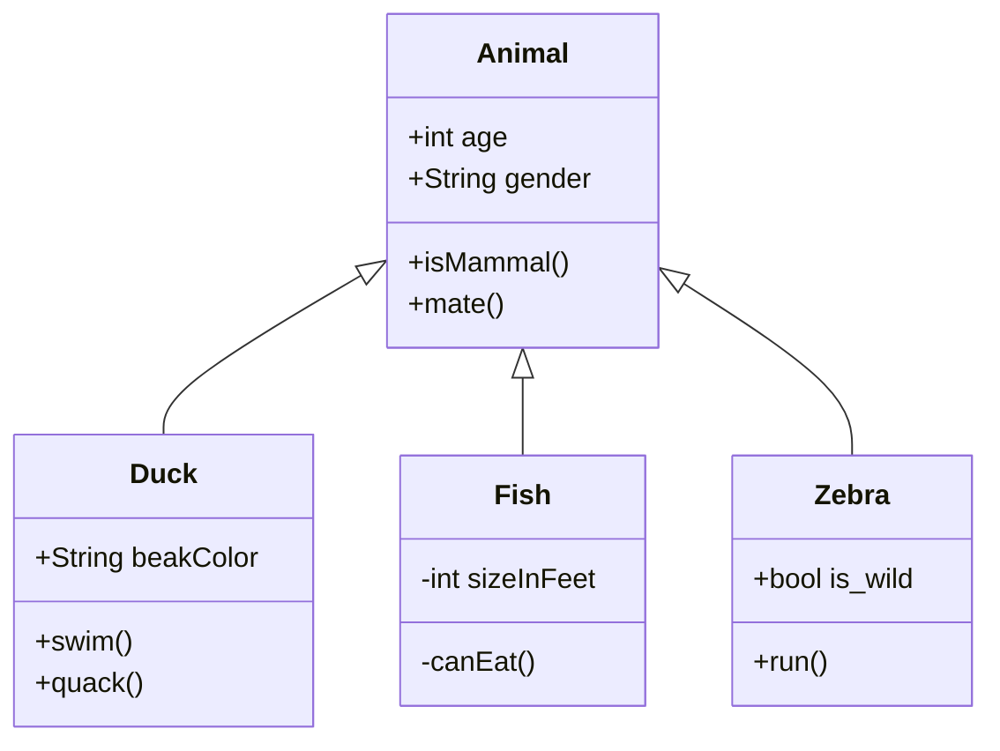


## **甘特图**

甘特图一般用来表示项目的计划排期，目前在工作中经常会用到。

语法也非常简单，从上到下依次是图片标题、日期格式、项目、项目细分的任务。

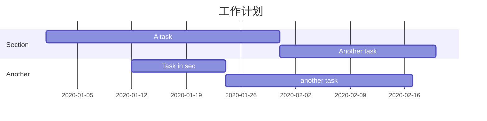


## **饼图**

饼图使用 `pie` 表示，标题下面分别是区域名称及其百分比。

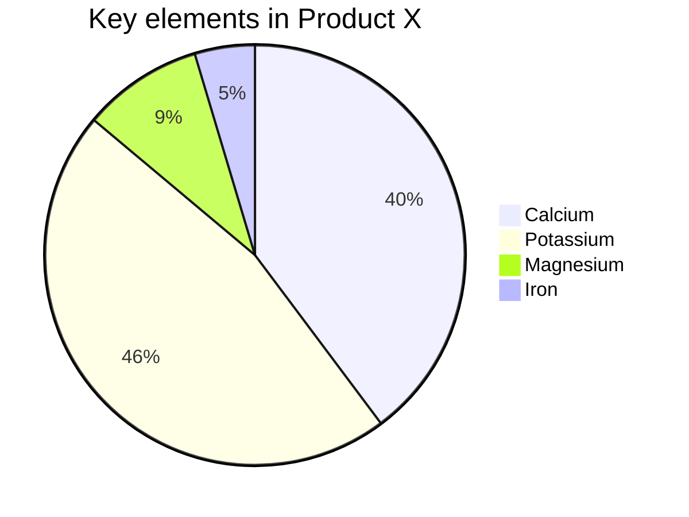


## ER图

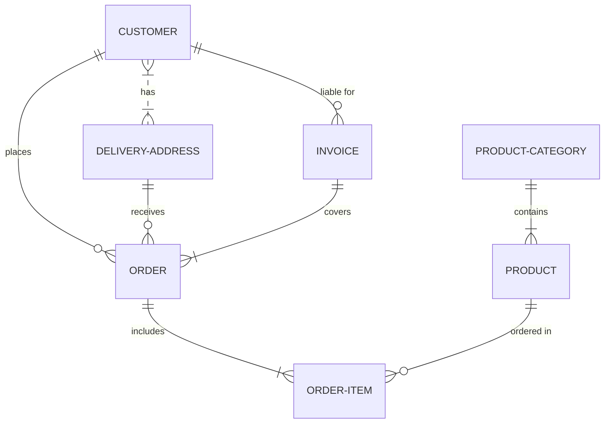


## theming 主题/风格


## Theme Variables Reference Table

Note

Variables that are unique to some diagrams can be affected by changes in Theme Variables

| Variable             | Default/Base/Factor value      | Calc | Description                                                  |
| -------------------- | ------------------------------ | ---- | ------------------------------------------------------------ |
| darkMode             | false                          |      | Boolean Value that dictates how to calculate colors. “true” will activate darkmode. |
| background           | #f4f4f4                        |      | Used to calculate color for items that should either be background colored or contrasting to the background. |
| primaryColor         | #fff4dd                        |      | Color to be used as background in nodes, other colors will be derived from this |
| fontFamily           | “trebuchet ms”, verdana, arial |      |                                                              |
| fontSize             | 16px                           |      | Font Size, in pixels                                         |
| secondaryColor       | based on primaryColor          | *    |                                                              |
| tertiaryColor        | based on primaryColor          | *    |                                                              |
| primaryBorderColor   | based on primaryColor          | *    | Color to be used as border in nodes using primaryColor       |
| primaryTextColor     | based on darkMode #ddd/#333    | *    | Color to be used as text color in nodesusing primaryColor    |
| secondaryBorderColor | based on secondaryColor        | *    | Color to be used as border in nodes using secondaryColor     |
| secondaryTextColor   | based on secondaryColor        | *    | Color to be used as text color in nodesusing secondaryColor  |
| tertiaryBorderColor  | based on tertiaryColor         | *    | Color to be used as border in nodes using tertiaryColor      |
| tertiaryTextColor    | based on tertiaryColor         | *    | Color to be used as text color in nodesusing tertiaryColor   |
| noteBkgColor         | #fff5ad                        |      | Color used as background in notes                            |
| noteTextColor        | #333                           |      | Text color in note rectangless.                              |
| noteBorderColor      | based on noteBkgColor          | *    | Border color in note rectangless.                            |
| lineColor            | based on background            | *    |                                                              |
| textColor            | based on primaryTextColor      | *    | Text in diagram over the background for instance text on labels and on signals in sequence diagram or the title in gantt diagram |
| mainBkg              | based on primaryColor          | *    | Background in flowchart objects like rects/circles, class diagram classes, sequence diagram etc |
| errorBkgColor        | tertiaryColor                  | *    | Color for syntax error message                               |
| errorTextColor       | tertiaryTextColor              | *    | Color for syntax error message                               |

# What follows are Variables, specific to different diagrams and charts.

Some Theme Variables serve as, or affect the Default Values for Specific Diagram Variables, unless changed using `%%init%%` .

## Flowchart

| Variable            | Default/ Associated Value | Calc | Description                  |
| ------------------- | ------------------------- | ---- | ---------------------------- |
| nodeBorder          | primaryBorderColor        | *    | Node Border Color            |
| clusterBkg          | tertiaryColor             | *    | Background in subgraphs      |
| clusterBorder       | tertiaryBorderColor       | *    | Cluster Border Color         |
| defaultLinkColor    | lineColor                 | *    | Link Color                   |
| titleColor          | tertiaryTextColor         | *    | Title Color                  |
| edgeLabelBackground | based on secondaryColor   | *    |                              |
| nodeTextColor       | primaryTextColor          | *    | Color for text inside Nodes. |

# sequence diagram

| name                  | Default value           | Calc | Description                 |
| --------------------- | ----------------------- | ---- | --------------------------- |
| actorBorder           | primaryBorderColor      | *    | Actor Border Color          |
| actorBkg              | mainBkg                 | *    | Actor Background Color      |
| actorTextColor        | primaryTextColor        | *    | Actor Text Color            |
| actorLineColor        | grey                    | *    | Actor Line Color            |
| labelBoxBkgColor      | actorBkg                | *    | Label Box Background Color  |
| signalColor           | textColor               | *    | Signal Color                |
| signalTextColor       | textColor               | *    | Signal Text Color           |
| labelBoxBorderColor   | actorBorder             | *    | Label Box Border Color      |
| labelTextColor        | actorTextColor          | *    | Label Text Color            |
| loopTextColor         | actorTextColor          | *    | Loop ext Color              |
| activationBorderColor | based on secondaryColor | *    | Activation Border Color     |
| activationBkgColor    | secondaryColor          | *    | Activation Background Color |
| sequenceNumberColor   | based on lineColor      | *    | Sequence Number Color       |

# state colors

| name          | Default value    | Calc | Description                                  |
| ------------- | ---------------- | ---- | -------------------------------------------- |
| labelColor    | primaryTextColor | *    |                                              |
| altBackground | tertiaryColor    | *    | Used for background in deep composite states |

# class colors

| name      | Default value | Calc | Description                     |
| --------- | ------------- | ---- | ------------------------------- |
| classText | textColor     | *    | Color of Text in class diagrams |

# User journey colors

| name      | Default value           | Calc | Description                             |
| --------- | ----------------------- | ---- | --------------------------------------- |
| fillType0 | primaryColor            | *    | Fill for 1st section in journey diagram |
| fillType1 | secondaryColor          | *    | Fill for 2nd section in journey diagram |
| fillType2 | based on primaryColor   | *    | Fill for 3rd section in journey diagram |
| fillType3 | based on secondaryColor | *    | Fill for 4th section in journey diagram |
| fillType4 | based on primaryColor   | *    | Fill for 5th section in journey diagram |
| fillType5 | based on secondaryColor | *    | Fill for 6th section in journey diagram |
| fillType6 | based on primaryColor   | *    | Fill for 7th section in journey diagram |
| fillType7 | based on secondaryColor | *    | Fill for 8th section in journey diagram |

**Notes: Values are meant to create an alternating look.


## **导出**

绘制好的图片可以选择菜单/文件/导出，导出为图片或者网页格式。在网页中图片是以 SVG 格式渲染的，你可以复制 SVG 内容，导入到 SVG 的图片编辑器中进一步操作。


Mermaid 官方有一个在线的工具，可以导出 SVG 和 PNG。

[Mermaid live editor](https://link.zhihu.com/?target=https%3A//mermaid-js.github.io/mermaid-live-editor)

[mermaid-js.github.io](https://link.zhihu.com/?target=https%3A//mermaid-js.github.io/mermaid-live-editor)

**小结**

可以看到，Mermaid 使用非常简洁优雅的语法，让使用者可以快速地画出常用的图形，并且图片的非常美观，配色和谐，富有现代感。这个 Typora 画图的功能，你学会了吗？

我还写过关于 Typora 的一些使用小技巧，欢迎阅读 

[https://zhuanlan.zhihu.com/p/163608242](https://zhuanlan.zhihu.com/p/163608242)[zhuanlan.zhihu.com](https://zhuanlan.zhihu.com/p/163608242)

## **参考资料**

[1] 

Mermaid: *[https://mermaid-js.github.io/mermaid/#/](https://link.zhihu.com/?target=https%3A//mermaid-js.github.io/mermaid/%23/)*


