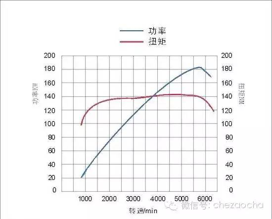

# 汽车常识


## 常见数据

### 1.2L、1.8L、2.0L

```
L指的是排气量,跟动力有关.排气量越大，动力输出就越大，不过也费油。
也就是发动机排量：发动机启动活塞运动所通过缸体内的气缸排量，1.2L发动机3个气缸，3个气缸工作容积之和称为发动机排量。这辆车的发动机排量就是1.2L的。
```


```
就是活塞从上止点移动到下止点所通过的空间容积称为气缸排量，如果发动机有若干个气缸，所有气缸工作容积之和称为发动机排量
```


* 1.2mt 1.2手动挡
* 1.2at 1.2自动挡
* 1.2amt 1.2手自一体


## 常见概念


### 马力

见 动力 - 动力概念 - 马力


### 扭矩

见 动力 - 动力概念 - 扭矩


## 速度


### 发动机转速


### 行驶速度


## 动力


### 动力概念

#### 马力

马力 == 功率 == **乘上了转速的扭矩**

> yonka理解： 从物理学上来看，功率代表了在什么样的速度时还能给汽车加速
>
> 功率不变时，当速度一直增加，能提供的力是逐渐减小的，直到减小到和摩擦力相等时就无法再给车辆加速（这里先不考虑摩擦力和车速的关系）。 功率表越大，这个临界点越高。 所以**功率决定了车的最大速度**
>
> 但是**显然，并不是速度几乎为0时可以提供的力就是接近无穷大，现实中肯定会有个最大值**
>
> > 换句话说，刚启动（低速）时，发动机并不具备立即以最大功率（有效）输出的能力，实际能力以 <del>最大</del>力/扭矩 的形式呈现


**最大功率 与 功率输出曲线**


**单位**

* PS - 公制马力

  > 国内说的最大马力或最大功率主要是公制的PS

  * 1马力=0.7354987千瓦(kW)

* bhp - 英制马力

  > “bhp”和“hp”其实是一样的意思，Brake Horse power和Horse Power的缩写

  > 英制马力其实平时很少用到，我们只在一些英国、美国的汽车节目也会经常听到

  * 1bhp=0.73kW


```
不同汽车是不一样的。马力是功率单位，你所谓的劲是力的单位。功率和力是不同的物理量。公制中,1马力等于每秒钟把75公斤重的物体提高1米所作的功。注意这是公制的马力。
　　用一个直观的现象来说明：大众途锐的功率是四百马力左右，在一档的时候可以拖动中型的像波音747那样的客机。坦克一般也就一千马力，但跑的最高速度不快但却可以爬很大的坡。工程车通常也就是这个级别的功率，但在低速挡时的力量非常大，因为它们的扭矩差别决定了它们在相同功率下输出的“力量”的差别。
　　汽车中，马力决定汽车的速度。一般情况是这样的。工程车一般马力不会很大，但是扭矩会很大——意味着它很有力量。
```


#### 扭矩

前面说了，扭矩表示提供的力，决定了加速性能。

但是还要留意**最大扭矩 和 扭矩输出曲线**，并不是最大扭矩越大加速越快，还要看输出曲线： **更快（更低发动机转速）达到特定扭矩**



> 比如说车重相当的情况下，300Nm/2500rpm就300Nm/1700rpm的**前段加速或者起步**要弱，因为后者的最大扭矩只要到1700rpm就达到了

* 如果我们从整个扭矩曲线来对比的话，还能看出**中段加速**能力，这决定着车辆**超车能力**。
* 所以，扭矩大小要和转速结合才有参考价值


### 燃油


#### 油箱大小

```
大体按汽车加满油后可行驶500公里左右为限，油耗大的油箱就大油耗小的油箱就小。
```

**一般汽车的油箱容量为多少升？**

* 玛莎拉蒂
  * 新总裁:90 L
* 保时捷
  * 911卡雷拉4S：67 L
* 宾利
  * 欧路GTC：90 L
* 阿斯顿马丁
  * DBS6.0：78 L
* 奔驰
  * SLK350：70 L
* 保时捷
  * 卡宴turbo S： 100 L
* 捷达
  * 60
  * 老款55
* 奇瑞
  * 50 
  * 1.6以上大部分60 
  * 1.6以下40
* 大型车100 150 200  400 都用
* 长安之星40L 
* 桑塔纳老款55 现在60 
* 奔驰 70 
* 别克60 
* 广本60 
* 凯美瑞58 
* 红岩 100 150 200 400 都用分几个油箱 
* 东风50 100 
* 福田圆灯的 30 方形的50


#### 油耗

```
就拿一辆普通轿车为例吧（2.0L以下的发动机），一般油耗在5L/100km到10L/100km。
1/5*100=20km  
   也就是说，对于百公里耗油5升油的普通汽车来说，1升汽油可以跑20公里；对于百公里耗油10升的汽车，1升汽油可以跑10公里；
   结论：1升汽油一般够一辆普通汽车跑10至20公里。
```


#### 续航里程

参见前面**油箱大小**，应该是都设计为500km吧。


### 变速器

* 手动
* 自动
* 双离合
* ...
* 手自一体
* 无级变速


“汽车自动变速器常见的有四种型式：分别是液力自动变速器（AT)、机械式无级变速器（CVT)、电控机械式自动变速器（AMT)、双离合自动变速器（Dual Clutch Transmission--DCT）。”中文一般把AT称作手自排变速箱，把AMT称作自手排变速箱。
手自一体指的是普通的AT。


# 养护


## 外观


### 镀晶


```
镀晶的关键在于提亮，有一定的保护漆面的作用！
但绝对不想传说中那么强大！对于一般的划伤是基本没有效果的！因为镀晶是依附在漆面上的，如划伤到漆面，那么镀晶肯定就随漆面剥离了！

如不差钱，建议做！如是要性价比，建议在一年以后做!

理由：新车的漆面上有光油层（用来提亮和保护油漆），待使用一段时间后，光油层会老化和氧化会形成表面龟裂（当然肉眼是看不出的，得通过放大镜看）直接的表现就是洗车后漆面的光泽度下降了，手碰触后顺滑感下降了。此时可去洗车店轻抛一下，去除光油层表面的龟裂，再镀晶就能保持漆面的光泽，加强漆面的保护！

相当于前一年先不镀晶，利用原光油层的亮度，待一年后再镀晶，恢复新车时的感觉！
```


### 打蜡


巴西棕榈蜡


* 龟

* 新狮

  比龟便宜，持久性更好（据说

* 史维克

  比龟好，比龟贵


硬质蜡不适合自己打

https://baijiahao.baidu.com/s?id=1602607633876212200&wfr=spider&for=pc


