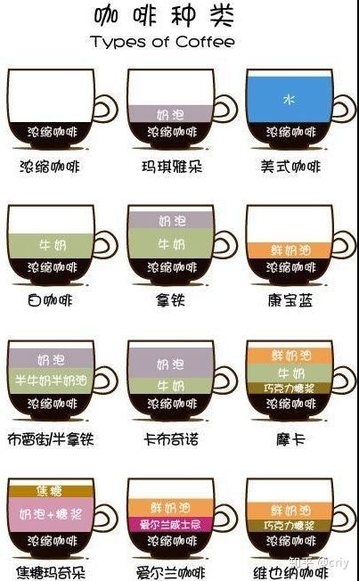

# 概述

## 渊源

```
意式咖啡最早是普及在欧洲，传到美国后，由于美国人喝惯了美式咖啡较淡的口味，所以将意式咖啡机煮出来的ESPRESSO，加入热水冲淡它的浓度，所以有时您会在咖啡馆的MENU中看见一个叫美式咖啡的东西，像在星巴克的每日咖啡，就是由他们每日不同的豆子用意大利咖啡机煮出来的浓缩咖啡再去对水所冲出来的咖啡，又称为" Americano "指的就是这种咖啡
```


## 功效

* 减肥

  咖啡热量很小，一杯100克的美式咖啡只有2.55千卡的热量。餐后喝杯美式咖啡，能有效地分解脂肪。美式咖啡中的美式咖啡因，具有促进脂肪分解的作用，将脂肪释放在血液中，所以喝美式咖啡也可以减肥。一般来说1天4杯不加糖和奶的美式咖啡就可以达到理想的减肥状况。

  烘焙温度高的咖啡，味道虽然浓郁，但咖啡因含量比较少，不利于减肥，而味道比较淡的美式咖啡则比较利于减肥。不过需要注意的是，不加伴侣、不加牛奶、不加糖的纯咖啡，才是具有减肥效果的美式咖啡。

* 利尿导泻

  有科学家认为，咖啡较粗纤维类食物而言是一种更迅速而温和的导泻剂，它对至少1/3的人有效，女性更为明显。有助排宿便的成分，是一种快速的“体液激素”或神经递质机制。实验发现，饮咖啡后仅4分钟，大肠的运动即开始加强，这种促使胃肠蠕动的作用在清晨最强，在夜晚时则变得很弱。美式咖具有利尿作用。不过肠胃消化不良、胃酸过多、容易失眠的人最好不要使用此法。


## 分类

我们平常喝到的咖啡按照制作的方法不同，主要可以分成意式咖啡、法式咖啡和美式咖啡。

* 意式咖啡的特点是口味比较纯正、浓郁
* 法式的特点是花样繁多、造型美观
* 美式咖啡的特点就是简单速成





还一种分类方式：

* 黑咖啡

  只是咖啡液（加水？）

* 其他

  加奶、加糖、加调味等等等


还有：

* 单品

* 综合

  估计是多种咖啡豆配比混合吧（？）


### 美式和意式区别

顾名思义，意式咖啡机做出来的是意式咖啡，美式咖啡机做出来的是美式咖啡，两种不同风格的咖啡。两者在味道、做法上都有一定的区别：

**1、比例不同**

* 意式咖啡简称意大利咖啡，代表做品有意式浓缩，意大利人最爱的咖啡，只有30cc
* 按1：5的比例加热水，即是美式咖啡，即淡咖啡。

**2、煮法不同**

* 美式咖啡

  ```
  一般人能理解的就是小家电常见的美式滴滤式咖啡机，咖啡粉放置於滤杯中，插电开开关，自己会自动滴漏下来的那种，我们一般称为美式咖啡，其时间要看杯数及水量，浓淡的调整会因您的水量及放的咖啡粉量而有所不同；但美式及意式的口是非常不同的二种咖啡。
  ```

* 意式咖啡机

  ```
  主要的煮法是由意式咖啡机，摩卡壼等意式咖啡煮具所煮出来的咖啡称为意式咖啡，其煮出来的基本咖啡一般坊间称为ESPRESSO中文为意式浓缩咖啡，其原理是由适当的压力及合适水温的水快速的（一般为25－30秒）通过咖啡粉而淬取出来的咖啡液（30cc左右），所以一般来说是很浓厚的，而ESPRESSO通常也是所有意式咖啡的基底咖啡，像拿铁，卡布其诺，焦糖玛琪朵等，都是加入不同的物品所结合出来产生的产品。
  ```

**3、口感不同**

* 美式咖啡又称淡咖啡，可以日常做饮料使用，美国咖啡与文化有关，追求方便、快捷，煮起来简便、随意，口味比意式咖啡淡很多，杯子也大
* 意式咖啡：是指意大利咖啡，浓缩咖啡，专门用意大利咖啡机做出来的。煮法教讲究，味道浓郁，很苦，很浓，杯载较小，份量少。


**咖啡因含量**

```
咖啡因含量的多少影响因素包含豆子的品种,咖啡与水接触的时间,咖啡量的多与少,都有密切的关系,若以煮的时间及咖啡粉量来说,意式咖啡的咖啡因,并不会比美式咖啡来得高,但又会因配的咖啡豆不同而有所不同。
```


## 种类一览

* 【蓝山咖啡(BLUEMOUNTAIN)】

　　是生产于牙买加蓝山海拔2500尺以上的咖啡豆，是一种微酸、柔顺、带甘、风味细腻的咖啡；纯蓝山咖啡口感、香味较淡，但喝起来却非常香醇精致；具有贵族的品味，乃咖啡中之极品。

* 【摩卡咖啡(MOCHA)】

　　目前以也门所生产的咖啡为最佳，其次为依索比亚的摩卡；摩卡咖啡带润滑中之中酸至强酸、甘性特佳、风味独特，含有巧克力的味道；具有贵妇人的气质，是极具特色的一种纯品咖啡。

* 【哥伦比亚咖啡(COLOMBIA)】

　　哥伦比亚咖啡中以SUPREMO最具特色，其咖啡柔软香醇；带微酸至中酸，其品质及香味稳定，属中度咖啡，是用以调配综合咖啡的上品。

* 【曼特宁咖啡(MANDELING)】

　　是生产于印度尼西亚，苏门答腊中最具代表性的咖啡；风味香、浓、苦，口味相当强，但柔顺不带酸，是印度尼西亚生产的咖啡中品质最好的一种咖啡。

* 【碳烧咖啡(CHARCALFIRE)】

　　是一种重度烘焙的咖啡，味道焦、苦不带酸，咖啡豆有出油的现象，极适合用于蒸气加压咖啡。

* 【巴西咖啡(SANTOS)】

　　巴西乃世界第一的咖啡生产国，所产之咖啡，香味温和、微酸、微苦，为中性咖啡之代表，是调配温和咖啡不可或缺的品种。

* 【肯亚咖啡(KENYAAA)】

　　是非洲高地栽培的代表性咖啡。AA代表其级数也就是最高级品，其咖啡豆肉质厚呈圆形，味浓质佳，通常采用浅焙。清晨起来喝一杯肯亚，具有醒脑的效用。

* 【夏威夷咖啡(KONAFANCY)】

　　属于夏威夷西部火山所栽培的咖啡，也是美国唯一生产的咖啡品种，口感较强，香味浓，带强酸，风味特殊。品质相当稳定，是前往夏威夷的观光客必购土产之一。


# 饮用

## 搭配

### 奶类

```
如果你泡的是越南咖啡，加炼乳是最佳 如果是普通的黑咖啡，加奶球是最佳 如果是意式浓缩咖啡，加纯牛奶是最好的。 我做的时候是按这样子的加法配给我的客人， 但是你也可以按照你的个人口味，。 因为炼乳是会甜的。 
```

* 越南咖啡 - 炼乳
* 普通黑咖啡 - 奶球
* 意式浓缩咖啡 - 纯牛奶


# 咖啡豆制作（处理）方法


## 烘焙


### 深烘 VS 浅烘


ref： [咖啡深度烘焙和浅度烘培的区别](http://club.coffee.cn/bbs/bbs_show_9928712.htm)

```
关于某一款咖啡是深烘还是浅烘的问题，咖啡业界一直有着较为激烈的争论，支持浅烘的烘焙师认为咖啡豆应当浅度烘焙，这样可以最大程度展现这款咖啡的风味，特别是一些年轻的咖啡烘焙师，非常支持浅烘。的确，我们也注意到，随着世界咖啡精品运动的推动，咖啡豆浅度烘焙似乎成为了精品咖啡的标准和趋势，美国的一些精品咖啡烘焙商浅烘的程度是令人称奇的。而支持深度烘焙的一方则认为，咖啡豆只有在中深度烘焙后才能完全的完成“美拉德”反应，以美国旧金山的Peet's 则一直坚持着深烘的风格，当然他也是公认的深烘焙的专家。

　　深烘和浅烘两派的争论，我想会一直持续下去的，因为对于咖啡烘焙程度的选择，标志着烘焙商(烘焙师)对于咖啡的风味的理解。豆叔个人认为深烘和浅烘不需要也不应该一刀切的统一，烘焙师们对于咖啡的理解本来就是各式各样的，即便是同属浅烘的咖啡烘焙师，其烘焙程度和曲线形式也都各不相同。

　　但作为烘焙商，对于咖啡烘焙程度的选择，不应该仅仅从烘焙师的个人兴趣与爱好出发，而应当从受众的需求着眼，所以说浅烘有浅烘的道理，深烘有深烘的道理，二者本没有好坏的差异。如果你的客人追求风味感，追求咖啡出产地的风土特色，那么，浅烘可以让你的客户们较为清晰地察觉到他们所需要的。相反，如果你的客人喜欢圆润饱满、醇厚且甜感十足的咖啡，那么中度乃至深度烘焙是比较合适的。但豆叔要为深度烘焙咖啡的烘焙师们说一句话，许多浅烘风格的烘焙师认为咖啡在深烘状态下，咖啡中除了焦苦，没有其他的味道，咖啡的风味在深烘中丧失殆尽，这样的说法是不客观的。一个擅长深度烘焙咖啡的烘焙师，他的咖啡中不仅没有烟焦味，而且客人也可以感知到咖啡的风味。也就说，只会将咖啡烘焙到黑的出油，烟焦味异常强烈的人，他不是烘焙师，而是烧炭的。
```


# 咖啡制作方法

根据咖啡品种、使用的工具等有较大差异，这里只是部分。

## 美式

**美式热咖啡之一：**

　　1、用厨房秤量取20克咖啡豆，差不多就是能做5杯咖啡的量。

　　2、咖啡豆放进德尔干磨机中，按下盖子上的那个电源键，机器运转，半分钟内咖啡都就能打成咖啡粉。

　　3、美式咖啡的粉末，不要打到太细腻。

　　4、将咖啡粉放进咖啡机中的滤网内，咖啡机的水箱内加合适度量的水，水箱上有刻度标识，通电开始煮咖啡，几分钟内纯净的咖啡就滤到下面的咖啡壶里了。

　　5、从壶中倒出一杯热热的咖啡，可以放入一块方糖。

**美式热咖啡之二：**

　　1、萃取浓缩咖啡1盎司。(一般用综合咖啡豆。用纯品咖啡豆也可，但就是有各种所谓产地名称的咖啡了。)

　　2、加热水至满杯。

　　3、配以奶球和糖包出品。

**美式冷咖啡方法一：**

　　1、杯中装冰八分满，放入一包糖，萃取浓缩咖啡1盎司。

　　2、加热水至满杯。

　　3、加入奶球。

**美式冷咖啡方法二：**

　　1、杯中装冰八分满，放入一包糖和速溶咖啡。

　　2、加热水至满杯，充分搅匀。

　　3、加入奶球。


## 法压壶制作

ref：

* [法压壶（French press）的原理是什么？](https://www.zhihu.com/question/19742781/) 中[petrichory](https://www.zhihu.com/people/petrichory)的回复


法压与滴滤、手冲的核心区别在于，**滴滤与手冲是将热水从上方持续的注入，因此会对咖啡造成持续的“压力”**，这种持续的压力会对咖啡粉“表层”产生更多的萃取，意味着我们并不能较长时间的萃取，因为表层的咖啡粉会因为”过度萃取“很快的变得不那么可口。而**法压，由于其low-and-slow，即慢节奏浸泡的制作方式，是一种更加温和的、逐步的萃取过程**。也即法压是一种（相比于其他方法）不用那么过分讲究的的制作方式，可以带来更加浓郁丰厚（full-flavored）的咖啡，有更多的酸感和果香。

因此，这篇文章的作者建议大家**大胆的尝试6-8分钟的浸泡时间**（相比于通常认为的3-4分钟）。另外，我购入的Bodum法压壶（应该是公认比较好if not best的牌子了吧）**说明书明确建议浸泡时间为4分钟**。

1. **咖啡粉一定要足够粗糙**（coarse）。我习惯买整豆的时候让卖家帮忙研磨，因为除非你愿意买比较贵的磨豆机，一般的都不分档位没法适应各种咖啡机（我还有滴滤和意式，研磨粗细程度为意式最细，法压最粗）。
2. 水与咖啡粉比例 1:16 - 1:14。Bodum说明书中建议4 oz即118 ml咖啡对应它给的勺子=。= 我比了下差不多一个星巴克tall（12oz）差不多1/3 cup（也即80 ml水的体积略少的咖啡粉）。
3. 对于法压，完全可以水沸腾后直接注入，对于深度烘培和Decaf咖啡豆，水温再低10-15°F（5.5 - 8.25摄氏度）。
4. 一次性倒入热水即可，**充分搅拌30-45秒**。
5. **等待6-8分钟**（前提是咖啡粉研磨的**足够粗糙**，如果研磨的比较细，则3-4分钟）。
6. 由于提到的法压特性，因此按压的时候也要遵从**“不要让水对咖啡粉产生任何压力”**的原则，要尽量轻缓的压下。


## 手冲


```
手冲的西达摩。15g粉，中细度研磨（小富士鬼齿刀3.5研磨），v60滤杯，91—93度水温，第一次注水30g水量，进行27秒闷蒸，注入至105g水量断水，等待粉床水量下至一半再注水，缓慢注水直至225g水量，尾段不要，水粉比1:15，萃取时间2:00
```


# 咖啡工具

## 磨豆机


### 手磨


### 自动磨粉机


* 意式
  * 品牌： 惠家 等


## 法压壶


## 手冲套装

* 滤纸
* 滤杯
* 手冲（水）壶


## 咖啡机


### 分类


#### 美式咖啡机

美式咖啡机

美式咖啡机煮出来的咖啡本来就是蛮淡的。因为他的原理是把水浇淋在咖啡粉上然后再流到下壶。

美式咖啡机外形上通常分为上下两层的，下层为玻璃或陶瓷制的咖啡壶。

但是美式的都很便宜200左右的就相当不错的质量了，美式的发现一个新用法，就是可以泡茶。

一般通过美式滴滤壶来煮，有一点与意式咖啡机类似，美式滴滤也是使热水通过咖啡粉槽，萃取出咖啡。

但区别在于热水是常压的。美式咖啡机，没有压力，冲出来的只是黑咖啡，也就是美式咖啡。


美式咖啡机做出来的咖啡比较淡，没有豆油，每个人口味不一样，不能做别的花式咖啡。


#### 意式咖啡机

意式咖啡机通常具备锅炉产生热水，将热水加压到一定气压后冲煮出咖啡，

这样的受压热水冲煮出的咖啡较一般的浓厚，而且有乳化的油脂， 
最喜欢喝咖啡的时候喝最上面的一层油，就像喝豆浆喜欢吃上面的一层皮一样。

意式咖啡机分很多种，一般最普通的就是单锅炉，再来还有双锅炉，还有多锅炉，价格也跟着变贵，

除了一般的电子控制开关，还有拉拔式的意式咖啡机。意式咖啡机使用高压热水萃取出咖啡。

因为现在的意式咖啡机都使用气泵增加锅炉内的压力，达到萃取出cream所需的压力，所以又叫泵式咖啡机。

有些原味浓缩咖啡，可以配奶，做拿铁，配奶泡，做卡布奇诺。及其它花式咖啡。意式咖啡机，价格从700-10多万不等。


以下是不同压力下压出来的咖啡，一杯咖啡的好喝不只是咖啡机的压力，当然还有咖啡的好坏和稳定性。


# 个人体会/记录


* … 烛芒的气味偏沉闷，尤其是操作不当时，略挑手法，只有一次冲好了，风味略独特
* … 丹奇梦则酸甜适宜轻快好冲


* 2017/07/25 浅烘焙的咖啡好像不宜多奶，容易冲淡果酸风味。 毁了第一杯 90+野姜花。
* 2017/07/25 M2M的所谓“90+旗下”的烛芒，磨完气味好于rose coffee的，更香沉，但冲失败了没喝出味道差别


* 2017/08/21 用kono杯+纸冲放了两周的M2M（还是rose的？）烛芒，感觉不错，独特的味道出来了，之前也许是聪明杯萃取时间过长（烛芒不适合泡？）


* 2017/08/22 奇迈尔庄园（rose coffee）粉好闻，实际冲出来味道平庸 = =

  > 官方说法是 奶油，烤面包、糖浆口感、甘蔗甜； 中度
  >
  > - 产地： 巴布亚新几内亚
  >
  >
  > - 等级： AB
  > - 处理： 水洗
  > - 烘焙： 深度一段
  >
  >
  > - 风味： 奶油、烤面包、糖浆口感、甘蔗甜
  >
  > 
  >
  > * 香气： 适中
  > * 回味： 适中
  > * 口感： 粘稠
  > * 酸甜苦： 低、中、低
  > * 均衡感： 较为均衡
  >
  > > 厚重浓郁而不闷、果酸明亮轻快、南洋香料和巧克力香、焦糖甜

* 2017/08/22 哥伦比亚慧兰（rose coffee）粉的气味一般，冲出来味道浓郁有特色。 酸味略明显但焦香味也明显。

  > 官方说法是 
  >
  > * 产地： 美洲-哥伦比亚
  >
  >
  > * 等级： SP1
  > * 处理： 水洗
  > * 烘焙： 中度三段
  >
  >
  > * 风味： 榛果、焦糖、奶油
  >
  > 
  >
  > * 香气： 适中
  > * 回味： 适中
  > * 口感： 粘稠
  > * 酸甜苦： 低、中、中
  > * 均衡感： 较为均衡
  >
  > > 粘稠感强、入口坚果焦糖奶油调性、低酸不嗜酸者最爱

  喝出来一些了。

  放奶后风味变淡，焦糖味还好。


* 2017/08/23 林东曼特宁

  > 官方说法：
  >
  > * 产地： 亚洲-印尼
  >
  >
  > * 等级： G1
  > * 烘焙： 重度二段
  > * 处理： 湿剥
  >
  >
  > * 风味： 核桃、奶油、药草香
  >
  > 
  >
  > * 香气： 中等
  > * 回味： 强回甘
  > * 口感： 粘稠
  > * 酸甜苦表现： 甜感突出、酸度低、苦度适中
  > * 均衡感： 较为均衡
  >
  > > 几乎不酸； 蜜般粘稠的甜；轻柔药草；粘稠厚重；粗犷而不失明亮

  酸味弱但还是能清晰感觉出来，焦味重，苦味也稍明显。 跟想象的“炭烧风味”有差距/差别。

  

### 惠家磨粉机

WPM ZD17N


* 有按需磨粉功能，还比较方便

* 刻度可调

  注意： 不同机器能打的粉对应的刻度不同，网上说5-7比较合适，但我的这个德龙半自动打这个刻度的粉会爆。。  调到10+差不多ok


