# 20分钟让你比99%的人更懂咖啡  （技能养成系列之一）

https://zhuanlan.zhihu.com/p/141259325

[老道](https://www.zhihu.com/people/criy-76)

余生很短，做个有趣的人；公众号：老道的杂货铺

​    咖啡、茶、酒号称人类社会的三大饮品！

​    然而有99%的人对于咖啡有严重的认知误区，即使是在抬头就是咖啡店的大都市；so，哪怕你不喝咖啡，多瞄一眼你也会获得足够的谈资。

**你是否有过这样的困惑：**

**1、** **根本care不到咖啡好喝的点？**

**2、** **咖啡为什么闻着比喝着好喝？**

**3、** **喝完睡不着、难受怎么弄？**

**4、** **浓缩、拿铁、美式、摩卡玛奇、康宝蓝、爱尔兰、冷萃、手冲、还有那一堆莫名奇妙的地名，都是什么鬼？还是给我来一杯星冰乐吧！**

**5、** **好不容易搞懂名字？也没喝出个什么名堂，除了苦，还有别的味道吗？喝了几年还是只会点拿铁？**

**6、** **好不容易进化到能喝点不加奶糖的了，和别人去聊味道，除了苦，脑袋里找不到别的形容词？**

**这些问题，我来帮你解决，20分钟让你蜕变成朋友眼中的咖啡达人** 。

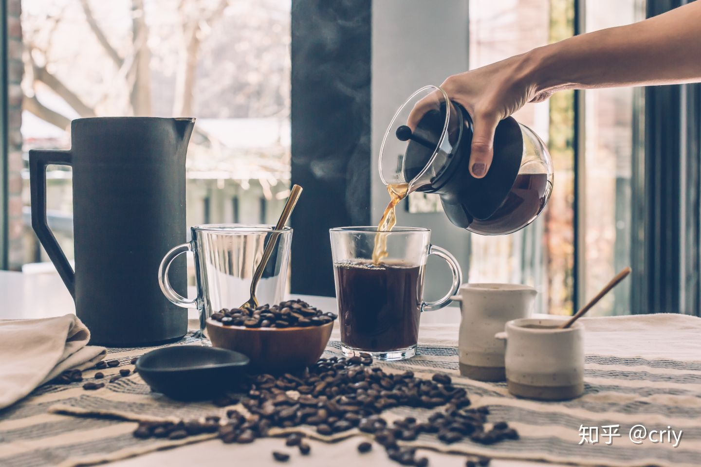

今天的分享主要有三点：

**一、基础知识1：**

咖啡是啥？怎么分类？咖啡店里都有啥？点什么不踩雷？ 

**二、** **基础知识2：**

关于咖啡的那点事

在家喝咖啡的正确姿势

**三、** **进阶知识：**

咖啡好喝在哪里？

如何形容一杯好咖啡？

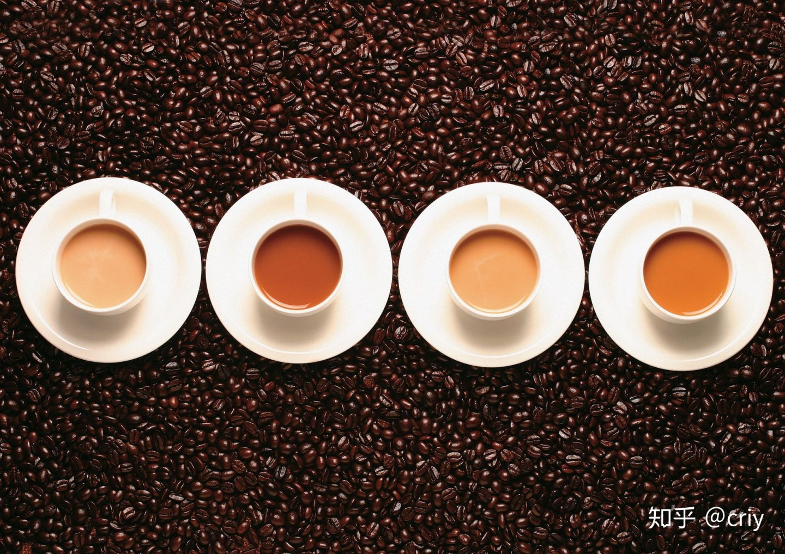

## 首先来看基础知识1，我们来解决以下几个问题：

### **1、** **咖啡是什么？**

咖啡是用咖啡豆制作出来的饮料；

制作之前需把咖啡豆磨碎，或者直接使用已经磨碎的咖啡粉；

咖啡豆来源于咖啡树果实里面的果仁，不要果肉，要果仁；

果仁先简单处理后，一般是日晒或水洗，制成俗称的生豆后在市场交易；

生豆经过烘培（可以简单理解成烤豆子）后就是我们市面上常见的咖啡豆成品；

市面上有各种大品牌和私有工坊的，一般是直接卖豆或者粉碎后的咖啡粉；

放几张图片帮助大家理解：

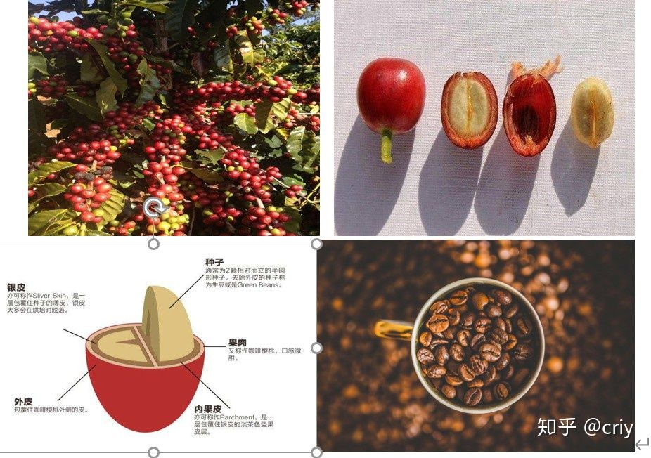

**不踩雷要点：**

**新鲜度很重要，现烘产品一般优于生产时间久的。**

**尽量买豆不买粉。**

**开袋后要密封，带有单向阀的容器好于完全密封的容器，最好一个月内喝完。**

**不要放冰箱冷藏室保存。**

### **2、** **如何分类？**

**最常见的分类方式就是按制作方式分为速溶咖啡和即时制作咖啡两大类**

速溶咖啡是我们最先见到的种类，最常见的品牌就是雀巢，深入人心。可以说中国人的咖啡生活是从雀巢开始的！这里面又分两大类，混合速溶咖啡和纯咖啡粉(冻干工艺较好)。我们最熟悉的就是加了植脂末和糖的混合速溶咖啡了；纯咖啡粉就是大家所说的又黑又苦的东西了

即时制作类（也就是我们说的真正的咖啡）指的是各种咖啡店里现时制作的，或我们自己用咖啡豆或粉制作的咖啡。衍生产品有咖啡浓缩液、挂耳、胶囊等。

**另外一种重要的分类方法是按咖啡豆的种类分：**

主要的品类是阿拉比卡种和[罗布斯塔](https://link.zhihu.com/?target=https%3A//baike.baidu.com/item/%E7%BD%97%E5%B8%83%E6%96%AF%E5%A1%94)种；

阿拉比卡通识上认为品质较好，咖啡因含量相对较低，市面上以此种咖啡居多。

单品咖啡豆主要是以产地和品种命名，有些类似于中国茶的命名“黄山毛峰”；比如埃塞俄比亚瑰夏（一般中间会加上种植园或合作社的名字）一般还会标明生豆的处理方式，和产地的海拔高度等信息。

**不踩雷要点：**

**抛弃混合型速溶咖啡，没有咖啡该有的味道，咖啡因含量还高；**

**非要选择速溶，UCC，摩可纳咖啡，马克西姆勉强还算可以将就的品质，性价比较好，容易买到。**

**市面上大品牌卖单品咖啡豆的较少，市面所售一般都为意式拼配豆（粉），不适合做手冲，细度一般只适合摩卡壶或咖啡机。**

**选对味的咖啡，看懂三项基本信息：产区，处理法、烘培度**

**普遍意义上会认为高海拔地区的豆子品质更好，风味更丰富（不绝对）**

**一般来说单品浅烘，意式浓缩烘培深一点**

### **3、** **咖啡店里一般都有啥？**

咖啡店里的主要三大类：

1、 单品咖啡（就是单品种的咖啡豆制作的）

2、 意式浓缩（各种豆子拼配的，每个店各有特点）

3、 意式浓缩加各种辅助材料（牛奶，奶油、水等）制作的饮品，花样多多，比如浓缩+水=美式；看下面公式图片就明白了。

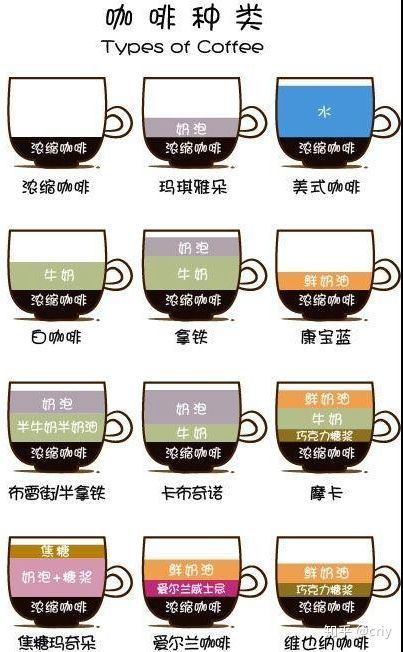

**不踩雷要点：**

**星巴克、Costa、瑞幸三家中，我占costa，起码还坚持用半自动咖啡机**

**冷萃确实比普通美式好喝**

**最保险的点单仍然是拿铁，牛奶会冲淡咖啡的不足，也是咖啡不耐受者的福音**

**私人咖啡馆品质普遍高于连锁店**

**在私人咖啡馆听咖啡师推荐单品，如果没有选择，耶加雪菲是最保险的，曼特宁是最常见的**

**简单的意式浓缩是探店最好的选择**

**如果你没把握确定一家小店的咖啡水平的话，第一件事是观察他们的咖啡机和魔豆机，如果机器是lamarzocco等高档半自动，说明老板对品质有一定的要求，踩雷几率小**

**不要点蓝山和猫屎，99%都没有或是假的**

**咖啡店物料的成本一般只占售价的10-20%**

## **二、基础知识二**

### **1、关于咖啡的那点事**

咖啡这个词来源于阿拉伯语，最初的意思是植物饮料，最开始产地是非洲的埃塞俄比亚，**目前流行的单品耶加雪菲就是埃塞俄比亚当地一座小镇的名字。**

公元13世纪由埃塞俄比亚传入阿拉伯世界，迅速流行，估计伊斯兰教戒酒，作为有刺激性的饮料，自己想流行的理由！一开始很很贵，18世纪初在南美大面积种植后成本下降，变为世界级流行饮品。

目前主要的产区：埃塞俄比亚、巴西、印尼、越南、哥伦比亚，我国主要的产区是云南。

咖啡中含有850多种芳香物质中，大部分只有挥发性，一部分会有水溶性和挥发性两种双向性能，所以闻起来就比喝起来过瘾得多。

关于咖啡因，简单来说它是一种中枢神经兴奋剂，有成瘾性，是应用于最广泛的精神类药品。但是不是要把它视作为洪水猛兽呢？不至于，其实我们经常都在摄入咖啡因，从咖啡、茶叶到苏打饮料和功能型饮料，很多天然和合成的饮料中都能找寻到它的身影，它也是许多感冒药中的常见成分。

**所以，重点是摄入量，尽量不要过量**。每个人受体质的影响，对咖啡因的耐受程度是不一样的，通常来说，每日摄入量最好在300mg以内。下面列举了些常见饮品中咖啡因含量，大家适当参考。

美式咖啡机现煮咖啡（95mg），速溶咖啡（80mg）、红牛功能饮料（80mg）、红茶（45mg）、一罐可口可乐（40mg），浓缩咖啡（27mg）、绿茶（20mg）及热巧克力（19mg）。

**实用的小TIP：**

**个体咖啡因耐受度不是一成不变的**

**咖啡因的副作用常见的是心率加快，睡眠紊乱，恶心呕吐、血压升高**

**奶茶中的咖啡因含量不比咖啡少多少，而且因为杯量较大，一杯差不多顶两杯普通咖啡**

**2、在家喝咖啡的正确姿势：**

**A：便利为主系列：**

**挂耳：**

这是家用最方便的方式，有些像速溶，撕开即冲，有热水就好，不用任何额外的工具，却能给你提供优质的体验，品质由挂耳品牌决定，近年许多私人品牌的涌现，更是提供许多优质的选择，价格通常在2-6元之间。

**咖啡胶囊：**

需买胶囊机，价格几百元到2000元不等，illy是前期的霸主，设计好看，出品品质高。雀巢近年开始发力与这个行业，机器价格低，品质一般。日常消耗品是胶囊，内装的咖啡粉用氮气密封，保证了品质。胶囊的价格通常在4-6元之间。优点就是迅速方便，开机到出品2分钟以内，绝对高效，适合懒人。

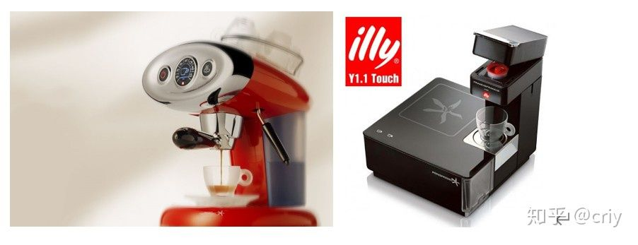

**上面左图的外星人是我在用的一款，推荐**

**全自动咖啡机：**

家用不推荐，虽然方便，但价格较高，家用咖啡耗量较少，咖啡豆的保存是个问题。

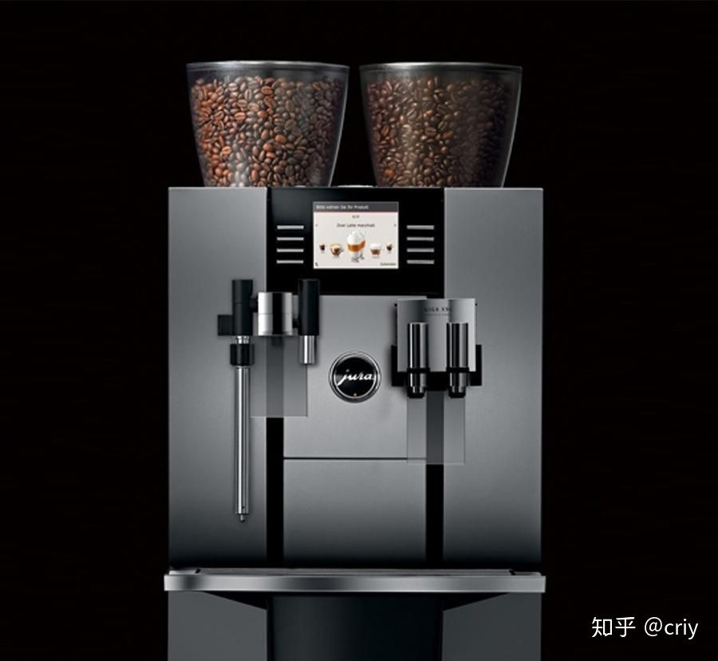

**不踩雷要点:**

**挂耳喝单品，胶囊机、全自动做意式浓缩或美式**

**胶囊机的卡布奇诺、拿铁等都是噱头，极度不推荐，如果确实有需求，建议单独打奶泡，手工的自动的都可以，不贵**

**初期选挂耳、后期上其他器具、不差钱买胶囊机**

**Illy的胶囊机品质远超雀巢，意式浓缩出品可以与咖啡店媲美。**

**雀巢胶囊有反复用的，手工填粉可以节省成本，illy不适用**

**Illy是很牛逼的咖啡品牌，十几年前甚至可以说是商用咖啡豆的品质保证，欧州认同度大**

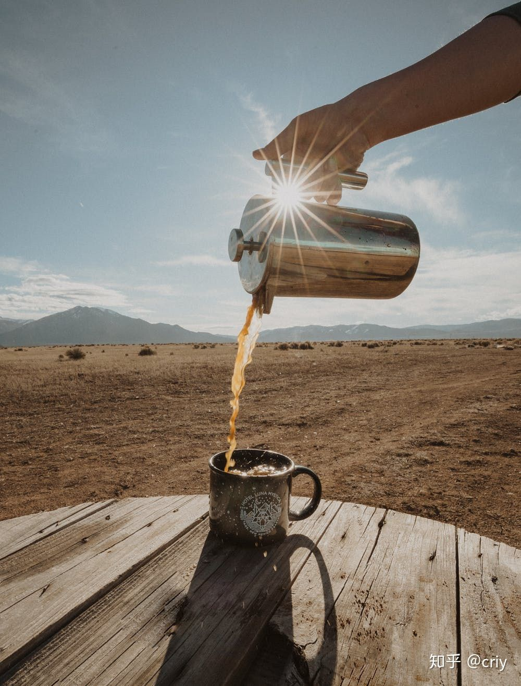

**B：有一定爱好，能体会乐趣，略微麻烦一点，通常十分钟之内搞定。必备工具：咖啡磨；**

### **手冲：**

喝单品咖啡最常见、最适合的方式。原理是滴滤，投入不大，手冲壶、滤纸、滤杯、咖啡容器即可，建议选配电子秤和温度计，能更好的控制出品，不算磨100块以内可以搞定，不必过于追求器具，器具好坏属于锦上添花，出品品质和个人操作手法关系较大。

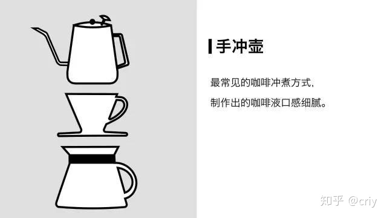

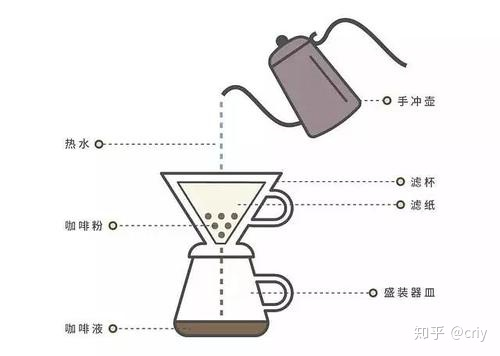

### **摩卡壶：**

没有专业机器时用来制作意式浓缩的简易替代工具，目前有单阀门和双阀门的，简单易操，适用与市面买的品牌咖啡粉，单价100到300块，我用的是下面这一款。

### **法压壶：**

用浸泡的方式，通过水与咖啡粉全面接触浸泡的焖煮法来制作咖啡的简单工具，宜家简单款几十块钱。

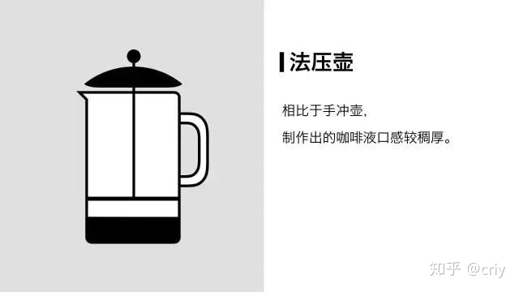

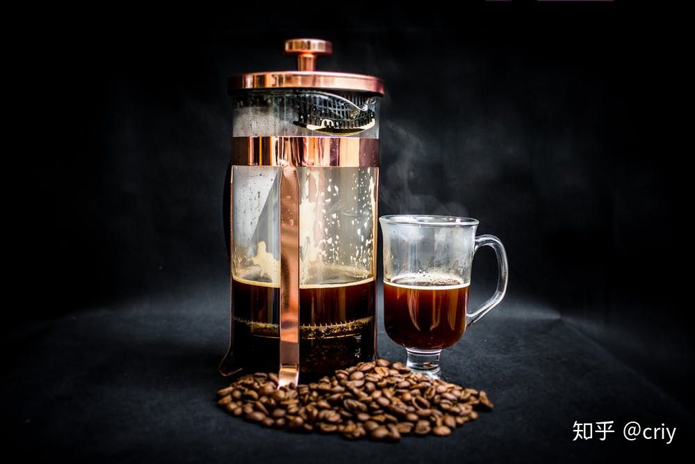

### **爱乐压：**

近些年新出现的工具，易携带，100多块，有基本萃取能力，玩法多变。

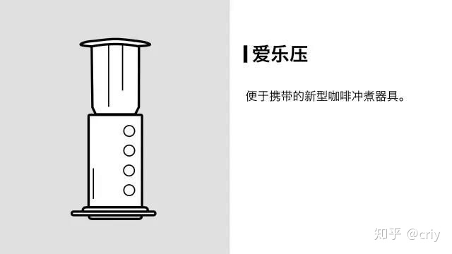

### **半自动咖啡机：**

咖啡玩家终极武器，价格贵，5000起，几十万的也有，一般私人咖啡馆用，个头大，预热时间长，非喜误入。我买过下面这一款，50多斤，费电，相当于一个热水器。

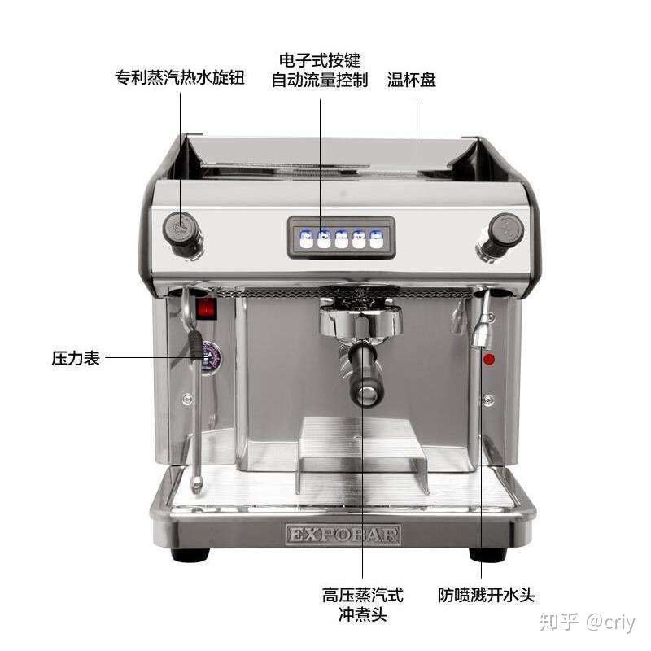我买过的爱宝半自动

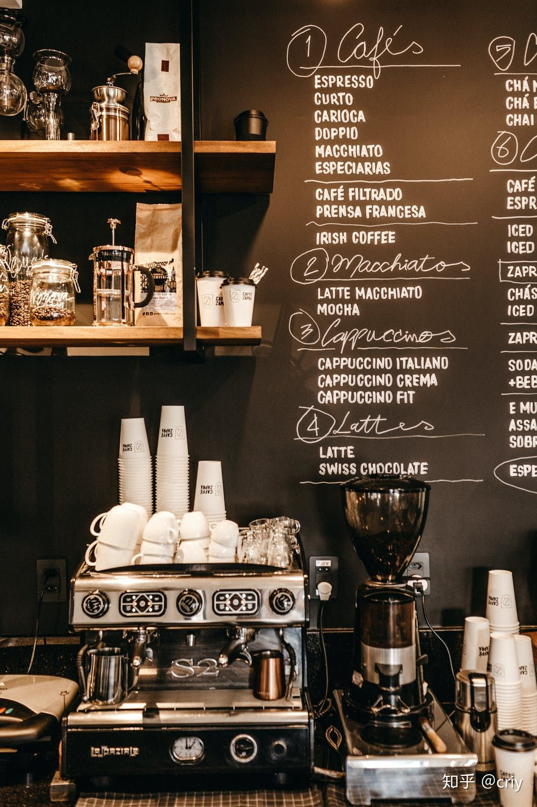咖啡店里的半自动咖啡机

**不踩雷要点：**

**咖啡磨很重要，咖啡磨很重要，自己在家手磨比电动性价比高一些，下面图是我自用一款**

**手冲的咖啡新鲜度尤其重要，没烘培日期的不要买**

**咖啡烘培常见的就是浅，中，深。烘培程度越深，成品体现的油脂越丰富，咖啡本身的气味被掩盖的越狠；意式浓缩一般深烘，手冲豆子一般烘焙较浅**

**手冲多琢磨手法和感觉会给你意外惊喜，绝对比器材升级来的值很多**

**多做，多喝，适合你的才是最好的**

**半自动轻易不要买，德隆最畅销的下面一款是样子货**

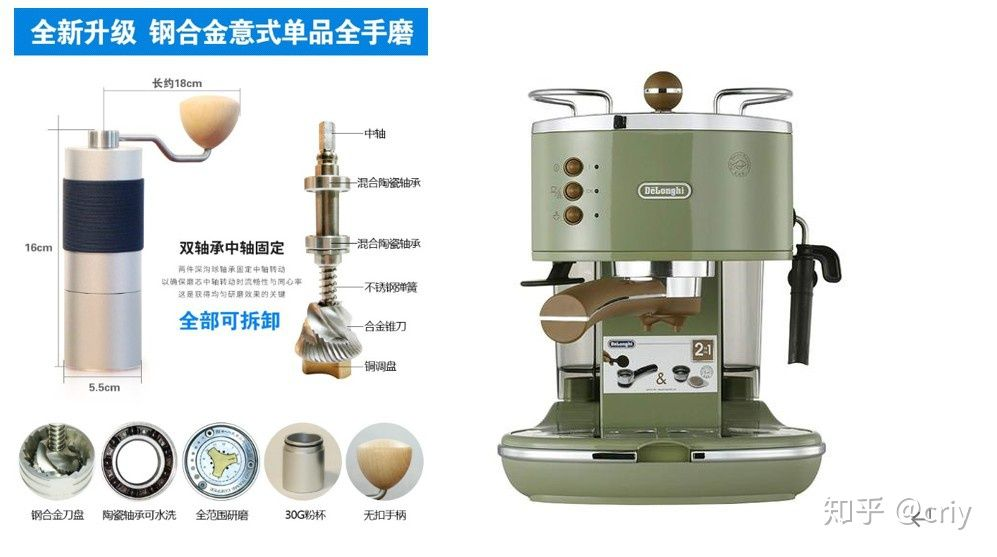这款手磨我正在用，旁边时是朋友买过的德隆欣赏款半自动咖啡机

## **三、** **进阶知识**

### **1、一杯好咖啡的标准**

公认的打分标准是从：嗅觉，包括干香，湿香， 味觉， 酸甜苦咸的平衡， 口感， 顺滑还是粗糙，以及后味（喝完咖啡后的余韵） 来评价一杯咖啡。

总体来说，咖啡的风味是多方位累加的。

**一杯咖啡的风味=咖啡香气+滋味+口感+余韵=干香与湿香+酸甜苦咸+滑顺感与涩感+精神感受**

**香气**：咖啡调配完成后所散发出来的气息与香味。用来形容气味的词包括焦糖味、碳烤味、巧克力味、果香味、草味、[麦芽](https://link.zhihu.com/?target=https%3A//baike.baidu.com/item/%E9%BA%A6%E8%8A%BD)味等等。

**滋味：**

**由味觉感知的酸、甜、苦、咸四种滋味**

**酸味**：与酸碱值无关，是指促使咖啡发挥提振心神、涤清味觉等功能的一种清新、活泼的特质。好的咖啡酸味是活泼酸，一种活泼、明亮的风味表现，有点类似于葡萄酒品评中的形容方式，入口只是开始会感觉到酸，会随即淡下来，甜味开始上升，不是一路酸到底。

**甜味**：分为酸甜和清甜，是难得的开心滋味，因为甜味经常被其他三种滋味所干扰，在咖啡中很少能被体现出来。如果想要喝到一杯甜味的咖啡（不是外部添加的），那得满足两点，一是需要得有好的生豆(蔗糖与氨基酸含量高于平均值)，二是需要完美烘培，意式浓缩咖啡的回甘也是甜味的一种反应。

**苦味**：苦是一种基本味觉，感觉区在舌根部分，好咖啡的苦味有点浓而不苦、浑厚甘醇的感觉，而不是涩苦、酸苦、焦苦、这是一般是提取过度而造成的，我们经常感觉到的苦味大多是深度烘焙刻意营造出来。

**咸味**：一般在酸味和甜味的遮挡下，并不会体现出来。若是喝的咖啡有明显的咸味，那么这杯咖啡一般是有问题的，大多是咖啡豆时间太长，若是加热过度造成的。

**口感：**

**影响口感主要有两种：醇度与涩感。**

**醇度：**也就是顺滑感，是喝咖啡后舌头留有的感觉，是由不溶于水的咖啡油质与纤维质所表现出来的口感。这两种物质含量越多，口感也就是越顺滑，咖啡的味道也就越好。醇度的变化可分为清淡到如水到淡薄、中等、高等、脂状。下图是品质好的意式浓缩。

油脂丰富的意式浓缩

**涩感**：则是与醇度相反，它指的是入口所感受到的粗糙感觉，这种涩是一种触感、一种痛感，这样的涩感越多，咖啡的味道就会越差。

**余韵：通常是指味道与香气的结合，喝完后口中的味道回味，有些偏主观的感觉，这里就不多说了。**

**2、如何形容一杯咖啡？**

通常我们可以从以下的几个角度来形容：

看起来是什么“色”（视觉）、闻起来是什么“香”（嗅觉）、尝起来是什么“味”（味觉）、喝起来是什么“质”（触觉）。

至于各个感觉的词，多背背吧，背的多了，你就是专家了，我就不在这班门弄斧了。

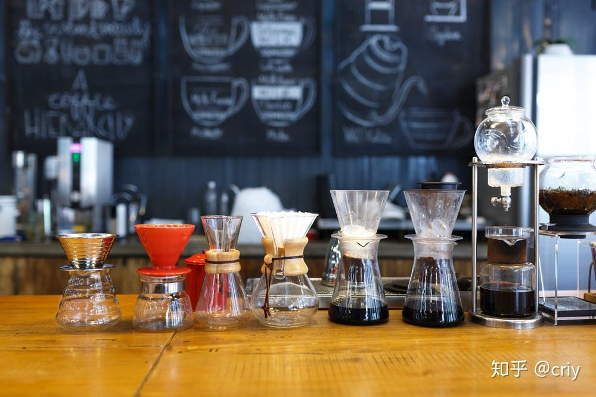

**到这里，我今天的分享也接近尾声了，再唠叨几句没有用的：**

关于咖啡的知识纷繁复杂，想要真正了解它得花上相当长得时间，相信你听说过1万小时理论，没错，这个行业也符合一万小时理论的通识。

也许你会说骂这个骗子，你开头不是说很简单吗？ 对也不对，让周围得人觉得你是这个领域的达人，和真正成为这个领域的专家中间的差距有十万八千里。

但人们往往对不了解的知识没有具体的量的概念，作为99%的人，都是外行，他们不具备判断你真实水平的能力，只要你表现的专业，简单入门的知识就足以让他们产生错觉。

这里的每篇技能培训文章，能让你成为大众眼里的专业人士，虽然只是入门而已。

**由于一直是个咖啡成瘾者，有一些身边的朋友觉得我是专家，想我能普及些常识，所以有了这个系列，他们都不知道我其实是个骗人的专家，只是由于喜欢，走得稍远一点。**

回头我再和大家聊聊看起来更唬人的知识，比如：

## **国内咖啡业界状况**

## **国际考核咖啡师的标准**

## **影响咖啡萃取的真正关键点**

## **咖啡器具的不同对口感的影响**

以及常见咖啡器具，我常喝的几款豆子等等。

**好了，山高水远再相逢！！**

**最后祝愿大家都能找到属于自己的那款咖啡、那个人。**

千万别得文艺青年的三宗病：

开间不赚钱的咖啡馆，有个不切实际的音乐梦，总想放下一切去流浪。

**喜欢但别沉迷、眼里有光、心中有火，这个世界会更期待有趣的你**

