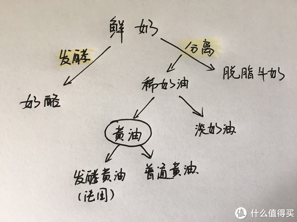

## 加工产生




## 分类


炒菜用的黄油有的可以用于烘焙，有的不能用。
具体可以从黄油的种类看：

1. 无盐黄油（Unsalted Butter）：指纯天然的黄油，不加任何佐料，又被称作“甜性奶油”，是最常见也是最常用的黄油类型。这种黄油有很多用途，不仅能用于制作烘焙产品，比如黄油面包、黄油饼干、蛋糕等，还能用在一般的烹饪煎炸中，之前邦利试过黄油煎鸡蛋，味道非常香，不过吃太多会很腻，在很多的英式早餐中就有这么一道菜，叫做 Scrambled Eggs （黄油炒蛋）。

2. 有盐黄油（Salted Butter）：有盐黄油是在黄油的制作过程中添加了适量的盐，一般用来直接抹在面包上食用。做烹饪煎炸用也可以，如果要做甜点就不适合了，黄油中本来就有咸味，跟甜品的味道不符。

3. 有机黄油（Organic Butter）：有机黄油原料来自于有机牛奶，之前邦利在英国的牛奶一文中详细介绍过有机牛奶，其制作方法跟其他黄油没有区别。有机黄油也分为有盐和无盐的，使用方法和口感都跟正常黄油没太大区别。

4. 涂抹型黄油（Spreadable Butter）：这款也是英国超市很常见的，不是100%动物脂肪(Butter 
Milk)，制作过程中会添加一定的植物油，有时候还会添加一些其他的香料。可涂抹的黄油质地柔软，即使是冷藏后质地也不受影响，一般用于直接涂抹到面包上食用，不适用于烘焙或者烹饪使用。

5. 低脂黄油（Light Butter）：顾名思义就是脂肪含量比普通的黄油低，一般在40%左右，热量也只有普通黄油的一半，60%都是由水、乳酸和其他填料组成。同样也不适用于烘焙或者烹饪使用。

6. 羊奶黄油（Goats Butter）：以羊奶为原材料做成的黄油，跟牛奶黄油比起来营养成分更高，也更有益于人体消化和吸收，当然价格也相对较贵。


### 分类小结


* 直接摄入
  * 涂抹
  * 低脂
* 加工摄入
  * 无盐
    * 烹饪
    * 烘焙
  * 有盐
    * 烹饪


* 增强

  不影响上述分类
  
  * 有机
  * 羊奶


## 采购


### 品牌对比


* **颜色（黄→白）**

  **威士宝 > 恩蓓可 > 金凯利 > 安佳 > 爱登森林 > 多美鲜> 银宝 > 总统**

* **生吃口感** 

  **安佳 > 总统 > 恩蓓可 > 金凯利 > 威士宝 > 银宝 > 多美鲜 > 爱登森林**

  ```
  总 统
  入口即化，黄油香味浓郁，发酵味也较明显
  
  银 宝
  入口即化，香气挥散较快
  
  多美鲜
  入口即化，香气挥散较快
  
  爱登森林
  有微微香气，乳香味过重，有点类似添加物
  
  安 佳
  化口性好，有黄油余香
  
  金凯利
  入口即化，香气较浓郁
  
  恩蓓可
  较香的黄油香气，口感天然
  
  威士宝
  入口即化
  ```

* **（做曲奇）塑性能力（强→弱）**

  **恩蓓可 > 多美鲜 > 金凯利 > 安佳 > 爱登森林 > 威士宝 > 总统 > 银宝**

  ps.一般来说，油脂含水量越大，曲奇塑形效果越差，成品纹路越不清晰。

* **（做曲奇）试吃口感**

  **安佳 > 银宝 > 爱登森林 > 威士宝 > 恩蓓可 > 金凯利 > 多美鲜 > 总统**

  ```
  总 统
  口感比较清爽，不够脆，有点粘牙
  
  银 宝
  酥脆度较好，香气浓郁
  
  多美鲜
  酥脆度不足，香气缺乏，入口有点难下咽
  
  爱登森林
  酥脆度较好，香气偏淡，口感比较清爽
  
  安 佳
  酥脆度好，黄油香气浓郁
  
  金凯利
  口感较松软，容易掉渣
  
  恩蓓可
  黄油香气不足
  
  威士宝
  黄油香气较浓郁
  ```

  


* **购入性价比排名（由高到低）**

  爱登森林＞威士宝＞[多美鲜](https://pinpai.m.smzdm.com/2913/)＞安佳＞银宝＞总统

* **颜色（由浅至深）**

  总统＜银宝＜多美鲜＜爱登森林＜威士宝＜安佳

* **奶香味（由浓到淡）**

  总统＞银宝＞爱登森林＞多美鲜＞威士宝＞安佳

* **生吃口感排名（最好吃到不好吃）**

  总统＞多美鲜＞威士宝＞银宝＞爱登森林＞安佳

  ```
  总统黄油：闻着奶香浓郁，舌尖留着时间长，口感细腻，清香不油腻，入口即化
  
  银宝黄油：感觉味道中庸，稍微有点腻，需要喝口水缓解一下
  
  威士宝：口感稍微有点腻，奶味一般；
  
  安佳黄油：有点膻味，腻歪
  
  多美鲜黄油：入口即化，奶香味较淡
  
  爱登森林黄油：口味比较淡，中庸
  ```

* **黄油打发后口感排名（好吃到不好吃）：**

  总统＞威士宝＞安佳＞银宝＞多美鲜＞爱登森林

  ```
  银宝黄油：口味清淡，有股不一样却说不出来的伟大（真怀疑自己买到了假银宝）
  
  威士宝黄油：感觉口感不错，
  
  总统黄油：好吃，入口即化，可以很快打成轻盈的羽毛样。这时候好想抹一块面包吃吃，要不咱们测评就此over,咱不做曲奇了，好咩？
  
  安佳黄油：味道也不错，但是吃完舌尖上有点腥味；
  
  多美鲜黄油：为什么变成了一滩稀泥，稍有点腻
  
  爱登森林：变成一滩水，没有奶味。
  ```

* ## 曲奇盲测

  ### 山贼君

  **评测结论：**银宝＞威士宝＞总统＞安佳＞多美鲜＞爱登森林

  ### 山贼夫

  **评测结论：**总统＞银宝＞威士宝＞安佳＞爱登森林＞多美鲜

  ### 小区物业美女盲测

  **综合排名：**（喜欢吃酥脆的口感）威士宝＞多美鲜＞总统＞银宝＞爱登森林＞安佳

  ### 路人盲测

  **综合排名：**总统＞银宝＞威士宝＞安佳＞爱登森林＞多美鲜

* ### 配料表分析

  1、测评的几款黄油当中，只有安佳含有反式脂肪酸。关于反式脂肪，世界卫生组织建议每天摄取量不超过食物总热量的1%（大约2克）。所以微量的凡是脂肪摄入也没那么可怕。**但是如果又更好选择或者说可以避免的时候还是不吃为妙。**

  2、从黄油家谱中看到黄油分为普通黄油和发酵黄油。不难发现，总统黄油配料表里有发酵剂。作为普通黄油和发酵黄油，有何区别。接下来的分析也许会帮助您有更好了解如上的评比结论。

  > 1）普通黄油的外包装显示使用的原料是稀奶油和水。而在原料表中写明使用酵母的，基本就是发酵黄油。2）经过酵母的发酵可以使黄油的乳脂产生一种奇特的酸味，更像酸奶的味道，非常清淡并带有奶香。3）发酵黄油的颜色是类似香草冰激凌的奶白色，而普通黄油的颜色要更黄，接近柠檬冰激凌的颜色。4）发酵黄油的质地相比于普通黄油来说要软很多，有点像用来做芝士蛋糕的Cream   Cheese奶油芝士。在常温下，用刀的侧面去按压，很容易就将发酵黄油压扁，而普通黄油需要用大拇指按压才能压扁变形。这种柔软的质地使得发酵黄油很适合用于涂抹在面包或司康之类的西点上。用质地柔软的发酵黄油涂抹在面包上，非常地轻松方便，而且也抹得很均匀。5）普通黄油和发酵黄油在品质上并无优劣之分很多人都喜欢用发酵黄油制作各式西点，来增添成品中的风味，比如玛德琳、费南雪等法式西点在制作时都可以用发酵黄油来替代普通黄油。相比于普通黄油，发酵黄油几乎入口即化，那感觉有点像[巧克力](https://m.smzdm.com/fenlei/qiaokeli/)融化，而且奶香味要比普通黄油要浓一些。6）不过发酵黄油的也有自身的弱点。因为质地柔软，所以在制作像羊角面包Croissant之类的酥皮面包上，起酥的效果并不是非常理想。由于用作起酥的黄油需要质地相对较硬，而发酵黄油在叠油开酥皮的过程中很容易融化在面团里。

* 综合排名、结论

  总统 > 威士宝 > 银宝 > 安佳 > 多美鲜 > 爱登森林

  1. 如果想做出好吃口感的曲奇，还是推荐购买总统，也更加容易打发；
  2. 性价比方面威士宝胜出，可以作为第二梯队的品牌考虑。
  3. 貌似这次安佳的测评效果并不是很理想，加上反式脂肪的名头，可能并不推荐购买，尤其是某宝上的分装。

