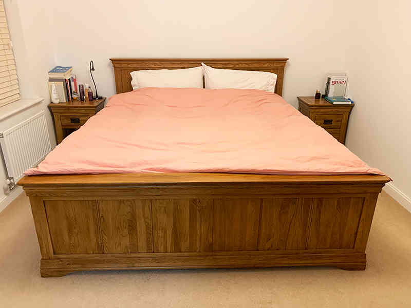
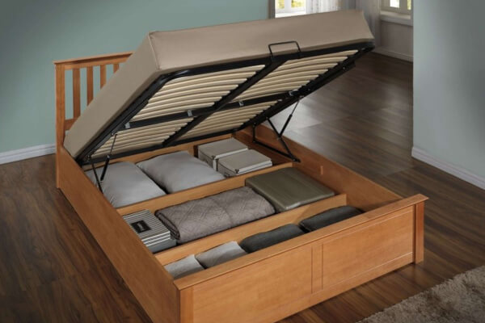
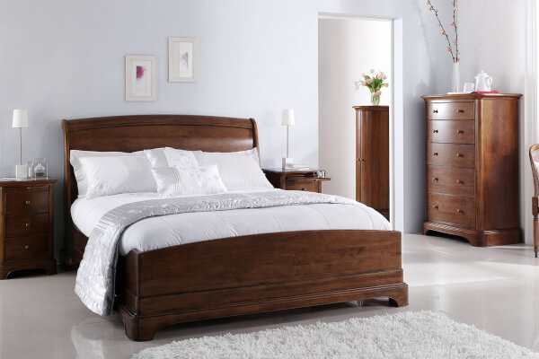

# 在英国如何买床架

------

​                作者:                [                   邦利                 ](https://www.bangli.uk/posts?user=1)

3K+0[评论](https://www.bangli.uk/#)

​                2020-12-16 更新                              2020-10-23 发布              

------

目录

- 如何选择床架
- 床架的分类
- 英国哪里买床？

------

------

一张舒适的床包括三个部分：床架、床垫和床上用品。之前邦利写过[如何在英国购买床上用品](https://www.bangli.uk/post/296100/)、[中英床上用品尺寸比较](https://www.bangli.uk/post/12741)、以及[如何在英国买硬床垫](https://www.bangli.uk/post/284197)，今天我们来聊一聊床的另外一个重要组成部分：床架！

## 如何选择床架

### 床的尺寸

床的尺寸一般根据卧室大小来定。英国床架的尺寸一般有以下几种：

| Size                  | Metric        |
| --------------------- | ------------- |
| Small Single          | 75cm x 190cm  |
| Single                | 90cm x 190cm  |
| Small Double          | 120cm x 190cm |
| Double                | 135cm x 190cm |
| King Size             | 150cm x 200cm |
| Super King            | 180cm x 200cm |
| European Small Single | 80cm x 200cm  |
| European Single       | 90cm x 200cm  |
| European Double       | 140cm x 200cm |
| European King Size    | 160cm x 200cm |

我家客房的床是150*200cm的，主卧的床是180*200cm。英国的床尺寸都比国内小，如果是单人睡可以选择Double的，双人睡尽量选择King Size以上的。

### 床的高度

床的高度一般指加上床垫后的高度，太高太低都不利于上下床。可以拿膝盖作为衡量标准，坐在床上，脚可以着地就是最适合的高度了。

### 床的材质

床的材质是很重要的考虑因素。按照材质来说，英国的床主要分木制床、布艺床和铁艺床，具体选哪一种，我们下面会详细说。

我们家当时在买床时，我和先生就产生了很大的分歧，我喜欢布艺床的温暖和舒适，而他喜欢实木床的质感和稳固，最后协商后达成一致，买一张实木的，一张布艺的。

### 床的设计

除了床架外形风格的设计外，小户型用户还要考虑是否有收纳空间。我之前在租房的时候，由于房子比较小，床下的收纳空间就发挥了非常大的作用。

## 床架的分类

### 木制床架

木制床架是英国市场上种类最多，也是最受欢迎的床架。根据使用的木材不同，价格相差很大。有实木的，也有复合木板的；从环保安全和稳固耐用的角度，我们首选肯定是实木的，但实木也分好多种，价格差别也很大，比如橡木、樱桃木、黑胡桃木这些比较高端的木材，床架都比较贵；而松木、山毛木、桦木等价格就便宜很多。

△我家主卧的橡木实木床架

木制床架清晰自然，容易百搭，各种颜色和风格的都有，但是一定要购买实木的，经久耐用，稳定性好。

优点：天然环保、坚固耐用。

缺点：实木价格较贵，尤其是好的实木，比如橡木、樱桃木等。

#### 橡木床架

[购买链接](https://www.awin1.com/cread.php?awinaffid=210595&awinmid=3&clickref=296129&platform=dl&ued=https%3A%2F%2Fwww.johnlewis.com%2Fjohn-lewis-partners-calia-bed-frame-double-oak%2Fp4201253)

推荐理由：橡木实木；北欧极简风设计；经典百搭。

这款是John Lewis很受欢迎的一款Double Size床架，北欧极简风设计，床架的主体是橡木，底座用的是铸铁架子，坚固稳定，简约百搭。镂空的床底，吸尘器可以直接进入清洁。

#### 橡胶木床架带储物空间

[购买链接](https://www.awin1.com/cread.php?awinaffid=210595&awinmid=7807&clickref=296129&platform=dl&ued=https%3A%2F%2Fwww.mattressnextday.co.uk%2Fbirlea-phoenix-oak-ottoman-bedframe)

推荐理由：橡胶木；收纳空间大；性价比高。

这款实木床架具有开放式底座，收纳空间很大，有两个尺寸：135*190cm和150*200cm，床架用的是橡胶木，虽然不如橡木硬度大，但橡胶木也是当下非常受欢迎的家具材料。

#### 樱桃木床架

[购买链接](https://www.awin1.com/cread.php?awinaffid=210595&awinmid=7807&clickref=296129&platform=dl&ued=https%3A%2F%2Fwww.mattressnextday.co.uk%2Fwillis-gambier-lille-bed-frame)

推荐理由：樱桃木和赤杨木，坚固耐用，设计复古、优雅大气

这款床架就很漂亮了，喜欢法式优雅复古设计的可以考虑。床架采用的是美国樱桃木+赤杨木，两种都是非常坚固耐用的高端木材，手感细腻，天然的纹理特别漂亮。温暖的木质色调，光滑细腻的打磨，让原木有了几分细腻流畅的线条，更显温馨；床架是整木拼接的，没有用螺丝钉，结构稳固，保留了原木之美，超级有质感、有调调。床架边缘也被打磨得圆润光滑，防止磕碰。有弧度设计的靠背板，给背部提供有力支撑，提高舒适性。

再搭配一张[Mammoth Extra Firm](https://www.awin1.com/cread.php?awinaffid=210595&awinmid=7807&clickref=296129&platform=dl&ued=https%3A%2F%2Fwww.mattressnextday.co.uk%2Fmammoth-shine-essential-extra-firm-mattress)的硬床垫、[The White Company](https://www.awin1.com/cread.php?awinaffid=210595&awinmid=4802&clickref=296129&platform=dl&ued=https%3A%2F%2Fwww.thewhitecompany.com%2Fuk%2Fc%2Fbedroom)的床上用品，这才是品质生活该有的样子。

这款床架提供三种尺寸，135*190cm，150*200cm，180*200cm。

#### 松木床架，带抽屉

[购买链接](https://amzn.to/2HwHXBc)

推荐理由：松木，便宜，有收纳空间，适合出租房。

像这种比较便宜的松木床架，价格不贵，款式很好看，白色床颜色亮丽，有提升全屋光线，扩充视线的作用。还有四个抽屉，可以收纳很多物品，很适合小户型，或者是出租房。

#### 可折叠床架

[购买链接](https://www.awin1.com/cread.php?awinaffid=210595&awinmid=7807&clickref=296129&platform=dl&ued=https%3A%2F%2Fwww.mattressnextday.co.uk%2Fbedmaster-tyler-white-guest-bed)

推荐理由：灵活多变、节约空间，适合小户型。

这款是可折叠式双人床，很适合小户型，或者摆放到客房、书房，也可以当儿童床。平时是一张单人床，有客人的时候把下面的架子拉出来，秒变双人床。

#### 榻榻米带抽屉和书架

[购买链接](https://www.awin1.com/cread.php?awinaffid=210595&awinmid=3329&clickref=296129&platform=dl&ued=https%3A%2F%2Fwww.made.com%2Fmade-essentials-kano-super-king-size-platform-bed-with-storage-drawers-pine)

推荐理由：榻榻米，现代简约设计，适合小户型或者阁楼。

最近几年非常受欢迎的榻榻米床，设计非常简约，带抽屉和书架，释放卧室空间。非常适合喜欢现代简约风的年轻人，公寓、小户型、阁楼改卧室都可以搭配榻榻米。

### 布艺床架

相比硬朗的木制床架，布艺床架就更加温暖柔和了，既可以避免磕碰，又能带来自然舒适的触感。在国内，布艺床架要比木制床架更受欢迎，我个人也是更喜欢布艺床架的，尤其是靠背，暖暖的、软软的，睡前靠着看（刷）看（手）书（机），也是非常舒服的。不过也有实木床架搭配布艺靠背的，坚固耐用，又不失温暖舒适。

△我家客房的布艺床架，带四个抽屉

优点：美观、舒适、温暖。

缺点：不易清理，寿命短。

#### 简约式布艺床架

[购买链接](https://www.awin1.com/cread.php?awinaffid=210595&awinmid=3&clickref=296129&platform=dl&ued=https%3A%2F%2Fwww.johnlewis.com%2Fjohn-lewis-partners-rouen-upholstered-bed-frame-super-king-size%2Ferin-damson%2Fp3833193)

推荐理由：坚固耐用、简约百搭、多色可选。

这款是John Lewis 最受欢迎的简约款布艺床架，没有累赘的设计，外层是棉麻包裹，手感细腻，质朴自然、透气排汗。四个脚是实木的，床体稳固，受力均匀，不论是平躺还是翻滚，都能得到很好的支持，带来舒适的睡眠。布艺的颜色高达24种，大家可以根据自己房间的装修风格选择搭配的颜色。

#### 布艺床架带四个抽屉

[购买链接](https://www.awin1.com/cread.php?awinaffid=210595&awinmid=7807&clickref=296129&platform=dl&ued=https%3A%2F%2Fwww.mattressnextday.co.uk%2Fbirlea-mayfair-bedframe)

推荐理由：带收纳抽屉、坚固耐用、双层靠枕设计，加倍舒适。

这款布艺床垫的亮点在双层加厚靠枕设计，有助于颈椎和腰部的放松；还带四个抽屉，小户型最爱的收纳空间。

#### 橡木床架+布艺靠背

[购买链接](https://www.awin1.com/cread.php?awinaffid=210595&awinmid=7807&clickref=296129&platform=dl&ued=https%3A%2F%2Fwww.mattressnextday.co.uk%2Fbirlea-ritz-oak-bedframe)

推荐理由：橡木床架、亚麻织物加厚靠枕、极简设计，简约百搭。

这款床架的主体结构是橡木，保留了橡木天然的纹理，非常漂亮，环保有质感。床架设计简约大方，底部镂空，方便清洁；床头板采用的是亚麻布艺靠背，带来更高的舒适性。

喜欢木制床架的稳固耐用，但又喜欢布艺靠背的温暖舒适的，就很适合买这款。

#### 橡木框架+布艺沙发床

[购买链接](https://www.awin1.com/cread.php?awinaffid=210595&awinmid=3329&clickref=296129&platform=dl&ued=https%3A%2F%2Fwww.made.com%2Flars-click-clack-sofa-bed-darby-green-and-walnut-stain)

推荐理由：多功能沙发床，设计简约，质感一流。

小户型最爱的沙发床，靠背立起，是简洁利落的沙发，坐垫拉开，靠背放平，成了一张舒适的双人床，两用多功能，客厅卧室随意切换。

沙发架子是橡木的，打磨得光滑细腻，有橡木的天然纹理，非常漂亮。“只”字扶手架，耐用、稳固、支撑力好；高弹海绵座包，提供高舒适性，长久使用也不会变形。有三个颜色可以选择。

### 铁艺床架

铁艺床架分纯铁艺和混合铁艺的。纯铁艺的床架一般比较小巧，节约空间，但是耐用性和稳定性略差，金属给人的直观感受是冷、硬，不够温馨，靠背也不舒服，不适合喜欢在床上阅读或者看电视的人，我个人也是不太建议入手纯铁艺床架的，翻身都会咔咔响，除非你买质量非常好的铁架子。

[购买链接](https://www.awin1.com/cread.php?awinaffid=210595&awinmid=7807&clickref=296129&platform=dl&ued=https%3A%2F%2Fwww.mattressnextday.co.uk%2Ftime-living-chrome-edward-bed-frame)

### 皮质床架

最近几年，皮质床在国内非常流行，不过在英国见得还真不多。皮质床分真皮和人造皮，真皮当然好，高端大气上档次，但是价格贵啊；人造皮价格便宜，但是你懂的，就像真皮沙发和人造皮沙发的区别，坏了一点点就非常难看。所以，没啥预算，就不要打皮质床的念头了。

## 英国哪里买床？

英国的各大家具卖场都可以买到床架，如果你有时间有条件，可以去现场看看，感受一下床架的高度和质量，如果想在网上购买，邦利给大家推荐几个我个人比较喜欢的家具卖场，都是买床架和床垫的好地方！

### 1. mattressnextday

这家是我推荐过好多次的英国专业卖床垫的地方，他们家有Extra Firm（硬度最高）的床垫。英国很多华人反应英国的床垫太软，就可以到他们家来买[Extra Firm](https://www.awin1.com/cread.php?awinaffid=210595&awinmid=7807&clickref=296129&platform=dl&ued=https%3A%2F%2Fwww.mattressnextday.co.uk%2Fmattresses%2Ffirmness-extra-firm)的。

除了床垫，他们家也有配套的床架，木制的、布艺的、铁艺的都有，低端的、高端的都有。如果在他们家买床垫，也可以顺便买床架，同时送货上门，安装也方便。他们家最大的优势是第二天送货上门，英国的很多家具店送货要一两个月的，这家非常高效。

他们家还支持零利息分期付款，如果一次性消费太多，这样支付就毫无压力了。

官网：[https://www.mattressnextday.co.uk/](https://www.awin1.com/cread.php?awinaffid=210595&awinmid=7807&clickref=296129&platform=dl&ued=https%3A%2F%2Fwww.mattressnextday.co.uk%2F)

### 2. made

这家是最近几年发展飞速的家具电商平台，被誉为家居界的艺术家，在伦敦开设了两个展厅，支持可定制家具。他们家的家具设计都非常现代简约，很符合当下年轻人的审美。床架种类和款式都很多，除了传统的床架，他们家还有很多非常现代摩登的网红沙发床，很适合小户型的选择。

除了成品，他们家也支持高端定制，你可以按照自己的要求来定做床架和床垫。

官网：[https://www.made.com/beds](https://www.awin1.com/cread.php?awinaffid=210595&awinmid=3329&clickref=296129&platform=dl&ued=https%3A%2F%2Fwww.made.com%2Fbeds)

[ Made家具满£300-£30，满£1000-£100 made.com 被誉为家居界的艺术家，他们家的家具设计感爆棚，时尚简约，非常复合当下年轻人的审美，不仅设计前卫，质感还一流，大到餐桌、沙发、书架、床架，小到室内装饰品，一应俱全，每一个细节都是生活态度的精致体现。大理石材质小闹钟、拼色无刻度挂钟、明黄色复古垃圾桶、不规则墙壁挂灯、床品套装、桌椅套组等等！分分钟提升你的生活品质~想要改造家居环境的，没事可以来逛逛。全场满£300-£30。](https://www.bangli.uk/deal/577109)

### 3. John Lewis

英国分布最广的高端综合型百货，也是我最喜欢的一家百货店，高品质，服务好，我们家的家电都是在John Lewis买的。如果你们家周边也有实体店，可以到现场试睡床垫，不过他们家床垫没有Extra Firm的。床架款式很多，设计也很漂亮，送货上门。手残党还可以加£29购买他们家的安装服务。

官网：[https://www.johnlewis.com/](https://www.awin1.com/cread.php?awinaffid=210595&awinmid=3&clickref=296129&platform=dl&ued=https%3A%2F%2Fwww.johnlewis.com%2Fbrowse%2Ffurniture-lights%2Fbedroom%2Fbeds%2F_%2FN-c7o)

