# 美国床上用品购买指南

最近更新：2019年11月

美国买床上用品是叫人头疼的事，除了尺寸不同，各种花式名称也叫人看的云里雾里，这篇除了会列出强大对照表之外，还有材质的讲解。

目录

- 01/ 咕噜推荐的床上用品
- 02/ 铺盖单品
  - [被子组](#section-2-1)
  - [床罩组](#section-2-2)
  - [薄被组](#section-2-3)
  - [毯子组](#section-2-4)
  - [其他](#section-2-5)
- 03/ 枕头单品
  - [枕套 Pillow Case 和 Pillow Sham 究竟有什么区别？](#section-3-1)
  - [睡觉用枕 Sleeping Pillow](#section-3-2)
  - [装饰枕 Decorative Pillow](#section-3-3)
  - [抱枕 Body Pillow](#section-3-4)
  - [经典美式枕头搭配方案](#section-3-5)
- 04/ 套装
  - [中美铺床习惯大差异](#section-4-1)
  - [ Sheet Sets](#section-4-2)
  - [Comforter Sets](#section-4-3)
  - [Duvet Cover Sets](#section-4-4)
  - [Quilt Sets](#section-4-5)
  - [Bed in a Bag Sets/ Complete Comforter Sets](#section-4-6)
  - [我应该选择哪种套装？](#section-4-7)
- 05/ 材质
  - 棉 Cotton
    - [埃及棉 Egyptian Cotton](#section-5-1-1-1)
    - [匹马棉 Pima Cotton](#section-5-1-1-2)
    - [陆地棉 Upland Cotton](#section-5-1-1-3)
  - [亚麻 Linen](#section-5-2)
  - [丝绸 Silk](#section-5-3)
  - [竹纤维 Bamboo](#section-5-4)
  - [法兰绒 Flannel](#section-5-5)
  - [天丝 Tencel](#section-5-6)
- [06/ 中美床的规格比较](#section-6)

美国床上用品纷繁复杂，没有床垫和枕芯的先从下文了解起：

**[美国床垫选购指南](https://www.guruin.com/guides/mattress)**

手把手教你认识床垫大小事，分析美国床垫尺寸、床垫结构分析、挑选方法与选购注意细节。

[查看详情](https://www.guruin.com/guides/mattress)

36.3k

13

**[美国枕芯选购指南](https://www.guruin.com/guides/pillow)**

教你认识枕芯/枕头大小事，分析美国枕芯/枕头类型、填充物、挑选方法与选购细节，助你一夜好眠睡得超安稳。

[查看详情](https://www.guruin.com/guides/pillow)

12.7k

3

当你打开家居网站想买一套床品时，这个分类是不是已经傻了……那就先跟随我们，做点功课吧～

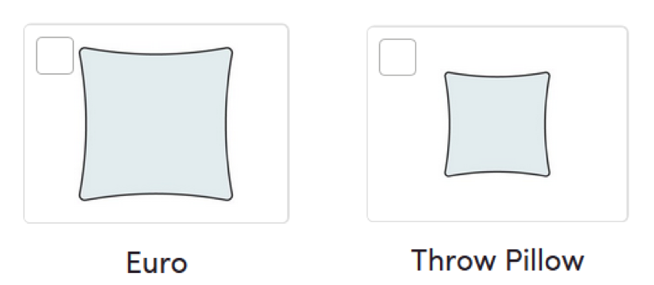

target.com Bedding的分类

## 01/ 咕噜推荐的床上用品

[纯棉柔软透气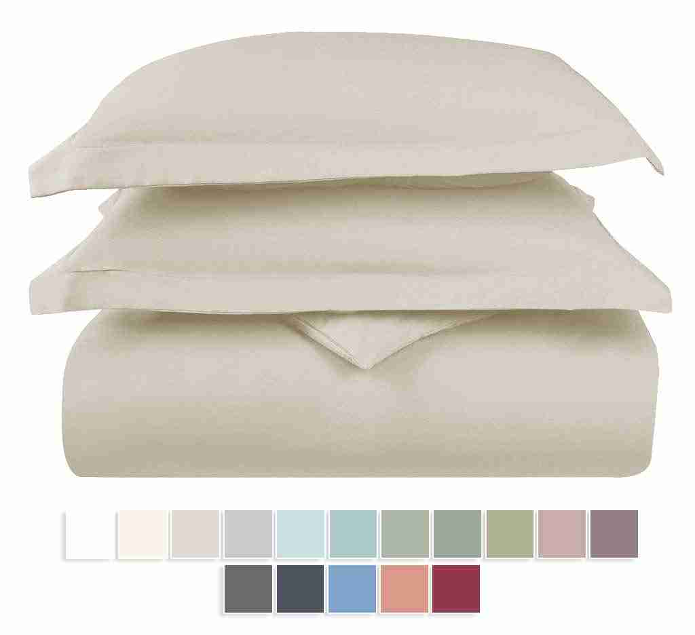PizunaPizuna 400织纯棉Duvet Cover组$42.99立即购买纯棉材质，棉缎细腻柔软且透气，平价享受酒店等级质量，拥有破千评价平均4.4星好评。多色可选。](https://amzn.to/2GDL7ip)[近万评价4.3星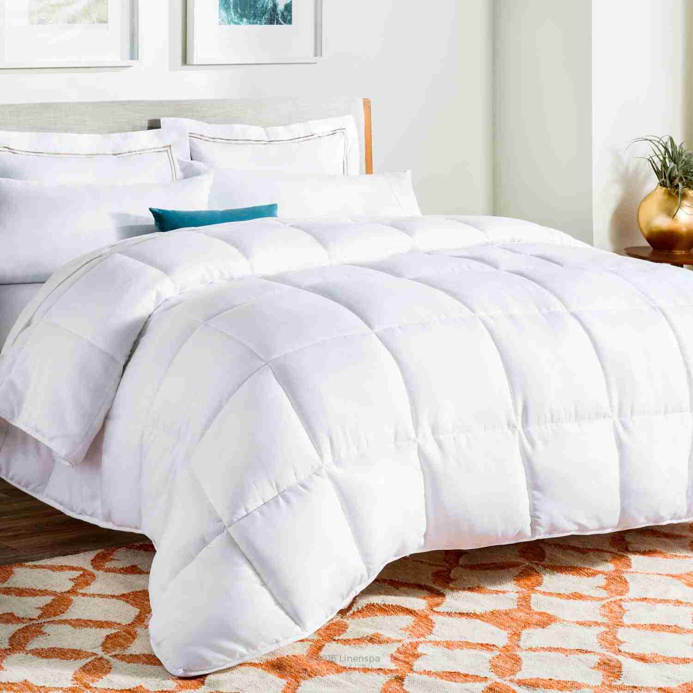LINENSPALINENSPA 抗敏四季被Comforter$29.99立即购买Amazon 超热门平价床垫品牌，可用洗衣机洗并直接丢进烘衣机烘干，质地柔软可两面使用，使用极细纤维毛和抗敏材料。可单盖也可装进被套，四角提供绑线。](https://amzn.to/2XDs4LM)[有了它一夜好眠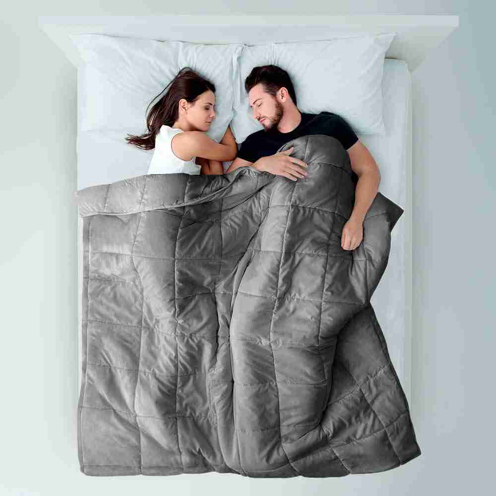Bare HomeBare Home 17lb助眠重力毯Blanket$49.2立即购买重力盖毯是透过平均分布在毯子上的重量，使用接触压力刺激方法来刺激身体上的各个压力点，仿真被拥抱的感觉来放松神经系统，达到不用吃安眠药就能效释放压力、改善情绪并提升睡眠质量，让睡眠更加的深层且彻底放松。100％防过敏棉，舒适透气，一年四季皆可使用。](https://amzn.to/2GFXvj0)[看电视必备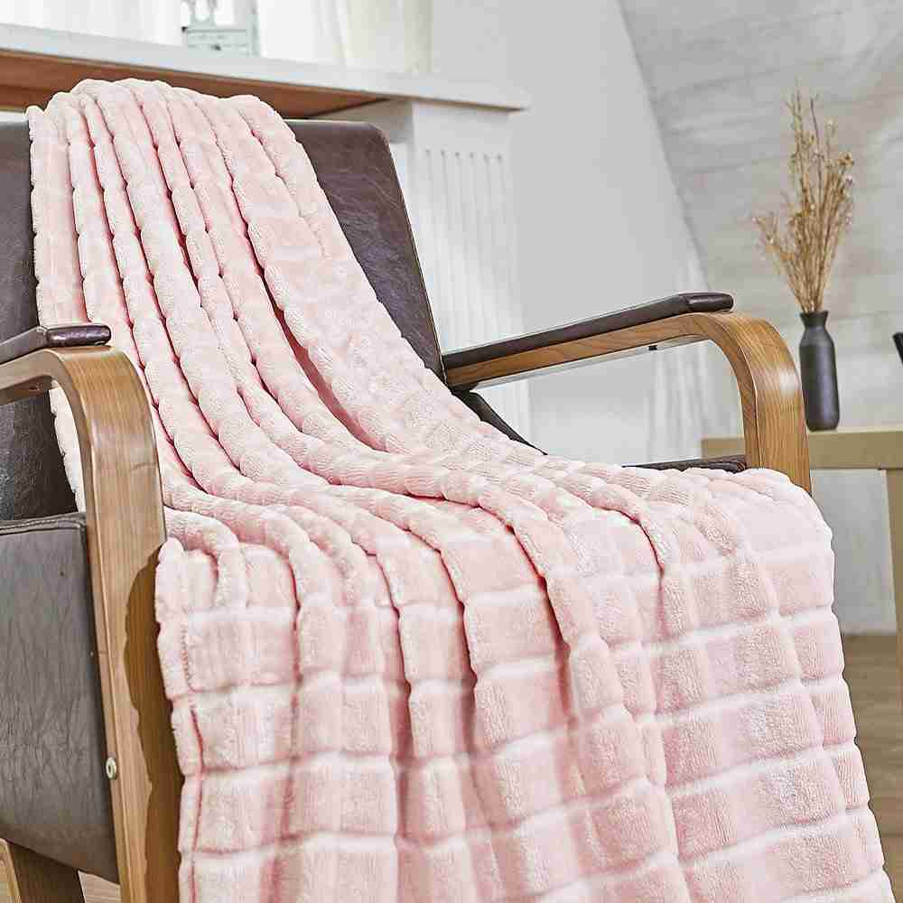BertteBertte 超柔软小毯子Throw$19.99立即购买材质相当柔软，不会掉屑，提供恰到好处的保暖度且透气不闷热，躺在沙发上看电视时必备！多色多尺寸可选。](https://amzn.to/2GyxnFw)[破1500评价平均4.5星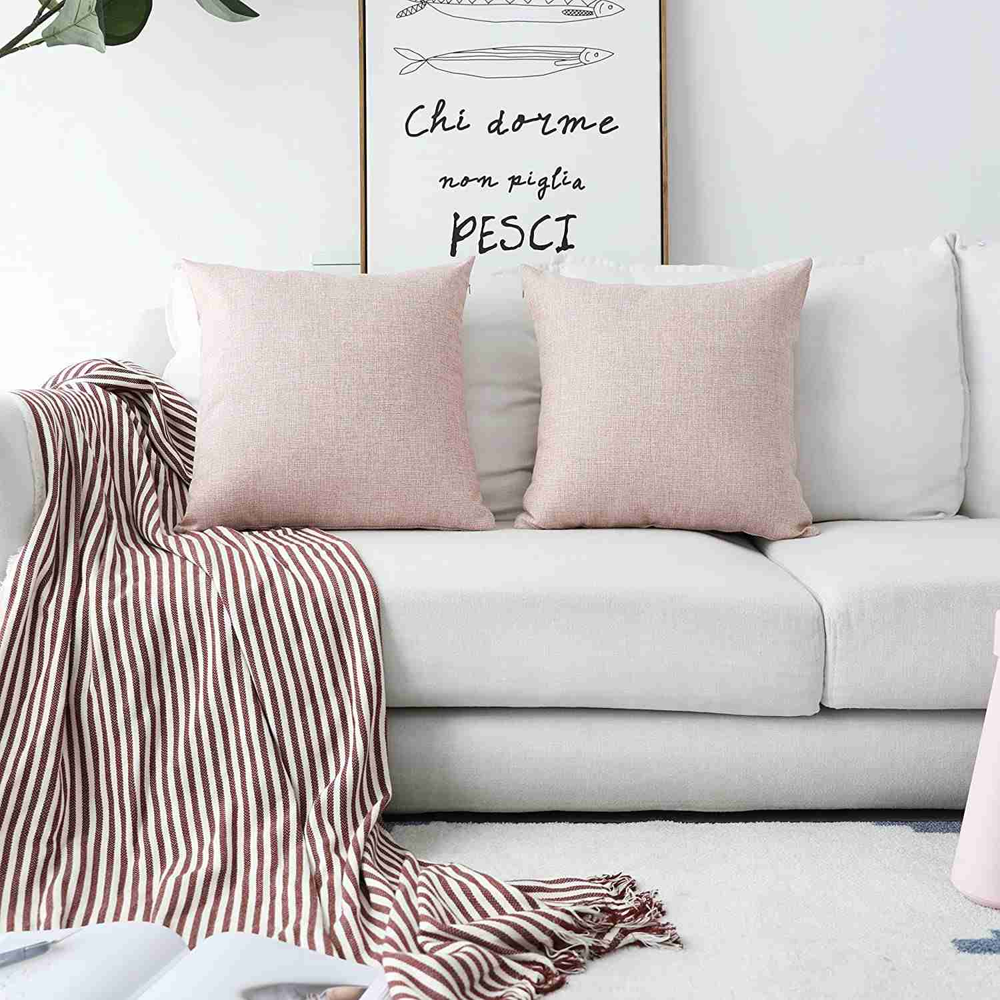Home Brilliant装饰用枕头套2入$13.99立即购买简约设计，颜色优雅耐看，隐形拉链设计，多色可选。](https://amzn.to/2DyDvwF)[600+评价4.7星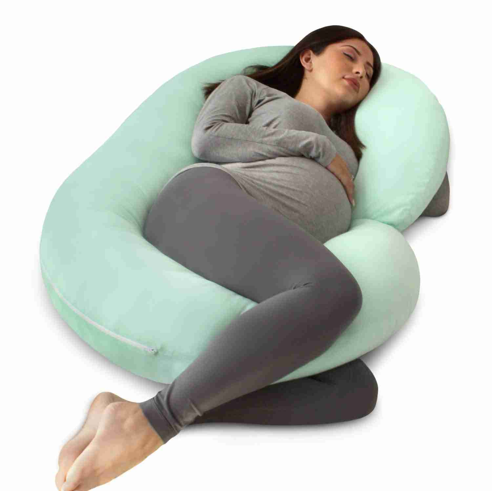PharMeDocPharMeDoc C型枕$39.95立即购买孕妈咪必备！C型设计可提供后背及肚子恰到好处的支撑，减缓孕期的背部酸痛与不适。亦可当作枕头、靠枕等多种用途，枕套拆下机洗。](https://amzn.to/2GIbViI)

## 02 铺盖单品

### *1*被子组 - Duvet 和 Comforter 究竟有什么区别

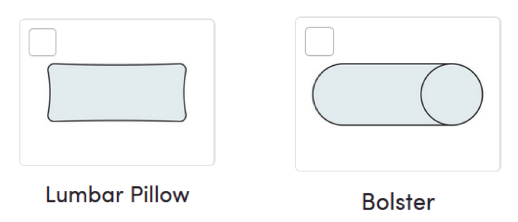

**Duvet:**被芯，一般是纯白色的，有些不能机洗，要套被套Duvet Cover使用，和国内的被子使用方法一致。但是在美国人眼里这种被子其实不是最传统的。
**Comforter:**这种才是美国人眼里比较传统的被子，部分可以机洗。通常是印花的或者点绗的，兼具保暖和装饰效果，尺寸比较大会超出床边自然下垂。

### 两者主要区别：

用法不同

Duvet套上Duvet Cover之后贴身盖，平时换洗被套。Comforter不是贴身盖的，美国人会在身体和Comforter之间隔一层床单Flat Sheet使用，平时更多的是换洗中间这层床单。

尺寸不同

通常Comforter比Duvet的尺寸会更大一些（但不是绝对的），厚度上Duvet一般会更厚一点。

[先来看看 Duvet立即购买](https://amzn.to/2VJsOmc)[再来看看 Comforter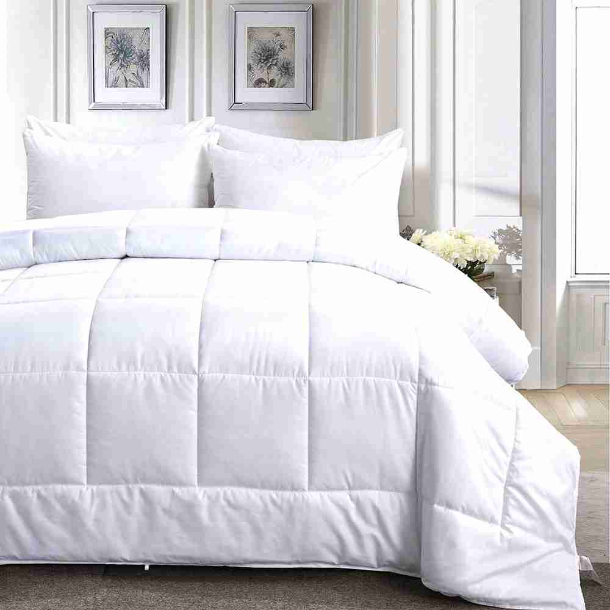立即购买](https://amzn.to/2MyLdJS)

### *2*床罩组 - Bedspread 和 Coverlet 究竟有什么区别

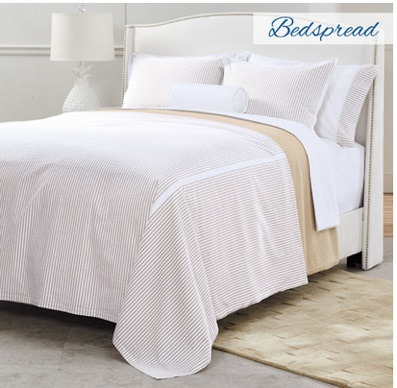

**Bedspread：**关于 Bedspread 的说法不一，有的说Bedspread是各种被子和床罩的总称，可装饰也可保暖，可以是厚的也可以是薄的，可以单独使用也可以搭配使用。但也有的说，它和Coverlets是差不多的东西，无非就是Bedspread尺寸更大一点，可以到达落地的长度。

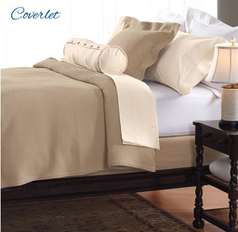

**Coverlet：**Coverlet看起来有点像绗缝被，但是一般要比绗缝被薄一点小一点，一般是装饰用的，不一定具有保暖功能。Coverlet更流行一点。

### 两者主要区别：

材质不同

Coverlet 一般是编织的；Bedspread 通常是用羊毛，聚酯，棉或者绳绒做的。

大小不同

Coverlet 比较小，一般会垂到床的两边；Bedspread 比较大，一般会垂到地上。

[想要买 Bedspread 和 Coverlet 的看过来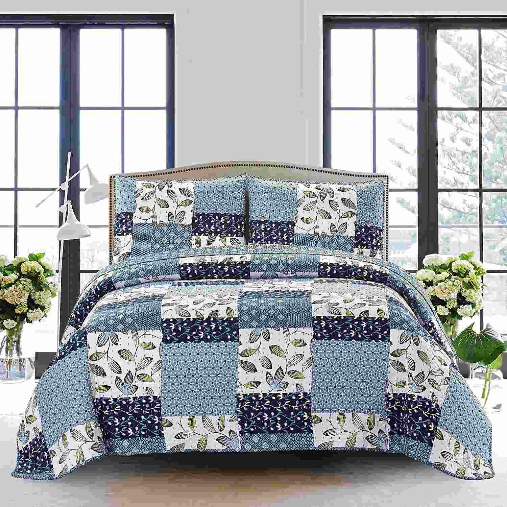这里有超多 Bedspread 和 Coverlet 套装](https://amzn.to/2M9kwiN)

### *3*薄被组 Quilt

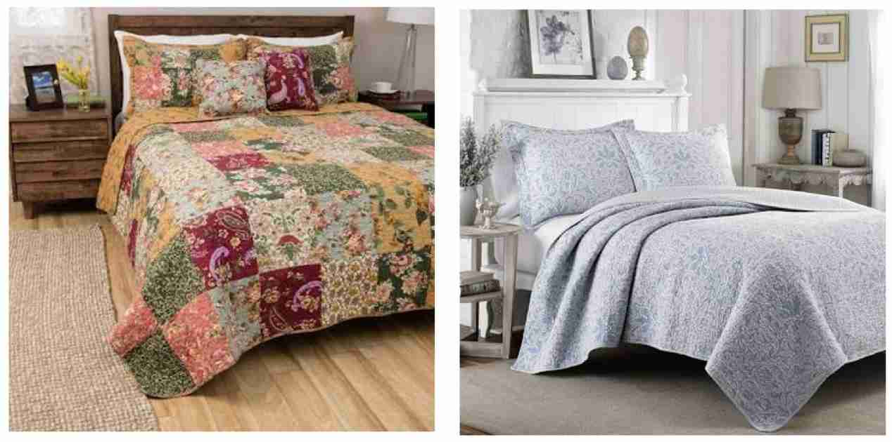

传统风格绗缝被和现代风格绗缝被

绗缝被是一种非常传统的手工被，过去美国人用来纪念特殊日子手工缝制的，手工的绗缝被是可以作为一个家族传统纪念物代代相传的。传统的款式是由很多小布块拼接出一个图案，上面手工压线。现在的绗缝被也有用一整块布和机器压花。
这种杯子的厚度类似国内的空调被，美国人有的会隔着床单盖有的会直接盖（因为可以洗吧）。传统风格绗缝被很容易搭配出国外老电影里的感觉，可以用作装饰，用来盖床，甚至是挂在墙上。

[想要买薄被Quilt的看过来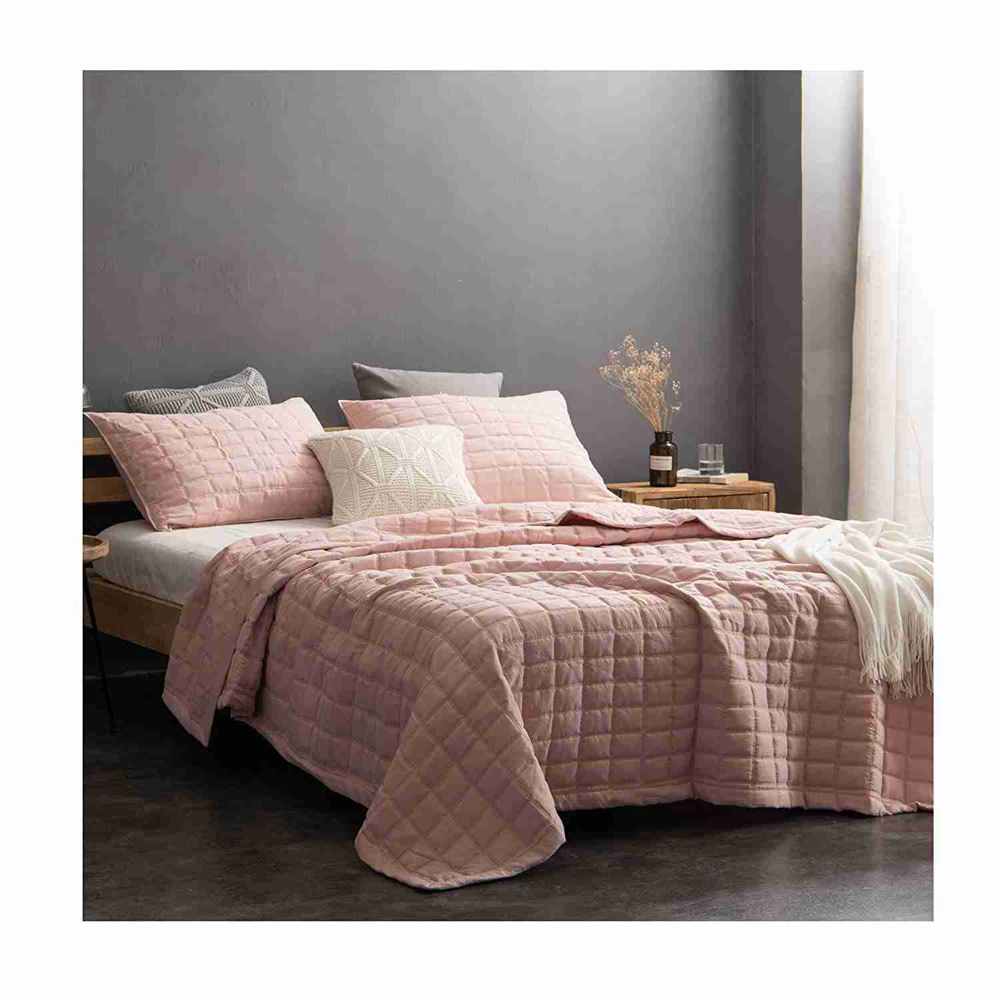这里有超多不同款式的薄被](https://amzn.to/2B1mGf5)

### *4*毯子组 - Throw 和 Blanket 究竟有什么区别

**Blanket：**就是大毯子，多为床上使用，外观通常比较朴素。会分 Twin, Full, Queen, King 等不同尺寸。

**Throw：**是小毯子，花色比较多，除了保暖之外，还能起到装饰的作用，可以用在很多地方，例如沙发，车上等等，甚至可以挂起来做挂毯。尺寸相对来说就比较小了。
**Blanket 和 Throw 的主要区别就是尺寸。**

[先来看看 Blanket 大毯子立即购买](https://amzn.to/2B2lJ6k)[再来看看 Throw 小毯子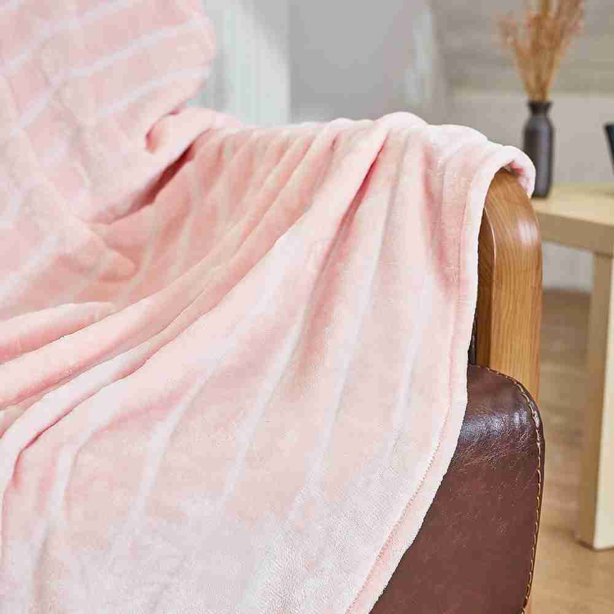立即购买](https://amzn.to/2B0MIiv)

### *5*其他 - Bed Scarves 和 Bed Skirt

**Bed Scarves：**就是酒店里经常能见到的像桌旗一样的东西，但是是铺在床上的。这个也是最早在酒店中使用为了防止客人把箱子等物品放在床上弄脏下面的被子，后来家装中也开始流行。但是对于家庭而言Bed Scarf的作用更多还是在装饰方面。
**Bed Skirt：**美国有些床需要用到床盒/床箱Spring Box，而这个Bed Skirt就是用来装饰Spring Box的。在中国，很多商家会把带有褶皱裙边的床罩叫做床裙，和美国概念不同。

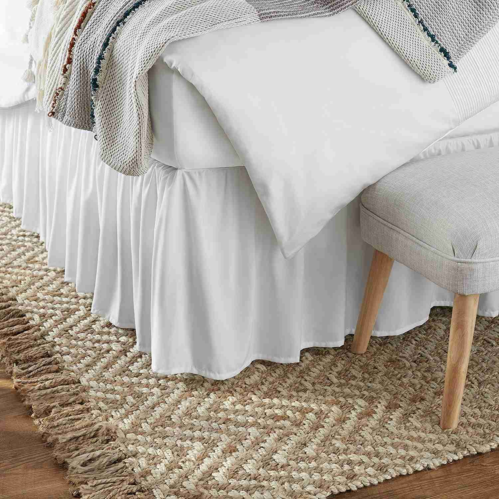

美国的床裙

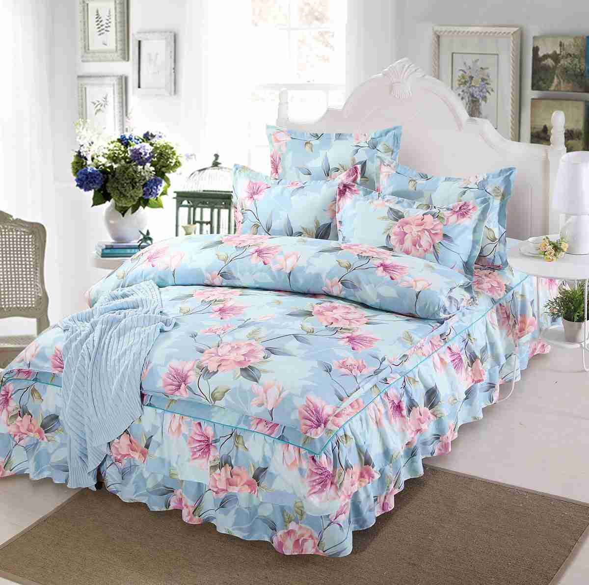

中国的床裙

[先来看看 Bed Scarves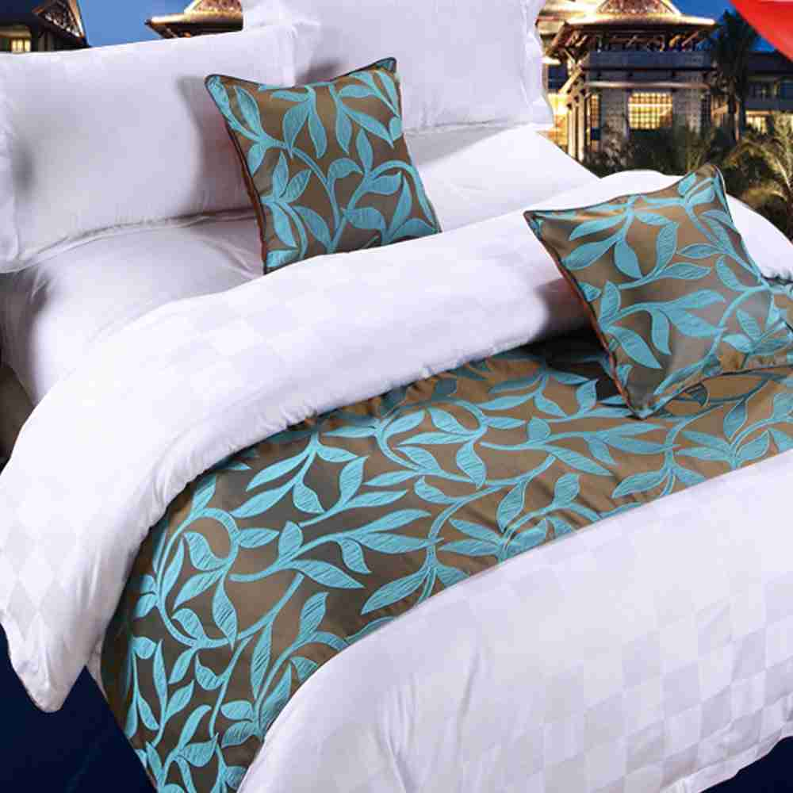立即购买](https://amzn.to/2OtY4NT)[再来看看 Bed Skirts立即购买](https://amzn.to/2OX2bDn)

### 加映 - 美国的床按有没有床盒可以分两种

需要床盒/床箱Spring Box的床和不需要Spring Box的床

需要床盒 Spring Box 的床

一般由床架Bed Frame + 床盒/床箱Spring Box + 床垫Mattress组合。这种组合在美国是很常见的。

不需要床盒 Spring Box 的床

 常见的有平台式的床Platform Bed或带有床板条Bed Slats的床+ 床垫Mattress的组合。

## 03/ 枕头单品

### *1*枕套 Pillow Case 和 Pillow Sham 究竟有什么区别？

**Pillow Case：**侧重睡眠时使用，面料亲肤，颜色通常是纯色，有些价格比较高的还带一些装饰，比较常见的是侧边开口。
**Pillow Sham：**侧重装饰，面料比较厚实，周边会多出一圈布料，设计相对华丽一些，比较常见的是后边开口。

[先来看看 Pillow Case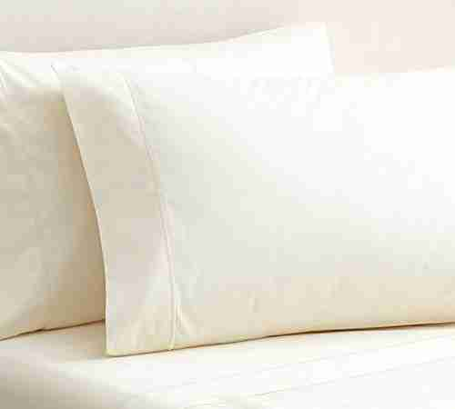立即购买](https://amzn.to/2B0Qh8n)[再来看看 Pillow Sham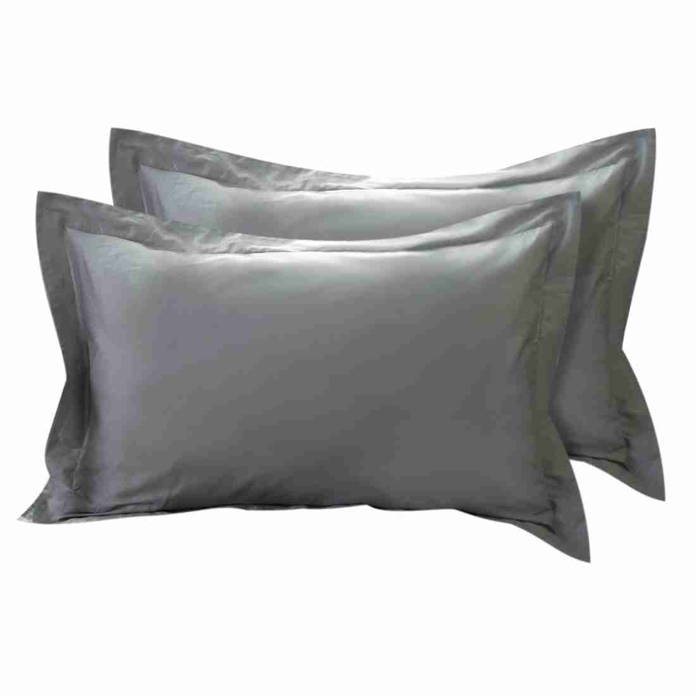立即购买](https://amzn.to/2KK9dYw)

### 枕头的类型：

美国人特别注重床品装饰，因此除了睡觉用枕Sleeping Pillows之外，还有各种尺寸的装饰用枕Decorative Pillows。

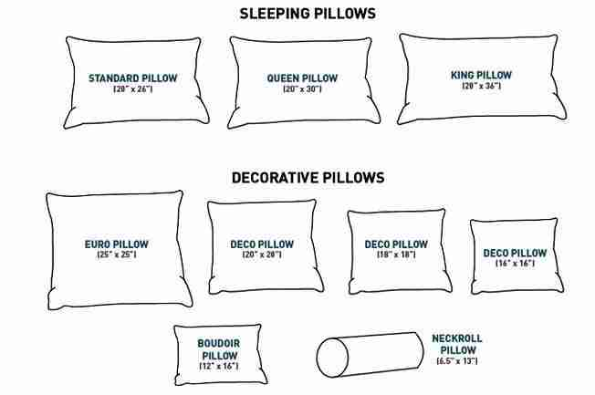

**小贴士：**美国常见枕头尺寸各个厂家数据有差异，以厂商提供数据为准。

### *2*睡觉用枕 Sleeping Pillow

美国睡觉用枕有四个尺寸：Standard、Super Standard、Queen和King。通常枕套的尺寸会略大一些，以此来适应各种品牌枕头不同的规格（不用担心枕套会太大，因为枕头是有厚度的。）

**下表是睡觉用枕尺寸说明，以及配套的枕套尺寸说明：**

| 美国                     | Standard                         | Super Standard                   | Queen                            | King                             |
| ------------------------ | -------------------------------- | -------------------------------- | -------------------------------- | -------------------------------- |
| 常见枕头尺寸             | 20" x 26" 51 * 66cm              | 20" x 28" 51 * 71cm              | 20" x 30" 51 * 76cm              | 20" x 36" 51 * 91cm              |
| 常见枕套尺寸 pillow case | Length: 20 - 21" Width: 30 - 32" | Length: 20 - 21" Width: 30 - 32" | Length: 20 - 21" Width: 30 - 32" | Length: 20 - 21" Width: 36 - 41" |
| 中国枕头常规尺寸         | 约40 * 70cm                      | 约40 * 70cm                      | 约40 * 70cm                      | 约40 * 70cm                      |

[想要买睡觉用枕Sleeping Pillow的看过来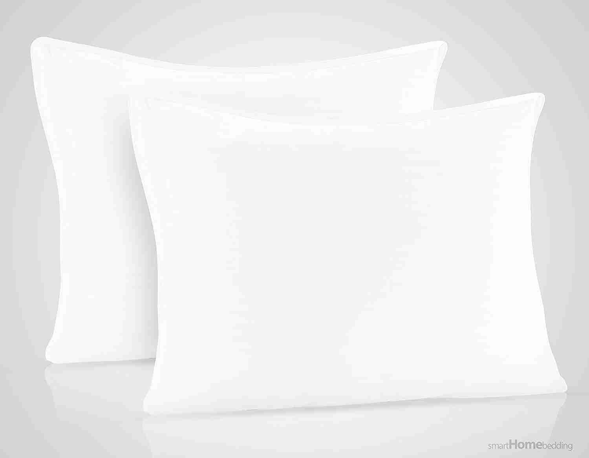这里有超多不同型号大小的枕头](https://amzn.to/2Osi2bH)

### *3*装饰枕 Decorative Pillow

装饰枕分为 Euro Pillow，Throw Pillow，Lumbar Pillow，Bolster Pillow 和 Round Pillow 等。
Euro Pillow 和 Throw Pillow 是方形的，下表是中国和美国方枕的尺寸和主要区别：

左右滑动表格获取更多消息

|              | Euro Pillow #1      | Euro Pillow #2      | Throw Pillow #1     | Throw Pillow #2     | Throw Pillow #3     | Throw Pillow #4     | Throw Pillow #5     |
| ------------ | ------------------- | ------------------- | ------------------- | ------------------- | ------------------- | ------------------- | ------------------- |
| 美国常见方枕 | 26" x 26" 66 * 66cm | 24" x 24" 61 * 61cm | 24" x 24" 61 * 61cm | 22" x 22" 56 * 56cm | 20" x 20" 51 * 51cm | 18" x 18" 46 * 46cm | 16" x 16" 41 * 41cm |
| 中国常见方枕 | 65 * 65cm           | 60 * 60cm           | 60 * 60cm           | 55 * 55cm           | 50 * 50cm           | 45 * 45cm           | 40 * 40cm           |

除了方枕之外，还有矩形枕 Lumbar Pillow，圆柱形枕 Bolster Pillow 和圆形枕 Round Pillow。

| 其他形状 | 名称                            | 常见尺寸 #1          | 常见尺寸 #2          |
| -------- | ------------------------------- | -------------------- | -------------------- |
| 圆形     | Round Throw Pillows             | 直径 12" (30cm)      | 直径 14" (36cm)      |
| 矩形     | Lumbar Pillows 腰枕             | 12" x 24" 30 x 61 cm | 14" x 36" 36 x 91 cm |
| 矩形     | Boudoir/Breakfast Pillow 闺房枕 | 12" x 16" 30 x 41 cm |                      |
| 圆柱形   | Bolster Pillow                  | 直径7" - 长20"       |                      |
| 圆柱形   | Neck Roll Pillow                | 直径6" - 长16"       |                      |

[想要买装饰用枕Decorative Pillow的看过来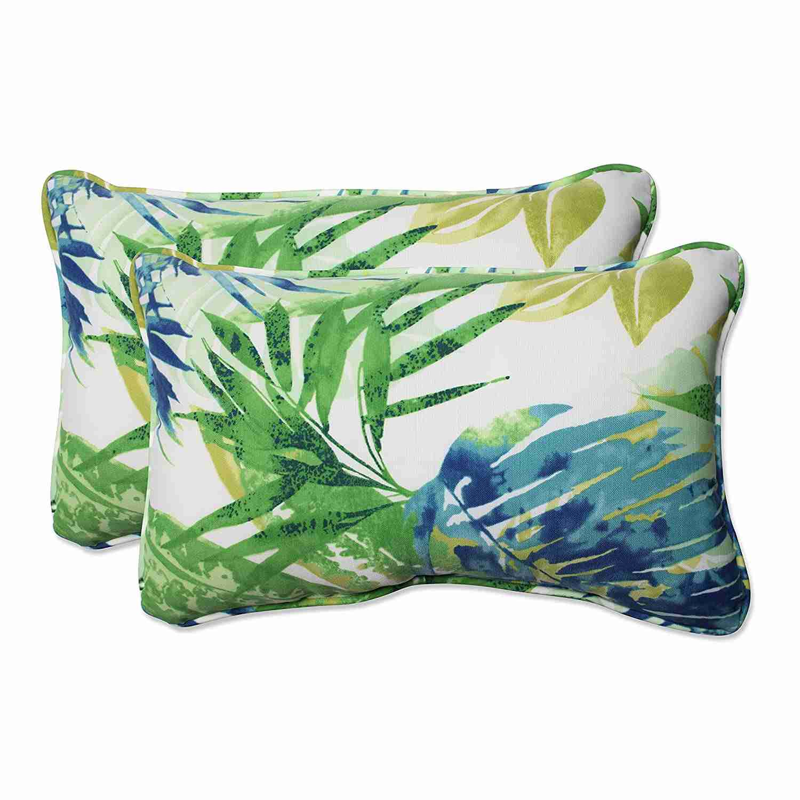这里有超多不同款式的装饰枕](https://amzn.to/2MjMs2G)

### *4*抱枕 Body Pillow

Body Pillow 很长，和人差不多长，形状有长条的和各种异型的。孕妇经常会用到的孕妇枕其实就是 Body Pillow 的一种。

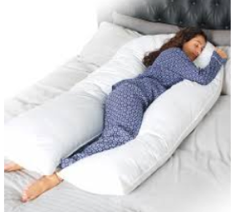
[想要买 Body Pillow 的看过来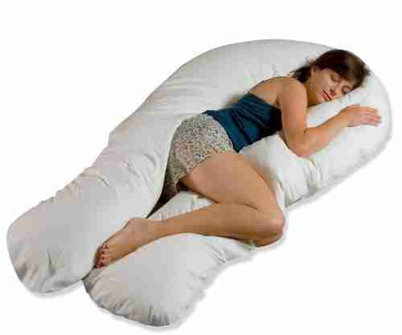这里有超多不同形状的抱枕 Body Pillow](https://amzn.to/2MG9ygA)

### *5*经典美式枕头搭配方案

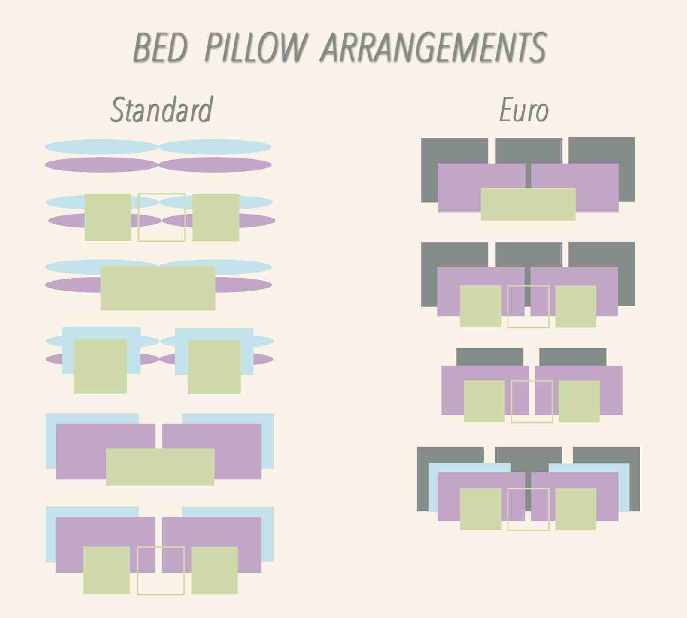

## 04/ 套装

### *1*中美铺床习惯大差异

**中美床品除了尺寸上的不同，在铺床的习惯上有着很大差异**
一个基础而舒适的美式床铺，从下到上应该是这样的：

1. 床架（bed）
2. 床裙（bed skirt）—— 中国通常不使用
3. 床垫（mattress）—— 相当于中国的褥子
4. 床笠（fitted sheet）—— 在中国床单/床笠二选一使用
5. 床单（flat sheet）—— 在中国床单/床笠二选一使用
6. 被子（comforter/duvet+duvet case）
7. 枕头（pillow） + 枕套（pillowcase）
8. 几个装饰性枕头（decorative pillow）—— 在中国家庭一般会省略或使用靠枕
9. 可能还有薄被（quilt）或床罩（bedspread/coverlet）

**小贴士：**说在中国床笠和床单是二选一使用的，而在美国通常是一起使用的。

### 床单（flat sheet/top sheet）和床笠（fitted sheet/bottom sheet）有什么区别？

床笠是这几年国内开始兴起的，可以理解为四周有一圈松紧带可以包住床垫的床单，优点是易固定不会轻易移动，缺点是什么尺寸的床就得配什么尺寸的床笠。国内的床和美国尺寸不一致，因此从国内带来的床笠并不适用于美国的床垫。

**特别说明：**美国人的睡眠习惯是很多情况下被子不是贴身使用的，在被子和人体之间以有一层隔单，因此床单除了垫在床垫上放在身下之外，还有隔离人体和被子的作用。

**小贴士：**由于床垫的高度不同，购买床笠时，要特别留意产品消息里床笠的高度是否适用于你家的床垫，有少数的床笠仅可用在较薄的床垫上。

### *2*Sheet Sets (贴身)

Sheet Sets床单组中的物品，都是贴身使用的，对于睡不睡得好非常关键，选购时一定要慎重考虑材料和密度。这种套件因为是直接接触皮肤的，所以通常会使用纯棉亲肤面料，颜色以纯色为主，不会特别花哨。
床单组里通常会包括：

- 一个或两个枕套（Pillow Case）
- 一个床笠（Fitted Sheet）
- 一个床单（Flat Sheet）

**小贴士：**美标床品中的 Sheet Sets 是没有被套的，铺床时用床笠套住床垫后，再把床单包裹住床笠，睡觉时是睡在床笠和床单之间。

[想要买 Sheet Set 床单枕套组的看过来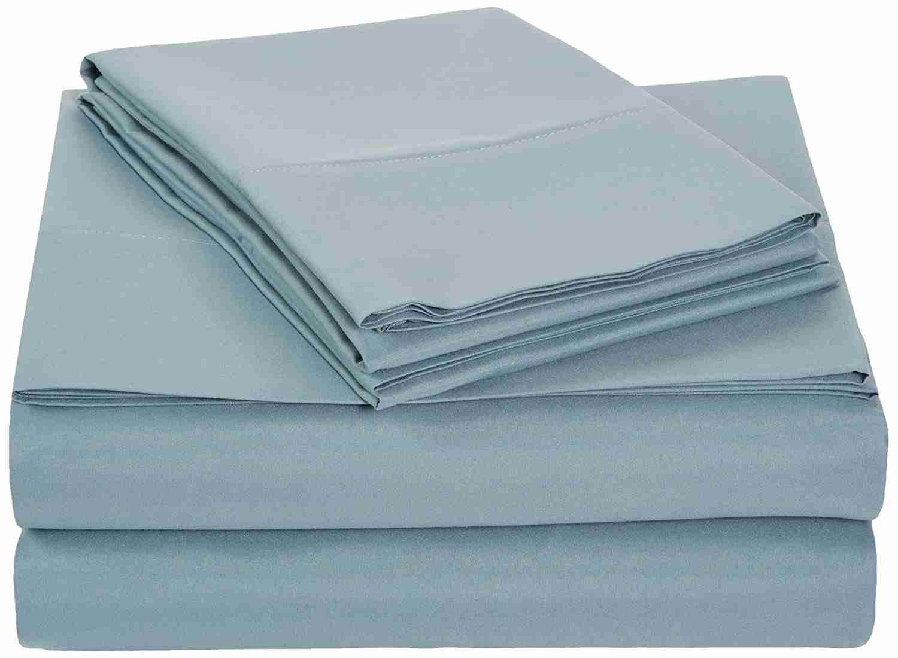这里有超多不同颜色大小的床单枕套组](https://amzn.to/2MC7NRK)

### *3*Comforter Sets（装饰）

盖被/被子组（Comforter Sets) 一般包含：

- 一个或两个装饰枕套（Sham）
- 一个盖被/被子（Comforter)
- 一个装饰用的床裙（Bed Skirt）
- 几个装饰垫子（Decorative Pillow）

Comforter 是带芯的被子，填充物通常为化纤棉，被罩不可拆卸。从尺寸来看，比 Duvet 要大，一把来说都可以机洗。这种被子通常不会作为贴身使用，质地大多数不是纯棉的，主要功用是装饰。

**小贴士：**一般 Comforter 套件都要和 Sheet 套件搭配使用。

[想要买 Comforter Set 盖被组套件的看过来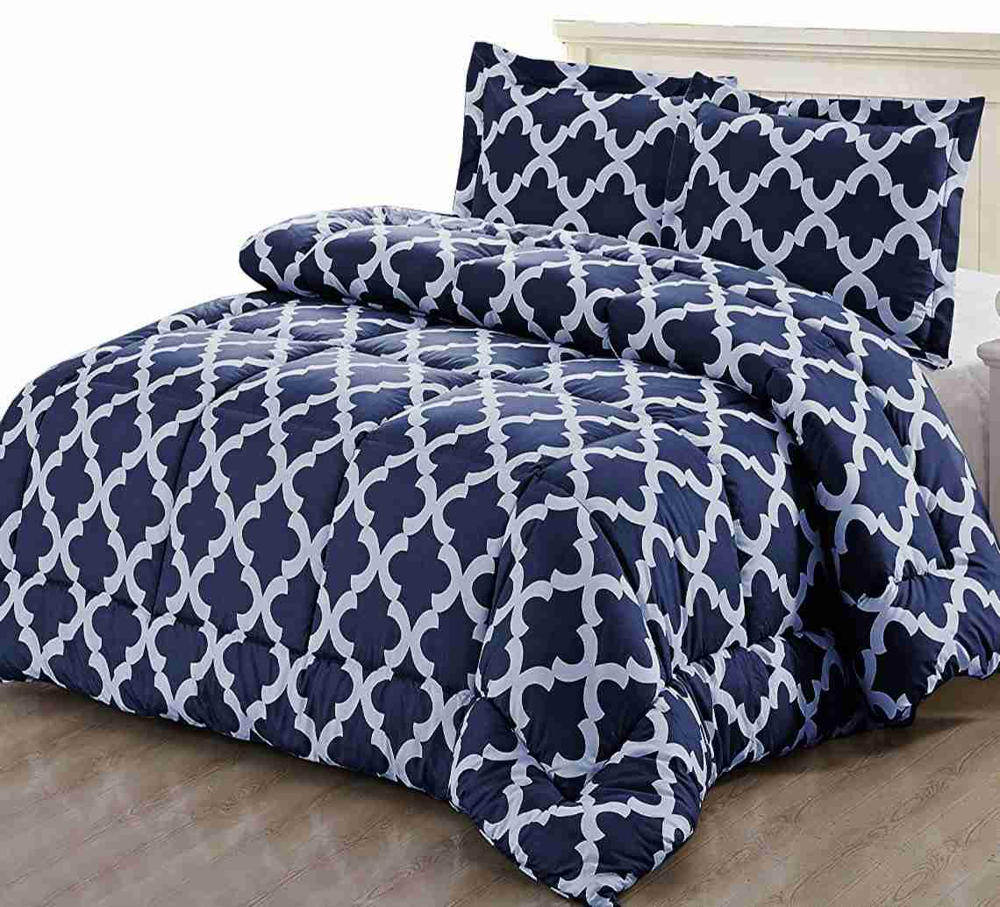这里有超多不同颜色大小的盖被套装](https://amzn.to/2OXnpRo)

### *4*Duvet Cover Sets（贴身）

Duvet Set被罩套件 (3pc) 一般包含：

- Duvet Cover 被罩1件
- Pillowcases 枕套1~2件

这种套件是最接近中国人生活习惯的，只要再单买一个床单或者床笠就可以了。

**特别说明：**美标的 Duvet Cover Sets 是不含床单的，美国的床单大多都是单色的，很少有花色的，所以一般都是单独买。

[想要买 Duvet Cover Set 被罩套件的看过来这里有超多不同颜色大小的被罩套件](https://amzn.to/2B081R9)

### *5*Quilt Sets（贴身/装饰）

Quilt Set 三件套一般包含：

- Quilt 绗缝被一个
- Sham 装饰枕套 1~2个（通常也是绗缝）

Quilt Sets是绗缝被，在美国的使用率比较高。夏天可以用来当空调被，冬天可以当垫被或压被使用，增加保暖效果。

[想要买 Quilt Set 绗缝被套件的看过来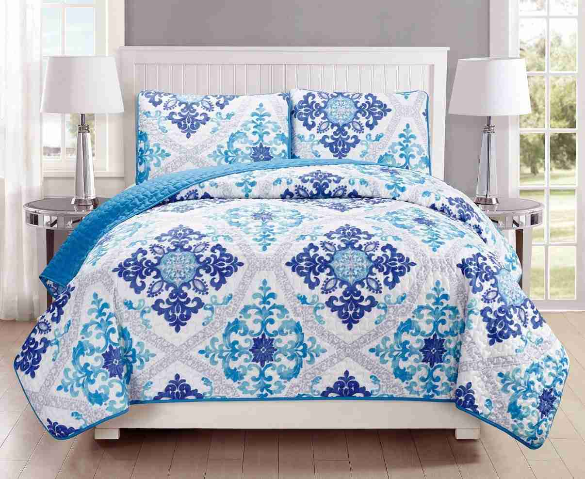这里有超多不同花色的绗缝被套件](https://amzn.to/2OvlpyR)

### *6*Bed in a Bag Sets/ Complete Comforter Sets

这种十全大套装一般包含：

- 1 Comforter 盖被
- 1 Bed Skirt 床裙
- 1 Flat Sheet 床单
- 1 Fitted Sheet 床笠
- 1~2 Pillowcases 枕套
- 1~2 Pillow Shams 装饰枕套
- N Decorative Pillows 装饰枕
- 可能还会有 Throw/Blanket 甚至窗帘

[想要买十全大套装的看过来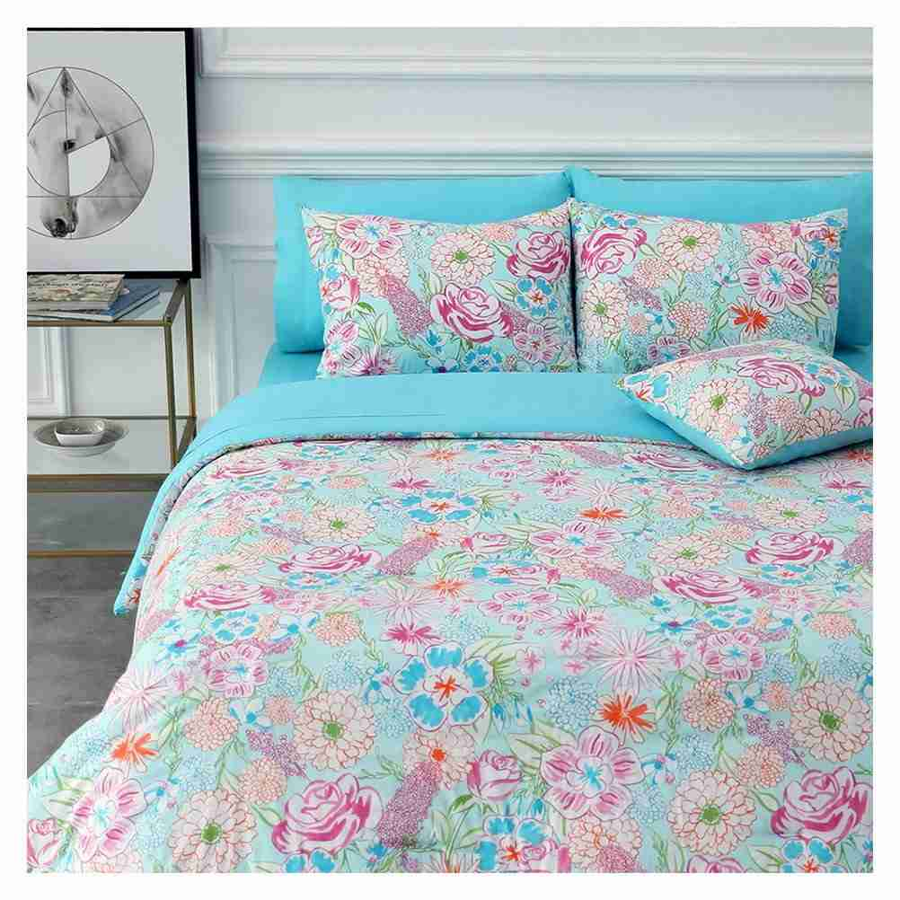这里有超多不同花色和大小的十全大套装](https://amzn.to/2Osn1ZX)

### *7*我应该选择哪种套装？

**喜欢中国式的简单套件可以选择：**
**天冷时：**Duvet Cover Set（床单+枕套），加配床单或床笠。被芯和枕芯需要另买。
**天热时：**Quilt Set（绗缝被+绗缝枕套），加配床单或床笠。枕芯需要另买。

**喜欢美式单怕麻烦的话请选择：**
Bed in a Bag Sets，枕芯需要另买。

**喜欢美式不怕麻烦的话请选择：**
Comforter Sets + Sheet Sets或 Quilt Set+ Sheet Sets再或加床罩（Bedspread、Coverlet）自己组合搭配，枕芯需要另买。

## 05/ 材质

这里主要介绍贴身面料的材质：Pillowcase、Fitted Sheet、Flat Sheet和Duvet Case等。

### *1*Cotton棉 - 选择范围最广

多数人都喜欢纯棉质地的布料是有道理的，因为这种布料比较柔软，舒适，吸湿性好，而且不易产生静电。当然，选择也最多，所以我们先来看纯棉材质。

### 如何挑选好的棉质床品？

选择的时候主要看两个方面：棉纤维长度和面料密度

### 1.按棉纤维长度分

**棉纤维按其纤维的细度和长度可分为：**

细绒棉（陆地棉）

最常见最普及

长绒棉（海岛棉）

比细绒棉的床品更柔软，更爽滑

粗绒棉（亚洲棉）

粗绒棉纤维过于粗短不适用于机器纺织

**世界上优质的长绒棉品种有哪些？**

海岛棉（Sea Island Cotton）

产量有限，很少有用它来制作床品的。

埃及棉（Egyptian Cotton）

最佳选择

匹马棉（Pima Cotton）

分秘鲁Pima和美国Pima，次佳选择

新疆长绒棉

美国不常见

### ★埃及棉 Egyptian Cotton

埃及棉几乎是床品中最高档的面料，柔软且有丝绸般的光泽。
埃及棉有非常多的等级，特长纤维（Extra-long staple）、长纤维（Long staple）、中长纤维（Middlelong staple）。因此成品价格会有较大差异也不足为奇，最顶级的GIZA45（属于ELS）仅一张FALT SHEET就要近千美金。

什么是 ELS 特长绒棉？

ELS（Extra-long Staple）是惟一一种具备多种附加价值的天然纤维：韧度足、手感柔软、有光泽，质感似丝等等。全球棉花生产中只有3%可以被称为ELS。现有的ELS主要分为四类：**海岛棉、埃及棉、秘鲁pima、美国pima**

**小贴士：**市面上假的埃及棉制品非常多，为了防止消费者受骗，埃及棉协会于2000年推出了代表Egyptian cotton商标LOGO，购买时认准这个商标就不会买到假埃及棉。
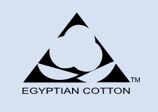

100% 埃及长绒棉

[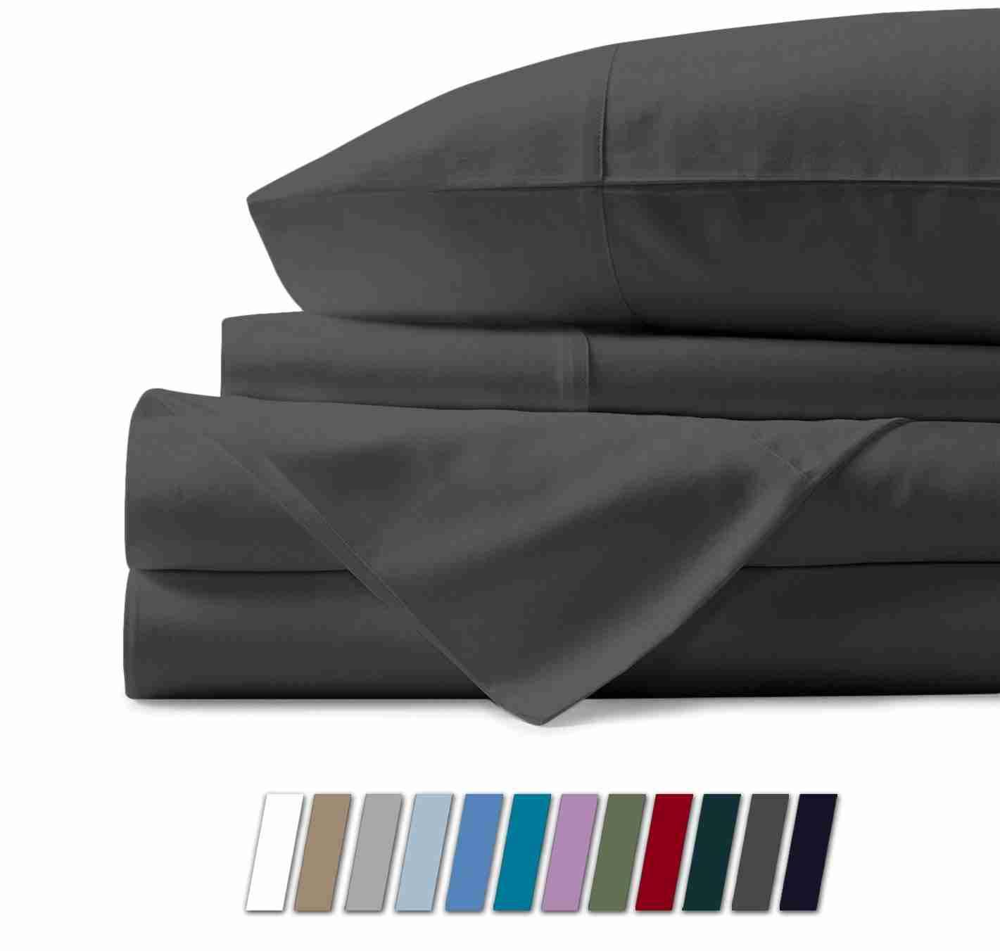](https://amzn.to/2vxmu28)

[Mayfair Linen 100% 埃及棉床单组](https://amzn.to/2vxmu28)

**$73.99**

[立即购买](https://amzn.to/2vxmu28)

800Tc，亚马逊2000多个4星评论！

### ★匹马棉 Pima Cotton

匹马棉，这种棉只生长在美国、秘鲁且在其它产地只有有限的产量，还会细分为秘鲁PIMA 和美国PIMA,一般在美国多指美国PIMA。

什么是 Supima？

Supima是顶级pima棉的称号，也是代表美国pima棉中的ELS的一个品牌。由美国Pima棉种植户组成的非牟利组织，利用这个注册商标来宣传这种极品棉。这种棉也有商标可以用来辨认。

### ★陆地棉 Upland Cotton

陆地棉属于细绒棉，最最常见的品种，如果商家没有特地写明是什么品种的棉，那一般就默认是陆地棉了。

### 2.按面料密度分 Thread Count

**美国的布料纺织密度和中国的计法不同：**
中国使用的是公制“支数”：支数就是衡量1条纱织细腻程度的系数。
美国使用的是英制“根数”thread count：在1平方英寸里面经纬纱织的总和。

| Thread Count | 支数    | 厚度指数 | 柔软指数 | 密度指数 | 适用季节 |
| ------------ | ------- | -------- | -------- | -------- | -------- |
| 200Tc        | 40SX40S | 较薄     | 较硬     | 较疏     | 一年四季 |
| 300Tc        | 60SX60S | 较厚     | 较软     | 中等     | 一年四季 |
| 400Tc        | 80SX80S | 较厚     | 很软     | 较密     | 春夏秋   |
| 600Tc        | 80SX80S | 很厚     | 较软     | 很密     | 春秋冬   |

大家都知道，纺织密度越高布料就越柔软，但并不是这个数值真的越高越好。单根纱（single ply or one ply）的话400T布料就已经是很好的档次了（在国内叫这个是高支高密），但是我们又经常看到动辄上千T的床品。那是因为商家抓住了消费者的这个心理，利用2-4根纱绞在一起再织，这样也就成了所谓的800T,1600T甚至更高。这样织出的布料缺点就是很厚很硬，易起球。
**注：只能在同一种材质下横向比较 Thread Count 才有意义。**

### *2* Linen亚麻 – 冬暖夏凉

亚麻的纤维更粗，Thread Count 通常在80到150左右，亚麻无论从视觉效果（一种慵懒的高级感）还是触感都是很多人喜爱的，但是缺点也很明显——易皱。建议可以选择亚麻的Duvet cover set配亚麻的床笠或者纯棉的床单。
亚麻床品价格普遍比棉要高，但是也有比较亲民的品牌比如宜家，可能刚买回来会觉得有点扎但多洗几次之后会无比柔软。
大多数亚麻织物重量是6盎司/平方码或200克/平方米，中等重量的亚麻织物约为7.3盎司 /平方码或250克 /平方米，较厚的亚麻织物的重量约14盎司/平方码或480克/平方米（用于毛毯，双层亚麻织物）。

**亚麻的优点：**

- 冬暖夏凉
- 防静电
- 皮肤亲肤性好
- 防异味

[高端奢华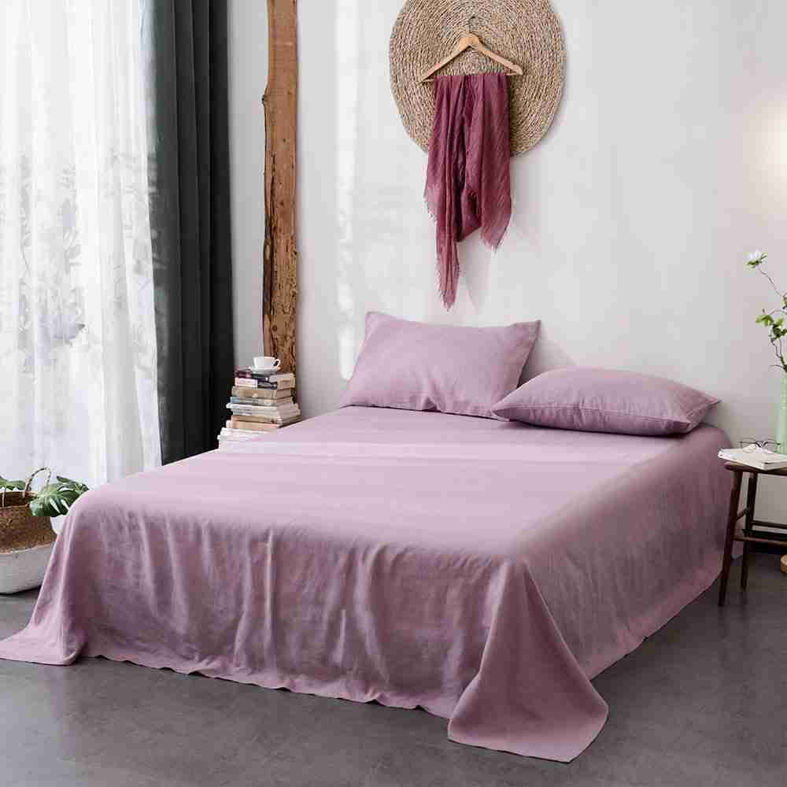MerryfeelMerryfeel Luxurious 100% Pure French Linen Sheet Set - Queen - Mauve$179.99/Queen Size （有多种大小）立即购买100% 纯亚麻套装包含一个床单，两个枕套和一个床笠按说明书小心清洗](https://amzn.to/2Mhf3FU)[质地柔软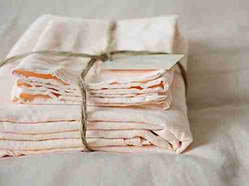LausonhouseLausonhouse Luxurious 100% Pure French Linen Sheet Set - Queen$159.99/Queen Size（有多种大小）立即购买100% 纯亚麻套装包含一个床单，两个枕套和一个床笠按说明书小心清洗](https://amzn.to/2OtKES8)[时尚有质感MerryfeelMerryfeel 100% Linen Duvet Cover Set - Full/Queen - Mauve 被罩组$149.99/Full&Queen （有多种大小）立即购买100% 纯亚麻套装包含一个被罩，两个枕套冬暖夏凉](https://amzn.to/2B3x9GU)

### *3* Silk丝绸 – 抗菌防敏

丝绸的主要特点是抗菌和防过敏，使得它成为过敏患者和皮肤病如湿疹患者的理想睡眠解决方案。除此之外，丝和亚麻一样吸湿性和透气性好，触感凉爽，出汗后不易贴身，特别适合夏季使用。
丝绸虽然好，但缺点也很明显，那就是不易打理，清洁和养护都比较讲究，而且价格也相对较高。在预算有限的情况下，可以选择与面部接触最多的枕套先来用用看。

[丝绸枕套合集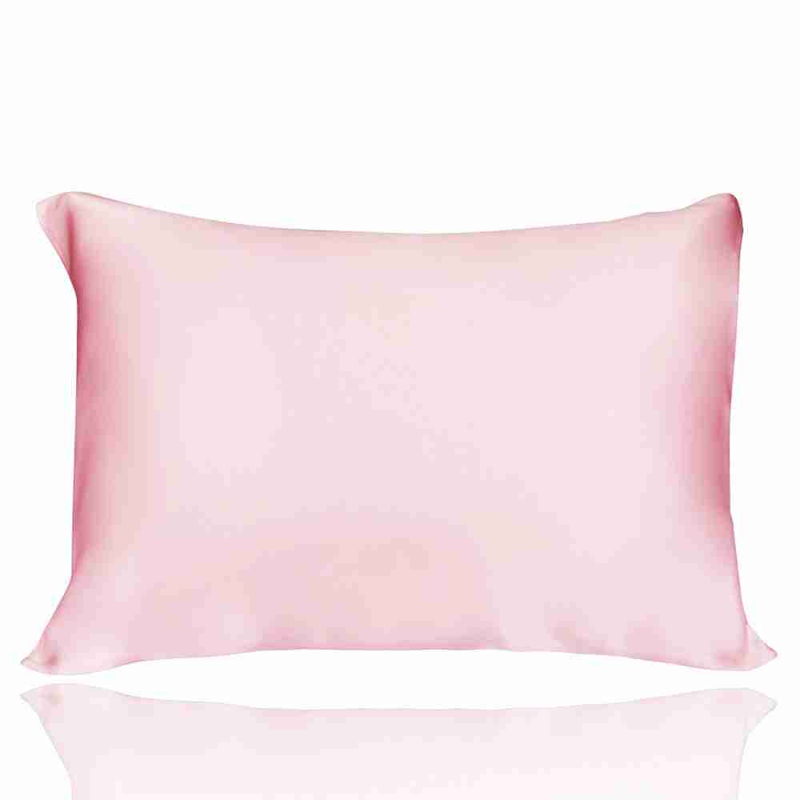要买丝感顺滑枕套就看这里咯！](https://amzn.to/2OrsyQw)

### *4* Bamboo竹纤维 – 适合夏天

竹纤维做的床品柔软，凉爽，抗过敏，抗细菌还环保。但是，要注意的是，没有100%竹纤维的成品，因为还是需要其他材料才能制成竹纤维的床品。
现在比较受欢迎的是一种叫做 “Bamboo Lyocell” 的床品，比一般的主纤维刚高级，还有防止异味产生的功能。

### *5* Flannel法兰绒 – 适合冬天

法兰绒是经过精梳的棉花，形成一种非常柔软的面料，可以捕捉体温，所以有贴身温暖的特质，特别适合冬天使用。

### *6* Tencel天丝 – 比 Silk 实惠

除了真丝之外，还有人造丝，人造丝包括Viscose Rayon(人造丝)，Modal(莫代尔纤维)，Tencel Lyocell(天丝)等，其中天丝最好也最环保。

**天丝 VS 蚕丝**

天丝 定位大众，追求舒适

- 优点：光泽好，耐延展，易与其他纤维混合，用途广
- 缺点：亲肤性和柔软性相对较差

蚕丝 定位高端，追求质量

- 优点：亲肤性柔软性好，成质量量高级
- 缺点：产量少，产品性质不稳定

## 06/ 中美床的规格比较

很多人喜欢从国内购买床品带来美国使用，这个时候需要注意的是中美床品的规格是有差异的：

### 美国床的标准尺寸

| 名称            | 床垫 Matress 英寸/厘米          | 床笠 Fitted Sheet 英寸/厘米         | 床单 Flat Sheet 英寸/厘米  | 被套 Quilt Cover/ Duvet Cover 英寸/厘米 |
| --------------- | ------------------------------- | ----------------------------------- | -------------------------- | --------------------------------------- |
| Twin            | 28 in x 75 in (97 cm x 191 cm)  | 39" × 76" × 14" (99 × 193 × 35 cm)  | 72" × 102" (182 × 259 cm)  | 59" × 79" (150 × 201 cm)                |
| Twin XL         | 38 in x 80 in (97 cm x 203 cm)  | 39" × 80" × 14" (99 × 203 × 35 cm)  | 72" × 114" (182 × 290 cm)  | 59" × 102" (150 × 259 cm)               |
| Full/Double     | 54 in x 75 in (137 cm x 191 cm) | 54" × 76" × 15" (137 × 193 × 38 cm) | 87" × 102" (221 × 259 cm)  | 80" × 80" (201 × 201 cm)                |
| Queen           | 60 in x 80 in (152 cm x 203 cm) | 60" × 80" × 15" (152 × 203 × 38 cm) | 92" × 108" (267 × 279 cm)  | 90" × 88" (229 × 224 cm)                |
| King            | 76 in x 80 in (193 cm x 203 cm) | 76" × 80" × 15" (193 × 203 × 38 cm) | 110" × 114" (279 × 290 cm) | 90" × 102" (229 × 259 cm)               |
| California King | 72 in x 84 in (183 cm x 213 cm) | 73" × 85" × 15" (185 × 216 × 38 cm) | 111" × 114" (279 × 290 cm) | 94" × 104" (239 × 264 cm)               |

### 中国床的标准尺寸

| 床的尺寸 床宽    | 床的尺寸 常见床长度 |
| ---------------- | ------------------- |
| **90cm**         | **190cm**           |
| **1.2米**        | **190cm**           |
| **1.5米**        | **2米**             |
| **1.8米**        | **2米 ～ 2.1米**    |
| **2米 （少见）** | **2米 ～ 2.1米**    |

**小贴士：**

- Queen的床是 60*80inch（152*203cm)，最接近中国 150*200cm 的双人床
- California King的床是72*84inch（183*213cm)，最接近中国 180*210cm 的双人床

以上尺寸的床几乎可以和中国的床单通用，但要尽量避免床笠。

## 相关评论

有**9**条评论

[登录](javascript:;) 后参与评论

评论发表中...

[W小姐姐咕噜币：40]()约一年前

规格尺寸对照表好棒，收藏了

回复 (0)赞 (0)打赏

9 楼

回复

[????桐萱????咕噜币：0]()约一年前

正好要换新垫子

回复 (0)赞 (0)打赏

8 楼

回复

[肉肉咕噜币：473]()一年多前

感觉还是得去店里摸一摸才知道舒服不

回复 (0)赞 (0)打赏

7 楼

回复

[何俊辉咕噜币：0]()一年多前

我要去看

回复 (0)赞 (0)打赏

6 楼

回复

[dudu1214咕噜币：469]()一年多前

谢谢推荐

回复 (0)赞 (0)打赏

5 楼

回复

[Karen咕噜币：0]()一年多前

這一篇文章太強大了👏🏻👏🏻👍🏻

回复 (0)赞 (0)打赏

4 楼

回复

[小小辰.🐝咕噜币：590]()一年多前

谢谢

回复 (0)赞 (0)打赏

3 楼

回复

[Hannah Lin咕噜币：0]()一年多前

感謝

回复 (0)赞 (0)打赏

2 楼

回复

[Curtis Chang咕噜币：0]()一年多前

寫得很詳細！但是可以不要國內國內的叫嗎

回复 (0)赞 (0)打赏

1 楼

回复