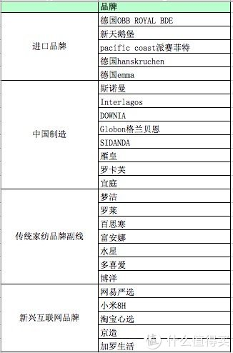
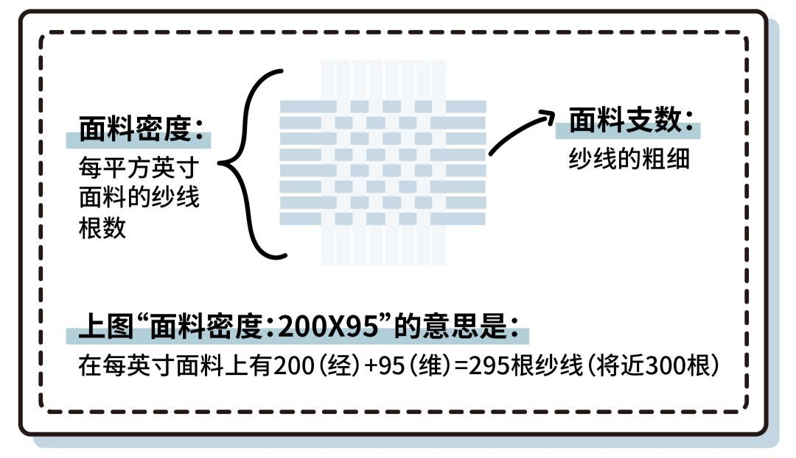

## 品类


### 枕头


#### 羽绒枕


* `羽绒枕头的话可以上Hastens，比Pacific舒服太多。
   我夏天TEMPUR云雾枕，冬天则是Hastens羽绒枕头`

* `羽绒枕头还是阿尔卑斯附近的bbc好了。海斯腾和vispring类似的`

* `还得加上Savoir`

### 四件套

#### 国外床品四件套等

* 被子(Comforter) - 床单(Flat Sheet) - 人 - 床笠(Fitted Sheet) - 床垫

  `铺床时用床笠套住床垫后，再把床单包裹住床笠，睡觉时是睡在床笠和床单之间`
  
  这里床单一来隔脏避免弄脏被子，二来Comforter `通常不会作为贴身使用，质地大多数不是纯棉的，主要功用是装饰` 所以用床垫隔开更舒适
  
  一些能机洗的，也可能不用这个床单

* (被芯Duvet+被套Duvet Cover) - 人 - ...

  此时床品： 被套 + 枕套

详见 [美国床上用品购买指南 - 咕噜美国通](_resource/美国床上用品购买指南 - 咕噜美国通_Guruin.com.html) 或 [pdf版本](_resource/美国床上用品购买指南 - 咕噜美国通_Guruin.com.pdf)


* `Sheet Sets (贴身)`

  * 一个或两个枕套（Pillow Case）
  * 一个床笠（Fitted Sheet）
  * 一个床单（Flat Sheet）
  
  > 注意： 没有被套，需要单独买

* `Duvet Cover Sets（贴身）`

  * Duvet Cover 被罩1件
  * Pillowcases 枕套1~2件

  > 不含床单
  
### 被子


king size被套： 229 × 259 cm
obb鹅绒被： 220*240 cm

A king size duvet is 225/230 x 220cm. ... A super king duvet is 260 x 220cm

snuggledown的尺寸：
double 13.5： 200 x 135 x 7 cm; 2.7 Kilograms; 2102SNG06  应该尺寸写错了，这个是single的
king 13.5： 260 x 220 x 7 cm; 3.4 Kilograms 怀疑写错了
SIZE – SUPER KING BED: Length 220 cm x Width 260 cm. (Standard UK Sizing) 3.5kg
full： 200*135*7 2.7kg 可能就是double

model number :2101SNG06
production dimension: 200x200x7cm


* snuggledown 英亚很高销售量

  买过一个，感觉不错

* obb 德国的，但德亚商品和销售量都非常少

  淘宝上有royalbed和新天鹅堡，后者据说是阿里巴巴合作特供。

  问题是前者也没搜到多少信息。





```
信了楼主的邪买OBB新天鹅堡，1.有异味，要散几天2.走线不工整，甚至有漏针3.掉毛，是毛不是绒严重！！！鼻炎患者苦不堪言，晚上鼻塞眼肿。 整个房间现在都是灰尘，上空气净化器滤芯表面都是毛。 现在还在跟天猫撕逼退货（天猫客服打电话来说，无法证实产品质量有问题，除非有第三方报告，但是第三方报告我们可能不认可，要协商，但是我们无法派人协商，所以我们什么也不做。这是原话[中指]）
对你的情况表示遗憾。。。
经过12款产品的实物测评，我明确推荐的是OBB royal 博登系列、网易丹麦款、downia和网易严选的千元款。

有人问我新天鹅堡系列怎么样，我是很谨慎的：一是这一款我没看到实物，双十一特价款只能在双十一之后拿到手，所以没办法提前看到实物；二是这一款在德国OBB官网列出的几个子品牌中也没有新天鹅堡；三是没有注明鹅绒产地、蓬松度、面料支数等参数，跟我的“信息透明、明明白白选购”的原则有点儿背离。四是有天猫国际这个平台背书，这个价格太诱惑了；

后来值友发邮件给OBB工厂，对方回复说，货的确是他们做的，专供阿里巴巴销售。参数客服也回复了，单看参数跟原来我看OBB just dream系列差不多，也是1000左右的价格，加上天猫国际的背书，于是建议在千元价位档推荐可以试试这一款和网易严选的那款千元款的，跟799/899/999的那些特价款比，至少可水洗，鹅绒是真的，但要注意面料是纯棉的，声音可能有点儿大……

为了确认实物如何，我特意付定金预定了一个。拿到实物的确是德国进口的，但跟博登相比差远了…… 最后也强行退货了……

天猫国际这一点真不厚道，明明写的是七天无理由，后来就不认了，从此天猫国际也一生黑……
```


## 品牌


* 顶级

  sferra MISSONIHOME Bellora Frette

  * sferra

    sferra GIZA45 价格2w+，参见 [滚2万块的床单什么感受？这就是GIZA45，传说中的女王棉！](https://www.chiphell.com/thread-1877434-1-1.html)

  `海淘比较友好的还是Sferra、anichini这俩美牌`
  `Frette我个人是不建议买hotel系列的，有这预算国内差不多可以买雅棉的600tc埃及棉了（hotel系列的代工厂）`


* WAMSUTTA

  [amazon cn有](https://www.amazon.cn/s?k=WAMSUTTA&__mk_zh_CN=%E4%BA%9A%E9%A9%AC%E9%80%8A%E7%BD%91%E7%AB%99&ref=nb_sb_noss)


* 国内

  * 寐

    [mine寐家居旗舰店](https://mine.tmall.com/?spm=a1z10.3-b-s.1997427721.d4918089.251073739bSeRS)
  
  * 罗卡芙
  
   [罗卡芙家纺旗舰店](https://luokafu.tmall.com/shop/view_shop.htm?spm=a230r.1.14.10.43e428ffxsxytE&user_number_id=713275243)

  * 宽庭(？)

## 渠道


* http://www.bedbathandbeyond.com/

* https://www.ploh.com/


## 一些消息


`你说的500支、700支是指纱线的密度，而不是平常所的纱线支数，这种密度的布料大概也就80支左右，根本不存在国内做不出来的问题。不夸张的说，国内现有的设备和加工工艺能力，几乎没有做不出来的布料，唯一欠缺的是设计能力而已。`

`从为一个家纺业的从业者，告诉大家，中国是世界工厂，除了极少数进口面料是因为客户要求之类从意大利进口的，其它全是国产的，不要费那么大劲海淘了，纺织品不是什么高科技，淘宝上放心大胆的买，好一点的面料有 60S长绒棉纱支是200*95左右，还有80S匹马棉，日式风格水洗棉也比较舒服，价格也不贵，找全棉面料的买，挑自已喜欢的花型买就行，不要买什么天丝之类，淘宝上的天丝基本都是假的，喜来登牌子澳大利亚的，LUOLAI代理的，产品都是LUOLAI产的，zucci,国外的画稿，有一些意大利的面料，基本国产，CK之流完全国内贴牌，国内比较高端一点的品牌，宽庭 台湾的、寐 梦洁高端品牌、罗卡芙 坚持了10年品牌影响力也上来了，MUJI本来就是国内OEM的，水洗面料非常常见的面料.`

```s
作者：如茉
链接：https://www.zhihu.com/question/21520904/answer/47372804
来源：知乎
著作权归作者所有。商业转载请联系作者获得授权，非商业转载请注明出处。

身在这行本该避嫌，但是家纺行业今年来变化很快，着实有些可以说道的东西。我就说套件吧：

顶级，订制等等高大的不谈，只讲国内大众市场常见的品牌。

高端线：
    罗卡芙，报喜鸟老板的后花园，堪称多年家纺票友转正，加上设计总监个人执着的对细致与品质的不懈追求，算是国内值得赞赏的业界良心。除去常年与国内以及意大利顶级面料行的多年合作，细致但不过分夸张的工艺品质，也十分值得称道。可见心思用在哪里，成绩就在哪里。
    MINE 寐，梦洁的高端品牌，设计气质更现代一些，也是与国外的一些面料行合作开发面料，如果罗卡芙比较富贵和女性化，寐更加中性和低调奢华。
    
主流大众品牌：
    比如大家耳熟能详的那些品牌（罗/富/水）因缠斗于大众市场，所以各个档次产品都有的，花型也是各式各样力图一网打尽绝不空手。但有一份价钱一份货，买的没有卖的精。100多块不大可能买到商场品质的产品。所以您要是看到这些牌子里有些不怎么样的产品在「做活动」「特卖」心里也要清楚，这没准也就是贴个牌子出来冲冲业绩。至于这几家上市公司在资市场上面的运作……「呵呵」。
    
文艺小清新：
    提籁雅，几乎只做60支300根的各种花卉印花，在北京的加工厂要求还是挺严格的，如果喜欢这种文艺清新的风格，是个很不错的选择。
    
另外，说两个脸熟的国外牌子：
    IKEA：廉价产品触感不好，但是在 300~500 价位的有不少好东西，而且风格清新现代。
    MUJI：价格贵，但东西还挺不错。而且不少「新思路」「新玩法」「新东西」对这几年对国内床品市场还实际造成了不小的影响。还有个很大的问题是它家尺寸和中国家庭常备的芯类不符，请参照其官方网站说明。我没见过有它家的正品产品以非常低价格在市面上流通，所以要是您在淘宝看到尺寸很合适的所谓「MUJI」原厂云云，那您别太当真。这类产品入手之初还行，但洗几次就起绒，起球，露馅了。这类貌似的产品在叠石桥随处可见，品质参差不齐不好点评。
    
以我个人来说，针织产品固然舒适，但摆床容易塌，气质并非我心水，另，针织面料洗涤晾晒后容易走形，这也是此材料的特性。至于摆自然风的床我选亚麻，亚麻，亚麻，当然比较贵贵贵……这行可说的事情还挺多的，个人拙见，更喜欢认真做产品的品牌吧。
```


## 价位

`楼主的这种产品国内普通的消费者都不认可，认为全棉四件套只能接受在500以内不在少数， 近两年国内的家纺稍微好一点开始推100支纱的产品，就拿罗莱来说，目前国内品牌老大，100支的终端价格在3000+。。。其实成本在1000以内。。这个段位的价格一般人接受不了。。网络品牌都是主打100-150的四件套，都是连标准的128*68都达不到的货。。`


## 指标

### "丝质感"

`其实前面有人说的有误区，丝质感并不是棉本身的，而是经过比较高端的丝光和表面处理后呈现出来的，国内的床品工艺主要是传统的色织和印染，追求花色，所以有些处理就不能做了，所以其实很多国外的这些床品虽然都是国内代工的但几乎在国内卖得很少。我也是用过高支高密的床品就回不来的那种`

### 支数


`**而床品面料的支根数很大程度上决定了一床床品质量的高低**，支数代表纱线的粗细，根数代表纱线的密度。支根数越低，面料就越薄越透，容易磨损。反之，支根数越高，面料就越结实。  市面上常见的是 30 支 200 根的床品，**在 120 支 1000 根的范围内，优选 60 支、300 根以上的最好。**`

> 看康尔馨的床品，一般60s对应300根

TC 根数； S 支数（英制吧）

`1000T-1200T，100s我买过好几个牌子的，用起来太厚重，适合北方的冬天，其实600T-800T，60s-80s比较合适四季使用，不必太追求密度，重要的还是棉纤维本身的特性`


* `300支埃及棉算不错了，已略有丝绸感`


