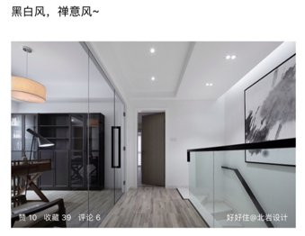

# 建材市场


* 百安居

* 佳好佳的生活馆

  秋涛路

* 新时代

* 月星家居

  莫干山路


* [杭州建材市场选购攻略-好好住](https://m.haohaozhu.com/blank/00008vd05000gksv.html?TmkraUlSb0lCOGtRdUdCSk4rL0xuZz09OjY4MDU1NjIzMjg3ZTM5MmM0Y2E3YmM4YTBhNWMxNDRl)


# 木类


* 考虑变形避开实木： 厨卫阳台 

  `衣柜其实还好，衣柜变形那是单一平面太大，结构工艺没做好`

* 欧松+KD贴面（或者仿KD）是种不错的组合

  胶水注意。

  崔神建议柜子这么做。

  `榻榻米我建议用松木指接或柞木指接吧外贴木饰面，然后榻榻米比较大的门板部分用欧松板+木饰面。。非常牢固。`

  ​


```
在选择橱柜、家具时，请留意厂商是否具有由爱格板指定代理商公司签发的“授权书”。为确保您的权益不受侵害，可要求厂商在销售发票或者出货单上注明您所购买的家具、橱柜的板材是产地在欧洲的原装进口爱格板。
```


```
经过比较，最后的我选择的是新时代一家衣柜商家BTL做衣柜。
虽然不像好*客，索*亚这么知名，但是我觉得无论是板材的使用还是售前售后上面来说，还是比较专业的，尝试下看看，大家可以关注下后续的服务 家居小七 贝特莱小胡 
```


* 新时代家居 - 贝莱特 - 衣柜等定制，爱格授权。。。

* pole北欧家居，淘宝有店

  做 实木定制、沙发、床垫等。

  床北美白橡/北美樱桃/北美黑胡桃，分别6xxx/7xxx/9xxx。 https://item.taobao.com/item.htm?spm=a1z10.3-c-s.w4002-17469638224.49.36ae41c9b0xLzm&id=549247682984

  萧山闻堰有体验馆。

  `床头柜隔板也是同种实木，有些五斗柜不是同一种材质也会明确告知`

* 千年舟地板专卖(宏丰店)

  地址：宏丰家居建材城内3楼392号

  电话：13646812083

* 千年舟饰材专卖(杭州老余杭店)

  地址：余杭镇联兴路169-173号

  电话：0571-88671151

* 千年舟健康生活馆(西湖新时代店)

  地址：古墩路705号新时代紫金广场家具馆

  电话：13906535344

* 千年舟饰材专卖(杭州温州村店)

  地址：古墩路华东陶瓷建材市场20栋108-113号

  电话：13515711555


## 全屋定制


### 归朴


```
目前88折，量多再谈。

目前的折扣后：
橱柜：2516.8一米（吊柜地柜台面 - 意大利原装进口的CLEAF可丽芙橱柜，柜体奥地利进口克诺斯邦， 门铰为百隆（带标配阻尼））
衣柜：1214一投影面积（CLEAF+克诺斯邦）
走入式衣柜（铝合金面框+进口玻璃+克诺斯邦柜体）：1390一投影面积
鞋柜卡座等：246一展开面积+774一平CLEAF柜门


”【进口玻璃门+铝合金边框】【德国F4星级环保爱格柜体】【标配奥地利BLUM铰链】【设计师一对一量身设计】【柜体五年质保】【五金终身质保】“

【归朴整体定制衣柜定做步入式衣帽间定制衣柜定制衣柜玻璃门】http://m.tb.cn/h.WwpK4Ml 点击链接，再选择浏览器打开；或复制这条信息￥tdNW0rf9YSe￥后打开手淘

用料: 爱格、克诺斯邦、cleaf、各种实木、blum等。

现代风格的橱柜，意大利原装进口的CLEAF可丽芙橱柜，柜体奥地利进口克诺斯邦， 门铰为百隆（带标配阻尼）。地柜每米是1360元，吊柜每米是1080元，单色石英石台面每米是680元特惠套餐下来地柜+台面才1780元一米，吊柜1080元一米。

衣柜 储物柜 都是按照1380一个平方计算的 投影面积计算
走入式衣帽间/衣柜: 铝合金+玻璃门1580
然后卡座  鞋柜 都是按照展开面积计算的  展开面积就是每一块板子平铺的面板  柜体按照280一个平方计算 柜门做可丽芙的话是880一个平方的

他们家有四个店，归朴，归璞什么的否是一家。
```


### 芒果


```
杭州好像就这两家爱格橱柜
汉斯伯格和芒果的联系方式淘宝上和爱格官网上都能搜到
```


* 杭州市余杭区临平江南家居2楼D013芒果橱柜
* 卫信15258837002


### 汉斯伯格


* **德胜东路2888号恒大国际建材家具博览中心A馆3楼1008号汉斯伯格**
* **威信号和联系电话是13250830973**


## 地板

* 强化

  * 太薄的话（0.8）脚感问题

    打地龙、加一层木工板/多层板： 环保问题（费钱问题）


比较

* 强化
  * 优点
    * 耐磨
    * 造型丰富
    * 便宜（相对而言，进口强化跟国内复合甚至实木差不多）
  * 缺点
    * 不耐水
    * 脚感（8mm欧标、12mm中国专供 - 有点担心）
    * 不环保（进口估计还好）
* 实木
  * 优点
    * 冬暖夏凉
    * 脚感好
    * 环保/安全
  * 缺点
    * 打理麻烦
    * 不耐操
    * 贵


### 购买

* 公司团购千年舟


## 榻榻米

- 沃达王/woodone


## 橱柜


* 台面上面（吊柜下方）加灯带 - 操作区光线好

  不然背对光

* 高低台面分区？

* 阻尼、气撑


1、全拉的抽屉一定比半拉的抽屉实用。

2、地柜多做抽屉更加方便。

3、吊柜太高使用不方便（但是可以通过特殊的五金配件解决比如：升降篮）。

4、水槽龙头高一点更加方便。

5、背光操作体验不好，所以橱柜灯光设计很重要。


## 床


* `留给床垫的高度尽量多，美国好床垫很多都很厚，欧洲的不厚但很贵`

  ​


### 床垫


* https://www.chiphell.com/thread-1744035-1-1.html
* ​


# 五金


* 海蒂诗可以在官网找实体店

  `在秋涛路佳好佳，杀过去，店里既有海蒂诗也有百隆~ 海蒂诗价格比天猫贵，天猫优惠后1100元（63个全盖、10个半盖）左右，实体店1580元`

* 百隆 `打了下官方电话，全盖39，半盖49，没有任何优惠，客服表示全部奥地利进口、没有国产，远低于这个价格的都是假货！！`


* `姜戈工坊`

  百隆

  凯斯宝马

  ...

  据说保真，不然打断腿 = =


# 瓷砖


* 佛山产

  `瓷砖这个东西，没有什么特殊的工艺，除非一些特殊花纹，你非这款不可的，其他普通款式的挑广东佛山产总差不离。`


* 杭陶


# 石材


```
石材、加工费、送货安装费，全部加起来，8000+ [s2016]

雅士白好点的680一方
```


* `浙江石材市场`

  **不要去温州村**

* boxer强烈推荐`杭州群利石材`，说是价格质量服务满分 = =

  13486366562


# 门窗


## 门


* `璞园小区里都推荐宏丰家具城的润安木门  但我的还没做  所以没看到效果  你可以去了解下`
* `妹子给你个参考，我做的是 实木、多层、贴面、实木是普通木（好像是水曲柳，忘记了），包含三个扇叶、一把门锁，包含安装、运送和搬运费 beiyu 价钱950 多层实木+实木贴面`


## 防盗门


### 锁


https://www.chiphell.com/thread-1766703-1-1.html


## 铝合金窗


* 考虑润美吧

  ```
  【包阳台下定金】
  杭州市面上基本都是“凤铝”，但假的实在太多，价格也是参差不齐。今天先去了二轻市场，原因是看一篇日记里说那里有另一个品牌“坚美”。一开始以为店面就叫“坚美”什么的，逛了好几圈都没看见。只能一家家走进去看，基本都是凤铝，断桥90价格报500的、580的都有，金刚纱窗200一平，拐角另加80一米。其中一家说坚美也能做，600一平。对这个真假实在没底，就去了温州村的凤铝代理商。那边断桥70的价格比二轻报的90价格还高，纱窗和转角都翻一番不止。汗啊。。。老板娘信誓旦旦地说低于她的价格肯定是假的。凤铝断桥70、90的材料壁厚都是1.4mm。外面有些山寨的壁厚比真货还厚，但材质不行。怎么办呢，就算是拿着游标卡尺去量，也不能检验出材质真假。实在没有辨别真伪的能力，花钱买安心吧。交了定金，等设计师上门测量… 杭州润美门窗 

  顺便贴一下润美那边凤铝的规格：
  凤铝789 5+9A+5中空钢化
  凤铝G70断桥移窗 5+12A+5中空钢化
  凤铝G90断桥移窗 5+12A+5中空钢化
  断桥都是国标1.4厚度
  阳光房45*80 2.0厚 5+5夹胶钢化 500元/㎡

      与本帖相关的人： 收起

      @杭州润美门窗 
  ```

  ​


## 玻璃墙


* 窄边玻璃墙哪里买

  


# 窗帘


```
窗帘的水也很深啊，价格层次不齐。路过佳好佳一家店进去看了看，麻布的那种198一米、纱窗98一米，轨道另算。
淘宝上关注的日系窗帘，国产的也要89一米，纱窗49一米，木百叶特价329一平方，总体算下来也要9000+
周末去了同事亲戚开的店，价格就实惠多了
```


# 吊顶


## 购买


* 公司团购友邦


# 家电


## 暖通


* jiang
  * 大金一拖六 5.4w
  * 格力一拖六 3.3w
  * 菲斯曼进口两用30kw 2.5w
* xiaowang
  * 菲斯曼进口两用25kw 3.4w
  * 格力2*一拖三 4.3w
  * 松下新风 1.46w
  * 美国恬静净水 7.4w


## 净水


* ```
      大神求指导，怡口的软水609ECM、净水610WHF、RO 800GPRO推荐吗？
  ```


  不缺钱的话随便无妨。如果比较在意成本的话中央净水与软水买开能，润新的就可以了，国内外很多都是他们代工的。基本国内软水代工都在这3-4家企业中。我公司的也是这几家中的一家代工的。这东西技术含量不高。
  ```

* ```
  好一点的牌子都是自有工厂

  要找代工也是台湾系的，例如净水最大代工商 康复乐
  ```

* ​


## 风管机

* 国创集成

  大金风管机，1.2w包安装底价


## 空调


* 铜管（上海飞轮）注意别被调包

  要有字  = =

* 确认设备阳台大小 - 能放下空调外机

  如果多个外机的话怎么放？


## 新风

* 可瑞舒适家

  ？

  http://home.19lou.com/forum-94-thread-147101484277707143-10-1.html

  威特奇新风 ？

  ```
  再次吐槽一下可瑞舒适家，产品和售前都没问题，工程就瑕疵太多了，没有体现出一个正规商家的严谨和规范，让人有点失望。这次虽然是可瑞的工人发现问题，但为什么不在第一次打洞完成的时候认真检查一下呢，如果再拖到安装时发现问题就麻烦更大了。而且我要求洞要在周五前重新打，不然严重影响泥工工期，又是这样那样的理由说可能要拖一拖。直到向可瑞工程部负责人投诉才答应周五来。
  之前有很多人后台私信问我地暖的价格，我都告知了。但以后我还是要加一句，是否推荐可瑞，我持保留意见。
  ```

  囧


* 松下新风150平250风量1.1w

  老款么？ 新款1.5？

  from 十里长亭/格力小王

  ```
  哦我之前问了下松下的门店的，250的老款的要12800，说装五个回风口，其他价少的可能就装一个回风口，你到时候记得问问

  我查了下百度，好像回风口也不是越多越好

  = =
  ```

  ​


## 小厨宝


* 考虑 `德淘：斯宝亚创小厨宝`

  注意配德标插座，但据说德国民用最高16A也即3520kw，可能不够。 再往上就要用工业插座了


## 洗衣机


## 烘衣机


* `烘干机我建议 大家选用 松下的NT45 价格不高，比西门子便宜`

* `烘干机我建议大家可以先BEKO 热交换式的那款`

* ```
  皱不皱和热泵还是一体都没关系
  各家机器设计的区别
  感觉上烘干温度，滚筒直径，风量，装载量都会影响皱褶度
  烘干温度要低，滚筒直径大，然后风量强应该可以改善
  ```

* ​


## 电热毛巾架


# 家具


## 沙发


### 购买


* LAZBOY


# 电路


* 插座面板注意三孔两孔错开
* 注意要hdmi面板，同时布好hdmi线
  * 投影需要
  * 家庭影院需要（音箱）


# 水路


## 增压泵

* `增压泵中午买好了 好住有人推荐的格兰富`

  可以根据实际水压来确定是否购买。

  水电进场时测一下。

  ```
  “360飞雨 水压要4以上 刚给亲戚装的增压泵  压力2都不够”
  ```

* `装在室内吧，室外怕被邻居干`

  = = 抢水


## 水管


* 6分转4分
  * `有一种东西叫25转1/2内丝弯头. 阔盛,就是价格贵了点,但是用料很好.国产伟星,日丰,金德.`
  * `品牌管道都有配套的六转四内丝弯头的`

* 4分入户问题

  ```
      我洗澡喜欢大水流，所以用增压泵
      我家是老房子，4分入户，进来全是6分
      我是不是没必要？反正水电工和工长 ...

  哦~你这个事情，和我家暖气一个性质。暖气入户是六分，但我家里全部改一寸了，师傅说：拍以后不热，供暖公司改管，我家里如果接了六分，那就日后对接就无法享受一寸的热度。但是暂时改了一寸，是毫无用途的。

  但是，你如果加了增压泵，我觉得理论上六分会好于四分
  ```

  ​

  ```
  如果房子小的话不用去想这些问题，比如只有1,2个洗手间而且靠得近的那种.影响较小可以不计.
  这里举个例子可能好说明点：比如某条到热水器前的DN25分成DN20或者DN15接入，可以使入热水器的水压更理想点，具体看布局才怎么分什么什么的.
  大管径（比如DN25六分）装换成小管径（比如DN20）的行为是一种保持压力的行为.
  如果你家的房子大，做设计的时候就应该含有水电设计，通常水电设计的时候会帮你做好了
  ```

  ​

  ```
      dn20才是6分管吧？dn貌似是内径

  DN本来是公称直径，理论上忽略壁厚确实是DN20是6分，但是这个不知道是什么时候国内品牌标管径的时候变成了外径，从有些品牌标外径D20到演化成标外径成DN20，这么多年的约定成俗了，钢管内径15是4分、20是6分。PVC、PPR等厚壁的管子是按外径的，20就是4分、25就是6分了。你可以留意下材料供应商，五金店及水电工人的叫法，有时候容易出误会就是这些地方。
  ```

  ​

  ```
  我家来父母的房子装修，那时候不懂，全屋4分管，结果装好后，比原来没装修前用的旧铁管水压还要小，现在自己房子装修，入户是4分，但我还是全屋6分，目前水管全部排好，试了下水压，那叫一个大！爽！所以千万别信工人用4分的，一定要用6分的。。
  ```

  ​

* ​


# 卫浴


* `角阀搜这个“Schell 49170699 Eckregulierventil mit Comfortgriff 1/2" DN 15”`

  配国外龙头花洒的吧。。。

  暗装还要买阀芯。


## 马桶


### 壁挂


* [天猫旗舰店-德立菲Duravit杜拉维特公司253709壁挂式马桶座便器轻薄缓降盖板-2348](https://detail.tmall.com/item.htm?spm=a230r.1.14.28.54d618790stuuX&id=558480736594&ns=1&abbucket=1&skuId=3639341423656)

  +350安装，包括（可自购）水箱

* [taobao/heavy_jim-德立菲Duravit杜拉维特壁挂式马桶253709家用挂墙排智能坐便器-1999](https://item.taobao.com/item.htm?spm=a230r.1.14.4.54d618790stuuX&id=20109761038&ns=1&abbucket=1#detail)

  +400安装，包括（可自购）水箱


## 淋浴房


* 朗斯


* 德立
* 玫瑰岛
* 。。。


## 地漏


* `用过九牧和潜水艇两家的，九牧的地漏就是保证防臭但是下水慢， 潜水艇用过一代和二代，一代的效果比九牧的好，二代调整了翻盖的角度，下水非常流畅。推荐上潜水艇2代的地漏。`

  `地漏的功能首先是下水，一定要通畅，然后才是防臭，如果不通畅，再怎么防臭都是本末倒置。`

* `这个之前有坛友德淘过类似的地漏，有一个存水壶，对反味，虫子疗效极佳。。。在X宝上找到了国内的代工销售店铺。。。同层排水强烈推荐，普通的需要注意高度。。。`

  

  http://h5.m.taobao.com/awp/core/detail.htm?spm=a1z09.2.0.0.2ed6e797KEHkkF&id=520184133596&_u=ha1mat9907


## 花洒


* 暗装

  汉斯飞雨E360暗装 27376000+15763000+27414000+01800180+2672140

  * 27376000 头顶花洒

  * 15763000 双功能暗装恒温龙头

  * 27414000 

    [汉斯格雅原装Fixfit花洒软管接口 27414000墙接头花洒配件](https://item.taobao.com/item.htm?spm=a230r.1.14.4.6cb81e95JEo7jo&id=530258206939&ns=1&abbucket=1#detail)

    [Hansgrohe PuraVida Fixfit wall outlet hose connection with non-return valve no. 27414000 ](https://www.amazon.de/hansgrohe-Fixfit-Schlauchanschluss-R%C3%BCckflussverhinderer-chrom/dp/B00446AVJG/ref=pd_bxgy_60_img_3?_encoding=UTF8&psc=1&refRID=0BZDQAZYMWFZK5RF32EA)

    也有用 27454000 的

    还可以考虑用这个： [中亚海外购-Hansgrohe porter E 27507000花洒支架镀铬带 isiflex 淋浴软管1.25 m-416RMB](https://www.amazon.cn/dp/B0045ZERUU/ref=sr_1_6?ie=UTF8&qid=1522055418&sr=8-6&keywords=Hansgrohe+%E6%94%AF%E6%9E%B6) 支架+出水搞定，只用一个单花洒即可（无需软管）

  * 01800180 阀芯

    * [Hansgrohe iBox Universal Base Plate-88.93EUR](https://www.amazon.de/Hansgrohe-09098-Universal-Grundk%C3%B6rper-01800180/dp/B0747P91SW/ref=sr_1_2?s=diy&ie=UTF8&qid=1522054931&sr=1-2&keywords=Universal+iBox+Grundk%C3%B6rper+01800180) or [中亚海外购-Hansgrohe 汉斯格雅 09098 8 Universal iBox 机身 01800180-680.24RMB](https://www.amazon.cn/dp/B0747P91SW/?coliid=I35C98AOKOYBDX&colid=3MKWBPE16UPZE&psc=0&ref_=lv_ov_lig_dp_it)
    * [Hansgrohe iBox Universal Base Plate-54.37EUR](https://www.amazon.de/Hansgrohe-01800180-hansgrohe-Grundk%C3%B6rper-universal/dp/B0017VDYGI/ref=sr_1_1?s=diy&ie=UTF8&qid=1522054931&sr=1-1&keywords=Universal+iBox+Grundk%C3%B6rper+01800180) or [中亚海外购-Hansgrohe 汉斯格雅 易宝万能阀芯-1623RMB](https://www.amazon.cn/dp/B0017VDYGI/ref=sr_1_4?ie=UTF8&qid=1522055195&sr=8-4&keywords=Hansgrohe+%E9%98%80%E8%8A%AF) or [天猫旗舰-汉斯格雅暗装万能阀芯01800180-580RMB还可以领券](https://detail.tmall.com/item.htm?spm=a230r.1.14.11.2e917c14j405d2&id=557614861266&cm_id=140105335569ed55e27b&abbucket=1&skuId=3624027146941)

  * 2672140 ?

  * 26720000 手持花洒+支架

  * ​

* 暗装组合商品

  * [现货 德国进口汉 斯黑森林暗装入墙式恒温暗装花洒套装 27376000](https://item.taobao.com/item.htm?spm=a230r.1.14.10.149f69c8yuK3KC&id=548567846422&ns=1&abbucket=1#detail)
  * [汉斯飞雨E360暗装 27376000+15763000+27414000+01800180+2672140](https://item.taobao.com/item.htm?spm=a230r.1.14.10.2e917c14wS4Rbo&id=556387056431&ns=1&abbucket=1#detail)


### 主卫花洒套装选择 - 飞雨

#### 顶喷

* [飞雨雨淋150-1033](https://www.amazon.cn/dp/B00DT4V9W2/ref=sr_1_143?s=amazon-global-store&ie=UTF8&qid=1523353180&sr=8-143&keywords=Hansgrohe)

  


* [E360-2351](https://www.amazon.cn/dp/B00D75N5HU/ref=sr_1_64?s=amazon-global-store&ie=UTF8&qid=1523351444&sr=8-64&keywords=Hansgrohe)

  

* [select S 240-墙面-1920](https://www.amazon.cn/dp/B00GI0GB72/ref=sr_1_20?s=amazon-global-store&ie=UTF8&qid=1523330760&sr=8-20&keywords=Hansgrohe)

  一个连接是 1692 https://www.amazon.cn/dp/B00GI0GB72/ref=sr_1_122?s=amazon-global-store&ie=UTF8&qid=1523353180&sr=8-122&keywords=Hansgrohe&th=1

  

* [select S 300-墙面-2053](https://www.amazon.cn/dp/B00GOE3AVM/ref=sr_1_80?s=amazon-global-store&ie=UTF8&qid=1523352001&sr=8-80&keywords=Hansgrohe)

  

* [select E 300-墙面-2082](https://www.amazon.cn/dp/B00DT4WB3I/ref=sr_1_149?s=amazon-global-store&ie=UTF8&qid=1523353535&sr=8-149&keywords=Hansgrohe)

  


#### 手持花洒

* [洗手间套装-797](https://www.amazon.cn/dp/B01MQJR6ZO/ref=sr_1_224?s=amazon-global-store&ie=UTF8&qid=1523354296&sr=8-224&keywords=Hansgrohe)

  


* [select 150-单花洒-483](https://www.amazon.cn/dp/B005MPH6AA/ref=sr_1_5?s=amazon-global-store&ie=UTF8&qid=1523330760&sr=8-5&keywords=Hansgrohe)

  

  

* [select E 150-节水-单花洒-480](https://www.amazon.cn/dp/B00GJ1A7VQ/ref=sr_1_28?s=amazon-global-store&ie=UTF8&qid=1523331660&sr=8-28&keywords=Hansgrohe)


#### 龙头


* [易斯达E-恒温-暗装-两路-2066](https://www.amazon.cn/dp/B00NP2E11Y/ref=pd_sbs_60_4?_encoding=UTF8&refRID=N91B29A6W7HF045FTP25&th=1)

  ​


* [focus S 31743-暗装-两路-943](https://www.amazon.cn/dp/B0747SS1N5/ref=sr_1_120?s=amazon-global-store&ie=UTF8&qid=1523352338&sr=8-120&keywords=Hansgrohe)

  


* [罗格斯-暗装+两路-534](https://www.amazon.cn/dp/B00KQQ7LEG/ref=sr_1_101?s=amazon-global-store&ie=UTF8&qid=1523352338&sr=8-101&keywords=Hansgrohe)

  title是浴缸龙头，其实配合浴缸的话还要一个出水口（龙头）；

  其实更适合接两路花洒。

  不带恒温。

  

* [梦迪诗-两路-暗装-863](https://www.amazon.cn/dp/B00NP2EULK/ref=sr_1_391?s=amazon-global-store&ie=UTF8&qid=1523355284&sr=8-391&keywords=Hansgrohe)

  

* [talis E-暗装+两路-982](https://www.amazon.cn/dp/B01AM5D4G4/ref=sr_1_108?s=amazon-global-store&ie=UTF8&qid=1523352338&sr=8-108&keywords=Hansgrohe&th=1)

  一路版本： 781

  


* [浴缸龙头+花洒-恒温-明装-2457](https://www.amazon.cn/dp/B00GT56AZO/ref=sr_1_98?s=amazon-global-store&ie=UTF8&qid=1523352338&sr=8-98&keywords=Hansgrohe)

  这个+一路阀门+一个二路分水器的话可以做到 龙头+顶喷+手持

  


* [易斯达select-恒温-花洒+浴缸两路-明装-1706](https://www.amazon.cn/dp/B008M6S8BM/ref=sr_1_10?s=amazon-global-store&ie=UTF8&qid=1523330760&sr=8-10&keywords=Hansgrohe)

  

* [易斯达-恒温-花洒+浴缸两路-明装-997](https://www.amazon.cn/dp/B00872WM0Y/ref=sr_1_14?s=amazon-global-store&ie=UTF8&qid=1523330760&sr=8-14&keywords=Hansgrohe)

  

* [福克斯-花洒+浴缸两路-明装-565](https://www.amazon.cn/dp/B003CF9S1C/ref=sr_1_18?s=amazon-global-store&ie=UTF8&qid=1523330760&sr=8-18&keywords=Hansgrohe)

  

* [ShowerSelect-恒温-手持+顶喷两路-暗装-2150](https://www.amazon.cn/dp/B00GI0G7Q2/ref=sr_1_22?s=amazon-global-store&ie=UTF8&qid=1523330760&sr=8-22&keywords=Hansgrohe)

  实际不是龙头。 混水器+恒温器+分水器。

  显然，不支持浴缸。

  

* [恒温-单出水-暗装](https://www.amazon.cn/dp/B00GI0G6VI/ref=sr_1_260?s=amazon-global-store&ie=UTF8&qid=1523354896&sr=8-260&keywords=Hansgrohe)

  


#### 支架

* [花洒支架-108](https://www.amazon.cn/dp/B0016H1QE0/ref=sr_1_52?s=amazon-global-store&ie=UTF8&qid=1523351444&sr=8-52&keywords=Hansgrohe)

  

* [角度可调支架-196](https://www.amazon.cn/dp/B01IDLQV4Q/ref=sr_1_133?s=amazon-global-store&ie=UTF8&qid=1523353180&sr=8-133&keywords=Hansgrohe)

  


#### 分水器

* [puraVida-844](https://www.amazon.cn/dp/B003A7W8BO/ref=sr_1_233?s=amazon-global-store&ie=UTF8&qid=1523354296&sr=8-233&keywords=Hansgrohe)

  


* [showerSelect...-2710](https://www.amazon.cn/dp/B00NP2EFNI/ref=sr_1_89?s=amazon-global-store&ie=UTF8&qid=1523352001&sr=8-89&keywords=Hansgrohe)

  分水器+混水器+恒温器+支架+出水器

  


* [showerSelect-三路-2104](https://www.amazon.cn/dp/B00GI0G8NE/ref=sr_1_74?s=amazon-global-store&ie=UTF8&qid=1523352001&sr=8-74&keywords=Hansgrohe)

  


#### 出水口

* [暗装-浴缸出水口-629](https://www.amazon.cn/dp/B001NP8HME/ref=sr_1_340?s=amazon-global-store&ie=UTF8&qid=1523355223&sr=8-340&keywords=Hansgrohe)

  


* [fixfit E-带支架-593](https://www.amazon.cn/dp/B018OLNPO4/ref=sr_1_220?s=amazon-global-store&ie=UTF8&qid=1523354296&sr=8-220&keywords=Hansgrohe)

  

  圆的便宜100


* [fixfit-不带软管-带防回流-194](https://www.amazon.cn/dp/B00446AVJG/ref=sr_1_57?s=amazon-global-store&ie=UTF8&qid=1523351444&sr=8-57&keywords=Hansgrohe)

  

  无防回流版本 150

  

  ​

  ​


#### 阀门

* [角阀-89](https://www.amazon.cn/dp/B0024ZZQM6/ref=sr_1_26?s=amazon-global-store&ie=UTF8&qid=1523331660&sr=8-26&keywords=Hansgrohe)

  圆形的157

  


## 浴缸


### 

- `铸铁的结实，但是需要砌台面，浴缸下面需要用黄沙做保温层。`
- `钢的浴缸，整体支架，不用黄沙做保温，但是钢的浴缸怕砸，硬东西一砸就破掉了。`
- `功能型浴缸，一般也就是只能选整体亚克力材质的。`
- `钢的浴缸有冲水和泡泡，比如卡德维`
- `铸铁的不用想功能了，铸铁的做不了功能型`
- `价格的话， 铸铁》 钢》亚克力`
- `独立的需要做水电的时候就处理好下水哦`
- `不考虑按摩的话，就直接普通钢瓷面的好了，带支架的不用做保温层。直接落地上就行了。 但是钢瓷面 一定要注意，不能被硬的东西砸了，很容易破洞。` `不要弄那种大的玻璃瓶子装的沐浴露洗发水什么的。基本问题不大。`
- `一般是瓷砖贴好了就要装的，水电的时候还要确认你水头的位置。`
- `网上买也不麻烦，只要找正规的商家就行，一般会给你送到楼上，整体的一般是都是商家包安装，嵌入式的一般是厂家派人现场指导安装。`


### 购买


[**卡德维筑均专卖店**](https://kaldeweizhujun.tmall.com)2018-03-26价格

* 094 2899
* 373-1/37201 3699
* 172/174/176 11999
* 676/678 16599
* 113 9999
* 750 4599
* 652 7999
* 190 29799
* 232 32999
* 683 7299
* 192 29799


科勒2018-03-26价格

* [**科勒九畴专卖店**](https://kohlerjc.tmall.com) 

  * K-941/940T 3352 没扶手便宜300，1.5再便宜300

  官方旗舰店同价

* [**科勒官方旗舰店**](https://kohler.tmall.com) 

  * 索尚K-943T 8199 1.6的少700，1.5的再少800； 无扶手差六七百
  * 百事利17270 3454-4332
  * 百事利15849 1.7m 4230-4560
  * 雅黛乔731 5729-7035


## 台盆


### 已购


* 平台： 中亚
* 价格： 1099
* 德国唯宝 欧.诺华 台下盆 41626001+TVW105 面盆龙头 套餐


* 购买链接： [Villeroy﹠Boch 德国唯宝 欧.诺华 台下盆 41626001+TVW105 面盆龙头 套餐（主要城市包入户，具体详情请咨询电话：010-85272758或者15311770763，企业QQ：800185278）(供应商直送)](https://www.amazon.cn/gp/product/B01MXHIV5T/ref=oh_aui_detailpage_o00_s00?ie=UTF8&psc=1)


```
买个便宜货提醒，冷热水管，下水器都是欧标，意味着需要欧标角阀。

这款Villeroy﹠Boch 德国唯宝本次的套装包含41626001+TVW105 面盆龙头，龙头也是德国唯宝品牌，不过应该是找人代工生产的，不管怎么样，套装卖一个盆价格，还是很划算。

台下盆为基础陶瓷款，采用普通釉面，宽度530mm，长度320mm，带溢水孔，台下盆设计搭配洗手台，能够让台面更加整洁美观。面盆龙头则使用纯铜材质，镀层厚实，质感良好，造型简约大方。

买个便宜货小编提醒，欧诺华系列算是德国唯宝的低端，多见在高档商场以及5星酒店。

欧 · 诺华系列非常注重细节处理，棱角处恰如其分的圆融打磨是最为突出的特色；洋溢着鲜明的现代主义气质，适合于打造温馨安适的现代居室 。
```


```
包装很到位，水盆 龙头也不错。但其中下水器的配件质量有问题，特别粗糙，并螺纹开裂。还没有安装，联系客服没有人跟进。不知安装是否有问题 或漏水。龙头的进水管为3分的。其他还算可以。

盆是泰国产的，请要求德国原产的用户谨慎购买，没有想象中的好，但质量是没有问题
水龙头做工精细，带下水五金件，质量看上去质地不错。陶瓷面盆釉面非常赞！陶瓷产地标明泰国，

唯宝和汉斯格雅在实体店一起搞活动的比较多。价格也是比较贵的，这个套餐，台盆是泰国产的（Thailand），龙头是国产的（PRC），不过质量还是不错的。自己找的师傅，花了70元安装费。可能泰国产的原因，台盆的边缘瓷性略粗糙，不过比国产好很多了。
```


## 龙头


* [talis S bidetmischer-750](https://www.amazon.cn/dp/B01AM5AH0K/ref=sr_1_336?s=amazon-global-store&ie=UTF8&qid=1523355172&sr=8-336&keywords=Hansgrohe)

  


* [雅生uno-暗装-1420](https://www.amazon.cn/dp/B0018I37G2/ref=sr_1_193?s=amazon-global-store&ie=UTF8&qid=1523353982&sr=8-193&keywords=Hansgrohe)

  


* [台盆-明装-立式-axor-1178](https://www.amazon.cn/dp/B00UATL5YG/ref=sr_1_90?s=amazon-global-store&ie=UTF8&qid=1523352001&sr=8-90&keywords=Hansgrohe)

  


* [台盆-明装-立式-雅生-单把-提拉式-1880](https://www.amazon.cn/dp/B00BAGJTUA/ref=sr_1_58?s=amazon-global-store&ie=UTF8&qid=1523351444&sr=8-58&keywords=Hansgrohe)

  


* [台盆-明装-立式-talis 100-单把-提拉式-1226](https://www.amazon.cn/dp/B01AM5A0KW/ref=sr_1_75?s=amazon-global-store&ie=UTF8&qid=1523352001&sr=8-75&keywords=Hansgrohe)

  

  190 - 1402

  

  ​

* [台盆-明装-立式-talis-单把-提拉式-826](https://www.amazon.cn/dp/B01AM59ORC/ref=sr_1_43?s=amazon-global-store&ie=UTF8&qid=1523331660&sr=8-43&keywords=Hansgrohe)

  


* [台盆-明装-立式-talis S-单把-提拉式-694](https://www.amazon.cn/dp/B008GSK21U/ref=sr_1_130?s=amazon-global-store&ie=UTF8&qid=1523353180&sr=8-130&keywords=Hansgrohe)

  

* [台盆-明装-立式-FOCUS-单把-提拉式-490](https://www.amazon.cn/dp/B00C3GGO3Q/ref=sr_1_40?s=amazon-global-store&ie=UTF8&qid=1523331660&sr=8-40&keywords=Hansgrohe)

  


* [台盆-明装-立式-pureVida-单把-按压式-1655](https://www.amazon.cn/dp/B00446FCVS/ref=sr_1_24?s=amazon-global-store&ie=UTF8&qid=1523330760&sr=8-24&keywords=Hansgrohe)

  


* [台盆-安装-单把-talis-858](https://www.amazon.cn/dp/B003NA5BAS/ref=sr_1_59?s=amazon-global-store&ie=UTF8&qid=1523351444&sr=8-59&keywords=Hansgrohe)

  

* [台盆-暗装-单把-梦迪诗-节水-1316.8](https://www.amazon.cn/dp/B00872WOAW/ref=sr_1_23?s=amazon-global-store&ie=UTF8&qid=1523330760&sr=8-23&keywords=Hansgrohe)

  

* [talis-7173400-1335](https://www.amazon.cn/dp/B01AM5D13A/ref=sr_1_146?s=amazon-global-store&ie=UTF8&qid=1523353535&sr=8-146&keywords=Hansgrohe)

  

* [龙头套件-暗装-单把-799](https://www.amazon.cn/dp/B003NA9M5S/ref=sr_1_15?s=amazon-global-store&ie=UTF8&qid=1523330760&sr=8-15&keywords=Hansgrohe)

  


## 龙头花洒


* 浴缸龙头
* 浴缸花洒
* 顶喷
* 手持花洒
* 恒温龙头
* 分水器


# 品牌


## 日本骊住


```
瓜沥郭总我跟他谈过一次，东西还是蛮全的，基本你能想到的日本建材都能订到。连骊住的推拉窗都可以定。后来还特地在日本注意了一下他们的门，就差点跑去日本的装修市场了。日本还是骊住和沃达王多点，大建的相对好像稍微粗糙点。你决定用谁家的门了吗，一起谈看看能不能拿个好价格。 
```


## 日本大建


* `大建在滨江第六空间有门店，古墩路新时代据说也开了。沃达王、骊住、松下一般是有商家同时做的这几个牌子。`


