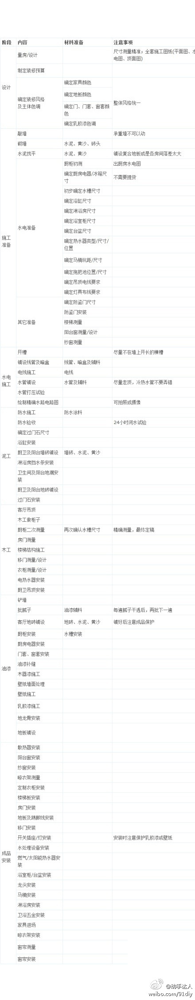

[TOC]


# 装修公司


```
兴丰
互联网家装坑太多，装小蜜配签的碰到互联网家装，每次发现问题很多， 签约成功率比较低
```


## 工作室


```
我找的是工作室，虽然他们一年下来单子没大公司量大，但是所有人都特别负责。。。感觉好幸运。。。
有时候半包找工作室更好，工作室的人是自己要做口碑的

陈萍工作室  我把她手机告诉你  
13003639340

多问一句啊，你选的是哪个设计师和项目经理啊。

他们没有特别分的  都是总管的
```


# 装修流程





# 组件


```
最舒服的是地热源泵，水机这种

其次中央空调，地暖

然后普通空调
```


```
先来解释：两种不同系统内外机怎么连接方式，才更容易解答：两种系统的优缺点。

氟机的主机与室内机之间采用铜管相连，以含氟或者不含氟的制冷剂作为冷媒在铜管内输送。
水机的主机与室内机之间采用水管相连，水管内通过的是水，以水作为制冷介质输送。

氟系统优点：温度调节精度高、室内外机都能变频、节能、噪音小、使用维护保养简单方便。但由于氟机：设备和管道成本高、安装对现场焊接等技术工艺水平要求很高，因此初装成本比较高。广泛适用与别墅和电梯公寓，别墅氟系统空调占有率达九成以上。代表品牌以日系为主：东芝、大金、三菱等，其中东芝中央空调是行业公认的噪音低和节能的中央空调。

水系统中央空调一般用于大型建筑或不担心噪音问题的别墅用户，以高端写字楼为主。代表品牌以美系为主：约克、特灵、麦克维尔等，其中约克空调是美国最好的空调。
 水系统优点：
1:设备预算相比氟系统低。
2:还有个：由于送风温差会小点，直吹不会让人感觉太冷或者太热，舒适度要高些。
 缺点：
1:由于管道里水温温差很大，风机盘管容易氧化腐蚀，而且水管连接更多采用罗纹丝接，时间久了容易出现漏水隐患，对装修顶面的破坏较大。
2:一般大型中央空调蒸发器都需要定时清理和酸洗，但家用水机不方便清洗，长期使用，容易产生水垢堵住：冷热交换器后，工作效率将衰减，堵到不能使用，更换交换器费用昂贵。建议使用水机的客户同时安装软水机过滤水系统的水。
3:由于内外机都是定频压缩机和电机：节能性没多氟机好，且噪音相当大，不适合联排别墅和对噪音要求低的客户。
```


## 窗户


```
全屋换断桥铝窗户，室温能提升2到3度 

断桥铝的保温效果并没有新装平开塑钢好，金属导热好

断桥铝窗户中间是塑料的不是金属。
而且窗户散热主要原因是不严，漏风，而不是材料传导。而断桥铝密闭效果，隔音效果都比塑钢强多了。 

家里窗户换断桥铝，三层玻璃，再不行就在室内和阳台间多加一道门联窗 
还不行，就看楼体保温，加保温层，不过这就是重新装修了 

```


```
那种泡沫塑料保温棉很吓人，是助燃剂，上海出过事，施工时保温棉着火，全楼上下住户死了若干人。岩棉保温对人体有害，早已禁用。玻璃棉保温怕水，夏天漏雨进去就成了一坨了。
唯有黑色橡塑保温棉阻燃、防水，价格最贵，看施工企业有没有良心了。 
```


## 拆旧


```

求拆旧师傅电话
18803637109 我家找他拆的 挺干净
```


## 地暖


```
不是有人说地暖找杭州什么 燃气公司弄。能一个月1500封顶
孔车
孔车
可以打一下燃气公司电话问下，1500一个月很便宜了
娇杏
娇杏
燃气公司弄只是安装一个燃气表，管道和设备得自己买

燃气公司我也不知道，之前是看到网上这样发的，实际是不是1500就不知道了
难道是单独气表做了封顶计费吗？ 666
137人未读
娇杏
娇杏
不过走燃气公司的话，应该温度开不到很高，听说十几度吧
温度不是设备控制的吗？ 限制气流速度？
157人未读
娇杏
娇杏
@孔车  你地暖的设备也是自己买的吧？锅炉，管道
```


## 瓷砖


```
厚雪
设计师给我说，就去杭陶买小牌，很多都是广东产的，都差不多。
一线的阿波罗、诺贝尔水分都比较多
```


## 吊顶


```
北御
吊顶的话，边顶、平顶、一级二级价位都不同，欧式简约根据造型不同价位不同
吊顶的话价位也不一样，基本是50 ~ 200之间每平；然后还有什么防开裂处理啊，等价钱另算
```


## 地板


```
甘华
我也考虑全部地板
沐柔
沐柔
地板 是不是比地砖要贵的
伯信
一般来说，地板比较贵，但是现在地板和地砖档次都非常多，很贵的地砖和很便宜的地板都有

罪歌 会议中
200-400的都有收藏，一般几百一平米的地板自住就好了？
01-18 16:43
芃苗
我家买了实木的，杂七杂八全包，380元一平
芃苗
感觉算便宜的，不过安装就忧伤了。。还是买大牌的服务好点的
罪歌 会议中
哪个品牌
芃苗
大友
01-18 17:09
罪歌 会议中
安装费一平米多少呢
芃苗
记得原来光板是330元，打木龙骨什么的加一起50全包
北御 出差杭州紧急问题咨询息辕
北御
地板不是免费铺吗？龙骨除外，我家都是免费铺的 @芃苗 
罪歌 会议中
谁免费铺？
芃苗
龙骨要钱呀，富得利要65元好像，踢脚线，杀虫剂，胶水还要另算
北御 出差杭州紧急问题咨询息辕
北御
喔，我买的时候，胶水啥的，都让他给我包了，估计是算到总价里了
北御 出差杭州紧急问题咨询息辕
01-18 17:16:26
北御
卖地板的
```


## 家具


### 衣柜


```
北御
衣柜很多种，颗粒，指接，原木，多层；还分为樱桃、水曲柳等等；造型还分为玻璃、金属、免漆板等等；价位都不一样
衣柜一般都是600~800/平是最便宜的了
原木>指接>多层>颗粒
胡桃木>樱桃木>水曲柳、橡木等等
烤漆板、免漆板等；太多了，可以百度之
```


## 家电


### 空调


```
北御
富士很少考虑  」
--------
厚雪
市场占有率低，主要做工装，家用的很少，买了邮问题怕售后麻烦
```


```
北御 出差杭州紧急问题咨询息辕
北御
中央空调就那么几家：大金、日立、东芝、三菱重工、三菱电机
至于好不好，各有优势，基本上是大金最贵，日立最便宜
每家都有自己独特技术

格力性价比更高
北御 出差杭州紧急问题咨询息辕
北御
其实还要看需要多大功率的，如果超过6~7P，就需要380V动力电，就需要使用涡轮技术；如果5~6P以下，双转子就OK
北御 出差杭州紧急问题咨询息辕
北御
还要看是否考虑制热，例如日立的制热比较差；配合地暖比较好
所以没办法一句话说，好还是不好的
所以需要个优劣势列表。 
75人未读
柏坚 Tree New Bee
准备吃土上大金的
五様 90 90
好专业呀
北御 出差杭州紧急问题咨询息辕
北御
如果都选日本这几个，其实这个东西可能到最后就是看个人心理价位了
北御 出差杭州紧急问题咨询息辕
北御
大金应对国内市场改造是最多的
北御 出差杭州紧急问题咨询息辕
北御
但是基本也是最贵的
北御 出差杭州紧急问题咨询息辕
北御
基本就考虑几点：
多大功率、冷热需求、价格、能耗其实就差不多了

像那些什么分歧管哇，水泵啊、涡轮转子啊太技术化了，如果也考虑，后面就懵了
```


```
 会议中
01-17 21:01:54
问下哦，中央空调，比如选大金，除了一拖几，几匹这些要考虑，还有哪些指标？
芷言 会议中
就是比较价格的时候要参照哪些参数
北御 出差杭州紧急问题咨询息辕
北御
制冷量，功率能耗，能效比、冷量配比，主电箱电线、甚至是外机涡轮转子、抽水方式、噪音、风量、保养时间等；
简单想了下，只想到这么多 @芷言 
芷言 会议中
专业，我想选大金的话，应该拿着新款型号去各家店比较价格就好了吧
北御 出差杭州紧急问题咨询息辕
01-17 21:10:23
北御
是的，反正型号你都定了，就比较下各家呗，不过你走访的方式去问，估计价钱都差不多。。。如果差很多，你又不敢买了
```


### 新风


```
厚雪
01-15 16:52:04
@邢远  「 中央空调都会带新风系统吗？  」
--------
没有
```


## 防水


**卫浴间防水高1.8米**

**非淋浴墙原则上防水涂料不能低于30厘米**。但为了强化防水作用，建议统一做到180厘米高，防水做低了，长期喷淋造成水浸透墙体，会使墙体霉变、墙面装饰层涂料或面砖剥落。对于厕浴间改造的轻体墙和自建轻体墙，建议防水高度做到顶部。防水涂料目前国家验收规范的**1.5mm厚**。


**阳台,厨房有地漏也要做防水**

厨房洗菜时，厨具会不同程度有水溢出，易造成水沿着地漏的缝隙渗漏，因此厨房尽量做防水保护。建议厨房地面及墙体上翻30cm做防水，在洗菜盆安置的墙体和阳台有水龙头的上翻150cm设置防水层位最佳。外露阳台由于暴露在外部环境中，必须要做防水，避免雨雪等积水渗到楼下。


**防水检查**

电改造结束后，马上就要做防水。检验防水效果的好坏，主要通过做**闭水试验**。**闭水试验通常在最后一遍涂刷防水涂料12小时、待防水涂料与基层原始结构牢固结合后进行**。

**具体操作：**封好门口及下水口，在卫生间地面蓄满水达到3-5厘米的高度，并做上记号，24小时内若水面无明显下降，特别楼下住家的房顶没有发生渗漏，防水就做合格了。验收不合格，防水工程必须整体重做并重新进行验收。


# 卫生间


## 防水


见 组件-防水


## 拖把池


## 电器


### 小厨宝


# 其他


## 车位

* 环氧地坪

  > 邻居燕子飞说可以拼单，她两个车位。

* 考虑更换（遥控）地锁

  做了环氧地坪的话可以考虑用强力胶水，就不用开洞了。

  但考虑如果换锁的话 = =

  也有说法“很好用，就是送的胶水不行，粘不住。只能打螺丝了02.09”


ref：

```
地下车库地面需要达到抗重压，耐磨损，防尘，防水，美观即可。

可选用环氧砂浆地坪，施工工艺如下：

1、基层打磨处理；

2、涂刷高效环氧底漆；

3、涂刷无溶剂中涂层砂浆

4、涂刷环氧腻子两遍；

5、涂刷高效环氧面漆两遍；

环氧砂浆地坪施工报价在28元-55元之间，具体的报价还需根据地面情况和用户要求最终决定。
```


