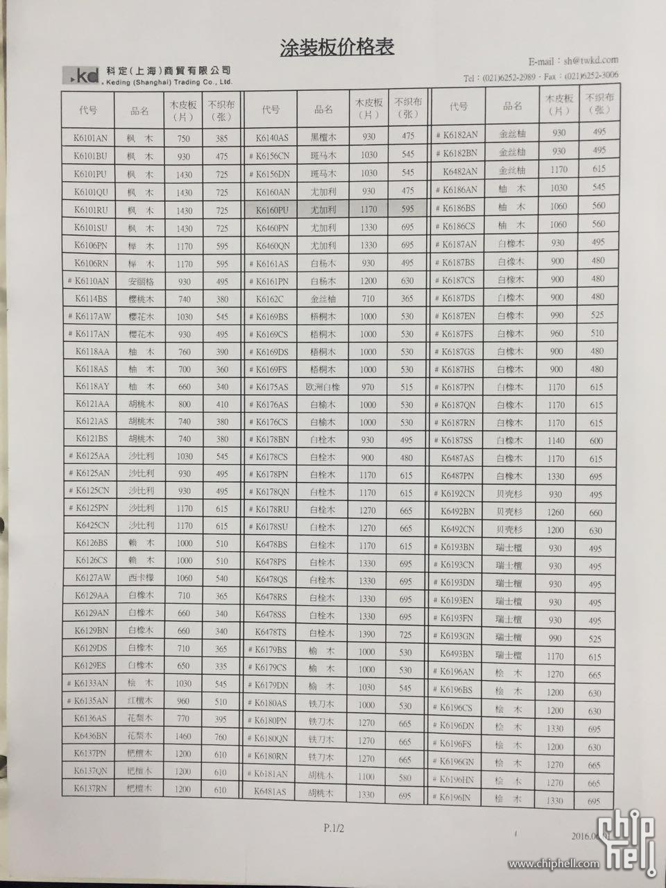
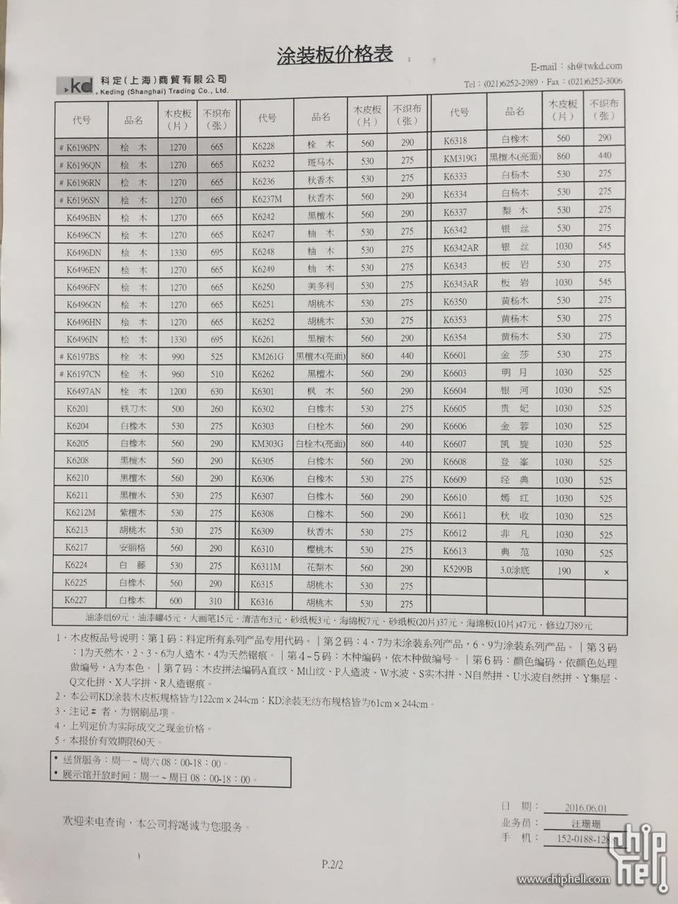
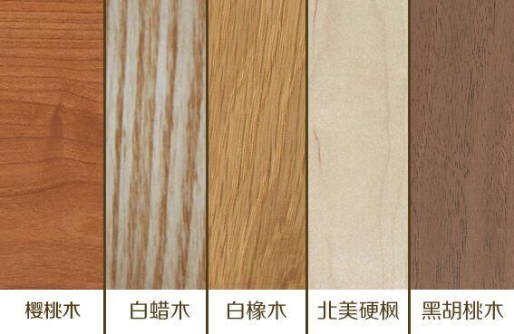
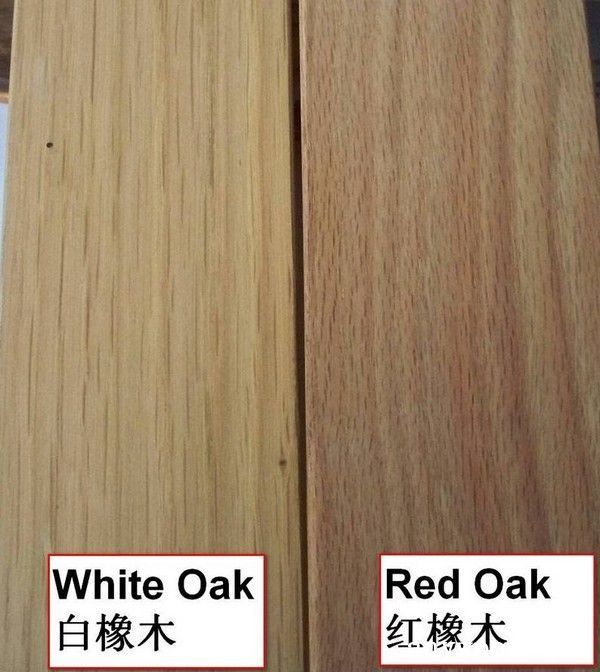

## 家具


- ref： 江苏蠡口。有个专门的家具市场，比什么华东家具便宜多了。

  比南浔远一倍，不走高速176km四个多小时

- Ref: 连家具带软装全部HH一次搞定，反正尺寸调整也能给你定制

- 东阳

- 南浔

- 我也买了全套黑胡桃木，确实漂亮。而且这个东西稀缺。至于价格，可以找原创设计师品牌的店去买，东信和创园里有很多。基本比大品牌的能便宜40%吧

- 去萧山，随便一个镇上，红木家具，万把左右就很好了。就是比较中式。沙发真皮的，安吉那边。木地板，南浔。卫浴，党山。要好的，基本都在广东佛山中山这些地方

- 建议去东信和创园、华源创意工场、滨江utt看看


- 易木山舍（淘宝店）
- 新中式做的最有味道的是U+但杭州只有第六空间有，价格很高
- ​

```
高端产品才有足够的利润空间，不然商家怎么支付得起昂贵的门店房租和人工
要便宜的话去小一点的家居市场或门店看看，或者找家具厂家定做，挑中低端一点的木材
不过实木家具这玩意水太深，即使做足了功课也难免不被坑

```


```
介绍你个品牌，杭州的，胡桃木做的不错，杭州有展厅
素也家具

```


```
去郊区点的，比如良渚有个上亿（绕城上就看得到了），闲林五常那有个宏丰，不会那么贵

```


```
我去看了，第6空间和美凯龙不超过3家卖橡木的，橡木的却是看起来还不错，但是款式太少了。基本上全部都是 ...

你要选款式就无解了。
我是中式的，无所谓款式只重视材质，
所以我是自己买的血檀随便找人加工。
成品后算了算和品牌的橡木价格基本差不多。

买木材不麻烦，都是按立方算的，边角料多出来可以做小孩的板凳，
只要是信得过的厂或者师傅做的就行。
纯手工太贵，毕竟不是专业的收藏家，越黄之类的高端木材，还是找一家厂实惠。

    懂了，非常感谢。我去外面问问。

不过只能简单的中式，别的款式随便找厂加工，很可能不搭。
看你口味。

我只想说实木定制不要找那个上海的梦工厂，我买过，又贵又不好。我们装修群里好几个人买完后推荐“易木”，黑胡桃木的，价格不算很便宜，但是好像比你看得价格要便宜。

```


```
- 目前来讲，只有黑胡桃能同时满足实木，品质感，简约，耐看这几个条件。。其他类似原木的太廉价，橡木的粗糙没品质感，红木的太老气，当然，那种混油漆看不出来什么木的就更LOW了。

```


### 选购参考


```
10、家具
家具这里只介绍木制家具，主要还是实木原木家具，那种用所谓兔宝宝、千年舟生态板钉子钉出来的不在讨论范围中。个人还是偏好中国传统的榫卯结构的实木原木家具。最早关注到这种新中式简约风格的家具早在2013年。当时印象比较深的北京的梵几、杭州的木智工坊。同一时代的还有上海的半木，后来综合比较上海家里选择了杭州木智工坊的白橡家具。但是这种家具遇到了一个巨大问题，没有合适的大衣柜。搜罗全网，找到了比利时家具制造商Ethnicraft设计的移门大衣柜就是我心里寻找的目标，而且碰巧这家公司在上海有办事处，几经磋商购买了大陆地区第一台这款原版的大衣柜，从下单定金到货安装耗时半年时间。
几年过去了，国内独立设计师的家具品牌也越来越多，但是设计风格基本上大同小异其实和日本设计的简约家具很像。但是北欧的节约自成一派，比日式的简约更加的粗放。最终定为装修采用胡桃木家具，综合性价比和设计最终选择的还是杭州木智工坊的，期间也同时研究了希尔巴赫（制造地嘉兴）、传世（制造地苏州）、比利时的Ethnicraft的胡桃木家具。胡桃木家具的表面处理各家公司还有所区别，比利时Ethnicraft一如既往的采用抛光面，不做其他处理，希尔巴赫、传世采用的osmo木蜡油处理而木智工坊采用的是大宝的硝基漆。
```


### 木工


```
再多说一点，家装公司的木工那不能算木工，钉子木匠谁都能做，家装公司干活要快要量，他们是不会给你做实木家具的。要请老木匠，做过八仙桌的那种，隼铆结构，不用一颗钉子的。老木匠的工钱不贵的，比起家装公司干活实在，你需要的是给他多一些时间。一个半月可以把你做好100平米房子的全部家具。 
```


### 漆工


* 开放漆

  1、开放漆是指能够看到木纹的天然特征,只是改变一下颜色而已,这是欧美国家常用的涂饰方法,即在已经处理的底材上用水性色浆将木材着色,再经打磨、上底漆,然后再上透明面漆。基本工艺流程为:打磨--底漆--打磨--底着色--二度底漆--打磨--面修色--面漆。

  2、但开放漆过度依赖于原始木材基质的纹理,所以相对来说在选料方面比较严格和苛刻。

  所以说开放漆是一种完全显露木材表面纹理棕孔的喷漆工艺,表现为木孔明显,纹理清晰,自然感强,但其成本高,对喷涂技术要求高。一般来说做开放漆要求木材的棕孔必须较深很明显,如橡木、水曲柳等。

  开放漆表面纹路清晰，立体感强，可以摸得到纹路。

  优点：

  1、木纹颜色亮丽、质感突出、自然，同时色浆、油漆直接渗入木眼，受到气温变化时能够与木质同步热胀冷缩，不易褪色、不择色。

  2、开放漆保留了木材本身的木质纹理，触摸是可以明显的感觉到原木的凸凹质感，带给人强烈的自然感受。

  ```
  并不是所有的木皮或木材都可以做开放漆，如果木材的导管较细而密的话，如桦木、枫木只能做封闭漆。如果导管较深很明显，如橡木、水曲柳等高档木材，才可以做开放漆。
  ```

* 封闭漆

  1、封闭底漆起封闭基材气孔毛孔纤维导管的作用,成膜胶状,很难打磨。一般调的稀点。粘度还是高的。二遍底漆一般漆的较厚,便于打磨平整,所以一般调的稠点。好打磨的透明度差点,透明度好的打磨要慢点。所以二便漆又分为分实木底(易打磨)和贴纸底(透明度好)。

  2、所以说封闭漆是木材表面纹理棕孔完全被油漆封闭为主要特征的一种喷漆工艺,表现为木材基质表面漆膜丰满,厚实,亮光,表面光滑,封闭漆可以适合所有木材基质。

  封闭漆是一般为喷涂产品表面,木材的自然纹理被漆面掩盖封闭,所以表面光滑,呈镜面效果。

  封闭漆，表面虽然可以看见木纹，但是手感光滑细腻，有光泽感。


```
这两种工艺的木门质量上并没有大的区别，不过从成本上来说，开放漆木门成本比一般封闭漆木门要高一点，一般要高两三百元以上。
```


```
木门的涂装工艺可以分为封闭式涂装,开放式涂装,还有半开放式涂装,鉴别的方法主要是看木纹和导管的显露情况。

(1)、全封闭式涂装全,封闭式木门看不到木纹和导管,木材完全被油漆遮盖。
(2)、半开放式涂装,半开放式木门可以看到木纹和导管,导管用填充剂进行完全填充。
(3)、全开放式涂装,全开放式木门除了能看到木纹和导管外,肉眼还能看到明显的针孔样的导管孔的凹陷。
```


```
封闭和开放的区别就在于木材的基质

在基质相同的情况下木材质导管的开放与封闭,主要是油漆的施工用量与固体份,一般来讲硝基用于开放木材基质效果较好pu需要稀释使用也行,PE就很难用于开放木材基质。相反需要封闭家具的效果PE效果较好,PU需要3遍以上底漆,而硝基则效果很差,很难全封闭,最多搞半封闭的。
```


#### 木蜡油

```
选用比较好的木蜡油品牌，比如欧诗木
```


### 打磨


```
打磨不同工艺要选取日本双鹰不同型号的打磨砂纸。

没有好的砂纸，同样的打磨过程出来手感就会差强人意。

下面为日本双鹰打磨砂纸的介绍

最佳背纸：采用日本乳胶纸，张力及抗拆力俱佳，耐水耐油，纸背经过防滑处理，非常耐用。

最佳磨料：全部用PA高硬度金刚砂，纯度及密度非一般金刚砂可比，全部用电子 静电子 静电技术涂布，每一平方时之砂含量及均衡性达世界最高标准。

最佳涂浆：低浆及面浆用日本双鹰厂独有之配方，不但磨料牢固，切削有力，耐水性强，更增加纸张的强度。


九道工序一丝不苟才能尽木之美

第一步：用1号砂纸（实际为xxx目砂纸，为保密起见我们用内部代号代替，以下同此原因），做初步的粗糙打磨；

第二步：用2号砂纸，手工与小型机械并用，进行相对细致的打磨；

第三步：上虫胶，要特别注意涂抹的薄厚均匀（紫虫胶是种小昆虫的分泌物，天然物质，环保），虫胶可以激发实木潜在的毛刺，以便在进一步打磨后更具质感；

注：紫胶是自然界中唯一一种由动物分泌的树脂， 其是由紫胶虫吸取寄主树树液后分泌出的紫色天然树脂。又称虫胶、赤胶、紫草茸等。

第四步：虫胶晾干后，仍然用2号砂纸，手工打磨到初具手感；

第五步：之后用3号砂纸手工进一步打磨至手感相当舒适，达到上蜡前的最佳状态；

第六步：上第一遍木蜡油，此木蜡为A型号木蜡【同是用代号替代】，不同木蜡油的作用也不一样，涂抹均匀细致，并晾干；

第七步：晾干后用4号砂纸手工打磨，使家具表面初步形成温暖和丝滑的质感；

第八步：上第二遍木蜡油，使用B型号木蜡，以达到防汗和一定程度防水【木蜡油与油漆不同，无法达到封胶上漆的防水效果】，让婴儿般的触感更油润细腻，嗯，想想德芙。


第九步：晾干后，用棉质棉丝整体擦拭，搞定。

PS：以一把椅子为例，从第一遍打磨到最后一道擦拭，即使一刻不停都要4天以上，而晾干时间又经常难以确定，所以往往都要一个星期以上的时间才能完工。这其中还有细致的修复瑕疵和调色的问题，并不是一个简简单单擦完了事的过程。
```


### 材料


#### 甲醛


```
制造板材都要施胶，一提到胶，立马联想到甲醛环保白血病，说实话，感觉这几年商家炒环保概念炒得火热，大家的心态都有点疯魔了，觉得总有厂家想害朕。

厂家都愿意使劲加胶么？有时候真不是。工厂生产都得控制原料的成本，哪怕是最便宜的白乳胶，也比木头渣子贵，所以胶能少用，人家绝不会给你多用的。为了节省，压板的过程中挤出来的胶还要回收二次利用，这时候厂家和消费者虽然目的不一样，但心情是一样的，都希望胶多挤出来一点是一点。而且压板是在100多度高温下进行的，温度越高甲醛挥发越快，所以在制作过程中，甲醛就挥发掉很多了。

但是怕什么呢？怕厂家为了节省成本，用坏胶不用好胶。板材常用的胶有两种，酚醛树脂和脲醛树脂。脲醛树脂便宜，厂家爱用，但生成脲醛树脂的化学反应式是：尿素+甲醛＜——＞脲醛树脂，这是个可逆反应，温度稍微高一些，反应从右往左进行，脲醛树脂分解，变成游离甲醛从板子里释放出来，所以不要买使用了脲醛树脂胶的板材。

一般来讲木材越细碎，施胶量越大，听起来密度板会比刨花板胶多一点；但是压板压力越大，胶挤出越多，好像密度板又比刨花板胶少一点；除了制作过程中用多少胶、用什么胶，还有板材封边、贴面、开孔等许多因素，都影响着最终家具成品的甲醛挥发量。。。谁要是能武断地说出密度板家具就是比刨花板家具甲醛多，我就。。。。。

看密度板或刨花板的环保性，目前唯一适用的国标是《室内装饰装修材料 人造板及其制品中甲醛释放限量》(GB 18580-2001)，规定板材只要符合 E1级，就可以用在室内。

此标准没有E0级。

来看看国标里有E0级说法的都是哪些标准：

1、《浸渍纸层压木质地板》（GB/T 18102--2007）规定了强化地板的E0

2、《细木工板》（GB/T 5849-2006）规定了细工木板（大芯板）的E0

3、《普通胶合板》（GB/T 9846-2015）规定了胶合板的E0

以上3个E0，都有各自针对的地板或板材类型，不能混淆用在密度板和刨花板上。

啊，插一嘴，2018年5月1日就要实行新国标了：

    人造板及其制品行业领域唯一的强制性国家标准《室内装饰装修材料 人造板及其制品中甲醛释放限量》(GB18580-2001)16年来首次修订，其中一项重要修订内容就是提升了甲醛释放量限量要求，统一甲醛释放量限量值为0.124mg/m3，限量标志为E1，取消了原来的E2级别，并统一甲醛检测试验方法为“1m³气候箱法”。

“1m³气候箱法”国际通用，说明我大天朝还是在努力争取和国际接轨的。。。。

好些人很迷信欧标，觉得国外认证的E1就是比国内的E1好，真的没必要。。。。你想，板材进口来一般是素板啊，肯定要加工的，谁知道后续哪一步就“加胶污染”了，其中封边挺重要，要知道封边好不好用手摸，摸到有毛边的，说明工艺不达标，一个是不美观，一个是没封严甲醛容易跑出来。

所以要看板材加工后的检测报告，既然在国内检，很自然以国标为准。但是也有特别闲的，真的我觉得就是闲的，国内加工完板材特地送到国外去检，弄一个国外的报告回来，真假先不说，就算是真的，现在的检测方式都是送检，任何机构的任何检测结果都只对样品负责，他送检的那一批板子好，不代表工厂里所有板子都好。

这方面大品牌肯定比小品牌更靠谱一些，购买合同上都写着环保级别，要是还不相信，就让他合同里加上，允许消费者自行送样检测，如果检测不符怎么处理，要盖章。一般都能同意这么写，除非心虚。
```


#### 选材

```
克诺斯邦＞露水河＞三千方
多层＞颗粒
哦，克洛斯邦只有颗粒板， 
```


```
看了几个回答的，基本都是不懂装懂。
一般做柜体的材料如下：
防潮板（也叫刨花板、实木颗粒板）、密度板（一般都是中密度板、纤维板/中纤板，高密度板只用来做地板，如果谁说他的柜体是用高密度板，那是忽悠你）、细木工板（也叫大芯板）、实木多层板（还是多层实木板？也叫夹板）、实木指接板、实木板。

防潮板和密度板最好不要用，最便宜，也最不耐用，强度也最差（密度板强度尚可），而且最不环保（毕竟要用很多胶水把木颗粒或木质纤维粘在一起）。

细木工板和实木多层板都有带三聚氰胺鉓面层的（一般叫免漆生态板，三聚氰胺不吃到肚子里是无毒的）这两种板材比较的话，一般是多层实木板要好一点，实木多层板不易变形，强度大，同一品牌，同一厚度的板材，都是实木多层板比细木工板要贵二十元左右（木工板的木芯一般有柳桉芯、桐木芯、杉木芯，杉木芯的最重，也最贵，木工都比较喜欢，如果用杉木芯的话，价格可能要超过多层实木板）。环保性来讲，这两种板材用的胶水量要比实木颗粒板和密度板要少很多。

我个人建议做橱柜用多层实木板，因为强度大，不易受潮发生变形，做衣柜的话用杉木芯的大芯板。有钱的话可以选择橡胶木指接板或实木拼板。

另外，在选购免漆生态板时，除了要凑近闻一下味道外，还一定要用白色湿布用力擦一擦表面的饰面层，很多质量一般的免漆生态板是会有少许褪色，表现在经过擦拭后白色湿布被染色。
楼主的这个实木多层板质量看起来很一般。
```


#### 品牌


```
露水荷只是一个牌子，不是实木，质量比较过硬，也比较环保
现在露水河生产的板材品种非常多的。指接板。多层板。密度板，三聚氰胺板。胶合板。饰面板。刨花板。建筑膜板。等等。用什么材料要看出什么产品.露水河板材主要原材料是松木，由于树种单一，松木的稳定性也非常好，所以板材的各项工艺指标都非常优良。但由于松木本身的味道，造成有些板材有松木味道。
```


##### 禾香板

```
我觉得挺好的，一点味道都没有，价格我是按照展开面积算的，当时兔宝宝EO级的板价格是160/平方米，禾香板是230/平方米！不过我们是熟人介绍的，价格你参考一下.

	刚刚做完了一整套禾香板定制柜，有一股稻草气味，用京东买的甲醛检测仪看了，有害气体在安全范围内。就是价格贵，两个卧室衣柜一个鞋柜一个隔断柜两个浴室柜总共花了3.2w,这，折成平方算差不多1500一个平方

是不是现在价格贵了，15年装修，我们家是两个卧室的衣柜然后客厅的酒柜收纳柜，书房的书柜书桌，阳台一个落地柜一个吊柜，一共大概2万7不到，兔宝宝的和香板
然后我们是兔宝宝厂家在浙江按照设计图做好然后发过来，再由师傅拼装的，质量感觉很好，唯一遗憾的是遇到个菜鸟设计师，柜子设计的不太合理.当时自己也没经验

有可能是地区价格差异吧。总之算下来比索菲亚的要贵点。最赞的设计师，细节考虑得比较到位，多花了点也就没那么不平衡了。
```

参见 [万华合作商](http://www.whstby.cn/home/index/cooperation/p/1.html)


```
万华禾香板采用的MDI，是万华研究院根据秸秆组分特点研制的专用改性MDI生态胶粘剂，常温下为褐色至深棕色液体。它在PMDI（聚合MDI）的基础上，通过与生物质萃取物反应，改善了PMDI的分子结构，提高了与秸秆纤维的亲和性，具有反应活性高，浸润渗透力强，生成化学键强度高的特点，能克服秸秆有蜡质层、表面自由能低，灰份含量高等特点，与秸秆纤维形成牢固的整体。用途比较广泛，因此还大量被应用于与民生、医疗接触非常紧密的领域，包括服装用莱卡纤维、冰箱内胆材料，甚至是植入人体的人造器官，如人造血管和心脏瓣膜等。所以当然是没有毒的。
```


```
八、说说几个耳熟能详的板材品牌

爱格板：奥地利爱格集团的产品。爱格1961年成立，从一家刨花板厂发展到如今17家工厂，2家做地板，15家做板材，欧洲的E1、E2环保标准最早就是由爱格制定并逐渐被吸纳为欧洲统一标准的，目前所有爱格板都符合欧标E1级。

爱格板只用一种生长在欧洲大陆寒带的针叶树，只用树干，树枝树皮都去掉不用。优点就是好，缺点就是贵，预算充足的童鞋尽可考虑。
爱格板和某品牌颗粒板对比

图里能明显看出来，爱格板不论表层还是中间层，都压得更均匀紧密，空隙小，而且木纤维大片又新鲜，不是陈年烂木，下面的看上去杂料比较多，而且有二次利用的可能性。

一个家具品牌说自己用爱格板，怎么判断真假？

第一上爱格官网查是不是有授权的经销商：https://www.egger.com。然后看经销商供货给哪些家具、橱柜品牌，像华北地区唯一有爱格板授权的经销商是瑞原佳和，瑞原佳和官网上显示了合作品牌的名单：http://www.bj-reggar.com
瑞原佳和进口的爱格板

第二让销售人员出示爱格板使用授权书、板材进口报关单和环保检测报告。报关单要连续日期的，单一张的不行，不能证明品牌一直在进口爱格板，有人就吃过这个亏。环保检测报告也要连续日期的，比较重视这块的品牌，一年能送检好几回。

第三就是签购买合同的时候让他写上用的是爱格板，一定得盖“假一赔十”章。

露水河板：露水河板是吉林森工集团的产品，吉林长白山盛产东北松和硬杂木，是露水河板的原料。这是官网上露水河板的展示页：http://www.jlsgjt.com 。你看看人家就叫自家产品“露水河刨花板”，一点都不玩“实木颗粒”这种文字游戏，多么朴实。

怎么验证露水河板真假？第一是在门店可以用紫外线灯，就是验毛爷爷真假那个小玩意，照板子表面，会显出“吉林森工”和“露水河”的LOGO水印，这水印自然光线下是看不见的，所以不影响平时使用；第二就是上官网看授权客户名单。
紫外线照射下的露水河板LOGO

禾香板：山东烟台万华集团的产品，也算是刨花板的一种。禾香板不用木头，用秸秆和MDI胶，MDI胶即使高温也不产生游离甲醛，检测仪测禾香板甲醛释放量显示0.01（＜0.01以仪器的精度测不出来），趋近于0，所以说禾香板“零甲醛释放”名副其实。

万华能做出这么牛逼的板子，因为人家全称叫“万华化学集团股份有限公司”，之前叫“万华聚氨酯股份有限公司”，本身做聚氨酯起家的，MDI就是聚氨酯产品的原料之一，目前中国有MDI生产资质和能力的只有万华，行业垄断妥妥的。

如果家具销售说他家用禾香板，让他出示烟台万华禾香板的授权书，并且看万华禾香板官网的“零醛阵营”，里面都是和万华有合作的家具品牌。

就算真是合作品牌，因为万华只供应禾香板素板，饰面和封边都是家具工厂自己做，所以一定让家具销售出示板材加工后的甲醛检验证明。
万华官网的禾香板图，左二和左四是素板

大亚板：福建大亚公司的产品，有密度板和刨花板两种。上面爱格板、露水河板、禾香板北方用的多，大亚南方用的多。

南方总体用颗粒板少，用“实木”的多，打引号是因为原木板占30%以上都叫“实木家具”，剩下70%很可能就是指接板或者胶合板。南方潮湿，颗粒板和密度板防潮性不如胶合板；北方干燥，整块木头干缩容易裂，颗粒板和密度板抗干裂，防潮倒是小问题，做好封边就行。

兔宝宝：生产基地在江浙一带，主打环保绿色的口号。明星产品是免漆生态板，就是表面贴三聚氰胺纸的板子，一般2440*1220*17mm，200多一张，主推的“除醛板”和“顺芯板”是欧松板芯，叫“实木多层”的就是胶合板芯。

江浙地区比较有名的还有千年舟、莫干山等，和兔宝宝套路差不多，都是主打生态板，在三聚氰胺饰面工艺下功夫，花色做得很逼真，芯材以胶合板和大芯板为主。
```


实木 > 免漆板 > 生态（木纸）板 > 木屑板


```
一、木板的分类 
 1、 按材质分类可分为：实木板、人造板两大类。目前除了地板和门扇会使用实木板外，一般所使用的板材都是人工加工出来的人造板。 
 2、 按成型分类可分为：实心板、夹板、纤维板、装饰面板、防火板等等。  

二、木板的品种。  
1、 实木板 
 顾名思义，实木板就是采用完整的木材制成的木板材。这些板材坚固耐用、纹路自然，是装修中优中之选。但由于此类板材造价高，而且施工工艺要求高，在装修中使用反而并不多。实木板一般按照板材实质名称分类，没有统一的标准规格。  
2、 夹板 
 夹板，也称胶合板、行内俗称细芯板。由三层或多层一毫米厚的单板或薄板胶贴热压制而成。是目前手工制作家具最为常用的材料。夹板一般分为3厘板、5厘板、9厘板、12厘板、15厘板和18厘板六种规格（1厘即为1mm）。  
3、 装饰面板 
 装饰面板，俗称面板。是将实木板精密刨切成厚度为0.2mm左右的微薄木皮，以夹板为基材，经过胶粘工艺制做而成的具有单面装饰作用的装饰板材。它是夹板存在的特殊方式，厚度为3厘。装饰面板是目前有别于混油做法的一种高级装修材料。 
 4、 细木工板 
 细木工板，行内俗称大芯板。大芯板是由两片单板中间粘压拼接木板而成。大芯板的价格比细芯板要便宜，其竖向(以芯材走向区分)抗弯压强度差，但横向抗弯压强度较高。  
5、 刨花板 
 刨花板是用木材碎料为主要原料，再渗加胶水，添加剂经压制而成的薄型板材。按压制方法可分为挤压刨花板、平压刨花板二类。此类板材主要优点是价格极其便宜。其缺点也很明显：强度极差。一般不适宜制作较大型或者有力学要求的家私。 
 6、密度板 
 密度板，也称纤维板。是以木质纤维或其他植物纤维为原料，施加脲醛树脂或其他适用的胶粘剂制成的人造板材，按其密度的不同，分为高密度板、中密度板、低密度板。密度板由于质软耐冲击，也容易再加工。在国外，密度板是制作家私的一种良好材料，但由于国家关于高度板的标准比国际的标准低数倍，所以，密度板在我国的使用质量还有待提高。  7、 防火板 
 防火板是采用硅质材料或钙质材料为主要原料，与一定比例的纤维材料、轻质骨料、黏合剂和化学添加剂混合，经蒸压技术制成的装饰板材。是目前越来越多使用的一种新型材料，其使用不仅仅是因为防火的因素。防火板的施工对于粘贴胶水的要求比较高，质量较好的防火板价格比装饰面板也要贵。防火板的厚度一般为0.8mm、1mm和1.2mm。 
 8、 三聚氰胺板 
三聚氰胺板，全称是三聚氰胺浸渍胶膜纸饰面人造板。是将带有不同颜色或纹理的纸放入三聚氰胺树脂胶粘剂中浸泡，然后干燥到一定固化程度，将其铺装在刨花板、中密度纤维板或硬质纤维板表面，经热压而成的装饰板。
```


```
模压板就是木渣板的一种，
集成板不是，木片起码是一片片的木材，比木渣结实的多。
切开之后水里泡一夜，烂货就原形毕露。


```

#### 非实木


```
多层实木板

 多层实木板是由三层或多层的单板或薄板经过木板胶贴高温高压制作而成，以纵横交错排列的多层胶合板为基材，表面以优质实木贴皮或科技木为面料，具有变形小、强度大、内在质量好、平整度好、具有自然真实木质的纹理及手感等特点，并且可以根据需求生产5-40㎜不同厚度的层板。

大芯板

 细木工板即我们俗话说的大芯板，是由两片单板中间胶压拼接木板而成。中间木板是由木板加工成一定规格的木条，由拼板机拼接而成。拼接后的木板两面各覆盖两层单板，再经过冷、热压机胶压后完成。大芯板尺寸稳定、不易变形，横向强度较高。

 其实，消费者对于定制衣柜用什么板材关注得很简单，一个是环保，另一个就是在保证实用耐用的前提下，符合经济实惠的原则。所以，下面从环保、实用性能、价格三方面进行比较。

环保性

 多层实木板：虽然环保性与实木板不能相比，但是，经过高温高压、PVC四周封边，让甲醛的释放量达到国家的标准要求，大多能达到E1级。

 大芯板：有好差之分，经过国家等级标准的，环保系数都比较强。我们在选购时，一定要选择E1级的，不能因为价格退而求其次选择E2级，不然甲醛排放量会非常高。

实用性

 多层实木板：是用多层单板压制而成，所以结构稳定性非常好，不易变形，防水性和稳定性都非常的好。

大芯板：质量好的大芯板表面平整光滑，不易翘曲变形，具有强度高、含水率低的特点，但是比较怕潮湿，应避免用在厨房和卫生间。

价格

 多层实木板的强度主要跟板材的基层有关，每增加一层，其强度都会相应的增强，价格也会随之增加。

 大芯板相较于刨花板等要贵，横向抗弯强度也要高很多。同一品牌，同一厚度的大芯板与多层实木板相比价格也比较低。

 综上比较，建议如果预算比较充裕的话，可以选择多层实木板；如果预算稍低，可以选择大芯板，它的抗压程度也很强，但一定要选择质量好、环保性达到E1级的大芯板。
```


##### KD板


```
KD分 科技（人造）木皮和实木木皮，都是台湾科定生产的，饰面环保性达到F4星级，是市面上质量较好的木饰面

科技木的表面较平滑，木纹文理图案基本上简单统一，厚度在3.0mm

实木木皮的表面有凹凸感，手感更接近原木纹，木纹图案更为自然，厚度在3.3mm

关于使用效果：肯定是好的，个人觉得市面上一般的木饰面要好很多。但最终还是看你的设计风格，结合实体的色彩搭配等等

关于维护：基本不需要维护，避免利器磕碰或划伤即可

关于施工：木饰面施工要打好木基层，对木工的手艺有点要求，特别是对角、封边（KD有配套的封边条和漆），如果施工的话建议找有施工经验的木工

关于价格：至于折扣，自己去谈的折扣会少点，一般都是8.5折，9折这样，建议通过装修公司去谈，折扣会好点，我知道的最低折扣是5折，大客户采购的价格

下面的是2016年的价格，现在有没有涨价不清楚（K+四位数字的为科技木，K+四位数字+2位字母的为实木木皮，不织布就是配套的封边材料）

价格表中的价格为整张木饰面价格，一张木饰面为1.22*2.44=2.97平方
```







##### 密度板

- 木粉末


```
全称叫密度纤维板，是木头和其他植物纤维打成粉末加胶热压成的。


密度板用来做什么？

密度板按密度也高中低，家装用中密度的多，也叫中纤板、MDF，常用16、18、20厚（单位mm）。

因为板子压得瓷实，里外都如丝般顺滑，加工很容易，之后上漆和贴皮也都不难。特别适合做有造型的柜门，雕点花刻点线条，美式田园最简单，弄个白色混油，欧式古典稍微麻烦点，贴三聚氰胺纸，看上去就像实木纹。

密度板防水性比较差，一受潮膨胀特别快，板子就翘了，所以密度板最好别用在厨房、卫生间等容易潮的地方，例如做橱柜，用它做好看的柜门行，做承重的柜体就不太行了，一泡变形，板材强度会迅速下降。
```


##### 刨花板

- 木纤维 - 刨花


```
和密度板很像，不过密度板用木粉末，刨花板用木纤维，也就是刨花。而且热压刨花板只要1个压左右，紧实程度不如密度板，切开横截面能看到中间有孔隙。

建材市场上，刨花板通常比密度板便宜点，比如一张2440*1220*16mm的素板，刨花板70多元起价，通常100左右，密度板起价接近100，大多100往上。

密度板和刨花板可能有哪些坑？

这两种板原料都是用针叶树的最好，阔叶树稍差点，但为了降低成本，大多数板子不完全用木头，掺很多蔗渣草杆稻壳之类的杂料，甚至有完全用杂料的，甚至有纸啊废旧家具啊建材垃圾啊也打碎掺进去的。因为密度板全打成粉了，刨花板木纤维也长度不超过2公分，很细小，一般人分不出来是草是木。比如这个刨花板用料就很一般。
```


###### 颗粒板


- 就是刨花板

  > 大概消费者一听「刨花板」，觉得很OUT很廉价，商家就想出了「颗粒板」这个听起来比较高端的新名称；
  >
  > 然后，为了好听，商家总是再加上「实木」两个字，叫做「实木颗粒板」，你可以理解成，实木颗粒板就是不掺蔗渣草渣等下脚料、只用木材原料的刨花板，依然是人造板材，并不是实木板（真正纯实木的那叫「原木板」）。

- ​


```
颗粒板用来做什么？

因为颗粒板内部是交叉错落的木纤维，纤维之间有相互作用力，所以板子韧性好，抗弯，不容易折断，能承重，适合做家具的柜体；而且颗粒板比密度板轻不少，加工省力，也是现在爱用颗粒板不爱用密度板的原因之一。

颗粒板的防水性比密度板强一点，原因和上一条类似，因为木纤维之间有作用力，吸水膨胀到一定程度就不再胀了，至少不像密度板变形得那么快那么厉害，现在大牌橱柜柜体基本都是颗粒板的。

颗粒板表层还算平整，最多有点凹凸颗粒感，里层就不行了，纤维纵横交错的，一挖全是毛刺（切割颗粒板容易爆边也是这个原因），再盖油漆或者贴皮都比较困难。所以颗粒板不好雕花加工，如果做柜门，常见一块平板贴三聚氰胺双饰面的，没有多余造型。

现在三聚氰胺技术相当成熟了，仿原木纹理做得很逼真，让人分不清是真木头还是贴木皮还是贴纸。
橱柜，柜门是密度板贴三聚氰胺，柜体是颗粒板贴三聚氰胺
```


###### 欧松板/OSB

- 也是 刨花板 的一种
- 差不多成了大芯板的升级替代品
- 质量好价格贵，2440*1220mm的怎么也得200多一张
- 特别适合做背景墙造型的基层


```
欧松板也是刨花板的一种，专业点叫定向结构刨花板，从英文Oriented Strand Board翻译过来的，所以OSB板说的也是它。这种板子是早先七八十年代那时候，从欧洲引进的，原材料大多取自欧洲当地的针叶树种，然后国内有个建材公司卖这种板子，就注册了个商标叫“欧松”（和OSB还挺谐音），后来大家叫顺口了就都叫欧松板了。

和一般刨花板肉眼可见的明显区别，就是欧松板的刨花都特别大，都是几何形的长片，没有外面细里边粗的区别，都是纯木头片，松木杨木杉木的都有，几种木材混杂起来的也有；铺装刨花的方式也不同，叫定向铺装，上下两层刨花纵行排列，中间层刨花横向排列，然后热压成板，厚度一般20以上。

因为三层纵横交错结构，欧松板比一般刨花板材质均匀，韧性好，握钉力强，受潮不易膨胀，国外都用它做房屋结构，结实。但比较厚，占地儿，表面不平整难处理，很少用来打家具。

欧松板来到国内，差不多成了大芯板的升级替代品，质量好价格贵，2440*1220mm的怎么也得200多一张。特别适合做背景墙造型的基层，做完上漆或者其他覆盖，直接裸露的很少，除非追求艺术范儿工业范儿。酒店装修用的多，现在高档家装也有用的，大众用的还是少。
```


##### 生态板/免漆板


```
索菲亚也就那样，，就算用的全实木板也是很普通的木材，，，如果用的人造板如免漆板，这个指的是杉木小料或废料外面贴一层木皮，，，生态板一般指各种啥啥纤维板用胶合成，然后外面贴一层木皮，不是好东西，，，，当然就算都是人造板也有好坏，也有甲醛高低之分。。。PS再次解释免漆板，如兔宝宝或千年舟等，市场有卖，，很便宜，，，很多自己请木工用差材料的都用这。。。


```


```
    木纸是什么？这个我真不懂。
    好木料谁舍得切成渣了再用胶水粘起来？

这我知道，说的是各种乱七八糟的东西打成浆糊，然后用胶压成板，外面贴木皮，，，传说比木屑好一点，，，传说叫生态板


比木渣还是好点的，木渣是真正的锯末屑加大量胶水，，，生态板是木浆等（因为打成浆本身有点粘性）加少量胶水，，，

```


##### 大芯板/细木工板

```
大芯板（细木工板）是由小木条拼接芯层，表层双面各用胶贴一块木板而成。

一般也是一棵树或者一段大木桩，锯成特定规格尺寸的小木板。
```


```
谁告诉你大芯板中间什么木头都没有？？学点知识再来 别误人子弟
大芯板就是一般所谓的木工板，是具有实木板芯的胶合板。它是将原木切割成条，拼接成芯，外贴面材加工而成。
指接板又称集成材,由多块木板拼接而成，上下不再粘压夹板，由于竖向木板间采用锯齿状接口，类似两手手指交*对接，故称指接板。
指接板与木工板的用途一样，只是指接板在生产过程中用胶量比木工板少的多，所以是较木工板更为环保的一种板材，目前已有越来越多的人开始选用指接板来替代木工板。 
```


##### 胶合板


```
（划重点）从胶合板的生产和材料你就很容易理解它的特点了：

1、胶合板都是板子一层一层胶合在一起的，所以比实木的便宜很多，硬度也不错，适合现场裁切施工。

2、胶合板用胶比较多，也是因为这个，大家现在逐渐也不用胶合板现场打家具了。


胶合板还有很多别名，例如夹板、三合板、九厘板，分别是按制作工艺、层数、厚度来命名。还有商家叫多层实木板的，就是想往实木上靠，你记得只要是一层一层粘在一起的，就是胶合板。
```


###### 多层实木板


##### 指接板


```
其实指接板的工艺跟大芯板差不多，但指接板可以说是大芯板的2.0版。

迭代后的优势在于一多一少：

1、比普通大芯板多了一道工序，开榫（开齿）
2、比普通大芯板少了上下两面表板，用的胶也就少了很多。
3、指接板的硬度取决于木条是哪种树的，一般要选木材硬一点的指接板来做家具。

指接板还叫齿接板、实木集成材。很多商家就叫做实木板了，其实不是一整块实木。整块都是实木的那种板材，商家一般叫原木板。
```


- 橡木
- 杉木
- 樟木


```
直接与指接都是用小块木材进行纵向胶接，直接是平接，指接是插接，纵接成长条后，再横向胶接。所以指接板受力要大于平接。这两种板做柜子侧板都没疑问，但事前或事后都要刷漆处理，加上漆钱和工钱，个人认为不如用免漆板，免漆板实际上就是在直接板双面各贴了一层三合板并做好漆面。由于双面各贴了一层三合板，所以变形远小于直接板或指接板，也可直接做柜厨门，而直接与指接板都不行。
指接板，指接板由多块木板拼接而成，上下不再粘压夹板，由于竖向木板间采用锯齿状接口，相似两手手指穿插对接。与木工板的用处相同，仅仅指接板在生产过程顶用胶量比木工板少得多，所以是较木工板更为环保的一种板材，已有不断增加的人开端选用指接板来代替木工板。
简介
指接板与木工板的用处相同仅仅指接板在生产过程顶用胶量比木工板少得多，所以是较木工板更为环保的一种板材，已有不断增加的人开端选用指接板来代替木工板。指接板常见厚度有12mm、14mm、16mm、20mm四种，最厚可达36mm。
指接板上下无须张贴夹板，用胶量大大削减。指接板用的胶通常是乳白胶，即聚醋酸乙烯脂的水溶液，是用水做熔剂，无毒无味，就算分化也是醋酸，没毒的。
```


```
一、木工用指接板和大芯板之间的区别即表现在两种的优缺点中。
二、指接板的优缺点
（一）指接板的优点：
1、指接板的表面一般是采用清水漆涂刷的，漆封的环保效果比较好，基本都能够达到E0级，所以使用指接板制作的家具更加环保健康。
2、指接板目前在市场上的价格是比较便宜的，一般在110-180元一张，和一些好的木工板相比，指接板贵不了多少。
（二）指接板的缺点：
1、目前的指接板家具并不是真正传统意义上的实木家具，所以指接板并不具备传统实木家具的耐用性。另外，指接板一般是用松木、柏木等生林木料制作的，材质并不优良，而且它的风干时间一般较短，含水量也较大，很容易造成变形开裂。
2、现代生活中常用的指接板分成单层指接板和三层指接板，三层指接板所采用的方式对于抗变形能力来说，自然要比单层指接板强很多。
三、大芯板（又称“细木工板”）的优缺点
（一）细木工板优点：
1、细木工板板材握螺钉力好，强度高，具有质坚、吸声、绝热等特点，此外细细木工板板材含水率不高，在10%—13%之间，加工简便，广泛用于现代家具、门窗及套、隔断、假墙、暖气罩、窗帘盒等领域。
2、由于细木工板的内部为实木条，所以对加工设备的要求不高，方便现场施工。
3、细木工板的规格统一，易于加工，不易变形，在加工过程中可粘贴其他材料，重量轻，便于施工等，使家庭装修中墙体、顶部装修和木工制作的必不可少的木材制品。
（二）细木工板缺点：
1、因细木工板板材在生产过程中大量使用尿醛胶，甲醛释放量普遍较高，环保性能得不到保证，这就是为什么大部分细木工板板材味道刺鼻的原因；为了确保自己所购买的细木工板材的环保性能，小编建议你最好还是选择正规的板材企业进行产品的挑选。
2、由于细木工板的特殊制作工艺，因此其上下两层是夹板，中间为小块木条压挤的芯材，有时中间有空隙，热胀冷缩后易开胶、鼓面、变形。
```


```
简略辨别指接板好坏的办法是看芯材年轮：指接板多是杉木的，年轮较显着，年轮越大，阐明树龄长，原料也就越好
市面上还有一种樟木指接板出售，用来做衣橱的搁板，能够驱虫，用了这种板，衣橱里就能够不必再放樟脑丸了，仅仅价格较贵，并且只要几家商家有售。
指接板分为明齿和暗齿,暗齿最佳,由于明齿在上漆后较容易呈现不平表象,当然暗齿的加工难度要大些.木质越硬的板越好,由于它的变形要小得多,且斑纹也会漂亮些.
辨别办法
看芯材年轮：指接板多是杉木的，年轮较显着，年轮越大，阐明树龄长，原料也就越好
指接板分为明齿和暗齿，暗齿最佳，由于明齿在上漆后较容易呈现不平表象，当然暗齿的加工难度要大些.木质越硬的板越好，由于它的变形要小得多，且斑纹也会漂亮些。
```


##### 直拼板


```
【直拼板】可说是木素材使用的必然趋势之一。直拼板制成，也是需经过干燥~选材~刨光~平整~侧拼宽度~砂光等重重步骤，利用10~12公分的板材，利用特殊的木胶胶合成所需的宽度。直拼板可说是百年来无法被取代的木料之一。其无法被取代的原因主要是森林砍伐限制，木头取得不易；其次是相较须耗费多年时间长成的大块实木，10~12 公分的板材可拼接成所需要的宽度对于整块桌面的使用上来说~更广泛被为运用 。
```


```
直拼就是只有横向拼接，长度方向上是整料，指接就是小块块跟铺砖一样拼成大块板，指接的花乱不好看，力学性能上也不如直拼，不过有可能变形方面会更小
```


#### 实木





```
普通屌丝人家，白腊或者橡木总还是要的。

对头，所以选白蜡或者白橡红橡等纯实木成品，是普通人家的首选。质优价廉，，，品质有保证。

我家的是衢州巨桑，因为俺时衢州那的，算浙江知名品牌。。。一般市场价白蜡木1.1-1.5左右，我买的6000多点，进货价


```


```
我自己买的血檀，泡水里20年也没问题。
油漆可用可不用，叫油漆工刷华润婴儿漆，不贵。


所有的红木和中端木材都不需要关心持水率。
密度低的廉价木材另当别论。
木渣板不是廉价的问题，而是废料加胶水二次再利用。


    你买的木材，你能保证它的持水率？说来说去，还是用了油漆，还是在家里施工呀！二十年，早换房了，难道家 ...

保值的，搬家当然搬掉，柚木地板都必须拆掉搬走。难道便宜留给下一任房东？


原木自己厂里冲板。
不在乎所谓品牌，只需要保证材质。
木渣料还不是废料？是宝贝？


这个问题其实蛮简单的，成品实木没你说的问题，厂里都已经专业处理了。如果自己家里用高档实木做定制家具，那不要自己买整颗木材，让定制商去专业家具厂进货处理过的原材就OK了


```


```
图片上非洲花梨、黑酸枝、印尼酸枝什么的的这些所谓红木家具，大多属于硬木，不属于国标红木5属8类33种材，不值钱的。玩这类家具，最有把握的，最稳妥的是只玩黄、紫，即：海南黄花梨（降香黄檀）、小叶紫檀（檀香紫檀），但是普通人很难玩得起，现在哪怕就是一个笔筒都贵得不得了。交趾黄檀（大红酸枝）倒是能玩玩，也算是主流红木了，但也不便宜。


```


```
我有红木家具 不贴年年红牌子 （有向年年红供货 价格要贵一倍多）140方房子 三张床组合 柜 客厅组合 全部36万左右 有意向可以联系我 可看货
> 口水 arcaneplague


```


```
非花,非酸,刺猬之类的,远不如橡木值钱.
曾经看到过奸商拿非花冒充大果,甚至冒充黄花梨的.
非洲满大街都是的猪屎木到了中国竟然被包装成红木.

> 刺猬紫檀属于国标红木，加蓬等国家出产的都不是刺猬紫檀，不属于国标红木，是非洲花梨木


```


```
楼主应该去东阳看看，市场里什么款式都有，这种基本款式和材质，卖的太贵了


恩，标的价格还是售价啊，真的蛮贵的；建议到我们老家东阳去看看，可以便宜30-50%。非花大象头都是淘汰的还要4.5w，估计缅花只要这个价格了。
黄花梨和紫檀太贵了，也吃不消；现在收藏建议大红酸枝，很多人毛坯料收藏的。


```


```
“70%以上的产品都是用的北美黑胡桃木，餐桌一般1.7万以上，大一点的书桌2.5万左右，凳子1千5起，五斗柜和电视机柜都一万左右，请问现在的行情就是这样的吗？”

黑胡桃非常好，但这价格也太贵了。本人只了解白蜡木3年前的价格，给你参考参考。。。
1、白蜡木四门大衣柜，市场价格一般1.1-1.5W，门店进货价基本为0.4-0.55倍。。。如我渠道买的白蜡木出厂价，四门衣柜5800，餐边柜3700，等等。。/
2、市场上绝大部分白蜡木或其他实木家具，四周看的见的为白蜡木，看不见的柜体隔板等为其他低端点的木头，这是正常情况。。。
3、实木家具水很深，不要被骗，必须要问清材料，，如不能有贴皮，哪些是主材，哪些是辅材，橡胶木不是橡木，水曲柳比白蜡木便宜（白蜡木指北美进口白蜡木，国内有些把水曲柳也叫白蜡木，价格不一样的），


```


##### 木材等级


```
白橡木主要出口国为俄罗斯，红橡木主要出口国为美国，而这两个国家的板材等级划分标准差异较大。俄罗斯一般采用欧洲板材等级划分标准，主要分为五个等级：A、AB、B、BC、C级。美国一般采用NHLA等级划分标准，主要分为三个等级：FAS(又细分为FAS、FAS单面、特选级)、普一级(Onecom.)、普二级(Twocom.)。俄罗斯和美国标准的主要区别是，美国等级划分标准中将边心材、树瘤、矿物线等缺陷视为允许并不影响木材等级，而在俄罗斯标准中这些天然缺陷则会影响木材等级，比如边心材。目前市场上销售的白橡木，一般以AB级、B级为主，也有少量厂家用BC级木材加工仿古地板，A级木材因为价格原因一般不会用于地板，而是制作高级家具为主;目前市场上销售的红橡木，一般以FAS等级为主，也有少量厂家用普一级木材加工仿古地板。
```


##### 各种实木比较

```
其次，木材好坏与价格不一定相关。
有些木材之所以贵是因为产量少了，或者进口的原因，比如水曲柳，我小时候学校里的课桌椅都是水曲柳的，家里家具一般不乐意用。为啥？因为那玩意太爱变形，做家具不好处理，课桌椅要求就不高了。现在水曲柳国内不让砍伐了，全部东欧俄罗斯进口，就贵了。但是我依然不认为水曲柳是做家具的好木材。如果某厂商说他是100%水曲柳原木，而不是贴皮或者指节板的话，那他的木材处理水平是巨牛的，成本也是高昂的，这样的家具样式不好看，卖价还贵，你基本上找不到了。如果还有的话，我只知道一家，就是大连华丰，前两年还看到的，现在不知道如何了。
橡木在北美是最大众化的家具木材了，之所以贵还是因为进口的原因。北美量产较大较好的木头是胡桃木和樱桃木。顺便说一句，所谓橡木，在咱国家就是栎木，较好的是青冈栎，你能找到的话，很不错。还有，不要被人家用橡胶木忽悠了。
松木，较软，配合漆面较硬的聚氨酯漆就不错，樟子松和红松比白松好。
桦木，木纹细腻漂亮，比松木硬一些。只是桦木家具不好找，你确定自己可以找到？

这些木材，只要处理得当，工艺精湛，做出家具来都比那些板式家具好得多。楼主不要太顾及材质了，要把心思放到鉴别是否实木上去。

根据我的了解，现在大卖场里的大品牌是没有全实木家具的。楼主慎重啊。板式的买了就买了，别掏实木的价钱给人家宰了哦。  
```


```
主要是看个人的喜好了。
我觉得这样现代简约的家具，浅色，纹理简洁的木材合适，表面用清漆处理。比如松木和水曲柳。
松木是很便宜的木材，号称穷人的实木。硬度和韧性都不好。不过，图片中的家具框架粗大，用松木的话强度也没问题，放心用二三十年就可以了。毕竟现在的家具不像老一辈子要传儿女的。
市面上常见的松木优劣排名是： 落叶松>红松>樟子松>白松
落叶松是这几种松木中最硬的，纹理漂亮，日久之后颜色为黄色至浅红；
红松纹理细腻，不易变形，所用常用来做模型。木质比落叶松软；
樟子松纹理漂亮，但是易变形，是现在装修中最常用的松木。价格便宜；
白松很软，不要用。最便宜。
水曲柳硬度和韧性比松木都要好，花纹漂亮。但是易变形。我记得我们小学到中学的课桌就是水曲柳的，倒是结实，就是裂得歪瓜裂枣的。所以水曲柳最常用的用途是做家具的贴面，现在很多水曲柳家具都是里面用便宜木材，外面贴面的。若家具厂工艺较好，可以处理好木材的话，用水曲柳实木做出来效果很好。 
```


##### 榉木


```
俗话说北榆南榉，榉木的特点和榆木很近，可参考榆木，也是不错的木料，但是榉木的价格并不贵。
做家具普通的木料橡木、松木、桦木、水曲柳、柞木、胡桃木、樱桃木、梓木、柳桉等原木的价格都在4000元每立方以内，一张普通的床，用料绝对不会超过半方的，所以木料的成本差别不大。加工工艺、油漆方面会有一些差别，选择的时候要看仔细。卖场里的一张床动辄上万，其实根本不是材料和工时成本高，而是营销成本占了大头，包括场地租金、仓储、导购小妹的工资和JS的利润等等。我每次看到卖场里一对对新人去买家具被宰得血淋淋就觉得心痛。小白领们辛苦加班赚的钱都交给JS了。 [笑掉大牙]
你选择本地家具厂比大卖场要实惠得多。家具不是啥高科技，不用认牌子的，只要认真做肯定出精品。自己去厂子里看着他们做就可以。保证他们用的是全实木大料，不要用边角料，木材的处理要到位、工艺要扎实、打磨要仔细，油漆工艺要优秀。这样摆在家里的床是在大卖场里找不到的。 
```


##### 榆木


```
榆木家具的花纹粗犷厚重、木质坚硬耐久。榆木家具非常美观耐用。不过新榆木的变形太严重了，并且是很长时间内不断变形，所以以前农村里不拿榆木做家具，都是做劈柴烧火的。做家具的话，需要用老榆木，比如拆老房子的木头，几十年了，变形问题就不大了。这几年榆木家具流行起来了，价位也不贵，你可以看看，但是需要确定是老榆木哦。榆木家具没有量产没有啥大品牌，也没在大卖场卖，你需要请懂行的朋友带你看。 
```


##### 桦木


##### 杉木、松木

- 杉木： 松木大类中的一种

  相比其他（如红松）： 耐腐蚀不易变形、较软

- 松木： 杉木（x杉…）、红松、落叶松。。。

  ```
  市面上常见的松木优劣排名是： 落叶松>红松>樟子松>白松
  落叶松是这几种松木中最硬的，纹理漂亮，日久之后颜色为黄色至浅红；
  红松纹理细腻，不易变形，所用常用来做模型。木质比落叶松软；
  樟子松纹理漂亮，但是易变形，是现在装修中最常用的松木。价格便宜；
  白松很软，不要用。最便宜。
  ```

  ​

##### 柞木

```
家具市场上 柞木和橡木被给出的概念是一致的
但实质上它们之间是大有区别的
名称区别：我国东北和俄罗斯出产的称为柞木，北美地区出产的称为橡木。
品质区别：柞木与北美白橡虽然花纹相似，颜色相近，但在木料的属性上，柞木要优于白橡；在木料的品质上，则以俄罗斯严寒地区出产的柞木为最佳。
价格区别：以木料的进价来论，俄罗斯柞木的价格远高于美国白橡。
-------------
水曲柳的木质跟柞木的差不多 相较来说 水曲柳的花纹要比柞木的漂亮一些
-------------
松木是木质较软的木头 不太耐磕碰
且松木是结疤较多的木头 所以如果使用清漆的话 在视觉上会有一些别扭 
```


##### 柚木

```
如果不考虑价格，要材质好，除去红木，非柚木莫属。柚木被誉为“万木之王”，在一些东南亚产地国，如缅甸、印尼被称为“国宝”。其材质特性非常适合做家具，优点不胜枚举：木质坚定耐用,不易开裂、变形，质感极佳，具有很好的抗风化性；膨胀收缩极小；含油量高,越用越光滑（此为柚木得名原因之一）；纹理细致优美….郑和下西洋所用之船便用柚木制成，可见一斑。顺便提一句，静安寺重修后，大殿内的柱子全部用的原根柚木。另外再啰嗦两句：柚木是一种珍贵木种，从树苗到成材起码100年，而像松木，最多10左右可成材，有的甚至5年就可以用了。
```


#### 


##### 橡木





```
红橡木的边材为白色至浅棕色,心材粉红棕色。白橡木边材为浅色，心材浅棕色至深褐色。对于没有经验的人，想通过颜色来辨别红橡和白橡其实还是有点困难的。
```


```
    叶子弟：

    我来爆料吧，这款红橡餐桌的成本不到600元，别问我为什么，我就是卖材料的

    2
    机器人攻城狮：
    
    额...好像5000多1立方.这个估计很少木料吧
    
    3
    叶子弟：
    
    5000多一个立方的，含水率高，胺味重，是美国山区材，好的红橡都是美国北部材。红橡等级从高到底：北部材，中部材，南部材≈山区材。我是做泰国橡胶木和美国红橡生意的
    
    4
    Vansin：
    
    有啥优惠产品不？ [脸红]
    
    5
    叶子弟：
    
    小弟是卖材料的…… [观察] 有橡胶木椅面，台面，橱柜衣柜门芯板等，门市在苏州，厂在广州。
    顶(0)踩(0)@TA回复

叶子弟：

红橡材料硬，不易胶粘，容易开裂。橡胶木和橡木有区别，橡木优于橡胶木，但差别也不大，泰国产的橡胶木质地就非常好了 

    财务天敌：

    好多个华瑞木业，你是哪一个地方的？

    13
    叶子弟：
    
    苏州市相城区，张大妈一直屏蔽我的回复 


```


```
喜娃：

话说完全可以照Montana餐桌做呀，细节多一点儿，也更漂亮一些！拉手很关键，建议重新选一下吧！其实家具做起来很简单，ＨＨ的家具，我仿得多得去了，特别像桌子和床，利润是不错的，麻烦的是小东西，床头柜，椅子什么的。北京天气很干，实木用起来要小心点儿。 

金山意库三号楼 


```


```
白橡木和红橡木，一字之差，消费者不能简单地认为白橡木就是白色的，而红橡木就是红色的，前文所述主要是产地差异。白橡木由于大量从俄罗斯远东地区进口，目前市场上销售的白橡木进口渠道并不完全规范，很多木材未经合法认证，属于走私或者未知来源的木材。针对这一情况，中国政府联合俄罗斯联邦政府近年已经开始加大力度整治木材走私行为。红橡木目前主要从美国进口，美国严苛而完善的法律体系，决定了红橡木的进口渠道比较规范，目前市场上销售的红橡木绝大部分经过合法认证，当然这也导致了美国红橡木的价格整体上高于白橡木。
```


##### 橡胶木


```
    yishi_yishi：

    大哥，橡胶木指接板，18个厚的。武汉，2440x1220的，底价多少啊。另外，橡胶木有没有直拼板？貌似还分进口橡胶木指接板和国产的？

    17
    叶子弟：
    
    橡胶木有直拼板，我厂就有生产，但是橡胶木材料短，毛料只有113左右，所以直拼板没有244×122规格，我们有的直拼板宽度1.2米，长度45～130厘米
    
    18
    yishi_yishi：
    
    谢谢，你说的双面单面指的是有节无节吗，外行人还是不好分辨泰国海南的，这东西有品牌吗？或者，侧面有喷码吗
    
    19
    叶子弟：
    
    双面就是正反面没有结巴，单面是一面没有结巴。海南的板，橡林牌好一些，是国有企业，有好几个厂。质量：八一＞西联＞宝海，但是都只有橡林牌3个字。泰国板都在广州拼板，质量差别不大，只要不开裂，工艺都是差不多的
    
    20
    yishi_yishi：
    
    谢谢，继续，我在阿里巴巴上随便找了个顺德的询价，2440 * 1220 * 18泰国的橡胶木指接，30张，才5000出头。怎么这么便宜啊，不敢买了。。。
    
    21
    叶子弟：
    
    BC板贴木皮，差不多这个价格 


```


##### 白蜡木

- 白蜡树属
- 主要产自欧美，北美材质最好
- 在市场上，白蜡木制作的家具只会被叫做白蜡木家具而不会被叫做水曲柳家具的。我们市面上所讲的水曲柳家具其实就是我国东北地区生长的水曲柳。
- 区分水曲柳： 看背板、底板、侧板花纹样式，如果除了山水纹路外还有别的纹路，则不是白蜡木或者有辅材； 摸光滑度、厚重感； 进口报关单、订货单等引进白蜡木的证明


> 医药价值：白蜡树的树皮又被称作是“春皮”，有着清热解毒的功效，被用于制作清热解痛片等药品，是一种纯天然的药材。相比白蜡树的医药价值，水曲柳的医药价值更为广泛。水曲柳的树皮有治疗慢性气管炎、肝炎以及肠胃炎等功效，而水曲柳产生的蜡则有着止血、美白的功效。


教大家如何挑选纯正的白蜡木家具：

一、如果你觉得该家具触感是柔和的，即使是在寒冷的冬天，也不会寒冷，那么恭喜你，你家的白蜡木家具是正品。当然，如果你的手感不是很好，那么建议你谨慎选择。

二、白蜡木家具光泽度非常高，可以很清晰的在白蜡木家具上看见整洁交错的山型、水型木纹,家具产品的表面是非常光滑的,其密度、强度与硬度也是非常高的，所以抬起来的时候明显能够感觉到那种厚重感！

三、可以观看细节，查看面板、背板、底板、侧板及顶板的花纹样式看看除了山、水纹路还有没有其他纹路，如果有的话可以肯定该家具有辅材，那么也就不是纯正的白蜡木家具！


##### 水曲柳

- 白蜡树属 = =

- 颜色偏黄，用过漂白剂后基本和北美白蜡木一致，很难区分，容易中招

  ​


### 五金


品牌

- 海蒂诗

- 百隆

  天猫评分有点低


```
五金进口好的有奥地利的格拉斯（GRASS），意大利的萨郦奇（Salice）其次是德国的海蒂诗（Hettich），奥地利的百隆（Blum）。blum其实价格还行，多数品牌橱柜店打开一看五金标志就是它，国产东泰DTC ，或悍高都是靠谱的，一言不合就用这些材料的橱柜厂可能不黑
```


### 鞋柜


```
鞋柜比较糙，又需要定制，可以考虑木工打， 便宜点。
具体要看价格。
可以去商场参考成品柜的设计。

```


### 衣柜


```
北御
衣柜很多种，颗粒，指接，原木，多层；还分为樱桃、水曲柳等等；造型还分为玻璃、金属、免漆板等等；价位都不一样
衣柜一般都是600~800/平是最便宜的了
原木>指接>多层>颗粒
胡桃木>樱桃木>水曲柳、橡木等等
烤漆板、免漆板等；太多了，可以百度之

```


#### 选材


多层实木 > 大芯板 > 生态板


```
需要做好的衣柜就会选择大芯板。大芯板是衣柜里面比较好的一个材料。
生态板生态板，在行业内还有多种叫法，常见的叫法有免漆板和三聚氰胺板。最初的叫法就是叫三聚氰胺板，可是由于中国奶制品污染事件，后来被迫改名，业内统称为免漆板，也有叫生态板的，不过生态板过于笼统，因为很多达到生态环保的板材也可以叫做生态板。
细木工板俗称大芯板，木芯板，木工板， 是由两片单板中间胶压拼接木板而成。细木工板的两面胶粘单板的总厚度不得小于3mm。 各类细木工板的边角缺损，在公称幅面以内的宽度不得超过5mm，长度不得大于20mm。中间木板是由优质天然的木板方经热处理（即烘干室烘干）以后，加工成一定规格的木条，由拼板机拼接而成。拼接后的木板两面各覆盖两层优质单板，再经冷、热压机胶压后制成。。
生态板和细木工板好与非：
1.细木工板工序比较多，很多木工为了方面，给业主推荐生态板，一般的业主就相信了木工。其实这是一个误区，装修本来讲究的就是一种效果，用细木工板做衣柜一般程序：细木工板贴上装饰面板，在涂上油漆。用生态板做的衣柜与细木工板制作的衣柜从手感上比较，细木工板做的衣柜手感比较好，保光性能比较好。
     2.用材方面：细木工板做的衣柜，表层为树皮（装饰面板）。生态板表层为三聚氰胺纸。从防潮、防霉、耐摩擦性能，细木工板都比生态板要好很多。高档的家具一般表面都选用贴树皮！
    3.外观上：生态板做的衣柜用的用螺丝拟在一起的，上面在也没有做封闭底漆啦！因此每次回潮或空气湿度比较大的时候，很容易把空气的水进入生态板，从而影响生态板的使用寿命等等仔细看会留下很大的螺丝在上面。细木工板做的没有螺丝印，一般上了油漆钉子都看不出来。
     因此：选择细木工板的消费者人比较叫多，而选择生态板只是对板材的不了解，就选择生态板，正真的知道内行的，又需要做好的衣柜就会选择细木工板。
```


#### 定制

 vs 成品


- [口水-订做衣柜多少钱？](http://zzhzbbs.zjol.com.cn/thread-21481219-1-1.html)

```
  这个怎么说呢，定制优势是整体性更好更协调点，成品优势是质优价廉，但整体性不足。。。1、定制：一般很差的板材也不便宜，好的板材贵但也没成品实木好，就是可以到顶，而且颜色风格等等可以根据房间进行设计，布局的余地大；2、成品实木衣柜，材质那是甩定制的好多条街，比如你定制用的垃圾板材，同等价格都差不多可以上白蜡木了。但局限性大，不能到顶。需要好好挑款式。3、我家用的成品白蜡木衣柜，用料扎实，漆面很好，款式也不错，1W左右

  我家的是衢州巨桑，因为俺时衢州那的，算浙江知名品牌。。。一般市场价白蜡木1.1-1.5左右，我买的6000多点，进货价

```

```
  看多大房子，公寓一般定制，以获得最大的收纳空间，大房子，有了真正意义的衣帽间后在卧室再象征性的摆实木衣柜。

```

```
      最近也在看衣柜，最终决定还是要定制，没办法，成品的太格格不入了，顶上留着积灰，左右到不了想要的位置， ...

  哈哈，有道理，，，要想空间充分利用，那是得定制，这也是定制的生存空间。。。至于成品贴皮，那是低端货色，如松木板贴高档木皮。。。至于中高端以上全实木（无贴皮）家具不同部位用材不一样是因为成本，如外面看的见的全部高档木材，内部隔板则低档点，，，如果全部高档木材，会贵很多

```

  ​

```
如果衣柜的话 建议直接ikea pax系列吧
木工做不到ikea pax的柜体水准
```


#### 品牌


##### 品牌 & 用材


```
九、几个常见家具牌子，看他们都用什么板材

飞美，据说只用两种板，要么爱格板要么露水河板。拿到的板材都带饰面不带封边，飞美工厂自己封，封边有两种，一种普通封边，一种进口封边。普通封边是牛头牌热熔胶，号称粘合剂全球第一的德国汉高出品，这个胶是白色颗粒状的，号称无甲醛。
牛头牌热熔胶包装
包装里是类似这样的颗粒

进口封边通常只用在白色家具，不用胶，是用激光融化封边带背面，贴到板子上，封边带是德国瑞好封边带。除了切割、开孔和封边，飞美工厂不对板材做其他加工，开孔会根据客户要求开，收开孔费，开完孔也封边。

索菲亚，主打大亚的颗粒板，也有密度板，饰面都是德国夏特。

诗尼曼，主推烟台万华的禾香板，300多到500多一平，也用华洲木业的颗粒板，200多到300多一平。两种板材拿过来都是素板，诗尼曼工厂自己贴饰面和封边，封边用德国胶王。
诗尼曼禾香板

KD，原木和板材都有，板材有颗粒板，爱格板和露水河板的，还有密度板，产品档次高低大概是原木＞密度板＞颗粒板。他家密度板的卖得最好，500多一平，能做造型，漆的颜色多，贴木皮的能达到原木效果还比原木便宜，原木少说8、900，高的上千；爱格板400多，露水河200多。
KD密度板

尚品宅配，柜体主打18厚的颗粒板，供应商有翰森、威华和其他几家，基本集中在珠三角一带，封边带也用德国瑞好。


能看出来，同样板材在各家价格都不一样，因为定制家具卖的不单是板材，它的饰面、封边、五金、以及设计、售后等许多因素都包含在平米单价里，比如好设计能把空间合理利用上，并且展开面积尽量少（平米单价*展开面积=家具售价），还能帮客户省其他材料钱，像挨着柜子的踢脚线石膏线怎么用或者不用，柜子后面可以不贴壁纸，柜子边压一点看不出来就行，这些服务都是性价比的体现，而不能单看一平米板子卖多少钱。
```


##### 华丰


```
华丰的隔板都是细木工板啊，还不如指接板吧 
```


##### 宜家


```
    屌丝用的当然不用考究，但不意味考究不需要！

哎，咋说呢，屌丝用的中高档全实木那也比宜家高出了N个档次。。。而且成品质量其实更考究。。。没听过家具品控？
```


```
    这些货色都没宜家家居环保。

别这么说，宜家也就封边好点，只要是人造板没有一个甲醛不超标，，，只是封边封的好，不漏出来就达到环保标准，还有久了可能开边。。。还有其他品牌的定制成品，如果封边封的好也不比宜家差。。。各种号称达到某某标准的，你买来关闭个一天测甲醛，统统超标，差的还能刺激眼睛。。。就算全实木，不散散油漆，那油漆也含甲醛，只是全实木挥发的快，通风一段时间以后就没问题，而人造板是长久的隐患


即便全身都贴满皮，算全密封好了，
安装时，五金件总归是要吃进去的。
吃螺丝的地方总归有洞，不可能做到全密封。
木渣板的特色就是漆下的高温一次成型环保胶遇水即烂，哪怕是高密度的。
光是搞卫生就不方便了，还要用干抹布。


所以说这种东西不好啊，杉木免漆板也不好也是大量胶水。。。最靠谱就是全实木成品（家具品牌大厂）或者稳妥的全实木定制（靠谱的家具小厂什么的很多提供这项服务）
```


```
    索菲亚好像没有全实木的家具？

索菲亚当然有全实木定制，只是采用的实木档次不够好，如用的橡胶木什么的，属于成品家具里面的低端木材，，，但价格会比索菲亚颗粒板、多层板、生态板等贵非常多，，，
```


```
实木成品家具也就光明啊那些，多跑跑多看看多比较价格，，，还有成品实木家具水很深，必须问清是不是贴皮，还是全实木，，，主材什么材料、辅材什么材料等等

> yonka 光明的淘宝旗舰店有全屋定制服务
```


```
    有哪些品牌比较好，能推荐下吗？

想要现代潮流的，还有各种设计师品牌的纯实木家具，百度就行，但一般都比较纤细，，，传统的如光明、华日、华鹤等那些比较扎实
```


```
请问杭州有哪些手工家具牌子？


哪有手工的，都是工厂生产的，但是独立设计，是工作室做的，有些对选材和做工比较讲究

梵几 木智工坊 二黑木作 派典木作 北欧表情 木墨
这几个还可以


    这些是手工的？

人家都说了“哪有手工的”
这些是做工细节做得比较好的牌子了，不一定要拘泥手工这个限制吧。


哈？harbor house工厂不就西湖区的吗，不过也是机工为主啦。


衣柜的加工用机器肯定要比手工做的好       


    谢谢啊，这这家店里面看到个蛮喜欢的东西。

客气，现在淘宝这种独立品牌家具挺多的，不过质量参差不齐，要多看看买家秀


家具可以找个家具厂，全部定制或者山寨HH，比实体店便宜多了


这个还是要具体看自己的购买力和定位。最近也在考察家具，如果是简美风格，HARBOR & HOUSE，ASHLEY都有不少性价比不错的好家具。


爱室丽在教工路文三路路口，感觉比hh实惠多了，用用也够，好歹美国牌子，hh好像高端据说是伪大牌？
话说还要看你家居风格定家具吧


   在市场里看好了款式、型号，与商户私谈，场外交易，这样价格就便宜多了      


淘宝上找一些靠谱家具电商品牌, 有些在杭州有展示门店的, 基本上是橡木, 柚木, 水曲柳这些材质的家具. 线下看好货, 线上下单.
根据我的经验, 比市场便宜30%-50%左右.    

```


```
家具暴利，别相信贵就好。去过嘉兴一家厂，是做出口的，号称单床售价两万以上。问他出厂价，支吾了半天才憋出一句，怎么也得两千吧！

= =

```


```
莫干山衣柜，莫干山做板材，上网查查就知道了，价格略贵点，比索菲亚这种好太多

```


##### 索菲亚

```
主卧+次卧衣柜，花费1.5万，品牌：索菲亚。

本来最多预算1万的，被索菲亚搞成1.5万，我只能表示我也很无奈啊，套路很多。

我现在给建议的话，建议柜体自己做，门板定制，省个1万+肯定有的。 (yonka 说的是和橱柜灯一起)
https://post.smzdm.com/p/661438/

```


| **产品名称** | 索菲亚衣柜定制                                  | **产品品牌** | 索菲亚     | **售后方式** | 所在城市门店售后服务      |
| -------- | ---------------------------------------- | -------- | ------- | -------- | --------------- |
|          |                                          |          |         |          |                 |
| **产品型号** | 马赛大百叶衣柜                                  | **产品产地** | 中国      | **柜体板材** | 实木颗粒板、密度板       |
|          |                                          |          |         |          |                 |
| **保修周期** | 5年质保，终身维护                                | **安装方式** | 组装（需安装） | **封边技术** | 德国豪迈封边机PVC倒圆角封边 |
|          |                                          |          |         |          |                 |
| **主体材料** | 18mm实木颗粒板（侧板、层板、顶底板、脚线），10mm密度板与10mm实木颗粒板（门芯基材）、4.5mm密度板（背板）、抽芯：12mm密度板与10mm实木颗粒板 |          |         |          |                 |
| **附加材料** | 铝合金（边框）、高分子耐磨玻纤维（底轮）、合成纤维（防尘条）、高分子弹性体（防撞条）等 |          |         |          |                 |
| **定制流程** | 咨询客服—拍付定制金—上门测量—出设计方案—到门店确认方案—下单生产—送货安装—门店售后服务 |          |         |          |                 |
| **可选颜色** | 枫木色、暖白栓木、白橡、索菲亚红                         |          |         |          |                 |


799/m^2投影面积 所谓E0标准


##### HH


##### ashley


##### 失物招领


##### 梵几

http://www.fnji.com/furniture


##### 木智工坊

https://smartwood.taobao.com/


##### 木墨

https://mumolife.jiyoujia.com/shop/view_shop.htm

留下街道留和路139号东信·和创园32幢1楼

15356183906


##### 二黑木作

https://tooblack.taobao.com/


##### 归朴


* [工厂店-全屋定制](https://shop154943846.taobao.com/shop/view_shop.htm?spm=a230r.1.14.12.3ef533b0AVeNPu&user_number_id=2863114371)
* [家具店-定制](https://shop311533385.taobao.com/shop/view_shop.htm?spm=a230r.1.14.20.490f9b53VGRDB7&user_number_id=3301238927)


* 进口钢化玻璃门衣柜

  【进口玻璃门+铝合金边框】【德国F4星级环保爱格柜体】【标配奥地利BLUM铰链】【设计师一对一量身设计】【柜体五年质保】【五金终身质保】

  1580/m^2

* 归朴实木欧式衣柜门定做卧室走入式衣帽间定制整体全屋定制

  https://item.taobao.com/item.htm?spm=a1z10.3-c.w4002-16502017817.11.768175e1FLctZd&id=560023713407

  - 保修时长: 5年
  - 品牌: 归璞
  - 宽度: 1m(含)-2m(不含) 2m(含)-3m(不含) 3m及以上
  - 投影面积: 1平方米
  - 是否含柜门: 是
  - 柜体环保级别: E1
  - 颜色分类: 预约测量设计
  - 风格: 欧式
  - 产地: 四川省
  - 城市: 成都市
  - 材质: 木
  - 木质材质: 水曲柳
  - 是否可定制: 是
  - 可送货/安装: 全部城市
  - 安装方式: 组装

  中式、美式、欧式

  

  

  

*  归朴整体定制衣柜定做步入式衣帽间定制衣柜定制衣柜实木门

  https://item.taobao.com/item.htm?spm=a1z10.3-c.w4002-16502017817.11.768175e1FLctZd&id=560023713407

  【简约实木方框门型衣柜】【多种进口实木柜门可选】【德国F4星级环保爱格柜体】【标配奥地利BLUM铰链】【设计师一对一量身设计】【柜体五年质保】【五金终身质保】

  


#### 小厂


```
    哪个品牌衣柜用血檀做的？请说明一下。

基本没有品牌定制衣柜用血檀这么比较高端的材料，，，用这种材料定制是部分私人小厂采用血檀等高端材料厂里加工后现场安装。。。大的品牌成品家具厂也不会接这种家装小活

不要看不起小厂么，小厂用高端材料一样牛，只是没品牌，但你想用好料完全没问题，碰见那种牛掰的老师傅，还能全榫卯结构，如果碰见这种手艺的，那比品牌大厂的就牛多了，品牌大厂为了工厂化，可没全榫卯这么讲究，，，，，，用小厂实木定制关键看用料和现场安装水准

```


- 阿kinbuer家居设计工作室

  室内家居搭配/实木家具定制/沙发定制/wechat [15068840619]

  > 号码杭州

- 忆考工

  给第六空间几家做代加工工厂，本实木家具使用手工操作，榫卯结构，环保木蜡油，零甲醛，北美进口实木，专业美院设计师团队，免费定制。优惠的直销价格，全程可监督加工制作过程（视频）。联系电话：0571-87383180   13906555255 

  > yonka 他自己安利的，不知道可不可信


### 酒柜


#### 品牌


##### 归朴


* 归朴家居定制酒柜整体实木欧式家庭家用客厅组合田园原木酒柜定做 

  https://item.taobao.com/item.htm?spm=a1z10.5-c.w4002-16111522952.19.62623b70QNHcpE&id=547337280120

  

  


