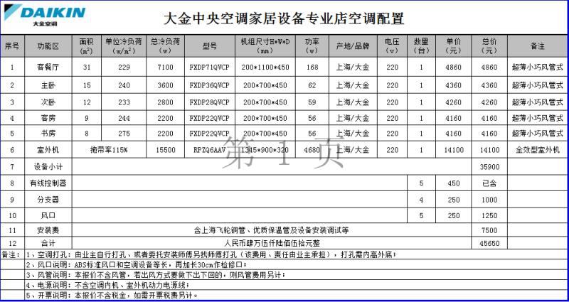
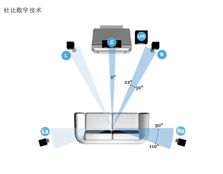

## 家电


```
11、家电
家电说实话是涉及内容最多的，这里仅列举品牌和最终选择吧，具体内容可以去家电论坛看看大神们的讨论。
油烟机：一代机皇松下油烟机已经没有踪迹了，日系现存品牌也无迹可循（富士帝的日本身份我现在还是质疑的）。欧洲高端的还有德国Miele、Gaggenau、意大利SMEG价格让人望而却步。国内品牌老板、方太、樱花，最终选择了方太的主厨系列。
燃气灶：欧洲高端品牌和油烟机类似，日系油烟机林内、能率、百乐满，日本特有的Si技术让我很痴迷，但是日本原装油烟机都是自带燃气烤箱，而且尺寸偏小，大多为三火头的。不适合国内家庭烹饪习惯。最终妥协购买了上海林内燃气灶，灶头是日本进口的。
冰箱：日系冰箱特点皮薄馅大，德系冰箱特别皮厚馅小。小户型还是适合日系冰箱，主流日本原装进口的有日立、松下、夏普、东芝（南海制造）。欧洲冰箱设计最好看的莫过于SMEG，但是专业莫过于德国LIEBHERR利勃海尔。最终家里采购的是一台上海夏普产的风冷机。
洗衣机：冰洗日系品牌最高端的莫过于日立，但是日本原装日立的冰洗都是大五位数的价格。洗衣机原来南海东芝可谓性价比之王，但是目前处于停产状态。夏普已经转为找其他品牌代工，杭州松下洗衣机是目前市场唯一能找到的日系品牌，但是无论从设计还是电机都落后于日本市场产品。欧洲洗衣机以德国Miele和瑞典ASKO最为知名，但是国行产品也都是淘汰的款式，而且价格奇高。目前在等待南海东芝1月份要分布的新品。
空调：国内品牌空调无疑选择的是格力，日系空调最牛的无非是三菱雾峰，松下逸健美，东芝大清快，日立白熊君、富士通诺可力，国内可以买到的应该只有三菱雾峰和富士通诺可力了。最终家里使用的是两台2000年左右购买的大金机器，当年的大金可非现在大金同日而语。
电视机：电视机是除洗衣机以外另一个让我头疼的电器，目前市场上还可以的电视也就索尼的A1 Z9D以及LG的W7P G6P了，虽然我内心极具排斥棒子品牌。现在索尼的电视LCD采用的三星的黑水晶屏，OLED也是LG的第四代产品。夏普更是被富士康收购以后，沦为台湾品牌了吧？纪念一下曾经的一代机皇吧，夏普XS1A、RX1、X55/50A，索尼X300、X4500、HX920、HX950、X9000A/B，先锋600A/M等。
```


### 取暖


https://www.chiphell.com/thread-1813621-1-1.html

```
一个密闭的房间，我们开取暖器的时候，并没有水分出去，大家不管开取暖器还是空调，炙热的时候，都是没有水分析出的，那么为什么会干呢？水到哪里去了？答案毫无疑问，水并没有去哪里，始终是在室内。
那为什么会感觉到干？
那是因为有个绝对湿度和相对湿度的原因，首先科普一下一个知识，空气中的饱和湿度是随着气温升高而加大的，也就是说冬天温度低，空气中原有水分就不多，这个时候我们在一个房间里面密闭之后，他的绝对湿度是不会变化的，我们在室内升高温度，这个时候人的体感湿度就会降低，说简单点：密闭房间内的绝度湿度是不变的，体感湿度随着温度升高而降低，温度越高，人感觉到的湿度越低。
另外一个会头晕，是因为上层的温度太热，下部的温度太低，对流不下来，是很难受的，这个和湿度没关系。


那我们接下来在这样的铺垫下，我们来首先看看取暖设备有哪些呢？
壁挂机、中央空调、国产油汀、欧洲进口取暖器、暖气片、电地暖、水地暖。

氟系统中央系统：炙热舒适指数10分

氟系统中央空调，有两种，一种是电加热的，国产为主，还有一种是不带电加热的，合资品牌为主；我们话分两头说。
国产中央空调：
电辅热的中央空调————————冬天热风出来的温度很高，但是风很小，大家要记住一点，风越热，密度越小，越浮在上面，所以这个热风非常明显的浮在上面，一般家用中央空调都是侧出的，所以就会出现这样的情况：上方非常热，下面很冷，温度也达不到，而面板控制的温度感应器又在空调上方，在上方感应温度到了，就停止工作。因为热风本来就浮在上面，所以温度很容易到达，所以这个时候业主为了讲温度达到自己的舒适度，就要将温度设置的很高，譬如28度，30度这样，那么问题来了，密闭房间内的绝度湿度是不变的，体感湿度随着温度升高而降低，温度越高，人感觉到的湿度越低。温度非常高之后，出现上面的体感湿度非常干燥，同时也会出现头晕的现象。
合资中央空调：
没有电辅热的中央空调————————冬天的热风相对电辅热的会大点，但是大不到哪里去，同时风的温度也相对低点，但是还是很热，另外一个就是中央空调的风口大多数是侧吹的，热风很难在氟系统这样的高温热风下吹下来，而和没有电副热的相比有一点好，不谈电费哈，主要从舒适度方面，氟系统的中央空调在不是特别寒冷的冬天的时候，他的效果能发挥出来，因为在室内温度本来不低的情况下，氟系统的热风和室内温度的温差不大，密度相差也不大，这个时候风很容易被吹下来，但是一旦冬天越来越冷，那么氟系统的效果就越来越差，因为密度差异越来越大，热风越来越吹不下来。所以在很寒冷的冬天，其实带不带电副热，舒适度都不会太高，除非是风口是直接朝下吹的 ，效果就不一样。（在这里我们假设空调都是连续工作的，不考虑冬天室外温度越低带来的化霜时间越来越多的实际情况）
所以我们给氟系统的制热舒适度打了10分。


壁挂机：炙热舒适指数20分

壁挂机的炙热舒适度相比氟系统中央空调，就好很多，其他的原理都是和氟系统中央空调一样一样的，风很热，风速差不多，但是他有一点很好，就是风口向下，可以摇摆，可以最大限度的将热空气进行对流。但是毫无疑问，因为热源在顶上，想要达到同样的舒适度，基本上都是设置在28度左右，这么高的温度，体感湿度就会下降很多。所以很多人说空调房就是很干很闷，就是这个原因，其实不是因为空调能把水抽走，是因为只有打到这么高的温度，室内才能暖和起来。温度越高，绝对湿度又没有变化，所以人就觉得越来越干燥。


国产油汀：炙热舒适指数30分

国产油汀，以前最大的问题是不够热，买个油汀要放在人面前，才会感觉热，整个房间不会热，但是随着这两年工艺和技术不断提高，我发现现在的国产油汀和以前的油汀不一样了，现在的油汀真的很热很热，甚至可以说是很烫！效果是很好，一下子热起来了，但是过高的温度，让热风出来之后直线往上升，导致对流不好，没有对流也想要达到温度，就要持续不断的炙热，这样就出现，要么很冷，当你发现很热的时候，其实上方的热空气已经完全下来了，就变的很干。但是因为热源在下方，舒适度要比前两者好很多。


水系统中央系统：炙热舒适指数60分

很多大型商用场合都是水系统，因为舒适度有要求，当然水系统价格便宜也是一个主要的原因，舒适度高就是他的一个优势，不管是制冷还是炙热，他在炙热方面是这样的：出风温度本来就是温热，而且他们的风量很大，所以他们可以迅速的将热风吹下来，也就是大风量，小温差。房间内的上下温差的差异不大，所以也就意味着水系统空调可以在更低的温度下达到满意的舒适度，所以不会让人感觉特别干燥～～但是因为风量大，所以也会产生一个风燥大的问题，所以对他的整体分数上有所减分。


水暖气片中央系统：炙热舒适指数70分

水暖暖气片，相比前面的几种就不一样了，舒适度高了很多，因为辐射制冷，热源在下面，所以对流效果好很多，而且没有声音，但是他的缺点是：固定的安装空间很难选择，比较影响美观/需要定期保养和清洗/墙面很容易变色/舒适度严格来说是从膝盖以上开始热的，脚还是冷的/他在冬季的干燥程度还是比较大的，因为其实暖气片的热量平均性也不是特别高，所以干燥还是在所难免。


欧洲进口取暖器：炙热舒适指数80分

欧洲一众取暖器，以诺郎为主的进口取暖器，相比水暖气片的优点，可以移动，不需要定位，更重要的是不需要保养和清洗，而从干燥度来说，这类取暖器神奇在于他们的发热材料，可以产生温度不是特别高的热风，这个热风可以迅速提高室内温度，但是温度不会太高，这样反而不会干燥，这也是我最近发现的一个神奇的现象。。。。。从节能性和舒适度综合对比来说，真的可以淘汰电地暖了，不过单纯从舒适度来说，还是地暖牛，不管你是电的还是水的，就是电费来说，电地暖好很多。


电地暖：炙热舒适指数90分

电地暖，其实就是地暖，舒适度和水地暖是一样的，为什么它评分比水地暖低，是因为他的普及率很低，使用费用太贵是他的一个弊端，比较适合一些特殊场合。其他我就不多说了。。


水地暖：炙热舒适指数100分

水地暖，炙热的极致享受，没有一种取暖设备有地暖舒服的，因为他是低温采暖+热辐射，热源和对流完全符合我们整段以来一直坚持的条件：最低温度达到最高舒适度，所以在宁波来说，地我们这边的地暖温度一般设置在18-20度之间，所以相比28度的空调来说，体感湿度高了很多，另外地暖的热源选择面也有两种，一种是燃气，一种是风冷热泵，选择面也比较多。所以从各个角度来说，地暖的舒适度无疑是最高的。


作为业主来说炙热的需求，有三点：能热起来，不干燥，使用费用能低最好低。（主要是前二，最后一项是加分项）

如果不考虑预算，不精打细算，只要舒适的话，其实就是需要达到一个目标：如何能够在达到人体舒适的情况下，尽可能的不干燥！
我们回忆一下原理之后，我总结给大家，其实要达到这个目标，就是需要：尽可能低的室内温度能达到不冷的状态！
我们来看下各个设备的舒适温度：
壁挂机温度设置28度：上面热，但是很干
中央空调设置28度：冷，但是也干
取暖器一般不设置温度，就是开着，干燥。
地暖设置20度：下面热，上面不冷，也不干燥。
假如地暖设置到25度:热的飞起，东北裤衩模式，很干燥。
那么毫无疑问，地暖是最合适的，
如果是地暖，又涉及到一个使用费用的问题，因为地暖的热源有好几种，如果热源没有选择好，使用费用就完全不一样，所以我们有必要去研究一下自己适合装那种采暖热源，因为面对不断上涨的能源价格，谁都想更加从容的舒适。


因为大部分人其实主要想了解的是水地暖，水地暖是分热源的，一种是锅炉，就是烧天然气的，还有一种是风冷热泵去带的。那么我们拿到一套图纸，首先要确定的就是，到底是用锅炉还是风冷热泵（也称水系统）！
...
yonka 讲了一大段天然气政策变化带来的坑 = =


4，最佳结合(该买哪种)；
我们选择的原则，一共是5点：1，一次性投入成本；2，使用成本；3，使用便捷性；4，失效风险；5，维护费用。如果是毛坯房，改善型为主，那么要满足使用方便/失效风险低/维护费用低的，只有三种：发热电缆/锅炉带地暖（天然气带）/水机带地暖（热泵带）。既然这三种都满足，那么其实要比的，就是一次性投入和使用成本！
那么首先我从理论上来计算一下使用成本吧，毕竟投入费用是很好算的，但是很多人不知道使用成本，所以让我们来计算一下：
。。。
计算了一下各种。。。的发热效率等等。
。。。
所以让我们用科学告诉大家，建筑面积在63平方以下的适合电地暖！
。。。
接下来让我们计算下140平方全年的燃气费 和天然气费的价格：
建筑面积140平方的锅炉带地暖一年的燃气费1260方天然气使用费用

阶梯	燃气区间	单价	价格
第一阶梯	1-324	2.95 	955
第二阶梯 	324-1260	3.5	3276
			4231

所以全年三个月的费用为4231

建筑面积140平方的热泵带地暖一年的电费4559度电费使用费用
	度数区间	峰电单价	峰电总价	  谷电单价	谷电总价
  第一阶梯	0-2760	  0.568	  1567	  0.288	  795
  第二阶梯	2761-4559	0.618	1111	  0.338	607
			2678元		1402元

所以总电费为2040元。（美系水机无法编程在谷电使用，所以电费只能峰谷电平均）


总的天然气和热泵的电费费用差价=4231/2040=2倍。
当然还有人提出质疑，水机带地暖将全年的低价电全部用掉了，导致后面的电费都是第三阶梯，这块也要损失大量的电费：

我觉得说的很有道理，相当于其实热泵不管用不用都是应该按照第三阶梯去算，因为前面的两个阶梯本来就是给普通电器使用的。天然气也是如此，第一阶梯的324方分配到12个月，其实就是每个月27方气，就是保证日常使用的，所以天然气也要按照第二阶梯的3.5元去结算！

所以我们重新修正一下电费：
4559度电-----第三阶梯的峰电价格：=4559*0.838=3820元，谷电价格=4559*0.588=2680元。
综合一下，电费为（3820+2680）/2=3250元！（美系水机无法编程在谷电使用，所以电费只能峰谷电平均）

所以我们重新修正一下燃气费用的价格：1260*3.5=4410

所以最终最实际的总的天然气和热泵的电费费用差价=4410/3250=1.3倍。（以上算法锅炉全部为冷凝炉）
然而有人说这个比值可能达到4，让我们来看看~
。。。
也就是说，一个建筑面积在532平方的房子用普通锅炉，燃气价格是5块钱一立方，而热泵这块又是用的最好的热泵，而且是在宁波这样的天气，那么燃气费用和电费的差价会达到4倍~~
```


```
最好的热泵在江浙沪区域，COP都过不了3，因为室外在几度的情况下，江南地区的湿度会使外机频繁的结霜，平均下来COP能有2多一点点就谢天谢地了，特别是靠山的小区，热泵装在背面，室内升温都困难，别说省钱了，所以还是用用3块多的天然气吧，而且热泵的成本、稳定性远低于锅炉
```


### 热泵

#### 空气源


#### 地源


### 空调


#### 了解


##### 功率

```
就是一般我们说的几匹机
1ph=735w（压缩机功率）
压缩机功率*能效比=制冷功率
空调室外机铭牌上16HP指的是室外机的容量。常标注在大型中央空调或户式中央空调的外机上
```


###### 日立


http://www.znme.cn/productinfo/VAMminixilierilizhon.html

http://www.hisensehitachi.com/jycp/detail.aspx?nodeid=8065


VAM系列

​			                                   4/5/6HP		                                    

| 型号   | 容量   | 制冷剂           | 电源         | 额定制冷量 | 额定制热量 | 净重   | 外形尺寸(高*宽*厚)  |
| ---- | ---- | ------------- | ---------- | ----- | ----- | ---- | ------------ |
|      | HP   |               |            | KW    | KW    | KG   | mm           |
| 112  | 4    | R410A         | 220V~ 50Hz | 11.2  | 12.5  | 97   | 1380*950*370 |
| 140  | 5    | 14.0          | 16.0       |       |       |      |              |
| 160  | 6    | 15.5          | 18.0       |       |       |      |              |
| 140  | 5    | 380V 3N~ 50Hz | 14.0       | 16.0  |       |      |              |
| 160  | 6    | 15.5          | 18.0       |       |       |      |              |


**日立VAM mini家用中央空调室外机技术参数表**

 

| 型号            | RAS-112FSVN2Q | RAS-140FSVN2Q | RAS-160FSVN2Q | RAS-140FSYN2Q | RAS-160FSYN2Q |
| ------------- | ------------- | ------------- | ------------- | ------------- | ------------- |
| 制冷剂           | R410A         |               |               |               |               |
| 电源            | 单相 220V 50Hz  | 三相 380V 50Hz  |               |               |               |
| 额定制冷量KW       | 11.2          | 14.0          | 15.5          | 14.0          | 15.5          |
| 额定制热量KW       | 12.5          | 16.0          | 18.0          | 16.0          | 18.0          |
| 制冷功率KW        | 2.99          | 3.92          | 4.44          | 3.92          | 4.44          |
| 制热功率KW        | 2.98          | 4.03          | 4.74          | 4.03          | 4.74          |
| 外形尺寸(H)       | 1380          | 1380          | 1380          | 1380          | 1380          |
| 外形尺寸(W)       | 950           | 950           | 950           | 950           | 950           |
| 外形尺寸(D)       | 370           | 370           | 370           | 370           | 370           |
| 重量kg          | 97            | 97            | 97            | 97            | 97            |
| 压缩机型式         | 全封闭直流变速涡旋压缩机  |               |               |               |               |
| 热交换器          | 多路叉流翅片管       |               |               |               |               |
| 室外机风扇数量       | 2             | 2             | 2             | 2             | 2             |
| 风量m3/min      | 90            | 90            | 90            | 90            | 90            |
| 噪音dB(A) 冷/暖   | 48/50         | 48/50         | 50/52         | 48/50         | 50/52         |
| 噪音dB(A)夜间静音模式 | 42            | 42            | 45            | 42            | 45            |
| 运转范围(制冷)      | -5～46℃ DB     |               |               |               |               |
| 运转范围(制热)      | -23～15.5℃ WB  |               |               |               |               |
| 流量控制方式        | 微电脑控制电子膨胀阀    |               |               |               |               |
| 冷媒管           | 喇叭口连接         |               |               |               |               |
| 液管mm          | Φ9.52         |               |               |               |               |
| 气管mm          | Φ15.88        |               |               |               |               |

| 型号            | RAS-224FSYN2Q        | RAS-280FSYN2Q | RAS-335FSYN2Q |
| ------------- | -------------------- | ------------- | ------------- |
| 制冷剂           | R410A                |               |               |
| 电源            | 三相 380V 50Hz         |               |               |
| 额定制冷量 KW      | 22.4                 | 28.0          | 33.5          |
| 额定制热量 KW      | 25.0                 | 31.5          | 37.5          |
| 制冷功率 KW       | 6.36                 | 8.22          | 10.60         |
| 制热功率 KW       | 6.31                 | 8.70          | 10.11         |
| 外形尺寸(H) mm    | 1650                 | 1650          | 1650          |
| 外形尺寸(W) mm    | 1100                 | 1100          | 1100          |
| 外形尺寸(D) mm    | 390                  | 390           | 390           |
| 重量 kg         | 168                  | 168           | 171           |
| 压缩机型式         | 全封闭直流变速涡旋压缩机         |               |               |
| 热交换器          | 多路叉流翅片管              |               |               |
| 室外机风扇数量       | 2                    | 2             | 2             |
| 风量 m3/min     | 121                  | 150           | 163           |
| 噪音dB(A) 冷/暖   | 53/55                | 56/58         | 59/60         |
| 噪音dB(A)夜间静音模式 | 50                   | 53            | 55            |
| 运转范围(制冷)      | -5～46℃ DB            |               |               |
| 运转范围(制热)      | -23～17℃ WB           |               |               |
| 流量控制方式        | 微电脑控制电子膨胀阀           |               |               |
| 冷媒管           | 液管(喇叭口连接)/气管(钎焊+喇叭口) |               |               |
| 液管 mm         | Φ9.52                | Φ12.7         | Φ12.7         |
| 气管 mm         | Φ19.05               | Φ22.22        | Φ25.4         |


* 智慧风型单面出风嵌入式

  ## 			                                   智慧风型单面出风嵌入式		                                    

  | 型号   | 电源         | 额定制冷量 | 额定制热量 | 净重           | 外形尺寸(高*宽*厚)      |
  | ---- | ---------- | ----- | ----- | ------------ | ---------------- |
  |      |            | KW    | KW    | KG           | mm               |
  | 22   | 220V~ 50Hz | 2.2   | 2.5   | 19           | `192*910*470			` |
  | 25   | 2.5        | 2.8   |       |              |                  |
  | 28   | 2.8        | 3.2   |       |              |                  |
  | 32   | 3.2        | 3.6   |       |              |                  |
  | 36   | 3.6        | 4.0   | 20    |              |                  |
  | 40   | 4.0        | 4.5   |       |              |                  |
  | 45   | 4.5        | 5.0   |       |              |                  |
  | 50   | 5.0        | 5.6   | 24    | 192*1180*470 |                  |
  | 56   | 5.6        | 6.3   |       |              |                  |
  | 63   | 6.3        | 7.1   |       |              |                  |
  | 71   | 7.1        | 8.0   |       |              |                  |


* 全新智慧型四面出风嵌入式 RCI系列

  ## 			                                   全新智慧型四面出风嵌入式 RCI系列		                                    

  | 型号   | 电源         | 额定制冷量 | 额定制热量 | 净重              | 外形尺寸(高*宽*厚) |
  | ---- | ---------- | ----- | ----- | --------------- | ----------- |
  |      |            | KW    | KW    | KG              | mm          |
  | 28   | 220V~ 50Hz | 2.8   | 3.3   | 20              | 238*840*840 |
  | 36   | 3.6        | 4.2   |       |                 |             |
  | 40   | 4.3        | 4.9   | 21    |                 |             |
  | 45   | 4.5        | 5.0   |       |                 |             |
  | 50   | 5.0        | 5.6   |       |                 |             |
  | 56   | 5.6        | 6.5   |       |                 |             |
  | 63   | 6.3        | 7.5   | 22    |                 |             |
  | 71   | 7.1        | 8.5   |       |                 |             |
  | 80   | 8.4        | 9.6   | 26    | 288 * 840 * 840 |             |
  | 90   | 9.0        | 10.0  |       |                 |             |
  | 100  | 10.0       | 11.2  |       |                 |             |
  | 112  | 11.2       | 13.0  |       |                 |             |
  | 125  | 12.5       | 14.0  |       |                 |             |
  | 140  | 14.2       | 16.3  |       |                 |             |
  | 160  | 16.0       | 18.0  |       |                 |             |


* 天花板内置风管机 RPI低静压系列

  ## 			                                   天花板内置风管机 RPI低静压系列		                                    

  | 型号   | 电源         | 额定制冷量 | 额定制热量 | 净重               | 外形尺寸(高*宽*厚)      |
  | ---- | ---------- | ----- | ----- | ---------------- | ---------------- |
  |      |            | KW    | KW    | KG               | mm               |
  | 28   | 220V~ 50Hz | 2.8   | 3.3   | 24               | 270*(650+75)*720 |
  | 36   | 3.6        | 4.2   | 25    |                  |                  |
  | 40   | 4.3        | 4.9   |       |                  |                  |
  | 45   | 4.5        | 5.0   |       |                  |                  |
  | 50   | 5.0        | 5.6   | 31    | 270*(900+75)*720 |                  |
  | 56   | 5.6        | 6.5   |       |                  |                  |
  | 63   | 6.3        | 7.5   |       |                  |                  |
  | 71   | 7.1        | 8.5   |       |                  |                  |

* 天花板内置风管机(高静压型） RPI高静压系列

  ## 			                                   天花板内置风管机(高静压型） RPI高静压系列		                                    

  | 型号   | 电源         | 额定制冷量 | 额定制热量 | 净重               | 外形尺寸(高*宽*厚)      |
  | ---- | ---------- | ----- | ----- | ---------------- | ---------------- |
  |      |            | KW    | KW    | KG               | mm               |
  | 28   | 220V~ 50Hz | 2.8   | 3.3   | 24               | 270*(650+75)*720 |
  | 36   | 3.6        | 4.2   | 25    |                  |                  |
  | 40   | 4.3        | 4.9   |       |                  |                  |
  | 45   | 4.5        | 5.0   |       |                  |                  |
  | 50   | 5.0        | 5.6   | 31    | 270*(900+75)*720 |                  |
  | 56   | 5.6        | 6.5   |       |                  |                  |
  | 63   | 6.3        | 7.5   |       |                  |                  |
  | 71   | 7.1        | 8.5   |       |                  |                  |

* 天花板内置DC薄型自动除湿风管机 RPIZ（D）系列

  ## 			                                   天花板内置DC薄型自动除湿风管机 RPIZ（D）系列		                                    

  | 型号   | 电源         | 额定制冷量 | 额定制热量 | 净重                | 外形尺寸(高*宽*厚) |
  | ---- | ---------- | ----- | ----- | ----------------- | ----------- |
  |      |            | KW    | KW    | KG                | mm          |
  | 18   | 220V~ 50Hz | 1.8   | 2.2   | 16                | 192*697*447 |
  | 22   | 2.2        | 2.8   | 20    | 192*910*447       |             |
  | 25   | 2.5        | 3.0   |       |                   |             |
  | 28   | 2.8        | 3.3   |       |                   |             |
  | 32   | 3.2        | 3.6   |       |                   |             |
  | 36   | 3.6        | 4.2   | 21    |                   |             |
  | 40   | 4.3        | 4.9   |       |                   |             |
  | 45   | 4.5        | 5.0   |       |                   |             |
  | 50   | 5.0        | 5.6   | 26    | 192*1180*447      |             |
  | 56   | 5.6        | 6.5   |       |                   |             |
  | 63   | 6.3        | 7.5   |       |                   |             |
  | 71   | 7.1        | 8.5   |       |                   |             |
  | 80   | 8.0        | 9.0   | 45    | 218*(1480+82)*615 |             |
  | 90   | 9.0        | 10.0  |       |                   |             |
  | 100  | 10.0       | 11.2  |       |                   |             |
  | 112  | 11.2       | 12.5  |       |                   |             |

* 天花板内置薄型风管机 RPIZ系列窄型

  ## 			                                   天花板内置薄型风管机 RPIZ系列窄型		                                    

  | 型号   | 电源         | 额定制冷量 | 额定制热量 | 净重   | 外形尺寸(高*宽*厚) |
  | ---- | ---------- | ----- | ----- | ---- | ----------- |
  |      |            | KW    | KW    | KG   | mm          |
  | 22   | 220V~ 50Hz | 2.2   | 2.8   | 21   | 192*700*602 |
  | 25   | 2.5        | 3.0   |       |      |             |
  | 28   | 2.8        | 3.3   |       |      |             |
  | 36   | 3.6        | 4.2   |       |      |             |
  | 40   | 4.3        | 4.9   |       |      |             |

* 壁挂式RPK系列

  ## 			                                   壁挂式RPK系列		                                    

  | 型号   | 电源         | 额定制冷量 | 额定制热量 | 净重           | 外形尺寸(高*宽*厚) |
  | ---- | ---------- | ----- | ----- | ------------ | ----------- |
  |      |            | KW    | KW    | KG           | mm          |
  | 22   | 220V~ 50Hz | 2.2   | 2.5   | 10           | 280*780*220 |
  | 28   | 2.8        | 3.2   |       |              |             |
  | 36   | 3.6        | 4.0   |       |              |             |
  | 40   | 4.0        | 4.5   |       |              |             |
  | 50   | 5.0        | 5.6   | 12.5  | 290*1050*220 |             |
  | 56   | 5.6        | 6.3   |       |              |             |
  | 63   | 6.3        | 7.1   |       |              |             |

* 厨房专用嵌入式 RCIS系列

  ## 			                                   厨房专用嵌入式 RCIS系列		                                    

  | 型号   | 电源         | 额定制冷量 | 额定制热量 | 净重   | 外形尺寸(高*宽*厚) |
  | ---- | ---------- | ----- | ----- | ---- | ----------- |
  |      |            | KW    | KW    | KG   | mm          |
  | 22   | 220V~ 50Hz | 2.2   | 2.5   | 20   | 910*470*192 |
  | 32   | 3.2        | 3.6   |       |      |             |
  | 40   | 4.0        | 4.5   | 21    |      |             |


UX系列

* 1/1.5/2HP

  ## 			                                   1/1.5/2HP		                                    

  | 型号   | 容量   | 制冷剂          | 电源           | 额定制冷量        | 额定制热量        | 净重   | 外形尺寸(高*宽*厚) |
  | ---- | ---- | ------------ | ------------ | ------------ | ------------ | ---- | ----------- |
  |      | HP   |              |              | KW           | KW           | KG   | mm          |
  | 25   | 1    | R410A        | 220V~50Hz    | 2.5(1.3～3.2） | 3.4（1.3～4.4） | 33   | 550*700*300 |
  | 35   | 1.5  | 3.5(1.3～3.8） | 4.0（1.3～4.8） | 34           |              |      |             |
  | 50   | 2    | 5.0(1.7～5.5） | 5.8（1.7～6.9） | 40           | 550*800*300  |      |             |

* 2.5/3HP

  ## 			                                   2.5/3HP		                                    

  | 型号   | 容量   | 制冷剂          | 电源           | 额定制冷量        | 额定制热量        | 净重   | 外形尺寸(高*宽*厚) |
  | ---- | ---- | ------------ | ------------ | ------------ | ------------ | ---- | ----------- |
  |      | HP   |              |              | KW           | KW           | KG   | mm          |
  | 61   | 2.5  | R410A        | 220V~50Hz    | 6.1(2.5～7.2） | 7.2（2.5～8.7） | 58   | 787*900*300 |
  | 72   | 3    | 7.2(2.5～7.6） | 8.1（2.5～9.4） |              |              |      |             |


#### 中央空调


```
https://post.smzdm.com/p/661438/

建议家装不要装中央空调。
特殊情况例外！稍微学习了一下，现在我的看法是，家装中央空调没什么好处，坏处倒有不少。

中央空调

中央空调的室内机价格都差不了多少，不过也很贵！
主要是外机，为了应对4台空调同时运行的偶然性，外机功率就得达到大概7匹左右的功率！
这么大功率的外机价格可想而知，怎么都得上万了。
还没算上辅材安装费用，总结一个字就是贵！
关键大家忽略的一点，家装四个房间同时运行空调的几率小的很。
就会造成一台7P的外机拖着3P或1.5P的室内机运行的状态，典型的大马拉小车。
你技术再牛X，浪费电也是必然。

yonka 对于我们两口之家的大房子，更是 = =
不过也有二拖n的选择。
```


##### 报价


* 1

  ```
  我这边  大金的 一拖五 39000
  XQ
  还在装修中
  XQ
  提供价格 你们看下
  16:14
  DM
  XQ 安装材料啥的都算上了？比之前听到的便宜啊
  一拖五是四室+客厅吗？ XQ
  172人未读
  XQ
   
  XQ
  奉上
  16:15:31
  最后3.9是打了折扣吗

  反正我给的价格是3.9
  也没问折扣什么的
  ```

  


#### 风管机


```
风管机

价格比中央空调便宜好多，比较接近挂机价格，安装完外观与中央空调一样。

能效与挂机也没什么区别，主要无法与挂机抗衡的主要原因是有安装费用，每台风管机的安装费用现在都要1000多块钱。

```


```
北御
富士很少考虑  」
--------
厚雪
市场占有率低，主要做工装，家用的很少，买了邮问题怕售后麻烦

```


```
北御 出差杭州紧急问题咨询息辕
北御
中央空调就那么几家：大金、日立、东芝、三菱重工、三菱电机
至于好不好，各有优势，基本上是大金最贵，日立最便宜
每家都有自己独特技术

格力性价比更高
北御 出差杭州紧急问题咨询息辕
北御
其实还要看需要多大功率的，如果超过6~7P，就需要380V动力电，就需要使用涡轮技术；如果5~6P以下，双转子就OK
北御 出差杭州紧急问题咨询息辕
北御
还要看是否考虑制热，例如日立的制热比较差；配合地暖比较好
所以没办法一句话说，好还是不好的
所以需要个优劣势列表。 
75人未读
柏坚 Tree New Bee
准备吃土上大金的
五様 90 90
好专业呀
北御 出差杭州紧急问题咨询息辕
北御
如果都选日本这几个，其实这个东西可能到最后就是看个人心理价位了
北御 出差杭州紧急问题咨询息辕
北御
大金应对国内市场改造是最多的
北御 出差杭州紧急问题咨询息辕
北御
但是基本也是最贵的
北御 出差杭州紧急问题咨询息辕
北御
基本就考虑几点：
多大功率、冷热需求、价格、能耗其实就差不多了

像那些什么分歧管哇，水泵啊、涡轮转子啊太技术化了，如果也考虑，后面就懵了

```


```
 会议中
01-17 21:01:54
问下哦，中央空调，比如选大金，除了一拖几，几匹这些要考虑，还有哪些指标？
芷言 会议中
就是比较价格的时候要参照哪些参数
北御 出差杭州紧急问题咨询息辕
北御
制冷量，功率能耗，能效比、冷量配比，主电箱电线、甚至是外机涡轮转子、抽水方式、噪音、风量、保养时间等；
简单想了下，只想到这么多 @芷言 
芷言 会议中
专业，我想选大金的话，应该拿着新款型号去各家店比较价格就好了吧
北御 出差杭州紧急问题咨询息辕
01-17 21:10:23
北御
是的，反正型号你都定了，就比较下各家呗，不过你走访的方式去问，估计价钱都差不多。。。如果差很多，你又不敢买了

```


```
    可见开发商的4000装修标准该精致到什么程度
    你这么大面积，没考虑用中央空调水暖二合一的水空调吗？


做暖通的推荐我了，可是我还是喜欢分开的，不会一个出问题全部趴窝

```


大金 一拖九

```
我家邻居，是美剧爱好者，家里装修走的是美式豪宅路线，用的装修材料都是顶级的，单说地砖一项，用的是居然之家里最贵的瓷砖IMOLA；200块钱一块的小花砖，贴了一面墙；大金中央空调，同样的户型，别人家都是一拖六，他家装的是一拖九，用两台室外机。

这么高档的标准，我想都不用想，他家的龙头、花洒、马桶这些最能体现装修档次的东西肯定用的是汉斯格雅（Hansgrohe），甚至唯宝（Villeroy Boch）。

```


#### 设计


```
    三菱电机的挂机？？
你那个户型面积太大，机位不一定够，最好还是中央空调，主卧可以单独搞台高端挂机。


    外机位够可以三菱电机
外机可以放 就是铜管需要很长很长了 不知道行不行的
那就要你自己考虑了，太远了确实是问题，不过回头想想，中空管道也不短。可以卧室挂机，其他的中空


中央空调静音性是看内机的，我的帖子说过很多次了，普通家装如果没有特别要求客厅餐厅要效果上风管机，其他房间一律挂机，维护方便价格实惠。


我家是大金的中央空调，声音实在是太大了，风力调整到静音还是很大声。


日立新的dp内机比较安静，大金制热比其它有差距
```


```
新房即将开始硬装，目前正在考察中央空调、地暖、新风及净水4大系统，初步定好品牌后才能进一步物色暖通公司。
基本背景：600方，地下1层，地上3层。坐标0571
中央空调：
1、大金，市场占有率高。去官方展厅转了圈，感觉内机被玩出了花。至于口碑好坏不孕，接触了厂家和两家经销商都感觉态度不怎么样。
2、东芝，朋友力荐，进口外机加内机，质量好于大金（此处有疑问？），价格略高于大金。
3、约克，美系水系空调，针对300平以上大户型具有优势，非日系氟机可比（？），可带地暖，不必独立安装锅炉。价格较低，安装及维护要求高于日系。
地暖：
1、锅炉天然气地暖，主流配置。目前房子在使用中。
2、约克中央空调带地暖，效果未知。
新风：五花八门的品牌，完全没方向，懵逼状态。大金、蓝舍、东芝等等等等
净水：要求全屋净水加软水，厨房直饮纯水。品牌目前据了解有3m和怡口。
热水：这部分内容在翻阅论坛帖子后才发现之前没有完整考虑，对于氟机可用锅炉带，水机就用空气能。

整体在考虑采纳智能控制，将空调、新风和地暖都纳入到智能家居平台统一控制。

朋友们，对于各系统有了解的请不吝赐教，尤其是空调和新风。谢谢


首先，无论面积多大，家里就那几口人，不需要全屋开空调，所以日系氟机合适，习惯全屋所以空调都打开选水机。。
其次，东芝和日立中央空调都能带地暖，配地暖模块就可以了，燃气锅炉还是算了吧。这两家都有配套的新风，用谁家的空调，就用谁家的新风。
最后，全屋净水+软水+厨房直饮纯水，滨特尔的性加比最高，不差钱可以去看看森乐、康丽根。


用水机更合适，品牌吗，特灵，约克，开立。特灵是这块的老大，有大量的家用方案，约克更擅长楼宇，开立则是偏向工厂


不知你是哪个地区，水机三联供还是比较省的，尤其是夏天，但要注意冬天冻水管的问题。
如果你家能打深井，地源热泵很不错。

在杭州。地源热泵已经用了5年了，感觉就是一直要维护，而且夏天制冷效果不佳，制冷速度慢。我也比较担心水机空调和地源热泵效果相近，那我真要被我老婆骂死了

室内机和室外机之间通过水来完成冷热交换，就是俗称的水机。
室内机和室外机之间通过冷媒来完成冷热交换，就是俗称的氟机。
国内的地源热泵几乎都是水机，也就是通过水来完成内外机之间的冷热交换。


作为0571的一个暖通人我来回复两句。
1，非常赞同第一点，大金的内机被玩出了花。
2，第二东芝进口外机+国产内机组合应该是要比大金VRV-P便宜一点的。
3，约克也好，特灵也好，目前你这户型有地暖，水机的优势很大，地暖这块会节能很多。
你家之前有过不好的体验，也有很大可能和安装设计有关系。这种搭配下，热水最好单独做，用空气能热水器，不要做三联供。
4，全屋净水这款，不太建议直接买3M或者怡口的中央净水机，我觉得一套完美的净水系统是需要量身定制DIY的，个人比较倾向于用缤特尔的20寸大蓝瓶+立升的超滤。软水机这快，怡口的技术优势大一些。
5，燃气锅炉带地暖的话，就是使用费用有点高，现在杭州第三阶梯气价是4.65元。


我内心也在纠结，只要衡量因素有三：建设成本、使用效果、使用成本。
最终我觉得优先排序是是使用效果》建设成本〉使用成本。
关于空气能热水器网上看到信息是一箱水用完后再次烧水就会比较慢，这是弊端吧？

二合一安装成本也还好啦。然后我觉得水机空调的舒适度比氟机要好。就是初次打开会慢一些。但是如果结合智能控制系统，可以远程提前开启，应该不是问题。
在南方，有可能是地暖的存在，带动了风冷热泵的春天。


实际使用者来答。
空调：建议水机。
优势1.  舒适性好很多；
优势2.  管路泄露问题容易解决；
优势3.  3联供，冬季可以拖地暖，夏天可以拖热水，能源利用率高；
优势4.  内机便宜，特别是内机多的优势大。
地暖：壁挂炉同时安上，根据环境温度和能源价格使用不同热源。

划重点：
地暖这一块，水机+壁挂炉组合使用，因为你是按目前能源价格估算使用成本的，谁知道未来10年怎么变动，是电价涨得厉害还是气费涨的厉害。
```


### 地暖


```


【老板电器杯】日式原木89m 青云居&鸿杰-地板重铺
精华 只看楼主大图
二维码
 
地板
原木

13金币 445 406941 657
小区名称： 	户型：三室一厅 	面积：89平方 	装修预算：40万元
装修方式：半包 	装修公司：鸿杰装饰 	设计师：张建青 	设计风格：日式

 

icon
regineye
regineye   发表于: 2017-01-15 22:05 | 只看该作者

27楼
【包阳台下定金】
杭州市面上基本都是“凤铝”，但假的实在太多，价格也是参差不齐。今天先去了二轻市场，原因是看一篇日记里说那里有另一个品牌“坚美”。一开始以为店面就叫“坚美”什么的，逛了好几圈都没看见。只能一家家走进去看，基本都是凤铝，断桥90价格报500的、580的都有，金刚纱窗200一平，拐角另加80一米。其中一家说坚美也能做，600一平。对这个真假实在没底，就去了温州村的凤铝代理商。那边断桥70的价格比二轻报的90价格还高，纱窗和转角都翻一番不止。汗啊。。。老板娘信誓旦旦地说低于她的价格肯定是假的。凤铝断桥70、90的材料壁厚都是1.4mm。外面有些山寨的壁厚比真货还厚，但材质不行。怎么办呢，就算是拿着游标卡尺去量，也不能检验出材质真假。实在没有辨别真伪的能力，花钱买安心吧。交了定金，等设计师上门测量… 杭州润美门窗 

顺便贴一下润美那边凤铝的规格：
凤铝789 5+9A+5中空钢化
凤铝G70断桥移窗 5+12A+5中空钢化
凤铝G90断桥移窗 5+12A+5中空钢化
断桥都是国标1.4厚度
阳光房45*80 2.0厚 5+5夹胶钢化 500元/㎡

    与本帖相关的人： 收起

    @杭州润美门窗 

回帖 评分|

icon
浙江南鸿装饰
浙江南鸿装饰   发表于: 2017-01-16 10:25 | 只看该作者

28楼
[s5027]楼主功课做的很足

回帖 评分|

icon
regineye
regineye   发表于: 2017-01-16 14:25 | 只看该作者

29楼
【德淘汉斯格雅到货】
如果要问装修中最喜欢那部分的工作，那肯定是“买买买”部分了！
之前日淘、德淘、法淘、美淘，都是买些护肤品、日用品，现在全身心投入到装修采购中去。
之前看其他人的经验，说skybad、miti24要比德国亚马逊便宜，但是前者的网站经常打不开，后者的价格看着高出一大截，估计要等大促才会有便宜货。冲着使用感和安全系数，还是选择了德国亚马逊。
第一次下单：汉斯格雅恒温龙头、花洒、花洒杆、软管和2个Schell转接头
算上直邮运费（考虑到要春节了，选择了最快的那种）和预收关税，一共347.75欧元（目前来看应该可以退税）。这个价格和国产汉斯格雅没有可比性，国产汉斯格雅的套餐便宜得令人发指。但是国内的龙头什么的总是让人担心含铅量，所以打算龙头都选德国和日本的。
这次还有个插曲，对打算海淘的也是个提醒——
之前海淘的东西也许没超过1000，所以没注意到海关政策：2件及以上物品总价超过1000元人民币的不能以个人物品报关！！
我这次6件东西直接下了一单，亚马逊给分成了3单寄送，但是还纳闷为什么要分成3单。
花洒杆过了一个周末就到了，超大一个箱子。其他两单（龙头单独一单，剩下的几件是一单，每单价格不超过1000）。好几天没动静，去UPS一查，要提供什么个人物品清单。打了客服电话，说这两个包裹是一个货舱抵达的，要合并计算，根据海关政策，不能以个人物品申报，要去找家企业报关。当时我的内心是崩溃的……
去淘宝随便找了一家问问，代理费250。正在纠结是退货还是掏了这250的时候，UPS又给我来电话了，说尽量给我试试“快速清关”，不行就只能退货了。抱着死马当活马医的心态，同意了。还好，最后成功了！今天送到手里。
回头想想亚马逊真是急人所急啊，给拆单寄送。但是后面两单发货时间太近，造成还是一个航班抵达的。所以下次多件商品下单，要么就计算好价值，确保不超过1000，要么就自己分成几单下，而且要等一单已经航班起飞后再下另一单。

贴贴成果：
【老板电器杯】日式原木89m 青云居&鸿杰-地板重铺
 
【老板电器杯】日式原木89m 青云居&鸿杰-地板重铺
 
【老板电器杯】日式原木89m 青云居&鸿杰-地板重铺
 
【老板电器杯】日式原木89m 青云居&鸿杰-地板重铺
 

回帖 评分|

icon
家居小七
家居小七   发表于: 2017-01-16 17:44 | 只看该作者

30楼

引用:原回帖由 regineye 于 2017-01-13 12:57 发表
1
    [施工单位]：待定
    看过两家工地，HJ和MF。

    HJ也是论坛里有名的，和QYJ有合作关系。所以在小区里走访了一家，在泥工铺砖阶段。感觉规范性和施工保护方面有些瑕疵。后面HJ的章工也特意到现场解释了一些疑问，也承认细... 查看原回帖>>

楼主可以多看写日记，看看有没有评论项目经理的！

回帖 评分|

icon
贝特莱小胡
贝特莱小胡   发表于: 2017-01-16 22:43 | 只看该作者

31楼
年底了 买买买~

回帖 评分|

icon
泱泱LEE
泱泱LEE   发表于: 2017-01-17 13:57 | 只看该作者

32楼
问一下恒温龙头多少欧，我打算德亚买普通的龙头focus款57欧的样子

回帖 评分|

icon
regineye
regineye   发表于: 2017-01-17 14:50 | 只看该作者

33楼

引用:原回帖由 regineye 于 2017-01-13 12:57 发表
1
    [施工单位]：待定
    看过两家工地，HJ和MF。

    HJ也是论坛里有名的，和QYJ有合作关系。所以在小区里走访了一家，在泥工铺砖阶段。感觉规范性和施工保护方面有些瑕疵。后面HJ的章工也特意到现场解释了一些疑问，也承认细... 查看原回帖>>

引用:原回帖由 家居小七 于 2017-01-16 17:44 发表
2
    楼主可以多看写日记，看看有没有评论项目经理的！

好的，谢谢小七

回帖 评分|

icon
regineye
regineye   发表于: 2017-01-17 14:51 | 只看该作者

34楼

引用:原回帖由 泱泱LEE 于 2017-01-17 13:57 发表
1
    问一下恒温龙头多少欧，我打算德亚买普通的龙头focus款57欧的样子

净价128.3欧

回帖 评分|

icon
regineye
regineye   发表于: 2017-01-18 09:11 | 只看该作者

35楼
【关于水地暖】
  到处问了一下，20-30平方的面积，水暖气片和电暖气片都要放2组，对于楼主这样局促的面积，还是算了。而电地暖网上不太搜得到信息，也pass了。还是回归最常见的水地暖……
 
   关于锅炉的选择，把目光聚焦在了德国威能和菲斯曼。一个同事家里装的菲斯曼冷凝炉，评价不错；威能也是有名的锅炉品牌。为什么最后选择了威能，是因为威能是厂家负责维修，有问题可以拨打400电话，当然小问题也可以找经销商，这点感觉比较有保障。而菲斯曼是经销商负责维修，万一这经销商不给力，就有点麻烦。
   关于暖通公司的选择，我主要考察的还是公司实力。一个是不是威能的授权经销商，一个看注册资本大小。因为后面楼盘都要精装修交付，势必要淘汰掉一批暖通公司，所以自身实力也是很重要的。
   楼主前后找了三家暖通公司报价：
   第一家的锅炉报价最便宜，地暖盘管、分水器、热电阀、主管等都用德国瑞好；
   第二家和第三家的锅炉报价一样，第二家地暖盘管、分水器、热电阀用嘉科米尼，主管和主管配件用TECE；
   第三家PE-RT地暖管、温控器用德国威能，热电阀、分水器用意大利沃茨，主管及配件用德国瑞好。
   第一家在威能授权经销商里没找到名字，所以锅炉报价最便宜，查了下注册资本大概20万。第二家、第三家都是威能的授权经销商，工商注册资本分别是100万和500万。
   三家辅材都是上海绿羽；总报价差额在1000左右。
   

【威能、菲斯曼的授权代理】
均来自两家官网，供参考：

【威能】
桐庐金瑞环境设备有限公司
浙江省桐庐县阆苑路711号
0571-69802188
杭州腾纳机电设备有限公司
浙江省杭州市余杭区临平世纪大道西756号
0571-86141319
杭州中奥能源设备有限公司
浙江省杭州市萧山区金惠路727号
0571-82803681
杭州兄弟锅炉有限公司
浙江省杭州市环城北路杭州大厦C座5楼扬氏兄弟展厅
0571-85270431
杭州圣火暖通设备有限公司
浙江省杭州市秋涛北路118号佳好佳卫陶广场2122号
0571-86045790
杭州圣火暖通设备有限公司
浙江省杭州市古墩路808号新时代广场3楼电器馆F18号
0571-88932856
杭州圣火暖通设备有限公司
杭州市德胜东路恒大国际建材市场A座3楼3012号
0571-86716759
浙江中建材料设备工程有限公司
浙江省杭州市秋涛北路373号3号楼
0571-85781382
浙江中建材料设备工程有限公司
浙江省杭州市滨江区江南大道1088号第六空间大都会国际建材馆C1-08A
0571-85086780
杭州德尚可瑞楼宇科技有限公司
浙江省杭州市西湖区古墩路639号
0571-87755899
杭州德尚可瑞楼宇科技有限公司
浙江省杭州市江干区凤起东路330号
0571-86411582
杭州斯培尔冷暖设备有限公司余杭分公司
杭州余杭区临平世纪大道258-260号
0571-89175655

【菲斯曼】
杭州热家暖通设备有限公司
秋涛北路 83号 B座712 新城市广场 
310020 杭州
电话 13185093609   
杭州酷怡商贸有限公司
秋涛北路 118号 W2121 佳好佳1+1卫陶广场 
310000 杭州
电话 15068700219 
杭州暖馨暖通设备工程有限公司
城星路 111号 808 钱江国际时代广场 
310000 杭州
电话 13335818026  
杭州泓热暖通工程有限公司
和涛北路 83号 房间号B-3001 
310000 杭州
电话 13136113839  
杭州唯家环境设备有限公司
体育场路 73号 
310000 杭州
电话 13335718828 
杭州瞿鸿商贸有限公司
东新路 728号 
311100 杭州
电话 15958181218 
杭州舒家机电设备有限公司
民和路 525号 902 三宏国际大厦 
310000 杭州
电话 18958055268 
杭州名格楼宇设备有限公司
解放路 251号 
310000 杭州
电话 13957102389  
浙江国大商贸有限公司
东新 商铺6-2 万家星城 
310000 杭州
电话 13957161950 
杭州理想中央空调有限公司
市心北路 195号 195号 
311210 杭州
电话 13867137818 
浙江诚儒环境设备有限公司
秋溢路 228号 2号楼401 三花.江虹国际创意园 
310052 杭州
电话 13656667185  
杭州国创空调工程有限公司
东新路 822号 606-608 中大银泰城1幢 
310000 杭州
电话 13136194429 
杭州乾成装饰工程有限公司
沈半路 263-42号 
310015 杭州
电话 15858222444 
 
杭州暖景环境工程有限公司
德胜东路 2888号 A3-1028-1 恒大陶瓷建材市场 
310000 杭州
电话 18005881415   
杭州仕友暖通工程有限公司
萧杭路 1122-12 
311200 杭州
电话 13777472618   
浙江百诚未莱环境集成有限公司杭州百城(西)
文二西路82号 82号 
310012 杭州
电话 15869123669   
杭州启宇暖通设备工程有限公司
古墩街 新时代家具 
310000 杭州
电话 13588103736 
浙江意格供暖技术有限公司
紫荆花路 386号 202号 紫荆大厦 
310000 杭州
电话 13738155785 
杭州沃美环境工程有限公司
莫干山路 1165号 B033 月星家居广场 
310011 杭州
电话 15669072920  
杭州美誉电器有限公司
古墩路 681号 
310000 杭州
电话 15336585382   
杭州舒天楼宇设备集成有限公司
古墩路 808号 3F-19-2A 新时代家居生活广场 
310000 杭州
电话 13336182335   
杭州冬舒地暖工程有限公司
临平世纪大道 205号 
311000 杭州
电话 13805799719 
杭州金昊暖通工程有限公司
德胜东路 2280 房间号: 店面2号 家具家电卖场 
310018 杭州
电话 13375488393 
浙江美名冷暖设备有限公司
五常街 768号 
310000 杭州
电话 15088725675 
 
杭州暖方环境工程有限公司
好运路 2号 
310000 杭州
电话 18258413650 
杭州富阳新美环境设备有限公司
体育场路 180-9 
311400 杭州
电话 13968168578  


【水地暖、新风、直饮水下订金】
重点说说最终选择的做水地暖的这家店。一开始找了两家报价后，总觉得欠缺点什么。突然想起了万能的*宝。一搜，果然有威能旗舰店，可以下个订金（不满意可退），然后由旗舰店指派当地的授权代理/经销商提供服务。杭州的是XKRSSJ（不知道有多少人能猜出来[s1003]）
联系我的是卢经理，介绍他家在杭州有两家门店，都可以去看。我趁中午休息时间去城东厅逛了逛，大致了解了下产品：除了威能，他家还代理意大利威特奇新风和日立中央空调。
工作人员说报价一定要根据平面图的CAD图才能有详细的。乖乖发过去，发来的报价表格和管路图都很清晰，用的材料都注明品牌和产地。整个流程感觉这家公司比较正规吧，总价打折后虽然贵一点，尚在可接受范围内。遂决定在周末杀去城西厅和卢经理详谈。感觉我碰到的都是会做生意的人（参见上一篇订凤铝）[s1018]聊得都还不错，默默掏钱，把地暖、新风、直饮水定下了。期待来年…… 
```


#### 地暖找平


| 【地暖找平小知识】                                |
| ---------------------------------------- |
| 地暖找平就是：地暖施工结束以后，有一道工序是混凝土层施工(也是通常说的找平层)，这是非常重要的一个步骤，主要是为了保护地暖盘管，同时使地面温度均匀的构造层。 那么小伙伴们一定又要问了地暖找平和普通找平有什么区别呢？其实地暖找平不同于普通找平，除了水泥和黄沙，还要加入豆石（类似小鹅卵石），沙石之间有一定的空隙，利于地暖散热。而且这些材料的配比也是有一定的规定，水泥、豆石、黄沙的比例是1:2:3  接下来，我们再说说地暖找平的高度是多少？在地暖找平中，铺设地砖的区域和铺设地板区域找平厚度不同哦！铺设地砖的区域，找平盖住管道就可以了，最多超过管道0.5cm，因为地砖的铺设还有水泥砂浆层，所以地砖区域的找平必须是毛面，对平整度要求比较低。为了保证地砖和地板区域的完成面在同一高度，地板区域的找平完成后必须高于地砖区域2~2.5cm，地板可直接铺设，对平整度要求比较高。 切记！尽量不要铺设地垫宝或者防潮垫！热量会散不出来。如果地板商家有要求，可以在地板下方铺一层无纺布。 既然地暖找平那么重要，那么就必须要保证施工质量，所以地暖找平什么时候施工？由谁负责施工？装修公司还是地暖公司，还是地板公司？这几个问题就显得特别重要，因为一家好的公司会事半功倍。地暖管道铺设完成后进行试压，水压试验至少24小时，合格后找平才能进场施工。通常在客户没有特别要求的情况下，暖通公司的报价体系中是不含地暖找平费用，地暖的找平可由装修公司优先选择施工，因为除了地暖区的施工以外，找还还牵涉到装修方方面面的问题。 水泥+黄沙+豆石——搅拌，搅拌过程中，严禁使用机械振捣设备，工人应穿软底鞋，使用平头铁锹，在地暖管道上搅拌时上方必须加垫子用来保护管道。寻找水平线必须使用激光定位仪。 最后，我们来看一下，好的地暖找平施工与劣质的施工到底差别有多大 好的施工，地面平整光滑，墙壁与地面贴合紧密，没有落差，不但人走上去脚感舒适，没有倾斜度，也有利于后续地砖与地板的铺设。 但如果贪图价格便宜，选择质量、手法不过关的装修公司进行施工，就会出现地面起沙、起平、摺皱不平整的情况，造成后期地面材质无法铺设的隐患。 |


### 新风


```
厚雪
01-15 16:52:04
@邢远  「 中央空调都会带新风系统吗？  」
--------
没有

```


### 影音


#### 电视


#### 投影


##### 选择参考


[投影尺寸计算-品牌型号-距离-变焦等](http://www.projectorcentral.com)


* 要白天不拉窗帘能看到的话，至少3k流明。
* 要抗光幕


#### 家庭影院


##### 布局


* `建议采用5.1，即两个主音箱、一个中置音箱、两个环绕音箱、一个低音炮。客厅面积比较大的话可以用7.1，即增加两个环绕音箱`


* `笔者认为这要根据视听环境而定，如果空间较小，需要贴着后墙坐，没有足够的扩散距离，5.1比7.1效果更好，千万不要贪多，音箱多不一定是好事。`

  

* ​


```
音箱总体来说分为三种形式 外摆、入墙、入顶

顾名思义，外摆音箱就是全部外置的，优点是可以随时移动，缺点嘛 一是占用地面空间，二是不小心会碰到，另外小孩子可能对喇叭单元比较感兴趣，有戳坏的风险

入墙音箱 即可以嵌入墙体的音箱 ，在原墙的基础上往外做出12cm左右就可以，如果已经装修了的话 这个就不适用了。

入顶音箱，可以嵌入天花板的吊顶中，一般吊顶深度大于15cm,宽度大于30cm就可以做了 强烈推荐环绕音箱采用入顶式的 。
```


```
不知道现在性价比最高的5.1.4功放是哪个？希望各位烧友给些建议?
我的配置是：达尼Dali  ZENSOR 7 +ZENSOR 1+ZENSOR VOKAL+雅马哈（Yamaha）YST-SW315+雅马哈（Yamaha）NS-IC800 吸顶X4
```


### 洗衣机


```
北方，买了，因为晾衣杆没有好看的，都太丑
松下和川口技研的好看，但是代购太麻烦


华东地区，洗烘分开的路过，说说我的理解：1、洗烘一体机，洗衣和烘干的容量是不一致的，一般烘干容量偏小，而且烘干效率低
2、推荐洗烘分开，可以上下叠放，烘干功率大，效果好
3、推荐热泵烘干的，省电
以上


一体机绒毛问题严重，卫生情况很不乐观，不建议一体机


房子面积不大的话，还是松下的vr108比较完美，洗烘一体，热泵式烘干，带绒毛收集器，用起来省事也省心。分体的洗一次要拿进拿出的，还是麻烦点。


坐标帝都，松下洗衣机，BEKO烘干
烘干可以减少家庭毛絮的产生，尤其是床单被套之类的大件，而且烘干的浴巾用起来很蓬松。


不管在哪 天气如何 烘干机用起来都很好 不要买洗烘一体的 烘干太慢了 还烘不干
```


### 饮水


#### 净水器

见 水电部分


#### 饮水机/管线机

* bluePro BLB-GB-WJ04B

  尺寸： `长（深）398 * 宽180 * 高280`


* [BOSCH 博世 Filtrino THD 2023 速热饮水机 €59.99+€30.21直邮中国（约￥680）](https://www.smzdm.com/p/6587010/) or [ BOSCH 博世 Filtrino THD 2023 五段温控速热饮水机 €53.99+€30.85直邮中国（需用码，约￥630）](https://www.smzdm.com/p/6682450/)

  

  留意要不要倒水 = = 太麻烦了

* [微信端： BOLEBAO 博乐宝 GB-WJ01A 即热管线 饮水机 939元包邮（1299-360）](https://www.smzdm.com/p/6393953/)

  尺寸： `长（深）160 * 宽304 * 高400`

  

* [新品发售： VIOMI 云米 MG1B 管线机 999元包邮](https://www.smzdm.com/p/8826044/)

  “早就有了 水箱版的 不好 ”  = =

* [Breville 铂富 Brita VKJ367 即热式饮水机£64.99包直邮（约￥580）](https://www.smzdm.com/p/8560861/)

  

  评论说淘宝更便宜没什么假货 = = 

* [BOSCH 博世 Filtrino THD2021 电热饮水机€71.86+€38.09直邮中国（约合￥809元）](https://www.smzdm.com/p/6258427/)

  

  ```
      想买，请问值不值？还有纯水机怎么和这个连接
      举报 顶(0) 踩(0) @TA 回复

  碧然德净化器直接放在水箱里面，每次用水都是从顶部打开盖子，手动添加。水箱可以取下来清洗的，之前我都是转运的，现在终于直邮了，值！
  ```

  ​


### 防火


#### 烟雾报警器


### 灯


主要参（摘）考（抄）自 https://post.smzdm.com/p/661909/?nozhiyou


#### 种类


- 灯带、灯管

  

  

  **松下LED灯带 4000K/3000K**

  灯带在窗帘盒边上，朝里打光，作为补充照明，4000K。

  最后在电视柜底下会有一个3000K灯带的氛围照明。

- 小夜灯

  人体感应

- 顶灯：吸顶灯、吊灯

  

- 射灯：筒灯、轨道灯、壁灯

  

  - 轨道灯

    松下LED轨道灯 ×4

    

  - 筒灯

    筒灯一般用做**环境光**，或重点区域照明。射灯一般作为**焦点光**使用，凸显被照明的对象。

    

- 落地灯

  

- 台灯

  


- Ref: 辅助光源比如T5led灯管用的是企一的S系列，价格巨贵，但是显色和光通量还可以。
- ​


#### 色温选择


```
日常典型色温

蜡烛：1850K
白炽灯：2800K
月光：4100K
日光：5000K
白光日光灯：6500K

```


```
色温选择

厨房6500k 白光，厨房需要充足清楚的照明，所以6500k。
卫生间6500K，4000K自己随便选吧，推荐4000K。
主卧3000K黄光，瓦数低一点，不要太亮，夜里突然开灯刺眼的感受了就知道了。
次卧年长者，儿童房，书房，4000K中性光，照明需充足保护视力。
客厅推荐3000K，此次因为没经验所以保守选了4000K，经验证3000K完全没问题。
喜欢6500K的我就不和你争啦，请随意~装修装得人憔悴，心力交瘁还后悔！记此次装修总结与分享 

```


#### **显色指数**

将太阳光的显色指数定义为100，然后测量同色温下其他人造光源的色彩偏离程度，偏差值用**RA20-100**表示。越接近100代表与太阳越类似，越好。反之越差，低于20已经完全不适合日常使用。


①白炽灯是连续而且平滑的光谱，是最接近太阳的光源，显色指数接近100，这样的光线也有较健康护眼。

②主流的日光灯显色指数大致在70-90之间。

③中低档的LED灯显色指数比日光灯还差，因为LED需要用波长组合的方式来模拟，生产误差也大，同一批生产的LED，每颗LED之间的特性都有较大差异，所以比较考验厂商实力。目前Cree科锐这样的厂商，LED模块显色指数低端的已经能达到80，好点的能到92。日亚低端的70，最新的模块的能到95。

**其他方面**

与日光灯相比，LED灯不含汞、即开即亮、多次开关无损寿命，且不会破损，各方面都比日光灯优秀。


#### 发光效率

**发光效率：****指灯每消耗1瓦所产生的光通量（流明/瓦）。**

大家日常喜欢用瓦数来购买灯泡，由于白炽灯，日光灯，LED灯效率不同，同瓦数的灯泡产生的光通量差距非常大。

①白炽灯大约12lm/w。②日光灯约40–65lm/w。③LED灯一般高于日光灯。

这个地方不写怕对大家造成误导，一般主流厂商LED能达到70流明/瓦特以上，Cree等厂家更是号称能达到300流明/瓦特。LED在低功率下效率极佳，功率越高效率越低。但有些低端高功率的LED效率甚至低于日光灯。

拿宜家的LED灯泡举例（下图）：

1瓦的LED相当于12W的白炽灯，效率为100lm/w。

6.3w的LED灯的效率变为400lm/w。（折合63lm/w）

13w的LED的效率变为1000lm/w。（折合76lm/w）


#### 选择

- **色温推荐：3000K为主，**4000K为辅。尽量不用6500K。

  考虑市面主流色温灯具，基本集中在上面3种类型的色温。普通家庭装修选择范围一般局限于此，选择其他色温的灯具价格一般会大幅提高。

  白天蓝天白云时色温5000K+，黄昏时刻色温小于3000K，色温低会告诉人脑该睡觉了，色温高人则让人有精神，人类自然会这样的生理反应。所以白天时采用较高色温的光源照明，夜间照明则使用低色温光源，这样生理时钟就比较不容易紊乱。

- **显色指数（Ra）推荐：Ra80-90 1B。**

- **平均照度**

  


#### 设计


**基础照明 → 环境光 → 筒灯、吸顶灯、吊灯、灯带**

**装饰区域照明 → 轮廓光 → LED灯带、T5灯管**

**重点区域照明 → 焦点光 → 射灯、轨道灯、吊灯、台灯**

个人推荐无主灯设计，也就是抛弃长用的吸顶灯、吊灯，用筒灯、灯带、轨道灯取代。无主灯设计相对主灯，点光源更多，层次也更丰富，光源掌控也更加灵活，让你的家也更加高大上。

▼各种灯具简单说明和使用高度，餐厅吊灯高度有待商榷。


##### ⑴客厅

照度标准：100lx  色温：3000K

▼栅格灯+灯带组合，可以自由控制环境亮度，可以照亮满足一般需求。落地灯提供重点区域照明，也能满足有阅读需求。

[](https://post.smzdm.com/p/661909/pic_26/)

▼可调角度栅格射灯+栅格灯+壁挂长臂灯组合。

[](https://post.smzdm.com/p/661909/pic_27/)

##### ⑵餐厅

照度标准：100lx  色温：3000K  餐桌上方重点照明色温3000K。

吊灯高度离地185cm为宜，设置在餐桌中间。

[](https://post.smzdm.com/p/661909/pic_28/)

##### ⑶卧室

主卧色温3000K，儿童房老年房间色温可设为4000K。

主卧色温不宜过高，75lx就可以了。

[](https://post.smzdm.com/p/661909/pic_29/)

##### ⑷书房

可不设吊灯，后期可以用台灯作为补充。

[](https://post.smzdm.com/p/661909/pic_30/)

##### ⑸卫生间

灯带+筒灯 组合。

[](https://post.smzdm.com/p/661909/pic_31/)

灯带+射灯 组合。

[](https://post.smzdm.com/p/661909/pic_32/)

##### ⑹厨房

厨房色温个人推荐4000K以上，操作台区域重点照明，照度300+。

橱柜下方添加灯带辅助照明。

[](https://post.smzdm.com/p/661909/pic_33/)

以上只是不同场合的简单举例，基本上可以发现，都可以分解为**基础****照明、装饰性照明、重点区域照明**三个方面，但是要系统运用到整个屋子又是一个系统的复杂工程。一般从这3个方面入手，不容易出错，能不能产生神奇的效果就看各位的发挥和钱包啦。


#### 品牌

⑴LED灯品牌推荐

**推荐品牌：欧司朗、松下、GE通用电气、宜家**


⑵LED吸顶灯

**①松下满天繁星系列** 70W 50W 28W

70W发光效率：5000lm/70w=71lm/w

**② 欧司朗(OSRAM) **LED吸顶灯 70W（同系列还有50W）

**③ Yeelight LED智能吸顶灯** 28W


⑶LED筒灯

**①欧司朗LED筒灯**

 面板白色，两种厚度58mm与63mm，四种功率3.3W，4.5W，5.5W，6.5W。

三种色温：3000K、4000K、6500K

光束角：100度

**②松下LED筒灯**

 白色 / 银色

3W  5W  6W  8.5W  12W 五种功率

5.1  5.1  6  6  6 厘米对应高度

三种色温：3000K、4000K、5000K

**③GE通用电气led筒灯**

相对上面2种，如果功率嫌小，GE的这款功率更大。4英寸、6英寸、8英寸对应高度70、84、103mm，超薄吊顶时高度要注意，防止高度不够。

白色

3000K 4000K  6500K

7  18  24  30 四种功率

色温：3000K、4000K、6500K

GE明装筒灯 25W 

可是就只有6500K的色温。 

**⑤宜家 哈根筒灯**

功率：8.5w 600lm

高度：10m

光束角110度


⑷LED射灯

**① 欧司朗 皓睿LED射灯**

色温：3000K 4000K

光束角：2w 14度，4w 24度，6w8w 36度

灯头可调角度：2/4/6w可调范围15-25度，8w可调30度。


**②松下LED射灯**

只有4w，3种色温，银/白色。


**③松下LED轨道射灯**

功率：5w / 7w

色温：  3000K，6500K

显色指数：80+


**④宜家贝弗轨道灯**


⑸LED灯带

**①欧司朗LED灯带  **

6W/m，功率大还比松下便宜，显色指数大于80。

**②松下LED灯带**

5w/m，显色指数80。


⑹平板灯

**①Yeelight 臻白LED面板灯**

功率：12w  900lm

色温：  4000K，5700K

显色指数：83

**②松下平板灯**

功率：10w

色温：  6500K

**③欧司朗皓睿LED平板灯**

功率：12w  810lm

色温：  6000K


平板灯

“研究”了这么多，觉得有必要顺便谈一下究竟什么才是好台灯。如果上面你都看明白了，其实自己肯定有答案了，这里再替大家总结一下。

**参考答案：显色指数Ra≈太阳的台灯，区域照度500lx，色温2700K为佳。**

那么什么灯的Ra无限接近太阳呢？

**答案：白炽灯（卤素灯）**

上面3种光源只有白炽灯具有连续的频谱，荧光灯、LED灯都是频谱的片断。所以注定LED台灯没法与之相争，只能排在后面。下面推荐几款台灯：

⑴**欧司朗柏林 33W卤素台灯**

卤素灯与白炽灯的差别在于，里面的气体通常是碘或溴，上面这款台灯用的是就是卤素灯泡。

⑵[山田照明](http://pinpai.smzdm.com/20269/) Z-LIGHT Z-80PROIIB LED台灯 

这款是PRO，主要区别就是显色指数：97。

⑶宜家特提亚工作灯+欧司朗46W卤素灯泡

只要59元，性价比爆炸 。官方建议配400lm，13w宜家LED灯泡。

对于长时间看书的同学，配一个欧司朗卤素灯泡可以，像我这种看书减持不了5分钟的宜家的可以了。

⑷米家LED写字灯

2017年红点金奖产品。金奖~金奖~，不是花钱就可以买的那个红点奖 。儿童学生选择请参考⑴⑵⑶类型的产品。

⑸ 斯德哥尔摩 2017台灯

貌似老罗推荐的，上面米家是李剑叶推荐的。作为床头灯不错，金属材质，质感不错。


