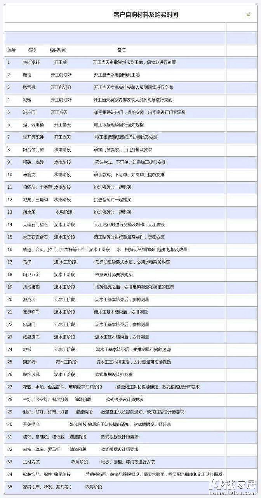

# 材料购买流程

# 装西游流程

**毛坯房装修顺序：**

(1) 主体改拆

(2) 水电改造

(3) 包管道

(4) 贴砖

(5) 木工(垭口等)

(6) 刷油

(7) 刷墙漆或贴壁纸

(8) 安装插座面板

(9) 厨卫吊顶

(10) 厨柜

(11) 安装成品门

(12) 安装灯具、洁具、卫浴五金件

(13) 安装晾衣架、窗轨

(14) 地板

(15) 散热器

(16) 开荒保洁

(17) 家具、家电

(18) 窗帘、床品

