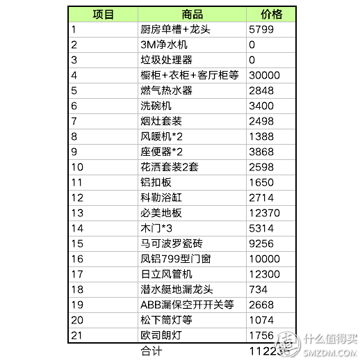
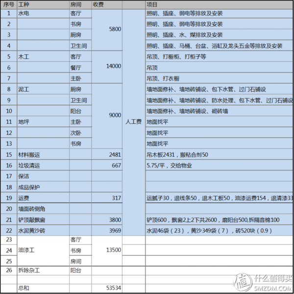
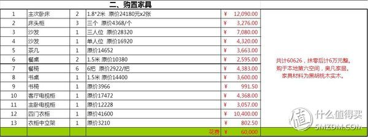
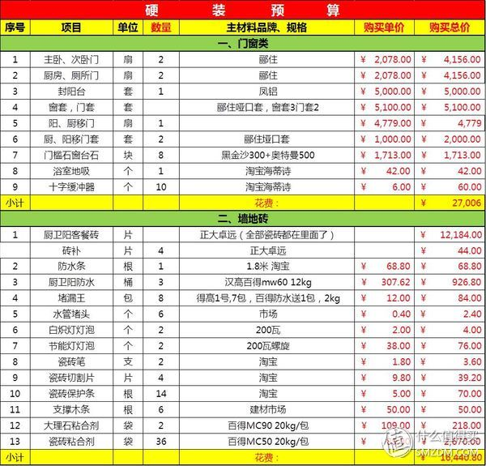
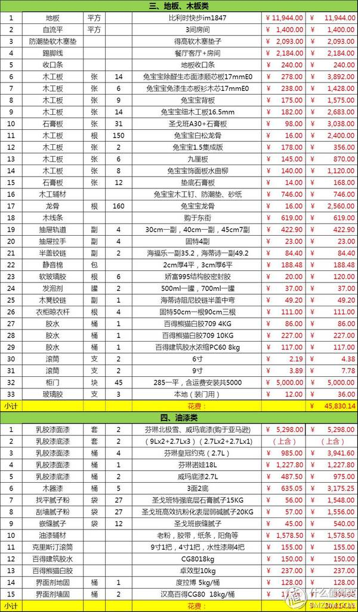
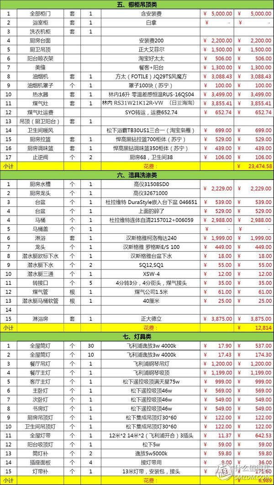
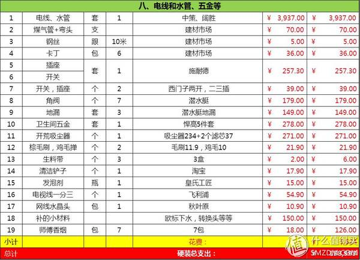

* [ 137平三居室](http://www.zxdyw.com/HTML/2017/6/20176191707121137183.html)

  ```
  硬装：
  黄沙水泥5000
  石膏板1000
  滑石粉+腻子粉1300
  水管电线8000
  五金插座2000
  木条1000
  衣柜等柜体多层板+欧睿宇邦橱柜定制(砍价后3米套餐4000多 模压板 轻松装活动订的 我们家是4米的)12000
  柜子铰链拉手1000
  柜门7000
  房门+门框14000
  封阳台及6个窗户15000
  瓷砖(2个卫生间、阳台及厨房 淘宝订的长谷瓷砖 要清单的留邮箱)12000
  地板(北美枫情的实木复合地板 轻松装活动订的 实木踢脚线是送的 )11000
  石膏线2500
  洗衣机柜1400
  烟机灶台水槽+热水器(这些也都是轻松装订的，老板的烟机灶具，砍价下来6000，要型号可以私信我，摩恩双槽+龙头+沥水篮什么的1100，能率热水器特价款16L是2700 很划算，家里也够用 总共9800)
  油漆涂料4000 人工58000
  卫生间浴室柜浴霸花洒*2=10000
  淋浴房*2=6000
  马桶*2=5000
  美缝5000
  中央空调10000
  小计：202000
  软装：
  家具82000
  冰箱洗衣机彩电+挂式空调*3=24000
  窗帘飘窗10000
  顶灯吊灯台灯等灯7500
  客厅画+地毯3000
  床垫*3=5400
  房间装饰画1300
  床品等其它软装8000
  小计：141200
  合计：343200(差不多是这样啦各种单据太繁琐没有仔细加~还有其他散的凑上35W有的) 
  ```

  ​


```

    dynabook ：

    二线城市市中心（放北京就是天安门的位置）60平建筑面积的一室，开始装修就预算无上限，都用最好的，自动温控地暖，霍尼韦尔+曼瑞德新风系统(受屋顶可用面积限制，没使用热回收系统新风）全屋三套高仪次顶级系列龙头，铂浪高花岗岩厨盆，垃圾处理，西门子洗碗，能率13l燃气热水器，方太风魔方JQ02T燃具，四套杜亚电动窗帘，杜亚管状电机改造的升降晾衣架（屋顶可用面积限制，没有可买到成品），1.5P松下变频空调*2，佳尼特无桶反渗透+沁园前置，给1.6万全自动自动制冰三星冰箱单配了套爱惠浦净水，海淘一套i7顶配dell一体机、一套Intel 三代NUC。总价全部24万拎包入住。

    2
    starrySZ ：

    90平预算30万，3，4月装修，看了你的费用心里真有底！

    3
    dynabook ：

    这是15年底的价格，像一些拆墙、新风管安装，灯具、五金、插座、地暖温控的安装都是自己干的，龙头都是德淘的，烟机灶具，热水器、空调、洗衣机、洗碗机都是提前1年半蹲守值得买，买的都是史低。如果不提前布局和都找工人干的话，成本至少再加4万

嗯。。。。。。又开始发抖了。。。。

```


https://post.smzdm.com/p/661438/

看着像130


```
支出概览（硬装部分安装完毕预计20万左右）：

半包费用：5.5万（辅料人工全包。其他水电工程，含水电主材。轻钢龙骨吊顶全包，全屋多乐士涂料。貌似就这些）。

双十一花费：77235元（表格见上文）

厨房橱柜+客厅电视柜等：20000

主卧+次卧衣柜：15000

2个浴室柜：5000左右

小米净水器：算799（3M净水器2手卖了1000）

厨房门：5000多

原价骊住门：2760

吊灯：400左右

铜条：300多

其他：五金+2个空调挂机+补地板等不知道花到哪里去了装修装得人憔悴，心力交瘁还后悔！记此次装修总结与分享 
```


## 拒绝花开富贵：大半年硬装毕业的一点点心得体会

https://post.smzdm.com/p/481709/

共计：248534

```

    yes208 ：

    究竟最后的硬装总支出是多少啊？？？？？

    2
    大岛优优子（作者） ：

    加上家具27.8 
```


三室两厅一卫，实际面积看着像115。

* 人工 - 53534

  

* 家具 - 60000

  

* 硬装 - 135000

  * 门窗 - 27006
  * 墙地砖 - 16440
  * 地板、木板 - 45830
  * 油漆 - 20360 （模糊）
  * 橱柜吊顶 - 23474
  * 洁具洗涤 - 12814
  * 灯具 - 6989
  * 电线水管五金等 - 5623













