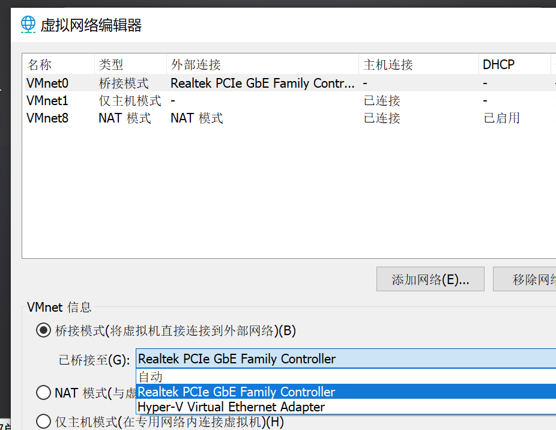

# devices

## USB

### 一些问题

#### linux无法识别usb

默认对于linux是兼容usb 2.0，所以3.0的无法识别。

可以设置为兼容3.0，但（提示了）需要linux内核3.2以上版本。

#### usb设备默认连接到哪台虚拟机

没办法直接编辑设置，而是在“新插入usb设备”时，选择并且记忆。 很麻烦。

fusion好像可以编辑设置。 virtualbox也可以。

参见： https://docs.vmware.com/en/VMware-Workstation-Pro/15.0/com.vmware.ws.using.doc/GUID-06E14969-21F2-4AB1-9E48-1974C28894BE.html#GUID-06E14969-21F2-4AB1-9E48-1974C28894BE

该“记忆”可以删除，参见： https://docs.vmware.com/en/VMware-Workstation-Pro/15.0/com.vmware.ws.using.doc/GUID-A2D17720-C0CA-4636-BAFB-6DBC21F7FAC8.html#GUID-A2D17720-C0CA-4636-BAFB-6DBC21F7FAC8

# network

## 一些问题

### bridge没能分配IP

发现是这个桥接的外部连接的auto失效了。。。

手动设置为真实网卡后就好了。。。

# install

