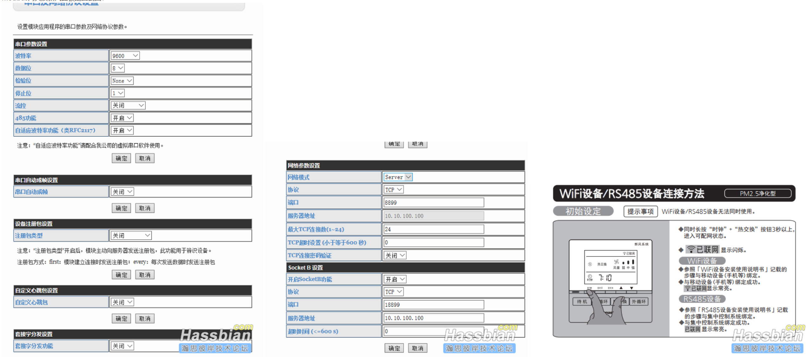

2020年5月9日更新： 

结合论坛内的小米新风界面，给了我思路用select控件可以做选项。我对程序作了一个小优化，包括滤芯剩余时间和风量、模式选择。

先上图：

其实根据modbus码表，还可以设置定时、清零等功能，这个我也暂时没有的动力去捣鼓了。 

如果有条件的用户，可以把我的程序进行尝试，看看还有bug没，不足之处望多指正！ 

另：附件内的node-red数据库和config文件本次都有更新。   

-------------------------------------------------------------

  2020年1月15日更新，把插件配置做了几个更新。近期发现经常服务宕机，所以做了一些修改，最新的配置附件已更新，有空可以试试。

-------------------------------------------------------------  先和各位前辈、技术达人声明：本人老白兔一枚，虽然在论坛里呆了蛮久，但实在苦于基础薄弱，没办法做出一些实用的东西来。我通过论坛学习，转换成自己可控的办法实现了松下新风机通过485模块接入系统的简单方法。   

**这是新人贴，我想先介绍一下我自己整体系统架构。2018年6月一个偶然的巧合接触到开源的hassio系统，刚开始用树莓派做主机，拿着米家、博联的一些设备接入，测试了半年多感觉很不错。主要今年家中装修，自己非常想试探一种很成熟的智能控制方案。成品智能家居这几年的发展中，无线控制是一个非常好的导向，优点我就不多赘述，但是也存在很大的弊端：1、同频干扰；2、信号衰减；3、各品牌只有通过网关对接，无法做到完全的接口开放。（从我2013年试用南京物联传感的产品，与施耐德奇胜的zigbee面板对比，差距非常大，做工看似精致细节不可推敲，内部用的塑料材质很容易断裂，整体系统响应做的也不尽如人意，导致最终综合体验也很不好）。综上所述本人在智能家居系统选用上面也是煞费苦心。最终觉得在有条件的情况下，总线控制（尤其是输出附在端）的系统架构会比较稳定。**   

**我和crestron/amx/c4打交道比较多。最早Crestron的av2/av3中控主机都用过。换位思考，站在集成商的角度来看，这类高端会议主机稳定性都很强。不过站在业主角度，这一类中控系统模板太死板，而且如果用原厂的继电器、可控硅或者说是网关转换模块，价格非常高。国产也有不少厂家做modbus或者自行开发的485设备，成本很低，功能很强大，甚至能兼容主流的高端中控主机，但国产小厂生产的产品稳定性和可持续性有待商榷，说不定选用了之后，过两年停产就讨厌了。总线系统中，还有一种就是欧洲人用的比较多的knx,主要以施耐德、ABB、西门子这类元器件大厂家为首的东西。这类产品价格比国产485模块要高，但是协议通用，而且只要是knx协会认证的厂家，都可以通用。最终我自己的系统基础选用了knx架构作为基础。后端的自动化、远程控制之类的，就用群晖DS918+上的hassio系统。在hassio官网，knx的组件很早就做出来了，毕竟这个协议在国际属于通用的，所以国际上为它做的脚本也毕竟成熟。**   

本帖隐藏的内容 

言归正传，这个帖子主要介绍的是485接入松下新风系统。   装修最初，我就确定家里的暖通方案，大金中央空调+松下新风机，这个配置我想应该不落后。大金空调的接入，通过中弘网关来接入是完全可行的，虽然最近出了点问题，但我还是解决了。松下新风机组17年以后的型号，都可以有wifi或者485选配件，作为中控对接的桥梁。   先介绍一下我的新风机的选型，松下**FY-25ZDP1C**。这款带2个PM2.5净化的滤网，价格也非常美丽就是咯。原先暖通承包商给我推荐的是松下**FY-E25PMA**,这个是14年的型号，没有中控单独的接口，开关上也是强电控制。如果用这一块，接入系统的话，需要通过本地的一些继电器模块改装，会非常麻烦。开关是小事，尤其是在风速大小调节上，逻辑会比较复杂。最重要的是，强电控制中我得不到设备本身的真反馈。（有时候，机电设备要相信厂家，厂家自成系统的东西是比较靠谱的，真反馈可以看出故障所在）。**这部分一定一定要注意，很多用松下新风的朋友，不是所有的机组都可以加装485模块的，一定要搞清楚型号再买，否则无法适配。**     

下面是这款新风说明书上和实际安装的样子： 

松下电气做东西确实比较精细，从说明书上就能看出来。新风机滤网的位置按照正装、反装都标的清清楚楚。下面是485协议的说明文件，其实这是标准的modbus协议。modbus在工控领域使用的非常广泛，但弊端就是速度太慢。不过对于智能家居单个控制一个主机，这个响应速度完全能够适配。 

从modbus码表中可以了解，无论是单纯的开关控制、还是模式切换（内循环、外循环和热交换），亦或是滤网清洗提醒、时间矫正等信息，通过规约都可以与主机通讯设置，最关键的还是每个指令出去后，可以从状态中读取到**真反馈。**这种方式集成的办法还是比较靠谱的。本来新风我想套用论坛里的原型进行修改（参考贴：），后来苦于对python不熟悉，修改都不会。之后在论坛中搜索“modbus”关键字，发现用node-red方式控制会相对简单一点，图形化编程，而且modbus有现成的模板。原理是这样的：

1、搭建MQTT服务；

2、通过node-red中的modbus组件，和modbus-tcp网关通讯，给新风机发送/接收报文指令；

3、在node-red中，加入mqtt开关节点，控制新风机组；4、config文件中，加入几个开关，在界面中做一个专门控制新风的card，就实现了一个新风控制的小插件。   

下面是接线、调试方法的介绍：   

1、新风机485模块进网络：   

因为装修中，暖通施工人员少放了根两芯线线，导致我无法通过使用有线的串口服务器。不过，现在串口转wifi的模块现在市面上有很多，我就选了2个买回来测试，全部是论坛里面有推荐的。第一款是上海汉枫做的小精灵，第二款是有人modbus网关。新风机吊顶上面我放了一个插座，目的就是为了给串口服务器供电。小精灵的外观和价格都很不错，但是信号太差了，安装在吊顶内wifi信号就几乎没有，ping值大概在1200上下，还经常ping不通。之后果断用了有人的模块。设置非常简单，直接设为modbus-rtu即可。 

汉风串口服务器： 

有人串口服务器： 

modbus网关及新风面板配置截图： 

注意：一旦modbus网关配置完成后，建议先拿串口调试精灵之类的，用modbus代码试一下开关功能，看看是否完好。若果正常按照码表上的代码和地址发出报文，新风控制器能够动作即可。（注：“已联网”标记只有在有正确通讯代码来回才会显示，如果闪烁的话也不要担心）   

2、node-red中增加modbus节点：   node-red自带modbus-write和modbus-read节点。这里要注意一下，一定要填写好modbus网关的地址，配置注意点如截图： 

主要对node-red编程不是非常熟悉，我用自己的理解通过笨办法，做了一套简单的程序，用实体开关的形式，做了一个新风控制的面板。最早参考论坛，我想用MQTT中的Fan组件去调用新风，但是发现根本没法设置模式。其实Fan组件修改一下是可以的，但我不会。后来想，其实新风操作，对我来说就是2个概念：1、开关机组；2、运转模式调整。这中间我连风量都不需要调整，毕竟开了风机就是用最大风量去驱动。模式切换如果用开关量的方式去做的话，需要在node-red中做一个简单的互锁，这个是几个注意点。   

根据这个思路，我结合了最近正在了解的lovecale界面制作，用插件做了个小面板： 

附件中，我把我的node-red配置和界面分享一下。

参考了很多帖子才做出来这个组件的，链接如下：

1、这个帖子解释了如何用node-red去调用modbus数据：https://bbs.hassbian.com/forum.php?mod=viewthread&tid=5218  

2、这个帖子，我从头看到尾，一步步了解node-red怎么去使用，虽然只能领会皮毛：https://bbs.hassbian.com/forum.php?mod=viewthread&tid=2391 

3、土豆的界面帖子对我来说有指导意义：https://bbs.hassbian.com/forum.php?mod=viewthread&tid=7569 ** 

**第一次发帖，感觉漏洞百出，连代码都不会粘。希望各位大大们多多指正，**后续我会努力完善！松下新风界面上肯定还有很大的提升空间，希望有大神能够优化一下~~

[附件新风配置](xinfeng_config.zip)