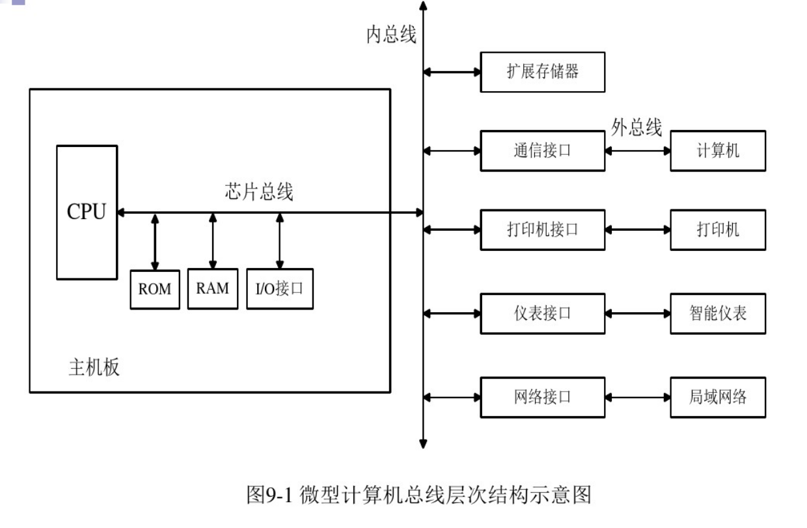

## intro

**总线分类：**

1. 总线按**功能和规范**可分为五大类型：数据总线、地址总线、控制总线、扩展总线及局部总线。

   数据总线、地址总线和控制总线也统称为系统总线，即通常意义上所说的总线。常见的数据总线为ISA、EISA、VESA、PCI等。

   地址总线：是专门用来传送地址的，由于地址只能从CPU传向外部存储器或I/O端口，所以地址总线总是单向三态的，这与数据总线不同，地址总线的位数决定了CPU可直接寻址的内存空间大小。

   控制总线：用来传送控制信号和时序信号。控制信号中，有的是微处理器送往存储器和I/O接口电路的；也有是其它部件反馈给CPU的，比如：中断申请信号、复位信号、总线请求信号、设备就绪信号等。

2. 按照**传输数据的方式**划分，可以分为串行总线和并行总线。串行总线中，二进制数据逐位通过一根数据线发送到目的器件；并行总线的数据线通常超过2根。常见的串行总线有SPI、I2C、USB及RS232等。

3. 按照**时钟信号是否独立**，可以分为同步总线和异步总线。同步总线的时钟信号独立于数据，而异步总线的时钟信号是从数据中提取出来的。SPI、I2C是同步串行总线，RS232采用异步串行总线。

4. 微机中总线一般有**内部总线、系统总线和外部总线**

   * **内部总线**是微机内部各外围芯片与处理器之间的总线，用于芯片一级的互连；
     * I2C
     * SCI
     * IIS
     * SPI
     * UART
     * JTAG
     * CAN
     * SDIO
     * GPIO

   * 而**系统总线**是微机中各插件板与系统板之间的总线，用于插件板一级的互连（也叫 板级总线）；
     * ISA
     * EISA
     * VESA
     * PCI

   * **外部总线**则是微机和外部设备之间的总线，微机作为一种设备，通过该总线和其他设备进行信息与数据交换，它用于设备一级的互连。
     * RS-232-C
     * RS-485
     * IEEE-488
     * USB

I2C总线：I2C（Inter-IC）总线10多年前由Philips公司推出，是近年来在微电子通信控制领域广泛采用的一种新型总线标准。它是同步通信的一种特殊形式，具有接口线少，控制方式简化，器件封装形式小，通信速率较高等优点。在主从通信中，可以有多个I2C总线器件同时接到I2C总线上，通过地址来识别通信对象。

 

SCI总线：串行通信接口SCI也是由Motorola公司推出的。它是一种通用异步通信接口UART，与MCS-51的异步通信功能基本相同。

 

IIS：I2S（Inter-IC Sound  Bus）是飞利浦公司为数字音频设备之间的音频数据传输而制定的一种总线标准。I2S有3个主要信号：1.串行时钟SCLK，也叫位时钟，即对应数字音频的每一位数据，SCLK有1个脉冲。2.帧时钟LRCK，用于切换左右声道的数据。LRCK为“1”表示正在传输的是左声道的数据，为“0”则表示正在传输的是右声道的数据。3.串行数据SDATA，就是用二进制补码表示的音频数据。有时为了使系统间能够更好地同步，还需要另外传输一个信号MCLK，称为主时钟，也叫系统时钟（Sys Clock）。

 

SPI：SPI（Serial Peripheral  Interface：串行外设接口）;SPI是Motorola首先在其MC68HCXX系列处理器上定义的。SPI接口主要应用在EEPROM，FLASH，实时时钟，AD转换器，还有数字信号处理器和数字信号解码器之间。SPI接口是以主从方式工作的，这种模式通常有一个主器件和一个或多个从器件，其接口包括以下四种信号：（1）MOSI – 主器件数据输出，从器件数据输入 （2）MISO – 主器件数据输入，从器件数据输出 （3）SCLK – 时钟信号，由主器件产生（4）/SS – 从器件使能信号，由主器件控制。

 

UART：UART（Universal Asynchronous Receiver  Transmitter：通用异步收发器）。将由计算机内部传送过来的并行数据转换为输出的串行数据流。将计算机外部来的串行数据转换为字节，供计算机内部使用并行数据的器件使用。在输出的串行数据流中加入奇偶校验位，并对从外部接收的数据流进行奇偶校验。在输出数据流中加入启停标记，并从接收数据流中删除启停标记。处理由键盘或鼠标发出的中断信号（键盘和鼠票也是串行设备）。可以处理计算机与外部串行设备的同步管理问题。有一些比较高档的UART还提供输入输出数据的缓冲区。常用TXD，RXD，/RTS，/CTS。

 

JTAG：JTAG （Joint Test Action Group  联合测试行动小组）是一种国际标准测试协议（IEEE1149.1兼容），主要用于芯片内部测试。标准的JTAG接口是4线：TMS、TCK、TDI、TDO，分别为模式选择、时钟、数据输入和数据输出线。测试复位信号（TRST，一般以低电平有效）一般作为可选的第五个端口信号。一个含有JTAGDebug接口模块的CPU，只要时钟正常，就可以通过JTAG接口访问CPU的内部寄存器和挂在CPU总线上的设备，如FLASH，RAM，内置模块的寄存器，象UART，Timers，GPIO等等的寄存器。

 

CAN：CAN全称为“Controller Area  Network”，即控制器局域网，是国际上应用最广泛的现场总线之一。最初，CAN被设计作为汽车环境中的微控制器通讯，在车载各电子控制装置ECU之  间交换信息，形成汽车电子控制网络。比如：发动机管理系统、变速箱控制器、仪表装备、电子主干系统中，均嵌入CAN控制装置。一个由CAN总线构成的单一网络中，理论上可以挂接无数个节点。实际应用中，节点数目受网络硬件的电气特性所限制。例如，当使用Philips P82C250作为CAN收发器时，同一网络中允许挂接110个节点。CAN  可提供高达1Mbit/s的数据传输速率，这使实时控制变得非常容易。另外，硬件的错误检定特性也增强了CAN的抗电磁干扰能力。

 

SDIO：SDIO是SD型的扩展接口，除了可以接SD卡外，还可以接支持SDIO接口的设备，插口的用途不止是插存储卡。支持  SDIO接口的PDA，笔记本电脑等都可以连接象GPS接收器，Wi-Fi或蓝牙适配器，调制解调器，局域网适配器，条型码读取器，FM无线电，电视接收 器，射频身份认证读取器，或者数码相机等等采用SD标准接口的设备。

 

GPIO：GPIO （General Purpose Input Output  通用输入/输出）或总线扩展器利用工业标准I²C、SMBus™或SPI™接口简化了I/O口的扩展。当微控制器或芯片组没有足够的I/O端口，或当系统 需要采用远端串行通信或控制时，GPIO产品能够提供额外的控制和监视功能。

### 总线标准

* IEEE

  * IEEE-488
  * RS-232C
  * 。。。

* 因广泛应用而被接受和公认的标准（产业、市场倒逼。。）

  * S-100

  * IBM PC/XT

    62线

  * ISA（AT）

    XT -扩展-> 62 + 36线 

  * EISA

    ISA -> EISA（接近200条），数据 16 -> 32 位，地址 24 -> 32 位

  * PCI

    * V2.0 支持32/64位数据总线，时钟25-33MHz，数据传输速率达132~264MB/s
    * V2.11 支持64位数据总线，66MHz，528MB/s

## PCI

英文全称：Peripheral Component Interconnect  
 设计者：    Intel 
 发布时间：1992 
 连接对象：芯片组与网卡、声卡、Modem等设备 
 带宽：133MB/s 
 备注：已被PCI-E取代，但一些主流主板上仍保留PCI接口

PCI（peripheralcomponentinterconnect）总线是当前最流行的总线之一，它是由Intel公司推出的一种局部总线。它定义了32位数据总线，且可扩展为64位。PCI总线主板插槽的体积比原ISA总线插槽还小，其功能比VESA、ISA有极大的改善，支持突发读写操作，最大传输速率可达132MB/s，可同时支持多组外围设备。PCI局部总线不能兼容现有的ISA、EISA、MCA（microchannelarchitecture）总线，但它不受制于处理器，是基于奔腾等新一代微处理器而发展的总线。

## PCI-E

英文全称：Peripheral Component Interconnect Express 
 设计者：    Intel 
 连接对象：CPU与**显卡**，芯片组与SSD、网卡、声卡等设备 
 带宽：

| 版本              | 单总线       | 16条总线(PCI-E  x16) |
| ----------------- | ------------ | -------------------- |
| 1.x (2002)        | 2Gbit/s      | 40Gbit/s             |
| 2.x  (2007)       | 4Gbit/s      | 64Gbit/s             |
| 3.0  (2010)       | 7.877Gbit/s  | 126.032Gbit/s        |
| 4.0  (可能是2017) | 15.754Gbit/s | 252.065Gbit/s        |

## USB

英文全称：Universal Serial Bus
设计者： Compaq, DEC, IBM, Intel, Microsoft, NEC and Nortel
连接对象：芯片组与外围设备(键鼠、Camera、U盘等)
备注：USB Type-C 是一种新型的连接器
带宽：

| 版本           | 带宽     |
| -------------- | -------- |
| USB 2.0 (2000) | 35MB/s   |
| USB 3.0 (2008) | 400MB/s  |
| USB 3.1 (2013) | 1.21GB/s |

它基于通用连接技术，实现外设的简单快速连接，达到方便用户、降低成本、扩展PC连接外设范围的目的。它可以为外设提供电源，而不像普通的使用串、并口的设备需要单独的供电系统。

## SATA

英文全称：Serial Advanced Technology Attachment 
 设计者：    Intel、IBM、Dell、APT、Maxtor和Seagate等 
 连接对象：芯片组与大容量存储设备 
 带宽：

| 版本            | 带宽     |
| --------------- | -------- |
| SATA 3.0 (2009) | 600MB/s  |
| SATA 3.2 (2013) | 1969MB/s |

## VESA

VESA（videoelectronicsstandardassociation）总线是1992年由60家附件卡制造商联合推出的一种局部总线，简称为VL（VESAlocalbus）总线。它的推出为微机系统总线体系结构的革新奠定了基础。该总线系统考虑到CPU与主存和Cache的直接相连，通常把这部分总线称为CPU总线或主总线，其他设备通过VL总线与CPU总线相连，所以VL总线被称为局部总线。它定义了32位数据线，且可通过扩展槽扩展到64位，使用33MHz时钟频率，最大传输率达132MB/s，可与CPU同步工作。是一种高速、高效的局部总线，可支持386SX、386DX、486SX、486DX及奔腾微处理器。

## ISA

ISA（industrialstandardarchitecture）总线标准是IBM公司1984年为推出PC/AT机而建立的系统总线标准，所以也叫AT总线。它是对XT总线的扩展，以适应8/16位数据总线要求。它在80286至80486时代应用非常广泛，以至于现在奔腾机中还保留有ISA总线插槽。ISA总线有98只引脚。

## EISA

EISA总线是1988年由Compaq等9家公司联合推出的总线标准。它是在ISA总线的基础上使用双层插座，在原来ISA总线的98条信号线上又增加了98条信号线，也就是在两条ISA信号线之间添加一条EISA信号线。在实用中，EISA总线完全兼容ISA总线信号。

## RS-232-C

RS-232-C总线：RS-232-C是美国电子工业协会EIA制定的一种串行物理接口标准。RS是英文“推荐标准”的缩写，232为标识号，C表示修改次数。RS-232-C总线标准设有25条信号线，包括一个主通道和一个辅助通道，在多数情况下主要使用主通道，对于一般双工通信，仅需几条信号线就可实现，如一条发送线、一条接收线及一条地线。RS-232-C标准规定的数据传输速率为每秒50、75、100、150、300、600、1200、2400、4800、9600、19200波特。RS-232-C标准规定，驱动器允许有2500pF的电容负载，通信距离将受此电容限制，例如，采用150pF/m的通信电缆时，最大通信距离为15m；若每米电缆的电容量减小，通信距离可以增加。传输距离短的另一原因是RS-232属单端信号传送，存在共地噪声和不能抑制共模干扰等问题，因此一般用于20m以内的通信。

 

## RS-485

RS-485总线：在要求通信距离为几十米到上千米时，广泛采用RS-485串行总线标准。RS-485采用平衡发送和差分接收，因此具有抑制共模干扰的能力。加上总线收发器具有高灵敏度，能检测低至200mV的电压，故传输信号能在千米以外得到恢复。RS-485采用半双工工作方式，任何时候只能有一点处于发送状态，因此，发送电路须由使能信号加以控制。RS-485用于多点互连时非常方便，可以省掉许多信号线。应用RS-485可以联网构成分布式系统，其允许最多并联32台驱动器和32台接收器。

 

## IEEE-488

IEEE-488总线：IEEE-488总线用来连接系统，如微计算机、数字电压表、数码显示器等设备及其他仪器仪表均可用IEEE-488总线装配起来。它按照位并行、字节串行双向异步方式传输信号，连接方式为总线方式，仪器设备直接并联于总线上而不需中介单元，但总线上最多可连接15台设备。最大传输距离为20米，信号传输速度一般为500KB/s，最大传输速度为1MB/s。

 